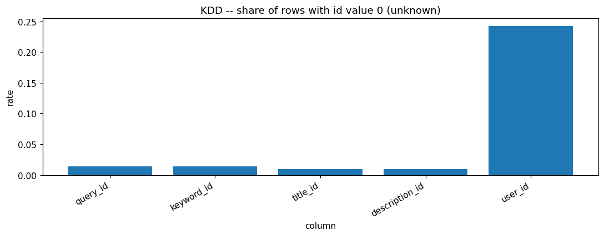
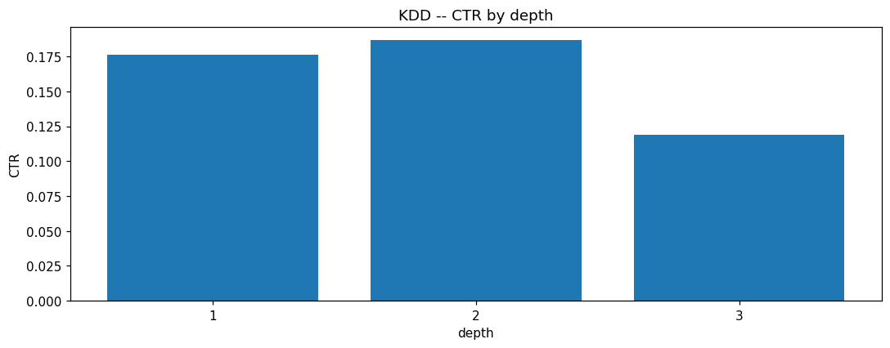
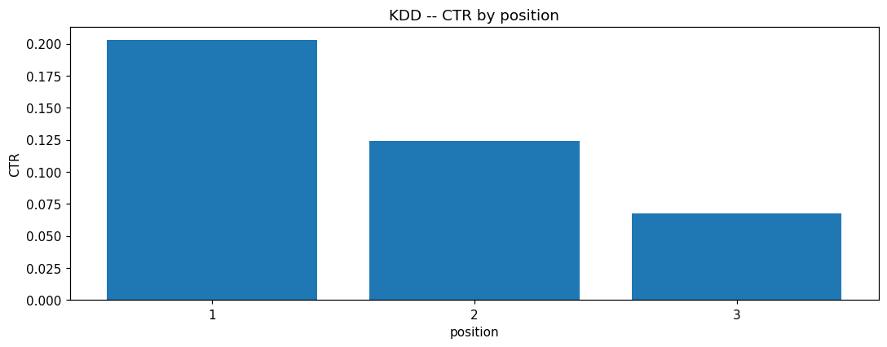
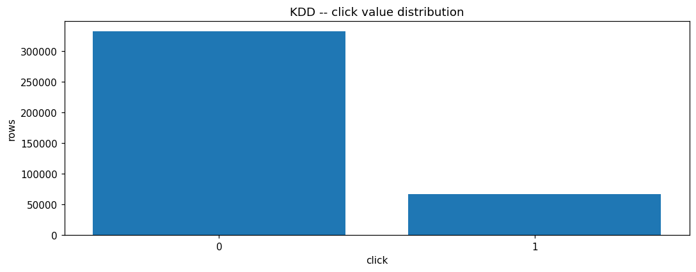
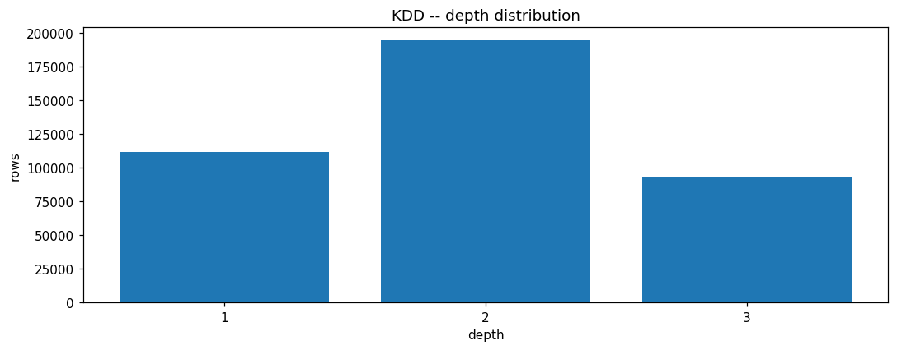
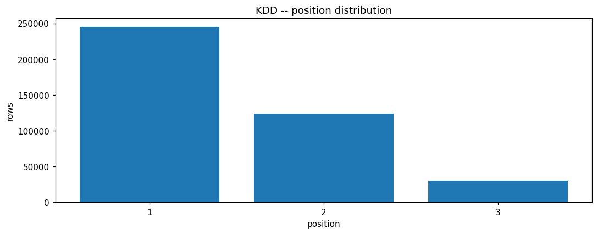
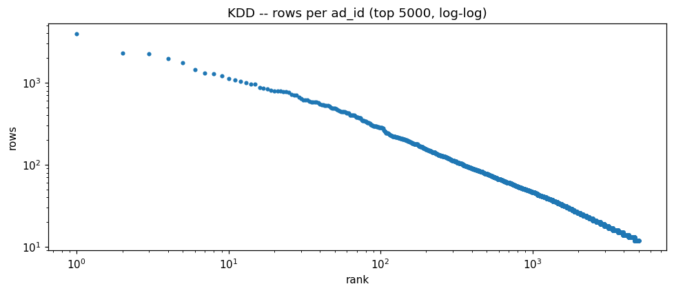
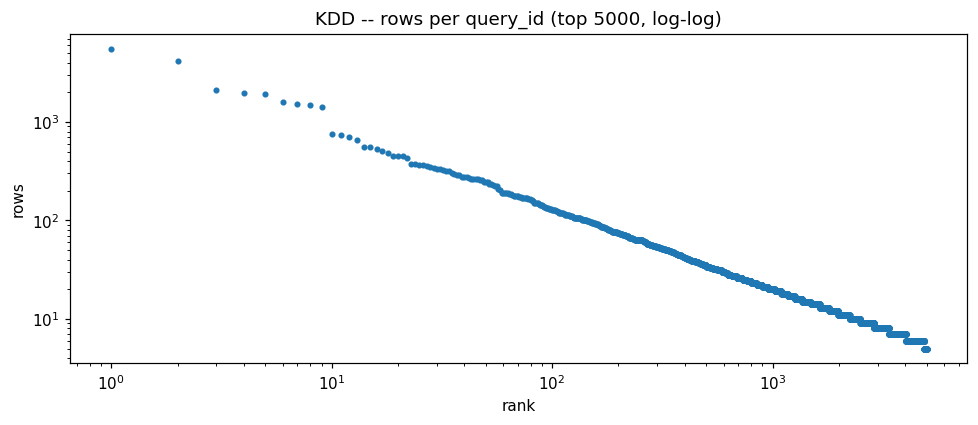
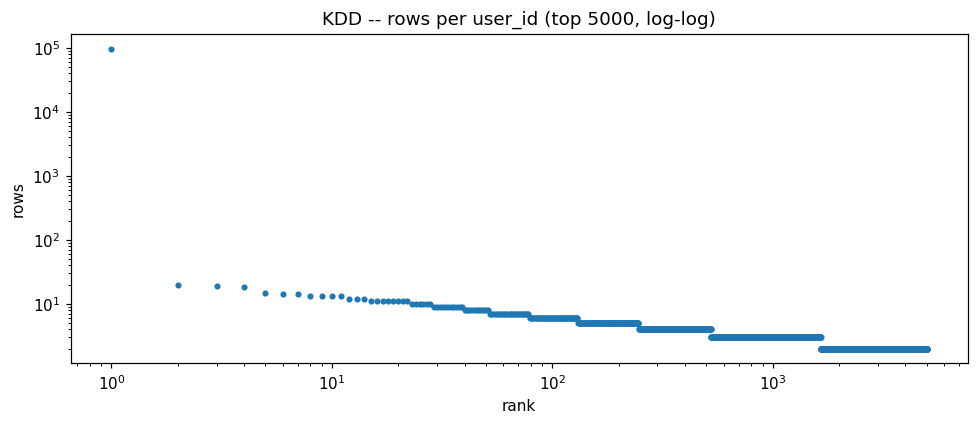

# KDDCUP2012 EDA PROFILE

_Auto-generated by the Phase 3 EDA notebooks (`databricks/eda/kddcup2012/`). One `## ` section per notebook; re-running a notebook replaces its own section, other sections are preserved._

<!-- BEGIN kddcup2012:01_click_prediction -->
## KDD Cup 2012 click prediction (kddcup2012_click_prediction)

### Profile

| column | missing | rate | approx_distinct |
|---|---|---|---|
| click | 0 | 0.0000 | 2 |
| impression | 0 | 0.0000 | 316 |
| url_hash | 0 | 0.0000 | 15870 |
| ad_id | 0 | 0.0000 | 82684 |
| advertiser_id | 0 | 0.0000 | 11225 |
| depth | 0 | 0.0000 | 3 |
| position | 0 | 0.0000 | 3 |
| query_id | 0 | 0.0000 | 260169 |
| keyword_id | 0 | 0.0000 | 92808 |
| title_id | 0 | 0.0000 | 153596 |
| description_id | 0 | 0.0000 | 139384 |
| user_id | 0 | 0.0000 | 276321 |

Rows: 399482. Columns: ['click', 'impression', 'url_hash', 'ad_id', 'advertiser_id', 'depth', 'position', 'query_id', 'keyword_id', 'title_id', 'description_id', 'user_id']. Constant columns: none. No timestamp column exists in this dataset.

### Data Quality

Exact full-row duplicates: 2075.
Invalid click>impression rows: 0.
Invalid position>depth rows: 0.
Context keys (all cols except click/impression) with >1 row: 2062, of which conflicting click labels: 0.

id value 0 = 'unknown' sentinel, row counts:

| column | zero rows | rate |
|---|---|---|
| query_id | 5547 | 0.0139 |
| keyword_id | 5539 | 0.0139 |
| title_id | 3978 | 0.0100 |
| description_id | 3978 | 0.0100 |
| user_id | 96956 | 0.2427 |

### Entities / Keys

Approx distinct per id column:

| column | approx_distinct |
|---|---|
| url_hash | 15870 |
| ad_id | 82684 |
| advertiser_id | 11225 |
| query_id | 260169 |
| keyword_id | 92808 |
| title_id | 153596 |
| description_id | 139384 |
| user_id | 276321 |

Concentration (share of all rows held by the top entities):

| entity | approx_distinct | top-10 share | top-50 share |
|---|---|---|---|
| ad_id | 82684 | 0.0466 | 0.1157 |
| advertiser_id | 11225 | 0.2693 | 0.4310 |
| query_id | 260169 | 0.0563 | 0.0939 |
| user_id | 276321 | 0.2431 | 0.2440 |

### Relationships

Entity relationship cardinalities (from approx_count_distinct of child per parent) are printed in the 'Entity relationships' cell; advertiser->ad and query->keyword/ad are 1:N, ad->advertiser is effectively 1:1.

### Distributions

Overall CTR (sum click / sum impression): 0.08935478199718706.
Class balance: positive rows (click>0) = 67089 (16.7940%), negative = 332393 (83.2060%); neg:pos imbalance = 5.0:1.

click marginal: [('0', 332393), ('1', 67089)]
depth marginal: [('1', 111753), ('2', 194337), ('3', 93392)]
position marginal: [('1', 244910), ('2', 124182), ('3', 30390)]
impression marginal (top 25 by row count):
- 1: 338348
- 2: 36322
- 3: 10163
- 4: 4427
- 5: 2385
- 6: 1592
- 7: 983
- 8: 712
- 9: 515
- 10: 403
- 11: 318
- 12: 276
- 13: 215
- 14: 198
- 15: 176
- 17: 144
- 18: 120
- 16: 118
- 19: 117
- 20: 108
- 21: 79
- 22: 79
- 23: 73
- 26: 69
- 28: 68
- ... (302 more)
CTR by depth: [('1', 0.1765), ('2', 0.1866), ('3', 0.119)]
CTR by position: [('1', 0.2028), ('2', 0.1238), ('3', 0.0676)]

### EDA Findings

- 2075 exact duplicate rows.
- Material 'unknown' (id=0) rates: {'query_id': 0.0139, 'keyword_id': 0.0139, 'user_id': 0.2427}.
- Strong class imbalance (5.0:1 negative:positive).
- CTR declines with position and varies with depth (position/depth are useful features).

### Silver Implications

- Apply distinct on load to remove exact duplicate rows.
- Treat id value 0 as NULL/unknown for query_id, keyword_id, title_id, description_id, user_id.
- Silver grain: one row per ad impression event (context + click + impression).

### Figure -- KDD -- click class balance

### Figure -- KDD -- share of rows with id value 0 (unknown)

### Figure -- KDD -- CTR by depth

### Figure -- KDD -- CTR by position

### Figure -- KDD -- distinct value count per id column

### Figure -- KDD -- click count distribution

### Figure -- KDD -- depth distribution

### Figure -- KDD -- position distribution

### Figure -- KDD -- rows per ad_id (log-log)

### Figure -- KDD -- rows per query_id (log-log)

### Figure -- KDD -- rows per user_id (log-log)

<!-- END kddcup2012:01_click_prediction -->
