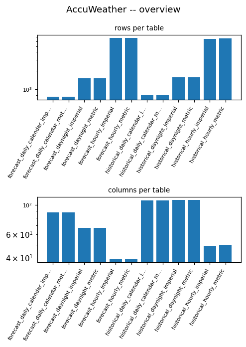
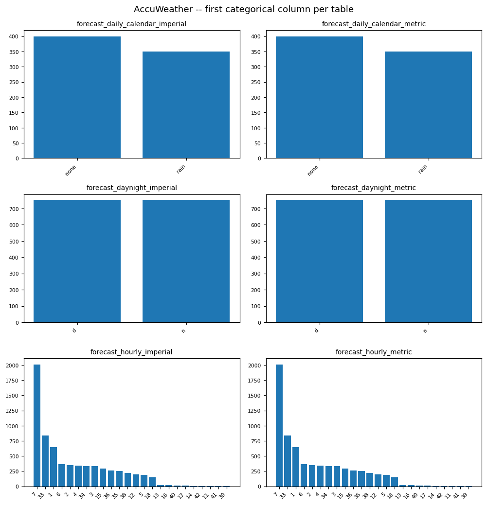

# ACCUWEATHER EDA PROFILE

_Auto-generated by the EDA notebooks (`databricks/eda/accuweather/`). One `## ` section per notebook; re-running a notebook replaces its own section, other sections are preserved._

<!-- BEGIN accuweather:01_accuweather -->
## AccuWeather tables (Samples: samples.accuweather)

### Profile

| table | period | grain | unit | rows | cols | size (bytes) | constant cols | all-missing cols |
|---|---|---|---|---|---|---|---|---|
| forecast_daily_calendar_imperial | forecast | daily_calendar | imperial | 750 | 88 | 129323 | 24 | 0 |
| forecast_daily_calendar_metric | forecast | daily_calendar | metric | 750 | 88 | 128997 | 26 | 2 |
| forecast_daynight_imperial | forecast | daynight | imperial | 1500 | 67 | 195794 | 14 | 0 |
| forecast_daynight_metric | forecast | daynight | metric | 1500 | 67 | 201237 | 14 | 0 |
| forecast_hourly_imperial | forecast | hourly | imperial | 6850 | 39 | 219534 | 7 | 0 |
| forecast_hourly_metric | forecast | hourly | metric | 6850 | 39 | 201691 | 8 | 0 |
| historical_daily_calendar_imperial | historical | daily_calendar | imperial | 800 | 108 | 149061 | 36 | 25 |
| historical_daily_calendar_metric | historical | daily_calendar | metric | 800 | 108 | 157017 | 36 | 25 |
| historical_daynight_imperial | historical | daynight | imperial | 1546 | 109 | 243710 | 34 | 25 |
| historical_daynight_metric | historical | daynight | metric | 1546 | 109 | 252329 | 34 | 25 |
| historical_hourly_imperial | historical | hourly | imperial | 6550 | 49 | 216242 | 19 | 15 |
| historical_hourly_metric | historical | hourly | metric | 6669 | 50 | 228656 | 19 | 15 |

### Provenance / Source Evidence

The tables are read in place from the Databricks Samples catalog (`samples.accuweather`); there is no Bronze table and no ECRMAP acquisition step.
Tables found: 12 -- ['forecast_daily_calendar_imperial', 'forecast_daily_calendar_metric', 'forecast_daynight_imperial', 'forecast_daynight_metric', 'forecast_hourly_imperial', 'forecast_hourly_metric', 'historical_daily_calendar_imperial', 'historical_daily_calendar_metric', 'historical_daynight_imperial', 'historical_daynight_metric', 'historical_hourly_imperial', 'historical_hourly_metric'].
Table comments in the catalog (each distinct comment shown once):
- shared by 12 tables (['historical_hourly_imperial', 'forecast_daynight_imperial', 'forecast_hourly_imperial'] (+9 more)):
  > View [listing on Databricks Marketplace.](/marketplace/consumer/listings/235b45d2-d625-4c1c-90a2-68e4568dda40)
  > These datasets are a sample collection of AccuWeather's enriched and comprehensive daily, 12-hour day-night, and hourly historical weather parameters. The sample contains one month of data for the top 50 global cities. Please note that this sample dataset represents a reduced portion of the available data attributes, volume, and data types available within AccuWeather's Data Suite and is intended 
  > Some examples these datasets can be explored include:
  > - Compare weather conditions across the top 50 global cities to identify regional patterns in temperature, precipitation, and other weather parameters.
  > - Create visualizations like time series plots, heatmaps, or box plots to better understand the distribution and weather variability.
  > - Explore correlations between different weather parameters within and across cities to understand how they are related.
  > - Investigate temporal trends by analyzing how weather fluctuates over time.
  > - Identify outliers in the data that could indicate extreme weather occurrences.
  > With more access to AccuWeather's Data Suite available on the Databricks Marketplace, users can leverage weather information in a number of ways which include some of the following:
  > - **Economic Risk & Impact Analysis**: Utilize historical weather data to determine relationships on business metrics that are trained to predict potential impacts, such as supply chain disruptions, labor productivity, and transportation delays.
  > - **Energy Demand Planning & Forecasting**: Inform energy supply and production forecasts for wind, solar, and hydro installations by integrating historical weather information helping to optimize resource allocation and reduce operational risks.
  > - **Revenue Projections & Consumer Behavior Analysis**: Join historical weather data with past business data to create more accurate sales growth predictions, accounting for weather-driven demand.
- No column comments in the catalog: column meanings and units come only from the names.
- Issue / extract-time columns (names containing issue, generated, fetch, created, updated, extract, snapshot, retriev): none. Time-zone-like columns: ['gmt_offset'].

### Structural Integrity

Table names encode three things: period (`forecast` / `historical`), grain (`daily_calendar`, `daynight`, `hourly`) and unit system (`imperial` / `metric`).
- `forecast_daily_calendar_imperial`: 88 columns -- numeric 80, string 3, time ['date']; location `city_name`; time key `date`; sub-key none.
- `forecast_daily_calendar_metric`: 88 columns -- numeric 78, string 5, time ['date']; location `city_name`; time key `date`; sub-key none.
- `forecast_daynight_imperial`: 67 columns -- numeric 56, string 6, time ['date']; location `city_name`; time key `date`; sub-key ['day_flag'].
- `forecast_daynight_metric`: 67 columns -- numeric 56, string 6, time ['date']; location `city_name`; time key `date`; sub-key ['day_flag'].
- `forecast_hourly_imperial`: 39 columns -- numeric 31, string 3, time ['datetime_valid_local']; location `city_name`; time key `datetime_valid_local`; sub-key none.
- `forecast_hourly_metric`: 39 columns -- numeric 31, string 3, time ['datetime_valid_local']; location `city_name`; time key `datetime_valid_local`; sub-key none.
- `historical_daily_calendar_imperial`: 108 columns -- numeric 77, string 28, time ['date']; location `city_name`; time key `date`; sub-key none.
- `historical_daily_calendar_metric`: 108 columns -- numeric 77, string 28, time ['date']; location `city_name`; time key `date`; sub-key none.
- `historical_daynight_imperial`: 109 columns -- numeric 77, string 29, time ['date']; location `city_name`; time key `date`; sub-key ['day_flag'].
- `historical_daynight_metric`: 109 columns -- numeric 77, string 29, time ['date']; location `city_name`; time key `date`; sub-key ['day_flag'].
- `historical_hourly_imperial`: 49 columns -- numeric 28, string 18, time ['date']; location `city_name`; time key `date`; sub-key none.
- `historical_hourly_metric`: 50 columns -- numeric 29, string 18, time ['datetime_valid_local']; location `city_name`; time key `datetime_valid_local`; sub-key none.

### Data Quality

Full-row exact duplicates, constant columns, all-missing columns and composite-key duplicates:
- `forecast_daily_calendar_imperial`: full-row duplicates 0; constant columns 24 ['degree_days_freezing', 'has_ice', 'has_precipitation', 'has_snow', 'ice_lwe_rate_avg', 'ice_lwe_rate_max', 'ice_lwe_rate_min', 'ice_lwe_total'] (+16 more); all-missing columns 0 none; key ['city_name', 'date'] duplicated 0 of 750 (0 identical, 0 conflicting).
- `forecast_daily_calendar_metric`: full-row duplicates 0; constant columns 26 ['degree_days_freezing', 'has_ice', 'has_precipitation', 'has_snow', 'ice_lwe_rate_avg', 'ice_lwe_rate_max', 'ice_lwe_rate_min', 'ice_lwe_total'] (+18 more); all-missing columns 2 ['visibility_avg', 'visibility_max']; key ['city_name', 'date'] duplicated 0 of 750 (0 identical, 0 conflicting).
- `forecast_daynight_imperial`: full-row duplicates 0; constant columns 14 ['degree_days_freezing', 'has_ice', 'has_snow', 'ice_lwe_total', 'ice_probability', 'index_uv_avg', 'minutes_of_ice_total', 'minutes_of_snow_total'] (+6 more); all-missing columns 0 none; key ['city_name', 'date', 'day_flag'] duplicated 0 of 1500 (0 identical, 0 conflicting).
- `forecast_daynight_metric`: full-row duplicates 0; constant columns 14 ['degree_days_freezing', 'has_ice', 'has_snow', 'ice_lwe_total', 'ice_probability', 'index_uv_avg', 'minutes_of_ice_total', 'minutes_of_snow_total'] (+6 more); all-missing columns 0 none; key ['city_name', 'date', 'day_flag'] duplicated 0 of 1500 (0 identical, 0 conflicting).
- `forecast_hourly_imperial`: full-row duplicates 0; constant columns 7 ['has_ice', 'has_snow', 'ice_lwe', 'precipitation_type_desc', 'snow', 'snow_liquid_ratio_accuweather', 'snow_lwe']; all-missing columns 0 none; key ['city_name', 'datetime_valid_local'] duplicated 0 of 6850 (0 identical, 0 conflicting).
- `forecast_hourly_metric`: full-row duplicates 0; constant columns 8 ['has_ice', 'has_snow', 'ice_lwe', 'precipitation_type_desc', 'snow', 'snow_liquid_ratio_accuweather', 'snow_lwe', 'visibility']; all-missing columns 0 none; key ['city_name', 'datetime_valid_local'] duplicated 0 of 6850 (0 identical, 0 conflicting).
- `historical_daily_calendar_imperial`: full-row duplicates 0; constant columns 36 ['degree_days_freezing', 'has_ice', 'has_rain', 'has_snow', 'ice_lwe_rate_avg', 'ice_lwe_rate_max', 'ice_lwe_rate_min', 'ice_lwe_total'] (+28 more); all-missing columns 25 ['has_ice', 'has_rain', 'ice_lwe_rate_avg', 'ice_lwe_rate_max', 'ice_lwe_rate_min', 'ice_lwe_total', 'minutes_of_ice_total', 'minutes_of_rain_total'] (+17 more); key ['city_name', 'date'] duplicated 0 of 800 (0 identical, 0 conflicting).
- `historical_daily_calendar_metric`: full-row duplicates 0; constant columns 36 ['degree_days_freezing', 'has_ice', 'has_rain', 'has_snow', 'ice_lwe_rate_avg', 'ice_lwe_rate_max', 'ice_lwe_rate_min', 'ice_lwe_total'] (+28 more); all-missing columns 25 ['has_ice', 'has_rain', 'ice_lwe_rate_avg', 'ice_lwe_rate_max', 'ice_lwe_rate_min', 'ice_lwe_total', 'minutes_of_ice_total', 'minutes_of_rain_total'] (+17 more); key ['city_name', 'date'] duplicated 0 of 800 (0 identical, 0 conflicting).
- `historical_daynight_imperial`: full-row duplicates 0; constant columns 34 ['has_ice', 'has_rain', 'has_snow', 'ice_lwe_rate_avg', 'ice_lwe_rate_max', 'ice_lwe_rate_min', 'ice_lwe_total', 'minutes_of_ice_total'] (+26 more); all-missing columns 25 ['has_ice', 'has_rain', 'ice_lwe_rate_avg', 'ice_lwe_rate_max', 'ice_lwe_rate_min', 'ice_lwe_total', 'minutes_of_ice_total', 'minutes_of_rain_total'] (+17 more); key ['city_name', 'date', 'day_flag'] duplicated 0 of 1546 (0 identical, 0 conflicting).
- `historical_daynight_metric`: full-row duplicates 0; constant columns 34 ['has_ice', 'has_rain', 'has_snow', 'ice_lwe_rate_avg', 'ice_lwe_rate_max', 'ice_lwe_rate_min', 'ice_lwe_total', 'minutes_of_ice_total'] (+26 more); all-missing columns 25 ['has_ice', 'has_rain', 'ice_lwe_rate_avg', 'ice_lwe_rate_max', 'ice_lwe_rate_min', 'ice_lwe_total', 'minutes_of_ice_total', 'minutes_of_rain_total'] (+17 more); key ['city_name', 'date', 'day_flag'] duplicated 0 of 1546 (0 identical, 0 conflicting).
- `historical_hourly_imperial`: full-row duplicates 0; constant columns 19 ['cloud_cover_high', 'cloud_cover_low', 'cloud_cover_medium', 'has_ice', 'has_rain', 'has_snow', 'ice_lwe', 'ice_lwe_rate'] (+11 more); all-missing columns 15 ['cloud_cover_high', 'cloud_cover_low', 'cloud_cover_medium', 'has_ice', 'has_rain', 'ice_lwe', 'ice_lwe_rate', 'minutes_of_ice'] (+7 more); key ['city_name', 'date'] duplicated 0 of 6550 (0 identical, 0 conflicting).
- `historical_hourly_metric`: full-row duplicates 0; constant columns 19 ['cloud_cover_high', 'cloud_cover_low', 'cloud_cover_medium', 'has_ice', 'has_rain', 'has_snow', 'ice_lwe', 'ice_lwe_rate'] (+11 more); all-missing columns 15 ['cloud_cover_high', 'cloud_cover_low', 'cloud_cover_medium', 'has_ice', 'has_rain', 'ice_lwe', 'ice_lwe_rate', 'minutes_of_ice'] (+7 more); key ['city_name', 'datetime_valid_local'] duplicated 0 of 6669 (0 identical, 0 conflicting).
Partly missing columns (rate above 5%, excluding all-missing):
- `forecast_daily_calendar_imperial`: none
- `forecast_daily_calendar_metric`: [('visibility_min', 0.983)]
- `forecast_daynight_imperial`: [('precipitation_type_desc_predominant', 0.615), ('solar_irradiance_total', 0.077)]
- `forecast_daynight_metric`: [('precipitation_type_desc_predominant', 0.615), ('solar_irradiance_total', 0.394)]
- `forecast_hourly_imperial`: [('precipitation_type_desc', 0.896)]
- `forecast_hourly_metric`: [('precipitation_type_desc', 0.896), ('visibility', 1.0)]
- `historical_daily_calendar_imperial`: [('cloud_base_height_avg', 0.228), ('cloud_base_height_max', 0.228), ('cloud_base_height_min', 0.228), ('minutes_of_snow_total', 0.985), ('snow_liquid_ratio_accuweather_avg', 0.985), ('snow_liquid_ratio_accuweather_max', 0.985), ('snow_liquid_ratio_accuweather_min', 0.985), ('snow_lwe_rate_avg', 0.985), ('snow_lwe_rate_max', 0.985), ('snow_lwe_rate_min', 0.985)] (+7 more)
- `historical_daily_calendar_metric`: [('cloud_base_height_avg', 0.228), ('cloud_base_height_max', 0.228), ('cloud_base_height_min', 0.228), ('minutes_of_snow_total', 0.985), ('snow_liquid_ratio_accuweather_avg', 0.985), ('snow_liquid_ratio_accuweather_max', 0.985), ('snow_liquid_ratio_accuweather_min', 0.985), ('snow_lwe_rate_avg', 0.985), ('snow_lwe_rate_max', 0.985), ('snow_lwe_rate_min', 0.985)] (+7 more)
- `historical_daynight_imperial`: [('cloud_base_height_avg', 0.307), ('cloud_base_height_max', 0.307), ('cloud_base_height_min', 0.307), ('minutes_of_snow_total', 0.988), ('snow_liquid_ratio_accuweather_avg', 0.988), ('snow_liquid_ratio_accuweather_max', 0.988), ('snow_liquid_ratio_accuweather_min', 0.988), ('snow_lwe_rate_avg', 0.988), ('snow_lwe_rate_max', 0.988), ('snow_lwe_rate_min', 0.988)] (+7 more)
- `historical_daynight_metric`: [('cloud_base_height_avg', 0.307), ('cloud_base_height_max', 0.307), ('cloud_base_height_min', 0.307), ('minutes_of_snow_total', 0.988), ('snow_liquid_ratio_accuweather_avg', 0.988), ('snow_liquid_ratio_accuweather_max', 0.988), ('snow_liquid_ratio_accuweather_min', 0.988), ('snow_lwe_rate_avg', 0.988), ('snow_lwe_rate_max', 0.988), ('snow_lwe_rate_min', 0.988)] (+7 more)
- `historical_hourly_imperial`: [('cloud_base_height', 0.554), ('minutes_of_snow', 0.984), ('snow_lwe', 0.984), ('snow_lwe_rate', 0.984), ('temperature_heat_index', 0.417), ('temperature_wind_chill', 0.958)]
- `historical_hourly_metric`: [('cloud_base_height', 0.549), ('minutes_of_snow', 0.985), ('snow_lwe', 0.985), ('snow_lwe_rate', 0.985), ('temperature_heat_index', 0.414), ('temperature_wind_chill', 0.96)]
Cap / sentinel-like values (columns with at least 5% of rows at the column maximum):
- `forecast_daily_calendar_imperial`: (column, max, rows at max, share) [('cloud_cover_perc_max', 100.0, 369, 0.492), ('humidity_relative_max', 100.0, 71, 0.0947), ('visibility_min', 10.0, 251, 0.3347)]
- `forecast_daily_calendar_metric`: (column, max, rows at max, share) [('cloud_cover_perc_max', 100.0, 369, 0.492), ('humidity_relative_max', 100.0, 71, 0.0947), ('visibility_min', 804.67, 6, 0.4615)]
- `forecast_daynight_imperial`: (column, max, rows at max, share) [('cloud_cover_perc_avg', 100.0, 137, 0.0913), ('humidity_relative_max', 100.0, 92, 0.0613)]
- `forecast_daynight_metric`: (column, max, rows at max, share) [('cloud_cover_perc_avg', 100.0, 137, 0.0913), ('humidity_relative_max', 100.0, 92, 0.0613)]
- `forecast_hourly_imperial`: (column, max, rows at max, share) [('cloud_base_height', 40000.0, 413, 0.0603), ('cloud_cover_perc_total', 100.0, 1347, 0.1966), ('minutes_of_sun', 60.0, 552, 0.0806)]
- `forecast_hourly_metric`: (column, max, rows at max, share) [('cloud_base_height', 12191.0, 413, 0.0603), ('cloud_cover_perc_total', 100.0, 1347, 0.1966), ('minutes_of_sun', 60.0, 552, 0.0806)]
- `historical_daily_calendar_imperial`: (column, max, rows at max, share) [('cloud_cover_max', 1.0, 311, 0.3887), ('cloud_cover_perc_max', 100.0, 311, 0.3887), ('humidity_relative_max', 100.0, 132, 0.165), ('precipitation_type_predominant', 1.0, 74, 0.0925), ('visibility_avg', 9.942, 290, 0.3625), ('visibility_max', 9.942, 667, 0.8337), ('visibility_min', 9.942, 290, 0.3625)]
- `historical_daily_calendar_metric`: (column, max, rows at max, share) [('cloud_cover_max', 1.0, 311, 0.3887), ('cloud_cover_perc_max', 100.0, 311, 0.3887), ('humidity_relative_max', 100.0, 132, 0.165), ('precipitation_type_predominant', 1.0, 74, 0.0925), ('visibility_avg', 16.0, 290, 0.3625), ('visibility_max', 16.0, 667, 0.8337), ('visibility_min', 16.0, 290, 0.3625)]
- `historical_daynight_imperial`: (column, max, rows at max, share) [('cloud_cover_max', 1.0, 446, 0.2885), ('cloud_cover_perc_max', 100.0, 446, 0.2885), ('humidity_relative_max', 100.0, 153, 0.099), ('precipitation_type_predominant', 1.0, 183, 0.1184), ('visibility_avg', 9.942, 699, 0.4521), ('visibility_max', 9.942, 1235, 0.7988), ('visibility_min', 9.942, 699, 0.4521)]
- `historical_daynight_metric`: (column, max, rows at max, share) [('cloud_cover_max', 1.0, 446, 0.2885), ('cloud_cover_perc_max', 100.0, 446, 0.2885), ('humidity_relative_max', 100.0, 153, 0.099), ('precipitation_type_predominant', 1.0, 183, 0.1184), ('visibility_avg', 16.0, 699, 0.4521), ('visibility_max', 16.0, 1235, 0.7988), ('visibility_min', 16.0, 699, 0.4521)]
- `historical_hourly_imperial`: (column, max, rows at max, share) [('cloud_base_height', 40100.0, 183, 0.0626), ('cloud_cover_total', 1.0, 712, 0.1087), ('minutes_of_precipitation', 60.0, 703, 0.1073), ('minutes_of_sun', 60.0, 593, 0.0905), ('precipitation_type', 1.0, 944, 0.1441), ('visibility', 9.942, 4217, 0.6438)]
- `historical_hourly_metric`: (column, max, rows at max, share) [('cloud_base_height', 12210.0, 185, 0.0616), ('cloud_cover_total', 1.0, 718, 0.1077), ('minutes_of_precipitation', 60.0, 739, 0.1108), ('minutes_of_sun', 60.0, 594, 0.0891), ('precipitation_type', 1.0, 983, 0.1474), ('visibility', 16.0, 4283, 0.6422)]
Completeness within each location's (and day/night flag's) own time range; a gap inside the range is a real gap, a group that starts later or ends earlier than the table's overall range is an edge effect:
- `forecast_daily_calendar_imperial`: 50 groups; rows 750 vs 750 expected inside their own ranges (interior gaps 0); distinct start instants 1, end instants 1; rows per group 15..15; groups starting later than the overall range 0, ending earlier 0; missing against the overall range 0; sample (group, first, last, rows) none.
- `forecast_daily_calendar_metric`: 50 groups; rows 750 vs 750 expected inside their own ranges (interior gaps 0); distinct start instants 1, end instants 1; rows per group 15..15; groups starting later than the overall range 0, ending earlier 0; missing against the overall range 0; sample (group, first, last, rows) none.
- `forecast_daynight_imperial`: 100 groups; rows 1500 vs 1500 expected inside their own ranges (interior gaps 0); distinct start instants 1, end instants 1; rows per group 15..15; groups starting later than the overall range 0, ending earlier 0; missing against the overall range 0; sample (group, first, last, rows) none.
- `forecast_daynight_metric`: 100 groups; rows 1500 vs 1500 expected inside their own ranges (interior gaps 0); distinct start instants 1, end instants 1; rows per group 15..15; groups starting later than the overall range 0, ending earlier 0; missing against the overall range 0; sample (group, first, last, rows) none.
- `forecast_hourly_imperial`: 50 groups; rows 6850 vs 6850 expected inside their own ranges (interior gaps 0); distinct start instants 1, end instants 1; rows per group 137..137; groups starting later than the overall range 0, ending earlier 0; missing against the overall range 0; sample (group, first, last, rows) none.
- `forecast_hourly_metric`: 50 groups; rows 6850 vs 6850 expected inside their own ranges (interior gaps 0); distinct start instants 1, end instants 1; rows per group 137..137; groups starting later than the overall range 0, ending earlier 0; missing against the overall range 0; sample (group, first, last, rows) none.
- `historical_daily_calendar_imperial`: 50 groups; rows 800 vs 800 expected inside their own ranges (interior gaps 0); distinct start instants 1, end instants 1; rows per group 16..16; groups starting later than the overall range 0, ending earlier 0; missing against the overall range 0; sample (group, first, last, rows) none.
- `historical_daily_calendar_metric`: 50 groups; rows 800 vs 800 expected inside their own ranges (interior gaps 0); distinct start instants 1, end instants 1; rows per group 16..16; groups starting later than the overall range 0, ending earlier 0; missing against the overall range 0; sample (group, first, last, rows) none.
- `historical_daynight_imperial`: 100 groups; rows 1546 vs 1546 expected inside their own ranges (interior gaps 0); distinct start instants 1, end instants 2; rows per group 15..16; groups starting later than the overall range 0, ending earlier 54; missing against the overall range 54; sample (group, first, last, rows) [('amsterdam', 'n', '2024-06-27 00:00:00', '2024-07-11 00:00:00', '15'), ('athens', 'n', '2024-06-27 00:00:00', '2024-07-11 00:00:00', '15'), ('baghdad', 'n', '2024-06-27 00:00:00', '2024-07-11 00:00:00', '15')].
- `historical_daynight_metric`: 100 groups; rows 1546 vs 1546 expected inside their own ranges (interior gaps 0); distinct start instants 1, end instants 2; rows per group 15..16; groups starting later than the overall range 0, ending earlier 54; missing against the overall range 54; sample (group, first, last, rows) [('amsterdam', 'n', '2024-06-27 00:00:00', '2024-07-11 00:00:00', '15'), ('athens', 'n', '2024-06-27 00:00:00', '2024-07-11 00:00:00', '15'), ('baghdad', 'n', '2024-06-27 00:00:00', '2024-07-11 00:00:00', '15')].
- `historical_hourly_imperial`: 50 groups; rows 6550 vs 6550 expected inside their own ranges (interior gaps 0); distinct start instants 16, end instants 16; rows per group 131..131; groups starting later than the overall range 49, ending earlier 49; missing against the overall range 1000; sample (group, first, last, rows) [('amsterdam', '2024-07-07 01:00:00', '2024-07-12 11:00:00', '131'), ('athens', '2024-07-07 02:00:00', '2024-07-12 12:00:00', '131'), ('baghdad', '2024-07-07 03:00:00', '2024-07-12 13:00:00', '131')].
- `historical_hourly_metric`: 50 groups; rows 6669 vs 6669 expected inside their own ranges (interior gaps 0); distinct start instants 1, end instants 16; rows per group 121..141; groups starting later than the overall range 0, ending earlier 49; missing against the overall range 381; sample (group, first, last, rows) [('amsterdam', '2024-07-07 00:00:00', '2024-07-12 11:00:00', '132'), ('athens', '2024-07-07 00:00:00', '2024-07-12 12:00:00', '133'), ('baghdad', '2024-07-07 00:00:00', '2024-07-12 13:00:00', '134')].

### Entities / Keys

Location key `city_name` and its uniqueness per table (distinct / ratio / unique):
- `forecast_daily_calendar_imperial.city_name`: 50 / 0.066667 / unique=False
  rows per location: min 15, p50 15, max 15 (50 locations).
- `forecast_daily_calendar_metric.city_name`: 50 / 0.066667 / unique=False
  rows per location: min 15, p50 15, max 15 (50 locations).
- `forecast_daynight_imperial.city_name`: 50 / 0.033333 / unique=False
  rows per location: min 30, p50 30, max 30 (50 locations).
- `forecast_daynight_metric.city_name`: 50 / 0.033333 / unique=False
  rows per location: min 30, p50 30, max 30 (50 locations).
- `forecast_hourly_imperial.city_name`: 50 / 0.007299 / unique=False
  rows per location: min 137, p50 137, max 137 (50 locations).
- `forecast_hourly_metric.city_name`: 50 / 0.007299 / unique=False
  rows per location: min 137, p50 137, max 137 (50 locations).
- `historical_daily_calendar_imperial.city_name`: 50 / 0.0625 / unique=False
  rows per location: min 16, p50 16, max 16 (50 locations).
- `historical_daily_calendar_metric.city_name`: 50 / 0.0625 / unique=False
  rows per location: min 16, p50 16, max 16 (50 locations).
- `historical_daynight_imperial.city_name`: 50 / 0.032342 / unique=False
  rows per location: min 30, p50 31, max 32 (50 locations).
- `historical_daynight_metric.city_name`: 50 / 0.032342 / unique=False
  rows per location: min 30, p50 31, max 32 (50 locations).
- `historical_hourly_imperial.city_name`: 50 / 0.007634 / unique=False
  rows per location: min 131, p50 131, max 131 (50 locations).
- `historical_hourly_metric.city_name`: 50 / 0.007497 / unique=False
  rows per location: min 121, p50 133, max 141 (50 locations).
- across all tables: 50 locations; 0 with more than one coordinate pair and 0 with more than one country code.
- the location set is identical in every table.

### Unit & Semantic Validation

- `forecast_daily_calendar_imperial.latitude`: range -34.60757..64.13738, mean 23.35, sd 24.54, zero 0, negative 120; bounds (-90.0, 90.0) (imperial): below 0, above 0.
- `forecast_daily_calendar_imperial.longitude`: range -157.84536..151.20885, mean 30.38, sd 76.33, zero 0, negative 225; bounds (-180.0, 180.0) (imperial): below 0, above 0.
- `forecast_daily_calendar_imperial.cloud_cover_perc_avg`: range 0.0..100.0, mean 56.75, sd 35.64, zero 81, negative 0; bounds (0.0, 100.0) (imperial): below 0, above 0.
- `forecast_daily_calendar_imperial.cloud_cover_perc_max`: range 0.0..100.0, mean 77.33, sd 35.83, zero 62, negative 0; bounds (0.0, 100.0) (imperial): below 0, above 0.
- `forecast_daily_calendar_imperial.cloud_cover_perc_min`: range 0.0..100.0, mean 33.42, sd 37.47, zero 235, negative 0; bounds (0.0, 100.0) (imperial): below 0, above 0.
- `forecast_daily_calendar_imperial.degree_days_cooling`: range 0.0..40.45, mean 13.51, sd 9.611, zero 139, negative 0.
- `forecast_daily_calendar_imperial.degree_days_growing`: range 0.0..55.45, mean 26.97, sd 12.19, zero 15, negative 0.
- `forecast_daily_calendar_imperial.degree_days_heating`: range 0.0..21.72, mean 1.589, sd 4.03, zero 611, negative 0.
- `forecast_daily_calendar_imperial.humidity_relative_avg`: range 9.03..95.79, mean 66.36, sd 19.29, zero 0, negative 0; bounds (0.0, 100.0) (imperial): below 0, above 0.
- `forecast_daily_calendar_imperial.humidity_relative_max`: range 12.74..100.0, mean 82.15, sd 19.69, zero 0, negative 0; bounds (0.0, 100.0) (imperial): below 0, above 0.
- `forecast_daily_calendar_imperial.humidity_relative_min`: range 2.76..90.35, mean 50.01, sd 19.13, zero 0, negative 0; bounds (0.0, 100.0) (imperial): below 0, above 0.
- `forecast_daily_calendar_imperial.index_air_quality_24hr_max`: range 0.0..141.0, mean 24.54, sd 29.02, zero 367, negative 0.
- `forecast_daily_calendar_imperial.index_uv_avg`: range 0.18..3.23, mean 1.735, sd 0.9012, zero 0, negative 0; bounds (0.0, 20.0) (imperial): below 0, above 0.
- `forecast_daily_calendar_imperial.index_uv_max`: range 0.72..14.55, mean 6.986, sd 3.694, zero 0, negative 0; bounds (0.0, 20.0) (imperial): below 0, above 0.
- `forecast_daily_calendar_imperial.minutes_of_precipitation_total`: range 0.0..1320.0, mean 109, sd 172, zero 381, negative 0.
- `forecast_daily_calendar_imperial.minutes_of_sun_total`: range 0.0..953.0, mean 321.8, sd 284.5, zero 95, negative 0.
- `forecast_daily_calendar_imperial.minutes_of_rain_total`: range 0.0..1320.0, mean 109, sd 172, zero 381, negative 0.
- `forecast_daily_calendar_imperial.precipitation_lwe_rate_avg`: range 0.0..6.98, mean 0.1769, sd 0.4834, zero 383, negative 0.
- `forecast_daily_calendar_imperial.precipitation_lwe_rate_max`: range 0.0..1.51, mean 0.05652, sd 0.1227, zero 383, negative 0.
- `forecast_daily_calendar_imperial.precipitation_lwe_rate_min`: range 0.0..0.19, mean 0.009173, sd 0.01868, zero 454, negative 0.
- `forecast_daily_calendar_imperial.precipitation_lwe_total`: range 0.0..6.98, mean 0.1769, sd 0.4834, zero 383, negative 0.
- `forecast_daily_calendar_imperial.precipitation_probability`: range 0.0..100.0, mean 52.26, sd 38.05, zero 112, negative 0; bounds (0.0, 100.0) (imperial): below 0, above 0.
- `forecast_daily_calendar_imperial.rain_lwe_rate_avg`: range 0.0..6.98, mean 0.1769, sd 0.4834, zero 383, negative 0.
- `forecast_daily_calendar_imperial.rain_lwe_rate_max`: range 0.0..1.51, mean 0.05652, sd 0.1227, zero 383, negative 0.
- `forecast_daily_calendar_imperial.rain_lwe_rate_min`: range 0.0..0.19, mean 0.009173, sd 0.01868, zero 454, negative 0.
- `forecast_daily_calendar_imperial.rain_lwe_total`: range 0.0..6.98, mean 0.1769, sd 0.4834, zero 383, negative 0.
- `forecast_daily_calendar_imperial.rain_probability`: range 0.0..100.0, mean 52.26, sd 38.05, zero 112, negative 0; bounds (0.0, 100.0) (imperial): below 0, above 0.
- `forecast_daily_calendar_imperial.solar_irradiance_avg`: range 8.32..393.07, mean 209.8, sd 140.2, zero 0, negative 0.
- `forecast_daily_calendar_imperial.solar_irradiance_max`: range 30.6..1091.27, mean 651.1, sd 380.9, zero 0, negative 0.
- `forecast_daily_calendar_imperial.solar_irradiance_total`: range 199.8..9433.7, mean 5034, sd 3365, zero 0, negative 0.
- `forecast_daily_calendar_imperial.temperature_avg`: range 43.28..105.45, mean 76.92, sd 12.31, zero 0, negative 0; bounds (-100.0, 140.0) (imperial): below 0, above 0.
- `forecast_daily_calendar_imperial.temperature_max`: range 52.22..122.29, mean 85, sd 13.03, zero 0, negative 0; bounds (-100.0, 140.0) (imperial): below 0, above 0.
- `forecast_daily_calendar_imperial.temperature_min`: range 30.91..91.91, mean 69.61, sd 12.14, zero 0, negative 0; bounds (-100.0, 140.0) (imperial): below 0, above 0.
- `forecast_daily_calendar_imperial.temperature_dew_point_avg`: range 22.66..82.06, mean 62.39, sd 13.46, zero 0, negative 0; bounds (-100.0, 140.0) (imperial): below 0, above 0.
- `forecast_daily_calendar_imperial.temperature_dew_point_max`: range 30.14..85.99, mean 65.72, sd 12.5, zero 0, negative 0; bounds (-100.0, 140.0) (imperial): below 0, above 0.
- `forecast_daily_calendar_imperial.temperature_dew_point_min`: range -21.5..81.5, mean 58.89, sd 15.2, zero 0, negative 1; bounds (-100.0, 140.0) (imperial): below 0, above 0.
- `forecast_daily_calendar_imperial.temperature_heat_index_avg`: range 40.56..112.44, mean 79.96, sd 15.53, zero 0, negative 0; bounds (-100.0, 140.0) (imperial): below 0, above 0.
- `forecast_daily_calendar_imperial.temperature_heat_index_max`: range 49.72..124.36, mean 89.23, sd 16.48, zero 0, negative 0; bounds (-100.0, 140.0) (imperial): below 0, above 0.
- `forecast_daily_calendar_imperial.temperature_heat_index_min`: range 27.86..105.45, mean 71.17, sd 14.63, zero 0, negative 0; bounds (-100.0, 140.0) (imperial): below 0, above 0.
- `forecast_daily_calendar_imperial.temperature_realfeel_avg`: range 41.36..104.67, mean 80.42, sd 15.34, zero 0, negative 0; bounds (-100.0, 140.0) (imperial): below 0, above 0.
- `forecast_daily_calendar_imperial.temperature_realfeel_max`: range 47.39..120.49, mean 90.16, sd 15.36, zero 0, negative 0; bounds (-100.0, 140.0) (imperial): below 0, above 0.
- `forecast_daily_calendar_imperial.temperature_realfeel_min`: range 32.06..100.25, mean 71.36, sd 15.62, zero 0, negative 0; bounds (-100.0, 140.0) (imperial): below 0, above 0.
- `forecast_daily_calendar_imperial.temperature_realfeel_shade_avg`: range 41.36..103.58, mean 78.63, sd 15.3, zero 0, negative 0; bounds (-100.0, 140.0) (imperial): below 0, above 0.
- `forecast_daily_calendar_imperial.temperature_realfeel_shade_max`: range 47.39..118.64, mean 86.5, sd 15.34, zero 0, negative 0; bounds (-100.0, 140.0) (imperial): below 0, above 0.
- `forecast_daily_calendar_imperial.temperature_realfeel_shade_min`: range 31.8..100.25, mean 71.19, sd 15.56, zero 0, negative 0; bounds (-100.0, 140.0) (imperial): below 0, above 0.
- `forecast_daily_calendar_imperial.temperature_wind_chill_avg`: range 42.71..105.45, mean 76.86, sd 12.44, zero 0, negative 0; bounds (-100.0, 140.0) (imperial): below 0, above 0.
- `forecast_daily_calendar_imperial.temperature_wind_chill_max`: range 52.22..122.29, mean 85, sd 13.03, zero 0, negative 0; bounds (-100.0, 140.0) (imperial): below 0, above 0.
- `forecast_daily_calendar_imperial.temperature_wind_chill_min`: range 27.47..91.91, mean 69.4, sd 12.57, zero 0, negative 0; bounds (-100.0, 140.0) (imperial): below 0, above 0.
- `forecast_daily_calendar_imperial.visibility_avg`: range 1.01..12.32, mean 7.815, sd 2.365, zero 0, negative 0.
- `forecast_daily_calendar_imperial.visibility_max`: range 1.01..21.74, mean 8.984, sd 2.3, zero 0, negative 0.
- `forecast_daily_calendar_imperial.visibility_min`: range 0.0..10.0, mean 6.176, sd 3.072, zero 3, negative 0.
- `forecast_daily_calendar_imperial.wind_direction_avg`: range 22.9..351.0, mean 184.9, sd 72.9, zero 0, negative 0.
- `forecast_daily_calendar_imperial.wind_gust_avg`: range 1.33..32.71, mean 12.32, sd 5.237, zero 0, negative 0.
- `forecast_daily_calendar_imperial.wind_gust_max`: range 2.6..39.0, mean 17.56, sd 6.32, zero 0, negative 0.
- `forecast_daily_calendar_imperial.wind_gust_min`: range 0.0..26.9, mean 7.825, sd 5.079, zero 9, negative 0.
- `forecast_daily_calendar_imperial.wind_gust_direction_avg`: range 22.9..351.0, mean 184.9, sd 72.9, zero 0, negative 0.
- `forecast_daily_calendar_imperial.wind_speed_avg`: range 1.1..18.39, mean 6.492, sd 2.921, zero 0, negative 0.
- `forecast_daily_calendar_imperial.wind_speed_max`: range 2.2..28.0, mean 9.264, sd 3.597, zero 0, negative 0.
- `forecast_daily_calendar_imperial.wind_speed_min`: range 0.0..14.6, mean 4.089, sd 2.75, zero 14, negative 0.
- `forecast_daily_calendar_metric.latitude`: range -34.60757..64.13738, mean 23.35, sd 24.54, zero 0, negative 120; bounds (-90.0, 90.0) (metric): below 0, above 0.
- `forecast_daily_calendar_metric.longitude`: range -157.84536..151.20885, mean 30.38, sd 76.33, zero 0, negative 225; bounds (-180.0, 180.0) (metric): below 0, above 0.
- `forecast_daily_calendar_metric.cloud_cover_perc_avg`: range 0.0..100.0, mean 56.75, sd 35.64, zero 81, negative 0; bounds (0.0, 100.0) (metric): below 0, above 0.
- `forecast_daily_calendar_metric.cloud_cover_perc_max`: range 0.0..100.0, mean 77.33, sd 35.83, zero 62, negative 0; bounds (0.0, 100.0) (metric): below 0, above 0.
- `forecast_daily_calendar_metric.cloud_cover_perc_min`: range 0.0..100.0, mean 33.42, sd 37.47, zero 235, negative 0; bounds (0.0, 100.0) (metric): below 0, above 0.
- `forecast_daily_calendar_metric.degree_days_cooling`: range 0.0..22.48, mean 7.51, sd 5.34, zero 139, negative 0.
- `forecast_daily_calendar_metric.degree_days_growing`: range 0.0..30.81, mean 14.99, sd 6.774, zero 15, negative 0.
- `forecast_daily_calendar_metric.degree_days_heating`: range 0.0..12.06, mean 0.8823, sd 2.237, zero 611, negative 0.
- `forecast_daily_calendar_metric.humidity_relative_avg`: range 9.03..95.79, mean 66.36, sd 19.3, zero 0, negative 0; bounds (0.0, 100.0) (metric): below 0, above 0.
- `forecast_daily_calendar_metric.humidity_relative_max`: range 12.74..100.0, mean 82.15, sd 19.69, zero 0, negative 0; bounds (0.0, 100.0) (metric): below 0, above 0.
- `forecast_daily_calendar_metric.humidity_relative_min`: range 2.76..90.35, mean 50.01, sd 19.13, zero 0, negative 0; bounds (0.0, 100.0) (metric): below 0, above 0.
- `forecast_daily_calendar_metric.index_air_quality_24hr_max`: range 0.0..141.0, mean 24.54, sd 29.02, zero 367, negative 0.
- `forecast_daily_calendar_metric.index_uv_avg`: range 0.18..3.23, mean 1.735, sd 0.9012, zero 0, negative 0; bounds (0.0, 20.0) (metric): below 0, above 0.
- `forecast_daily_calendar_metric.index_uv_max`: range 0.72..14.55, mean 6.986, sd 3.694, zero 0, negative 0; bounds (0.0, 20.0) (metric): below 0, above 0.
- `forecast_daily_calendar_metric.minutes_of_precipitation_total`: range 0.0..1320.0, mean 109, sd 172, zero 381, negative 0.
- `forecast_daily_calendar_metric.minutes_of_sun_total`: range 0.0..953.0, mean 321.8, sd 284.5, zero 95, negative 0.
- `forecast_daily_calendar_metric.minutes_of_rain_total`: range 0.0..1320.0, mean 109, sd 172, zero 381, negative 0.
- `forecast_daily_calendar_metric.precipitation_lwe_rate_avg`: range 0.0..177.29235, mean 4.494, sd 12.28, zero 383, negative 0.
- `forecast_daily_calendar_metric.precipitation_lwe_rate_max`: range 0.0..38.35408, mean 1.436, sd 3.116, zero 383, negative 0.
- `forecast_daily_calendar_metric.precipitation_lwe_rate_min`: range 0.0..4.82601, mean 0.233, sd 0.4744, zero 454, negative 0.
- `forecast_daily_calendar_metric.precipitation_lwe_total`: range 0.0..177.29235, mean 4.494, sd 12.28, zero 383, negative 0.
- `forecast_daily_calendar_metric.precipitation_probability`: range 0.0..100.0, mean 52.26, sd 38.05, zero 112, negative 0; bounds (0.0, 100.0) (metric): below 0, above 0.
- `forecast_daily_calendar_metric.rain_lwe_rate_avg`: range 0.0..177.29235, mean 4.494, sd 12.28, zero 383, negative 0.
- `forecast_daily_calendar_metric.rain_lwe_rate_max`: range 0.0..38.35408, mean 1.436, sd 3.116, zero 383, negative 0.
- `forecast_daily_calendar_metric.rain_lwe_rate_min`: range 0.0..4.82601, mean 0.233, sd 0.4744, zero 454, negative 0.
- `forecast_daily_calendar_metric.rain_lwe_total`: range 0.0..177.29235, mean 4.494, sd 12.28, zero 383, negative 0.
- `forecast_daily_calendar_metric.rain_probability`: range 0.0..100.0, mean 52.26, sd 38.05, zero 112, negative 0; bounds (0.0, 100.0) (metric): below 0, above 0.
- `forecast_daily_calendar_metric.solar_irradiance_avg`: range 26.25..1239.97, mean 661.7, sd 442.2, zero 0, negative 0.
- `forecast_daily_calendar_metric.solar_irradiance_max`: range 96.53..3442.51, mean 2054, sd 1201, zero 0, negative 0.
- `forecast_daily_calendar_metric.solar_irradiance_total`: range 630.29..29759.46, mean 1.588e+04, sd 1.061e+04, zero 0, negative 0.
- `forecast_daily_calendar_metric.temperature_avg`: range 6.27..40.81, mean 24.96, sd 6.841, zero 0, negative 0; bounds (-75.0, 60.0) (metric): below 0, above 0.
- `forecast_daily_calendar_metric.temperature_max`: range 11.23..50.16, mean 29.45, sd 7.237, zero 0, negative 0; bounds (-75.0, 60.0) (metric): below 0, above 0.
- `forecast_daily_calendar_metric.temperature_min`: range -0.61..33.28, mean 20.89, sd 6.742, zero 0, negative 3; bounds (-75.0, 60.0) (metric): below 0, above 0.
- `forecast_daily_calendar_metric.temperature_dew_point_avg`: range -5.19..27.81, mean 16.88, sd 7.479, zero 1, negative 13; bounds (-75.0, 60.0) (metric): below 0, above 0.
- `forecast_daily_calendar_metric.temperature_dew_point_max`: range -1.03..29.99, mean 18.74, sd 6.945, zero 0, negative 2; bounds (-75.0, 60.0) (metric): below 0, above 0.
- `forecast_daily_calendar_metric.temperature_dew_point_min`: range -29.72..27.5, mean 14.94, sd 8.445, zero 0, negative 33; bounds (-75.0, 60.0) (metric): below 0, above 0.
- `forecast_daily_calendar_metric.temperature_heat_index_avg`: range 4.76..44.69, mean 26.65, sd 8.627, zero 0, negative 0; bounds (-75.0, 60.0) (metric): below 0, above 0.
- `forecast_daily_calendar_metric.temperature_heat_index_max`: range 9.84..51.31, mean 31.79, sd 9.154, zero 0, negative 0; bounds (-75.0, 60.0) (metric): below 0, above 0.
- `forecast_daily_calendar_metric.temperature_heat_index_min`: range -2.3..40.81, mean 21.76, sd 8.128, zero 0, negative 4; bounds (-75.0, 60.0) (metric): below 0, above 0.
- `forecast_daily_calendar_metric.temperature_realfeel_avg`: range 5.2..40.37, mean 26.9, sd 8.524, zero 0, negative 0; bounds (-75.0, 60.0) (metric): below 0, above 0.
- `forecast_daily_calendar_metric.temperature_realfeel_max`: range 8.55..49.16, mean 32.31, sd 8.534, zero 0, negative 0; bounds (-75.0, 60.0) (metric): below 0, above 0.
- `forecast_daily_calendar_metric.temperature_realfeel_min`: range 0.03..37.92, mean 21.87, sd 8.677, zero 0, negative 0; bounds (-75.0, 60.0) (metric): below 0, above 0.
- `forecast_daily_calendar_metric.temperature_realfeel_shade_avg`: range 5.2..39.77, mean 25.9, sd 8.499, zero 0, negative 0; bounds (-75.0, 60.0) (metric): below 0, above 0.
- `forecast_daily_calendar_metric.temperature_realfeel_shade_max`: range 8.55..48.13, mean 30.28, sd 8.521, zero 0, negative 0; bounds (-75.0, 60.0) (metric): below 0, above 0.
- `forecast_daily_calendar_metric.temperature_realfeel_shade_min`: range -0.11..37.92, mean 21.77, sd 8.646, zero 0, negative 1; bounds (-75.0, 60.0) (metric): below 0, above 0.
- `forecast_daily_calendar_metric.temperature_wind_chill_avg`: range 5.95..40.81, mean 24.93, sd 6.911, zero 0, negative 0; bounds (-75.0, 60.0) (metric): below 0, above 0.
- `forecast_daily_calendar_metric.temperature_wind_chill_max`: range 11.23..50.16, mean 29.45, sd 7.237, zero 0, negative 0; bounds (-75.0, 60.0) (metric): below 0, above 0.
- `forecast_daily_calendar_metric.temperature_wind_chill_min`: range -2.52..33.28, mean 20.78, sd 6.985, zero 0, negative 4; bounds (-75.0, 60.0) (metric): below 0, above 0.
- `forecast_daily_calendar_metric.visibility_min`: range 0.0..804.67, mean 495.2, sd 334.8, zero 3, negative 0.
- `forecast_daily_calendar_metric.wind_direction_avg`: range 22.9..351.0, mean 184.9, sd 72.9, zero 0, negative 0.
- `forecast_daily_calendar_metric.wind_gust_avg`: range 0.59..14.62, mean 5.509, sd 2.341, zero 0, negative 0.
- `forecast_daily_calendar_metric.wind_gust_max`: range 1.16..17.43, mean 7.848, sd 2.825, zero 0, negative 0.
- `forecast_daily_calendar_metric.wind_gust_min`: range 0.0..12.03, mean 3.498, sd 2.27, zero 9, negative 0.
- `forecast_daily_calendar_metric.wind_gust_direction_avg`: range 22.9..351.0, mean 184.9, sd 72.9, zero 0, negative 0.
- `forecast_daily_calendar_metric.wind_speed_avg`: range 0.49..8.22, mean 2.902, sd 1.306, zero 0, negative 0.
- `forecast_daily_calendar_metric.wind_speed_max`: range 0.98..12.52, mean 4.141, sd 1.608, zero 0, negative 0.
- `forecast_daily_calendar_metric.wind_speed_min`: range 0.0..6.53, mean 1.828, sd 1.229, zero 14, negative 0.
- `forecast_daynight_imperial.latitude`: range -34.60757..64.13738, mean 23.35, sd 24.53, zero 0, negative 240; bounds (-90.0, 90.0) (imperial): below 0, above 0.
- `forecast_daynight_imperial.longitude`: range -157.84536..151.20885, mean 30.38, sd 76.31, zero 0, negative 450; bounds (-180.0, 180.0) (imperial): below 0, above 0.
- `forecast_daynight_imperial.cloud_cover_perc_avg`: range 0.0..100.0, mean 56.94, sd 37.66, zero 194, negative 0; bounds (0.0, 100.0) (imperial): below 0, above 0.
- `forecast_daynight_imperial.degree_days_cooling`: range 0.0..46.43, mean 13.57, sd 9.926, zero 305, negative 0.
- `forecast_daynight_imperial.degree_days_growing`: range 0.0..61.43, mean 26.97, sd 12.53, zero 41, negative 0.
- `forecast_daynight_imperial.degree_days_heating`: range 0.0..24.68, mean 1.666, sd 4.16, zero 1195, negative 0.
- `forecast_daynight_imperial.humidity_relative_avg`: range 7.38..99.11, mean 66.41, sd 20.59, zero 0, negative 0; bounds (0.0, 100.0) (imperial): below 0, above 0.
- `forecast_daynight_imperial.humidity_relative_max`: range 11.21..100.0, mean 78.85, sd 20.17, zero 0, negative 0; bounds (0.0, 100.0) (imperial): below 0, above 0.
- `forecast_daynight_imperial.humidity_relative_min`: range 2.76..93.58, mean 55.03, sd 20.6, zero 0, negative 0; bounds (0.0, 100.0) (imperial): below 0, above 0.
- `forecast_daynight_imperial.index_air_quality_24hr_max`: range 0.0..141.0, mean 24.54, sd 29.01, zero 734, negative 0.
- `forecast_daynight_imperial.minutes_of_precipitation_total`: range 0.0..720.0, mean 54.18, sd 94.41, zero 922, negative 0.
- `forecast_daynight_imperial.minutes_of_sun_total`: range 0.0..720.0, mean 160.8, sd 224.1, zero 447, negative 0.
- `forecast_daynight_imperial.minutes_of_rain_total`: range 0.0..720.0, mean 54.18, sd 94.41, zero 922, negative 0.
- `forecast_daynight_imperial.precipitation_lwe_total`: range 0.0..3.944, mean 0.0882, sd 0.2599, zero 922, negative 0.
- `forecast_daynight_imperial.precipitation_probability`: range 0.0..100.0, mean 29.07, sd 27.86, zero 263, negative 0; bounds (0.0, 100.0) (imperial): below 0, above 0.
- `forecast_daynight_imperial.rain_lwe_total`: range 0.0..3.944, mean 0.0882, sd 0.2599, zero 922, negative 0.
- `forecast_daynight_imperial.rain_probability`: range 0.0..100.0, mean 29.07, sd 27.86, zero 263, negative 0; bounds (0.0, 100.0) (imperial): below 0, above 0.
- `forecast_daynight_imperial.solar_irradiance_total`: range 0.0..9125.8, mean 2725, sd 3363, zero 120, negative 0.
- `forecast_daynight_imperial.temperature_avg`: range 40.32..111.43, mean 76.9, sd 12.69, zero 0, negative 0; bounds (-100.0, 140.0) (imperial): below 0, above 0.
- `forecast_daynight_imperial.temperature_max`: range 47.98..122.29, mean 82.77, sd 13.3, zero 0, negative 0; bounds (-100.0, 140.0) (imperial): below 0, above 0.
- `forecast_daynight_imperial.temperature_min`: range 30.91..96.7, mean 70.7, sd 12.23, zero 0, negative 0; bounds (-100.0, 140.0) (imperial): below 0, above 0.
- `forecast_daynight_imperial.temperature_dew_point_avg`: range 22.25..89.42, mean 68.05, sd 14.79, zero 0, negative 0; bounds (-100.0, 140.0) (imperial): below 0, above 0.
- `forecast_daynight_imperial.temperature_dew_point_max`: range 27.11..85.99, mean 64.65, sd 12.93, zero 0, negative 0; bounds (-100.0, 140.0) (imperial): below 0, above 0.
- `forecast_daynight_imperial.temperature_dew_point_min`: range -21.5..81.7, mean 60.04, sd 14.7, zero 0, negative 1; bounds (-100.0, 140.0) (imperial): below 0, above 0.
- `forecast_daynight_imperial.temperature_heat_index_avg`: range 37.8..116.39, mean 79.94, sd 15.92, zero 0, negative 0; bounds (-100.0, 140.0) (imperial): below 0, above 0.
- `forecast_daynight_imperial.temperature_heat_index_max`: range 45.64..124.36, mean 86.78, sd 16.71, zero 0, negative 0; bounds (-100.0, 140.0) (imperial): below 0, above 0.
- `forecast_daynight_imperial.temperature_heat_index_min`: range 27.86..110.05, mean 72.57, sd 15, zero 0, negative 0; bounds (-100.0, 140.0) (imperial): below 0, above 0.
- `forecast_daynight_imperial.temperature_realfeel_avg`: range 38.75..111.84, mean 80.38, sd 16.07, zero 0, negative 0; bounds (-100.0, 140.0) (imperial): below 0, above 0.
- `forecast_daynight_imperial.temperature_realfeel_max`: range 41.32..120.49, mean 86.3, sd 16.16, zero 0, negative 0; bounds (-100.0, 140.0) (imperial): below 0, above 0.
- `forecast_daynight_imperial.temperature_realfeel_min`: range 32.06..102.79, mean 73.38, sd 15.85, zero 0, negative 0; bounds (-100.0, 140.0) (imperial): below 0, above 0.
- `forecast_daynight_imperial.temperature_realfeel_shade_avg`: range 38.75..108.06, mean 78.6, sd 15.59, zero 0, negative 0; bounds (-100.0, 140.0) (imperial): below 0, above 0.
- `forecast_daynight_imperial.temperature_realfeel_shade_max`: range 41.32..118.64, mean 84.44, sd 15.81, zero 0, negative 0; bounds (-100.0, 140.0) (imperial): below 0, above 0.
- `forecast_daynight_imperial.temperature_realfeel_shade_min`: range 31.8..100.43, mean 72.51, sd 15.65, zero 0, negative 0; bounds (-100.0, 140.0) (imperial): below 0, above 0.
- `forecast_daynight_imperial.temperature_wind_chill_avg`: range 39.28..111.43, mean 76.83, sd 12.84, zero 0, negative 0; bounds (-100.0, 140.0) (imperial): below 0, above 0.
- `forecast_daynight_imperial.temperature_wind_chill_max`: range 42.71..122.29, mean 82.76, sd 13.32, zero 0, negative 0; bounds (-100.0, 140.0) (imperial): below 0, above 0.
- `forecast_daynight_imperial.temperature_wind_chill_min`: range 27.47..96.7, mean 70.51, sd 12.66, zero 0, negative 0; bounds (-100.0, 140.0) (imperial): below 0, above 0.
- `forecast_daynight_imperial.weather_icon`: range 1.0..42.0, mean 18.2, sd 13.5, zero 0, negative 0.
- `forecast_daynight_imperial.wind_direction_avg`: range 1.0..360.0, mean 185.7, sd 94.45, zero 0, negative 0.
- `forecast_daynight_imperial.wind_gust_avg`: range 2.0..39.0, mean 15.82, sd 6.23, zero 0, negative 0.
- `forecast_daynight_imperial.wind_gust_max`: range 1.14..35.2, mean 12.36, sd 5.724, zero 0, negative 0.
- `forecast_daynight_imperial.wind_gust_min`: range 0.0..30.0, mean 9.353, sd 5.512, zero 19, negative 0.
- `forecast_daynight_imperial.wind_gust_direction_avg`: range 1.0..360.0, mean 184.4, sd 95.52, zero 0, negative 0.
- `forecast_daynight_imperial.wind_speed_avg`: range 1.0..21.0, mean 6.558, sd 3.202, zero 0, negative 0.
- `forecast_daynight_imperial.wind_speed_max`: range 1.0..28.0, mean 8.399, sd 3.537, zero 0, negative 0.
- `forecast_daynight_imperial.wind_speed_min`: range 0.0..17.0, mean 4.885, sd 2.985, zero 50, negative 0.
- `forecast_daynight_metric.latitude`: range -34.60757..64.13738, mean 23.35, sd 24.53, zero 0, negative 240; bounds (-90.0, 90.0) (metric): below 0, above 0.
- `forecast_daynight_metric.longitude`: range -157.84536..151.20885, mean 30.38, sd 76.31, zero 0, negative 450; bounds (-180.0, 180.0) (metric): below 0, above 0.
- `forecast_daynight_metric.cloud_cover_perc_avg`: range 0.0..100.0, mean 56.94, sd 37.66, zero 194, negative 0; bounds (0.0, 100.0) (metric): below 0, above 0.
- `forecast_daynight_metric.degree_days_cooling`: range 0.0..25.8, mean 7.542, sd 5.516, zero 305, negative 0.
- `forecast_daynight_metric.degree_days_growing`: range 0.0..34.13, mean 14.99, sd 6.959, zero 41, negative 0.
- `forecast_daynight_metric.degree_days_heating`: range 0.0..13.71, mean 0.9251, sd 2.31, zero 1196, negative 0.
- `forecast_daynight_metric.humidity_relative_avg`: range 7.38..99.11, mean 66.41, sd 20.59, zero 0, negative 0; bounds (0.0, 100.0) (metric): below 0, above 0.
- `forecast_daynight_metric.humidity_relative_max`: range 11.21..100.0, mean 78.85, sd 20.17, zero 0, negative 0; bounds (0.0, 100.0) (metric): below 0, above 0.
- `forecast_daynight_metric.humidity_relative_min`: range 2.76..93.58, mean 55.03, sd 20.6, zero 0, negative 0; bounds (0.0, 100.0) (metric): below 0, above 0.
- `forecast_daynight_metric.index_air_quality_24hr_max`: range 0.0..141.0, mean 24.54, sd 29.01, zero 734, negative 0.
- `forecast_daynight_metric.minutes_of_precipitation_total`: range 0.0..720.0, mean 54.18, sd 94.41, zero 922, negative 0.
- `forecast_daynight_metric.minutes_of_sun_total`: range 0.0..720.0, mean 160.8, sd 224.1, zero 447, negative 0.
- `forecast_daynight_metric.minutes_of_rain_total`: range 0.0..720.0, mean 54.18, sd 94.41, zero 922, negative 0.
- `forecast_daynight_metric.precipitation_lwe_total`: range 0.0..100.1778, mean 2.24, sd 6.602, zero 922, negative 0.
- `forecast_daynight_metric.precipitation_probability`: range 0.0..100.0, mean 29.07, sd 27.86, zero 263, negative 0; bounds (0.0, 100.0) (metric): below 0, above 0.
- `forecast_daynight_metric.rain_lwe_total`: range 0.0..100.1778, mean 2.24, sd 6.602, zero 922, negative 0.
- `forecast_daynight_metric.rain_probability`: range 0.0..100.0, mean 29.07, sd 27.86, zero 263, negative 0; bounds (0.0, 100.0) (metric): below 0, above 0.
- `forecast_daynight_metric.solar_irradiance_total`: range 0.0..9915.19, mean 1509, sd 2161, zero 120, negative 0.
- `forecast_daynight_metric.temperature_avg`: range 4.62..44.13, mean 24.95, sd 7.051, zero 0, negative 0; bounds (-75.0, 60.0) (metric): below 0, above 0.
- `forecast_daynight_metric.temperature_max`: range 8.88..50.16, mean 28.2, sd 7.388, zero 0, negative 0; bounds (-75.0, 60.0) (metric): below 0, above 0.
- `forecast_daynight_metric.temperature_min`: range -0.61..35.94, mean 21.5, sd 6.797, zero 0, negative 3; bounds (-75.0, 60.0) (metric): below 0, above 0.
- `forecast_daynight_metric.temperature_dew_point_avg`: range -5.42..31.9, mean 20.03, sd 8.215, zero 0, negative 17; bounds (-75.0, 60.0) (metric): below 0, above 0.
- `forecast_daynight_metric.temperature_dew_point_max`: range -2.72..29.99, mean 18.14, sd 7.186, zero 0, negative 12; bounds (-75.0, 60.0) (metric): below 0, above 0.
- `forecast_daynight_metric.temperature_dew_point_min`: range -29.72..27.61, mean 15.58, sd 8.166, zero 0, negative 51; bounds (-75.0, 60.0) (metric): below 0, above 0.
- `forecast_daynight_metric.temperature_heat_index_avg`: range 3.22..46.88, mean 26.64, sd 8.845, zero 0, negative 0; bounds (-75.0, 60.0) (metric): below 0, above 0.
- `forecast_daynight_metric.temperature_heat_index_max`: range 7.58..51.31, mean 30.43, sd 9.281, zero 0, negative 0; bounds (-75.0, 60.0) (metric): below 0, above 0.
- `forecast_daynight_metric.temperature_heat_index_min`: range -2.3..43.36, mean 22.54, sd 8.333, zero 0, negative 6; bounds (-75.0, 60.0) (metric): below 0, above 0.
- `forecast_daynight_metric.temperature_realfeel_avg`: range 3.75..44.36, mean 26.88, sd 8.926, zero 0, negative 0; bounds (-75.0, 60.0) (metric): below 0, above 0.
- `forecast_daynight_metric.temperature_realfeel_max`: range 5.18..49.16, mean 30.16, sd 8.979, zero 0, negative 0; bounds (-75.0, 60.0) (metric): below 0, above 0.
- `forecast_daynight_metric.temperature_realfeel_min`: range 0.03..39.33, mean 22.99, sd 8.805, zero 0, negative 0; bounds (-75.0, 60.0) (metric): below 0, above 0.
- `forecast_daynight_metric.temperature_realfeel_shade_avg`: range 3.75..42.26, mean 25.89, sd 8.66, zero 0, negative 0; bounds (-75.0, 60.0) (metric): below 0, above 0.
- `forecast_daynight_metric.temperature_realfeel_shade_max`: range 5.18..48.13, mean 29.14, sd 8.786, zero 0, negative 0; bounds (-75.0, 60.0) (metric): below 0, above 0.
- `forecast_daynight_metric.temperature_realfeel_shade_min`: range -0.11..38.02, mean 22.51, sd 8.696, zero 0, negative 1; bounds (-75.0, 60.0) (metric): below 0, above 0.
- `forecast_daynight_metric.temperature_wind_chill_avg`: range 4.04..44.13, mean 24.91, sd 7.135, zero 0, negative 0; bounds (-75.0, 60.0) (metric): below 0, above 0.
- `forecast_daynight_metric.temperature_wind_chill_max`: range 5.95..50.16, mean 28.2, sd 7.401, zero 0, negative 0; bounds (-75.0, 60.0) (metric): below 0, above 0.
- `forecast_daynight_metric.temperature_wind_chill_min`: range -2.52..35.94, mean 21.39, sd 7.033, zero 0, negative 6; bounds (-75.0, 60.0) (metric): below 0, above 0.
- `forecast_daynight_metric.weather_icon`: range 1.0..42.0, mean 18.2, sd 13.5, zero 0, negative 0.
- `forecast_daynight_metric.wind_direction_avg`: range 1.0..360.0, mean 185.7, sd 94.45, zero 0, negative 0.
- `forecast_daynight_metric.wind_gust_avg`: range 0.89..17.43, mean 7.073, sd 2.785, zero 0, negative 0.
- `forecast_daynight_metric.wind_gust_max`: range 0.51..15.74, mean 5.526, sd 2.559, zero 0, negative 0.
- `forecast_daynight_metric.wind_gust_min`: range 0.0..13.41, mean 4.181, sd 2.464, zero 19, negative 0.
- `forecast_daynight_metric.wind_gust_direction_avg`: range 1.0..360.0, mean 184.4, sd 95.52, zero 0, negative 0.
- `forecast_daynight_metric.wind_speed_avg`: range 0.45..9.39, mean 2.932, sd 1.431, zero 0, negative 0.
- `forecast_daynight_metric.wind_speed_max`: range 0.45..12.52, mean 3.755, sd 1.581, zero 0, negative 0.
- `forecast_daynight_metric.wind_speed_min`: range 0.0..7.6, mean 2.184, sd 1.334, zero 50, negative 0.
- `forecast_hourly_imperial.latitude`: range -34.60757..64.13738, mean 23.35, sd 24.53, zero 0, negative 1096; bounds (-90.0, 90.0) (imperial): below 0, above 0.
- `forecast_hourly_imperial.longitude`: range -157.84536..151.20885, mean 30.38, sd 76.29, zero 0, negative 2055; bounds (-180.0, 180.0) (imperial): below 0, above 0.
- `forecast_hourly_imperial.gmt_offset`: range -10.0..10.0, mean 2.3, sd 4.984, zero 411, negative 1507.
- `forecast_hourly_imperial.cloud_base_height`: range 0.0..40000.0, mean 2.351e+04, sd 1.173e+04, zero 10, negative 0.
- `forecast_hourly_imperial.cloud_cover_perc_total`: range 0.0..100.0, mean 57.2, sd 40.3, zero 1101, negative 0; bounds (0.0, 100.0) (imperial): below 0, above 0.
- `forecast_hourly_imperial.humidity_relative`: range 6.0..100.0, mean 66.72, sd 22.17, zero 0, negative 0; bounds (0.0, 100.0) (imperial): below 0, above 0.
- `forecast_hourly_imperial.index_uv`: range 0.0..14.0, mean 1.816, sd 2.778, zero 3418, negative 0; bounds (0.0, 20.0) (imperial): below 0, above 0.
- `forecast_hourly_imperial.ice_probability`: range 0.0..16.0, mean 0.06131, sd 0.9433, zero 6820, negative 0; bounds (0.0, 100.0) (imperial): below 0, above 0.
- `forecast_hourly_imperial.minutes_of_sun`: range 0.0..60.0, mean 13.66, sd 21.38, zero 4043, negative 0.
- `forecast_hourly_imperial.precipitation_lwe`: range 0.0..1.514, mean 0.007649, sd 0.04245, zero 6137, negative 0.
- `forecast_hourly_imperial.precipitation_probability`: range 0.0..90.0, mean 15.03, sd 20.84, zero 2935, negative 0; bounds (0.0, 100.0) (imperial): below 0, above 0.
- `forecast_hourly_imperial.rain_lwe`: range 0.0..1.514, mean 0.007649, sd 0.04245, zero 6137, negative 0.
- `forecast_hourly_imperial.rain_probability`: range 0.0..90.0, mean 15.02, sd 20.82, zero 2935, negative 0; bounds (0.0, 100.0) (imperial): below 0, above 0.
- `forecast_hourly_imperial.snow_probability`: range 0.0..16.0, mean 0.06131, sd 0.9433, zero 6820, negative 0; bounds (0.0, 100.0) (imperial): below 0, above 0.
- `forecast_hourly_imperial.solar_irradiance`: range 0.0..1091.3, mean 218.6, sd 317.5, zero 2838, negative 0.
- `forecast_hourly_imperial.temperature`: range 30.77..123.67, mean 77.08, sd 13.95, zero 0, negative 0; bounds (-100.0, 140.0) (imperial): below 0, above 0.
- `forecast_hourly_imperial.temperature_dew_point`: range 27.8..82.94, mean 62.77, sd 13.13, zero 0, negative 0; bounds (-100.0, 140.0) (imperial): below 0, above 0.
- `forecast_hourly_imperial.temperature_heat_index`: range 27.86..122.41, mean 80.08, sd 17.08, zero 0, negative 0; bounds (-100.0, 140.0) (imperial): below 0, above 0.
- `forecast_hourly_imperial.temperature_realfeel`: range 32.06..124.49, mean 80.38, sd 17.08, zero 0, negative 0; bounds (-100.0, 140.0) (imperial): below 0, above 0.
- `forecast_hourly_imperial.temperature_realfeel_shade`: range 31.8..120.33, mean 78.59, sd 16.48, zero 0, negative 0; bounds (-100.0, 140.0) (imperial): below 0, above 0.
- `forecast_hourly_imperial.temperature_wind_chill`: range 27.47..123.67, mean 77.02, sd 14.08, zero 0, negative 0; bounds (-100.0, 140.0) (imperial): below 0, above 0.
- `forecast_hourly_imperial.thunderstorm_probability`: range 0.0..77.0, mean 5.086, sd 9.539, zero 4071, negative 0; bounds (0.0, 100.0) (imperial): below 0, above 0.
- `forecast_hourly_imperial.visibility`: range 0.25..21.74, mean 7.507, sd 3.066, zero 0, negative 0.
- `forecast_hourly_imperial.weather_code`: range 1.0..42.0, mean 14.26, sd 13.19, zero 0, negative 0.
- `forecast_hourly_imperial.wind_direction`: range 0.0..360.0, mean 181.6, sd 95.77, zero 51, negative 0.
- `forecast_hourly_imperial.wind_gust`: range 0.0..49.0, mean 12.66, sd 5.982, zero 27, negative 0.
- `forecast_hourly_imperial.wind_speed`: range 0.0..28.0, mean 6.835, sd 3.385, zero 39, negative 0.
- `forecast_hourly_metric.latitude`: range -34.60757..64.13738, mean 23.35, sd 24.53, zero 0, negative 1096; bounds (-90.0, 90.0) (metric): below 0, above 0.
- `forecast_hourly_metric.longitude`: range -157.84536..151.20885, mean 30.38, sd 76.29, zero 0, negative 2055; bounds (-180.0, 180.0) (metric): below 0, above 0.
- `forecast_hourly_metric.gmt_offset`: range -10.0..10.0, mean 2.3, sd 4.984, zero 411, negative 1507.
- `forecast_hourly_metric.cloud_base_height`: range 0.0..12191.0, mean 7165, sd 3576, zero 10, negative 0.
- `forecast_hourly_metric.cloud_cover_perc_total`: range 0.0..100.0, mean 57.2, sd 40.3, zero 1101, negative 0; bounds (0.0, 100.0) (metric): below 0, above 0.
- `forecast_hourly_metric.humidity_relative`: range 6.0..100.0, mean 66.72, sd 22.17, zero 0, negative 0; bounds (0.0, 100.0) (metric): below 0, above 0.
- `forecast_hourly_metric.index_uv`: range 0.0..14.0, mean 1.816, sd 2.778, zero 3418, negative 0; bounds (0.0, 20.0) (metric): below 0, above 0.
- `forecast_hourly_metric.ice_probability`: range 0.0..16.0, mean 0.06131, sd 0.9433, zero 6820, negative 0; bounds (0.0, 100.0) (metric): below 0, above 0.
- `forecast_hourly_metric.minutes_of_sun`: range 0.0..60.0, mean 13.66, sd 21.38, zero 4043, negative 0.
- `forecast_hourly_metric.precipitation_lwe`: range 0.0..38.45568, mean 0.1943, sd 1.078, zero 6137, negative 0.
- `forecast_hourly_metric.precipitation_probability`: range 0.0..90.0, mean 15.03, sd 20.84, zero 2935, negative 0; bounds (0.0, 100.0) (metric): below 0, above 0.
- `forecast_hourly_metric.rain_lwe`: range 0.0..38.45568, mean 0.1943, sd 1.078, zero 6137, negative 0.
- `forecast_hourly_metric.rain_probability`: range 0.0..90.0, mean 15.02, sd 20.82, zero 2935, negative 0; bounds (0.0, 100.0) (metric): below 0, above 0.
- `forecast_hourly_metric.snow_probability`: range 0.0..16.0, mean 0.06131, sd 0.9433, zero 6820, negative 0; bounds (0.0, 100.0) (metric): below 0, above 0.
- `forecast_hourly_metric.solar_irradiance`: range 0.0..3442.6, mean 689.7, sd 1002, zero 2838, negative 0.
- `forecast_hourly_metric.temperature`: range -0.68..50.93, mean 25.05, sd 7.748, zero 0, negative 7; bounds (-75.0, 60.0) (metric): below 0, above 0.
- `forecast_hourly_metric.temperature_dew_point`: range -2.33..28.3, mean 17.09, sd 7.294, zero 9, negative 48; bounds (-75.0, 60.0) (metric): below 0, above 0.
- `forecast_hourly_metric.temperature_heat_index`: range -2.3..50.23, mean 26.71, sd 9.491, zero 0, negative 23; bounds (-75.0, 60.0) (metric): below 0, above 0.
- `forecast_hourly_metric.temperature_realfeel`: range 0.03..51.38, mean 26.88, sd 9.492, zero 0, negative 0; bounds (-75.0, 60.0) (metric): below 0, above 0.
- `forecast_hourly_metric.temperature_realfeel_shade`: range -0.11..49.07, mean 25.88, sd 9.154, zero 0, negative 1; bounds (-75.0, 60.0) (metric): below 0, above 0.
- `forecast_hourly_metric.temperature_wind_chill`: range -2.52..50.93, mean 25.01, sd 7.824, zero 0, negative 18; bounds (-75.0, 60.0) (metric): below 0, above 0.
- `forecast_hourly_metric.thunderstorm_probability`: range 0.0..77.0, mean 5.086, sd 9.539, zero 4071, negative 0; bounds (0.0, 100.0) (metric): below 0, above 0.
- `forecast_hourly_metric.weather_code`: range 1.0..42.0, mean 14.26, sd 13.19, zero 0, negative 0.
- `forecast_hourly_metric.wind_direction`: range 0.0..360.0, mean 181.6, sd 95.77, zero 51, negative 0.
- `forecast_hourly_metric.wind_gust`: range 0.0..21.9, mean 5.661, sd 2.674, zero 27, negative 0.
- `forecast_hourly_metric.wind_speed`: range 0.0..12.52, mean 3.056, sd 1.513, zero 39, negative 0.
- `historical_daily_calendar_imperial.latitude`: range -34.60757..64.13738, mean 23.35, sd 24.54, zero 0, negative 128; bounds (-90.0, 90.0) (imperial): below 0, above 0.
- `historical_daily_calendar_imperial.longitude`: range -157.84536..151.20885, mean 30.38, sd 76.33, zero 0, negative 240; bounds (-180.0, 180.0) (imperial): below 0, above 0.
- `historical_daily_calendar_imperial.cloud_base_height_avg`: range 372.0..39998.0, mean 1.897e+04, sd 9710, zero 0, negative 0.
- `historical_daily_calendar_imperial.cloud_base_height_max`: range 498.0..48998.0, mean 2.923e+04, sd 9856, zero 0, negative 0.
- `historical_daily_calendar_imperial.cloud_base_height_min`: range 0.0..39998.0, mean 9894, sd 1.099e+04, zero 2, negative 0.
- `historical_daily_calendar_imperial.cloud_cover_avg`: range 0.0..1.0, mean 0.5374, sd 0.3219, zero 48, negative 0; bounds (0.0, 100.0) (imperial): below 0, above 0.
- `historical_daily_calendar_imperial.cloud_cover_max`: range 0.0..1.0, mean 0.7927, sd 0.3067, zero 36, negative 0; bounds (0.0, 100.0) (imperial): below 0, above 0.
- `historical_daily_calendar_imperial.cloud_cover_min`: range 0.0..1.0, mean 0.2452, sd 0.3074, zero 316, negative 0; bounds (0.0, 100.0) (imperial): below 0, above 0.
- `historical_daily_calendar_imperial.cloud_cover_perc_avg`: range 0.0..100.0, mean 53.32, sd 32.15, zero 54, negative 0; bounds (0.0, 100.0) (imperial): below 0, above 0.
- `historical_daily_calendar_imperial.cloud_cover_perc_max`: range 0.0..100.0, mean 79.27, sd 30.67, zero 36, negative 0; bounds (0.0, 100.0) (imperial): below 0, above 0.
- `historical_daily_calendar_imperial.cloud_cover_perc_min`: range 0.0..100.0, mean 24.52, sd 30.74, zero 316, negative 0; bounds (0.0, 100.0) (imperial): below 0, above 0.
- `historical_daily_calendar_imperial.degree_days_cooling`: range 0.0..43.26, mean 13, sd 9.648, zero 178, negative 0.
- `historical_daily_calendar_imperial.degree_days_growing`: range 0.0..58.26, mean 26.29, sd 12.37, zero 25, negative 0.
- `historical_daily_calendar_imperial.degree_days_heating`: range 0.0..32.15, mean 1.88, sd 4.592, zero 623, negative 0.
- `historical_daily_calendar_imperial.humidity_relative_avg`: range 5.29..100.0, mean 67.4, sd 19.68, zero 0, negative 0; bounds (0.0, 100.0) (imperial): below 0, above 0.
- `historical_daily_calendar_imperial.humidity_relative_max`: range 7.0..100.0, mean 84, sd 19.95, zero 0, negative 0; bounds (0.0, 100.0) (imperial): below 0, above 0.
- `historical_daily_calendar_imperial.humidity_relative_min`: range 3.0..100.0, mean 49.95, sd 19.47, zero 0, negative 0; bounds (0.0, 100.0) (imperial): below 0, above 0.
- `historical_daily_calendar_imperial.index_uv_avg`: range 0.0..3.98, mean 1.851, sd 0.8896, zero 8, negative 0; bounds (0.0, 20.0) (imperial): below 0, above 0.
- `historical_daily_calendar_imperial.index_uv_max`: range 0.0..12.87, mean 7.605, sd 3.593, zero 8, negative 0; bounds (0.0, 20.0) (imperial): below 0, above 0.
- `historical_daily_calendar_imperial.minutes_of_precipitation_total`: range 0.0..1440.0, mean 182.2, sd 283.5, zero 409, negative 0.
- `historical_daily_calendar_imperial.minutes_of_sun_total`: range 0.0..1108.0, mean 376.4, sd 287.4, zero 32, negative 0.
- `historical_daily_calendar_imperial.precipitation_lwe_rate_avg`: range 0.0..0.12, mean 0.009458, sd 0.01958, zero 409, negative 0.
- `historical_daily_calendar_imperial.precipitation_lwe_rate_max`: range 0.0..1.65, mean 0.07568, sd 0.1632, zero 409, negative 0.
- `historical_daily_calendar_imperial.precipitation_lwe_rate_min`: range 0.0..0.12, mean 0.0005375, sd 0.007393, zero 790, negative 0.
- `historical_daily_calendar_imperial.precipitation_lwe_total`: range 0.0..2.88, mean 0.2231, sd 0.4656, zero 409, negative 0.
- `historical_daily_calendar_imperial.precipitation_type_predominant`: range 0.0..1.0, mean 0.0925, sd 0.2899, zero 726, negative 0.
- `historical_daily_calendar_imperial.pressure_avg`: range 22.5..30.49, mean 28.96, sd 1.642, zero 0, negative 0.
- `historical_daily_calendar_imperial.pressure_max`: range 22.57..30.54, mean 29.03, sd 1.629, zero 0, negative 0.
- `historical_daily_calendar_imperial.pressure_min`: range 22.24..30.46, mean 28.89, sd 1.663, zero 0, negative 0.
- `historical_daily_calendar_imperial.pressure_msl_avg`: range 29.27..30.63, mean 29.84, sd 0.2239, zero 0, negative 0.
- `historical_daily_calendar_imperial.pressure_msl_max`: range 29.39..30.69, mean 29.9, sd 0.228, zero 0, negative 0.
- `historical_daily_calendar_imperial.pressure_msl_min`: range 29.21..30.6, mean 29.76, sd 0.2221, zero 0, negative 0.
- `historical_daily_calendar_imperial.solar_irradiance_avg`: range 0.0..159.34, mean 74.35, sd 40.87, zero 8, negative 0.
- `historical_daily_calendar_imperial.solar_irradiance_max`: range 0.0..346.3, mean 239.1, sd 102.3, zero 8, negative 0.
- `historical_daily_calendar_imperial.solar_irradiance_total`: range 0.0..3049.81, mean 1753, sd 969.8, zero 8, negative 0.
- `historical_daily_calendar_imperial.solar_radiation_net_avg`: range 0.0..122.69, mean 57.25, sd 31.47, zero 8, negative 0.
- `historical_daily_calendar_imperial.solar_radiation_net_max`: range 0.0..266.65, mean 184.1, sd 78.75, zero 8, negative 0.
- `historical_daily_calendar_imperial.solar_radiation_net_total`: range 0.0..2348.35, mean 1349, sd 746.8, zero 8, negative 0.
- `historical_daily_calendar_imperial.temperature_avg`: range 32.85..108.26, mean 76.12, sd 12.77, zero 0, negative 0; bounds (-100.0, 140.0) (imperial): below 0, above 0.
- `historical_daily_calendar_imperial.temperature_max`: range 34.7..123.09, mean 84.13, sd 13.64, zero 0, negative 0; bounds (-100.0, 140.0) (imperial): below 0, above 0.
- `historical_daily_calendar_imperial.temperature_min`: range 29.84..91.91, mean 69.05, sd 12.63, zero 0, negative 0; bounds (-100.0, 140.0) (imperial): below 0, above 0.
- `historical_daily_calendar_imperial.temperature_dew_point_avg`: range 16.63..81.57, mean 61.96, sd 14.28, zero 0, negative 0; bounds (-100.0, 140.0) (imperial): below 0, above 0.
- `historical_daily_calendar_imperial.temperature_dew_point_max`: range 21.0..85.25, mean 65.57, sd 13.24, zero 0, negative 0; bounds (-100.0, 140.0) (imperial): below 0, above 0.
- `historical_daily_calendar_imperial.temperature_dew_point_min`: range 9.19..80.4, mean 58.03, sd 15.7, zero 0, negative 0; bounds (-100.0, 140.0) (imperial): below 0, above 0.
- `historical_daily_calendar_imperial.temperature_heat_index_avg`: range 78.0..114.18, mean 89.7, sd 7.507, zero 0, negative 0; bounds (-100.0, 140.0) (imperial): below 0, above 0.
- `historical_daily_calendar_imperial.temperature_heat_index_max`: range 78.0..136.88, mean 97.13, sd 11.13, zero 0, negative 0; bounds (-100.0, 140.0) (imperial): below 0, above 0.
- `historical_daily_calendar_imperial.temperature_heat_index_min`: range 74.45..102.51, mean 82.83, sd 5.429, zero 0, negative 0; bounds (-100.0, 140.0) (imperial): below 0, above 0.
- `historical_daily_calendar_imperial.temperature_realfeel_avg`: range 36.64..112.67, mean 78.92, sd 13.91, zero 0, negative 0; bounds (-100.0, 140.0) (imperial): below 0, above 0.
- `historical_daily_calendar_imperial.temperature_realfeel_max`: range 39.1..130.4, mean 90.23, sd 15.49, zero 0, negative 0; bounds (-100.0, 140.0) (imperial): below 0, above 0.
- `historical_daily_calendar_imperial.temperature_realfeel_min`: range 33.0..93.64, mean 69.75, sd 13.61, zero 0, negative 0; bounds (-100.0, 140.0) (imperial): below 0, above 0.
- `historical_daily_calendar_imperial.temperature_realfeel_shade_avg`: range 35.68..108.7, mean 76.22, sd 13.19, zero 0, negative 0; bounds (-100.0, 140.0) (imperial): below 0, above 0.
- `historical_daily_calendar_imperial.temperature_realfeel_shade_max`: range 38.1..123.75, mean 84.5, sd 13.81, zero 0, negative 0; bounds (-100.0, 140.0) (imperial): below 0, above 0.
- `historical_daily_calendar_imperial.temperature_realfeel_shade_min`: range 31.03..92.36, mean 68.76, sd 13.32, zero 0, negative 0; bounds (-100.0, 140.0) (imperial): below 0, above 0.
- `historical_daily_calendar_imperial.temperature_wind_chill_avg`: range 19.27..26.83, mean 23.17, sd 1.585, zero 0, negative 0; bounds (-100.0, 140.0) (imperial): below 0, above 0.
- `historical_daily_calendar_imperial.temperature_wind_chill_max`: range 20.03..29.49, mean 24.94, sd 1.795, zero 0, negative 0; bounds (-100.0, 140.0) (imperial): below 0, above 0.
- `historical_daily_calendar_imperial.temperature_wind_chill_min`: range 16.51..26.83, mean 21.39, sd 2.485, zero 0, negative 0; bounds (-100.0, 140.0) (imperial): below 0, above 0.
- `historical_daily_calendar_imperial.visibility_avg`: range 1.0..9.942, mean 8.24, sd 2.205, zero 0, negative 0.
- `historical_daily_calendar_imperial.visibility_max`: range 1.0..9.942, mean 9.267, sd 1.65, zero 0, negative 0.
- `historical_daily_calendar_imperial.visibility_min`: range 0.0..9.942, mean 6.207, sd 3.293, zero 3, negative 0.
- `historical_daily_calendar_imperial.wind_direction_avg`: range 0.0..338.0, mean 169.6, sd 67.67, zero 1, negative 0.
- `historical_daily_calendar_imperial.wind_direction_predominant`: range 0.0..359.4, mean 192.1, sd 93.62, zero 1, negative 0.
- `historical_daily_calendar_imperial.wind_gust_avg`: range 0.58..34.1, mean 11.89, sd 6.626, zero 0, negative 0.
- `historical_daily_calendar_imperial.wind_gust_max`: range 2.86..55.72, mean 20.6, sd 9.092, zero 0, negative 0.
- `historical_daily_calendar_imperial.wind_gust_min`: range 0.0..31.44, mean 5.738, sd 5.705, zero 114, negative 0.
- `historical_daily_calendar_imperial.wind_speed_avg`: range 0.58..22.13, mean 7.784, sd 3.631, zero 0, negative 0.
- `historical_daily_calendar_imperial.wind_speed_max`: range 1.57..39.32, mean 13.42, sd 5.425, zero 0, negative 0.
- `historical_daily_calendar_imperial.wind_speed_min`: range 0.0..17.27, mean 3.5, sd 3.19, zero 136, negative 0.
- `historical_daily_calendar_metric.latitude`: range -34.60757..64.13738, mean 23.35, sd 24.54, zero 0, negative 128; bounds (-90.0, 90.0) (metric): below 0, above 0.
- `historical_daily_calendar_metric.longitude`: range -157.84536..151.20885, mean 30.38, sd 76.33, zero 0, negative 240; bounds (-180.0, 180.0) (metric): below 0, above 0.
- `historical_daily_calendar_metric.cloud_base_height_avg`: range 113.0..12191.0, mean 5783, sd 2959, zero 0, negative 0.
- `historical_daily_calendar_metric.cloud_base_height_max`: range 152.0..14934.0, mean 8908, sd 3004, zero 0, negative 0.
- `historical_daily_calendar_metric.cloud_base_height_min`: range 0.0..12191.0, mean 3016, sd 3351, zero 2, negative 0.
- `historical_daily_calendar_metric.cloud_cover_avg`: range 0.0..1.0, mean 0.5374, sd 0.3219, zero 48, negative 0; bounds (0.0, 100.0) (metric): below 0, above 0.
- `historical_daily_calendar_metric.cloud_cover_max`: range 0.0..1.0, mean 0.7927, sd 0.3067, zero 36, negative 0; bounds (0.0, 100.0) (metric): below 0, above 0.
- `historical_daily_calendar_metric.cloud_cover_min`: range 0.0..1.0, mean 0.2452, sd 0.3074, zero 316, negative 0; bounds (0.0, 100.0) (metric): below 0, above 0.
- `historical_daily_calendar_metric.cloud_cover_perc_avg`: range 0.0..100.0, mean 53.32, sd 32.15, zero 54, negative 0; bounds (0.0, 100.0) (metric): below 0, above 0.
- `historical_daily_calendar_metric.cloud_cover_perc_max`: range 0.0..100.0, mean 79.27, sd 30.67, zero 36, negative 0; bounds (0.0, 100.0) (metric): below 0, above 0.
- `historical_daily_calendar_metric.cloud_cover_perc_min`: range 0.0..100.0, mean 24.52, sd 30.74, zero 316, negative 0; bounds (0.0, 100.0) (metric): below 0, above 0.
- `historical_daily_calendar_metric.degree_days_cooling`: range 0.0..24.03, mean 7.227, sd 5.361, zero 178, negative 0.
- `historical_daily_calendar_metric.degree_days_growing`: range 0.0..32.36, mean 14.61, sd 6.875, zero 25, negative 0.
- `historical_daily_calendar_metric.degree_days_heating`: range 0.0..17.86, mean 1.044, sd 2.55, zero 623, negative 0.
- `historical_daily_calendar_metric.humidity_relative_avg`: range 5.29..100.0, mean 67.4, sd 19.68, zero 0, negative 0; bounds (0.0, 100.0) (metric): below 0, above 0.
- `historical_daily_calendar_metric.humidity_relative_max`: range 7.0..100.0, mean 84, sd 19.95, zero 0, negative 0; bounds (0.0, 100.0) (metric): below 0, above 0.
- `historical_daily_calendar_metric.humidity_relative_min`: range 3.0..100.0, mean 49.95, sd 19.47, zero 0, negative 0; bounds (0.0, 100.0) (metric): below 0, above 0.
- `historical_daily_calendar_metric.index_uv_avg`: range 0.0..3.98, mean 1.851, sd 0.8896, zero 8, negative 0; bounds (0.0, 20.0) (metric): below 0, above 0.
- `historical_daily_calendar_metric.index_uv_max`: range 0.0..12.87, mean 7.605, sd 3.593, zero 8, negative 0; bounds (0.0, 20.0) (metric): below 0, above 0.
- `historical_daily_calendar_metric.minutes_of_precipitation_total`: range 0.0..1440.0, mean 182.2, sd 283.5, zero 409, negative 0.
- `historical_daily_calendar_metric.minutes_of_sun_total`: range 0.0..1108.0, mean 376.4, sd 287.4, zero 32, negative 0.
- `historical_daily_calendar_metric.precipitation_lwe_rate_avg`: range 0.0..3.04801, mean 0.2402, sd 0.4975, zero 409, negative 0.
- `historical_daily_calendar_metric.precipitation_lwe_rate_max`: range 0.0..41.91008, mean 1.922, sd 4.144, zero 409, negative 0.
- `historical_daily_calendar_metric.precipitation_lwe_rate_min`: range 0.0..3.04801, mean 0.01365, sd 0.1878, zero 790, negative 0.
- `historical_daily_calendar_metric.precipitation_lwe_total`: range 0.0..73.15215, mean 5.668, sd 11.83, zero 409, negative 0.
- `historical_daily_calendar_metric.precipitation_type_predominant`: range 0.0..1.0, mean 0.0925, sd 0.2899, zero 726, negative 0.
- `historical_daily_calendar_metric.pressure_avg`: range 76195.84..103241.48, mean 9.807e+04, sd 5560, zero 0, negative 0.
- `historical_daily_calendar_metric.pressure_max`: range 76429.47..103421.97, mean 9.829e+04, sd 5514, zero 0, negative 0.
- `historical_daily_calendar_metric.pressure_min`: range 75319.46..103123.37, mean 9.783e+04, sd 5629, zero 0, negative 0.
- `historical_daily_calendar_metric.pressure_msl_avg`: range 99108.34..103722.88, mean 1.01e+05, sd 757.5, zero 0, negative 0.
- `historical_daily_calendar_metric.pressure_msl_max`: range 99500.0..103900.0, mean 1.012e+05, sd 770.7, zero 0, negative 0.
- `historical_daily_calendar_metric.pressure_msl_min`: range 98900.0..103600.0, mean 1.008e+05, sd 750.4, zero 0, negative 0.
- `historical_daily_calendar_metric.solar_irradiance_avg`: range 0.0..502.67, mean 234.6, sd 128.9, zero 8, negative 0.
- `historical_daily_calendar_metric.solar_irradiance_max`: range 0.0..1092.43, mean 754.3, sd 322.6, zero 8, negative 0.
- `historical_daily_calendar_metric.solar_irradiance_total`: range 0.0..9620.89, mean 5529, sd 3059, zero 8, negative 0.
- `historical_daily_calendar_metric.solar_radiation_net_avg`: range 0.0..387.05, mean 180.6, sd 99.27, zero 8, negative 0.
- `historical_daily_calendar_metric.solar_radiation_net_max`: range 0.0..841.17, mean 580.8, sd 248.4, zero 8, negative 0.
- `historical_daily_calendar_metric.solar_radiation_net_total`: range 0.0..7408.09, mean 4257, sd 2356, zero 8, negative 0.
- `historical_daily_calendar_metric.temperature_avg`: range 0.47..42.36, mean 24.51, sd 7.096, zero 0, negative 0; bounds (-75.0, 60.0) (metric): below 0, above 0.
- `historical_daily_calendar_metric.temperature_max`: range 1.5..50.61, mean 28.96, sd 7.581, zero 0, negative 0; bounds (-75.0, 60.0) (metric): below 0, above 0.
- `historical_daily_calendar_metric.temperature_min`: range -1.2..33.28, mean 20.58, sd 7.018, zero 0, negative 4; bounds (-75.0, 60.0) (metric): below 0, above 0.
- `historical_daily_calendar_metric.temperature_dew_point_avg`: range -8.54..27.54, mean 16.64, sd 7.933, zero 1, negative 25; bounds (-75.0, 60.0) (metric): below 0, above 0.
- `historical_daily_calendar_metric.temperature_dew_point_max`: range -6.11..29.58, mean 18.65, sd 7.355, zero 0, negative 15; bounds (-75.0, 60.0) (metric): below 0, above 0.
- `historical_daily_calendar_metric.temperature_dew_point_min`: range -12.67..26.89, mean 14.46, sd 8.723, zero 7, negative 43; bounds (-75.0, 60.0) (metric): below 0, above 0.
- `historical_daily_calendar_metric.temperature_heat_index_avg`: range 25.55..45.65, mean 32.06, sd 4.17, zero 0, negative 0; bounds (-75.0, 60.0) (metric): below 0, above 0.
- `historical_daily_calendar_metric.temperature_heat_index_max`: range 25.55..58.27, mean 36.18, sd 6.182, zero 0, negative 0; bounds (-75.0, 60.0) (metric): below 0, above 0.
- `historical_daily_calendar_metric.temperature_heat_index_min`: range 23.58..39.17, mean 28.24, sd 3.016, zero 0, negative 0; bounds (-75.0, 60.0) (metric): below 0, above 0.
- `historical_daily_calendar_metric.temperature_realfeel_avg`: range 2.58..44.82, mean 26.07, sd 7.73, zero 0, negative 0; bounds (-75.0, 60.0) (metric): below 0, above 0.
- `historical_daily_calendar_metric.temperature_realfeel_max`: range 3.95..54.66, mean 32.35, sd 8.604, zero 0, negative 0; bounds (-75.0, 60.0) (metric): below 0, above 0.
- `historical_daily_calendar_metric.temperature_realfeel_min`: range 0.56..34.25, mean 20.97, sd 7.56, zero 0, negative 0; bounds (-75.0, 60.0) (metric): below 0, above 0.
- `historical_daily_calendar_metric.temperature_realfeel_shade_avg`: range 2.05..42.61, mean 24.56, sd 7.329, zero 0, negative 0; bounds (-75.0, 60.0) (metric): below 0, above 0.
- `historical_daily_calendar_metric.temperature_realfeel_shade_max`: range 3.39..50.97, mean 29.17, sd 7.67, zero 0, negative 0; bounds (-75.0, 60.0) (metric): below 0, above 0.
- `historical_daily_calendar_metric.temperature_realfeel_shade_min`: range -0.54..33.53, mean 20.42, sd 7.398, zero 0, negative 1; bounds (-75.0, 60.0) (metric): below 0, above 0.
- `historical_daily_calendar_metric.temperature_wind_chill_avg`: range -7.07..-2.87, mean -4.907, sd 0.8804, zero 0, negative 78; bounds (-75.0, 60.0) (metric): below 0, above 0.
- `historical_daily_calendar_metric.temperature_wind_chill_max`: range -6.65..-1.4, mean -3.924, sd 0.9976, zero 0, negative 78; bounds (-75.0, 60.0) (metric): below 0, above 0.
- `historical_daily_calendar_metric.temperature_wind_chill_min`: range -8.61..-2.87, mean -5.896, sd 1.381, zero 0, negative 78; bounds (-75.0, 60.0) (metric): below 0, above 0.
- `historical_daily_calendar_metric.visibility_avg`: range 1.609..16.0, mean 13.26, sd 3.549, zero 0, negative 0.
- `historical_daily_calendar_metric.visibility_max`: range 1.609..16.0, mean 14.91, sd 2.656, zero 0, negative 0.
- `historical_daily_calendar_metric.visibility_min`: range 0.0..16.0, mean 9.989, sd 5.299, zero 3, negative 0.
- `historical_daily_calendar_metric.wind_direction_avg`: range 0.0..338.0, mean 169.6, sd 67.67, zero 1, negative 0.
- `historical_daily_calendar_metric.wind_direction_predominant`: range 0.0..359.4, mean 192.1, sd 93.62, zero 1, negative 0.
- `historical_daily_calendar_metric.wind_gust_avg`: range 0.26..15.24, mean 5.313, sd 2.962, zero 0, negative 0.
- `historical_daily_calendar_metric.wind_gust_max`: range 1.28..24.91, mean 9.208, sd 4.064, zero 0, negative 0.
- `historical_daily_calendar_metric.wind_gust_min`: range 0.0..14.06, mean 2.565, sd 2.55, zero 114, negative 0.
- `historical_daily_calendar_metric.wind_speed_avg`: range 0.26..9.89, mean 3.48, sd 1.623, zero 0, negative 0.
- `historical_daily_calendar_metric.wind_speed_max`: range 0.7..17.58, mean 6, sd 2.425, zero 0, negative 0.
- `historical_daily_calendar_metric.wind_speed_min`: range 0.0..7.72, mean 1.565, sd 1.426, zero 136, negative 0.
- `historical_daynight_imperial.latitude`: range -34.60757..64.13738, mean 23.34, sd 24.58, zero 0, negative 248; bounds (-90.0, 90.0) (imperial): below 0, above 0.
- `historical_daynight_imperial.longitude`: range -157.84536..151.20885, mean 31.31, sd 76.04, zero 0, negative 457; bounds (-180.0, 180.0) (imperial): below 0, above 0.
- `historical_daynight_imperial.cloud_base_height_avg`: range 349.0..39998.0, mean 1.888e+04, sd 1.034e+04, zero 0, negative 0.
- `historical_daynight_imperial.cloud_base_height_max`: range 498.0..48998.0, mean 2.665e+04, sd 1.102e+04, zero 0, negative 0.
- `historical_daynight_imperial.cloud_base_height_min`: range 0.0..39998.0, mean 1.219e+04, sd 1.161e+04, zero 1, negative 0.
- `historical_daynight_imperial.cloud_cover_avg`: range 0.0..1.0, mean 0.5373, sd 0.3385, zero 126, negative 0; bounds (0.0, 100.0) (imperial): below 0, above 0.
- `historical_daynight_imperial.cloud_cover_max`: range 0.0..1.0, mean 0.7312, sd 0.337, zero 106, negative 0; bounds (0.0, 100.0) (imperial): below 0, above 0.
- `historical_daynight_imperial.cloud_cover_min`: range 0.0..1.0, mean 0.3164, sd 0.3401, zero 506, negative 0; bounds (0.0, 100.0) (imperial): below 0, above 0.
- `historical_daynight_imperial.cloud_cover_perc_avg`: range 0.0..100.0, mean 53.33, sd 33.83, zero 134, negative 0; bounds (0.0, 100.0) (imperial): below 0, above 0.
- `historical_daynight_imperial.cloud_cover_perc_max`: range 0.0..100.0, mean 73.12, sd 33.7, zero 106, negative 0; bounds (0.0, 100.0) (imperial): below 0, above 0.
- `historical_daynight_imperial.cloud_cover_perc_min`: range 0.0..100.0, mean 31.64, sd 34.01, zero 506, negative 0; bounds (0.0, 100.0) (imperial): below 0, above 0.
- `historical_daynight_imperial.degree_days_cooling`: range 0.0..50.33, mean 13.23, sd 10.12, zero 348, negative 0.
- `historical_daynight_imperial.degree_days_freezing`: range 0.0..0.9, mean 0.0005821, sd 0.02289, zero 1545, negative 0.
- `historical_daynight_imperial.degree_days_growing`: range 0.0..65.33, mean 26.47, sd 12.84, zero 55, negative 0.
- `historical_daynight_imperial.degree_days_heating`: range 0.0..33.9, mean 1.937, sd 4.712, zero 1198, negative 0.
- `historical_daynight_imperial.humidity_relative_avg`: range 4.25..100.0, mean 67.11, sd 21.05, zero 0, negative 0; bounds (0.0, 100.0) (imperial): below 0, above 0.
- `historical_daynight_imperial.humidity_relative_max`: range 6.0..100.0, mean 79.93, sd 20.42, zero 0, negative 0; bounds (0.0, 100.0) (imperial): below 0, above 0.
- `historical_daynight_imperial.humidity_relative_min`: range 3.0..100.0, mean 55.28, sd 21.35, zero 0, negative 0; bounds (0.0, 100.0) (imperial): below 0, above 0.
- `historical_daynight_imperial.index_uv_avg`: range 0.0..7.53, mean 1.907, sd 2.171, zero 145, negative 0; bounds (0.0, 20.0) (imperial): below 0, above 0.
- `historical_daynight_imperial.index_uv_max`: range 0.0..12.87, mean 4.225, sd 4.364, zero 127, negative 0; bounds (0.0, 20.0) (imperial): below 0, above 0.
- `historical_daynight_imperial.index_uv_min`: range 0.0..2.2, mean 0.3076, sd 0.4542, zero 875, negative 0; bounds (0.0, 20.0) (imperial): below 0, above 0.
- `historical_daynight_imperial.minutes_of_precipitation_total`: range 0.0..720.0, mean 92.91, sd 156.5, zero 932, negative 0.
- `historical_daynight_imperial.minutes_of_sun_total`: range 0.0..720.0, mean 193.1, sd 218.4, zero 224, negative 0.
- `historical_daynight_imperial.precipitation_lwe_rate_avg`: range 0.0..0.197, mean 0.009597, sd 0.02306, zero 932, negative 0.
- `historical_daynight_imperial.precipitation_lwe_rate_max`: range 0.0..1.65, mean 0.0503, sd 0.1292, zero 932, negative 0.
- `historical_daynight_imperial.precipitation_lwe_rate_min`: range 0.0..0.13, mean 0.0007451, sd 0.008765, zero 1520, negative 0.
- `historical_daynight_imperial.precipitation_lwe_total`: range 0.0..2.364, mean 0.1137, sd 0.2736, zero 932, negative 0.
- `historical_daynight_imperial.precipitation_type_predominant`: range 0.0..1.0, mean 0.1184, sd 0.3232, zero 1363, negative 0.
- `historical_daynight_imperial.pressure_avg`: range 22.49..30.5, mean 28.97, sd 1.628, zero 0, negative 0.
- `historical_daynight_imperial.pressure_max`: range 22.56..30.54, mean 29.01, sd 1.621, zero 0, negative 0.
- `historical_daynight_imperial.pressure_min`: range 22.24..30.49, mean 28.92, sd 1.644, zero 0, negative 0.
- `historical_daynight_imperial.pressure_msl_avg`: range 29.23..30.64, mean 29.84, sd 0.2252, zero 0, negative 0.
- `historical_daynight_imperial.pressure_msl_max`: range 29.3..30.69, mean 29.88, sd 0.227, zero 0, negative 0.
- `historical_daynight_imperial.pressure_msl_min`: range 29.21..30.6, mean 29.78, sd 0.2254, zero 0, negative 0.
- `historical_daynight_imperial.solar_irradiance_avg`: range 0.0..274.53, mean 76.63, sd 89.17, zero 127, negative 0.
- `historical_daynight_imperial.solar_irradiance_max`: range 0.0..346.3, mean 143, sd 126.3, zero 127, negative 0.
- `historical_daynight_imperial.solar_irradiance_total`: range 0.0..2924.06, mean 905, sd 1056, zero 127, negative 0.
- `historical_daynight_imperial.solar_radiation_net_avg`: range 0.0..211.39, mean 59, sd 68.66, zero 127, negative 0.
- `historical_daynight_imperial.solar_radiation_net_max`: range 0.0..266.65, mean 110.1, sd 97.23, zero 127, negative 0.
- `historical_daynight_imperial.solar_radiation_net_total`: range 0.0..2251.53, mean 696.8, sd 813, zero 127, negative 0.
- `historical_daynight_imperial.temperature_avg`: range 31.1..115.33, mean 76.29, sd 13.26, zero 0, negative 0; bounds (-100.0, 140.0) (imperial): below 0, above 0.
- `historical_daynight_imperial.temperature_max`: range 31.1..123.09, mean 81.49, sd 13.68, zero 0, negative 0; bounds (-100.0, 140.0) (imperial): below 0, above 0.
- `historical_daynight_imperial.temperature_min`: range 29.84..97.64, mean 70.64, sd 12.81, zero 0, negative 0; bounds (-100.0, 140.0) (imperial): below 0, above 0.
- `historical_daynight_imperial.temperature_dew_point_avg`: range 16.73..82.17, mean 61.98, sd 14.4, zero 0, negative 0; bounds (-100.0, 140.0) (imperial): below 0, above 0.
- `historical_daynight_imperial.temperature_dew_point_max`: range 19.0..85.25, mean 64.52, sd 13.62, zero 0, negative 0; bounds (-100.0, 140.0) (imperial): below 0, above 0.
- `historical_daynight_imperial.temperature_dew_point_min`: range 9.19..82.0, mean 59.23, sd 15.42, zero 0, negative 0; bounds (-100.0, 140.0) (imperial): below 0, above 0.
- `historical_daynight_imperial.temperature_heat_index_avg`: range 78.0..125.32, mean 89.92, sd 8.528, zero 0, negative 0; bounds (-100.0, 140.0) (imperial): below 0, above 0.
- `historical_daynight_imperial.temperature_heat_index_max`: range 78.0..136.88, mean 94.66, sd 10.39, zero 0, negative 0; bounds (-100.0, 140.0) (imperial): below 0, above 0.
- `historical_daynight_imperial.temperature_heat_index_min`: range 74.45..108.25, mean 84.52, sd 6.526, zero 0, negative 0; bounds (-100.0, 140.0) (imperial): below 0, above 0.
- `historical_daynight_imperial.temperature_realfeel_avg`: range 36.66..122.61, mean 79.15, sd 14.94, zero 0, negative 0; bounds (-100.0, 140.0) (imperial): below 0, above 0.
- `historical_daynight_imperial.temperature_realfeel_max`: range 36.66..130.4, mean 85.3, sd 15.49, zero 0, negative 0; bounds (-100.0, 140.0) (imperial): below 0, above 0.
- `historical_daynight_imperial.temperature_realfeel_min`: range 33.0..101.66, mean 72.16, sd 14.02, zero 0, negative 0; bounds (-100.0, 140.0) (imperial): below 0, above 0.
- `historical_daynight_imperial.temperature_realfeel_shade_avg`: range 35.66..115.79, mean 76.38, sd 13.67, zero 0, negative 0; bounds (-100.0, 140.0) (imperial): below 0, above 0.
- `historical_daynight_imperial.temperature_realfeel_shade_max`: range 35.66..123.75, mean 81.86, sd 13.95, zero 0, negative 0; bounds (-100.0, 140.0) (imperial): below 0, above 0.
- `historical_daynight_imperial.temperature_realfeel_shade_min`: range 31.03..97.68, mean 70.41, sd 13.4, zero 0, negative 0; bounds (-100.0, 140.0) (imperial): below 0, above 0.
- `historical_daynight_imperial.temperature_wind_chill_avg`: range 18.82..26.83, mean 22.94, sd 1.596, zero 0, negative 0; bounds (-100.0, 140.0) (imperial): below 0, above 0.
- `historical_daynight_imperial.temperature_wind_chill_max`: range 18.82..29.49, mean 24.47, sd 1.972, zero 0, negative 0; bounds (-100.0, 140.0) (imperial): below 0, above 0.
- `historical_daynight_imperial.temperature_wind_chill_min`: range 16.51..26.83, mean 21.37, sd 2.172, zero 0, negative 0; bounds (-100.0, 140.0) (imperial): below 0, above 0.
- `historical_daynight_imperial.visibility_avg`: range 0.625..9.942, mean 8.253, sd 2.284, zero 0, negative 0.
- `historical_daynight_imperial.visibility_max`: range 0.625..9.942, mean 9.071, sd 1.899, zero 0, negative 0.
- `historical_daynight_imperial.visibility_min`: range 0.0..9.942, mean 6.898, sd 3.191, zero 2, negative 0.
- `historical_daynight_imperial.wind_direction_avg`: range 0.0..338.0, mean 169.7, sd 72.45, zero 3, negative 0.
- `historical_daynight_imperial.wind_direction_predominant`: range 0.0..359.7, mean 190.2, sd 94.73, zero 2, negative 0.
- `historical_daynight_imperial.wind_gust_avg`: range 0.04..39.57, mean 11.97, sd 7.103, zero 0, negative 0.
- `historical_daynight_imperial.wind_gust_max`: range 0.46..55.72, mean 18.21, sd 9.047, zero 0, negative 0.
- `historical_daynight_imperial.wind_gust_min`: range 0.0..33.3, mean 6.992, sd 6.187, zero 165, negative 0.
- `historical_daynight_imperial.wind_speed_avg`: range 0.0..28.93, mean 7.84, sd 3.959, zero 1, negative 0.
- `historical_daynight_imperial.wind_speed_max`: range 0.0..39.32, mean 11.93, sd 5.279, zero 1, negative 0.
- `historical_daynight_imperial.wind_speed_min`: range 0.0..21.87, mean 4.362, sd 3.515, zero 195, negative 0.
- `historical_daynight_metric.latitude`: range -34.60757..64.13738, mean 23.34, sd 24.58, zero 0, negative 248; bounds (-90.0, 90.0) (metric): below 0, above 0.
- `historical_daynight_metric.longitude`: range -157.84536..151.20885, mean 31.31, sd 76.04, zero 0, negative 457; bounds (-180.0, 180.0) (metric): below 0, above 0.
- `historical_daynight_metric.cloud_base_height_avg`: range 106.0..12191.0, mean 5753, sd 3150, zero 0, negative 0.
- `historical_daynight_metric.cloud_base_height_max`: range 152.0..14934.0, mean 8123, sd 3358, zero 0, negative 0.
- `historical_daynight_metric.cloud_base_height_min`: range 0.0..12191.0, mean 3717, sd 3540, zero 1, negative 0.
- `historical_daynight_metric.cloud_cover_avg`: range 0.0..1.0, mean 0.5373, sd 0.3385, zero 126, negative 0; bounds (0.0, 100.0) (metric): below 0, above 0.
- `historical_daynight_metric.cloud_cover_max`: range 0.0..1.0, mean 0.7312, sd 0.337, zero 106, negative 0; bounds (0.0, 100.0) (metric): below 0, above 0.
- `historical_daynight_metric.cloud_cover_min`: range 0.0..1.0, mean 0.3164, sd 0.3401, zero 506, negative 0; bounds (0.0, 100.0) (metric): below 0, above 0.
- `historical_daynight_metric.cloud_cover_perc_avg`: range 0.0..100.0, mean 53.33, sd 33.83, zero 134, negative 0; bounds (0.0, 100.0) (metric): below 0, above 0.
- `historical_daynight_metric.cloud_cover_perc_max`: range 0.0..100.0, mean 73.12, sd 33.7, zero 106, negative 0; bounds (0.0, 100.0) (metric): below 0, above 0.
- `historical_daynight_metric.cloud_cover_perc_min`: range 0.0..100.0, mean 31.64, sd 34.01, zero 506, negative 0; bounds (0.0, 100.0) (metric): below 0, above 0.
- `historical_daynight_metric.degree_days_cooling`: range 0.0..27.96, mean 7.353, sd 5.624, zero 348, negative 0.
- `historical_daynight_metric.degree_days_freezing`: range 0.0..0.5, mean 0.0003234, sd 0.01272, zero 1545, negative 0.
- `historical_daynight_metric.degree_days_growing`: range 0.0..36.29, mean 14.71, sd 7.135, zero 55, negative 0.
- `historical_daynight_metric.degree_days_heating`: range 0.0..18.83, mean 1.075, sd 2.617, zero 1198, negative 0.
- `historical_daynight_metric.humidity_relative_avg`: range 4.25..100.0, mean 67.11, sd 21.05, zero 0, negative 0; bounds (0.0, 100.0) (metric): below 0, above 0.
- `historical_daynight_metric.humidity_relative_max`: range 6.0..100.0, mean 79.93, sd 20.42, zero 0, negative 0; bounds (0.0, 100.0) (metric): below 0, above 0.
- `historical_daynight_metric.humidity_relative_min`: range 3.0..100.0, mean 55.28, sd 21.35, zero 0, negative 0; bounds (0.0, 100.0) (metric): below 0, above 0.
- `historical_daynight_metric.index_uv_avg`: range 0.0..7.53, mean 1.907, sd 2.171, zero 145, negative 0; bounds (0.0, 20.0) (metric): below 0, above 0.
- `historical_daynight_metric.index_uv_max`: range 0.0..12.87, mean 4.225, sd 4.364, zero 127, negative 0; bounds (0.0, 20.0) (metric): below 0, above 0.
- `historical_daynight_metric.index_uv_min`: range 0.0..2.2, mean 0.3076, sd 0.4542, zero 875, negative 0; bounds (0.0, 20.0) (metric): below 0, above 0.
- `historical_daynight_metric.minutes_of_precipitation_total`: range 0.0..720.0, mean 92.91, sd 156.5, zero 932, negative 0.
- `historical_daynight_metric.minutes_of_sun_total`: range 0.0..720.0, mean 193.1, sd 218.4, zero 224, negative 0.
- `historical_daynight_metric.precipitation_lwe_rate_avg`: range 0.0..5.00381, mean 0.2438, sd 0.5857, zero 932, negative 0.
- `historical_daynight_metric.precipitation_lwe_rate_max`: range 0.0..41.91008, mean 1.278, sd 3.281, zero 932, negative 0.
- `historical_daynight_metric.precipitation_lwe_rate_min`: range 0.0..3.30201, mean 0.01893, sd 0.2226, zero 1520, negative 0.
- `historical_daynight_metric.precipitation_lwe_total`: range 0.0..60.04572, mean 2.888, sd 6.951, zero 932, negative 0.
- `historical_daynight_metric.precipitation_type_predominant`: range 0.0..1.0, mean 0.1184, sd 0.3232, zero 1363, negative 0.
- `historical_daynight_metric.pressure_avg`: range 76153.77..103266.54, mean 9.809e+04, sd 5514, zero 0, negative 0.
- `historical_daynight_metric.pressure_max`: range 76405.01..103421.97, mean 9.823e+04, sd 5488, zero 0, negative 0.
- `historical_daynight_metric.pressure_min`: range 75319.46..103222.98, mean 9.792e+04, sd 5566, zero 0, negative 0.
- `historical_daynight_metric.pressure_msl_avg`: range 98975.0..103748.59, mean 1.01e+05, sd 762.6, zero 0, negative 0.
- `historical_daynight_metric.pressure_msl_max`: range 99200.0..103900.0, mean 1.012e+05, sd 767.1, zero 0, negative 0.
- `historical_daynight_metric.pressure_msl_min`: range 98900.0..103624.0, mean 1.009e+05, sd 761.5, zero 0, negative 0.
- `historical_daynight_metric.solar_irradiance_avg`: range 0.0..866.03, mean 241.7, sd 281.3, zero 127, negative 0.
- `historical_daynight_metric.solar_irradiance_max`: range 0.0..1092.43, mean 451, sd 398.3, zero 127, negative 0.
- `historical_daynight_metric.solar_irradiance_total`: range 0.0..9224.22, mean 2855, sd 3331, zero 127, negative 0.
- `historical_daynight_metric.solar_radiation_net_avg`: range 0.0..666.85, mean 186.1, sd 216.6, zero 127, negative 0.
- `historical_daynight_metric.solar_radiation_net_max`: range 0.0..841.17, mean 347.3, sd 306.7, zero 127, negative 0.
- `historical_daynight_metric.solar_radiation_net_total`: range 0.0..7102.65, mean 2198, sd 2565, zero 127, negative 0.
- `historical_daynight_metric.temperature_avg`: range -0.5..46.29, mean 24.61, sd 7.369, zero 0, negative 1; bounds (-75.0, 60.0) (metric): below 0, above 0.
- `historical_daynight_metric.temperature_max`: range -0.5..50.61, mean 27.5, sd 7.601, zero 0, negative 1; bounds (-75.0, 60.0) (metric): below 0, above 0.
- `historical_daynight_metric.temperature_min`: range -1.2..36.47, mean 21.47, sd 7.116, zero 0, negative 4; bounds (-75.0, 60.0) (metric): below 0, above 0.
- `historical_daynight_metric.temperature_dew_point_avg`: range -8.48..27.87, mean 16.65, sd 8.001, zero 0, negative 49; bounds (-75.0, 60.0) (metric): below 0, above 0.
- `historical_daynight_metric.temperature_dew_point_max`: range -7.22..29.58, mean 18.07, sd 7.567, zero 1, negative 36; bounds (-75.0, 60.0) (metric): below 0, above 0.
- `historical_daynight_metric.temperature_dew_point_min`: range -12.67..27.78, mean 15.13, sd 8.566, zero 10, negative 71; bounds (-75.0, 60.0) (metric): below 0, above 0.
- `historical_daynight_metric.temperature_heat_index_avg`: range 25.55..51.84, mean 32.18, sd 4.738, zero 0, negative 0; bounds (-75.0, 60.0) (metric): below 0, above 0.
- `historical_daynight_metric.temperature_heat_index_max`: range 25.55..58.27, mean 34.81, sd 5.774, zero 0, negative 0; bounds (-75.0, 60.0) (metric): below 0, above 0.
- `historical_daynight_metric.temperature_heat_index_min`: range 23.58..42.36, mean 29.18, sd 3.626, zero 0, negative 0; bounds (-75.0, 60.0) (metric): below 0, above 0.
- `historical_daynight_metric.temperature_realfeel_avg`: range 2.59..50.34, mean 26.19, sd 8.302, zero 0, negative 0; bounds (-75.0, 60.0) (metric): below 0, above 0.
- `historical_daynight_metric.temperature_realfeel_max`: range 2.59..54.66, mean 29.61, sd 8.607, zero 0, negative 0; bounds (-75.0, 60.0) (metric): below 0, above 0.
- `historical_daynight_metric.temperature_realfeel_min`: range 0.56..38.7, mean 22.31, sd 7.791, zero 0, negative 0; bounds (-75.0, 60.0) (metric): below 0, above 0.
- `historical_daynight_metric.temperature_realfeel_shade_avg`: range 2.03..46.55, mean 24.66, sd 7.596, zero 0, negative 0; bounds (-75.0, 60.0) (metric): below 0, above 0.
- `historical_daynight_metric.temperature_realfeel_shade_max`: range 2.03..50.97, mean 27.7, sd 7.752, zero 0, negative 0; bounds (-75.0, 60.0) (metric): below 0, above 0.
- `historical_daynight_metric.temperature_realfeel_shade_min`: range -0.54..36.49, mean 21.34, sd 7.443, zero 0, negative 1; bounds (-75.0, 60.0) (metric): below 0, above 0.
- `historical_daynight_metric.temperature_wind_chill_avg`: range -7.32..-2.87, mean -5.032, sd 0.8868, zero 0, negative 119; bounds (-75.0, 60.0) (metric): below 0, above 0.
- `historical_daynight_metric.temperature_wind_chill_max`: range -7.32..-1.4, mean -4.184, sd 1.096, zero 0, negative 119; bounds (-75.0, 60.0) (metric): below 0, above 0.
- `historical_daynight_metric.temperature_wind_chill_min`: range -8.61..-2.87, mean -5.906, sd 1.207, zero 0, negative 119; bounds (-75.0, 60.0) (metric): below 0, above 0.
- `historical_daynight_metric.visibility_avg`: range 1.006..16.0, mean 13.28, sd 3.675, zero 0, negative 0.
- `historical_daynight_metric.visibility_max`: range 1.006..16.0, mean 14.6, sd 3.057, zero 0, negative 0.
- `historical_daynight_metric.visibility_min`: range 0.0..16.0, mean 11.1, sd 5.135, zero 2, negative 0.
- `historical_daynight_metric.wind_direction_avg`: range 0.0..338.0, mean 169.7, sd 72.45, zero 3, negative 0.
- `historical_daynight_metric.wind_direction_predominant`: range 0.0..359.7, mean 190.2, sd 94.73, zero 2, negative 0.
- `historical_daynight_metric.wind_gust_avg`: range 0.02..17.69, mean 5.353, sd 3.175, zero 0, negative 0.
- `historical_daynight_metric.wind_gust_max`: range 0.21..24.91, mean 8.139, sd 4.044, zero 0, negative 0.
- `historical_daynight_metric.wind_gust_min`: range 0.0..14.89, mean 3.126, sd 2.766, zero 165, negative 0.
- `historical_daynight_metric.wind_speed_avg`: range 0.0..12.93, mean 3.505, sd 1.77, zero 1, negative 0.
- `historical_daynight_metric.wind_speed_max`: range 0.0..17.58, mean 5.335, sd 2.36, zero 1, negative 0.
- `historical_daynight_metric.wind_speed_min`: range 0.0..9.78, mean 1.95, sd 1.572, zero 195, negative 0.
- `historical_hourly_imperial.latitude`: range -34.60757..64.13738, mean 23.35, sd 24.53, zero 0, negative 1048; bounds (-90.0, 90.0) (imperial): below 0, above 0.
- `historical_hourly_imperial.longitude`: range -157.84536..151.20885, mean 30.38, sd 76.29, zero 0, negative 1965; bounds (-180.0, 180.0) (imperial): below 0, above 0.
- `historical_hourly_imperial.cloud_base_height`: range 0.0..40100.0, mean 1.772e+04, sd 1.264e+04, zero 1, negative 0.
- `historical_hourly_imperial.cloud_cover_total`: range 0.0..1.0, mean 0.5281, sd 0.3816, zero 1052, negative 0; bounds (0.0, 100.0) (imperial): below 0, above 0.
- `historical_hourly_imperial.humidity_relative`: range 4.0..100.0, mean 66.62, sd 22.86, zero 0, negative 0; bounds (0.0, 100.0) (imperial): below 0, above 0.
- `historical_hourly_imperial.index_uv`: range 0.0..12.87, mean 1.943, sd 2.907, zero 2779, negative 0; bounds (0.0, 20.0) (imperial): below 0, above 0.
- `historical_hourly_imperial.minutes_of_precipitation`: range 0.0..60.0, mean 6.44, sd 18.57, zero 5847, negative 0.
- `historical_hourly_imperial.minutes_of_sun`: range 0.0..60.0, mean 16.46, sd 22.39, zero 3231, negative 0.
- `historical_hourly_imperial.precipitation_lwe`: range 0.0..1.06, mean 0.0074, sd 0.03942, zero 5847, negative 0.
- `historical_hourly_imperial.precipitation_lwe_rate`: range 0.0..1.06, mean 0.0074, sd 0.03942, zero 5847, negative 0.
- `historical_hourly_imperial.precipitation_type`: range 0.0..1.0, mean 0.1441, sd 0.3512, zero 5606, negative 0.
- `historical_hourly_imperial.pressure`: range 22.3..30.49, mean 28.98, sd 1.64, zero 0, negative 0.
- `historical_hourly_imperial.pressure_msl`: range 29.32..30.54, mean 29.86, sd 0.217, zero 0, negative 0.
- `historical_hourly_imperial.solar_irradiance`: range 0.0..346.3, mean 78.17, sd 104.8, zero 2767, negative 0.
- `historical_hourly_imperial.solar_radiation_net`: range 0.0..266.65, mean 60.19, sd 80.66, zero 2767, negative 0.
- `historical_hourly_imperial.temperature`: range 29.84..123.09, mean 76.87, sd 14.45, zero 0, negative 0; bounds (-100.0, 140.0) (imperial): below 0, above 0.
- `historical_hourly_imperial.temperature_dew_point`: range 13.72..84.43, mean 62.26, sd 14.54, zero 0, negative 0; bounds (-100.0, 140.0) (imperial): below 0, above 0.
- `historical_hourly_imperial.temperature_heat_index`: range 75.23..121.34, mean 92.43, sd 9.158, zero 0, negative 0; bounds (-100.0, 140.0) (imperial): below 0, above 0.
- `historical_hourly_imperial.temperature_realfeel`: range 33.0..130.4, mean 79.76, sd 16.3, zero 0, negative 0; bounds (-100.0, 140.0) (imperial): below 0, above 0.
- `historical_hourly_imperial.temperature_realfeel_shade`: range 31.03..123.75, mean 76.95, sd 14.89, zero 0, negative 0; bounds (-100.0, 140.0) (imperial): below 0, above 0.
- `historical_hourly_imperial.temperature_wind_chill`: range 16.51..28.1, mean 22.39, sd 2.065, zero 0, negative 0; bounds (-100.0, 140.0) (imperial): below 0, above 0.
- `historical_hourly_imperial.visibility`: range 0.625..9.942, mean 8.207, sd 2.636, zero 0, negative 0.
- `historical_hourly_imperial.wind_direction`: range 0.0..338.0, mean 166.4, sd 101.6, zero 712, negative 0.
- `historical_hourly_imperial.wind_gust`: range 0.0..54.33, mean 11.75, sd 7.884, zero 137, negative 0.
- `historical_hourly_imperial.wind_speed`: range 0.0..39.32, mean 7.751, sd 4.819, zero 166, negative 0.
- `historical_hourly_metric.latitude`: range -34.60757..64.13738, mean 23.39, sd 24.4, zero 0, negative 1054; bounds (-90.0, 90.0) (metric): below 0, above 0.
- `historical_hourly_metric.longitude`: range -157.84536..151.20885, mean 33.22, sd 75.57, zero 0, negative 1908; bounds (-180.0, 180.0) (metric): below 0, above 0.
- `historical_hourly_metric.gmt_offset`: range -10.0..10.0, mean 2.487, sd 4.934, zero 393, negative 1383.
- `historical_hourly_metric.cloud_base_height`: range 0.0..12210.0, mean 5374, sd 3846, zero 1, negative 0.
- `historical_hourly_metric.cloud_cover_total`: range 0.0..1.0, mean 0.5315, sd 0.3811, zero 1066, negative 0; bounds (0.0, 100.0) (metric): below 0, above 0.
- `historical_hourly_metric.humidity_relative`: range 4.0..100.0, mean 66.91, sd 22.94, zero 0, negative 0; bounds (0.0, 100.0) (metric): below 0, above 0.
- `historical_hourly_metric.index_uv`: range 0.0..12.87, mean 1.908, sd 2.891, zero 2881, negative 0; bounds (0.0, 20.0) (metric): below 0, above 0.
- `historical_hourly_metric.minutes_of_precipitation`: range 0.0..60.0, mean 6.649, sd 18.84, zero 5930, negative 0.
- `historical_hourly_metric.minutes_of_sun`: range 0.0..60.0, mean 16.18, sd 22.28, zero 3333, negative 0.
- `historical_hourly_metric.precipitation_lwe`: range 0.0..26.92405, mean 0.1919, sd 1.011, zero 5930, negative 0.
- `historical_hourly_metric.precipitation_lwe_rate`: range 0.0..26.92405, mean 0.1919, sd 1.011, zero 5930, negative 0.
- `historical_hourly_metric.precipitation_type`: range 0.0..1.0, mean 0.1474, sd 0.3545, zero 5686, negative 0.
- `historical_hourly_metric.pressure`: range 75517.17..103223.29, mean 9.817e+04, sd 5481, zero 0, negative 0.
- `historical_hourly_metric.pressure_msl`: range 99289.0..103657.0, mean 1.011e+05, sd 735.7, zero 0, negative 0.
- `historical_hourly_metric.solar_irradiance`: range 0.0..1092.43, mean 242.4, sd 328.8, zero 2869, negative 0.
- `historical_hourly_metric.solar_radiation_net`: range 0.0..841.17, mean 186.7, sd 253.2, zero 2869, negative 0.
- `historical_hourly_metric.temperature`: range -1.2..50.61, mean 24.97, sd 7.97, zero 0, negative 7; bounds (-75.0, 60.0) (metric): below 0, above 0.
- `historical_hourly_metric.temperature_dew_point`: range -10.16..29.13, mean 16.92, sd 8.108, zero 40, negative 226; bounds (-75.0, 60.0) (metric): below 0, above 0.
- `historical_hourly_metric.temperature_heat_index`: range 24.02..49.63, mean 33.57, sd 5.061, zero 0, negative 0; bounds (-75.0, 60.0) (metric): below 0, above 0.
- `historical_hourly_metric.temperature_realfeel`: range 0.56..54.66, mean 26.56, sd 8.988, zero 0, negative 0; bounds (-75.0, 60.0) (metric): below 0, above 0.
- `historical_hourly_metric.temperature_realfeel_shade`: range -0.54..50.97, mean 25.01, sd 8.215, zero 0, negative 2; bounds (-75.0, 60.0) (metric): below 0, above 0.
- `historical_hourly_metric.temperature_wind_chill`: range -8.61..-2.16, mean -5.36, sd 1.151, zero 0, negative 267; bounds (-75.0, 60.0) (metric): below 0, above 0.
- `historical_hourly_metric.visibility`: range 1.006..16.0, mean 13.19, sd 4.248, zero 0, negative 0.
- `historical_hourly_metric.wind_direction`: range 0.0..338.0, mean 166.8, sd 101.4, zero 724, negative 0.
- `historical_hourly_metric.wind_gust`: range 0.0..24.29, mean 5.222, sd 3.514, zero 136, negative 0.
- `historical_hourly_metric.wind_speed`: range 0.0..17.58, mean 3.443, sd 2.146, zero 166, negative 0.
Bounds are applied only to columns matched by name prefix / suffix and depend on the table's unit system.

### Categorical / Domain Validation

- `forecast_daily_calendar_imperial.precipitation_type_desc_predominant`: - none: 400 - rain: 350
- `forecast_daily_calendar_metric.precipitation_type_desc_predominant`: - none: 400 - rain: 350
- `forecast_daynight_imperial.day_flag`: - d: 750 - n: 750
- `forecast_daynight_imperial.weather_icon`: - 12: 161 - 33: 159 - 15: 148 - 7: 127 - 35: 121 - 1: 101 - 34: 78 - 6: 76 - ... (17 more)
- `forecast_daynight_metric.day_flag`: - d: 750 - n: 750
- `forecast_daynight_metric.weather_icon`: - 12: 161 - 33: 159 - 15: 148 - 7: 127 - 35: 121 - 1: 101 - 34: 78 - 6: 76 - ... (17 more)
- `forecast_hourly_imperial.weather_code`: - 7: 2012 - 33: 842 - 1: 647 - 6: 363 - 2: 351 - 4: 340 - 34: 335 - 3: 329 - ... (16 more)
- `forecast_hourly_metric.weather_code`: - 7: 2012 - 33: 842 - 1: 647 - 6: 363 - 2: 351 - 4: 340 - 34: 335 - 3: 329 - ... (16 more)
- `historical_daily_calendar_imperial.precipitation_type_desc_predominant`: - no precipitation: 726 - rain: 74
- `historical_daily_calendar_metric.precipitation_type_desc_predominant`: - no precipitation: 726 - rain: 74
- `historical_daynight_imperial.precipitation_type_desc_predominant`: - no precipitation: 1363 - rain: 183
- `historical_daynight_imperial.day_flag`: - d: 792 - n: 754
- `historical_daynight_metric.precipitation_type_desc_predominant`: - no precipitation: 1363 - rain: 183
- `historical_daynight_metric.day_flag`: - d: 792 - n: 754
- `historical_hourly_imperial.precipitation_type_desc`: - no precipitation: 5606 - rain: 944
- `historical_hourly_metric.precipitation_type_desc`: - no precipitation: 5686 - rain: 983

### Geography

- `forecast_daily_calendar_imperial`: coordinates present 750, missing 0, at 0/0 0, outside the global box 0.
- `forecast_daily_calendar_metric`: coordinates present 750, missing 0, at 0/0 0, outside the global box 0.
- `forecast_daynight_imperial`: coordinates present 1500, missing 0, at 0/0 0, outside the global box 0.
- `forecast_daynight_metric`: coordinates present 1500, missing 0, at 0/0 0, outside the global box 0.
- `forecast_hourly_imperial`: coordinates present 6850, missing 0, at 0/0 0, outside the global box 0.
- `forecast_hourly_metric`: coordinates present 6850, missing 0, at 0/0 0, outside the global box 0.
- `historical_daily_calendar_imperial`: coordinates present 800, missing 0, at 0/0 0, outside the global box 0.
- `historical_daily_calendar_metric`: coordinates present 800, missing 0, at 0/0 0, outside the global box 0.
- `historical_daynight_imperial`: coordinates present 1546, missing 0, at 0/0 0, outside the global box 0.
- `historical_daynight_metric`: coordinates present 1546, missing 0, at 0/0 0, outside the global box 0.
- `historical_hourly_imperial`: coordinates present 6550, missing 0, at 0/0 0, outside the global box 0.
- `historical_hourly_metric`: coordinates present 6669, missing 0, at 0/0 0, outside the global box 0.
- coordinates and country code per location across all tables: 0 locations with conflicting coordinates, 0 with conflicting country codes.
A latitude/longitude-swap test is not meaningful against a global box and is not reported.

### Temporal Semantics

- `forecast_daily_calendar_imperial.date`: 2024-07-12 .. 2024-07-26; 15 distinct values; rows with a non-midnight time 0.
  span of the time key `date`: 14 days.
- `forecast_daily_calendar_metric.date`: 2024-07-12 .. 2024-07-26; 15 distinct values; rows with a non-midnight time 0.
  span of the time key `date`: 14 days.
- `forecast_daynight_imperial.date`: 2024-07-12 .. 2024-07-26; 15 distinct values; rows with a non-midnight time 0.
  span of the time key `date`: 14 days.
- `forecast_daynight_metric.date`: 2024-07-12 .. 2024-07-26; 15 distinct values; rows with a non-midnight time 0.
  span of the time key `date`: 14 days.
- `forecast_hourly_imperial.datetime_valid_local`: 2024-07-11 07:00:00 .. 2024-07-16 23:00:00; 137 distinct values; rows with a non-midnight time 6600.
  span of the time key `datetime_valid_local`: 5 days.
- `forecast_hourly_metric.datetime_valid_local`: 2024-07-11 07:00:00 .. 2024-07-16 23:00:00; 137 distinct values; rows with a non-midnight time 6600.
  span of the time key `datetime_valid_local`: 5 days.
- `historical_daily_calendar_imperial.date`: 2024-06-27 .. 2024-07-12; 16 distinct values; rows with a non-midnight time 0.
  span of the time key `date`: 15 days.
- `historical_daily_calendar_metric.date`: 2024-06-27 .. 2024-07-12; 16 distinct values; rows with a non-midnight time 0.
  span of the time key `date`: 15 days.
- `historical_daynight_imperial.date`: 2024-06-27 .. 2024-07-12; 16 distinct values; rows with a non-midnight time 0.
  span of the time key `date`: 15 days.
- `historical_daynight_metric.date`: 2024-06-27 .. 2024-07-12; 16 distinct values; rows with a non-midnight time 0.
  span of the time key `date`: 15 days.
- `historical_hourly_imperial.date`: 2024-07-06 14:00:00 .. 2024-07-12 20:00:00; 151 distinct values; rows with a non-midnight time 6286.
  span of the time key `date`: 6 days.
- `historical_hourly_metric.datetime_valid_local`: 2024-07-07 00:00:00 .. 2024-07-12 20:00:00; 141 distinct values; rows with a non-midnight time 6369.
  span of the time key `datetime_valid_local`: 5 days.

### Temporal Consistency

- `forecast_daily_calendar_imperial` per ['city_name'] over `date`: gap p50 86400 s, p99 86400 s, max 86400 s; zero-second gaps 0.
- `forecast_daily_calendar_metric` per ['city_name'] over `date`: gap p50 86400 s, p99 86400 s, max 86400 s; zero-second gaps 0.
- `forecast_daynight_imperial` per ['city_name', 'day_flag'] over `date`: gap p50 86400 s, p99 86400 s, max 86400 s; zero-second gaps 0.
- `forecast_daynight_metric` per ['city_name', 'day_flag'] over `date`: gap p50 86400 s, p99 86400 s, max 86400 s; zero-second gaps 0.
- `forecast_hourly_imperial` per ['city_name'] over `datetime_valid_local`: gap p50 3600 s, p99 3600 s, max 3600 s; zero-second gaps 0.
- `forecast_hourly_metric` per ['city_name'] over `datetime_valid_local`: gap p50 3600 s, p99 3600 s, max 3600 s; zero-second gaps 0.
- `historical_daily_calendar_imperial` per ['city_name'] over `date`: gap p50 86400 s, p99 86400 s, max 86400 s; zero-second gaps 0.
- `historical_daily_calendar_metric` per ['city_name'] over `date`: gap p50 86400 s, p99 86400 s, max 86400 s; zero-second gaps 0.
- `historical_daynight_imperial` per ['city_name', 'day_flag'] over `date`: gap p50 86400 s, p99 86400 s, max 86400 s; zero-second gaps 0.
- `historical_daynight_metric` per ['city_name', 'day_flag'] over `date`: gap p50 86400 s, p99 86400 s, max 86400 s; zero-second gaps 0.
- `historical_hourly_imperial` per ['city_name'] over `date`: gap p50 3600 s, p99 3600 s, max 3600 s; zero-second gaps 0.
- `historical_hourly_metric` per ['city_name'] over `datetime_valid_local`: gap p50 3600 s, p99 3600 s, max 3600 s; zero-second gaps 0.
Timestamp alignment of the imperial `date` column to the metric local time (hour shift at which the imperial temperature converted to Celsius matches the metric temperature):
- `historical_hourly_imperial` vs `historical_hourly_metric`: best shifts (hours, joined rows, matching rows) [(0, 6492, 6492), (-1, 6478, 1956), (1, 6453, 1938), (-2, 6457, 1182), (2, 6414, 1171)].
  best shift per city, number of cities by shift: {0: 50}.
  against the metric table's `gmt_offset` (unit assumed hours): shift equals the offset for 3 cities, its negative for 0, is zero for 50 of 50.

### Relationship Cardinality

Row alignment between the two unit systems (same period and grain), on the key (location, time[, day/night flag]):
- `forecast_daily_calendar_imperial` vs `forecast_daily_calendar_metric`: keys 750 / 750; in both 750; only imperial 0 []; only metric 0 [].
- `forecast_daynight_imperial` vs `forecast_daynight_metric`: keys 1500 / 1500; in both 1500; only imperial 0 []; only metric 0 [].
- `forecast_hourly_imperial` vs `forecast_hourly_metric`: keys 6850 / 6850; in both 6850; only imperial 0 []; only metric 0 [].
- `historical_daily_calendar_imperial` vs `historical_daily_calendar_metric`: keys 800 / 800; in both 800; only imperial 0 []; only metric 0 [].
- `historical_daynight_imperial` vs `historical_daynight_metric`: keys 1546 / 1546; in both 1546; only imperial 0 []; only metric 0 [].
- `historical_hourly_imperial` vs `historical_hourly_metric`: keys 6550 / 6669; in both 6492; only imperial 58 ['2024-07-06 14:00:00', '2024-07-06 15:00:00', '2024-07-06 16:00:00', '2024-07-06 16:00:00']; only metric 177 ['2024-07-07 00:00:00', '2024-07-07 00:00:00', '2024-07-07 00:00:00', '2024-07-07 00:00:00'].
Rows are related only through the key above; there is no surrogate row identifier.

### Unit-System Variants

Schema differences between the two unit systems:
- `forecast_daily_calendar_imperial` vs `forecast_daily_calendar_metric`: only in imperial []; only in metric []; different type ['visibility_avg', 'visibility_max'].
- `forecast_daynight_imperial` vs `forecast_daynight_metric`: only in imperial []; only in metric []; different type ['ice_probability', 'minutes_of_ice_total', 'minutes_of_precipitation_total', 'minutes_of_rain_total', 'minutes_of_snow_total', 'minutes_of_sun_total', 'precipitation_probability', 'rain_probability', 'snow_probability', 'weather_icon'].
- `forecast_hourly_imperial` vs `forecast_hourly_metric`: only in imperial []; only in metric []; different type [].
- `historical_daily_calendar_imperial` vs `historical_daily_calendar_metric`: only in imperial []; only in metric []; different type ['cloud_base_height_avg', 'cloud_base_height_max', 'cloud_base_height_min', 'cloud_cover_perc_avg', 'cloud_cover_perc_max', 'cloud_cover_perc_min', 'minutes_of_precipitation_total', 'minutes_of_snow_total', 'minutes_of_sun_total', 'precipitation_type_predominant'].
- `historical_daynight_imperial` vs `historical_daynight_metric`: only in imperial []; only in metric []; different type [].
- `historical_hourly_imperial` vs `historical_hourly_metric`: only in imperial ['date']; only in metric ['datetime_valid_local', 'gmt_offset']; different type [].
Agreement of shared numeric columns on the joined keys (column: n, mean imperial, mean metric, corr, identical rows, mean abs diff):
- `forecast_daily_calendar_imperial` vs `forecast_daily_calendar_metric`: 60 shared numeric columns; identical in every joined row: ['cloud_cover_perc_avg', 'cloud_cover_perc_max', 'cloud_cover_perc_min', 'degree_days_freezing', 'humidity_relative_min', 'index_air_quality_24hr_max', 'index_uv_avg', 'index_uv_max', 'index_uv_min', 'minutes_of_ice_total', 'minutes_of_precipitation_total', 'minutes_of_sun_total', 'minutes_of_rain_total', 'minutes_of_snow_total', 'ice_lwe_rate_avg', 'ice_lwe_rate_max', 'ice_lwe_rate_min', 'ice_lwe_total', 'ice_probability', 'precipitation_probability'] (+13 more).
  - `degree_days_cooling`: n 750, 13.51 vs 7.51, corr 1, identical 139, mean abs diff 6.003
  - `degree_days_growing`: n 750, 26.97 vs 14.99, corr 1, identical 15, mean abs diff 11.99
  - `degree_days_heating`: n 750, 1.589 vs 0.8823, corr 1, identical 611, mean abs diff 0.7072
  - `humidity_relative_avg`: n 750, 66.36 vs 66.36, corr 1, identical 746, mean abs diff 0.00028
  - `humidity_relative_max`: n 750, 82.15 vs 82.15, corr 1, identical 749, mean abs diff 0.0004933
  - `precipitation_lwe_rate_avg`: n 750, 0.1769 vs 4.494, corr 1, identical 383, mean abs diff 4.318
  - `precipitation_lwe_rate_max`: n 750, 0.05652 vs 1.436, corr 1, identical 383, mean abs diff 1.379
  - `precipitation_lwe_rate_min`: n 750, 0.009173 vs 0.233, corr 1, identical 454, mean abs diff 0.2238
  - `precipitation_lwe_total`: n 750, 0.1769 vs 4.494, corr 1, identical 383, mean abs diff 4.318
  - `rain_lwe_rate_avg`: n 750, 0.1769 vs 4.494, corr 1, identical 383, mean abs diff 4.318
  - `rain_lwe_rate_max`: n 750, 0.05652 vs 1.436, corr 1, identical 383, mean abs diff 1.379
  - `rain_lwe_rate_min`: n 750, 0.009173 vs 0.233, corr 1, identical 454, mean abs diff 0.2238
  - `rain_lwe_total`: n 750, 0.1769 vs 4.494, corr 1, identical 383, mean abs diff 4.318
  - `solar_irradiance_avg`: n 750, 209.8 vs 661.7, corr 1, identical 0, mean abs diff 452
  - `solar_irradiance_max`: n 750, 651.1 vs 2054, corr 1, identical 0, mean abs diff 1403
  - (+12 more differing columns)
  - columns that are a linear function of the imperial value, as (column, slope, intercept) of metric on imperial: [('degree_days_cooling', 0.5557, 0.001), ('degree_days_growing', 0.5555, 0.0), ('degree_days_heating', 0.5552, -0.0), ('humidity_relative_avg', 1.0, -0.0), ('humidity_relative_max', 1.0, -0.0), ('precipitation_lwe_rate_avg', 25.4001, -0.0), ('precipitation_lwe_rate_max', 25.4001, -0.0), ('precipitation_lwe_rate_min', 25.4, -0.0), ('precipitation_lwe_total', 25.4001, -0.0), ('rain_lwe_rate_avg', 25.4001, -0.0), ('rain_lwe_rate_max', 25.4001, -0.0), ('rain_lwe_rate_min', 25.4, -0.0), ('rain_lwe_total', 25.4001, -0.0), ('solar_irradiance_avg', 3.1546, 0.0), ('solar_irradiance_max', 3.1546, -0.0), ('solar_irradiance_total', 3.1546, 0.0), ('temperature_avg', 0.5555, -17.776), ('temperature_max', 0.5555, -17.776), ('temperature_min', 0.5556, -17.778), ('temperature_dew_point_avg', 0.5555, -17.778), ('temperature_dew_point_max', 0.5556, -17.779), ('temperature_dew_point_min', 0.5555, -17.778), ('temperature_heat_index_avg', 0.5556, -17.777), ('temperature_heat_index_max', 0.5555, -17.776), ('temperature_heat_index_min', 0.5556, -17.778), ('temperature_realfeel_avg', 0.5555, -17.776), ('temperature_realfeel_max', 0.5556, -17.779)]
- `forecast_daynight_imperial` vs `forecast_daynight_metric`: 54 shared numeric columns; identical in every joined row: ['cloud_cover_perc_avg', 'degree_days_freezing', 'humidity_relative_avg', 'humidity_relative_max', 'humidity_relative_min', 'index_air_quality_24hr_max', 'index_uv_avg', 'minutes_of_ice_total', 'minutes_of_precipitation_total', 'minutes_of_sun_total', 'minutes_of_rain_total', 'minutes_of_snow_total', 'ice_lwe_total', 'ice_probability', 'precipitation_probability', 'rain_probability', 'snow_liquid_ratio_accuweather_avg', 'snow_total', 'snow_lwe_total', 'snow_probability'] (+4 more).
  - `degree_days_cooling`: n 1500, 13.57 vs 7.542, corr 1, identical 305, mean abs diff 6.028
  - `degree_days_growing`: n 1500, 26.97 vs 14.99, corr 1, identical 41, mean abs diff 11.99
  - `degree_days_heating`: n 1500, 1.666 vs 0.9251, corr 1, identical 1195, mean abs diff 0.7413
  - `precipitation_lwe_total`: n 1500, 0.0882 vs 2.24, corr 1, identical 922, mean abs diff 2.152
  - `rain_lwe_total`: n 1500, 0.0882 vs 2.24, corr 1, identical 922, mean abs diff 2.152
  - `solar_irradiance_total`: n 909, 2725 vs 1509, corr 0.2037, identical 120, mean abs diff 1031
  - `temperature_avg`: n 1500, 76.9 vs 24.95, corr 1, identical 0, mean abs diff 51.96
  - `temperature_max`: n 1500, 82.77 vs 28.2, corr 1, identical 0, mean abs diff 54.56
  - `temperature_min`: n 1500, 70.7 vs 21.5, corr 1, identical 0, mean abs diff 49.2
  - `temperature_dew_point_avg`: n 1500, 68.05 vs 20.03, corr 1, identical 0, mean abs diff 48.02
  - `temperature_dew_point_max`: n 1500, 64.65 vs 18.14, corr 1, identical 0, mean abs diff 46.51
  - `temperature_dew_point_min`: n 1500, 60.04 vs 15.58, corr 1, identical 0, mean abs diff 44.46
  - `temperature_heat_index_avg`: n 1500, 79.94 vs 26.64, corr 1, identical 0, mean abs diff 53.31
  - `temperature_heat_index_max`: n 1500, 86.78 vs 30.43, corr 1, identical 0, mean abs diff 56.35
  - `temperature_heat_index_min`: n 1500, 72.57 vs 22.54, corr 1, identical 0, mean abs diff 50.03
  - (+15 more differing columns)
  - columns that are a linear function of the imperial value, as (column, slope, intercept) of metric on imperial: [('degree_days_cooling', 0.5557, 0.001), ('degree_days_growing', 0.5556, -0.0), ('degree_days_heating', 0.5553, -0.0), ('precipitation_lwe_total', 25.4001, -0.0), ('rain_lwe_total', 25.4001, -0.0), ('temperature_avg', 0.5556, -17.778), ('temperature_max', 0.5555, -17.777), ('temperature_min', 0.5556, -17.778), ('temperature_dew_point_avg', 0.5556, -17.778), ('temperature_dew_point_max', 0.5556, -17.778), ('temperature_dew_point_min', 0.5555, -17.778), ('temperature_heat_index_avg', 0.5556, -17.777), ('temperature_heat_index_max', 0.5555, -17.777), ('temperature_heat_index_min', 0.5556, -17.778), ('temperature_realfeel_avg', 0.5556, -17.778), ('temperature_realfeel_max', 0.5556, -17.779), ('temperature_realfeel_min', 0.5556, -17.778), ('temperature_realfeel_shade_avg', 0.5556, -17.778), ('temperature_realfeel_shade_max', 0.5556, -17.778), ('temperature_realfeel_shade_min', 0.5556, -17.778), ('temperature_wind_chill_avg', 0.5556, -17.778), ('temperature_wind_chill_max', 0.5555, -17.777), ('temperature_wind_chill_min', 0.5556, -17.778), ('wind_gust_avg', 0.447, 0.0), ('wind_gust_max', 0.447, 0.0), ('wind_gust_min', 0.447, 0.001), ('wind_speed_avg', 0.447, 0.001), ('wind_speed_max', 0.4469, 0.001), ('wind_speed_min', 0.447, 0.001)]
- `forecast_hourly_imperial` vs `forecast_hourly_metric`: 29 shared numeric columns; identical in every joined row: ['gmt_offset', 'cloud_cover_perc_total', 'index_uv', 'ice_lwe', 'ice_probability', 'minutes_of_sun', 'precipitation_probability', 'rain_probability', 'snow_liquid_ratio_accuweather', 'snow', 'snow_lwe', 'snow_probability', 'thunderstorm_probability', 'weather_code'].
  - `cloud_base_height`: n 6850, 2.351e+04 vs 7165, corr 1, identical 10, mean abs diff 1.635e+04
  - `humidity_relative`: n 6850, 66.72 vs 66.72, corr 1, identical 6843, mean abs diff 0.001022
  - `precipitation_lwe`: n 6850, 0.007649 vs 0.1943, corr 1, identical 6137, mean abs diff 0.1866
  - `rain_lwe`: n 6850, 0.007649 vs 0.1943, corr 1, identical 6137, mean abs diff 0.1866
  - `solar_irradiance`: n 6850, 218.6 vs 689.7, corr 1, identical 2838, mean abs diff 471.1
  - `temperature`: n 6850, 77.08 vs 25.05, corr 1, identical 0, mean abs diff 52.04
  - `temperature_dew_point`: n 6850, 62.77 vs 17.09, corr 1, identical 0, mean abs diff 45.67
  - `temperature_heat_index`: n 6850, 80.08 vs 26.71, corr 1, identical 0, mean abs diff 53.37
  - `temperature_realfeel`: n 6850, 80.38 vs 26.88, corr 1, identical 0, mean abs diff 53.5
  - `temperature_realfeel_shade`: n 6850, 78.59 vs 25.88, corr 1, identical 0, mean abs diff 52.71
  - `temperature_wind_chill`: n 6850, 77.02 vs 25.01, corr 1, identical 0, mean abs diff 52.01
  - `visibility`: n 3, 7.507 vs 402.3, corr -, identical 0, mean abs diff 402.1
  - `wind_direction`: n 6850, 181.6 vs 181.6, corr 1, identical 6839, mean abs diff 0.003358
  - `wind_gust`: n 6850, 12.66 vs 5.661, corr 1, identical 27, mean abs diff 7.002
  - `wind_speed`: n 6850, 6.835 vs 3.056, corr 1, identical 39, mean abs diff 3.779
  - columns that are a linear function of the imperial value, as (column, slope, intercept) of metric on imperial: [('cloud_base_height', 0.3048, -0.46), ('humidity_relative', 1.0, -0.001), ('precipitation_lwe', 25.4001, -0.0), ('rain_lwe', 25.4001, -0.0), ('solar_irradiance', 3.1546, -0.0), ('temperature', 0.5556, -17.778), ('temperature_dew_point', 0.5556, -17.778), ('temperature_heat_index', 0.5556, -17.777), ('temperature_realfeel', 0.5556, -17.778), ('temperature_realfeel_shade', 0.5556, -17.778), ('temperature_wind_chill', 0.5556, -17.778), ('wind_direction', 1.0, -0.009), ('wind_gust', 0.447, 0.001), ('wind_speed', 0.447, 0.001)]
- `historical_daily_calendar_imperial` vs `historical_daily_calendar_metric`: 60 shared numeric columns; identical in every joined row: ['cloud_cover_avg', 'cloud_cover_max', 'cloud_cover_min', 'cloud_cover_perc_avg', 'cloud_cover_perc_max', 'cloud_cover_perc_min', 'degree_days_freezing', 'humidity_relative_avg', 'humidity_relative_max', 'humidity_relative_min', 'index_uv_avg', 'index_uv_max', 'index_uv_min', 'minutes_of_precipitation_total', 'minutes_of_sun_total', 'minutes_of_snow_total', 'precipitation_type_predominant', 'snow_liquid_ratio_accuweather_avg', 'snow_liquid_ratio_accuweather_max', 'snow_liquid_ratio_accuweather_min'] (+4 more).
  - `cloud_base_height_avg`: n 618, 1.897e+04 vs 5783, corr 1, identical 0, mean abs diff 1.319e+04
  - `cloud_base_height_max`: n 618, 2.923e+04 vs 8908, corr 1, identical 0, mean abs diff 2.032e+04
  - `cloud_base_height_min`: n 618, 9894 vs 3016, corr 1, identical 2, mean abs diff 6878
  - `degree_days_cooling`: n 800, 13 vs 7.227, corr 1, identical 178, mean abs diff 5.777
  - `degree_days_growing`: n 800, 26.29 vs 14.61, corr 1, identical 25, mean abs diff 11.68
  - `degree_days_heating`: n 800, 1.88 vs 1.044, corr 1, identical 623, mean abs diff 0.8366
  - `precipitation_lwe_rate_avg`: n 800, 0.009458 vs 0.2402, corr 1, identical 409, mean abs diff 0.2308
  - `precipitation_lwe_rate_max`: n 800, 0.07568 vs 1.922, corr 1, identical 409, mean abs diff 1.847
  - `precipitation_lwe_rate_min`: n 800, 0.0005375 vs 0.01365, corr 1, identical 790, mean abs diff 0.01312
  - `precipitation_lwe_total`: n 800, 0.2231 vs 5.668, corr 1, identical 409, mean abs diff 5.445
  - `pressure_avg`: n 800, 28.96 vs 9.807e+04, corr 1, identical 0, mean abs diff 9.804e+04
  - `pressure_max`: n 800, 29.03 vs 9.829e+04, corr 1, identical 0, mean abs diff 9.826e+04
  - `pressure_min`: n 800, 28.89 vs 9.783e+04, corr 1, identical 0, mean abs diff 9.78e+04
  - `pressure_msl_avg`: n 800, 29.84 vs 1.01e+05, corr 0.9999, identical 0, mean abs diff 1.01e+05
  - `pressure_msl_max`: n 800, 29.9 vs 1.012e+05, corr 0.9999, identical 0, mean abs diff 1.012e+05
  - (+21 more differing columns)
  - columns that are a linear function of the imperial value, as (column, slope, intercept) of metric on imperial: [('cloud_base_height_avg', 0.3048, -0.325), ('cloud_base_height_max', 0.3048, 0.13), ('cloud_base_height_min', 0.3048, 0.136), ('degree_days_cooling', 0.5557, 0.001), ('degree_days_growing', 0.5555, 0.0), ('degree_days_heating', 0.5553, -0.0), ('precipitation_lwe_rate_avg', 25.4, 0.0), ('precipitation_lwe_rate_max', 25.4001, -0.0), ('precipitation_lwe_rate_min', 25.4001, -0.0), ('precipitation_lwe_total', 25.4001, -0.0), ('pressure_avg', 3386.4705, -12.77), ('pressure_max', 3385.6567, 9.477), ('pressure_min', 3385.2124, 21.449), ('pressure_msl_avg', 3382.4355, 105.468), ('pressure_msl_max', 3380.2055, 174.756), ('pressure_msl_min', 3378.3651, 231.55), ('solar_irradiance_avg', 3.1546, 0.001), ('solar_irradiance_max', 3.1546, 0.001), ('solar_irradiance_total', 3.1546, -0.001), ('solar_radiation_net_avg', 3.1546, 0.001), ('solar_radiation_net_max', 3.1546, -0.0), ('solar_radiation_net_total', 3.1546, 0.0), ('temperature_avg', 0.5555, -17.777), ('temperature_max', 0.5556, -17.778), ('temperature_min', 0.5556, -17.778), ('temperature_dew_point_avg', 0.5555, -17.776), ('temperature_dew_point_max', 0.5556, -17.778), ('temperature_dew_point_min', 0.5556, -17.778), ('temperature_heat_index_avg', 0.5555, -17.777), ('temperature_heat_index_max', 0.5556, -17.779)] (+6 more)
- `historical_daynight_imperial` vs `historical_daynight_metric`: 60 shared numeric columns; identical in every joined row: ['cloud_cover_avg', 'cloud_cover_max', 'cloud_cover_min', 'cloud_cover_perc_avg', 'cloud_cover_perc_max', 'cloud_cover_perc_min', 'humidity_relative_avg', 'humidity_relative_max', 'humidity_relative_min', 'index_uv_avg', 'index_uv_max', 'index_uv_min', 'minutes_of_precipitation_total', 'minutes_of_sun_total', 'minutes_of_snow_total', 'precipitation_type_predominant', 'snow_liquid_ratio_accuweather_avg', 'snow_liquid_ratio_accuweather_max', 'snow_liquid_ratio_accuweather_min', 'snow_lwe_rate_avg'] (+3 more).
  - `cloud_base_height_avg`: n 1072, 1.888e+04 vs 5753, corr 1, identical 0, mean abs diff 1.312e+04
  - `cloud_base_height_max`: n 1072, 2.665e+04 vs 8123, corr 1, identical 0, mean abs diff 1.853e+04
  - `cloud_base_height_min`: n 1072, 1.219e+04 vs 3717, corr 1, identical 1, mean abs diff 8478
  - `degree_days_cooling`: n 1546, 13.23 vs 7.353, corr 1, identical 348, mean abs diff 5.878
  - `degree_days_freezing`: n 1546, 0.0005821 vs 0.0003234, corr 1, identical 1545, mean abs diff 0.0002587
  - `degree_days_growing`: n 1546, 26.47 vs 14.71, corr 1, identical 55, mean abs diff 11.77
  - `degree_days_heating`: n 1546, 1.937 vs 1.075, corr 1, identical 1198, mean abs diff 0.8615
  - `precipitation_lwe_rate_avg`: n 1546, 0.009597 vs 0.2438, corr 1, identical 932, mean abs diff 0.2342
  - `precipitation_lwe_rate_max`: n 1546, 0.0503 vs 1.278, corr 1, identical 932, mean abs diff 1.227
  - `precipitation_lwe_rate_min`: n 1546, 0.0007451 vs 0.01893, corr 1, identical 1520, mean abs diff 0.01818
  - `precipitation_lwe_total`: n 1546, 0.1137 vs 2.888, corr 1, identical 932, mean abs diff 2.774
  - `pressure_avg`: n 1546, 28.97 vs 9.809e+04, corr 1, identical 0, mean abs diff 9.806e+04
  - `pressure_max`: n 1546, 29.01 vs 9.823e+04, corr 1, identical 0, mean abs diff 9.82e+04
  - `pressure_min`: n 1546, 28.92 vs 9.792e+04, corr 1, identical 0, mean abs diff 9.789e+04
  - `pressure_msl_avg`: n 1546, 29.84 vs 1.01e+05, corr 0.9999, identical 0, mean abs diff 1.01e+05
  - (+22 more differing columns)
  - columns that are a linear function of the imperial value, as (column, slope, intercept) of metric on imperial: [('cloud_base_height_avg', 0.3048, -0.289), ('cloud_base_height_max', 0.3048, 0.142), ('cloud_base_height_min', 0.3048, 0.137), ('degree_days_cooling', 0.5557, 0.001), ('degree_days_freezing', 0.5556, 0.0), ('degree_days_growing', 0.5556, -0.0), ('degree_days_heating', 0.5553, -0.0), ('precipitation_lwe_rate_avg', 25.4001, 0.0), ('precipitation_lwe_rate_max', 25.4001, -0.0), ('precipitation_lwe_rate_min', 25.4001, -0.0), ('precipitation_lwe_total', 25.4001, -0.0), ('pressure_avg', 3385.9881, 0.446), ('pressure_max', 3385.6328, 9.749), ('pressure_min', 3385.5404, 12.448), ('pressure_msl_avg', 3386.4317, -13.191), ('pressure_msl_max', 3378.5433, 224.572), ('pressure_msl_min', 3378.3826, 230.657), ('solar_irradiance_avg', 3.1546, 0.0), ('solar_irradiance_max', 3.1546, 0.0), ('solar_irradiance_total', 3.1546, -0.0), ('solar_radiation_net_avg', 3.1546, -0.0), ('solar_radiation_net_max', 3.1546, 0.0), ('solar_radiation_net_total', 3.1546, -0.0), ('temperature_avg', 0.5556, -17.778), ('temperature_max', 0.5556, -17.778), ('temperature_min', 0.5556, -17.778), ('temperature_dew_point_avg', 0.5556, -17.777), ('temperature_dew_point_max', 0.5556, -17.778), ('temperature_dew_point_min', 0.5556, -17.778), ('temperature_heat_index_avg', 0.5556, -17.779)] (+7 more)
- `historical_hourly_imperial` vs `historical_hourly_metric`: 26 shared numeric columns; identical in every joined row: ['cloud_cover_total', 'humidity_relative', 'index_uv', 'minutes_of_precipitation', 'minutes_of_sun', 'minutes_of_snow', 'precipitation_type', 'snow_lwe', 'snow_lwe_rate', 'wind_direction'].
  - `cloud_base_height`: n 2911, 1.772e+04 vs 5386, corr 1, identical 1, mean abs diff 1.233e+04
  - `precipitation_lwe`: n 6492, 0.00746 vs 0.1895, corr 1, identical 5790, mean abs diff 0.182
  - `precipitation_lwe_rate`: n 6492, 0.00746 vs 0.1895, corr 1, identical 5790, mean abs diff 0.182
  - `pressure`: n 6492, 28.99 vs 9.815e+04, corr 1, identical 0, mean abs diff 9.812e+04
  - `pressure_msl`: n 6492, 29.85 vs 1.011e+05, corr 0.9999, identical 0, mean abs diff 1.011e+05
  - `solar_irradiance`: n 6492, 78.64 vs 248.1, corr 1, identical 2721, mean abs diff 169.4
  - `solar_radiation_net`: n 6492, 60.55 vs 191, corr 1, identical 2721, mean abs diff 130.5
  - `temperature`: n 6492, 76.93 vs 24.96, corr 1, identical 0, mean abs diff 51.97
  - `temperature_dew_point`: n 6492, 62.28 vs 16.82, corr 1, identical 0, mean abs diff 45.46
  - `temperature_heat_index`: n 3794, 92.48 vs 33.6, corr 1, identical 0, mean abs diff 58.88
  - `temperature_realfeel`: n 6492, 79.83 vs 26.57, corr 1, identical 0, mean abs diff 53.26
  - `temperature_realfeel_shade`: n 6492, 77 vs 25, corr 1, identical 0, mean abs diff 52
  - `temperature_wind_chill`: n 267, 22.35 vs -5.36, corr 1, identical 0, mean abs diff 27.71
  - `visibility`: n 6492, 8.202 vs 13.2, corr 1, identical 0, mean abs diff 4.998
  - `wind_gust`: n 6492, 11.75 vs 5.252, corr 1, identical 134, mean abs diff 6.497
  - (+1 more differing columns)
  - columns that are a linear function of the imperial value, as (column, slope, intercept) of metric on imperial: [('cloud_base_height', 0.3045, -8.453), ('precipitation_lwe', 25.4001, -0.0), ('precipitation_lwe_rate', 25.4001, -0.0), ('pressure', 3385.4884, 13.682), ('pressure_msl', 3378.1296, 237.461), ('solar_irradiance', 3.1546, -0.0), ('solar_radiation_net', 3.1546, -0.0), ('temperature', 0.5556, -17.778), ('temperature_dew_point', 0.5556, -17.778), ('temperature_heat_index', 0.5556, -17.779), ('temperature_realfeel', 0.5556, -17.778), ('temperature_realfeel_shade', 0.5556, -17.778), ('temperature_wind_chill', 0.5558, -17.783), ('visibility', 1.6093, -0.0), ('wind_gust', 0.447, -0.0), ('wind_speed', 0.4471, -0.0)]

### Forecast vs Historical

Forecast versus historical tables (same grain and unit): key overlap and value comparison on the overlap; columns are ranked by mean absolute difference relative to the mean level so that scale does not decide the order:
- `forecast_daily_calendar_imperial` vs `historical_daily_calendar_imperial`: keys 750 / 800; overlapping 50; only forecast 700; only historical 750.
- `forecast_daily_calendar_metric` vs `historical_daily_calendar_metric`: keys 750 / 800; overlapping 50; only forecast 700; only historical 750.
- `forecast_daynight_imperial` vs `historical_daynight_imperial`: keys 1500 / 1546; overlapping 46; only forecast 1454; only historical 1500.
- `forecast_daynight_metric` vs `historical_daynight_metric`: keys 1500 / 1546; overlapping 46; only forecast 1454; only historical 1500.
- `forecast_hourly_imperial` vs `historical_hourly_imperial`: keys 6850 / 6550; overlapping 1519; only forecast 5331; only historical 5031.
- `forecast_hourly_metric` vs `historical_hourly_metric`: keys 6850 / 6669; overlapping 1519; only forecast 5331; only historical 5150.
- `forecast_daily_calendar_imperial` (forecast) minus `historical_daily_calendar_imperial` (historical) on 50 overlapping keys:
  - `precipitation_lwe_rate_min`: n 50, forecast mean 0.0062, historical mean 0, corr -, identical 33, mean abs diff 0.0062 (relative to the mean level: 2.00)
  - `precipitation_lwe_rate_avg`: n 50, forecast mean 0.2332, historical mean 0.008632, corr 0.8071, identical 22, mean abs diff 0.2247 (relative to the mean level: 1.86)
  - `solar_irradiance_total`: n 50, forecast mean 4945, historical mean 913.3, corr 0.5619, identical 0, mean abs diff 4091 (relative to the mean level: 1.40)
  - `solar_irradiance_max`: n 50, forecast mean 673.7, historical mean 169.9, corr 0.4863, identical 0, mean abs diff 524.9 (relative to the mean level: 1.24)
  - `solar_irradiance_avg`: n 50, forecast mean 206, historical mean 59.36, corr 0.6495, identical 0, mean abs diff 151.9 (relative to the mean level: 1.14)
  - `minutes_of_sun_total`: n 50, forecast mean 309, historical mean 169.7, corr 0.6601, identical 1, mean abs diff 181.1 (relative to the mean level: 0.76)
  - `precipitation_lwe_total`: n 50, forecast mean 0.2332, historical mean 0.1454, corr 0.8285, identical 22, mean abs diff 0.1094 (relative to the mean level: 0.58)
  - `cloud_cover_perc_min`: n 50, forecast mean 29.18, historical mean 38.62, corr 0.7055, identical 18, mean abs diff 17.6 (relative to the mean level: 0.52)
  - `minutes_of_precipitation_total`: n 50, forecast mean 157.2, historical mean 118.8, corr 0.8664, identical 23, mean abs diff 64.8 (relative to the mean level: 0.47)
  - `index_uv_avg`: n 50, forecast mean 1.72, historical mean 1.593, corr 0.6157, identical 0, mean abs diff 0.765 (relative to the mean level: 0.46)
  - `precipitation_lwe_rate_max`: n 50, forecast mean 0.0772, historical mean 0.05554, corr 0.7778, identical 26, mean abs diff 0.02886 (relative to the mean level: 0.43)
  - `index_uv_max`: n 50, forecast mean 7.099, historical mean 5.513, corr 0.5963, identical 2, mean abs diff 2.316 (relative to the mean level: 0.37)
- `forecast_daily_calendar_metric` (forecast) minus `historical_daily_calendar_metric` (historical) on 50 overlapping keys:
  - `precipitation_lwe_rate_min`: n 50, forecast mean 0.1575, historical mean 0, corr -, identical 33, mean abs diff 0.1575 (relative to the mean level: 2.00)
  - `precipitation_lwe_rate_avg`: n 50, forecast mean 5.923, historical mean 0.2193, corr 0.8071, identical 22, mean abs diff 5.707 (relative to the mean level: 1.86)
  - `solar_irradiance_total`: n 50, forecast mean 1.56e+04, historical mean 2881, corr 0.5619, identical 0, mean abs diff 1.291e+04 (relative to the mean level: 1.40)
  - `solar_irradiance_max`: n 50, forecast mean 2125, historical mean 536, corr 0.4863, identical 0, mean abs diff 1656 (relative to the mean level: 1.24)
  - `solar_irradiance_avg`: n 50, forecast mean 650, historical mean 187.3, corr 0.6495, identical 0, mean abs diff 479.1 (relative to the mean level: 1.14)
  - `minutes_of_sun_total`: n 50, forecast mean 309, historical mean 169.7, corr 0.6601, identical 1, mean abs diff 181.1 (relative to the mean level: 0.76)
  - `precipitation_lwe_total`: n 50, forecast mean 5.923, historical mean 3.693, corr 0.8285, identical 22, mean abs diff 2.779 (relative to the mean level: 0.58)
  - `cloud_cover_perc_min`: n 50, forecast mean 29.18, historical mean 38.62, corr 0.7055, identical 18, mean abs diff 17.6 (relative to the mean level: 0.52)
  - `minutes_of_precipitation_total`: n 50, forecast mean 157.2, historical mean 118.8, corr 0.8664, identical 23, mean abs diff 64.8 (relative to the mean level: 0.47)
  - `index_uv_avg`: n 50, forecast mean 1.72, historical mean 1.593, corr 0.6157, identical 0, mean abs diff 0.765 (relative to the mean level: 0.46)
  - `precipitation_lwe_rate_max`: n 50, forecast mean 1.961, historical mean 1.411, corr 0.7778, identical 26, mean abs diff 0.733 (relative to the mean level: 0.43)
  - `index_uv_max`: n 50, forecast mean 7.099, historical mean 5.513, corr 0.5963, identical 2, mean abs diff 2.316 (relative to the mean level: 0.37)
- `forecast_daynight_imperial` (forecast) minus `historical_daynight_imperial` (historical) on 46 overlapping keys:
  - `degree_days_freezing`: n 46, forecast mean 0, historical mean 0.01957, corr -, identical 45, mean abs diff 0.01957 (relative to the mean level: 2.00)
  - `index_uv_avg`: n 46, forecast mean 0, historical mean 3.227, corr -, identical 3, mean abs diff 3.227 (relative to the mean level: 2.00)
  - `solar_irradiance_total`: n 46, forecast mean 4251, historical mean 958.1, corr 0.7433, identical 1, mean abs diff 3367 (relative to the mean level: 1.29)
  - `minutes_of_sun_total`: n 46, forecast mean 253.3, historical mean 157.5, corr 0.6732, identical 2, mean abs diff 145.3 (relative to the mean level: 0.71)
  - `precipitation_lwe_total`: n 46, forecast mean 0.1524, historical mean 0.116, corr 0.7929, identical 24, mean abs diff 0.06591 (relative to the mean level: 0.49)
  - `degree_days_heating`: n 46, forecast mean 1.776, historical mean 2.46, corr 0.9328, identical 36, mean abs diff 0.89 (relative to the mean level: 0.42)
  - `minutes_of_precipitation_total`: n 46, forecast mean 97.17, historical mean 90, corr 0.8616, identical 26, mean abs diff 37.17 (relative to the mean level: 0.40)
  - `cloud_cover_perc_avg`: n 46, forecast mean 59.87, historical mean 57.22, corr 0.8564, identical 10, mean abs diff 12.52 (relative to the mean level: 0.21)
  - `humidity_relative_min`: n 46, forecast mean 55.29, historical mean 59.72, corr 0.8767, identical 0, mean abs diff 6.606 (relative to the mean level: 0.11)
  - `degree_days_cooling`: n 46, forecast mean 15.81, historical mean 15.16, corr 0.9739, identical 10, mean abs diff 1.665 (relative to the mean level: 0.11)
  - `temperature_dew_point_avg`: n 46, forecast mean 68.18, historical mean 62.52, corr 0.9691, identical 0, mean abs diff 5.677 (relative to the mean level: 0.09)
  - `humidity_relative_avg`: n 46, forecast mean 64.52, historical mean 66.83, corr 0.9354, identical 0, mean abs diff 5.512 (relative to the mean level: 0.08)
  - `temperature_realfeel_shade_max`: n 46, forecast mean 85.46, historical mean 81.6, corr 0.9392, identical 0, mean abs diff 5.162 (relative to the mean level: 0.06)
  - `temperature_heat_index_min`: n 32, forecast mean 73.86, historical mean 86.06, corr 0.5173, identical 0, mean abs diff 4.76 (relative to the mean level: 0.06)
  - `temperature_realfeel_min`: n 46, forecast mean 74.68, historical mean 75.09, corr 0.9582, identical 0, mean abs diff 4.427 (relative to the mean level: 0.06)
  - `temperature_realfeel_shade_avg`: n 46, forecast mean 80.37, historical mean 77.47, corr 0.9628, identical 0, mean abs diff 4.275 (relative to the mean level: 0.05)
  - `temperature_realfeel_max`: n 46, forecast mean 88.75, historical mean 86.78, corr 0.9506, identical 1, mean abs diff 4.487 (relative to the mean level: 0.05)
  - `temperature_realfeel_avg`: n 46, forecast mean 83.2, historical mean 81.59, corr 0.967, identical 0, mean abs diff 3.776 (relative to the mean level: 0.05)
  - `temperature_max`: n 46, forecast mean 83.72, historical mean 81.45, corr 0.9426, identical 7, mean abs diff 3.398 (relative to the mean level: 0.04)
  - `temperature_dew_point_min`: n 46, forecast mean 60.27, historical mean 61.01, corr 0.965, identical 9, mean abs diff 2.16 (relative to the mean level: 0.04)
- `forecast_daynight_metric` (forecast) minus `historical_daynight_metric` (historical) on 46 overlapping keys:
  - `degree_days_freezing`: n 46, forecast mean 0, historical mean 0.01087, corr -, identical 45, mean abs diff 0.01087 (relative to the mean level: 2.00)
  - `index_uv_avg`: n 46, forecast mean 0, historical mean 3.227, corr -, identical 3, mean abs diff 3.227 (relative to the mean level: 2.00)
  - `minutes_of_sun_total`: n 46, forecast mean 253.3, historical mean 157.5, corr 0.6732, identical 2, mean abs diff 145.3 (relative to the mean level: 0.71)
  - `solar_irradiance_total`: n 21, forecast mean 2527, historical mean 3023, corr 0.2586, identical 1, mean abs diff 1715 (relative to the mean level: 0.62)
  - `precipitation_lwe_total`: n 46, forecast mean 3.871, historical mean 2.946, corr 0.7929, identical 24, mean abs diff 1.674 (relative to the mean level: 0.49)
  - `degree_days_heating`: n 46, forecast mean 0.9857, historical mean 1.366, corr 0.9328, identical 36, mean abs diff 0.4948 (relative to the mean level: 0.42)
  - `minutes_of_precipitation_total`: n 46, forecast mean 97.17, historical mean 90, corr 0.8616, identical 26, mean abs diff 37.17 (relative to the mean level: 0.40)
  - `cloud_cover_perc_avg`: n 46, forecast mean 59.87, historical mean 57.22, corr 0.8564, identical 10, mean abs diff 12.52 (relative to the mean level: 0.21)
  - `temperature_dew_point_avg`: n 46, forecast mean 20.1, historical mean 16.95, corr 0.9691, identical 0, mean abs diff 3.153 (relative to the mean level: 0.17)
  - `humidity_relative_min`: n 46, forecast mean 55.29, historical mean 59.72, corr 0.8767, identical 0, mean abs diff 6.606 (relative to the mean level: 0.11)
  - `degree_days_cooling`: n 46, forecast mean 8.787, historical mean 8.423, corr 0.9739, identical 10, mean abs diff 0.9257 (relative to the mean level: 0.11)
  - `temperature_realfeel_min`: n 46, forecast mean 23.71, historical mean 23.94, corr 0.9583, identical 0, mean abs diff 2.459 (relative to the mean level: 0.10)
  - `temperature_realfeel_shade_max`: n 46, forecast mean 29.7, historical mean 27.55, corr 0.9392, identical 0, mean abs diff 2.867 (relative to the mean level: 0.10)
  - `temperature_heat_index_min`: n 32, forecast mean 23.26, historical mean 30.03, corr 0.5172, identical 0, mean abs diff 2.645 (relative to the mean level: 0.10)
  - `temperature_realfeel_shade_avg`: n 46, forecast mean 26.87, historical mean 25.26, corr 0.9628, identical 0, mean abs diff 2.374 (relative to the mean level: 0.09)
  - `temperature_realfeel_max`: n 46, forecast mean 31.53, historical mean 30.43, corr 0.9506, identical 1, mean abs diff 2.492 (relative to the mean level: 0.08)
  - `temperature_dew_point_min`: n 46, forecast mean 15.71, historical mean 16.12, corr 0.9651, identical 9, mean abs diff 1.2 (relative to the mean level: 0.08)
  - `temperature_realfeel_avg`: n 46, forecast mean 28.45, historical mean 27.55, corr 0.967, identical 0, mean abs diff 2.098 (relative to the mean level: 0.07)
  - `temperature_max`: n 46, forecast mean 28.73, historical mean 27.47, corr 0.9426, identical 7, mean abs diff 1.887 (relative to the mean level: 0.07)
  - `temperature_heat_index_avg`: n 32, forecast mean 27.78, historical mean 33.22, corr 0.5643, identical 0, mean abs diff 1.687 (relative to the mean level: 0.06)
- `forecast_hourly_imperial` (forecast) minus `historical_hourly_imperial` (historical) on 1519 overlapping keys:
  - `precipitation_lwe`: n 1519, forecast mean 0.009318, historical mean 0.00821, corr 0.2726, identical 1208, mean abs diff 0.01227 (relative to the mean level: 1.40)
  - `solar_irradiance`: n 1519, forecast mean 247.9, historical mean 86.98, corr 0.8575, identical 517, mean abs diff 175.6 (relative to the mean level: 1.05)
  - `minutes_of_sun`: n 1519, forecast mean 14.11, historical mean 16.39, corr 0.7765, identical 797, mean abs diff 7.344 (relative to the mean level: 0.48)
  - `temperature_wind_chill`: n 47, forecast mean 78.12, historical mean 22.94, corr 0.2655, identical 0, mean abs diff 20.4 (relative to the mean level: 0.40)
  - `wind_gust`: n 1519, forecast mean 10.97, historical mean 12.09, corr 0.7435, identical 14, mean abs diff 3.805 (relative to the mean level: 0.33)
  - `wind_speed`: n 1519, forecast mean 6.647, historical mean 8.055, corr 0.836, identical 17, mean abs diff 2.328 (relative to the mean level: 0.32)
  - `wind_direction`: n 1519, forecast mean 189.2, historical mean 169.6, corr 0.534, identical 97, mean abs diff 51.62 (relative to the mean level: 0.29)
  - `cloud_base_height`: n 769, forecast mean 2.407e+04, historical mean 1.607e+04, corr 0.6694, identical 8, mean abs diff 4955 (relative to the mean level: 0.25)
  - `index_uv`: n 1519, forecast mean 2.089, historical mean 2.249, corr 0.9286, identical 534, mean abs diff 0.4999 (relative to the mean level: 0.23)
  - `visibility`: n 1519, forecast mean 8.017, historical mean 7.807, corr 0.6437, identical 224, mean abs diff 1.459 (relative to the mean level: 0.18)
  - `humidity_relative`: n 1519, forecast mean 66.65, historical mean 66.12, corr 0.9649, identical 293, mean abs diff 4.032 (relative to the mean level: 0.06)
  - `temperature_realfeel_shade`: n 1519, forecast mean 79.97, historical mean 78.39, corr 0.9448, identical 7, mean abs diff 4.57 (relative to the mean level: 0.06)
  - `temperature_realfeel`: n 1519, forecast mean 82.02, historical mean 81.57, corr 0.9524, identical 3, mean abs diff 4.277 (relative to the mean level: 0.05)
  - `temperature_heat_index`: n 919, forecast mean 81.37, historical mean 93.07, corr 0.5049, identical 9, mean abs diff 2.446 (relative to the mean level: 0.03)
  - `temperature_dew_point`: n 1519, forecast mean 63.26, historical mean 63.08, corr 0.9685, identical 314, mean abs diff 1.668 (relative to the mean level: 0.03)
  - `temperature`: n 1519, forecast mean 78.15, historical mean 78.34, corr 0.9857, identical 663, mean abs diff 1.247 (relative to the mean level: 0.02)
- `forecast_hourly_metric` (forecast) minus `historical_hourly_metric` (historical) on 1519 overlapping keys:
  - `visibility`: n 1, forecast mean 402.3, historical mean 12.56, corr -, identical 0, mean abs diff 387.9 (relative to the mean level: 1.87)
  - `precipitation_lwe`: n 1519, forecast mean 0.2367, historical mean 0.2085, corr 0.2726, identical 1208, mean abs diff 0.3115 (relative to the mean level: 1.40)
  - `solar_irradiance`: n 1519, forecast mean 782, historical mean 274.4, corr 0.8575, identical 517, mean abs diff 554 (relative to the mean level: 1.05)
  - `temperature_wind_chill`: n 47, forecast mean 25.62, historical mean -5.031, corr 0.2655, identical 0, mean abs diff 11.33 (relative to the mean level: 0.74)
  - `minutes_of_sun`: n 1519, forecast mean 14.11, historical mean 16.39, corr 0.7765, identical 797, mean abs diff 7.344 (relative to the mean level: 0.48)
  - `wind_gust`: n 1519, forecast mean 4.905, historical mean 5.406, corr 0.7435, identical 17, mean abs diff 1.701 (relative to the mean level: 0.33)
  - `wind_speed`: n 1519, forecast mean 2.972, historical mean 3.601, corr 0.8359, identical 17, mean abs diff 1.041 (relative to the mean level: 0.32)
  - `wind_direction`: n 1519, forecast mean 189.2, historical mean 169.6, corr 0.534, identical 97, mean abs diff 51.62 (relative to the mean level: 0.29)
  - `cloud_base_height`: n 769, forecast mean 7336, historical mean 4885, corr 0.6694, identical 2, mean abs diff 1502 (relative to the mean level: 0.25)
  - `index_uv`: n 1519, forecast mean 2.089, historical mean 2.249, corr 0.9286, identical 534, mean abs diff 0.4999 (relative to the mean level: 0.23)
  - `temperature_realfeel_shade`: n 1519, forecast mean 26.65, historical mean 25.77, corr 0.9448, identical 7, mean abs diff 2.539 (relative to the mean level: 0.10)
  - `temperature_realfeel`: n 1519, forecast mean 27.79, historical mean 27.54, corr 0.9524, identical 4, mean abs diff 2.376 (relative to the mean level: 0.09)
  - `temperature_dew_point`: n 1519, forecast mean 17.37, historical mean 17.27, corr 0.9685, identical 315, mean abs diff 0.9264 (relative to the mean level: 0.05)
  - `temperature_heat_index`: n 919, forecast mean 27.43, historical mean 33.93, corr 0.5049, identical 15, mean abs diff 1.359 (relative to the mean level: 0.04)
  - `temperature`: n 1519, forecast mean 25.64, historical mean 25.75, corr 0.9857, identical 667, mean abs diff 0.6929 (relative to the mean level: 0.03)

### Physical Consistency and Spatial Patterns

Ordering rules between related columns (rows compared / rows violating):
- `forecast_daily_calendar_imperial`: 60 rules checked; violated: [('precipitation_lwe_rate_avg <= precipitation_lwe_rate_max', 750, 342), ('rain_lwe_rate_avg <= rain_lwe_rate_max', 750, 342)]
- `forecast_daily_calendar_metric`: 57 rules checked; violated: [('precipitation_lwe_rate_avg <= precipitation_lwe_rate_max', 750, 342), ('rain_lwe_rate_avg <= rain_lwe_rate_max', 750, 342)]
- `forecast_daynight_imperial`: 33 rules checked; violated: [('temperature_dew_point_avg <= temperature_dew_point_max', 1500, 1345), ('wind_gust_min <= wind_gust_max', 1500, 6), ('wind_gust_avg <= wind_gust_max', 1500, 1497), ('temperature_dew_point_avg <= temperature_avg', 1500, 363), ('wind_speed_max <= wind_gust_max', 1500, 145)]
- `forecast_daynight_metric`: 33 rules checked; violated: [('temperature_dew_point_avg <= temperature_dew_point_max', 1500, 1345), ('wind_gust_min <= wind_gust_max', 1500, 6), ('wind_gust_avg <= wind_gust_max', 1500, 1497), ('temperature_dew_point_avg <= temperature_avg', 1500, 363), ('wind_speed_max <= wind_gust_max', 1500, 141)]
- `forecast_hourly_imperial`: 2 rules checked; violated: none
- `forecast_hourly_metric`: 2 rules checked; violated: none
- `historical_daily_calendar_imperial`: 63 rules checked; violated: [('wind_speed_avg <= wind_gust_avg', 800, 2), ('wind_speed_min <= wind_gust_min', 800, 6), ('wind_speed_max <= wind_gust_max', 800, 1)]
- `historical_daily_calendar_metric`: 63 rules checked; violated: [('wind_speed_avg <= wind_gust_avg', 800, 2), ('wind_speed_min <= wind_gust_min', 800, 6), ('wind_speed_max <= wind_gust_max', 800, 1)]
- `historical_daynight_imperial`: 63 rules checked; violated: [('wind_speed_avg <= wind_gust_avg', 1546, 3), ('wind_speed_min <= wind_gust_min', 1546, 11), ('wind_speed_max <= wind_gust_max', 1546, 2)]
- `historical_daynight_metric`: 63 rules checked; violated: [('wind_speed_avg <= wind_gust_avg', 1546, 3), ('wind_speed_min <= wind_gust_min', 1546, 11), ('wind_speed_max <= wind_gust_max', 1546, 2)]
- `historical_hourly_imperial`: 2 rules checked; violated: [('wind_speed <= wind_gust', 6550, 65)]
- `historical_hourly_metric`: 2 rules checked; violated: [('wind_speed <= wind_gust', 6669, 67)]
Temperature by absolute-latitude band (band, locations, mean):
- `forecast_daily_calendar_metric`: [('0-15', 9, 24.5), ('15-30', 13, 28.4), ('30-45', 21, 25.1), ('45+', 7, 18.8)]; correlation of latitude with temperature 0.3691; rows in the southern hemisphere 120.
- `historical_daily_calendar_metric`: [('0-15', 9, 24.6), ('15-30', 13, 28.4), ('30-45', 21, 24.2), ('45+', 7, 18.0)]; correlation of latitude with temperature 0.3137; rows in the southern hemisphere 128.
Day versus night mean temperature per (location, date):
- `forecast_daynight_metric`: 750 pairs; day minus night mean 3.097; day warmer in 744.
- `historical_daynight_metric`: 754 pairs; day minus night mean 3.369; day warmer in 738.
Locations per country: 50 locations in 43 countries; largest [('in', 4), ('us', 3), ('jp', 2), ('cn', 2), ('hk', 1), ('ca', 1)].
How unavailable values are encoded (single-value columns by kind, per table):
- `forecast_daily_calendar_imperial`: {'zero / false': 24}
- `forecast_daily_calendar_metric`: {'zero / false': 24, 'all null': 2}
- `forecast_daynight_imperial`: {'zero / false': 13, 'other value rain': 1}
- `forecast_daynight_metric`: {'zero / false': 13, 'other value rain': 1}
- `forecast_hourly_imperial`: {'zero / false': 6, 'other value rain': 1}
- `forecast_hourly_metric`: {'zero / false': 6, 'other value rain': 1, 'other value 402.335': 1}
- `historical_daily_calendar_imperial`: {'zero / false': 11, 'all null': 25}
- `historical_daily_calendar_metric`: {'zero / false': 11, 'all null': 25}
- `historical_daynight_imperial`: {'all null': 25, 'zero / false': 9}
- `historical_daynight_metric`: {'all null': 25, 'zero / false': 9}
- `historical_hourly_imperial`: {'all null': 15, 'zero / false': 4}
- `historical_hourly_metric`: {'all null': 15, 'zero / false': 4}

### Regime / Version Evidence

Forecast versus observation: no table carries an issue / extract time unless one is listed under Provenance, so a forecast row is identified only by its valid time. Evidence per table:
- `forecast_daily_calendar_imperial`: time columns ['date']; issue-like columns none; span 14 days.
- `forecast_daily_calendar_metric`: time columns ['date']; issue-like columns none; span 14 days.
- `forecast_daynight_imperial`: time columns ['date']; issue-like columns none; span 14 days.
- `forecast_daynight_metric`: time columns ['date']; issue-like columns none; span 14 days.
- `forecast_hourly_imperial`: time columns ['datetime_valid_local']; issue-like columns none; span 5 days.
- `forecast_hourly_metric`: time columns ['datetime_valid_local']; issue-like columns none; span 5 days.
- `historical_daily_calendar_imperial`: time columns ['date']; issue-like columns none; span 15 days.
- `historical_daily_calendar_metric`: time columns ['date']; issue-like columns none; span 15 days.
- `historical_daynight_imperial`: time columns ['date']; issue-like columns none; span 15 days.
- `historical_daynight_metric`: time columns ['date']; issue-like columns none; span 15 days.
- `historical_hourly_imperial`: time columns ['date']; issue-like columns none; span 6 days.
- `historical_hourly_metric`: time columns ['datetime_valid_local']; issue-like columns none; span 5 days.

### Coverage & Sampling Bias

The catalog comment (see Provenance) states the scope of the sample; the data itself carries no statement of it.
- `forecast_daily_calendar_imperial`: 50 `city_name` values.
- `forecast_daily_calendar_metric`: 50 `city_name` values.
- `forecast_daynight_imperial`: 50 `city_name` values.
- `forecast_daynight_metric`: 50 `city_name` values.
- `forecast_hourly_imperial`: 50 `city_name` values.
- `forecast_hourly_metric`: 50 `city_name` values.
- `historical_daily_calendar_imperial`: 50 `city_name` values.
- `historical_daily_calendar_metric`: 50 `city_name` values.
- `historical_daynight_imperial`: 50 `city_name` values.
- `historical_daynight_metric`: 50 `city_name` values.
- `historical_hourly_imperial`: 50 `city_name` values.
- `historical_hourly_metric`: 50 `city_name` values.

### Distributions

- `forecast_daily_calendar_imperial.precipitation_type_desc_predominant`: - none: 400 - rain: 350
- `forecast_daily_calendar_metric.precipitation_type_desc_predominant`: - none: 400 - rain: 350
- `forecast_daynight_imperial.day_flag`: - d: 750 - n: 750
- `forecast_daynight_imperial.weather_icon`: - 12: 161 - 33: 159 - 15: 148 - 7: 127 - 35: 121 - 1: 101 - 34: 78 - 6: 76 - 38: 76 - 4: 72 - ... (15 more)
- `forecast_daynight_metric.day_flag`: - d: 750 - n: 750
- `forecast_daynight_metric.weather_icon`: - 12: 161 - 33: 159 - 15: 148 - 7: 127 - 35: 121 - 1: 101 - 34: 78 - 6: 76 - 38: 76 - 4: 72 - ... (15 more)
- `forecast_hourly_imperial.weather_code`: - 7: 2012 - 33: 842 - 1: 647 - 6: 363 - 2: 351 - 4: 340 - 34: 335 - 3: 329 - 15: 294 - 36: 258 - ... (14 more)
- `forecast_hourly_metric.weather_code`: - 7: 2012 - 33: 842 - 1: 647 - 6: 363 - 2: 351 - 4: 340 - 34: 335 - 3: 329 - 15: 294 - 36: 258 - ... (14 more)
- `historical_daily_calendar_imperial.precipitation_type_desc_predominant`: - no precipitation: 726 - rain: 74
- `historical_daily_calendar_metric.precipitation_type_desc_predominant`: - no precipitation: 726 - rain: 74
- `historical_daynight_imperial.precipitation_type_desc_predominant`: - no precipitation: 1363 - rain: 183
- `historical_daynight_imperial.day_flag`: - d: 792 - n: 754
- `historical_daynight_metric.precipitation_type_desc_predominant`: - no precipitation: 1363 - rain: 183
- `historical_daynight_metric.day_flag`: - d: 792 - n: 754
- `historical_hourly_imperial.precipitation_type_desc`: - no precipitation: 5606 - rain: 944
- `historical_hourly_metric.precipitation_type_desc`: - no precipitation: 5686 - rain: 983

### EDA Findings

- `forecast_daily_calendar_imperial`: rows=750, cols=88, dups=0, key=['city_name', 'date'], key duplicates=0, interior gaps=0, cap-like columns=3
- `forecast_daily_calendar_metric`: rows=750, cols=88, dups=0, key=['city_name', 'date'], key duplicates=0, interior gaps=0, cap-like columns=3
- `forecast_daynight_imperial`: rows=1500, cols=67, dups=0, key=['city_name', 'date', 'day_flag'], key duplicates=0, interior gaps=0, cap-like columns=2
- `forecast_daynight_metric`: rows=1500, cols=67, dups=0, key=['city_name', 'date', 'day_flag'], key duplicates=0, interior gaps=0, cap-like columns=2
- `forecast_hourly_imperial`: rows=6850, cols=39, dups=0, key=['city_name', 'datetime_valid_local'], key duplicates=0, interior gaps=0, cap-like columns=3
- `forecast_hourly_metric`: rows=6850, cols=39, dups=0, key=['city_name', 'datetime_valid_local'], key duplicates=0, interior gaps=0, cap-like columns=3
- `historical_daily_calendar_imperial`: rows=800, cols=108, dups=0, key=['city_name', 'date'], key duplicates=0, interior gaps=0, cap-like columns=7
- `historical_daily_calendar_metric`: rows=800, cols=108, dups=0, key=['city_name', 'date'], key duplicates=0, interior gaps=0, cap-like columns=7
- `historical_daynight_imperial`: rows=1546, cols=109, dups=0, key=['city_name', 'date', 'day_flag'], key duplicates=0, interior gaps=0, cap-like columns=7
- `historical_daynight_metric`: rows=1546, cols=109, dups=0, key=['city_name', 'date', 'day_flag'], key duplicates=0, interior gaps=0, cap-like columns=7
- `historical_hourly_imperial`: rows=6550, cols=49, dups=0, key=['city_name', 'date'], key duplicates=0, interior gaps=0, cap-like columns=6
- `historical_hourly_metric`: rows=6669, cols=50, dups=0, key=['city_name', 'datetime_valid_local'], key duplicates=0, interior gaps=0, cap-like columns=6

### ML-Readiness Evidence

- **Grain / grain drift:** Composite keys and their duplicate counts: {'forecast_daily_calendar_imperial': {'distinct_keys': 750, 'dup_groups': 0, 'identical': 0, 'conflicting': 0}, 'forecast_daily_calendar_metric': {'distinct_keys': 750, 'dup_groups': 0, 'identical': 0, 'conflicting': 0}, 'forecast_daynight_imperial': {'distinct_keys': 1500, 'dup_groups': 0, 'identical': 0, 'conflicting': 0}, 'forecast_daynight_metric': {'distinct_keys': 1500, 'dup_groups': 0, 'identical': 0, 'conflicting': 0}, 'forecast_hourly_imperial': {'distinct_keys': 6850, 'dup_groups': 0, 'identical': 0, 'conflicting': 0}, 'forecast_hourly_metric': {'distinct_keys': 6850, 'dup_groups': 0, 'identical': 0, 'conflicting': 0}, 'historical_daily_calendar_imperial': {'distinct_keys': 800, 'dup_groups': 0, 'identical': 0, 'conflicting': 0}, 'historical_daily_calendar_metric': {'distinct_keys': 800, 'dup_groups': 0, 'identical': 0, 'conflicting': 0}, 'historical_daynight_imperial': {'distinct_keys': 1546, 'dup_groups': 0, 'identical': 0, 'conflicting': 0}, 'historical_daynight_metric': {'distinct_keys': 1546, 'dup_groups': 0, 'identical': 0, 'conflicting': 0}, 'historical_hourly_imperial': {'distinct_keys': 6550, 'dup_groups': 0, 'identical': 0, 'conflicting': 0}, 'historical_hourly_metric': {'distinct_keys': 6669, 'dup_groups': 0, 'identical': 0, 'conflicting': 0}}. Table grains follow the table names (daily_calendar, daynight, hourly).
- **Join multiplication (1:N / M:N expansion):** Rows per location: {'forecast_daily_calendar_imperial': (15, 15, 15), 'forecast_daily_calendar_metric': (15, 15, 15), 'forecast_daynight_imperial': (30, 30, 30), 'forecast_daynight_metric': (30, 30, 30), 'forecast_hourly_imperial': (137, 137, 137), 'forecast_hourly_metric': (137, 137, 137), 'historical_daily_calendar_imperial': (16, 16, 16), 'historical_daily_calendar_metric': (16, 16, 16), 'historical_daynight_imperial': (30, 31, 32), 'historical_daynight_metric': (30, 31, 32), 'historical_hourly_imperial': (131, 131, 131), 'historical_hourly_metric': (121, 133, 141)}. Joining daynight to daily on (location, date) doubles rows unless the day/night flag is used.
- **Target contamination:** No target is defined by the source; forecast columns are predictions, so using them as features for their own observed counterpart is circular.
- **Temporal / post-event leakage:** Issue-time columns: none. Without one, a forecast row cannot be tied to the moment it was issued.
- **Proxy leakage:** Location keys and names are near-identifiers; a model given them memorises the place.
- **Split / entity leakage:** Split by location and by contiguous time; rows of one location and neighbouring times are strongly dependent.
- **Historical-reference (point-in-time) leakage:** Forecast/historical overlap: {'forecast_daily_calendar_imperial vs historical_daily_calendar_imperial': 50, 'forecast_daily_calendar_metric vs historical_daily_calendar_metric': 50, 'forecast_daynight_imperial vs historical_daynight_imperial': 46, 'forecast_daynight_metric vs historical_daynight_metric': 46, 'forecast_hourly_imperial vs historical_hourly_imperial': 1519, 'forecast_hourly_metric vs historical_hourly_metric': 1519}. Where the windows overlap, a historical row can leak into a forecast evaluation.
- **Survivorship / coverage bias:** Locations per table: {'forecast_daily_calendar_imperial': 50, 'forecast_daily_calendar_metric': 50, 'forecast_daynight_imperial': 50, 'forecast_daynight_metric': 50, 'forecast_hourly_imperial': 50, 'forecast_hourly_metric': 50, 'historical_daily_calendar_imperial': 50, 'historical_daily_calendar_metric': 50, 'historical_daynight_imperial': 50, 'historical_daynight_metric': 50, 'historical_hourly_imperial': 50, 'historical_hourly_metric': 50}; the sample is stated to be a reduced selection.
- **Missingness leakage:** All-missing columns per table: {'forecast_daily_calendar_imperial': 0, 'forecast_daily_calendar_metric': 2, 'forecast_daynight_imperial': 0, 'forecast_daynight_metric': 0, 'forecast_hourly_imperial': 0, 'forecast_hourly_metric': 0, 'historical_daily_calendar_imperial': 25, 'historical_daily_calendar_metric': 25, 'historical_daynight_imperial': 25, 'historical_daynight_metric': 25, 'historical_hourly_imperial': 15, 'historical_hourly_metric': 15}; partly missing columns are listed in Data Quality and can track weather condition.
- **Duplicate-event leakage:** Full-row duplicates: {'forecast_daily_calendar_imperial': 0, 'forecast_daily_calendar_metric': 0, 'forecast_daynight_imperial': 0, 'forecast_daynight_metric': 0, 'forecast_hourly_imperial': 0, 'forecast_hourly_metric': 0, 'historical_daily_calendar_imperial': 0, 'historical_daily_calendar_metric': 0, 'historical_daynight_imperial': 0, 'historical_daynight_metric': 0, 'historical_hourly_imperial': 0, 'historical_hourly_metric': 0}; composite-key duplicates: {'forecast_daily_calendar_imperial': 0, 'forecast_daily_calendar_metric': 0, 'forecast_daynight_imperial': 0, 'forecast_daynight_metric': 0, 'forecast_hourly_imperial': 0, 'forecast_hourly_metric': 0, 'historical_daily_calendar_imperial': 0, 'historical_daily_calendar_metric': 0, 'historical_daynight_imperial': 0, 'historical_daynight_metric': 0, 'historical_hourly_imperial': 0, 'historical_hourly_metric': 0}.
- **Target / feature temporal misalignment:** Time-zone-like columns: {'forecast_hourly_imperial': ['gmt_offset'], 'forecast_hourly_metric': ['gmt_offset'], 'historical_hourly_metric': ['gmt_offset']}; the local-time key is not assumed to be UTC.
- **Unit / sign / circular-feature leakage:** Imperial and metric tables hold the same measures in two units; identical-column counts: {'forecast_daily_calendar_imperial|forecast_daily_calendar_metric': 33, 'forecast_daynight_imperial|forecast_daynight_metric': 24, 'forecast_hourly_imperial|forecast_hourly_metric': 14, 'historical_daily_calendar_imperial|historical_daily_calendar_metric': 24, 'historical_daynight_imperial|historical_daynight_metric': 23, 'historical_hourly_imperial|historical_hourly_metric': 10}. Using both as features double-counts.
- **Data-generation-process leakage:** Provider-generated forecasts embed the provider's model; the catalog comment describes the data as an AccuWeather sample.
- **Class / label instability:** Condition text / icon and weather codes are provider taxonomies and can change between provider versions.
- **Label availability lag:** Observations arrive after the fact; forecasts are available before -- which side each table is on is in the table name.
- **Source / version / regime change:** No provider version field is assumed; look for constant version-like columns in the constant-column list.
- **Sample-vs-full divergence:** Every statistic is a full Spark aggregation over the table read, except approximate distinct counts and percentiles, which are labelled; the catalog comment states these tables are a reduced portion of the provider's data.

### Observations by Area

- **Domain understanding:** weather variables for 50 locations over 2024-06-27 .. 2024-07-26, as forecasts and as observed history, at 3 time grains and in 2 unit systems (from the table names and time columns); ordering rules between related columns: {'forecast_daily_calendar_imperial': 60, 'forecast_daily_calendar_metric': 57, 'forecast_daynight_imperial': 33, 'forecast_daynight_metric': 33, 'forecast_hourly_imperial': 2, 'forecast_hourly_metric': 2, 'historical_daily_calendar_imperial': 63, 'historical_daily_calendar_metric': 63, 'historical_daynight_imperial': 63, 'historical_daynight_metric': 63, 'historical_hourly_imperial': 2, 'historical_hourly_metric': 2} checked; violated: {'forecast_daily_calendar_imperial': ['precipitation_lwe_rate_avg <= precipitation_lwe_rate_max', 'rain_lwe_rate_avg <= rain_lwe_rate_max'], 'forecast_daily_calendar_metric': ['precipitation_lwe_rate_avg <= precipitation_lwe_rate_max', 'rain_lwe_rate_avg <= rain_lwe_rate_max'], 'forecast_daynight_imperial': ['temperature_dew_point_avg <= temperature_dew_point_max', 'wind_gust_min <= wind_gust_max', 'wind_gust_avg <= wind_gust_max', 'temperature_dew_point_avg <= temperature_avg', 'wind_speed_max <= wind_gust_max'], 'forecast_daynight_metric': ['temperature_dew_point_avg <= temperature_dew_point_max', 'wind_gust_min <= wind_gust_max', 'wind_gust_avg <= wind_gust_max', 'temperature_dew_point_avg <= temperature_avg', 'wind_speed_max <= wind_gust_max'], 'historical_daily_calendar_imperial': ['wind_speed_avg <= wind_gust_avg', 'wind_speed_min <= wind_gust_min', 'wind_speed_max <= wind_gust_max'], 'historical_daily_calendar_metric': ['wind_speed_avg <= wind_gust_avg', 'wind_speed_min <= wind_gust_min', 'wind_speed_max <= wind_gust_max'], 'historical_daynight_imperial': ['wind_speed_avg <= wind_gust_avg', 'wind_speed_min <= wind_gust_min', 'wind_speed_max <= wind_gust_max'], 'historical_daynight_metric': ['wind_speed_avg <= wind_gust_avg', 'wind_speed_min <= wind_gust_min', 'wind_speed_max <= wind_gust_max'], 'historical_hourly_imperial': ['wind_speed <= wind_gust'], 'historical_hourly_metric': ['wind_speed <= wind_gust']}; temperature by absolute-latitude band (band, locations, mean): {'forecast_daily_calendar_metric': [('0-15', 9, 24.5), ('15-30', 13, 28.4), ('30-45', 21, 25.1), ('45+', 7, 18.8)], 'historical_daily_calendar_metric': [('0-15', 9, 24.6), ('15-30', 13, 28.4), ('30-45', 21, 24.2), ('45+', 7, 18.0)]}; correlation with latitude {'forecast_daily_calendar_metric': '0.3691', 'historical_daily_calendar_metric': '0.3137'}; day versus night: {'forecast_daynight_metric': (750, 744), 'historical_daynight_metric': (754, 738)} (pairs, day warmer)
- **Structure and engineering:** 12 tables in 1 storage format(s) ['delta']; grains ['daily_calendar', 'daynight', 'hourly'], periods ['forecast', 'historical'], unit systems ['imperial', 'metric']; imperial and metric variants: identical keys in 5 of 6 pairs; column type differences 22; unavailable values are encoded as: {'forecast_daily_calendar_metric': {'zero / false': 24, 'all null': 2}, 'forecast_daynight_metric': {'zero / false': 13, 'other value rain': 1}, 'forecast_hourly_metric': {'zero / false': 6, 'other value rain': 1, 'other value 402.335': 1}, 'historical_daily_calendar_metric': {'zero / false': 11, 'all null': 25}, 'historical_daynight_metric': {'all null': 25, 'zero / false': 9}, 'historical_hourly_metric': {'all null': 15, 'zero / false': 4}}; time columns are named differently across variants for: [('historical_hourly_imperial', 'historical_hourly_metric')]; columns holding descriptive text: ['phrase_long', 'phrase_short', 'precipitation_type_desc', 'precipitation_type_desc_predominant']
- **Temporal:** forecast span [14, 14, 14] days, historical span [15, 15, 15] days; one calendar window, no seasonality; cadence per group is regular (max gap [3600, 86400] s); interior gaps 0 across all tables; groups that start late or end early (edge effects): {'historical_daynight_imperial': (0, 54), 'historical_daynight_metric': (0, 54), 'historical_hourly_imperial': (49, 49), 'historical_hourly_metric': (0, 49)}; no issue time on any forecast table; local-time keys; imperial-date alignment: {('historical_hourly_imperial', 'historical_hourly_metric'): [(0, 6492, 6492), (-1, 6478, 1956)]}
- **Spatial:** 50 locations with fixed coordinates in every table; countries 43; latitude bands: {'forecast_daily_calendar_metric': [('0-15', 9, 24.5), ('15-30', 13, 28.4), ('30-45', 21, 25.1), ('45+', 7, 18.8)], 'historical_daily_calendar_metric': [('0-15', 9, 24.6), ('15-30', 13, 28.4), ('30-45', 21, 24.2), ('45+', 7, 18.0)]}; hemisphere: southern-hemisphere rows {'forecast_daily_calendar_metric': 120, 'historical_daily_calendar_metric': 128}
- **Data quality:** key duplicates none; full-row duplicates none; all-missing columns {'forecast_daily_calendar_metric': 2, 'historical_daily_calendar_imperial': 25, 'historical_daily_calendar_metric': 25, 'historical_daynight_imperial': 25, 'historical_daynight_metric': 25, 'historical_hourly_imperial': 15, 'historical_hourly_metric': 15}; cap-like columns: {'forecast_daily_calendar_imperial': ['cloud_cover_perc_max', 'humidity_relative_max', 'visibility_min'], 'forecast_daily_calendar_metric': ['cloud_cover_perc_max', 'humidity_relative_max', 'visibility_min'], 'forecast_daynight_imperial': ['cloud_cover_perc_avg', 'humidity_relative_max'], 'forecast_daynight_metric': ['cloud_cover_perc_avg', 'humidity_relative_max'], 'forecast_hourly_imperial': ['cloud_base_height', 'cloud_cover_perc_total', 'minutes_of_sun'], 'forecast_hourly_metric': ['cloud_base_height', 'cloud_cover_perc_total', 'minutes_of_sun'], 'historical_daily_calendar_imperial': ['cloud_cover_max', 'cloud_cover_perc_max', 'humidity_relative_max', 'precipitation_type_predominant', 'visibility_avg', 'visibility_max', 'visibility_min'], 'historical_daily_calendar_metric': ['cloud_cover_max', 'cloud_cover_perc_max', 'humidity_relative_max', 'precipitation_type_predominant', 'visibility_avg', 'visibility_max', 'visibility_min'], 'historical_daynight_imperial': ['cloud_cover_max', 'cloud_cover_perc_max', 'humidity_relative_max', 'precipitation_type_predominant', 'visibility_avg', 'visibility_max', 'visibility_min'], 'historical_daynight_metric': ['cloud_cover_max', 'cloud_cover_perc_max', 'humidity_relative_max', 'precipitation_type_predominant', 'visibility_avg', 'visibility_max', 'visibility_min'], 'historical_hourly_imperial': ['cloud_base_height', 'cloud_cover_total', 'minutes_of_precipitation', 'minutes_of_sun', 'precipitation_type', 'visibility'], 'historical_hourly_metric': ['cloud_base_height', 'cloud_cover_total', 'minutes_of_precipitation', 'minutes_of_sun', 'precipitation_type', 'visibility']}; imperial vs metric completeness differs in shared columns: see Unit-System Variants
- **Statistical patterns:** linear unit relations between variants (corr above 0.999) confirmed in 159 column comparisons; forecast vs history agreement on the overlap window: see Forecast vs Historical (relative differences)
- **Relationships:** location set identical across tables: True; forecast/historical key overlap: {'forecast_daily_calendar_imperial|historical_daily_calendar_imperial': 50, 'forecast_daily_calendar_metric|historical_daily_calendar_metric': 50, 'forecast_daynight_imperial|historical_daynight_imperial': 46, 'forecast_daynight_metric|historical_daynight_metric': 46, 'forecast_hourly_imperial|historical_hourly_imperial': 1519, 'forecast_hourly_metric|historical_hourly_metric': 1519}; code vocabularies that differ between forecast and historical: [('precipitation_type_desc_predominant', ['none', 'rain'], ['no precipitation', 'rain']), ('precipitation_type_desc_predominant', ['none', 'rain'], ['no precipitation', 'rain'])]
- **Analytics use:** dimensions: location (50), time (three grains), day/night flag, period, unit system; measures: 28-80 numeric columns per table; the same measures exist at hourly, day/night and daily grain, so the grains can be compared with each other
- **ML use:** forecast vs historical value pairs exist only on the overlap window ({'forecast_daily_calendar_imperial|historical_daily_calendar_imperial': 50, 'forecast_daily_calendar_metric|historical_daily_calendar_metric': 50, 'forecast_daynight_imperial|historical_daynight_imperial': 46, 'forecast_daynight_metric|historical_daynight_metric': 46, 'forecast_hourly_imperial|historical_hourly_imperial': 1519, 'forecast_hourly_metric|historical_hourly_metric': 1519}), which bounds any forecast-error study; no target is defined in the source; issue-time columns: none, so the moment a forecast value became available cannot be established
- **AI / knowledge use:** catalog comment describes the sample and lists intended uses; column comments: none; coded columns with numeric codes: {'forecast_daynight_imperial': ['day_flag', 'weather_icon'], 'forecast_daynight_metric': ['day_flag', 'weather_icon'], 'forecast_hourly_imperial': ['weather_code'], 'forecast_hourly_metric': ['weather_code'], 'historical_daynight_imperial': ['day_flag'], 'historical_daynight_metric': ['day_flag']}; location reference set: 50 cities with country codes and coordinates

### Silver Implications

- Read from the Samples catalog; no Bronze table exists for these tables.
- The set of tables, keys and time semantics above decide how many Silver structures are legitimately needed; nothing is assumed here.
- The imperial/metric alignment and schema-difference results decide whether the two unit systems are separate records or one record in two units.
- The forecast/historical overlap results decide how a forecast row and an observed row for the same key can be related.
- Cap-like columns and all-missing columns need an explicit keep / null / drop rule.

### Figure -- AccuWeather -- overview

### Figure -- AccuWeather -- first categorical column per table

<!-- END accuweather:01_accuweather -->
