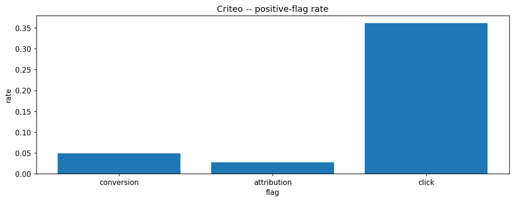
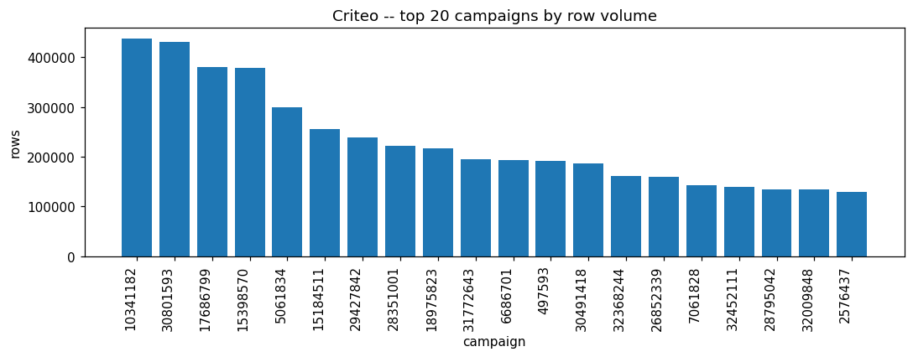
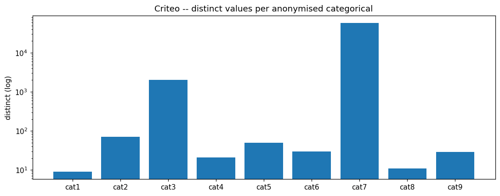
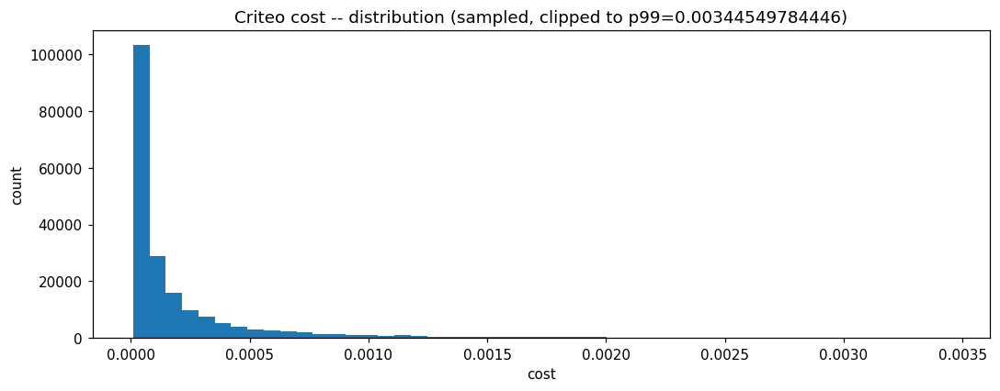
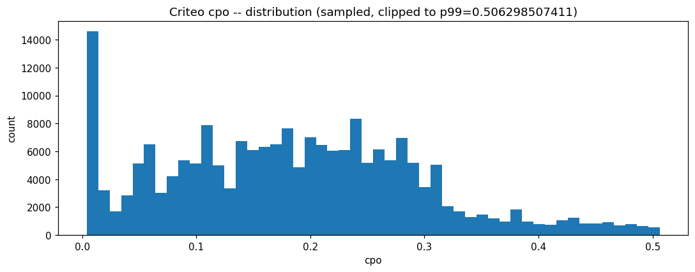
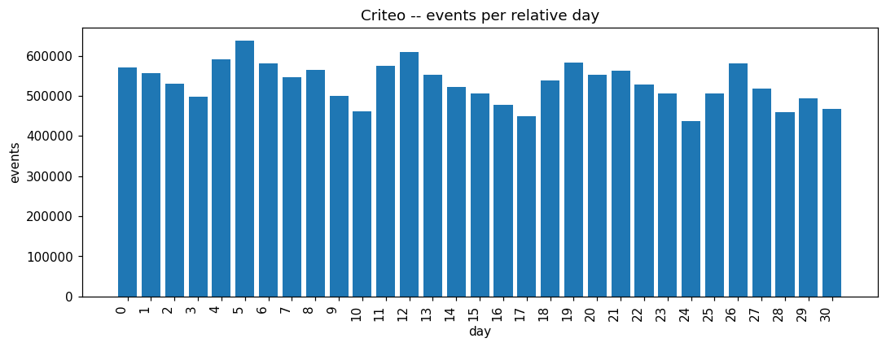
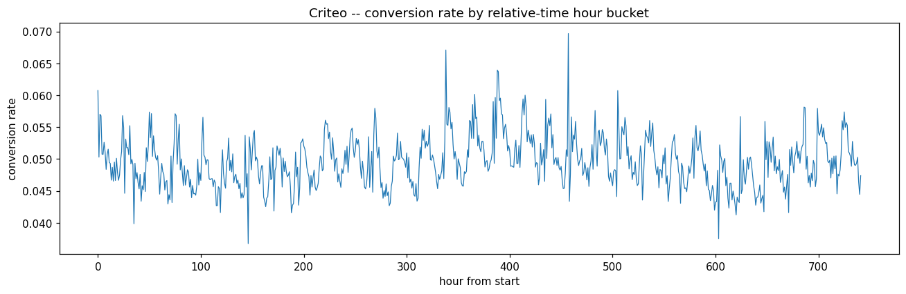
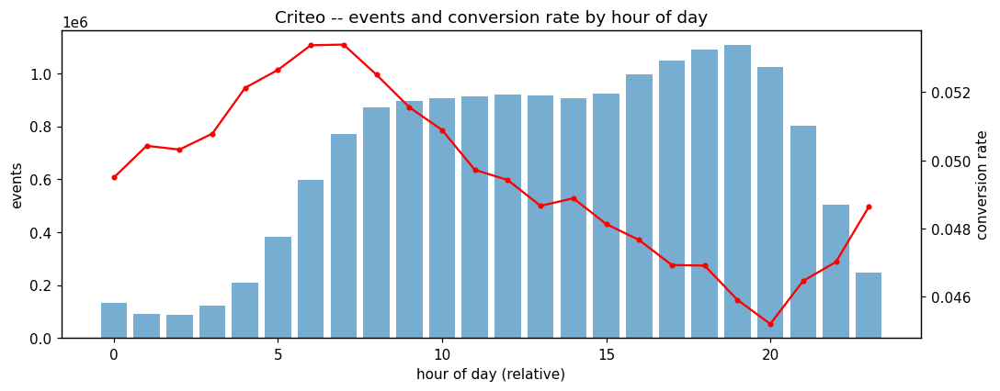

# CRITEO_ATTRIBUTION EDA PROFILE

_Auto-generated by the Phase 3 EDA notebooks (`databricks/eda/criteo_attribution/`). One `## ` section per notebook; re-running a notebook replaces its own section, other sections are preserved._

<!-- BEGIN criteo_attribution:01_attribution_events -->
## Criteo attribution events (criteo_attribution_events)

### Profile

| column | missing | rate | approx_distinct |
|---|---|---|---|
| timestamp | 0 | 0.0000 | 2232607 |
| uid | 0 | 0.0000 | 6374242 |
| campaign | 0 | 0.0000 | 694 |
| conversion | 0 | 0.0000 | 2 |
| conversion_timestamp | 0 | 0.0000 | 355389 |
| conversion_id | 0 | 0.0000 | 414464 |
| attribution | 0 | 0.0000 | 2 |
| click | 0 | 0.0000 | 2 |
| click_pos | 0 | 0.0000 | 182 |
| click_nb | 0 | 0.0000 | 113 |
| cost | 0 | 0.0000 | 9288999 |
| cpo | 0 | 0.0000 | 613682 |
| time_since_last_click | 0 | 0.0000 | 1820698 |
| cat1 | 0 | 0.0000 | 9 |
| cat2 | 0 | 0.0000 | 71 |
| cat3 | 0 | 0.0000 | 2002 |
| cat4 | 0 | 0.0000 | 21 |
| cat5 | 0 | 0.0000 | 50 |
| cat6 | 0 | 0.0000 | 30 |
| cat7 | 0 | 0.0000 | 57782 |
| cat8 | 0 | 0.0000 | 11 |
| cat9 | 0 | 0.0000 | 29 |

Rows: 16468027. Constant columns: none. timestamp / conversion_timestamp / time_since_last_click are relative seconds-from-dataset-start integers, not wall-clock.

### Data Quality

Duplicate key ['uid', 'timestamp', 'campaign']: distinct=16468027, dup groups=0, fully identical=0, conflicting rows=0, conflicting outcomes (conversion/attribution/click)=0.

Attribution-path consistency:
- attribution=1 but conversion=0: 0
- conversion=1 but attribution=0: 363772
- conversion_timestamp>0 but conversion=0: 0
- click_pos>click_nb: 0

Anomalies: {'attributed_no_click': 0, 'cost_no_click': 10520464, 'conversion_no_cpo': 0, 'cpo_no_conversion': 15661831}

Relative-time ranges: {'timestamp': (0.0, 2671199.0, 0), 'conversion_timestamp': (-1.0, 5262888.0, 15661831), 'time_since_last_click': (-1.0, 2592000.0, 8770820)}

### Temporal

Relative-time span: hour 0..741, day 0..30.
Missing days within span: none.
Events per relative day range: 436408..638165.

### Entities / Keys

Approx distinct: {'campaign': 694, 'uid': 6374242, 'conversion_id': 414464}

Top-10 row-volume share:
- campaign: 18.579% (top value ('10341182', 437385))
- uid: 0.025% (top value ('8826511', 880))
- conversion_id: 95.111% (top value ('-1', 15661831))

Anonymised categoricals cat1..cat9 approx distinct: {'cat1': 9, 'cat2': 71, 'cat3': 2002, 'cat4': 21, 'cat5': 50, 'cat6': 30, 'cat7': 57782, 'cat8': 11, 'cat9': 29}

### Relationships

Conversion paths (grouped by conversion_id, conversion rows only): {'path_len_p50_90_99': [1, 3, 11], 'max_path_len': 164, 'multi_uid_paths': 2902, 'conversion_paths': 435810}.
time_since_last_click for conversions (p25/50/75/99): [-1.0, 28573.0, 276989.0, 2245863.0].
Multi-uid conversion paths: 2902 of 435810.

### Distributions

| column | min | max | avg | p50/p95/p99 |
|---|---|---|---|---|
| cost | 1e-05 | 0.0583448264308 | 0.00029325556370219297 | [7.60893093087e-05, 0.00117647058824, 0.00344549784446] |
| cpo | 0.004 | 1.01631051174 | 0.1964286693642163 | [0.191923103924, 0.412769948099, 0.506298507411] |
| click_pos | -1.0 | 173.0 | -0.8312658826707049 | [-1.0, -1.0, 3.0] |
| click_nb | -1.0 | 174.0 | -0.6626016583528798 | [-1.0, -1.0, 8.0] |

Positive-flag rates: {'conversion_rate': 0.04895522699835263, 'attribution_rate': 0.02686563484502424, 'click_rate': 0.3611582006757701}.
Totals: conversions=806196, attributions=442424, clicks=5947563.

### EDA Findings

- Attribution/conversion flags are not perfectly nested (attr_no_conv=0, conv_no_attr=363772).
- Logical anomalies present: {'cost_no_click': 10520464, 'cpo_no_conversion': 15661831}.

### Silver Implications

- Keep timestamp columns typed as relative-seconds integers; do not coerce to wall-clock timestamps.
- Add validation flags for the attribution/cost/cpo anomalies rather than dropping rows.
- Silver grain: one row per click/impression event; conversion_id links events into attribution paths.

### Figure -- Criteo positive-flag rate

### Figure -- Criteo top campaigns by row volume

### Figure -- Criteo distinct values per anonymised categorical

### Figure -- Criteo cost distribution (sampled, clipped to p99)

### Figure -- Criteo cpo distribution (sampled, clipped to p99)

### Figure -- Criteo events per relative day

### Figure -- Criteo conversion rate by relative-time hour bucket

### Figure -- Criteo events and conversion rate by hour of day

<!-- END criteo_attribution:01_attribution_events -->
