# DWD EDA PROFILE

_Auto-generated by the Phase 3 EDA notebooks (`databricks/eda/dwd/`). One `## ` section per notebook; re-running a notebook replaces its own section, other sections are preserved._

<!-- BEGIN dwd:01_weather_measurements -->
## Weather measurements (air_temperature ... wind)

### Profile

| measurement | rows | cols | stations~ | cities~ | first ts | last ts | constant cols |
|---|---|---|---|---|---|---|---|
| air_temperature | 102303 | 7 | 8 | 8 | 2025021300 | 2026081623 | eor |
| cloudiness | 78568 | 7 | 6 | 6 | 2025021300 | 2026081623 | eor |
| moisture | 99540 | 12 | 8 | 8 | 2025021300 | 2026081623 | QN_8, eor |
| precipitation | 92400 | 8 | 7 | 7 | 2025021300 | 2026081623 | eor |
| pressure | 89111 | 7 | 7 | 7 | 2025021300 | 2026081623 | eor |
| sun | 48727 | 6 | 6 | 6 | 2025013003 | 2026081623 | eor |
| wind | 88215 | 7 | 7 | 7 | 2025021300 | 2026081623 | eor |

Highest-missingness column per measurement (missing includes blank):
- air_temperature: `STATIONS_ID` 0 (0.00%)
- cloudiness: `STATIONS_ID` 0 (0.00%)
- moisture: `STATIONS_ID` 0 (0.00%)
- precipitation: `STATIONS_ID` 0 (0.00%)
- pressure: `STATIONS_ID` 0 (0.00%)
- sun: `STATIONS_ID` 0 (0.00%)
- wind: `STATIONS_ID` 0 (0.00%)

### Data Quality

| measurement | dup key groups | identical | conflicting | -999 sentinel (worst col) | out-of-range (worst col) |
|---|---|---|---|---|---|
| air_temperature | 0 | 0 | 0 | RF_TU=613 | TT_TU=0 |
| cloudiness | 0 | 0 | 0 | V_N_I=177 | V_N=31 |
| moisture | 0 | 0 | 0 | ABSF_STD=0 | TF_STD=84 |
| precipitation | 0 | 0 | 0 | WRTR=13413 | R1=0 |
| pressure | 0 | 0 | 0 | P=399 | P=0 |
| sun | 0 | 0 | 0 | SD_SO=32 | SD_SO=0 |
| wind | 0 | 0 | 0 | F=89 | F=0 |

QN quality flag vs -999 sentinel / out-of-range rows:
- air_temperature: {'QN_9': '3', 'rows': 90039, 'rows_with_-999': 596, 'rows_out_of_range': 0}; {'QN_9': '1', 'rows': 12264, 'rows_with_-999': 17, 'rows_out_of_range': 0}
- cloudiness: {'QN_8': '3', 'rows': 68107, 'rows_with_-999': 164, 'rows_out_of_range': 31}; {'QN_8': '1', 'rows': 10461, 'rows_with_-999': 13, 'rows_out_of_range': 0}
- moisture: {'QN_8': '3', 'rows': 99540, 'rows_with_-999': 0, 'rows_out_of_range': 84}
- precipitation: {'QN_8': '3', 'rows': 80136, 'rows_with_-999': 11630, 'rows_out_of_range': 0}; {'QN_8': '1', 'rows': 12264, 'rows_with_-999': 1807, 'rows_out_of_range': 0}
- pressure: {'QN_8': '3', 'rows': 78599, 'rows_with_-999': 331, 'rows_out_of_range': 0}; {'QN_8': '1', 'rows': 10512, 'rows_with_-999': 68, 'rows_out_of_range': 0}
- wind: {'QN_3': '10', 'rows': 67426, 'rows_with_-999': 48, 'rows_out_of_range': 0}; {'QN_3': '1', 'rows': 10512, 'rows_with_-999': 26, 'rows_out_of_range': 0}; {'QN_3': '3', 'rows': 10277, 'rows_with_-999': 18, 'rows_out_of_range': 0}

### Temporal

Hourly grid (expected one row per station per hour); MESS_DATUM parsed yyyyMMddHH:
- air_temperature: 2025021300..2026081623, per-station coverage 96.96-100.0%, longest gap 220.0h
- cloudiness: 2025021300..2026081623, per-station coverage 97.92-99.86%, longest gap 171.0h
- moisture: 2025021300..2026081623, per-station coverage 85.11-99.98%, longest gap 264.0h
- precipitation: 2025021300..2026081623, per-station coverage 100.0-100.0%, longest gap 0h
- pressure: 2025021300..2026081623, per-station coverage 97.03-100.0%, longest gap 220.0h
- sun: 2025013003..2026081623, per-station coverage 74.23-100.0%, longest gap 302.0h
- wind: 2025021300..2026081623, per-station coverage 96.83-100.0%, longest gap 220.0h

### Coverage

8 distinct station ids across the 7 measurements: ['1262', '1420', '1550', '2667', '2928', '400', '4271', '954'].
Per-measurement station presence (row count per cell) — see the exported heatmap figure.
- station 1262: air_temperature=13200, cloudiness=13081, moisture=12864, precipitation=13200, pressure=13200, sun=7825, wind=13026
- station 1420: air_temperature=13200, cloudiness=13101, moisture=13099, precipitation=13200, pressure=13200, sun=10262, wind=13087
- station 1550: air_temperature=13200, cloudiness=12925, moisture=12985, precipitation=13200, pressure=13200, sun=9888, wind=12750
- station 2667: air_temperature=13200, cloudiness=13182, moisture=13165, precipitation=13200, pressure=13200, sun=10533, wind=13164
- station 2928: air_temperature=13200, cloudiness=13173, moisture=13197, precipitation=13200, pressure=13200, sun=0, wind=13200
- station 400: air_temperature=13200, cloudiness=0, moisture=13190, precipitation=13200, pressure=0, sun=0, wind=0
- station 4271: air_temperature=13200, cloudiness=13106, moisture=12592, precipitation=13200, pressure=13200, sun=10201, wind=13107
- station 954: air_temperature=9903, cloudiness=0, moisture=8448, precipitation=0, pressure=9911, sun=18, wind=9881

### Distributions

- air_temperature.`TT_TU`: min/max(no sentinel)=-16.6/40.8, p01/p50/p99=None, mean=11.396613875949987, sd=8.222668833554085, zero rows=307, -999=328, out-of-range=0
- air_temperature.`RF_TU`: min/max(no sentinel)=11.0/100.0, p01/p50/p99=None, mean=73.98731438686202, sd=19.03041486315501, zero rows=0, -999=613, out-of-range=0
- cloudiness.`V_N_I`: min/max(no sentinel)=None/None, p01/p50/p99=None, mean=None, sd=None, zero rows=0, -999=177
- cloudiness.`V_N`: min/max(no sentinel)=-1.0/8.0, p01/p50/p99=None, mean=5.3224213420221975, sd=3.349913116214353, zero rows=17965, -999=0, out-of-range=31
- moisture.`ABSF_STD`: min/max(no sentinel)=-99.9/19.6, p01/p50/p99=None, mean=7.664523809523808, sd=4.382101103782512, zero rows=0, -999=0
- moisture.`VP_STD`: min/max(no sentinel)=-99.9/27.8, p01/p50/p99=None, mean=10.1897930480209, sd=5.342714092587421, zero rows=0, -999=0
- moisture.`TF_STD`: min/max(no sentinel)=-99.9/26.5, p01/p50/p99=None, mean=8.52446051838457, sd=7.200728155932988, zero rows=317, -999=0, out-of-range=84
- moisture.`P_STD`: min/max(no sentinel)=900.8/1039.2, p01/p50/p99=None, mean=991.6988446855619, sd=27.87556126707011, zero rows=0, -999=0
- moisture.`TT_STD`: min/max(no sentinel)=-16.6/40.3, p01/p50/p99=None, mean=11.38867892304601, sd=8.269118270044746, zero rows=336, -999=0
- moisture.`RF_STD`: min/max(no sentinel)=-99.9/100.0, p01/p50/p99=None, mean=73.62668073136422, sd=19.76049380748527, zero rows=0, -999=0
- moisture.`TD_STD`: min/max(no sentinel)=-99.9/22.8, p01/p50/p99=None, mean=6.087108700020094, sd=7.106786315694734, zero rows=466, -999=0
- precipitation.`R1`: min/max(no sentinel)=0.0/42.2, p01/p50/p99=None, mean=0.07251396648044695, sd=0.5011238334172204, zero rows=84289, -999=215, out-of-range=0
- precipitation.`RS_IND`: min/max(no sentinel)=0.0/1.0, p01/p50/p99=None, mean=0.1741823507078158, sd=0.3792682689051104, zero rows=76128, -999=215, out-of-range=0
- precipitation.`WRTR`: min/max(no sentinel)=0.0/8.0, p01/p50/p99=None, mean=1.1429475736513603, sd=2.3956747115161083, zero rows=64206, -999=13413
- pressure.`P`: min/max(no sentinel)=974.4/1040.6, p01/p50/p99=None, mean=1016.4191811705288, sd=8.261065582324624, zero rows=0, -999=399, out-of-range=0
- pressure.`P0`: min/max(no sentinel)=900.8/1039.2, p01/p50/p99=None, mean=989.9270277881031, sd=29.305005258871304, zero rows=0, -999=332, out-of-range=0
- sun.`QN_7`: min/max(no sentinel)=1.0/10.0, p01/p50/p99=None, mean=7.199663430952039, sd=3.7563515269906183, zero rows=0, -999=0
- sun.`SD_SO`: min/max(no sentinel)=0.0/60.0, p01/p50/p99=None, mean=18.562480747510012, sd=25.050756235702103, zero rows=26865, -999=32, out-of-range=0
- wind.`F`: min/max(no sentinel)=0.1/23.6, p01/p50/p99=None, mean=3.4928454712570662, sd=2.786643155222601, zero rows=0, -999=89, out-of-range=0
- wind.`D`: min/max(no sentinel)=0.0/360.0, p01/p50/p99=None, mean=183.63848753600834, sd=95.68872682938914, zero rows=52, -999=41, out-of-range=0

### EDA Findings

- air_temperature: rows=102303, stations=8, hourly coverage 96.96-100.0%, longest gap 220.0h, dup identical=0/conflicting=0, constant cols=['eor']
- cloudiness: rows=78568, stations=6, hourly coverage 97.92-99.86%, longest gap 171.0h, dup identical=0/conflicting=0, constant cols=['eor']
- moisture: rows=99540, stations=8, hourly coverage 85.11-99.98%, longest gap 264.0h, dup identical=0/conflicting=0, constant cols=['QN_8', 'eor']
- precipitation: rows=92400, stations=7, hourly coverage 100.0-100.0%, longest gap 0h, dup identical=0/conflicting=0, constant cols=['eor']
- pressure: rows=89111, stations=7, hourly coverage 97.03-100.0%, longest gap 220.0h, dup identical=0/conflicting=0, constant cols=['eor']
- sun: rows=48727, stations=6, hourly coverage 74.23-100.0%, longest gap 302.0h, dup identical=0/conflicting=0, constant cols=['eor']
- wind: rows=88215, stations=7, hourly coverage 96.83-100.0%, longest gap 220.0h, dup identical=0/conflicting=0, constant cols=['eor']

### Silver Implications

- `-999` (and blank) is the DWD missing sentinel and is present -> must become NULL before any stat.
- Identical (STATIONS_ID, MESS_DATUM) repeats can be de-duplicated safely.
- Constant columns above carry no information.
- Hourly series are not continuous (coverage % / gaps above) -> no dense-grid assumption.
- Out-of-range non-sentinel values are flagged as suspicious, not proven wrong -> keep raw + a quality flag.

### Figure -- DWD rows per measurement

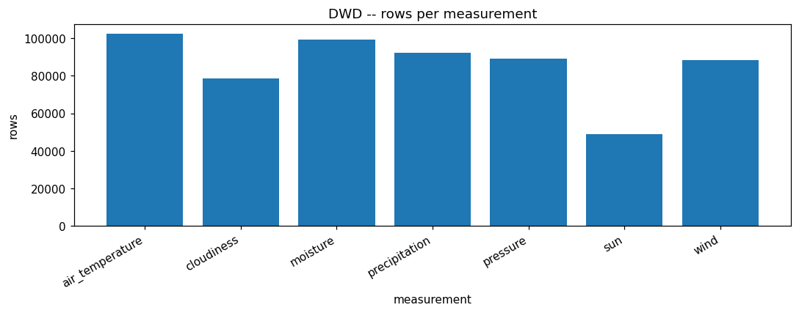

### Figure -- DWD distinct stations per measurement

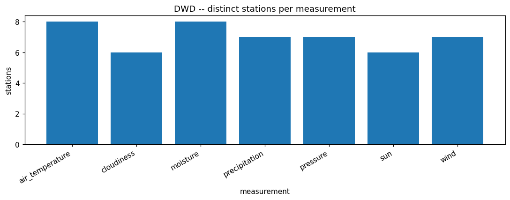

### Figure -- DWD observation year span per measurement

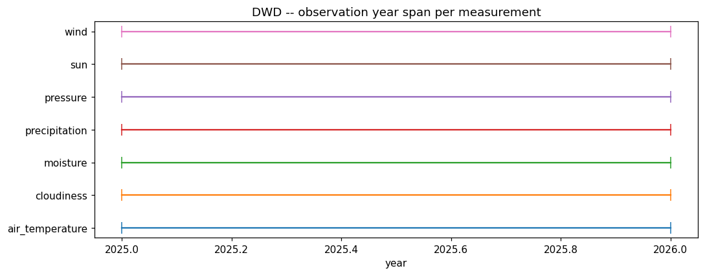

### Figure -- DWD duplicate key composition

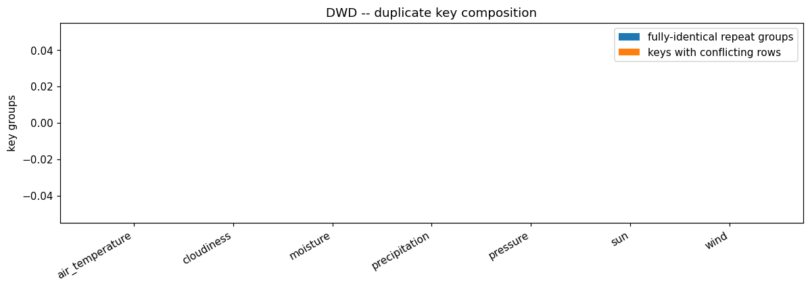

### Figure -- DWD station x measurement coverage

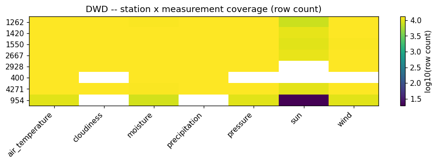

<!-- END dwd:01_weather_measurements -->

<!-- BEGIN dwd:02_station_metadata -->
## Station metadata (geography, name history, device, parameter_unit)

### Profile

| table | rows | cols | full-row dups | constant columns |
|---|---|---|---|---|
| station_geography | 64 | 7 | 0 | - |
| station_name_history | 36 | 4 | 0 | - |
| device_instrument | 593 | 12 | 120 | - |
| parameter_unit | 519 | 12 | 95 | Literaturhinweis |

### Data Quality

Validity-period columns (von_datum / bis_datum):
- station_geography: open-ended=8, inverted ranges=0, of 64 rows
- station_name_history: open-ended=18, inverted ranges=0, of 36 rows
- device_instrument: open-ended=90, inverted ranges=0, of 593 rows
- parameter_unit: open-ended=98, inverted ranges=0, of 519 rows

Per-station row counts: station_geography -> {'1262': 4, '1420': 10, '1550': 8, '2667': 6, '2928': 15, '400': 11, '4271': 6, '954': 4}; station_name_history -> {'1262': 2, '1420': 3, '1550': 3, '2667': 4, '2928': 5, '400': 9, '4271': 4, '954': 3, 'Stations_ID': 1, 'generiert: 03.08.2026 --  Deutscher Wetterdienst  --': 1, 'generiert: 17.08.2026 --  Deutscher Wetterdienst  --': 1}; device_instrument -> {'1262': 70, '1420': 92, '1550': 84, '2667': 81, '2928': 78, '400': 8, '4271': 68, '954': 22, 'generiert: 03.08.2026 --  Deutscher Wetterdienst  --': 1, 'generiert: 17.08.2026 --  Deutscher Wetterdienst  --': 89}; parameter_unit -> {'1262': 39, '1420': 63, '1550': 75, '2667': 65, '2928': 42, '400': 15, '4271': 60, '954': 62, 'Legende: FT  = Folgetag': 49, 'generiert: 03.08.2026 --  Deutscher Wetterdienst  --': 1, 'generiert: 17.08.2026 --  Deutscher Wetterdienst  --': 48}

### Entities / Keys

Distinct stations across the 7 measurement tables: 8 -> ['1262', '1420', '1550', '2667', '2928', '400', '4271', '954'].
Metadata rows per station id:
- station_geography: {'1262': 4, '1420': 10, '1550': 8, '2667': 6, '2928': 15, '400': 11, '4271': 6, '954': 4}
- station_name_history: {'1262': 2, '1420': 3, '1550': 3, '2667': 4, '2928': 5, '400': 9, '4271': 4, '954': 3, 'Stations_ID': 1, 'generiert: 03.08.2026 --  Deutscher Wetterdienst  --': 1, 'generiert: 17.08.2026 --  Deutscher Wetterdienst  --': 1}
- device_instrument: {'1262': 70, '1420': 92, '1550': 84, '2667': 81, '2928': 78, '400': 8, '4271': 68, '954': 22, 'generiert: 03.08.2026 --  Deutscher Wetterdienst  --': 1, 'generiert: 17.08.2026 --  Deutscher Wetterdienst  --': 89}
- parameter_unit: {'1262': 39, '1420': 63, '1550': 75, '2667': 65, '2928': 42, '400': 15, '4271': 60, '954': 62, 'Legende: FT  = Folgetag': 49, 'generiert: 03.08.2026 --  Deutscher Wetterdienst  --': 1, 'generiert: 17.08.2026 --  Deutscher Wetterdienst  --': 48}

### Coverage

Measurement stations with NO row in each metadata table:
- station_geography: 0 missing -> []
- station_name_history: 0 missing -> []
- device_instrument: 0 missing -> []
- parameter_unit: 0 missing -> []

### Domain Findings

station_geography carries multiple location rows per station where coordinates/elevation changed over time:
- station 400: 11 location row(s), lat span=None, lon span=None, elevation span=16.0 m
- station 2667: 6 location row(s), lat span=None, lon span=None, elevation span=40.91 m
- station 1420: 10 location row(s), lat span=None, lon span=None, elevation span=12.3 m
- station 1550: 8 location row(s), lat span=None, lon span=None, elevation span=19.25 m
- station 954: 4 location row(s), lat span=None, lon span=None, elevation span=0.0 m
- station 2928: 15 location row(s), lat span=None, lon span=None, elevation span=41.0 m
- station 1262: 4 location row(s), lat span=None, lon span=None, elevation span=1.9 m
- station 4271: 6 location row(s), lat span=None, lon span=None, elevation span=3.78 m

station_name_history name/operator changes:
- station 400: 9 history row(s), 8 distinct name(s)
- station Stations_ID: 1 history row(s), 1 distinct name(s)
- station generiert: 17.08.2026 --  Deutscher Wetterdienst  --: 1 history row(s), 1 distinct name(s)
- station 2667: 4 history row(s), 4 distinct name(s)
- station 1420: 3 history row(s), 3 distinct name(s)
- station 1550: 3 history row(s), 3 distinct name(s)
- station 954: 3 history row(s), 3 distinct name(s)
- station generiert: 03.08.2026 --  Deutscher Wetterdienst  --: 1 history row(s), 1 distinct name(s)
- station 2928: 5 history row(s), 5 distinct name(s)
- station 1262: 2 history row(s), 2 distinct name(s)
- station 4271: 4 history row(s), 4 distinct name(s)

parameter_unit declared codes: ['ABSF_STD', 'D', 'F', 'None', 'P', 'P0', 'P_STD', 'R1', 'RF_STD', 'RF_TU', 'RS_IND', 'SD_SO', 'TD_STD', 'TF_STD', 'TT_STD', 'TT_TU', 'VP_STD', 'V_N', 'WRTR']
value-column codes present in measurements but NOT in parameter_unit: ['QN_7', 'V_N_I']
parameter_unit codes never used as a measurement value column: ['None']
value columns per measurement: {'air_temperature': ['TT_TU', 'RF_TU'], 'cloudiness': ['V_N_I', 'V_N'], 'moisture': ['ABSF_STD', 'VP_STD', 'TF_STD', 'P_STD', 'TT_STD', 'RF_STD', 'TD_STD'], 'precipitation': ['R1', 'RS_IND', 'WRTR'], 'pressure': ['P', 'P0'], 'sun': ['QN_7', 'SD_SO'], 'wind': ['F', 'D']}

### EDA Findings

- relocations (station -> location rows): {'400': 11, '2667': 6, '1420': 10, '1550': 8, '954': 4, '2928': 15, '1262': 4, '4271': 6}
- name changes (station -> distinct names): {'400': 8, '2667': 4, '1420': 3, '1550': 3, '954': 3, '2928': 5, '1262': 2, '4271': 4}
- validity periods (open-ended, inverted, total): {'station_geography': (8, 0, 64), 'station_name_history': (18, 0, 36), 'device_instrument': (90, 0, 593), 'parameter_unit': (98, 0, 519)}
- metadata coverage gaps vs measurements: {'station_geography': 0, 'station_name_history': 0, 'device_instrument': 0, 'parameter_unit': 0}

### Silver Implications

- station_geography has >1 location row for some stations (relocations) -> station location is time-varying; join measurement rows on the von/bis window, not on station_id alone.
- station_name_history has >1 name/operator per station over time -> a second time-varying attribute stream.
- device_instrument / parameter_unit are small static lookups -> reference dimensions; reconcile parameter codes with the measurement value-column names (list above).

### Figure -- DWD station_geography -- station locations & relocations

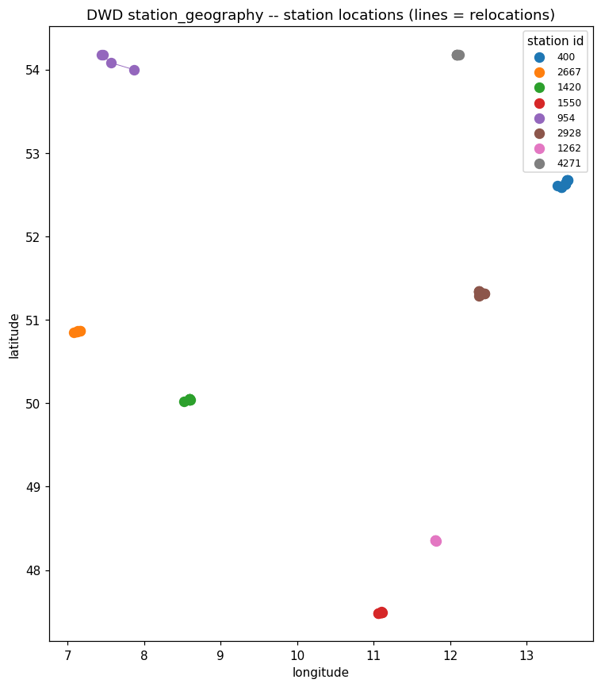

### Figure -- DWD station_geography -- location rows per station

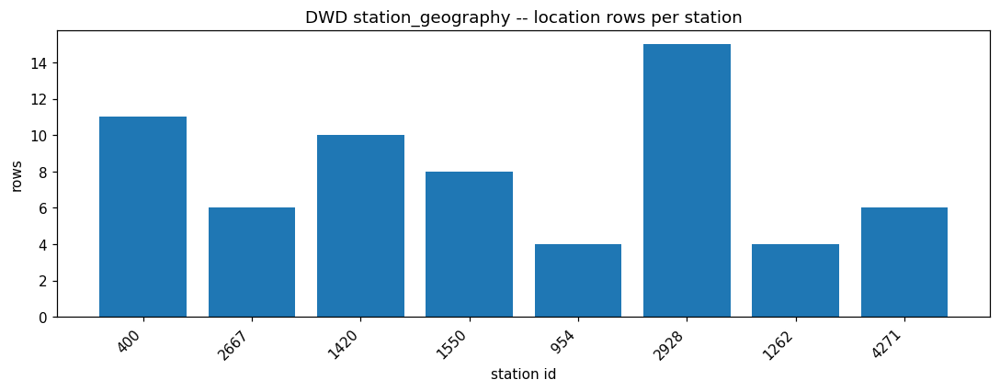

### Figure -- DWD station_name_history -- history rows per station

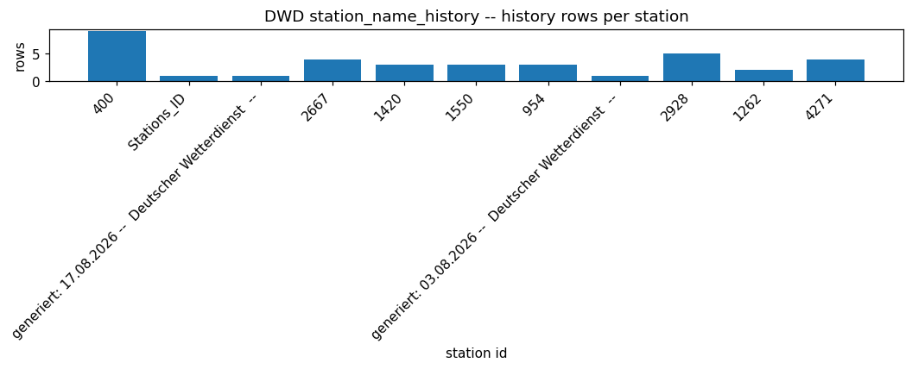

### Figure -- DWD -- measurement stations missing a metadata row

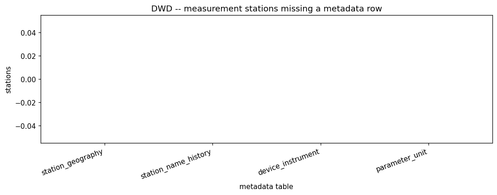

### Figure -- DWD metadata -- rows per table

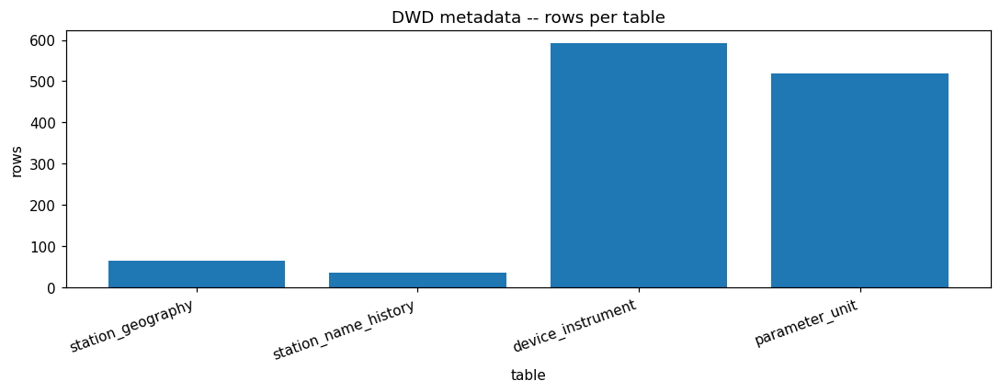

<!-- END dwd:02_station_metadata -->

<!-- BEGIN dwd:03_missing_data -->
## Missing data (reported periods vs observed -999/blank)

### Profile

- `dwd_missing_value_periods`: 457 rows, columns ['Stations_ID', 'Stations_Name', 'Parameter', 'Von_Datum', 'Bis_Datum', 'Anzahl_Fehlwerte', 'Beschreibung', 'eor']
- station-id column: `Stations_ID`  parameter column: `Parameter`  von/bis: `Von_Datum`/`Bis_Datum`
- periods per station: {'2667': 42, '1420': 83, '1550': 70, '954': 95, '2928': 17, '1262': 37, '4271': 113}
- periods per parameter: {'TT_TU': 52, 'RF_TU': 52, 'V_N': 51, 'R1': 15, 'RS_IND': 15, 'WRTR': 17, 'P0': 33, 'P': 47, 'SD_SO': 17, 'F': 81, 'D': 77}

### Data Quality

- REPORTED = a row in dwd_missing_value_periods; OBSERVED = a measurement value that is `-999` or blank. They are not guaranteed to line up.
- inverted von>bis ranges in the reported table: 0
- reconciliation: station x parameter with -999 observed but NO reported period: 7
- reconciliation: station x parameter with a reported period but ZERO observed -999/blank: 14

### Temporal

reported-period span (hours): count=0
longest reported missing period per station (hours): {}
observed -999/blank rate by year, per measurement:
- air_temperature: [('2025', 0.0097), ('2026', 0.0005)]
- cloudiness: [('2025', 1.0), ('2026', 1.0)]
- moisture: [('2025', 0.0), ('2026', 0.0)]
- precipitation: [('2025', 0.1461), ('2026', 0.1445)]
- pressure: [('2025', 0.0061), ('2026', 0.0021)]
- sun: [('2025', 0.0), ('2026', 0.0016)]
- wind: [('2025', 0.0008), ('2026', 0.0014)]

### Distributions

Observed -999/blank rate per (measurement.value-column):
- air_temperature.TT_TU: 0.0032
- air_temperature.RF_TU: 0.0060
- cloudiness.V_N_I: 0.0023
- cloudiness.V_N: 0.0000
- moisture.ABSF_STD: 0.0000
- moisture.VP_STD: 0.0000
- moisture.TF_STD: 0.0000
- moisture.P_STD: 0.0000
- moisture.TT_STD: 0.0000
- moisture.RF_STD: 0.0000
- moisture.TD_STD: 0.0000
- precipitation.R1: 0.0023
- precipitation.RS_IND: 0.0023
- precipitation.WRTR: 0.1452
- pressure.P: 0.0045
- pressure.P0: 0.0037
- sun.QN_7: 0.0000
- sun.SD_SO: 0.0007
- wind.F: 0.0010
- wind.D: 0.0005

### Domain Findings

Per-station observed distinct hours (measurement completeness proxy):
- air_temperature: {'1262': 13200, '1420': 13200, '1550': 13200, '2667': 13200, '2928': 13200, '400': 13200, '4271': 13200, '954': 9903}
- cloudiness: {'1262': 13081, '1420': 13101, '1550': 12925, '2667': 13182, '2928': 13173, '4271': 13106}
- moisture: {'1262': 12864, '1420': 13099, '1550': 12985, '2667': 13165, '2928': 13197, '400': 13190, '4271': 12592, '954': 8448}
- precipitation: {'1262': 13200, '1420': 13200, '1550': 13200, '2667': 13200, '2928': 13200, '400': 13200, '4271': 13200}
- pressure: {'1262': 13200, '1420': 13200, '1550': 13200, '2667': 13200, '2928': 13200, '4271': 13200, '954': 9911}
- sun: {'1262': 7825, '1420': 10262, '1550': 9888, '2667': 10533, '4271': 10201, '954': 18}
- wind: {'1262': 13026, '1420': 13087, '1550': 12750, '2667': 13164, '2928': 13200, '4271': 13107, '954': 9881}

### EDA Findings

- reported periods total: 457, inverted ranges: 0
- reported longest gap per station (h): {}
- observed -999/blank rate per (measurement.column): {'air_temperature.TT_TU': 0.0032, 'air_temperature.RF_TU': 0.006, 'cloudiness.V_N_I': 0.0023, 'cloudiness.V_N': 0.0, 'moisture.ABSF_STD': 0.0, 'moisture.VP_STD': 0.0, 'moisture.TF_STD': 0.0, 'moisture.P_STD': 0.0, 'moisture.TT_STD': 0.0, 'moisture.RF_STD': 0.0, 'moisture.TD_STD': 0.0, 'precipitation.R1': 0.0023, 'precipitation.RS_IND': 0.0023, 'precipitation.WRTR': 0.1452, 'pressure.P': 0.0045, 'pressure.P0': 0.0037, 'sun.QN_7': 0.0, 'sun.SD_SO': 0.0007, 'wind.F': 0.001, 'wind.D': 0.0005}
- reconciliation: -999-without-report=7, report-without-observed=14

### Silver Implications

- `-999` and blank are the DWD missing sentinels in the measurement fact -> convert to NULL in Silver.
- Keep `dwd_missing_value_periods` as a reference table keyed by (station, parameter, from_ts, to_ts).
- REPORTED and OBSERVED missingness disagree for some station x parameter (counts above) -> do NOT reconcile by deleting rows; flag with a data-quality column.
- Missingness is time-varying (year plots) -> no uniform-completeness assumption; any imputation is an explicit, evidenced choice.

### Figure -- DWD observed missingness rate by station x parameter

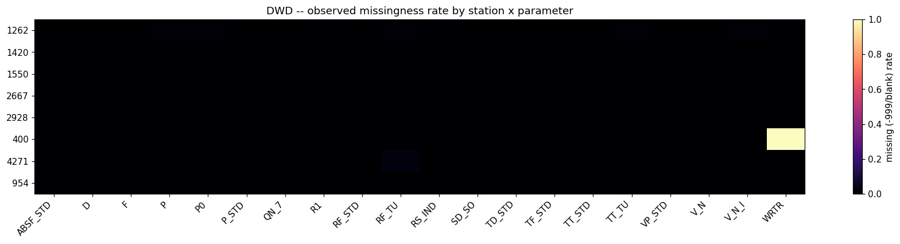

### Figure -- DWD missing_value_periods -- periods per parameter

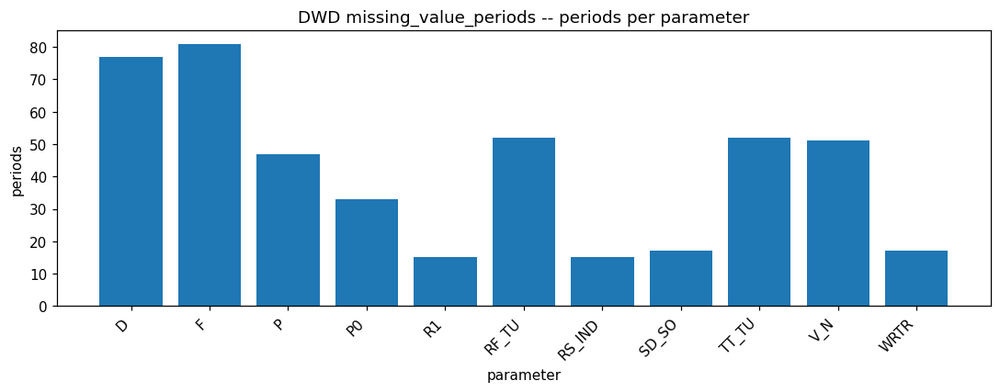

### Figure -- DWD missing_value_periods -- reported span (hours) distribution

### Figure -- DWD -- longest reported missing period per station

<!-- END dwd:03_missing_data -->

<!-- BEGIN dwd:04_relationships_and_findings -->
## Cross-table relationships & verdict

### Entities / Keys

Distinct station ids per Bronze table: {'air_temperature': 8, 'cloudiness': 6, 'moisture': 8, 'precipitation': 7, 'pressure': 7, 'sun': 6, 'wind': 7, 'station_geography': 8, 'station_name_history': 11, 'parameter_unit': 11, 'device_instrument': 10}
Union of stations across the 7 measurements: 8 -> ['1262', '1420', '1550', '2667', '2928', '400', '4271', '954']
Stations absent from each measurement (vs the union): {'air_temperature': 0, 'cloudiness': 2, 'moisture': 0, 'precipitation': 1, 'pressure': 1, 'sun': 2, 'wind': 1}
Stations mapped to >1 city: {}   |   distinct stations per city: {'leipzig': 1, 'garmisch_partenkirchen': 1, 'rostock_warnemuende': 1, 'cologne': 1, 'frankfurt_am_main': 1, 'hamburg': 1, 'berlin': 1, 'munich': 1}

### Relationships

Referential integrity — measurement stations vs metadata (orphans, unused):
- station_geography: orphan measurement stations=0, unused metadata stations=0
- station_name_history: orphan measurement stations=0, unused metadata stations=3
- parameter_unit: orphan measurement stations=0, unused metadata stations=3

Join cardinality — measurement.station_id -> metadata table (rows per station id):
- station_geography: 1:N fan-out  {'min': 4, 'max': 15, 'avg': 8.0, 'stations_with_fanout': 8}
- station_name_history: 1:N fan-out  {'min': 1, 'max': 9, 'avg': 3.272727272727273, 'stations_with_fanout': 8}
- parameter_unit: 1:N fan-out  {'min': 1, 'max': 75, 'avg': 47.18181818181818, 'stations_with_fanout': 10}
- device_instrument: 1:N fan-out  {'min': 1, 'max': 92, 'avg': 59.3, 'stations_with_fanout': 9}

(STATIONS_ID, MESS_DATUM) unique within each measurement: {'air_temperature': True, 'cloudiness': True, 'moisture': True, 'precipitation': True, 'pressure': True, 'sun': True, 'wind': True}

Cross-measurement (station, MESS_DATUM) overlap per pair (shared, only_a, only_b):
- air_temperature x cloudiness: shared=78568, only_air_temperature=23735, only_cloudiness=0
- air_temperature x moisture: shared=99540, only_air_temperature=2763, only_moisture=0
- air_temperature x precipitation: shared=92400, only_air_temperature=9903, only_precipitation=0
- air_temperature x pressure: shared=89103, only_air_temperature=13200, only_pressure=8
- air_temperature x sun: shared=48709, only_air_temperature=53594, only_sun=18
- air_temperature x wind: shared=88207, only_air_temperature=14096, only_wind=8
- cloudiness x moisture: shared=77599, only_cloudiness=969, only_moisture=21941
- cloudiness x precipitation: shared=78568, only_cloudiness=0, only_precipitation=13832
- cloudiness x pressure: shared=78568, only_cloudiness=0, only_pressure=10543
- cloudiness x sun: shared=48508, only_cloudiness=30060, only_sun=219
- cloudiness x wind: shared=78019, only_cloudiness=549, only_wind=10196
- moisture x precipitation: shared=91092, only_moisture=8448, only_precipitation=1308
- moisture x pressure: shared=86350, only_moisture=13190, only_pressure=2761
- moisture x sun: shared=48155, only_moisture=51385, only_sun=572
- moisture x wind: shared=85762, only_moisture=13778, only_wind=2453
- precipitation x pressure: shared=79200, only_precipitation=13200, only_pressure=9911
- precipitation x sun: shared=48709, only_precipitation=43691, only_sun=18
- precipitation x wind: shared=78334, only_precipitation=14066, only_wind=9881
- pressure x sun: shared=48709, only_pressure=40402, only_sun=18
- pressure x wind: shared=88215, only_pressure=896, only_wind=0
- sun x wind: shared=48306, only_sun=421, only_wind=39909

union of (station, ts) across all 7 measurements = 102329

### EDA Findings

- (station, MESS_DATUM) is unique in every measurement: True  -> pairwise measurement<->measurement joins are 1:1 on the overlap.
- largest non-shared timestamp count in any measurement pair: 53594  -> an inner join to a wide table drops that tail.
- all 7 measurements have disjoint value-column sets: True.
- Verdict: combine into a wide table only where timestamps overlap; keep one model per measurement in Silver, align at Gold.

### Silver Implications

- Shared join key is (STATIONS_ID, MESS_DATUM); unique per measurement -> safe fan-out-free joins.
- station_geography / station_name_history are 1:N on station_id -> join with the von/bis validity window, never station_id alone.
- `city` is consistent 1:1 with station_id here -> safe to carry as a station attribute.
- A cross-measurement wide 'all weather at station S, hour H' table drops rows (overlap numbers above) -> that is a Gold consolidation, not Silver.

### Figure -- DWD cross-measurement (station, timestamp) overlap per pair

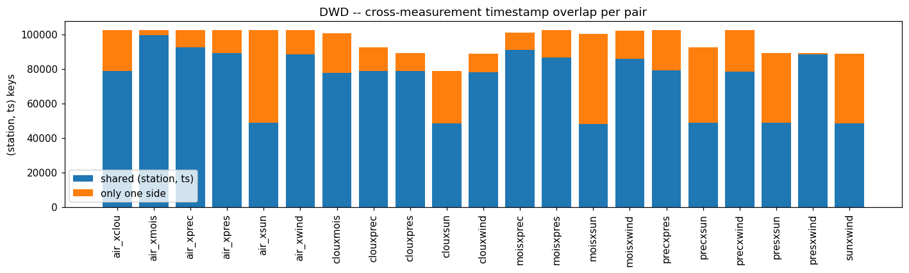

### Figure -- DWD distinct stations per Bronze table

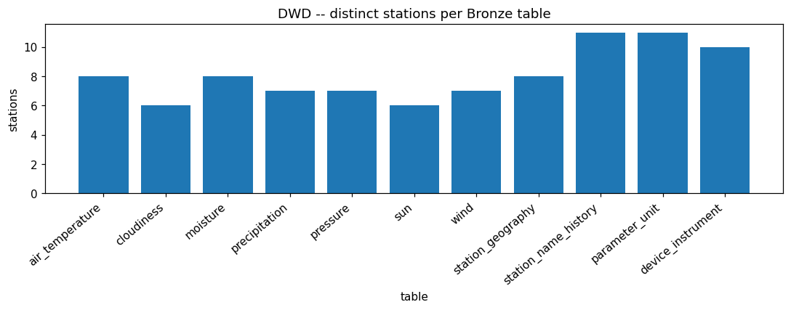

### Figure -- DWD stations absent from each measurement

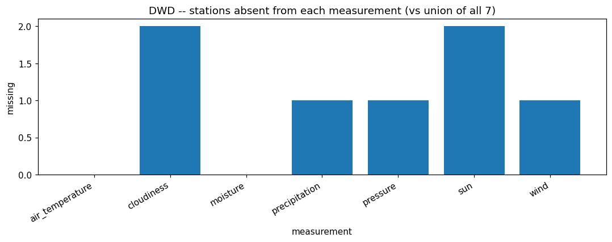

### Figure -- DWD referential integrity: measurements <-> metadata

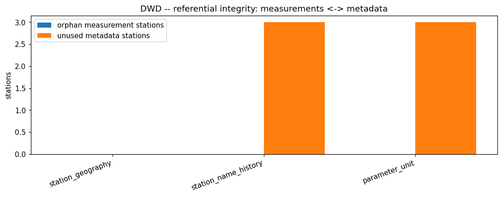

<!-- END dwd:04_relationships_and_findings -->
