# DWD EDA PROFILE

_Auto-generated by the EDA notebooks (`databricks/eda/dwd/`). One `## ` section per notebook; re-running a notebook replaces its own section, other sections are preserved._

<!-- BEGIN dwd:01_weather_measurements -->
## Weather measurements (air_temperature ... wind)

### Profile

| measurement | rows | cols | stations~ | cities~ | first ts | last ts | constant cols |
|---|---|---|---|---|---|---|---|
| air_temperature | 17336388 | 7 | 29 | 28 | 1893010101 | 2026090323 | eor |
| cloudiness | 12973316 | 7 | 29 | 28 | 1949010100 | 2026090323 | eor |
| moisture | 12449858 | 12 | 29 | 28 | 1949010100 | 2026090323 | QN_8, eor |
| precipitation | 7154301 | 8 | 28 | 27 | 1995090100 | 2026090323 | eor |
| pressure | 13227922 | 7 | 29 | 28 | 1949010100 | 2026090323 | eor |
| sun | 12650564 | 6 | 29 | 28 | 1893010103 | 2026090323 | eor |
| wind | 15957198 | 7 | 29 | 28 | 1893010100 | 2026090323 | eor |

Highest-missingness column per measurement (missing includes blank):
- air_temperature: `STATIONS_ID` 0 (0.00%)
- cloudiness: `STATIONS_ID` 0 (0.00%)
- moisture: `STATIONS_ID` 0 (0.00%)
- precipitation: `STATIONS_ID` 0 (0.00%)
- pressure: `STATIONS_ID` 0 (0.00%)
- sun: `STATIONS_ID` 0 (0.00%)
- wind: `STATIONS_ID` 0 (0.00%)

### Data Quality

| measurement | dup key groups | identical | conflicting | -999 sentinel (worst col) | out-of-range (worst col) |
|---|---|---|---|---|---|
| air_temperature | 204288 | 204288 | 0 | RF_TU=54428 | RF_TU=1 |
| cloudiness | 203021 | 203015 | 6 | V_N=0 | V_N=449412 |
| moisture | 202195 | 202195 | 0 | TF_STD=128648 | TF_STD=5718 |
| precipitation | 196992 | 196992 | 0 | WRTR=3369655 | R1=0 |
| pressure | 204288 | 204288 | 0 | P0=3931010 | P0=757644 |
| sun | 123226 | 123226 | 0 | SD_SO=4164 | SD_SO=0 |
| wind | 202865 | 182082 | 20783 | D=3217996 | D=40722 |

QN quality flag vs -999 sentinel / out-of-range rows:
- air_temperature: {'QN_9': '3', 'rows': 8341093, 'rows_with_-999': 8425, 'rows_out_of_range': 0}; {'QN_9': '5', 'rows': 6374150, 'rows_with_-999': 45563, 'rows_out_of_range': 1}; {'QN_9': '10', 'rows': 2555902, 'rows_with_-999': 465, 'rows_out_of_range': 0}; {'QN_9': '1', 'rows': 65243, 'rows_with_-999': 35, 'rows_out_of_range': 0}
- cloudiness: {'QN_8': '1', 'rows': 7795985, 'rows_with_-999': 0, 'rows_out_of_range': 352825}; {'QN_8': '3', 'rows': 5177331, 'rows_with_-999': 0, 'rows_out_of_range': 96587}
- moisture: {'QN_8': '3', 'rows': 12449858, 'rows_with_-999': 128648, 'rows_out_of_range': 5718}
- precipitation: {'QN_8': '3', 'rows': 5119301, 'rows_with_-999': 1917686, 'rows_out_of_range': 0}; {'QN_8': '1', 'rows': 2035000, 'rows_with_-999': 1499067, 'rows_out_of_range': 0}
- pressure: {'QN_8': '1', 'rows': 7757627, 'rows_with_-999': 4359003, 'rows_out_of_range': 317742}; {'QN_8': '3', 'rows': 5470295, 'rows_with_-999': 593913, 'rows_out_of_range': 439902}
- sun: {'QN_7': '10', 'rows': 5087935, 'rows_with_-999': 21, 'rows_out_of_range': 0}; {'QN_7': '5', 'rows': 4570452, 'rows_with_-999': 18, 'rows_out_of_range': 0}; {'QN_7': '3', 'rows': 2959847, 'rows_with_-999': 4036, 'rows_out_of_range': 0}; {'QN_7': '1', 'rows': 32328, 'rows_with_-999': 89, 'rows_out_of_range': 0}; {'QN_7': '2', 'rows': 2, 'rows_with_-999': 0, 'rows_out_of_range': 0}
- wind: {'QN_3': '10', 'rows': 9962165, 'rows_with_-999': 5484, 'rows_out_of_range': 30123}; {'QN_3': '5', 'rows': 4902548, 'rows_with_-999': 3213380, 'rows_out_of_range': 10487}; {'QN_3': '3', 'rows': 1043429, 'rows_with_-999': 2080, 'rows_out_of_range': 112}; {'QN_3': '1', 'rows': 49056, 'rows_with_-999': 810, 'rows_out_of_range': 0}

### Special Values

Candidate special codes searched in every value column: (-999.0, -99.9, -99.0, -9.9, -9.0, -1.0, 990.0, 999.0, 9999.0). None is assumed to be a missing-value marker; each is characterised by where it occurs.
- air_temperature: rows with k candidate codes per row (k, rows): [(0, 17214213), (1, 116321), (2, 5854)].
  - `TT_TU` = -999.0: 5727 rows (0.033%); by quality level (level, rows with the code, rows at level) [('3', 5695, 8341093), ('10', 28, 2555902), ('1', 4, 65243)]; by decade (decade, rows) [(1980, 9), (1990, 38), (2000, 13), (2010, 1765), (2020, 3902)]; top stations (station, rows) [('2564', 564), ('2014', 499), ('5100', 451)] = 0.264 of the code's rows.
  - `TT_TU` = -9.9: 6315 rows (0.036%); by quality level (level, rows with the code, rows at level) [('5', 2936, 6374150), ('3', 2477, 8341093), ('10', 899, 2555902), ('1', 3, 65243)]; by decade (decade, rows) [(1890, 21), (1900, 29), (1910, 23), (1920, 41), (1930, 29), (1940, 121), (1950, 713), (1960, 1063)] (+6 more); top stations (station, rows) [('5792', 2366), ('1346', 538), ('1550', 405)] = 0.524 of the code's rows.
  - `TT_TU` = -9.0: 8858 rows (0.051%); by quality level (level, rows with the code, rows at level) [('5', 4443, 6374150), ('3', 3366, 8341093), ('10', 1046, 2555902), ('1', 3, 65243)]; by decade (decade, rows) [(1890, 20), (1900, 33), (1910, 32), (1920, 44), (1930, 32), (1940, 155), (1950, 1116), (1960, 1578)] (+6 more); top stations (station, rows) [('5792', 3096), ('1346', 823), ('2290', 550)] = 0.505 of the code's rows.
  - `TT_TU` = -1.0: 52701 rows (0.304%); by quality level (level, rows with the code, rows at level) [('5', 24098, 6374150), ('3', 21727, 8341093), ('10', 6858, 2555902), ('1', 18, 65243)]; by decade (decade, rows) [(1890, 189), (1900, 308), (1910, 287), (1920, 220), (1930, 299), (1940, 686), (1950, 6005), (1960, 7785)] (+6 more); top stations (station, rows) [('5792', 3850), ('1346', 3391), ('3987', 3386)] = 0.202 of the code's rows.
  - `RF_TU` = -999.0: 54428 rows (0.314%); by quality level (level, rows with the code, rows at level) [('5', 45563, 6374150), ('3', 8393, 8341093), ('10', 437, 2555902), ('1', 35, 65243)]; by decade (decade, rows) [(1950, 35063), (1960, 10499), (1970, 1), (1980, 26), (1990, 378), (2000, 322), (2010, 2890), (2020, 5249)]; top stations (station, rows) [('880', 43982), ('4336', 1837), ('4271', 939)] = 0.859 of the code's rows.
- cloudiness: rows with k candidate codes per row (k, rows): [(0, 12523904), (1, 449412)].
  - `V_N` = -1.0: 449412 rows (3.464%); by quality level (level, rows with the code, rows at level) [('3', 96587, 5177331), ('1', 352825, 7795985)]; by decade (decade, rows) [(1940, 3700), (1950, 40910), (1960, 38382), (1970, 41601), (1980, 94981), (1990, 90541), (2000, 84426), (2010, 51025)] (+1 more); top stations (station, rows) [('5792', 133755), ('1346', 115496), ('2290', 58286)] = 0.684 of the code's rows.
- moisture: rows with k candidate codes per row (k, rows): [(0, 12007563), (1, 280057), (2, 137583), (3, 18842), (4, 56), (5, 5326), (6, 431)].
  - `ABSF_STD` = -99.9: 5757 rows (0.046%); by quality level (level, rows with the code, rows at level) [('3', 5757, 12449858)]; by decade (decade, rows) [(1940, 36), (1950, 268), (1960, 95), (1970, 337), (1980, 3766), (1990, 1025), (2000, 73), (2010, 85)] (+1 more); top stations (station, rows) [('5792', 3285), ('1346', 399), ('2564', 310)] = 0.694 of the code's rows.
  - `VP_STD` = -99.9: 5757 rows (0.046%); by quality level (level, rows with the code, rows at level) [('3', 5757, 12449858)]; by decade (decade, rows) [(1940, 36), (1950, 268), (1960, 95), (1970, 337), (1980, 3766), (1990, 1025), (2000, 73), (2010, 85)] (+1 more); top stations (station, rows) [('5792', 3285), ('1346', 399), ('2564', 310)] = 0.694 of the code's rows.
  - `TF_STD` = -999.0: 128648 rows (1.033%); by quality level (level, rows with the code, rows at level) [('3', 128648, 12449858)]; by decade (decade, rows) [(1990, 38503), (2010, 59363), (2020, 30782)]; top stations (station, rows) [('2564', 90145), ('2290', 38503), ('1550', 0)] = 1.0 of the code's rows.
  - `TF_STD` = -99.9: 5705 rows (0.046%); by quality level (level, rows with the code, rows at level) [('3', 5705, 12449858)]; by decade (decade, rows) [(1940, 36), (1950, 268), (1960, 95), (1970, 337), (1980, 3766), (1990, 973), (2000, 73), (2010, 85)] (+1 more); top stations (station, rows) [('5792', 3285), ('1346', 399), ('2564', 310)] = 0.7 of the code's rows.
  - `TF_STD` = -9.9: 6497 rows (0.052%); by quality level (level, rows with the code, rows at level) [('3', 6497, 12449858)]; by decade (decade, rows) [(1940, 30), (1950, 777), (1960, 676), (1970, 773), (1980, 1199), (1990, 894), (2000, 890), (2010, 848)] (+1 more); top stations (station, rows) [('5792', 2567), ('1346', 477), ('1550', 350)] = 0.522 of the code's rows.
  - `TF_STD` = -9.0: 8765 rows (0.070%); by quality level (level, rows with the code, rows at level) [('3', 8765, 12449858)]; by decade (decade, rows) [(1940, 57), (1950, 1225), (1960, 1044), (1970, 1204), (1980, 1674), (1990, 1120), (2000, 993), (2010, 961)] (+1 more); top stations (station, rows) [('5792', 3034), ('1346', 678), ('2290', 552)] = 0.486 of the code's rows.
  - `TF_STD` = -1.0: 46363 rows (0.372%); by quality level (level, rows with the code, rows at level) [('3', 46363, 12449858)]; by decade (decade, rows) [(1940, 509), (1950, 3769), (1960, 3426), (1970, 5207), (1980, 8178), (1990, 6986), (2000, 7392), (2010, 6537)] (+1 more); top stations (station, rows) [('1346', 5073), ('5792', 4590), ('2290', 2747)] = 0.268 of the code's rows.
  - `P_STD` = -999.0: 128648 rows (1.033%); by quality level (level, rows with the code, rows at level) [('3', 128648, 12449858)]; by decade (decade, rows) [(1990, 38503), (2010, 59363), (2020, 30782)]; top stations (station, rows) [('2564', 90145), ('2290', 38503), ('1550', 0)] = 1.0 of the code's rows.
  - `P_STD` = 990.0: 11937 rows (0.096%); by quality level (level, rows with the code, rows at level) [('3', 11937, 12449858)]; by decade (decade, rows) [(1980, 385), (1990, 3078), (2000, 3237), (2010, 2979), (2020, 2258)]; top stations (station, rows) [('1048', 1716), ('5100', 1616), ('1684', 1590)] = 0.412 of the code's rows.
  - `P_STD` = 999.0: 15210 rows (0.122%); by quality level (level, rows with the code, rows at level) [('3', 15210, 12449858)]; by decade (decade, rows) [(1980, 546), (1990, 3713), (2000, 4085), (2010, 3919), (2020, 2947)]; top stations (station, rows) [('1303', 1697), ('1420', 1382), ('2928', 1271)] = 0.286 of the code's rows.
  - `TT_STD` = -9.9: 3049 rows (0.024%); by quality level (level, rows with the code, rows at level) [('3', 3049, 12449858)]; by decade (decade, rows) [(1980, 600), (1990, 773), (2000, 716), (2010, 677), (2020, 283)]; top stations (station, rows) [('5792', 1229), ('1346', 260), ('1550', 170)] = 0.544 of the code's rows.
  - `TT_STD` = -9.0: 14815 rows (0.119%); by quality level (level, rows with the code, rows at level) [('3', 14815, 12449858)]; by decade (decade, rows) [(1940, 192), (1950, 2757), (1960, 2973), (1970, 3308), (1980, 2602), (1990, 923), (2000, 856), (2010, 829)] (+1 more); top stations (station, rows) [('5792', 6042), ('1346', 1677), ('2290', 714)] = 0.569 of the code's rows.
  - `TT_STD` = -1.0: 85202 rows (0.684%); by quality level (level, rows with the code, rows at level) [('3', 85202, 12449858)]; by decade (decade, rows) [(1940, 1556), (1950, 14730), (1960, 13353), (1970, 18197), (1980, 15824), (1990, 5832), (2000, 6296), (2010, 5646)] (+1 more); top stations (station, rows) [('5792', 7512), ('1346', 6360), ('1550', 4430)] = 0.215 of the code's rows.
  - `RF_STD` = -99.9: 5758 rows (0.046%); by quality level (level, rows with the code, rows at level) [('3', 5758, 12449858)]; by decade (decade, rows) [(1940, 36), (1950, 268), (1960, 95), (1970, 337), (1980, 3766), (1990, 1026), (2000, 73), (2010, 85)] (+1 more); top stations (station, rows) [('5792', 3285), ('1346', 399), ('2564', 310)] = 0.694 of the code's rows.
  - `TD_STD` = -99.9: 5757 rows (0.046%); by quality level (level, rows with the code, rows at level) [('3', 5757, 12449858)]; by decade (decade, rows) [(1940, 36), (1950, 268), (1960, 95), (1970, 337), (1980, 3766), (1990, 1025), (2000, 73), (2010, 85)] (+1 more); top stations (station, rows) [('5792', 3285), ('1346', 399), ('2564', 310)] = 0.694 of the code's rows.
  - `TD_STD` = -9.9: 5827 rows (0.047%); by quality level (level, rows with the code, rows at level) [('3', 5827, 12449858)]; by decade (decade, rows) [(1980, 1121), (1990, 1350), (2000, 1378), (2010, 1227), (2020, 751)]; top stations (station, rows) [('5792', 1457), ('1346', 504), ('1550', 259)] = 0.381 of the code's rows.
  - `TD_STD` = -9.0: 27112 rows (0.218%); by quality level (level, rows with the code, rows at level) [('3', 27112, 12449858)]; by decade (decade, rows) [(1940, 404), (1950, 4668), (1960, 5319), (1970, 6128), (1980, 4447), (1990, 1783), (2000, 1690), (2010, 1590)] (+1 more); top stations (station, rows) [('5792', 6023), ('1346', 2940), ('2290', 1640)] = 0.391 of the code's rows.
  - `TD_STD` = -1.0: 130382 rows (1.047%); by quality level (level, rows with the code, rows at level) [('3', 130382, 12449858)]; by decade (decade, rows) [(1940, 2514), (1950, 22315), (1960, 18709), (1970, 30539), (1980, 21725), (1990, 9487), (2000, 9432), (2010, 9062)] (+1 more); top stations (station, rows) [('1346', 7395), ('2014', 7160), ('662', 6707)] = 0.163 of the code's rows.
- precipitation: rows with k candidate codes per row (k, rows): [(0, 3737548), (1, 3360161), (2, 47158), (3, 9434)].
  - `R1` = -999.0: 56600 rows (0.791%); by quality level (level, rows with the code, rows at level) [('3', 32652, 5119301), ('1', 23948, 2035000)]; by decade (decade, rows) [(2000, 47979), (2010, 3975), (2020, 4646)]; top stations (station, rows) [('1346', 47094), ('2290', 1671), ('1270', 925)] = 0.878 of the code's rows.
  - `RS_IND` = -999.0: 56524 rows (0.790%); by quality level (level, rows with the code, rows at level) [('3', 32650, 5119301), ('1', 23874, 2035000)]; by decade (decade, rows) [(2000, 47905), (2010, 3973), (2020, 4646)]; top stations (station, rows) [('1346', 47093), ('2290', 1671), ('1270', 925)] = 0.879 of the code's rows.
  - `WRTR` = -999.0: 3369655 rows (47.100%); by quality level (level, rows with the code, rows at level) [('3', 1890417, 5119301), ('1', 1479238, 2035000)]; by decade (decade, rows) [(1990, 830620), (2000, 1078439), (2010, 1234517), (2020, 226079)]; top stations (station, rows) [('1550', 195668), ('433', 191645), ('1303', 180508)] = 0.169 of the code's rows.
- pressure: rows with k candidate codes per row (k, rows): [(0, 8240132), (1, 3886922), (2, 1100868)].
  - `P` = -999.0: 2119687 rows (16.024%); by quality level (level, rows with the code, rows at level) [('3', 593907, 5470295), ('1', 1525780, 7757627)]; by decade (decade, rows) [(1940, 18003), (1950, 332527), (1960, 484228), (1970, 152614), (1980, 150340), (1990, 250241), (2000, 264435), (2010, 265871)] (+1 more); top stations (station, rows) [('2290', 469275), ('5792', 340889), ('1346', 334184)] = 0.54 of the code's rows.
  - `P` = 990.0: 1960 rows (0.015%); by quality level (level, rows with the code, rows at level) [('3', 750, 5470295), ('1', 1210, 7757627)]; by decade (decade, rows) [(1940, 12), (1950, 86), (1960, 68), (1970, 108), (1980, 348), (1990, 393), (2000, 386), (2010, 302)] (+1 more); top stations (station, rows) [('3032', 185), ('3631', 157), ('1975', 146)] = 0.249 of the code's rows.
  - `P` = 999.0: 8670 rows (0.066%); by quality level (level, rows with the code, rows at level) [('3', 3597, 5470295), ('1', 5073, 7757627)]; by decade (decade, rows) [(1940, 44), (1950, 375), (1960, 365), (1970, 505), (1980, 1384), (1990, 1522), (2000, 1714), (2010, 1511)] (+1 more); top stations (station, rows) [('3032', 586), ('1975', 547), ('691', 520)] = 0.191 of the code's rows.
  - `P0` = -999.0: 3931010 rows (29.718%); by quality level (level, rows with the code, rows at level) [('3', 5755, 5470295), ('1', 3925255, 7757627)]; by decade (decade, rows) [(1940, 70149), (1950, 744383), (1960, 870423), (1970, 673089), (1980, 1514878), (1990, 51945), (2000, 442), (2010, 2573)] (+1 more); top stations (station, rows) [('2014', 326303), ('433', 282424), ('1420', 281977)] = 0.227 of the code's rows.
  - `P0` = 990.0: 11997 rows (0.091%); by quality level (level, rows with the code, rows at level) [('3', 6807, 5470295), ('1', 5190, 7757627)]; by decade (decade, rows) [(1980, 391), (1990, 3079), (2000, 3238), (2010, 3010), (2020, 2279)]; top stations (station, rows) [('1048', 1723), ('5100', 1622), ('1684', 1591)] = 0.411 of the code's rows.
  - `P0` = 999.0: 15334 rows (0.116%); by quality level (level, rows with the code, rows at level) [('3', 9040, 5470295), ('1', 6294, 7757627)]; by decade (decade, rows) [(1980, 549), (1990, 3713), (2000, 4085), (2010, 3981), (2020, 3006)]; top stations (station, rows) [('1303', 1698), ('1420', 1387), ('2928', 1271)] = 0.284 of the code's rows.
- sun: rows with k candidate codes per row (k, rows): [(0, 12646400), (1, 4164)].
  - `SD_SO` = -999.0: 4164 rows (0.033%); by quality level (level, rows with the code, rows at level) [('3', 4036, 2959847), ('10', 21, 5087935), ('1', 89, 32328), ('5', 18, 4570452)]; by decade (decade, rows) [(1980, 18), (2000, 1279), (2010, 2060), (2020, 807)]; top stations (station, rows) [('2564', 3318), ('5100', 744), ('3126', 18)] = 0.98 of the code's rows.
- wind: rows with k candidate codes per row (k, rows): [(0, 12694723), (1, 3259614), (2, 2861)].
  - `F` = -999.0: 6618 rows (0.041%); by quality level (level, rows with the code, rows at level) [('10', 3745, 9962165), ('3', 2063, 1043429), ('1', 810, 49056)]; by decade (decade, rows) [(1990, 41), (2000, 283), (2010, 2714), (2020, 3580)]; top stations (station, rows) [('2014', 2623), ('1048', 617), ('1270', 409)] = 0.551 of the code's rows.
  - `D` = -999.0: 3217996 rows (20.166%); by quality level (level, rows with the code, rows at level) [('10', 1750, 9962165), ('3', 2065, 1043429), ('1', 801, 49056), ('5', 3213380, 4902548)]; by decade (decade, rows) [(1890, 61344), (1900, 87648), (1910, 78168), (1920, 87672), (1930, 131282), (1940, 209058), (1950, 714192), (1960, 1170336)] (+6 more); top stations (station, rows) [('3987', 604338), ('2290', 314263), ('691', 254287)] = 0.364 of the code's rows.
  - `D` = 990.0: 40722 rows (0.255%); by quality level (level, rows with the code, rows at level) [('10', 30123, 9962165), ('3', 112, 1043429), ('5', 10487, 4902548)]; by decade (decade, rows) [(1970, 9104), (1980, 20633), (1990, 10824), (2000, 161)]; top stations (station, rows) [('1420', 7173), ('5100', 3477), ('2667', 3257)] = 0.342 of the code's rows.
Value range with every candidate code set aside (column: min, max):
- air_temperature: {'TT_TU': (-32.7, 40.8), 'RF_TU': (1.0, 101.0)}
- cloudiness: {'V_N': (0.0, 8.0)}
- moisture: {'ABSF_STD': (0.0, 46.1), 'VP_STD': (0.0, 66.3), 'TF_STD': (-57.0, 38.0), 'P_STD': (227.0, 1099.8), 'TT_STD': (-60.0, 56.0), 'RF_STD': (0.1, 100.0), 'TD_STD': (-60.0, 38.0)}
- precipitation: {'R1': (0.0, 59.9), 'RS_IND': (0.0, 1.0), 'WRTR': (0.0, 9.0)}
- pressure: {'P': (900.0, 1074.0), 'P0': (227.0, 1099.8)}
- sun: {'SD_SO': (0.0, 60.0)}
- wind: {'F': (0.0, 46.4), 'D': (0.0, 360.0)}
Reading the evidence: a code confined to one quality level, appearing in the same rows across several columns, or concentrated in specific decades or stations points to a recording convention; a code spread across quality levels and stations with values on both sides points to a real value. The role of each code is not decided here -- it needs the source documentation.

### Categorical / Domain Validation

QN quality-flag values vs the DWD hourly-historical code set (1/2/3/5/7/9/10):
- air_temperature.QN_9: unexpected=none, unused=['2', '7', '9'].
- cloudiness.QN_8: unexpected=none, unused=['10', '2', '5', '7', '9'].
- moisture.QN_8: unexpected=none, unused=['1', '10', '2', '5', '7', '9'].
- precipitation.QN_8: unexpected=none, unused=['10', '2', '5', '7', '9'].
- pressure.QN_8: unexpected=none, unused=['10', '2', '5', '7', '9'].
- sun.QN_7: unexpected=none, unused=['7', '9'].
- wind.QN_3: unexpected=none, unused=['2', '7', '9'].
An unexpected QN value is a parse artefact or a schema drift, not a real quality level -- confirm the raw column encoding before decoding it.

### Temporal

Hourly grid, expected one row per station per hour; MESS_DATUM parsed yyyyMMddHH (a trailing `.0` from a double-inferred column is stripped first). Coverage is observed_hours / (span/3600 + 1) -- an independent calendar, so <100% is a genuine gap.
- air_temperature: 1893010101..2026090323, per-station coverage 67.16-100.0%, longest gap 217113.0h
- cloudiness: 1949010100..2026090323, per-station coverage 49.33-99.79%, longest gap 121571.0h
- moisture: 1949010100..2026090323, per-station coverage 50.4-99.66%, longest gap 80304.0h
- precipitation: 1995090100..2026090323, per-station coverage 82.17-99.87%, longest gap 24492.0h
- pressure: 1949010100..2026090323, per-station coverage 64.99-99.9%, longest gap 55560.0h
- sun: 1893010103..2026090323, per-station coverage 60.94-74.98%, longest gap 113958.0h
- wind: 1893010100..2026090323, per-station coverage 63.37-99.97%, longest gap 217113.0h

### Regime / Version Evidence

Per-decade row count and QN-vocabulary / value-column population. DWD's measurement network, instrumentation and QN scheme all changed over its multi-decade history -- a model pooling decades sees several regimes.

- air_temperature:
  - 1890s: rows=61343, distinct QN codes=1
  - 1900s: rows=87648, distinct QN codes=1
  - 1910s: rows=87648, distinct QN codes=1
  - 1920s: rows=87672, distinct QN codes=1
  - 1930s: rows=87636, distinct QN codes=1
  - 1940s: rows=232264, distinct QN codes=1
  - 1950s: rows=1578997, distinct QN codes=1
  - 1960s: rows=1996006, distinct QN codes=1
  - 1970s: rows=1952904, distinct QN codes=1
  - 1980s: rows=2161104, distinct QN codes=2
  - 1990s: rows=2275606, distinct QN codes=3
  - 2000s: rows=2435594, distinct QN codes=3
  - 2010s: rows=2449405, distinct QN codes=1
  - 2020s: rows=1842561, distinct QN codes=2
- cloudiness:
  - 1940s: rows=75690, distinct QN codes=1
  - 1950s: rows=801857, distinct QN codes=1
  - 1960s: rows=921692, distinct QN codes=1
  - 1970s: rows=739130, distinct QN codes=1
  - 1980s: rows=1940649, distinct QN codes=1
  - 1990s: rows=2207865, distinct QN codes=1
  - 2000s: rows=2168957, distinct QN codes=2
  - 2010s: rows=2322758, distinct QN codes=1
  - 2020s: rows=1794718, distinct QN codes=2
- moisture:
  - 1940s: rows=57709, distinct QN codes=1
  - 1950s: rows=478500, distinct QN codes=1
  - 1960s: rows=449799, distinct QN codes=1
  - 1970s: rows=637968, distinct QN codes=1
  - 1980s: rows=1868597, distinct QN codes=1
  - 1990s: rows=2238623, distinct QN codes=1
  - 2000s: rows=2443472, distinct QN codes=1
  - 2010s: rows=2447968, distinct QN codes=1
  - 2020s: rows=1827222, distinct QN codes=1
- precipitation:
  - 1990s: rows=830620, distinct QN codes=1
  - 2000s: rows=2227616, distinct QN codes=2
  - 2010s: rows=2320100, distinct QN codes=1
  - 2020s: rows=1775965, distinct QN codes=2
- pressure:
  - 1940s: rows=70149, distinct QN codes=1
  - 1950s: rows=744383, distinct QN codes=1
  - 1960s: rows=870423, distinct QN codes=1
  - 1970s: rows=673089, distinct QN codes=1
  - 1980s: rows=1834261, distinct QN codes=1
  - 1990s: rows=2289144, distinct QN codes=1
  - 2000s: rows=2453645, distinct QN codes=2
  - 2010s: rows=2450266, distinct QN codes=1
  - 2020s: rows=1842562, distinct QN codes=2
- sun:
  - 1890s: rows=46008, distinct QN codes=1
  - 1900s: rows=65736, distinct QN codes=1
  - 1910s: rows=65736, distinct QN codes=1
  - 1920s: rows=65754, distinct QN codes=1
  - 1930s: rows=65736, distinct QN codes=1
  - 1940s: rows=72324, distinct QN codes=1
  - 1950s: rows=1142136, distinct QN codes=1
  - 1960s: rows=1407114, distinct QN codes=1
  - 1970s: rows=1481814, distinct QN codes=1
  - 1980s: rows=1690578, distinct QN codes=2
  - 1990s: rows=1736037, distinct QN codes=3
  - 2000s: rows=1807937, distinct QN codes=3
  - 2010s: rows=1804465, distinct QN codes=3
  - 2020s: rows=1199189, distinct QN codes=3
- wind:
  - 1890s: rows=61344, distinct QN codes=1
  - 1900s: rows=87648, distinct QN codes=1
  - 1910s: rows=78168, distinct QN codes=1
  - 1920s: rows=87672, distinct QN codes=1
  - 1930s: rows=131282, distinct QN codes=1
  - 1940s: rows=209058, distinct QN codes=1
  - 1950s: rows=714192, distinct QN codes=1
  - 1960s: rows=1336920, distinct QN codes=1
  - 1970s: rows=1976664, distinct QN codes=1
  - 1980s: rows=2252633, distinct QN codes=2
  - 1990s: rows=2346229, distinct QN codes=2
  - 2000s: rows=2426878, distinct QN codes=1
  - 2010s: rows=2416866, distinct QN codes=1
  - 2020s: rows=1831644, distinct QN codes=3
A registration-era / decade indicator and a per-station availability window are warranted before pooling -- not chosen here.

### Coverage

28 distinct station ids across the 7 measurements: ['1048', '1262', '1270', '1303', '1346', '1420', '1550', '1684', '1975', '2014', '2290', '2564', '2667', '2928', '3032', '3126', '3631', '3668', '3987', '4271', '433', '4336', '4928', '5100', '5792', '662', '691', '880'].
Per-measurement station presence (row count per cell) -- see the exported heatmap figure.
- station 1048: air_temperature=476783, cloudiness=435374, moisture=434805, precipitation=278677, pressure=435444, sun=341334, wind=473151
- station 1262: air_temperature=307953, cloudiness=307214, moisture=306632, precipitation=278382, pressure=307654, sun=226666, wind=306450
- station 1270: air_temperature=666267, cloudiness=424513, moisture=434824, precipitation=278447, pressure=435398, sun=467643, wind=472309
- station 1303: air_temperature=670437, cloudiness=459759, moisture=508533, precipitation=277698, pressure=509982, sun=499380, wind=564611
- station 1346: air_temperature=661832, cloudiness=470128, moisture=478222, precipitation=195448, pressure=334184, sun=501467, wind=510236
- station 1420: air_temperature=407662, cloudiness=628396, moisture=499010, precipitation=278132, pressure=629051, sun=502449, wind=516338
- station 1550: air_temperature=696808, cloudiness=343186, moisture=447580, precipitation=278241, pressure=449786, sun=500743, wind=509300
- station 1684: air_temperature=669807, cloudiness=432495, moisture=432384, precipitation=277797, pressure=433143, sun=409684, wind=563137
- station 1975: air_temperature=688007, cloudiness=625343, moisture=520751, precipitation=277192, pressure=626139, sun=515266, wind=678536
- station 2014: air_temperature=688171, cloudiness=670915, moisture=520585, precipitation=278659, pressure=673128, sun=496983, wind=677722
- station 2290: air_temperature=705716, cloudiness=481465, moisture=350464, precipitation=277424, pressure=482102, sun=502279, wind=772318
- station 2564: air_temperature=219243, cloudiness=363596, moisture=365605, precipitation=123561, pressure=367675, sun=207698, wind=421633
- station 2667: air_temperature=591767, cloudiness=572571, moisture=494596, precipitation=278764, pressure=573465, sun=437132, wind=610781
- station 2928: air_temperature=452798, cloudiness=199373, moisture=263331, precipitation=264101, pressure=263944, sun=150203, wind=388758
- station 3032: air_temperature=687728, cloudiness=465115, moisture=487677, precipitation=275933, pressure=490132, sun=498994, wind=674536
- station 3126: air_temperature=630412, cloudiness=429683, moisture=434525, precipitation=277960, pressure=435154, sun=483440, wind=611976
- station 3631: air_temperature=688122, cloudiness=460654, moisture=461708, precipitation=278368, pressure=463144, sun=501289, wind=511665
- station 3668: air_temperature=633263, cloudiness=573492, moisture=481242, precipitation=277855, pressure=574181, sun=474303, wind=633033
- station 3987: air_temperature=1179034, cloudiness=433711, moisture=433326, precipitation=277621, pressure=433857, sun=882657, wind=1133408
- station 4271: air_temperature=705705, cloudiness=434782, moisture=433573, precipitation=278134, pressure=435430, sun=499527, wind=641596
- station 433: air_temperature=582079, cloudiness=506840, moisture=499140, precipitation=277820, pressure=629117, sun=336382, wind=467067
- station 4336: air_temperature=571319, cloudiness=586284, moisture=498399, precipitation=270169, pressure=587823, sun=436573, wind=626621
- station 4928: air_temperature=437599, cloudiness=219284, moisture=303245, precipitation=252918, pressure=304032, sun=303876, wind=444833
- station 5100: air_temperature=666177, cloudiness=502771, moisture=505143, precipitation=229504, pressure=507273, sun=498186, wind=660483
- station 5792: air_temperature=679396, cloudiness=454951, moisture=481311, precipitation=0, pressure=340889, sun=502484, wind=449614
- station 662: air_temperature=670573, cloudiness=488977, moisture=490953, precipitation=259893, pressure=492455, sun=501070, wind=535887
- station 691: air_temperature=688174, cloudiness=628418, moisture=498720, precipitation=277576, pressure=629135, sun=502048, wind=713721
- station 880: air_temperature=613556, cloudiness=374026, moisture=383574, precipitation=278027, pressure=384205, sun=470808, wind=387478
Station presence is uneven -- an inner join across all 7 measurements silently drops a station's rows for hours it lacks one parameter; this is a coverage bias toward the fully-instrumented stations.

### Distributions

- air_temperature.`TT_TU`: min/max(no sentinel)=-32.7/40.8, p01/p50/p99=[-11.6, 8.6, 27.2], mean=8.597377520684287, sd=8.30773079731752, zero rows=67676, -999=5727, out-of-range=0
- air_temperature.`RF_TU`: min/max(no sentinel)=1.0/101.0, p01/p50/p99=[30.0, 83.0, 100.0], mean=78.42010564773904, sd=17.327941774352823, zero rows=0, -999=54428, out-of-range=1
- cloudiness.`V_N`: min/max(no sentinel)=-1.0/8.0, p01/p50/p99=[-1.0, 7.0, 8.0], mean=5.0976243853152114, sd=3.0820865463605807, zero rows=1460740, -999=0, out-of-range=449412
- moisture.`ABSF_STD`: min/max(no sentinel)=-99.9/46.1, p01/p50/p99=[1.5, 6.8, 14.6], mean=7.156621714078992, sd=3.804477405586806, zero rows=13, -999=0
- moisture.`VP_STD`: min/max(no sentinel)=-99.9/66.3, p01/p50/p99=[1.8, 8.9, 19.9], mean=9.437526259335632, sd=4.805446268826531, zero rows=13, -999=0
- moisture.`TF_STD`: min/max(no sentinel)=-99.9/38.0, p01/p50/p99=[-11.6, 7.2, 19.5], mean=6.793167026615071, sd=7.330519405045283, zero rows=41581, -999=128648, out-of-range=5718
- moisture.`P_STD`: min/max(no sentinel)=227.0/1099.8, p01/p50/p99=[696.0, 998.3, 1028.6], mean=976.3805819639445, sd=66.23220254645527, zero rows=0, -999=128648
- moisture.`TT_STD`: min/max(no sentinel)=-60.0/56.0, p01/p50/p99=[-11.0, 9.0, 27.6], mean=8.975967926702461, sd=8.280163469422718, zero rows=76358, -999=0
- moisture.`RF_STD`: min/max(no sentinel)=-99.9/100.0, p01/p50/p99=[29.2, 81.9, 100.0], mean=77.67704790689172, sd=17.911026727873413, zero rows=0, -999=0
- moisture.`TD_STD`: min/max(no sentinel)=-99.9/38.0, p01/p50/p99=[-15.8, 5.2, 17.4], mean=4.739769449579262, sd=7.443486202461734, zero rows=113926, -999=0
- precipitation.`R1`: min/max(no sentinel)=0.0/59.9, p01/p50/p99=[0.0, 0.0, 1.9], mean=0.08265114295459901, sd=0.5002707684768429, zero rows=6340975, -999=56600, out-of-range=0
- precipitation.`RS_IND`: min/max(no sentinel)=0.0/1.0, p01/p50/p99=[0.0, 0.0, 1.0], mean=0.2372006052035729, sd=0.42536631693944454, zero rows=5414180, -999=56524, out-of-range=0
- precipitation.`WRTR`: min/max(no sentinel)=0.0/9.0, p01/p50/p99=[0.0, 0.0, 8.0], mean=1.4120107930834218, sd=2.6061796093557215, zero rows=2917717, -999=3369655
- pressure.`P`: min/max(no sentinel)=900.0/1074.0, p01/p50/p99=[990.0, 1016.4, 1037.5], mean=1015.8670775330176, sd=10.226050882492096, zero rows=0, -999=2119687, out-of-range=0
- pressure.`P0`: min/max(no sentinel)=227.0/1099.8, p01/p50/p99=[703.9, 996.9, 1030.0], mean=976.9323389529764, sd=64.21537706559778, zero rows=0, -999=3931010, out-of-range=757644
- sun.`SD_SO`: min/max(no sentinel)=0.0/60.0, p01/p50/p99=[0.0, 0.0, 60.0], mean=15.476596897140688, sd=23.37445049153833, zero rows=7738482, -999=4164, out-of-range=0
- wind.`F`: min/max(no sentinel)=0.0/46.4, p01/p50/p99=[0.0, 3.5, 14.0], mean=4.1197021801088125, sd=2.8921446382161897, zero rows=184561, -999=6618, out-of-range=0
- wind.`D`: min/max(no sentinel)=0.0/990.0, p01/p50/p99=[0.0, 210.0, 360.0], mean=194.7532112294004, sd=103.96101111574575, zero rows=148966, -999=3217996, out-of-range=40722

### Seasonal and Diurnal Profiles

Mean by calendar month and by hour of day of MESS_DATUM (as stored, all stations, candidate codes excluded):
- air_temperature.`TT_TU` by month: [(1, 0.14), (2, 0.77), (3, 3.82), (4, 7.65), (5, 12.03), (6, 15.44), (7, 17.18), (8, 16.96), (9, 13.52), (10, 9.24), (11, 4.41), (12, 1.44)]
- air_temperature.`RF_TU` by month: [(1, 84.84), (2, 81.99), (3, 77.09), (4, 72.54), (5, 72.33), (6, 73.07), (7, 73.24), (8, 74.3), (9, 78.56), (10, 82.34), (11, 85.34), (12, 86.0)]
- air_temperature.`TT_TU` by hour: [(0, 7.12), (1, 6.85), (2, 6.63), (3, 6.43), (4, 6.27), (5, 6.29), (6, 6.58), (7, 7.16), (8, 7.91), (9, 8.77), (10, 9.6), (11, 10.32), (12, 10.87), (13, 11.24), (14, 11.41), (15, 11.33), (16, 11.03), (17, 10.54), (18, 9.92), (19, 9.24), (20, 8.61), (21, 8.13), (22, 7.73), (23, 7.4)]
- air_temperature.`RF_TU` by hour: [(0, 84.5), (1, 85.35), (2, 86.06), (3, 86.67), (4, 87.11), (5, 87.09), (6, 86.2), (7, 84.21), (8, 81.43), (9, 78.11), (10, 74.78), (11, 71.87), (12, 69.65), (13, 68.16), (14, 67.55), (15, 67.84), (16, 69.07), (17, 71.06), (18, 73.58), (19, 76.35), (20, 78.83), (21, 80.83), (22, 82.3), (23, 83.5)]
- cloudiness.`V_N` by month: [(1, 5.99), (2, 5.63), (3, 5.28), (4, 5.0), (5, 5.01), (6, 5.04), (7, 4.97), (8, 4.74), (9, 4.88), (10, 5.28), (11, 5.95), (12, 6.13)]
- cloudiness.`V_N` by hour: [(0, 4.83), (1, 4.97), (2, 5.04), (3, 5.04), (4, 5.21), (5, 5.31), (6, 5.37), (7, 5.46), (8, 5.5), (9, 5.48), (10, 5.55), (11, 5.59), (12, 5.59), (13, 5.63), (14, 5.61), (15, 5.58), (16, 5.55), (17, 5.48), (18, 5.36), (19, 5.28), (20, 5.16), (21, 4.98), (22, 4.97), (23, 4.92)]
- precipitation.`R1` by month: [(1, 0.07), (2, 0.07), (3, 0.06), (4, 0.06), (5, 0.09), (6, 0.1), (7, 0.12), (8, 0.1), (9, 0.09), (10, 0.08), (11, 0.08), (12, 0.08)]
- precipitation.`R1` by hour: [(0, 0.08), (1, 0.08), (2, 0.08), (3, 0.08), (4, 0.08), (5, 0.08), (6, 0.08), (7, 0.08), (8, 0.08), (9, 0.07), (10, 0.07), (11, 0.07), (12, 0.07), (13, 0.08), (14, 0.09), (15, 0.09), (16, 0.1), (17, 0.1), (18, 0.1), (19, 0.1), (20, 0.09), (21, 0.09), (22, 0.08), (23, 0.08)]
- pressure.`P` by month: [(1, 1016.97), (2, 1017.01), (3, 1015.95), (4, 1014.87), (5, 1015.46), (6, 1015.62), (7, 1015.22), (8, 1015.24), (9, 1016.39), (10, 1016.27), (11, 1015.3), (12, 1016.45)]
- pressure.`P` by hour: [(0, 1015.96), (1, 1016.24), (2, 1016.16), (3, 1015.64), (4, 1016.05), (5, 1016.11), (6, 1015.74), (7, 1016.34), (8, 1016.41), (9, 1016.0), (10, 1016.37), (11, 1016.18), (12, 1015.52), (13, 1015.68), (14, 1015.53), (15, 1015.02), (16, 1015.44), (17, 1015.54), (18, 1015.3), (19, 1015.98), (20, 1016.21), (21, 1015.88), (22, 1016.37), (23, 1016.38)]
- sun.`SD_SO` by month: [(1, 6.11), (2, 9.48), (3, 13.99), (4, 19.53), (5, 23.14), (6, 24.07), (7, 23.6), (8, 22.44), (9, 17.89), (10, 12.47), (11, 6.99), (12, 5.28)]
- sun.`SD_SO` by hour: [(0, 0.0), (1, 0.0), (2, 0.0), (3, 0.01), (4, 1.07), (5, 5.88), (6, 11.43), (7, 16.61), (8, 21.34), (9, 24.82), (10, 26.51), (11, 27.1), (12, 26.99), (13, 26.45), (14, 25.13), (15, 22.51), (16, 18.17), (17, 13.34), (18, 8.23), (19, 3.01), (20, 0.23), (21, 0.0), (22, 0.0), (23, 0.0)]
- wind.`F` by month: [(1, 4.82), (2, 4.58), (3, 4.52), (4, 4.08), (5, 3.8), (6, 3.68), (7, 3.68), (8, 3.5), (9, 3.71), (10, 4.03), (11, 4.39), (12, 4.69)]
- wind.`F` by hour: [(0, 3.81), (1, 3.79), (2, 3.78), (3, 3.78), (4, 3.78), (5, 3.79), (6, 3.84), (7, 3.94), (8, 4.09), (9, 4.27), (10, 4.45), (11, 4.59), (12, 4.68), (13, 4.71), (14, 4.68), (15, 4.6), (16, 4.46), (17, 4.29), (18, 4.12), (19, 3.97), (20, 3.9), (21, 3.88), (22, 3.86), (23, 3.83)]

### EDA Findings

- air_temperature: rows=17336388, stations=29, hourly coverage 67.16-100.0%, longest gap 217113.0h, dup identical=204288/conflicting=0, constant cols=['eor']
- cloudiness: rows=12973316, stations=29, hourly coverage 49.33-99.79%, longest gap 121571.0h, dup identical=203015/conflicting=6, constant cols=['eor']
- moisture: rows=12449858, stations=29, hourly coverage 50.4-99.66%, longest gap 80304.0h, dup identical=202195/conflicting=0, constant cols=['QN_8', 'eor']
- precipitation: rows=7154301, stations=28, hourly coverage 82.17-99.87%, longest gap 24492.0h, dup identical=196992/conflicting=0, constant cols=['eor']
- pressure: rows=13227922, stations=29, hourly coverage 64.99-99.9%, longest gap 55560.0h, dup identical=204288/conflicting=0, constant cols=['eor']
- sun: rows=12650564, stations=29, hourly coverage 60.94-74.98%, longest gap 113958.0h, dup identical=123226/conflicting=0, constant cols=['eor']
- wind: rows=15957198, stations=29, hourly coverage 63.37-99.97%, longest gap 217113.0h, dup identical=182082/conflicting=20783, constant cols=['eor']

### ML-Readiness Evidence

- **Grain / grain drift:** One row per (STATIONS_ID, MESS_DATUM) per measurement. Pooling measurements or resampling to a coarser step drifts the grain; a station-level or contiguous-date split is required, never a random row split.
- **Join multiplication (1:N / M:N expansion):** Cross-measurement joins on (STATIONS_ID, MESS_DATUM) are 1:1 where both sides are present (confirmed in 04) -- the risk is row LOSS on an inner join across uneven station coverage, not multiplication.
- **Target contamination:** No candidate ML target lives in these tables -- raw per-station hourly measurements feeding the shared weather feature source, not a labelled table.
- **Temporal / post-event leakage:** QN_* flags are set by DWD's QC alongside the value -- not available before the value; any forecasting feature may use only rows with MESS_DATUM strictly before the prediction timestamp.
- **Proxy leakage:** STATIONS_ID / city identify a specific site -- a model given them memorises the station.
- **Split / entity leakage:** Split by STATIONS_ID or by contiguous date range -- a station's adjacent hourly rows are highly correlated.
- **Historical-reference (point-in-time) leakage:** Station location / name / instrument are time-varying (metadata, 02) -- a climatology or a station attribute joined to a historical row must use the value valid at that row's MESS_DATUM, not the latest.
- **Survivorship / coverage bias:** Hourly coverage above shows the real gaps; the station x measurement matrix shows uneven instrumentation. A pooled statistic is dominated by the long-history, fully-instrumented stations.
- **Missingness leakage:** -999 / blank rate correlates with station, parameter and era (Regime / Version Evidence) -- an 'is-missing' feature can leak an outage window.
- **Duplicate-event leakage:** Conflicting (station, ts) duplicates per measurement: {'air_temperature': 0, 'cloudiness': 6, 'moisture': 0, 'precipitation': 0, 'pressure': 0, 'sun': 0, 'wind': 20783} -- resolve before counting or splitting.
- **Target / feature temporal misalignment:** MESS_DATUM is the observation hour; a feature/target pair must align to one hour convention (interval start vs end).
- **Unit / sign / circular-feature leakage:** Units are not in Bronze (reconcile via parameter_unit, 02). Net vs gross / related parameters within a measurement can be near-collinear.
- **Data-generation-process leakage:** QN_* encodes DWD's QC decision, not the physical weather -- a feature keyed on it encodes the QC pipeline.
- **Class / label instability:** QN codes are a DWD enumeration that changed across the archive's history (Regime / Version Evidence) -- a class defined by a raw QN is only stable within one scheme vintage.
- **Label availability lag:** DWD publishes historical data with a lag and revises it -- a nowcast cannot use the current hour's value.
- **Source / version / regime change:** Per-decade row count, QN vocabulary and value-column population are measured in Regime / Version Evidence -- a decade/era indicator is warranted before pooling.
- **Sample-vs-full divergence:** The value-column figure is drawn from a 5% sample capped at 150k rows; every reported statistic (value_stats, freq_cov, dup_breakdown) is a full Spark aggregation.

### Observations by Area

- **Domain understanding:** hourly station observations of air temperature, humidity, pressure, wind, precipitation, cloudiness and sunshine; candidate special codes found: {'air_temperature': [('RF_TU', -999.0), ('TT_TU', -999.0), ('TT_TU', -9.9), ('TT_TU', -9.0), ('TT_TU', -1.0)], 'cloudiness': [('V_N', -1.0)], 'moisture': [('ABSF_STD', -99.9), ('P_STD', -999.0), ('P_STD', 990.0), ('P_STD', 999.0), ('RF_STD', -99.9), ('TD_STD', -99.9), ('TD_STD', -9.9), ('TD_STD', -9.0), ('TD_STD', -1.0), ('TF_STD', -999.0), ('TF_STD', -99.9), ('TF_STD', -9.9), ('TF_STD', -9.0), ('TF_STD', -1.0), ('TT_STD', -9.9), ('TT_STD', -9.0), ('TT_STD', -1.0), ('VP_STD', -99.9)], 'precipitation': [('R1', -999.0), ('RS_IND', -999.0), ('WRTR', -999.0)], 'pressure': [('P', -999.0), ('P', 990.0), ('P', 999.0), ('P0', -999.0), ('P0', 990.0), ('P0', 999.0)], 'sun': [('SD_SO', -999.0)], 'wind': [('D', -999.0), ('D', 990.0), ('F', -999.0)]}; seasonal and diurnal cycles measured for ['air_temperature', 'cloudiness', 'precipitation', 'pressure', 'sun', 'wind']
- **Structure and engineering:** 7 Bronze tables keyed (station, MESS_DATUM); all columns are strings and are cast with a safe numeric parse; timestamps arrive as yyyyMMddHH, sometimes with a trailing .0; quality-level column per table: {'air_temperature': 'QN_9', 'cloudiness': 'QN_8', 'moisture': 'QN_8', 'precipitation': 'QN_8', 'pressure': 'QN_8', 'sun': 'QN_7', 'wind': 'QN_3'}
- **Temporal:** spans {'air_temperature': ('1893010101', '2026090323'), 'cloudiness': ('1949010100', '2026090323'), 'moisture': ('1949010100', '2026090323'), 'precipitation': ('1995090100', '2026090323'), 'pressure': ('1949010100', '2026090323'), 'sun': ('1893010103', '2026090323'), 'wind': ('1893010100', '2026090323')}; longest station gap (hours) per measurement {'air_temperature': 217113.0, 'cloudiness': 121571.0, 'moisture': 80304.0, 'precipitation': 24492.0, 'pressure': 55560.0, 'sun': 113958.0, 'wind': 217113.0}
- **Spatial:** 28 stations; station-level spatial patterns are in the relationships notebook
- **Data quality:** duplicate keys {'air_temperature': (204288, 0), 'cloudiness': (203021, 6), 'moisture': (202195, 0), 'precipitation': (196992, 0), 'pressure': (204288, 0), 'sun': (123226, 0), 'wind': (202865, 20783)} (groups, conflicting); -999 rows {'air_temperature': 60155, 'cloudiness': 0, 'moisture': 257296, 'precipitation': 3482779, 'pressure': 6050697, 'sun': 4164, 'wind': 3224614}; other candidate codes: see Special Values
- **Statistical patterns:** month and hour profiles (see Seasonal and Diurnal Profiles); value ranges per column in Distributions
- **Relationships:** cross-variable checks are in the relationships notebook
- **Analytics use:** long hourly history at a small set of stations, with a quality flag per row
- **ML use:** continuous targets (temperature, pressure, wind, sunshine) with strong seasonal and diurnal structure; the quality flag and special codes must be handled before use
- **AI / knowledge use:** no text; parameter and station metadata form a small reference catalog (see the metadata notebook)

### Silver Implications

- `-999` (and blank) is the DWD missing sentinel and is present -> must become NULL before any stat.
- (STATIONS_ID, MESS_DATUM) has conflicting duplicate rows in at least one measurement -> a conflict-resolution rule is required (rule not yet established).
- Identical (STATIONS_ID, MESS_DATUM) repeats can be de-duplicated safely.
- Constant columns above carry no information.
- Hourly series are not continuous (coverage % / gaps above) -> no dense-grid assumption.
- Out-of-range non-sentinel values are flagged suspicious, not proven wrong -> keep raw + a quality flag.
- Decode QN against the DWD scheme valid for the record's era (see Regime / Version Evidence).

### Figure -- DWD measurement overview

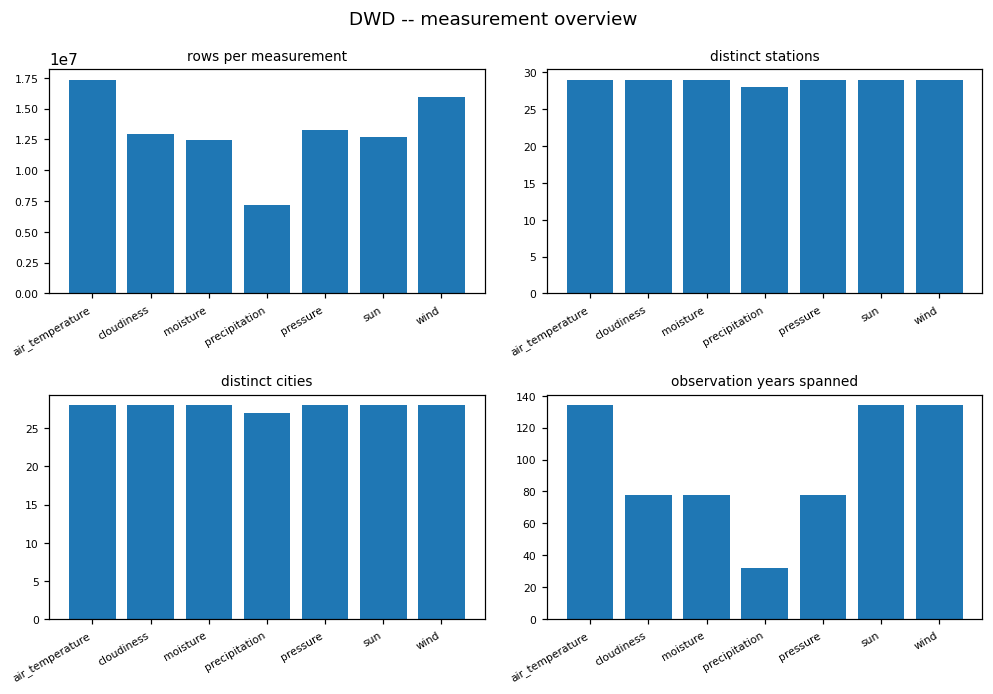

### Figure -- DWD QN quality-flag distribution

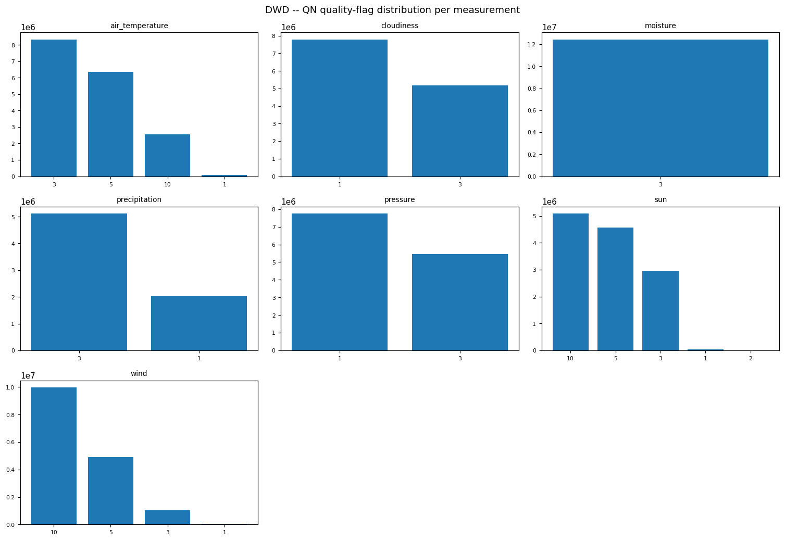

### Figure -- DWD duplicate key composition

### Figure -- DWD hourly coverage % per station

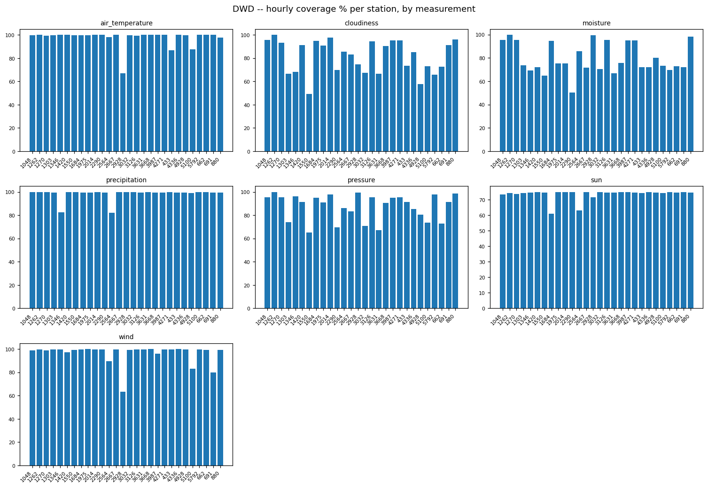

### Figure -- DWD longest missing-hours gap per station

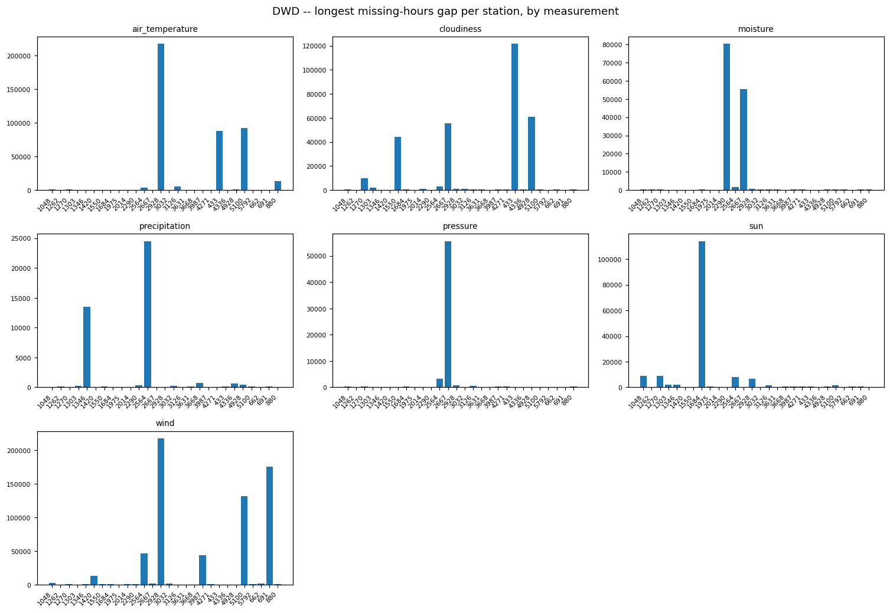

### Figure -- DWD station x measurement coverage

### Figure -- DWD value column spread per measurement

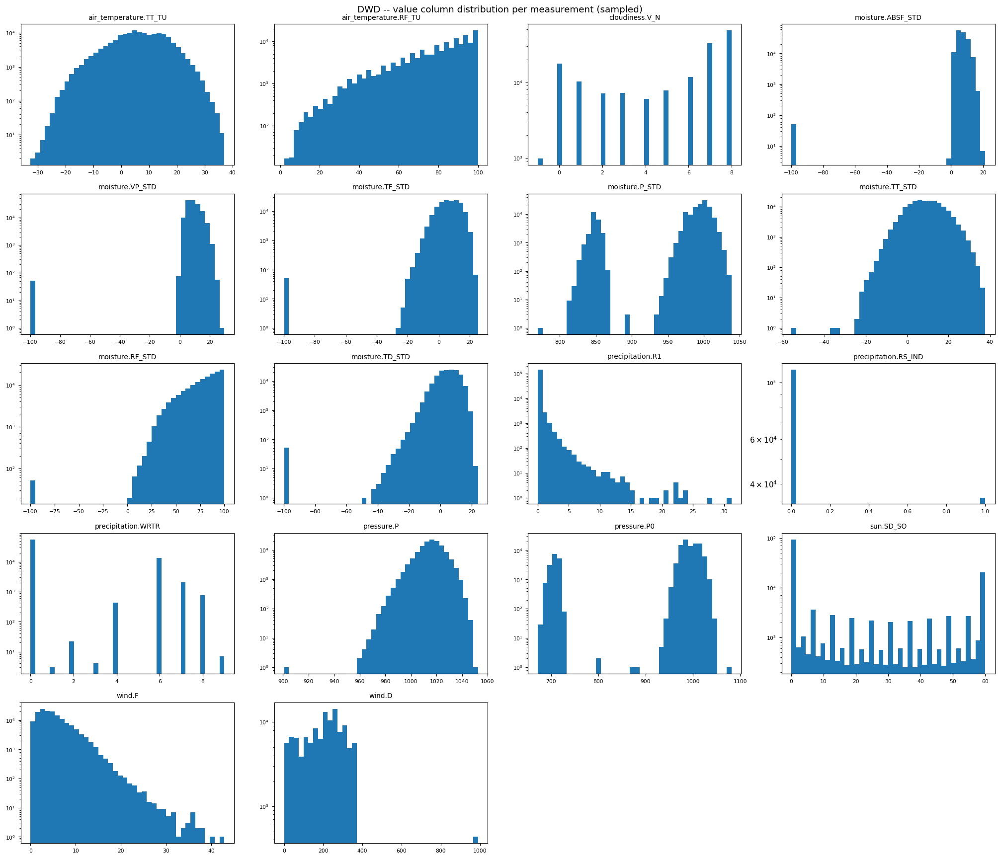

<!-- END dwd:01_weather_measurements -->

<!-- BEGIN dwd:02_station_metadata -->
## Station metadata (geography, name history, device, parameter_unit)

### Profile

| table | rows | cols | full-row dups | constant columns |
|---|---|---|---|---|
| station_geography | 222 | 7 | 0 | - |
| station_name_history | 106 | 4 | 0 | - |
| device_instrument | 4008 | 12 | 0 | - |
| parameter_unit | 5418 | 12 | 0 | Literaturhinweis |

### Structural Integrity

A generated DWD metadata export ends with a free-text trailer (`generiert: ... Deutscher Wetterdienst`); a naive CSV read turns it into a data row with a non-numeric STATIONS_ID.
- station_geography: 0 non-numeric station id(s) [], 0 row(s) carrying a trailer token -> clean.
- station_name_history: 6 non-numeric station id(s) ['Stations_ID', 'generiert: 22.04.2026 --  Deutscher Wetterdienst  --', 'generiert: 04.09.2026 --  Deutscher Wetterdienst  --', 'generiert: 24.04.2026 --  Deutscher Wetterdienst  --', 'generiert: 23.04.2026 --  Deutscher Wetterdienst  --'], 31 row(s) carrying a trailer token -> TRAILER ROW PRESENT.
- device_instrument: 43 non-numeric station id(s) ['generiert: 22.04.2026 --  Deutscher Wetterdienst  --', 'generiert: 22.04.2026 --  Deutscher Wetterdienst  --', 'generiert: 04.09.2026 --  Deutscher Wetterdienst  --', 'generiert: 04.09.2026 --  Deutscher Wetterdienst  --', 'generiert: 24.04.2026 --  Deutscher Wetterdienst  --'], 43 row(s) carrying a trailer token -> TRAILER ROW PRESENT.
- parameter_unit: 6 non-numeric station id(s) ['Legende: FT  = Folgetag', 'generiert: 22.04.2026 --  Deutscher Wetterdienst  --', 'generiert: 04.09.2026 --  Deutscher Wetterdienst  --', 'generiert: 24.04.2026 --  Deutscher Wetterdienst  --', 'generiert: 23.04.2026 --  Deutscher Wetterdienst  --'], 882 row(s) carrying a trailer token -> TRAILER ROW PRESENT.
-> INGESTION defect in ['station_name_history', 'device_instrument', 'parameter_unit']: fix `scripts/ingestion/stage_dwd.py` to strip the trailer, re-stage, re-upload to the Volume and re-run the DWD Bronze loader; until then, filter non-numeric STATIONS_ID before any join.

### Data Quality

Validity-period columns (von_datum / bis_datum):
- station_geography: open-ended=31, inverted ranges=0, of 222 rows
- station_name_history: open-ended=61, inverted ranges=0, of 106 rows
- device_instrument: open-ended=43, inverted ranges=0, of 4008 rows
- parameter_unit: open-ended=6, inverted ranges=0, of 5418 rows

Per-station row counts: station_geography -> {'1048': 7, '1262': 4, '1270': 6, '1303': 9, '1346': 6, '1420': 10, '1550': 9, '1684': 16, '1975': 6, '2014': 7, '2290': 5, '2564': 10, '2667': 6, '2928': 16, '3032': 5, '3126': 17, '3631': 8, '3668': 7, '3987': 4, '4271': 6, '433': 8, '4336': 5, '4928': 7, '5100': 4, '5792': 2, '662': 6, '691': 17, '880': 9}; station_name_history -> {'1048': 5, '1262': 2, '1270': 5, '1303': 5, '1346': 2, '1420': 3, '1550': 3, '1684': 4, '1975': 3, '2014': 3, '2290': 3, '2564': 5, '2667': 4, '2928': 5, '3032': 3, '3126': 4, '3631': 5, '3668': 3, '3987': 4, '4271': 4, '433': 3, '4336': 4, '4928': 2, '5100': 3, '5792': 3, '662': 3, '691': 3, '880': 4, 'Stations_ID': 1, 'generiert: 04.09.2026 --  Deutscher Wetterdienst  --': 1, 'generiert: 14.06.2026 --  Deutscher Wetterdienst  --': 1, 'generiert: 22.04.2026 --  Deutscher Wetterdienst  --': 1, 'generiert: 23.04.2026 --  Deutscher Wetterdienst  --': 1, 'generiert: 24.04.2026 --  Deutscher Wetterdienst  --': 1}; device_instrument -> {'1048': 120, '1262': 129, '1270': 193, '1303': 185, '1346': 128, '1420': 163, '1550': 156, '1684': 166, '1975': 154, '2014': 161, '2290': 140, '2564': 120, '2667': 142, '2928': 156, '3032': 100, '3126': 128, '3631': 156, '3668': 133, '3987': 115, '4271': 141, '433': 169, '4336': 114, '4928': 112, '5100': 157, '5792': 77, '662': 152, '691': 164, '880': 134, 'generiert: 04.09.2026 --  Deutscher Wetterdienst  --': 19, 'generiert: 14.06.2026 --  Deutscher Wetterdienst  --': 1, 'generiert: 22.04.2026 --  Deutscher Wetterdienst  --': 4, 'generiert: 23.04.2026 --  Deutscher Wetterdienst  --': 9, 'generiert: 24.04.2026 --  Deutscher Wetterdienst  --': 10}; parameter_unit -> {'1048': 174, '1262': 136, '1270': 156, '1303': 229, '1346': 262, '1420': 197, '1550': 209, '1684': 163, '1975': 194, '2014': 232, '2290': 185, '2564': 181, '2667': 199, '2928': 132, '3032': 208, '3126': 177, '3631': 224, '3668': 215, '3987': 164, '4271': 164, '433': 197, '4336': 235, '4928': 169, '5100': 237, '5792': 197, '662': 220, '691': 215, '880': 141, 'Legende: FT  = Folgetag': 1, 'generiert: 04.09.2026 --  Deutscher Wetterdienst  --': 1, 'generiert: 14.06.2026 --  Deutscher Wetterdienst  --': 1, 'generiert: 22.04.2026 --  Deutscher Wetterdienst  --': 1, 'generiert: 23.04.2026 --  Deutscher Wetterdienst  --': 1, 'generiert: 24.04.2026 --  Deutscher Wetterdienst  --': 1}

### Categorical / Domain Validation

parameter_unit declared codes: ['ABSF_STD', 'D', 'DD', 'F', 'FF', 'FX_911', 'None', 'P', 'P0', 'P_STD', 'R1', 'RF_STD', 'RF_TU', 'RS_IND', 'SD_SO', 'TD', 'TD_STD', 'TF_STD', 'TT', 'TT_STD', 'TT_TU', 'VP_STD', 'V_N', 'V_S1_CS', 'V_S1_CSA', 'V_S1_HHS', 'V_S1_NS', 'V_S2_CS', 'V_S2_CSA', 'V_S2_HHS', 'V_S2_NS', 'V_S3_CS', 'V_S3_CSA', 'V_S3_HHS', 'V_S3_NS', 'V_S4_CS', 'V_S4_CSA', 'V_S4_HHS', 'V_S4_NS', 'V_TE002', 'V_TE005', 'V_TE010', 'V_TE020', 'V_TE050', 'V_TE100', 'V_VV', 'WRTR', 'WW']
value-column codes present in measurements but NOT in parameter_unit: []
parameter_unit codes never used as a measurement value column: ['DD', 'FF', 'FX_911', 'None', 'TD', 'TT', 'V_S1_CS', 'V_S1_CSA', 'V_S1_HHS', 'V_S1_NS', 'V_S2_CS', 'V_S2_CSA', 'V_S2_HHS', 'V_S2_NS', 'V_S3_CS', 'V_S3_CSA', 'V_S3_HHS', 'V_S3_NS', 'V_S4_CS', 'V_S4_CSA', 'V_S4_HHS', 'V_S4_NS', 'V_TE002', 'V_TE005', 'V_TE010', 'V_TE020', 'V_TE050', 'V_TE100', 'V_VV', 'WW']
value columns per measurement: {'air_temperature': ['TT_TU', 'RF_TU'], 'cloudiness': ['V_N'], 'moisture': ['ABSF_STD', 'VP_STD', 'TF_STD', 'P_STD', 'TT_STD', 'RF_STD', 'TD_STD'], 'precipitation': ['R1', 'RS_IND', 'WRTR'], 'pressure': ['P', 'P0'], 'sun': ['SD_SO'], 'wind': ['F', 'D']}
An unknown code is a measured parameter with no declared unit -- attach it at Silver from the DWD parameter description, do not leave the unit null.

### Spatial Consistency

Spatial validity of station_geography coordinates:
- present=222, missing=0, outside the Germany bounding box=0, (0,0)=0, lat/lon possibly swapped=0.
- relocations > 5 km (station -> km): {'662': 6.27, '691': 8.66, '2667': 5.73, '1048': 5.07, '1303': 6.98, '1420': 6.04, '2014': 6.78, '2928': 8.31, '3126': 10.14, '3668': 6.52}.
A coordinate outside Germany / at (0,0) is a quarantine class, not a silent NULL. A multi-km relocation means the station's location is time-varying -- join on the von/bis window, not station id alone. There is no second coordinate source to cross-check against (LIMITATION).

### Entities / Keys

Distinct stations across the 7 measurement tables: 28 -> ['1048', '1262', '1270', '1303', '1346', '1420', '1550', '1684', '1975', '2014', '2290', '2564', '2667', '2928', '3032', '3126', '3631', '3668', '3987', '4271', '433', '4336', '4928', '5100', '5792', '662', '691', '880'].
Metadata rows per station id:
- station_geography: {'1048': 7, '1262': 4, '1270': 6, '1303': 9, '1346': 6, '1420': 10, '1550': 9, '1684': 16, '1975': 6, '2014': 7, '2290': 5, '2564': 10, '2667': 6, '2928': 16, '3032': 5, '3126': 17, '3631': 8, '3668': 7, '3987': 4, '4271': 6, '433': 8, '4336': 5, '4928': 7, '5100': 4, '5792': 2, '662': 6, '691': 17, '880': 9}
- station_name_history: {'1048': 5, '1262': 2, '1270': 5, '1303': 5, '1346': 2, '1420': 3, '1550': 3, '1684': 4, '1975': 3, '2014': 3, '2290': 3, '2564': 5, '2667': 4, '2928': 5, '3032': 3, '3126': 4, '3631': 5, '3668': 3, '3987': 4, '4271': 4, '433': 3, '4336': 4, '4928': 2, '5100': 3, '5792': 3, '662': 3, '691': 3, '880': 4, 'Stations_ID': 1, 'generiert: 04.09.2026 --  Deutscher Wetterdienst  --': 1, 'generiert: 14.06.2026 --  Deutscher Wetterdienst  --': 1, 'generiert: 22.04.2026 --  Deutscher Wetterdienst  --': 1, 'generiert: 23.04.2026 --  Deutscher Wetterdienst  --': 1, 'generiert: 24.04.2026 --  Deutscher Wetterdienst  --': 1}
- device_instrument: {'1048': 120, '1262': 129, '1270': 193, '1303': 185, '1346': 128, '1420': 163, '1550': 156, '1684': 166, '1975': 154, '2014': 161, '2290': 140, '2564': 120, '2667': 142, '2928': 156, '3032': 100, '3126': 128, '3631': 156, '3668': 133, '3987': 115, '4271': 141, '433': 169, '4336': 114, '4928': 112, '5100': 157, '5792': 77, '662': 152, '691': 164, '880': 134, 'generiert: 04.09.2026 --  Deutscher Wetterdienst  --': 19, 'generiert: 14.06.2026 --  Deutscher Wetterdienst  --': 1, 'generiert: 22.04.2026 --  Deutscher Wetterdienst  --': 4, 'generiert: 23.04.2026 --  Deutscher Wetterdienst  --': 9, 'generiert: 24.04.2026 --  Deutscher Wetterdienst  --': 10}
- parameter_unit: {'1048': 174, '1262': 136, '1270': 156, '1303': 229, '1346': 262, '1420': 197, '1550': 209, '1684': 163, '1975': 194, '2014': 232, '2290': 185, '2564': 181, '2667': 199, '2928': 132, '3032': 208, '3126': 177, '3631': 224, '3668': 215, '3987': 164, '4271': 164, '433': 197, '4336': 235, '4928': 169, '5100': 237, '5792': 197, '662': 220, '691': 215, '880': 141, 'Legende: FT  = Folgetag': 1, 'generiert: 04.09.2026 --  Deutscher Wetterdienst  --': 1, 'generiert: 14.06.2026 --  Deutscher Wetterdienst  --': 1, 'generiert: 22.04.2026 --  Deutscher Wetterdienst  --': 1, 'generiert: 23.04.2026 --  Deutscher Wetterdienst  --': 1, 'generiert: 24.04.2026 --  Deutscher Wetterdienst  --': 1}

### Coverage

Measurement stations with NO row in each metadata table:
- station_geography: 0 missing -> []
- station_name_history: 0 missing -> []
- device_instrument: 0 missing -> []
- parameter_unit: 0 missing -> []

### Domain Findings

station_geography carries multiple location rows per station where coordinates/elevation changed over time:
- station 433: 8 location row(s), lat span=0.0189, lon span=0.0319, elevation span=4.0 m, ~3.09 km moved
- station 662: 6 location row(s), lat span=0.0476, lon span=0.0475, elevation span=4.0 m, ~6.27 km moved
- station 691: 17 location row(s), lat span=0.0531, lon span=0.0893, elevation span=10.7 m, ~8.66 km moved
- station 2667: 6 location row(s), lat span=0.0194, lon span=0.0748, elevation span=40.91 m, ~5.73 km moved
- station 880: 9 location row(s), lat span=0.034, lon span=0.0336, elevation span=5.34 m, ~4.46 km moved
- station 1048: 7 location row(s), lat span=0.0442, lon span=0.0178, elevation span=77.0 m, ~5.07 km moved
- station 1270: 6 location row(s), lat span=0.0088, lon span=0.041, elevation span=62.61 m, ~3.07 km moved
- station 1303: 9 location row(s), lat span=0.0409, lon span=0.0747, elevation span=48.5 m, ~6.98 km moved
- station 1346: 6 location row(s), lat span=0.0016, lon span=0.0006, elevation span=5.0 m, ~0.18 km moved
- station 1420: 10 location row(s), lat span=0.0237, lon span=0.0766, elevation span=12.3 m, ~6.04 km moved
- station 1550: 9 location row(s), lat span=0.0168, lon span=0.0509, elevation span=19.25 m, ~4.07 km moved
- station 1684: 16 location row(s), lat span=0.0114, lon span=0.0394, elevation span=37.48 m, ~3.07 km moved
- station 1975: 6 location row(s), lat span=0.0074, lon span=0.0158, elevation span=2.35 m, ~1.39 km moved
- station 2014: 7 location row(s), lat span=0.0461, lon span=0.0626, elevation span=3.94 m, ~6.78 km moved
- station 2290: 5 location row(s), lat span=0.0001, lon span=0.0025, elevation span=9.4 m, ~0.18 km moved
- station 2564: 10 location row(s), lat span=0.008, lon span=0.0177, elevation span=24.41 m, ~1.54 km moved
- station 2928: 16 location row(s), lat span=0.0582, lon span=0.0737, elevation span=41.0 m, ~8.31 km moved
- station 3126: 17 location row(s), lat span=0.0318, lon span=0.1339, elevation span=34.0 m, ~10.14 km moved
- station 1262: 4 location row(s), lat span=0.01, lon span=0.0104, elevation span=1.9 m, ~1.33 km moved
- station 3631: 8 location row(s), lat span=0.0111, lon span=0.0115, elevation span=11.2 m, ~1.48 km moved
- station 3668: 7 location row(s), lat span=0.053, lon span=0.0395, elevation span=14.8 m, ~6.52 km moved
- station 3987: 4 location row(s), lat span=0.0, lon span=0.0, elevation span=0.0 m, ~0.0 km moved
- station 4271: 6 location row(s), lat span=0.0055, lon span=0.0349, elevation span=3.78 m, ~2.55 km moved
- station 4336: 5 location row(s), lat span=0.0058, lon span=0.0037, elevation span=4.04 m, ~0.7 km moved
- station 4928: 7 location row(s), lat span=0.0, lon span=0.0002, elevation span=0.28 m, ~0.01 km moved
- station 3032: 5 location row(s), lat span=0.0118, lon span=0.0254, elevation span=19.7 m, ~2.23 km moved
- station 5100: 4 location row(s), lat span=0.0003, lon span=0.0074, elevation span=65.0 m, ~0.53 km moved
- station 5792: 2 location row(s), lat span=0.0, lon span=0.0, elevation span=0.0 m, ~0.0 km moved

station_name_history name/operator changes:
- station 433: 3 history row(s), 3 distinct name(s)
- station Stations_ID: 1 history row(s), 1 distinct name(s)
- station generiert: 22.04.2026 --  Deutscher Wetterdienst  --: 1 history row(s), 1 distinct name(s)
- station generiert: 04.09.2026 --  Deutscher Wetterdienst  --: 1 history row(s), 1 distinct name(s)
- station generiert: 24.04.2026 --  Deutscher Wetterdienst  --: 1 history row(s), 1 distinct name(s)
- station generiert: 23.04.2026 --  Deutscher Wetterdienst  --: 1 history row(s), 1 distinct name(s)
- station 662: 3 history row(s), 3 distinct name(s)
- station 691: 3 history row(s), 3 distinct name(s)
- station 2667: 4 history row(s), 4 distinct name(s)
- station 880: 4 history row(s), 4 distinct name(s)
- station 1048: 5 history row(s), 5 distinct name(s)
- station 1270: 5 history row(s), 5 distinct name(s)
- station 1303: 5 history row(s), 5 distinct name(s)
- station 1346: 2 history row(s), 2 distinct name(s)
- station 1420: 3 history row(s), 3 distinct name(s)
- station 1550: 3 history row(s), 3 distinct name(s)
- station 1684: 4 history row(s), 4 distinct name(s)
- station 1975: 3 history row(s), 3 distinct name(s)
- station 2014: 3 history row(s), 3 distinct name(s)
- station 2290: 3 history row(s), 3 distinct name(s)
- station 2564: 5 history row(s), 5 distinct name(s)
- station 2928: 5 history row(s), 5 distinct name(s)
- station 3126: 4 history row(s), 4 distinct name(s)
- station generiert: 14.06.2026 --  Deutscher Wetterdienst  --: 1 history row(s), 1 distinct name(s)
- station 1262: 2 history row(s), 2 distinct name(s)
- station 3631: 5 history row(s), 3 distinct name(s)
- station 3668: 3 history row(s), 3 distinct name(s)
- station 3987: 4 history row(s), 4 distinct name(s)
- station 4271: 4 history row(s), 4 distinct name(s)
- station 4336: 4 history row(s), 3 distinct name(s)
- station 4928: 2 history row(s), 2 distinct name(s)
- station 3032: 3 history row(s), 3 distinct name(s)
- station 5100: 3 history row(s), 3 distinct name(s)
- station 5792: 3 history row(s), 3 distinct name(s)

### ML-Readiness Evidence

- **Grain / grain drift:** station_geography / station_name_history are one row per (station, validity period), NOT one row per station -- a split must group by station id.
- **Join multiplication (1:N / M:N expansion):** measurement -> metadata is 1:N for the 28 relocated and 28 renamed stations unless scoped to the von/bis window -- an un-windowed join cartesian-explodes those stations' fact rows.
- **Target contamination:** Station relocation and name/operator changes are event indicators, not attributes of a static station dimension -- if used as a target, treat them as change events; the metadata tables carry no other labelled outcome.
- **Temporal / post-event leakage:** Joining a measurement row to a station's metadata must use the validity window covering that row's MESS_DATUM -- a later relocation's coordinates in a historical feature is future information.
- **Proxy leakage:** Station id / name / exact coordinates identify one site -- a model given them memorises the station.
- **Split / entity leakage:** Split by station id, not by row -- a station's multiple validity-period rows must stay on one side.
- **Historical-reference (point-in-time) leakage:** Same as Temporal -- use the metadata value valid during the archive row's period, never the latest.
- **Survivorship / coverage bias:** 0 metadata table(s) miss some measurement stations -- a joined feature set silently drops those stations' rows.
- **Missingness leakage:** Whether a station has a geography / name-history row correlates with how long it has been in the network.
- **Duplicate-event leakage:** Full-row duplicates per table shown in Profile -- de-duplicate before treating a validity-period row as one event.
- **Target / feature temporal misalignment:** von_datum / bis_datum bound the period; align a joined metadata attribute to the fact row's hour, not the period edge.
- **Unit / sign / circular-feature leakage:** parameter_unit reconciliation above -- attach units before combining measured parameters.
- **Data-generation-process leakage:** A parser trailer row (Structural Integrity) would inject a non-station into every station-keyed join -- filter it first.
- **Class / label instability:** device_instrument / parameter_unit codes are DWD enumerations that evolve between archive versions -- pin the version.
- **Label availability lag:** Not applicable -- static reference metadata.
- **Source / version / regime change:** Validity periods span decades; the network, instrumentation and the metadata schema itself changed over that span -- a metadata attribute is only comparable within one era.
- **Sample-vs-full divergence:** All four metadata tables are fully collected (small); the measurement-station union is a full unsampled Spark scan.

### EDA Findings

- relocations (station -> location rows): {'433': 8, '662': 6, '691': 17, '2667': 6, '880': 9, '1048': 7, '1270': 6, '1303': 9, '1346': 6, '1420': 10, '1550': 9, '1684': 16, '1975': 6, '2014': 7, '2290': 5, '2564': 10, '2928': 16, '3126': 17, '1262': 4, '3631': 8, '3668': 7, '3987': 4, '4271': 6, '4336': 5, '4928': 7, '3032': 5, '5100': 4, '5792': 2}
- name changes (station -> distinct names): {'433': 3, '662': 3, '691': 3, '2667': 4, '880': 4, '1048': 5, '1270': 5, '1303': 5, '1346': 2, '1420': 3, '1550': 3, '1684': 4, '1975': 3, '2014': 3, '2290': 3, '2564': 5, '2928': 5, '3126': 4, '1262': 2, '3631': 3, '3668': 3, '3987': 4, '4271': 4, '4336': 3, '4928': 2, '3032': 3, '5100': 3, '5792': 3}
- validity periods (open-ended, inverted, total): {'station_geography': (31, 0, 222), 'station_name_history': (61, 0, 106), 'device_instrument': (43, 0, 4008), 'parameter_unit': (6, 0, 5418)}
- metadata coverage gaps vs measurements: {'station_geography': 0, 'station_name_history': 0, 'device_instrument': 0, 'parameter_unit': 0}
- parser trailer suspected in: ['station_name_history', 'device_instrument', 'parameter_unit']

### Silver Implications

- BLOCKED for ['station_name_history', 'device_instrument', 'parameter_unit']: strip the parser trailer in stage_dwd.py and re-run Bronze.
- station_geography has >1 location row for some stations (relocations) -> station location is time-varying; join measurement rows on the von/bis window, not station_id alone.
- station_name_history has >1 name/operator per station over time -> a second time-varying attribute stream.
- device_instrument / parameter_unit are small static lookups -> reference dimensions; reconcile parameter codes with the measurement value-column names (list above).

### Figure -- DWD station_geography -- station locations & relocations

### Figure -- DWD metadata -- overview

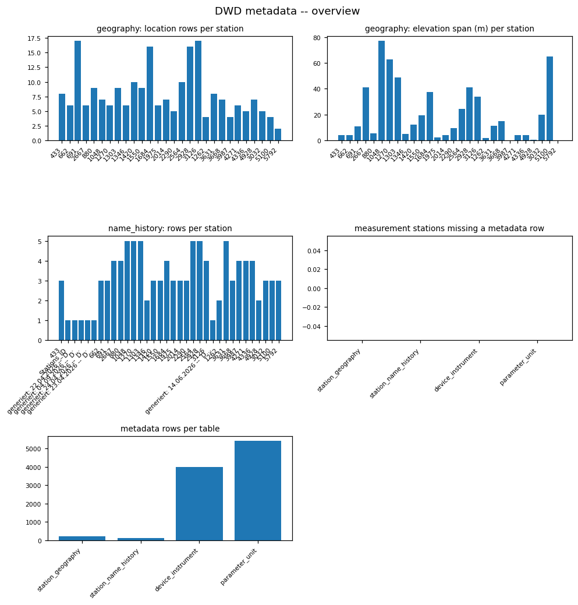

### Figure -- DWD metadata -- rows per station, by table

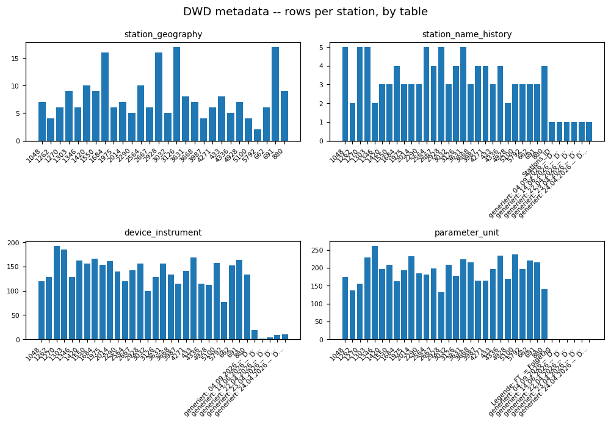

### Figure -- DWD metadata -- validity-period row composition, by table

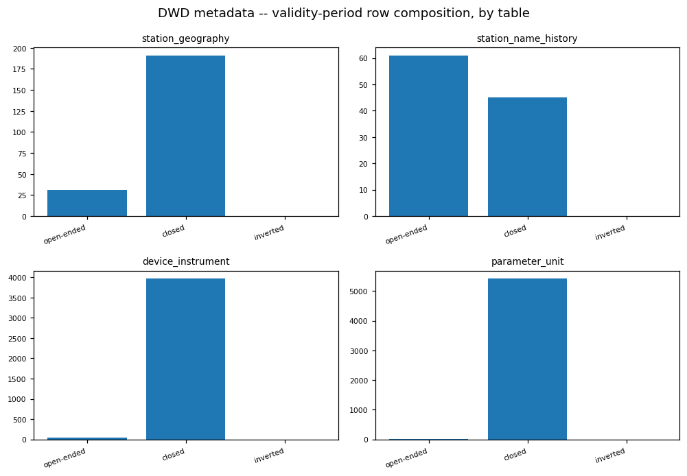

<!-- END dwd:02_station_metadata -->

<!-- BEGIN dwd:03_missing_data -->
## Missing data (reported periods vs observed -999/blank)

### Profile

- `dwd_missing_value_periods`: 5897409 rows, columns ['Stations_ID', 'Stations_Name', 'Parameter', 'Von_Datum', 'Bis_Datum', 'Anzahl_Fehlwerte', 'Beschreibung', 'eor']
- station-id column: `Stations_ID`  parameter column: `Parameter`  von/bis: `Von_Datum`/`Bis_Datum`
- periods per station: {'1975': 346291, '2014': 359772, '2290': 188455, '2564': 144234, '433': 245382, '662': 145518, '691': 322436, '2667': 324565, '1346': 157432, '1420': 324360, '1550': 143903, '1684': 179654, '880': 156513, '1048': 207178, '1270': 213849, '1303': 151015, '2928': 95170, '3126': 190032, '1262': 173228, '3631': 206580, '3668': 301343, '3987': 191507, '4271': 144384, '4336': 260165, '4928': 150261, '3032': 168922, '5100': 197411, '5792': 207849}
- periods per parameter: {'V_S2_CS': 666636, 'V_S2_CSA': 666636, 'V_S2_HHS': 708547, 'V_S3_NS': 354863, 'V_S3_CS': 313165, 'V_S3_CSA': 313165, 'V_S3_HHS': 354774, 'V_S4_NS': 43539, 'V_S4_CS': 43539, 'V_S4_CSA': 43539, 'V_S4_HHS': 42759, 'V_N': 162243, 'V_S1_NS': 226046, 'V_S1_HHS': 240170, 'V_S2_NS': 708529, 'TT': 66445, 'TD': 67538, 'FX_911': 41812, 'R1': 3369, 'RS_IND': 3363, 'WRTR': 23020, 'P0': 21712, 'P': 57620, 'V_TE005': 4995, 'V_TE010': 5112, 'V_TE020': 4970, 'V_TE050': 3689, 'V_TE100': 22670, 'SD_SO': 916, 'WW': 108152, 'F': 4630, 'D': 4816, 'FF': 69293, 'DD': 69941, 'TT_TU': 1067, 'RF_TU': 1571, 'V_S1_CS': 210075, 'V_S1_CSA': 210075, 'V_TE002': 2408}

### Data Quality

- REPORTED = a row in dwd_missing_value_periods; OBSERVED = a measurement value that is `-999` or blank. They are not guaranteed to line up.
- reconciliation: station x parameter with -999 observed but NO reported period: 6
- reconciliation: station x parameter with a reported period but ZERO observed -999/blank: 42

### Categorical / Domain Validation

Reported parameter codes vs the measurement value-column names (the DWD parameter code IS the column name):
- reported codes not a measurement value column: ['DD', 'FF', 'FX_911', 'TD', 'TT', 'V_S1_CS', 'V_S1_CSA', 'V_S1_HHS', 'V_S1_NS', 'V_S2_CS', 'V_S2_CSA', 'V_S2_HHS', 'V_S2_NS', 'V_S3_CS', 'V_S3_CSA', 'V_S3_HHS', 'V_S3_NS', 'V_S4_CS', 'V_S4_CSA', 'V_S4_HHS', 'V_S4_NS', 'V_TE002', 'V_TE005', 'V_TE010', 'V_TE020', 'V_TE050', 'V_TE100', 'WW']
- measurement value columns never in a reported period: ['ABSF_STD', 'P_STD', 'RF_STD', 'TD_STD', 'TF_STD', 'TT_STD', 'VP_STD']
An unknown reported code points to a parameter outside the seven measurement tables profiled here (a deepening measurement, 05) or a code drift -- reconcile before treating REPORTED and OBSERVED as one signal.

### Temporal Consistency

Reported-period span (hours): parsed 0 of 5897409 rows.
- unparsed von/bis samples: [('19.01.2005-10:00', '19.01.2005-12:00'), ('19.01.2005-18:00', '19.01.2005-21:00'), ('20.01.2005-08:00', '20.01.2005-08:00'), ('20.01.2005-15:00', '20.01.2005-15:00'), ('20.01.2005-19:00', '20.01.2005-19:00'), ('21.01.2005-06:00', '21.01.2005-09:00'), ('21.01.2005-20:00', '21.01.2005-20:00'), ('22.01.2005-00:00', '22.01.2005-07:00'), ('22.01.2005-09:00', '22.01.2005-12:00'), ('22.01.2005-16:00', '22.01.2005-16:00')]
- `von_datum` > `bis_datum` (inverted) in 0 rows -- a validity check is needed at Silver.
- longest reported missing period per station (hours): {}

### Regime / Version Evidence

Observed -999/blank rate by year per measurement -- missingness is time-varying, so no uniform-completeness assumption holds and any imputation is an explicit, evidenced choice per era.

- air_temperature: [('1893', 0.0), ('1894', 0.0), ('1895', 0.0), ('1896', 0.0), ('1897', 0.0), ('1898', 0.0), ('1899', 0.0), ('1900', 0.0), ('1901', 0.0), ('1902', 0.0), ('1903', 0.0), ('1904', 0.0), ('1905', 0.0), ('1906', 0.0), ('1907', 0.0), ('1908', 0.0), ('1909', 0.0), ('1910', 0.0), ('1911', 0.0), ('1912', 0.0), ('1913', 0.0), ('1914', 0.0), ('1915', 0.0), ('1916', 0.0), ('1917', 0.0), ('1918', 0.0), ('1919', 0.0), ('1920', 0.0), ('1921', 0.0), ('1922', 0.0), ('1923', 0.0), ('1924', 0.0), ('1925', 0.0), ('1926', 0.0), ('1927', 0.0), ('1928', 0.0), ('1929', 0.0), ('1930', 0.0), ('1931', 0.0), ('1932', 0.0), ('1933', 0.0), ('1934', 0.0), ('1935', 0.0), ('1936', 0.0), ('1937', 0.0), ('1938', 0.0), ('1939', 0.0), ('1940', 0.0), ('1941', 0.0), ('1942', 0.0), ('1943', 0.0), ('1944', 0.0), ('1945', 0.0), ('1946', 0.0), ('1947', 0.0), ('1948', 0.0), ('1949', 0.0), ('1950', 0.0), ('1951', 0.0), ('1952', 0.0), ('1953', 0.0), ('1954', 0.0), ('1955', 0.0), ('1956', 0.0476), ('1957', 0.0476), ('1958', 0.0488), ('1959', 0.0478), ('1960', 0.0455), ('1961', 0.0), ('1962', 0.0028), ('1963', 0.0), ('1964', 0.0036), ('1965', 0.0022), ('1966', 0.0), ('1967', 0.0), ('1968', 0.0), ('1969', 0.0), ('1970', 0.0), ('1971', 0.0), ('1972', 0.0), ('1973', 0.0), ('1974', 0.0), ('1975', 0.0), ('1976', 0.0), ('1977', 0.0), ('1978', 0.0), ('1979', 0.0), ('1980', 0.0), ('1981', 0.0), ('1982', 0.0), ('1983', 0.0), ('1984', 0.0), ('1985', 0.0), ('1986', 0.0), ('1987', 0.0), ('1988', 0.0), ('1989', 0.0001), ('1990', 0.0001), ('1991', 0.0002), ('1992', 0.0), ('1993', 0.0), ('1994', 0.0), ('1995', 0.0004), ('1996', 0.0), ('1997', 0.0001), ('1998', 0.0001), ('1999', 0.001), ('2000', 0.0007), ('2001', 0.0001), ('2002', 0.0), ('2003', 0.0), ('2004', 0.0002), ('2005', 0.0001), ('2006', 0.0001), ('2007', 0.0), ('2008', 0.0001), ('2009', 0.0), ('2010', 0.0), ('2011', 0.0001), ('2012', 0.0003), ('2013', 0.0001), ('2014', 0.0012), ('2015', 0.0003), ('2016', 0.0003), ('2017', 0.0027), ('2018', 0.0043), ('2019', 0.0026), ('2020', 0.0007), ('2021', 0.0029), ('2022', 0.0021), ('2023', 0.0043), ('2024', 0.0009), ('2025', 0.0042), ('2026', 0.0043)]
- cloudiness: [('1949', 0.0), ('1950', 0.0), ('1951', 0.0), ('1952', 0.0), ('1953', 0.0), ('1954', 0.0), ('1955', 0.0), ('1956', 0.0), ('1957', 0.0), ('1958', 0.0), ('1959', 0.0), ('1960', 0.0), ('1961', 0.0), ('1962', 0.0), ('1963', 0.0), ('1964', 0.0), ('1965', 0.0), ('1966', 0.0), ('1967', 0.0), ('1968', 0.0), ('1969', 0.0), ('1970', 0.0), ('1971', 0.0), ('1972', 0.0), ('1973', 0.0), ('1974', 0.0), ('1975', 0.0), ('1976', 0.0), ('1977', 0.0), ('1978', 0.0), ('1979', 0.0), ('1980', 0.0), ('1981', 0.0), ('1982', 0.0), ('1983', 0.0), ('1984', 0.0), ('1985', 0.0), ('1986', 0.0), ('1987', 0.0), ('1988', 0.0), ('1989', 0.0), ('1990', 0.0), ('1991', 0.0), ('1992', 0.0), ('1993', 0.0), ('1994', 0.0), ('1995', 0.0), ('1996', 0.0), ('1997', 0.0), ('1998', 0.0), ('1999', 0.0), ('2000', 0.0), ('2001', 0.0), ('2002', 0.0), ('2003', 0.0), ('2004', 0.0), ('2005', 0.0), ('2006', 0.0), ('2007', 0.0), ('2008', 0.0), ('2009', 0.0), ('2010', 0.0), ('2011', 0.0), ('2012', 0.0), ('2013', 0.0), ('2014', 0.0), ('2015', 0.0), ('2016', 0.0), ('2017', 0.0), ('2018', 0.0), ('2019', 0.0), ('2020', 0.0), ('2021', 0.0), ('2022', 0.0), ('2023', 0.0), ('2024', 0.0), ('2025', 0.0), ('2026', 0.0)]
- moisture: [('1949', 0.0), ('1950', 0.0), ('1951', 0.0), ('1952', 0.0), ('1953', 0.0), ('1954', 0.0), ('1955', 0.0), ('1956', 0.0), ('1957', 0.0), ('1958', 0.0), ('1959', 0.0), ('1960', 0.0), ('1961', 0.0), ('1962', 0.0), ('1963', 0.0), ('1964', 0.0), ('1965', 0.0), ('1966', 0.0), ('1967', 0.0), ('1968', 0.0), ('1969', 0.0), ('1970', 0.0), ('1971', 0.0), ('1972', 0.0), ('1973', 0.0), ('1974', 0.0), ('1975', 0.0), ('1976', 0.0), ('1977', 0.0), ('1978', 0.0), ('1979', 0.0), ('1980', 0.0), ('1981', 0.0), ('1982', 0.0), ('1983', 0.0), ('1984', 0.0), ('1985', 0.0), ('1986', 0.0), ('1987', 0.0), ('1988', 0.0), ('1989', 0.0), ('1990', 0.0352), ('1991', 0.0354), ('1992', 0.0328), ('1993', 0.0335), ('1994', 0.0351), ('1995', 0.0033), ('1996', 0.0), ('1997', 0.0), ('1998', 0.0), ('1999', 0.0), ('2000', 0.0), ('2001', 0.0), ('2002', 0.0), ('2003', 0.0), ('2004', 0.0), ('2005', 0.0), ('2006', 0.0), ('2007', 0.0), ('2008', 0.0), ('2009', 0.0), ('2010', 0.0), ('2011', 0.0), ('2012', 0.001), ('2013', 0.0286), ('2014', 0.0358), ('2015', 0.0357), ('2016', 0.0357), ('2017', 0.0358), ('2018', 0.0342), ('2019', 0.0357), ('2020', 0.0354), ('2021', 0.0358), ('2022', 0.0357), ('2023', 0.0189), ('2024', 0.0), ('2025', 0.0), ('2026', 0.0)]
- precipitation: [('1995', 1.0), ('1996', 1.0), ('1997', 1.0), ('1998', 1.0), ('1999', 1.0), ('2000', 1.0), ('2001', 0.5813), ('2002', 0.4654), ('2003', 0.4652), ('2004', 0.4605), ('2005', 0.4286), ('2006', 0.3968), ('2007', 0.3716), ('2008', 0.401), ('2009', 0.4927), ('2010', 0.524), ('2011', 0.5263), ('2012', 0.5265), ('2013', 0.5817), ('2014', 0.5994), ('2015', 0.627), ('2016', 0.6523), ('2017', 0.5594), ('2018', 0.3701), ('2019', 0.3679), ('2020', 0.3592), ('2021', 0.3596), ('2022', 0.2122), ('2023', 0.0253), ('2024', 0.0034), ('2025', 0.0016), ('2026', 0.0061)]
- pressure: [('1949', 1.0), ('1950', 1.0), ('1951', 1.0), ('1952', 1.0), ('1953', 1.0), ('1954', 1.0), ('1955', 1.0), ('1956', 1.0), ('1957', 1.0), ('1958', 1.0), ('1959', 1.0), ('1960', 1.0), ('1961', 1.0), ('1962', 1.0), ('1963', 1.0), ('1964', 1.0), ('1965', 1.0), ('1966', 1.0), ('1967', 1.0), ('1968', 1.0), ('1969', 1.0), ('1970', 1.0), ('1971', 1.0), ('1972', 1.0), ('1973', 1.0), ('1974', 1.0), ('1975', 1.0), ('1976', 1.0), ('1977', 1.0), ('1978', 1.0), ('1979', 1.0), ('1980', 1.0), ('1981', 1.0), ('1982', 1.0), ('1983', 1.0), ('1984', 1.0), ('1985', 1.0), ('1986', 1.0), ('1987', 0.8942), ('1988', 0.4016), ('1989', 0.4065), ('1990', 0.3398), ('1991', 0.1185), ('1992', 0.1085), ('1993', 0.1091), ('1994', 0.1079), ('1995', 0.1063), ('1996', 0.1138), ('1997', 0.1107), ('1998', 0.1088), ('1999', 0.1073), ('2000', 0.1074), ('2001', 0.109), ('2002', 0.1085), ('2003', 0.1074), ('2004', 0.1077), ('2005', 0.1081), ('2006', 0.1075), ('2007', 0.1073), ('2008', 0.1074), ('2009', 0.1076), ('2010', 0.1078), ('2011', 0.1082), ('2012', 0.1078), ('2013', 0.1088), ('2014', 0.108), ('2015', 0.1075), ('2016', 0.1078), ('2017', 0.1093), ('2018', 0.1112), ('2019', 0.1086), ('2020', 0.1077), ('2021', 0.1087), ('2022', 0.1088), ('2023', 0.1108), ('2024', 0.1077), ('2025', 0.1099), ('2026', 0.112)]
- sun: [('1893', 0.0), ('1894', 0.0), ('1895', 0.0), ('1896', 0.0), ('1897', 0.0), ('1898', 0.0), ('1899', 0.0), ('1900', 0.0), ('1901', 0.0), ('1902', 0.0), ('1903', 0.0), ('1904', 0.0), ('1905', 0.0), ('1906', 0.0), ('1907', 0.0), ('1908', 0.0), ('1909', 0.0), ('1910', 0.0), ('1911', 0.0), ('1912', 0.0), ('1913', 0.0), ('1914', 0.0), ('1915', 0.0), ('1916', 0.0), ('1917', 0.0), ('1918', 0.0), ('1919', 0.0), ('1920', 0.0), ('1921', 0.0), ('1922', 0.0), ('1923', 0.0), ('1924', 0.0), ('1925', 0.0), ('1926', 0.0), ('1927', 0.0), ('1928', 0.0), ('1929', 0.0), ('1930', 0.0), ('1931', 0.0), ('1932', 0.0), ('1933', 0.0), ('1934', 0.0), ('1935', 0.0), ('1936', 0.0), ('1937', 0.0), ('1938', 0.0), ('1939', 0.0), ('1940', 0.0), ('1941', 0.0), ('1942', 0.0), ('1943', 0.0), ('1944', 0.0), ('1945', 0.0), ('1946', 0.0), ('1947', 0.0), ('1948', 0.0), ('1949', 0.0), ('1950', 0.0), ('1951', 0.0), ('1952', 0.0), ('1953', 0.0), ('1954', 0.0), ('1955', 0.0), ('1956', 0.0), ('1957', 0.0), ('1958', 0.0), ('1959', 0.0), ('1960', 0.0), ('1961', 0.0), ('1962', 0.0), ('1963', 0.0), ('1964', 0.0), ('1965', 0.0), ('1966', 0.0), ('1967', 0.0), ('1968', 0.0), ('1969', 0.0), ('1970', 0.0), ('1971', 0.0), ('1972', 0.0), ('1973', 0.0), ('1974', 0.0), ('1975', 0.0), ('1976', 0.0), ('1977', 0.0), ('1978', 0.0), ('1979', 0.0), ('1980', 0.0001), ('1981', 0.0), ('1982', 0.0), ('1983', 0.0), ('1984', 0.0), ('1985', 0.0), ('1986', 0.0), ('1987', 0.0), ('1988', 0.0), ('1989', 0.0), ('1990', 0.0), ('1991', 0.0), ('1992', 0.0), ('1993', 0.0), ('1994', 0.0), ('1995', 0.0), ('1996', 0.0), ('1997', 0.0), ('1998', 0.0), ('1999', 0.0), ('2000', 0.0), ('2001', 0.0), ('2002', 0.0), ('2003', 0.0), ('2004', 0.0), ('2005', 0.0), ('2006', 0.0), ('2007', 0.0), ('2008', 0.0038), ('2009', 0.0034), ('2010', 0.0041), ('2011', 0.0038), ('2012', 0.0036), ('2013', 0.0), ('2014', 0.0), ('2015', 0.0001), ('2016', 0.0), ('2017', 0.0), ('2018', 0.0), ('2019', 0.0), ('2020', 0.0), ('2021', 0.0), ('2022', 0.0), ('2023', 0.0), ('2024', 0.0), ('2025', 0.0027), ('2026', 0.0006)]
- wind: [('1893', 1.0), ('1894', 1.0), ('1895', 1.0), ('1896', 1.0), ('1897', 1.0), ('1898', 1.0), ('1899', 1.0), ('1900', 1.0), ('1901', 1.0), ('1902', 1.0), ('1903', 1.0), ('1904', 1.0), ('1905', 1.0), ('1906', 1.0), ('1907', 1.0), ('1908', 1.0), ('1909', 1.0), ('1910', 1.0), ('1911', 1.0), ('1912', 1.0), ('1913', 1.0), ('1914', 1.0), ('1915', 1.0), ('1916', 1.0), ('1917', 1.0), ('1918', 1.0), ('1924', 1.0), ('1925', 1.0), ('1926', 1.0), ('1927', 1.0), ('1928', 1.0), ('1929', 1.0), ('1930', 1.0), ('1931', 1.0), ('1932', 1.0), ('1933', 1.0), ('1934', 1.0), ('1935', 1.0), ('1936', 1.0), ('1937', 1.0), ('1938', 1.0), ('1939', 1.0), ('1940', 1.0), ('1941', 1.0), ('1942', 1.0), ('1943', 1.0), ('1944', 1.0), ('1945', 1.0), ('1946', 1.0), ('1947', 1.0), ('1948', 1.0), ('1949', 1.0), ('1950', 1.0), ('1951', 1.0), ('1952', 1.0), ('1953', 1.0), ('1954', 1.0), ('1955', 1.0), ('1956', 1.0), ('1957', 1.0), ('1958', 1.0), ('1959', 1.0), ('1960', 1.0), ('1961', 1.0), ('1962', 1.0), ('1963', 0.9333), ('1964', 0.9333), ('1965', 0.9333), ('1966', 0.9375), ('1967', 0.6969), ('1968', 0.6875), ('1969', 0.75), ('1970', 0.75), ('1971', 0.7483), ('1972', 0.776), ('1973', 0.7143), ('1974', 0.7391), ('1975', 0.0), ('1976', 0.0), ('1977', 0.0), ('1978', 0.0), ('1979', 0.0), ('1980', 0.0), ('1981', 0.0), ('1982', 0.0), ('1983', 0.0), ('1984', 0.0), ('1985', 0.0), ('1986', 0.0), ('1987', 0.0), ('1988', 0.0), ('1989', 0.0), ('1990', 0.0), ('1991', 0.0), ('1992', 0.0), ('1993', 0.0), ('1994', 0.0), ('1995', 0.0001), ('1996', 0.0001), ('1997', 0.0), ('1998', 0.0013), ('1999', 0.001), ('2000', 0.0), ('2001', 0.0001), ('2002', 0.0001), ('2003', 0.0002), ('2004', 0.0002), ('2005', 0.0018), ('2006', 0.001), ('2007', 0.0009), ('2008', 0.0004), ('2009', 0.0003), ('2010', 0.0019), ('2011', 0.001), ('2012', 0.0018), ('2013', 0.0009), ('2014', 0.0012), ('2015', 0.0004), ('2016', 0.0021), ('2017', 0.0012), ('2018', 0.0011), ('2019', 0.0005), ('2020', 0.0003), ('2021', 0.0014), ('2022', 0.0002), ('2023', 0.0003), ('2024', 0.0001), ('2025', 0.0004), ('2026', 0.0175)]

### Distributions

Observed -999/blank rate per (measurement.value-column):
- air_temperature.TT_TU: 0.0003
- air_temperature.RF_TU: 0.0031
- cloudiness.V_N: 0.0000
- moisture.ABSF_STD: 0.0000
- moisture.VP_STD: 0.0000
- moisture.TF_STD: 0.0103
- moisture.P_STD: 0.0103
- moisture.TT_STD: 0.0000
- moisture.RF_STD: 0.0000
- moisture.TD_STD: 0.0000
- precipitation.R1: 0.0079
- precipitation.RS_IND: 0.0079
- precipitation.WRTR: 0.4710
- pressure.P: 0.1602
- pressure.P0: 0.2972
- sun.SD_SO: 0.0003
- wind.F: 0.0004
- wind.D: 0.2017

### Domain Findings

Per-station observed distinct hours (measurement completeness proxy):
- air_temperature: {'1048': 469487, '1262': 300657, '1270': 658971, '1303': 663141, '1346': 654536, '1420': 400366, '1550': 689512, '1684': 662511, '1975': 680711, '2014': 680875, '2290': 698420, '2564': 211947, '2667': 584471, '2928': 445502, '3032': 680432, '3126': 623116, '3631': 680826, '3668': 625967, '3987': 1171738, '4271': 698409, '433': 574783, '4336': 564023, '4928': 430303, '5100': 658881, '5792': 672100, '662': 663277, '691': 680878, '880': 606260}
- cloudiness: {'1048': 428079, '1262': 300035, '1270': 417359, '1303': 452463, '1346': 462836, '1420': 621190, '1550': 335908, '1684': 425319, '1975': 618138, '2014': 663871, '2290': 474228, '2564': 356310, '2667': 565293, '2928': 192086, '3032': 457823, '3126': 422389, '3631': 453358, '3668': 566341, '3987': 426421, '4271': 427551, '433': 499636, '4336': 578995, '4928': 211991, '5100': 495478, '5792': 447658, '662': 481683, '691': 621126, '880': 366730}
- moisture: {'1048': 427510, '1262': 299654, '1270': 427528, '1303': 501237, '1346': 470948, '1420': 491803, '1550': 440487, '1684': 425198, '1975': 513531, '2014': 513369, '2290': 343174, '2564': 358313, '2667': 487318, '2928': 256038, '3032': 480383, '3126': 427229, '3631': 454412, '3668': 473946, '3987': 426043, '4271': 426855, '433': 491846, '4336': 491114, '4928': 295952, '5100': 497849, '5792': 474383, '662': 483657, '691': 491606, '880': 376280}
- precipitation: {'1048': 271381, '1262': 271086, '1270': 271151, '1303': 270402, '1346': 188152, '1420': 270836, '1550': 270945, '1684': 270501, '1975': 269896, '2014': 271363, '2290': 270128, '2564': 116265, '2667': 271468, '2928': 256805, '3032': 268637, '3126': 270664, '3631': 271072, '3668': 270559, '3987': 270325, '4271': 270838, '433': 270524, '4336': 262873, '4928': 245622, '5100': 222208, '662': 252597, '691': 270280, '880': 270731}
- pressure: {'1048': 428148, '1262': 300358, '1270': 428102, '1303': 502686, '1346': 326888, '1420': 621755, '1550': 442490, '1684': 425847, '1975': 618843, '2014': 665832, '2290': 474806, '2564': 360379, '2667': 566169, '2928': 256648, '3032': 482836, '3126': 427858, '3631': 455848, '3668': 566885, '3987': 426561, '4271': 428134, '433': 621821, '4336': 580527, '4928': 296736, '5100': 499977, '5792': 333593, '662': 485159, '691': 621839, '880': 376909}
- sun: {'1048': 335880, '1262': 221275, '1270': 467643, '1303': 493935, '1346': 496036, '1420': 497255, '1550': 495279, '1684': 404222, '1975': 509996, '2014': 491857, '2290': 496892, '2564': 207698, '2667': 431675, '2928': 150203, '3032': 493525, '3126': 483432, '3631': 495819, '3668': 468831, '3987': 877190, '4271': 494375, '433': 336382, '4336': 431246, '4928': 298404, '5100': 493436, '5792': 497012, '662': 495599, '691': 496905, '880': 465336}
- wind: {'1048': 465855, '1262': 299275, '1270': 465013, '1303': 557316, '1346': 502940, '1420': 509148, '1550': 502313, '1684': 555989, '1975': 671402, '2014': 670787, '2290': 765026, '2564': 414339, '2667': 603519, '2928': 381462, '3032': 667241, '3126': 604682, '3631': 504369, '3668': 625738, '3987': 1126112, '4271': 634368, '433': 459771, '4336': 619329, '4928': 437538, '5100': 653187, '5792': 442414, '662': 528592, '691': 706426, '880': 380182}

### ML-Readiness Evidence

- **Grain / grain drift:** Reported periods and per-station rollups are keyed by (station, parameter) -- split by station id, not by row.
- **Join multiplication (1:N / M:N expansion):** The station x parameter reconciliation is 1:1 per pair by construction, but the two sides disagree (6 observed-without-report, 42 reported-without-observed) -- treat REPORTED and OBSERVED as two signals, not one validated join.
- **Target contamination:** `dwd_missing_value_periods` is itself a natural label source for a missingness/outage-prediction use case; the observed -999/blank rate per (measurement.column) is a denser alternative target for the same question. The reported period and everything dated inside it must be excluded from features for predicting that same gap.
- **Temporal / post-event leakage:** A reported period's von/bis window is only known once DWD closes the gap -- a forecasting model may use only periods with bis_datum strictly before the prediction point.
- **Proxy leakage:** `DatumLetzteAktualisierung`-style fields and the parameter/station keys describe the gap itself -- circular for predicting it.
- **Split / entity leakage:** Split by station id so a station's reported periods do not leak across train/test.
- **Historical-reference (point-in-time) leakage:** Replay reported periods forward from a base date -- do not use the full set joined to a past date.
- **Survivorship / coverage bias:** Reported periods are concentrated per station/parameter ({'1975': 346291, '2014': 359772, '2290': 188455, '2564': 144234, '433': 245382, '662': 145518, '691': 322436, '2667': 324565, '1346': 157432, '1420': 324360, '1550': 143903, '1684': 179654, '880': 156513, '1048': 207178, '1270': 213849, '1303': 151015, '2928': 95170, '3126': 190032, '1262': 173228, '3631': 206580, '3668': 301343, '3987': 191507, '4271': 144384, '4336': 260165, '4928': 150261, '3032': 168922, '5100': 197411, '5792': 207849}) -- a station-level classifier sees a skewed positive rate.
- **Missingness leakage:** A missing von or bis value may itself mark the gap type -- check before an 'is-missing' feature.
- **Duplicate-event leakage:** De-duplicate the reported-periods table before counting gaps as independent observations.
- **Target / feature temporal misalignment:** von_datum (gap start) vs bis_datum (gap end) vs the DWD report date are distinct -- align target and features to one.
- **Unit / sign / circular-feature leakage:** Not applicable -- no numeric measures in the reported-periods table.
- **Data-generation-process leakage:** Whether a gap is REPORTED at all is a property of DWD's QC process, not the physical outage -- OBSERVED is the more direct signal.
- **Class / label instability:** Parameter codes and the reporting practice change across DWD archive versions -- pin the version.
- **Label availability lag:** Reported periods are back-loaded (a gap is logged after it closes) -- a real-time model cannot assume the row exists at the gap time.
- **Source / version / regime change:** Observed missingness rate by year (Regime / Version Evidence) shows the reporting regime shifting over the archive span.
- **Sample-vs-full divergence:** Every statistic (reported-period table, per-station rollups, yearly rates) is a full Spark scan or fully collected small table -- no sampling.

### EDA Findings

- reported periods total: 5897409, inverted ranges: 0
- reported longest gap per station (h): {}
- observed -999/blank rate per (measurement.column): {'air_temperature.TT_TU': 0.0003, 'air_temperature.RF_TU': 0.0031, 'cloudiness.V_N': 0.0, 'moisture.ABSF_STD': 0.0, 'moisture.VP_STD': 0.0, 'moisture.TF_STD': 0.0103, 'moisture.P_STD': 0.0103, 'moisture.TT_STD': 0.0, 'moisture.RF_STD': 0.0, 'moisture.TD_STD': 0.0, 'precipitation.R1': 0.0079, 'precipitation.RS_IND': 0.0079, 'precipitation.WRTR': 0.471, 'pressure.P': 0.1602, 'pressure.P0': 0.2972, 'sun.SD_SO': 0.0003, 'wind.F': 0.0004, 'wind.D': 0.2017}
- reconciliation: -999-without-report=6, report-without-observed=42

### Silver Implications

- `-999` and blank are the DWD missing sentinels in the measurement fact -> convert to NULL in Silver.
- Keep `dwd_missing_value_periods` as a reference table keyed by (station, parameter, from_ts, to_ts).
- REPORTED and OBSERVED missingness disagree for some station x parameter (counts above) -> do NOT reconcile by deleting rows; flag with a data-quality column.
- Missingness is time-varying (year plots) -> no uniform-completeness assumption; any imputation is an explicit, evidenced choice.

### Figure -- DWD observed missingness rate by station x parameter

### Figure -- DWD missing_value_periods -- reported windows

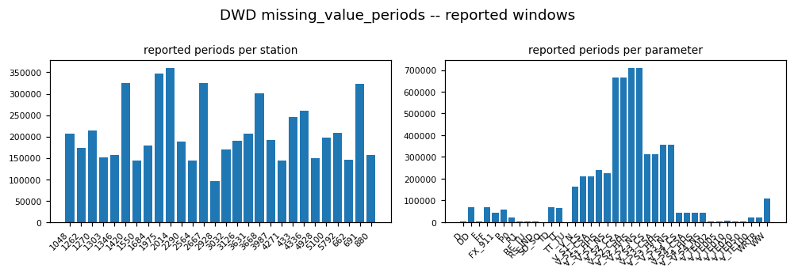

### Figure -- DWD observed -999/blank rate by year, per measurement

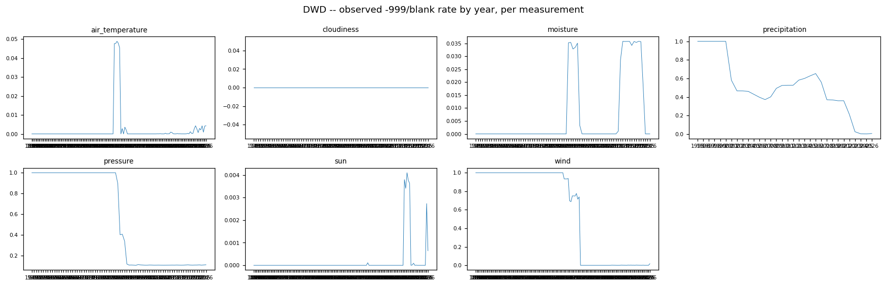

### Figure -- DWD missing / -999 rate by value column, per measurement

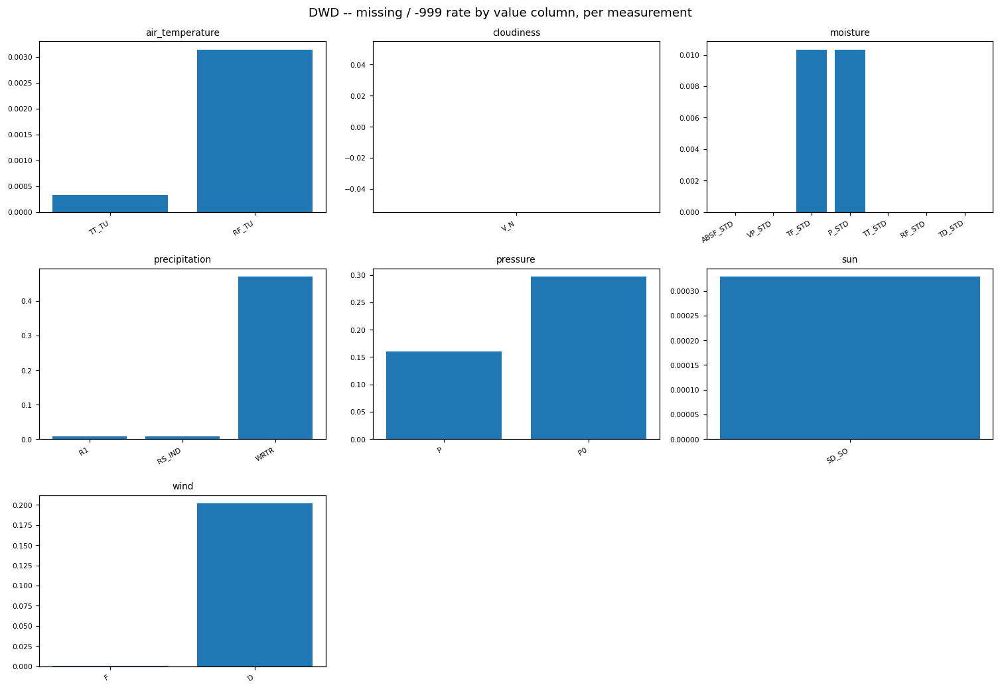

### Figure -- DWD distinct observed hours per station, per measurement

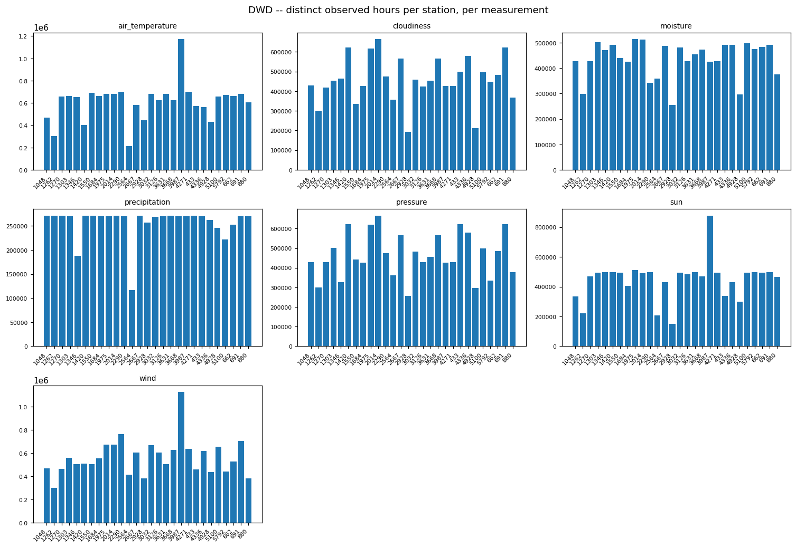

<!-- END dwd:03_missing_data -->

<!-- BEGIN dwd:04_relationships_and_findings -->
## Cross-table relationships & verdict

### Entities / Keys

Distinct station ids per Bronze table: {'air_temperature': 28, 'cloudiness': 28, 'moisture': 28, 'precipitation': 27, 'pressure': 28, 'sun': 28, 'wind': 28, 'station_geography': 28, 'station_name_history': 34, 'parameter_unit': 34, 'device_instrument': 33}
Union of stations across the 7 measurements: 28 -> ['1048', '1262', '1270', '1303', '1346', '1420', '1550', '1684', '1975', '2014', '2290', '2564', '2667', '2928', '3032', '3126', '3631', '3668', '3987', '4271', '433', '4336', '4928', '5100', '5792', '662', '691', '880']
Stations absent from each measurement (vs the union): {'air_temperature': 0, 'cloudiness': 0, 'moisture': 0, 'precipitation': 1, 'pressure': 0, 'sun': 0, 'wind': 0}
Stations mapped to >1 city: {}   |   distinct stations per city: {'leipzig': 1, 'essen': 1, 'hohenpeissenberg': 1, 'frankfurt_am_main': 1, 'garmisch_partenkirchen': 1, 'berlin': 1, 'stuttgart': 1, 'bremen': 1, 'nuremberg': 1, 'zugspitze': 1, 'magdeburg': 1, 'potsdam': 1, 'kiel': 1, 'trier': 1, 'hannover': 1, 'saarbruecken': 1, 'goerlitz': 1, 'erfurt': 1, 'norderney': 1, 'rostock_warnemuende': 1, 'hamburg': 1, 'sylt': 1, 'cologne_bonn': 1, 'dresden': 1, 'feldberg_schwarzwald': 1, 'braunschweig': 1, 'cottbus': 1, 'munich': 1}

### Relationships

Referential integrity -- measurement stations vs metadata (orphans, unused):
- station_geography: orphan measurement stations=0, unused metadata stations=0
- station_name_history: orphan measurement stations=0, unused metadata stations=6
- parameter_unit: orphan measurement stations=0, unused metadata stations=6

Relationship cardinality -- measurement station -> metadata table:
- station_geography: 222 rows over 28 station keys; 28 of 28 measurement stations have a row (100.0%); rows-per-station p50/p90/p99 7/16/17, max fan-out 17, orphan keys 0.
- station_name_history: 106 rows over 34 station keys; 28 of 28 measurement stations have a row (100.0%); rows-per-station p50/p90/p99 3/5/5, max fan-out 5, orphan keys 6.
- parameter_unit: 5418 rows over 34 station keys; 28 of 28 measurement stations have a row (100.0%); rows-per-station p50/p90/p99 181/232/262, max fan-out 262, orphan keys 6.
- device_instrument: 4008 rows over 33 station keys; 28 of 28 measurement stations have a row (100.0%); rows-per-station p50/p90/p99 134/166/193, max fan-out 193, orphan keys 5.

(STATIONS_ID, MESS_DATUM) unique within each measurement: {'air_temperature': False, 'cloudiness': False, 'moisture': False, 'precipitation': False, 'pressure': False, 'sun': False, 'wind': False}

Cross-measurement (station, MESS_DATUM) overlap per pair (shared, only_a, only_b):
- air_temperature x cloudiness: shared=12198079, only_air_temperature=4934021, only_cloudiness=572216
- air_temperature x moisture: shared=11866467, only_air_temperature=5265633, only_moisture=381196
- air_temperature x precipitation: shared=6955798, only_air_temperature=10176302, only_precipitation=1511
- air_temperature x pressure: shared=12458873, only_air_temperature=4673227, only_pressure=564761
- air_temperature x sun: shared=12037190, only_air_temperature=5094910, only_sun=490148
- air_temperature x wind: shared=15099852, only_air_temperature=2032248, only_wind=654481
- cloudiness x moisture: shared=11710302, only_cloudiness=1059993, only_moisture=537361
- cloudiness x precipitation: shared=6485466, only_cloudiness=6284829, only_precipitation=471843
- cloudiness x pressure: shared=12473467, only_cloudiness=296828, only_pressure=550167
- cloudiness x sun: shared=9158774, only_cloudiness=3611521, only_sun=3368564
- cloudiness x wind: shared=11899029, only_cloudiness=871266, only_wind=3855304
- moisture x precipitation: shared=6894876, only_moisture=5352787, only_precipitation=62433
- moisture x pressure: shared=11958020, only_moisture=289643, only_pressure=1065614
- moisture x sun: shared=8848890, only_moisture=3398773, only_sun=3678448
- moisture x wind: shared=11629622, only_moisture=618041, only_wind=4124711
- precipitation x pressure: shared=6955421, only_precipitation=1888, only_pressure=6068213
- precipitation x sun: shared=5030018, only_precipitation=1927291, only_sun=7497320
- precipitation x wind: shared=6930205, only_precipitation=27104, only_wind=8824128
- pressure x sun: shared=9272039, only_pressure=3751595, only_sun=3255299
- pressure x wind: shared=12270537, only_pressure=753097, only_wind=3483796
- sun x wind: shared=11098395, only_sun=1428943, only_wind=4655938

union of (station, ts) across all 7 measurements = 18144972

### Temporal Consistency

Measurement hours vs the station's geography validity window (widest von..bis, open bis -> now). A row outside the window means the station was producing data for a period its geography record does not cover.

- air_temperature: 0/17336388 hours outside the window (0.0%).
- cloudiness: 720/12973316 hours outside the window (0.0055%).
- moisture: 707/12449858 hours outside the window (0.0057%).
- precipitation: 0/7154301 hours outside the window (0.0%).
- pressure: 720/13227922 hours outside the window (0.0054%).
- sun: 0/12650564 hours outside the window (0.0%).
- wind: 0/15957198 hours outside the window (0.0%).

### Spatial Consistency

`city` <-> station_id: 0 station(s) mapped to >1 city .
Coordinate-level spatial validity is in section 02. There is no second coordinate source to cross-check DWD's own against (LIMITATION); the checkable cross-table consistency is that a station resolves to one city.

### Cross-variable Checks

Cross-variable checks on the hourly rows from 2016-01-01 onward, with candidate special codes [-999.0, -99.9, -99.0, -9.9, -9.0, -1.0, 990.0, 999.0, 9999.0] set aside:
- air_temperature.TT_TU vs moisture.TT_STD: 3203541 hourly pairs, mean absolute difference 3.227678372151318e-05, 3203453 within 0.5 degree, correlation 0.9999997827868629.
- air_temperature.RF_TU vs moisture.RF_STD: 3209459 pairs, mean absolute difference 0.2700010500212038, correlation 0.9998282742654767.
- dew point above air temperature (moisture.TD_STD > TT_STD + 0.1): 0 of 3189330 pairs; mean dew-point depression 4.7349633935654225.
- precipitation R1 > 0 against RS_IND (amount positive, indicator, hours): [{'amount_positive': False, 'indicator': 0.0, 'count': 2106632}, {'amount_positive': False, 'indicator': 1.0, 'count': 325264}, {'amount_positive': True, 'indicator': 1.0, 'count': 279712}].
- sunshine minutes by cloud-cover code (code, hours, mean minutes): [(-1.0, 12013, 1.87), (0.0, 323212, 36.19), (1.0, 87997, 38.07), (2.0, 69316, 35.88), (3.0, 69233, 34.66), (4.0, 65180, 32.2), (5.0, 77445, 29.86), (6.0, 102894, 25.46), (7.0, 432885, 11.51), (8.0, 862959, 5.38)]; correlation with the codes set aside -0.5087736012866549.
- wind speed by direction class: [{'direction_class': 'D=0', 'hours': 971, 'mean_speed': 0.4386199794026767, 'max_speed': 2.4, 'median_speed': 0.4}, {'direction_class': 'other', 'hours': 2802991, 'mean_speed': 3.919481939114443, 'max_speed': 32.5, 'median_speed': 3.3}].

### Spatial Patterns

Station means over the same window against station coordinates and elevation, 28 stations (mean of the station's geography rows):
- Pearson correlations: {'TT_TU ~ lat': 0.457, 'TT_TU ~ elev': -0.961, 'P0 ~ lat': 0.682, 'P0 ~ elev': -0.999, 'P ~ lat': -0.986, 'P ~ elev': 0.836, 'SD_SO ~ lat': -0.504, 'SD_SO ~ elev': 0.341, 'F ~ lat': 0.159, 'F ~ elev': 0.4, 'RF_STD ~ lat': 0.308, 'RF_STD ~ elev': 0.093}
- fitted change of mean air temperature per 100 m of elevation: -0.45 degrees.
- station table (station, lat, lon, elev, means): [{'station': '433', 'lat': 52.47, 'lon': 13.4, 'elev': 48.18, 'TT_TU': 11.53, 'P0': 1009.93, 'P': 1015.84, 'SD_SO': 16.69, 'F': 3.56, 'RF_STD': 71.59}, {'station': '662', 'lat': 52.28, 'lon': 10.45, 'elev': 81.55, 'TT_TU': 11.09, 'P0': 1005.97, 'P': 1015.85, 'SD_SO': 16.9, 'F': 3.36, 'RF_STD': 75.45}, {'station': '691', 'lat': 53.07, 'lon': 8.8, 'elev': 4.82, 'TT_TU': 10.89, 'P0': 1014.73, 'P': 1015.36, 'SD_SO': 16.24, 'F': 4.11, 'RF_STD': 78.31}, {'station': '2667', 'lat': 50.86, 'lon': 7.13, 'elev': 73.47, 'TT_TU': 11.8, 'P0': 1004.53, 'P': 1016.51, 'SD_SO': 15.8, 'F': 3.31, 'RF_STD': 74.2}, {'station': '880', 'lat': 51.77, 'lon': 14.33, 'elev': 71.32, 'TT_TU': 11.13, 'P0': 1007.65, 'P': 1016.06, 'SD_SO': 16.68, 'F': 2.65, 'RF_STD': 73.22}, {'station': '1048', 'lat': 51.12, 'lon': 13.76, 'elev': 215.94, 'TT_TU': 10.95, 'P0': 988.58, 'P': 1016.48, 'SD_SO': 17.77, 'F': 4.09, 'RF_STD': 72.58}, {'station': '1270', 'lat': 50.98, 'lon': 10.97, 'elev': 305.05, 'TT_TU': 10.24, 'P0': 978.09, 'P': 1016.58, 'SD_SO': 16.3, 'F': 4.2, 'RF_STD': 75.17}, {'station': '1303', 'lat': 51.42, 'lon': 6.97, 'elev': 129.28, 'TT_TU': 11.7, 'P0': 998.05, 'P': 1016.05, 'SD_SO': 16.22, 'F': 3.18, 'RF_STD': 75.09}, {'station': '1346', 'lat': 47.87, 'lon': 8.0, 'elev': 1487.86, 'TT_TU': 5.59, 'P0': 849.69, 'P': nan, 'SD_SO': 16.48, 'F': 7.89, 'RF_STD': 78.59}, {'station': '1420', 'lat': 50.05, 'lon': 8.59, 'elev': 109.57, 'TT_TU': 12.11, 'P0': 1004.39, 'P': 1016.94, 'SD_SO': 17.62, 'F': 3.4, 'RF_STD': 71.59}, {'station': '1550', 'lat': 47.49, 'lon': 11.09, 'elev': 708.72, 'TT_TU': 8.87, 'P0': 933.8, 'P': 1017.95, 'SD_SO': 15.99, 'F': 1.44, 'RF_STD': 78.93}, {'station': '1684', 'lat': 51.16, 'lon': 14.96, 'elev': 224.4, 'TT_TU': 10.51, 'P0': 987.72, 'P': 1016.53, 'SD_SO': 17.99, 'F': 3.64, 'RF_STD': 75.17}, {'station': '1975', 'lat': 53.64, 'lon': 10.0, 'elev': 11.68, 'TT_TU': 10.63, 'P0': 1013.3, 'P': 1015.13, 'SD_SO': 15.96, 'F': 4.0, 'RF_STD': 78.82}, {'station': '2014', 'lat': 52.46, 'lon': 9.7, 'elev': 53.14, 'TT_TU': 11.06, 'P0': 1008.57, 'P': 1015.76, 'SD_SO': 15.66, 'F': 3.8, 'RF_STD': 76.13}, {'station': '2290', 'lat': 47.8, 'lon': 11.01, 'elev': 980.52, 'TT_TU': 9.03, 'P0': 904.19, 'P': nan, 'SD_SO': 18.86, 'F': 4.09, 'RF_STD': 73.82}, {'station': '2564', 'lat': 54.38, 'lon': 10.15, 'elev': 22.92, 'TT_TU': 10.42, 'P0': 1011.06, 'P': 1014.59, 'SD_SO': 15.04, 'F': 4.05, 'RF_STD': 80.08}, {'station': '2928', 'lat': 51.32, 'lon': 12.4, 'elev': 129.34, 'TT_TU': 11.19, 'P0': 999.68, 'P': 1016.3, 'SD_SO': 15.79, 'F': 2.31, 'RF_STD': 73.74}, {'station': '3126', 'lat': 52.13, 'lon': 11.65, 'elev': 56.35, 'TT_TU': 11.48, 'P0': 1005.71, 'P': 1015.96, 'SD_SO': 16.67, 'F': 2.54, 'RF_STD': 73.74}, {'station': '1262', 'lat': 48.36, 'lon': 11.81, 'elev': 444.55, 'TT_TU': 10.05, 'P0': 964.71, 'P': 1017.67, 'SD_SO': 18.36, 'F': 3.01, 'RF_STD': 77.81}, {'station': '3631', 'lat': 53.71, 'lon': 7.15, 'elev': 6.64, 'TT_TU': 11.01, 'P0': 1012.99, 'P': 1014.76, 'SD_SO': 17.2, 'F': 5.96, 'RF_STD': 80.57}, {'station': '3668', 'lat': 49.48, 'lon': 11.07, 'elev': 309.57, 'TT_TU': 10.86, 'P0': 979.38, 'P': 1017.28, 'SD_SO': 18.26, 'F': 3.04, 'RF_STD': 73.7}, {'station': '3987', 'lat': 52.38, 'lon': 13.06, 'elev': 80.86, 'TT_TU': 11.03, 'P0': 1003.91, 'P': 1015.81, 'SD_SO': 17.95, 'F': 4.15, 'RF_STD': 75.02}, {'station': '4271', 'lat': 54.18, 'lon': 12.09, 'elev': 3.25, 'TT_TU': 10.82, 'P0': 1013.39, 'P': 1014.91, 'SD_SO': 17.85, 'F': 4.73, 'RF_STD': 77.24}, {'station': '4336', 'lat': 49.22, 'lon': 7.11, 'elev': 320.58, 'TT_TU': 11.09, 'P0': 979.01, 'P': 1017.17, 'SD_SO': 17.89, 'F': 3.58, 'RF_STD': 76.05}, {'station': '4928', 'lat': 48.83, 'lon': 9.2, 'elev': 314.12, 'TT_TU': 11.9, 'P0': 979.49, 'P': 1017.22, 'SD_SO': 18.49, 'F': 2.82, 'RF_STD': 70.83}, {'station': '3032', 'lat': 55.01, 'lon': 8.42, 'elev': 17.12, 'TT_TU': 10.43, 'P0': 1010.66, 'P': 1013.95, 'SD_SO': 15.88, 'F': 7.23, 'RF_STD': 81.5}, {'station': '5100', 'lat': 49.75, 'lon': 6.66, 'elev': 246.91, 'TT_TU': 11.35, 'P0': 984.26, 'P': 1016.92, 'SD_SO': 17.39, 'F': 3.44, 'RF_STD': 75.09}, {'station': '5792', 'lat': 47.42, 'lon': 10.98, 'elev': 2956.0, 'TT_TU': -2.81, 'P0': 709.0, 'P': nan, 'SD_SO': 18.38, 'F': 6.22, 'RF_STD': 76.83}]

### EDA Findings

- (station, MESS_DATUM) is unique in every measurement: False  -> pairwise measurement<->measurement joins are 1:1 on the overlap.
- largest non-shared timestamp count in any measurement pair: 10176302  -> an inner join to a wide table drops that tail.
- all 7 measurements have disjoint value-column sets: True.
- Verdict: combine into a wide table only where timestamps overlap; keep one model per measurement in Silver, align at Gold.

### ML-Readiness Evidence

- **Grain / grain drift:** (STATIONS_ID, MESS_DATUM) is unique within every measurement (False) -- a station-level (not row-level) split is required for any downstream model combining these tables.
- **Join multiplication (1:N / M:N expansion):** measurement -> metadata is 1:1 only for []; ['station_geography', 'station_name_history', 'parameter_unit', 'device_instrument'] fan out and MUST be joined on the von/bis window, not station_id alone (full profile above).
- **Target contamination:** No candidate ML target lives across these 7 measurement + metadata tables -- this notebook is a joinability audit, not a labelled-outcome source.
- **Temporal / post-event leakage:** Point-in-time consistency above quantifies measurement hours outside the station's geography window -- a metadata attribute joined without the window can attach a future location to a historical row.
- **Proxy leakage:** Station id / city are near-unique site identifiers -- a model given them memorises the station.
- **Split / entity leakage:** Split by station id across ALL tables at once so a station's rows stay on one side of every join.
- **Historical-reference (point-in-time) leakage:** The validity-window join is the point-in-time mechanism -- an un-windowed metadata join is point-in-time leakage.
- **Survivorship / coverage bias:** Referential-integrity orphans {'station_geography': 0, 'station_name_history': 0, 'parameter_unit': 0} and cross-measurement non-overlap (max 10176302) mean a joined training set silently drops the under-instrumented stations/hours.
- **Missingness leakage:** Whether a station appears in a metadata table correlates with its tenure in the network -- an 'is-known' flag can leak that.
- **Duplicate-event leakage:** Per-measurement (station, ts) duplicate composition is in section 01 -- de-duplicate before joining or splitting.
- **Target / feature temporal misalignment:** MESS_DATUM (hour) vs metadata von/bis (day) are different resolutions -- align before pairing.
- **Unit / sign / circular-feature leakage:** All 7 measurements have disjoint value-column sets (True) -- no direct column-overlap leakage between them.
- **Data-generation-process leakage:** A parser trailer row in metadata (02) would inject a non-station into every station-keyed join here -- filter it first.
- **Class / label instability:** parameter_unit / device_instrument codes are DWD enumerations that change between archive versions -- pin the version.
- **Label availability lag:** Not applicable -- joinability audit, no label.
- **Source / version / regime change:** Station coverage and the metadata schema shifted over the archive's multi-decade span (per-decade evidence in 01/03).
- **Sample-vs-full divergence:** Every statistic here (station sets, overlap counts, cardinality, point-in-time) is a full Spark aggregation or a fully collected small set -- no sampling.

### Observations by Area

- **Domain understanding:** seven measurement tables for a station network, with station geography, name history, device and parameter metadata; cross-variable agreement: temperature pairs 3203541 with mean abs diff 3.227678372151318e-05; dew point above temperature in 0 pairs; wind direction classes against speed: [{'direction_class': 'D=0', 'hours': 971, 'mean_speed': 0.4386199794026767, 'max_speed': 2.4, 'median_speed': 0.4}, {'direction_class': 'other', 'hours': 2802991, 'mean_speed': 3.919481939114443, 'max_speed': 32.5, 'median_speed': 3.3}]
- **Structure and engineering:** (station, MESS_DATUM) unique in every measurement: False; largest non-shared timestamp count 10176302; value-column sets disjoint across measurements: True; stations mapped to more than one city: 0
- **Temporal:** measurement hours outside the station geography window: {'air_temperature': 0.0, 'cloudiness': 0.0055, 'moisture': 0.0057, 'precipitation': 0.0, 'pressure': 0.0054, 'sun': 0.0, 'wind': 0.0}
- **Spatial:** station means against elevation / latitude: {'TT_TU ~ lat': 0.457, 'TT_TU ~ elev': -0.961, 'P0 ~ lat': 0.682, 'P0 ~ elev': -0.999, 'P ~ lat': -0.986, 'P ~ elev': 0.836, 'SD_SO ~ lat': -0.504, 'SD_SO ~ elev': 0.341, 'F ~ lat': 0.159, 'F ~ elev': 0.4, 'RF_STD ~ lat': 0.308, 'RF_STD ~ elev': 0.093}; temperature change per 100 m: -0.45
- **Data quality:** reference integrity (measurement stations not in metadata, metadata stations unused): {'station_geography': (0, 0), 'station_name_history': (0, 6), 'parameter_unit': (0, 6)}
- **Statistical patterns:** seasonal and diurnal profiles are in the measurements notebook; station-to-station spatial gradients above
- **Relationships:** sunshine by cloud code: [(-1.0, 12013, 1.87), (0.0, 323212, 36.19), (1.0, 87997, 38.07), (2.0, 69316, 35.88), (3.0, 69233, 34.66), (4.0, 65180, 32.2), (5.0, 77445, 29.86), (6.0, 102894, 25.46), (7.0, 432885, 11.51), (8.0, 862959, 5.38)]; precipitation amount vs indicator: [{'amount_positive': False, 'indicator': 0.0, 'count': 2106632}, {'amount_positive': False, 'indicator': 1.0, 'count': 325264}, {'amount_positive': True, 'indicator': 1.0, 'count': 279712}]
- **Analytics use:** a joinable station network across seven parameters on the shared hourly grid
- **ML use:** multi-variable hourly features per station are possible on the overlap; special codes and quality flags need handling first
- **AI / knowledge use:** station metadata (names, history, instruments) is a small structured reference, no free text

### Silver Implications

- Shared join key is (STATIONS_ID, MESS_DATUM); unique per measurement -> safe fan-out-free measurement<->measurement joins.
- station_geography / station_name_history are 1:N on station_id -> join with the von/bis validity window, never station_id alone.
- Some measurement hours fall outside the station's geography validity window -> extend the window or flag; do not silently drop.
- `city` is consistent 1:1 with station_id here -> safe to carry as a station attribute.
- A cross-measurement wide 'all weather at station S, hour H' table drops rows (overlap numbers above) -> that is a Gold consolidation, not Silver.

### Figure -- DWD cross-measurement (station, timestamp) overlap per pair

### Figure -- DWD distinct stations per Bronze table

### Figure -- DWD stations absent from each measurement

### Figure -- DWD referential integrity: measurements <-> metadata

### Figure -- DWD distinct stations per city

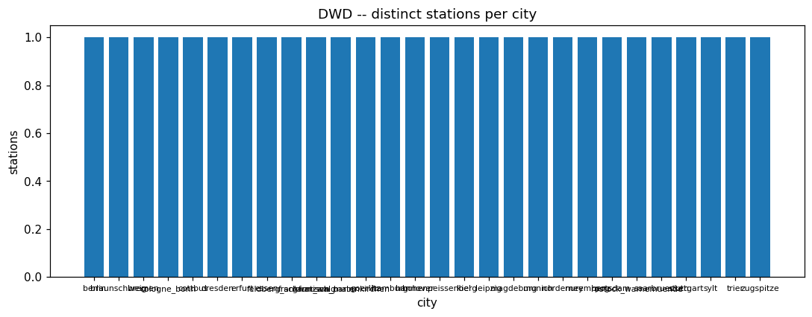

<!-- END dwd:04_relationships_and_findings -->

<!-- BEGIN dwd:05_deepening -->
## Deepening measurements (dew_point ... solar) & missing_value_periods

### Profile

| measurement | rows | cols | stations | first ts | last ts | constant cols |
|---|---|---|---|---|---|---|
| dew_point | 13524783 | 7 | 28 | 1949010100 | 2026090323 | eor |
| soil_temperature | 7183226 | 11 | 27 | 1951010101 | 2026090323 | eor |
| visibility | 13124582 | 7 | 28 | 1949010100 | 2026090323 | eor |
| cloud_type | 13101463 | 23 | 28 | 1949010100 | 2026090323 | eor |
| wind_synop | 13524783 | 7 | 28 | 1949010100 | 2026090323 | eor |
| extreme_wind | 6480621 | 6 | 28 | 1990062722 | 2026090323 | eor |
| weather_phenomena | 12915288 | 7 | 28 | 1949010100 | 2026090300 | eor |
| solar | 5809249 | 11 | 19 | 1945123101:10 | 2026073123:39 | QN_592, eor |
| missing_value_periods | 5897409 | 8 | - | - | - | Beschreibung, eor |

### Data Quality

| measurement | dup key groups | identical | conflicting |
|---|---|---|---|
| dew_point | 204288 | 204288 | 0 |
| soil_temperature | 196534 | 189250 | 7284 |
| visibility | 203353 | 203353 | 0 |
| cloud_type | 203021 | 203015 | 6 |
| wind_synop | 204288 | 204288 | 0 |
| extreme_wind | 202761 | 202761 | 0 |
| weather_phenomena | 202941 | 202941 | 0 |
| solar | 0 | 0 | 0 |

missing_value_periods full-row duplicates: 79551.

QN quality flag distribution (where present):
- dew_point: [('1', 8054488), ('3', 5470295)]
- soil_temperature: [('3', 5912832), ('1', 806101), ('10', 270880), ('5', 193413)]
- visibility: [('1', 7858810), ('3', 5265772)]
- cloud_type: [('1', 7795985), ('3', 5177331), ('-999', 128147)]
- wind_synop: [('1', 8054488), ('3', 5470295)]
- extreme_wind: [('3', 5371867), ('1', 1108754)]
- weather_phenomena: [('1', 7759384), ('3', 5155904)]
- solar: [('1', 5809249)]

### Categorical / Domain Validation

QN quality-flag values vs the DWD hourly-historical code set (1/2/3/5/7/9/10):
- dew_point.QN_8: unexpected=none, unused=['10', '2', '5', '7', '9'].
- soil_temperature.QN_2: unexpected=none, unused=['2', '7', '9'].
- visibility.QN_8: unexpected=none, unused=['10', '2', '5', '7', '9'].
- cloud_type.QN_8: unexpected=['-999'], unused=['10', '2', '5', '7', '9'].
- wind_synop.QN_8: unexpected=none, unused=['10', '2', '5', '7', '9'].
- extreme_wind.QN_8: unexpected=none, unused=['10', '2', '5', '7', '9'].
- weather_phenomena.QN_8: unexpected=none, unused=['10', '2', '5', '7', '9'].
- solar.QN_592: unexpected=none, unused=['10', '2', '3', '5', '7', '9'].
An unexpected QN value is a parse artefact or a schema drift, not a real quality level.

### Temporal

Hourly grid, expected one row per station per hour; MESS_DATUM parsed yyyyMMddHH with a trailing `.0` stripped. Coverage vs an independent calendar (span/3600 + 1), so <100% is a genuine gap.
- dew_point: 1949010100..2026090323, per-station coverage 64.99-99.9%, longest gap 55560.0h
- soil_temperature: 1951010101..2026090323, per-station coverage 41.02-99.93%, longest gap 6245.0h
- visibility: 1949010100..2026090323, per-station coverage 63.88-99.75%, longest gap 121571.0h
- cloud_type: 1949010100..2026090323, per-station coverage 56.22-99.8%, longest gap 121571.0h
- wind_synop: 1949010100..2026090323, per-station coverage 64.99-99.9%, longest gap 55560.0h
- extreme_wind: 1990062722..2026090323, per-station coverage 38.25-86.4%, longest gap 54194.0h
- weather_phenomena: 1949010100..2026090300, per-station coverage 49.11-99.43%, longest gap 121571.0h
- solar: 1945123101:10..2026073123:39, per-station coverage 68.41-100.0%, longest gap 35064.0h

### Regime / Version Evidence

Per-decade row count and QN vocabulary. The deepening network came online at different times per parameter -- a decade/era indicator and per-station availability window are warranted before pooling.

- dew_point: 1940s: rows=75690, QN distinct=1, 1950s: rows=801858, QN distinct=1, 1960s: rows=921695, QN distinct=1, 1970s: rows=739518, QN distinct=1, 1980s: rows=1950405, QN distinct=1, 1990s: rows=2289144, QN distinct=1, 2000s: rows=2453645, QN distinct=2, 2010s: rows=2450266, QN distinct=1, 2020s: rows=1842562, QN distinct=2
- soil_temperature: 1950s: rows=102713, QN distinct=2, 1960s: rows=191832, QN distinct=2, 1970s: rows=263070, QN distinct=2, 1980s: rows=348386, QN distinct=2, 1990s: rows=283886, QN distinct=3, 2000s: rows=1882300, QN distinct=3, 2010s: rows=2337514, QN distinct=2, 2020s: rows=1773525, QN distinct=2
- visibility: 1940s: rows=72818, QN distinct=1, 1950s: rows=786316, QN distinct=1, 1960s: rows=921693, QN distinct=1, 1970s: rows=739068, QN distinct=1, 1980s: rows=1940283, QN distinct=1, 1990s: rows=2243360, QN distinct=1, 2000s: rows=2301460, QN distinct=2, 2010s: rows=2324554, QN distinct=1, 2020s: rows=1795030, QN distinct=2
- cloud_type: 1940s: rows=75690, QN distinct=1, 1950s: rows=801858, QN distinct=2, 1960s: rows=921693, QN distinct=2, 1970s: rows=739130, QN distinct=1, 1980s: rows=1940649, QN distinct=1, 1990s: rows=2208022, QN distinct=2, 2000s: rows=2296546, QN distinct=3, 2010s: rows=2323000, QN distinct=2, 2020s: rows=1794875, QN distinct=3
- wind_synop: 1940s: rows=75690, QN distinct=1, 1950s: rows=801858, QN distinct=1, 1960s: rows=921695, QN distinct=1, 1970s: rows=739518, QN distinct=1, 1980s: rows=1950405, QN distinct=1, 1990s: rows=2289144, QN distinct=1, 2000s: rows=2453645, QN distinct=2, 2010s: rows=2450266, QN distinct=1, 2020s: rows=1842562, QN distinct=2
- extreme_wind: 1990s: rows=152864, QN distinct=1, 2000s: rows=2085717, QN distinct=2, 2010s: rows=2414130, QN distinct=1, 2020s: rows=1827910, QN distinct=2
- weather_phenomena: 1940s: rows=75690, QN distinct=1, 1950s: rows=801858, QN distinct=1, 1960s: rows=921695, QN distinct=1, 1970s: rows=739110, QN distinct=1, 1980s: rows=1934199, QN distinct=1, 1990s: rows=2182840, QN distinct=1, 2000s: rows=2158165, QN distinct=2, 2010s: rows=2308799, QN distinct=1, 2020s: rows=1792932, QN distinct=2
- solar: 1940s: rows=35087, QN distinct=1, 1950s: rows=184032, QN distinct=1, 1960s: rows=403296, QN distinct=1, 1970s: rows=517127, QN distinct=1, 1980s: rows=692592, QN distinct=1, 1990s: rows=747192, QN distinct=1, 2000s: rows=1040279, QN distinct=1, 2010s: rows=1292040, QN distinct=1, 2020s: rows=897604, QN distinct=1

### Distributions

- dew_point.`TT`: min/max=-999.0/56.0, p01/p50/p99=[-999.0, 8.0, 27.3], mean=-59.428403627621925, sd=253.58451592108224, zero rows=95695, -999 sentinel rows=917439
- dew_point.`TD`: min/max=-999.0/46.5, p01/p50/p99=[-999.0, 4.5, 17.3], mean=-63.94961752066563, sd=253.565414301759, zero rows=129466, -999 sentinel rows=925822
- soil_temperature.`V_TE002`: min/max=-999.0/49.7, p01/p50/p99=[-999.0, -999.0, 19.8], mean=-917.1660788063748, sd=275.4190050741, zero rows=11793, -999 sentinel rows=6600469
- soil_temperature.`V_TE005`: min/max=-999.0/51.4, p01/p50/p99=[-2.3, 10.4, 33.3], mean=10.045840879849807, sd=36.184877217548845, zero rows=120973, -999 sentinel rows=8684
- soil_temperature.`V_TE010`: min/max=-999.0/42.3, p01/p50/p99=[-1.5, 10.6, 30.1], mean=10.135810511878649, sd=34.61837660349163, zero rows=80197, -999 sentinel rows=7970
- soil_temperature.`V_TE020`: min/max=-999.0/37.1, p01/p50/p99=[-0.6, 10.8, 27.2], mean=10.223648525049889, sd=32.771589617188575, zero rows=45385, -999 sentinel rows=7158
- soil_temperature.`V_TE050`: min/max=-999.0/30.1, p01/p50/p99=[-999.0, 10.5, 24.1], mean=-21.509449111026154, sd=179.06536505164632, zero rows=6277, -999 sentinel rows=232932
- soil_temperature.`V_TE100`: min/max=-999.0/25.8, p01/p50/p99=[-999.0, 8.8, 21.5], mean=-162.24554658310902, sd=381.12034150280607, zero rows=136, -999 sentinel rows=1233998
- visibility.`V_VV`: min/max=0.0/99990.0, p01/p50/p99=[0.0, 18000.0, 75000.0], mean=23123.29969899232, sd=19763.87521094002, zero rows=177550, -999 sentinel rows=0
- cloud_type.`V_N`: min/max=-999.0/8.0, p01/p50/p99=[-1.0, 7.0, 8.0], mean=-4.72357636700573, sd=98.8655422744278, zero rows=1460740, -999 sentinel rows=128147
- cloud_type.`V_S1_CS`: min/max=-999.0/9.0, p01/p50/p99=[-999.0, 0.0, 8.0], mean=-422.88773749923956, sd=496.6473581778606, zero rows=709072, -999 sentinel rows=5585466
- cloud_type.`V_S1_CSA`: min/max=-999.0/-1.0, p01/p50/p99=[-999.0, -999.0, -1.0], mean=-902.6854297029934, sd=294.69553568529267, zero rows=0, -999 sentinel rows=5585466
- cloud_type.`V_S1_HHS`: min/max=-999.0/21000.0, p01/p50/p99=[-999.0, 450.0, 9000.0], mean=978.3868547352307, sd=2386.673992474371, zero rows=48617, -999 sentinel rows=4083007
- cloud_type.`V_S1_NS`: min/max=-999.0/8.0, p01/p50/p99=[-999.0, 2.0, 8.0], mean=-295.35522559579795, sd=458.8521423159634, zero rows=24, -999 sentinel rows=3908968
- cloud_type.`V_S2_CS`: min/max=-999.0/9.0, p01/p50/p99=[-999.0, -999.0, 8.0], mean=-717.0873033797828, sd=450.8850272683891, zero rows=539074, -999 sentinel rows=9419190
- cloud_type.`V_S2_CSA`: min/max=-999.0/-1.0, p01/p50/p99=[-999.0, -999.0, -1.0], mean=-968.3875616107636, sd=172.08746373836058, zero rows=0, -999 sentinel rows=9419190
- cloud_type.`V_S2_HHS`: min/max=-999.0/21000.0, p01/p50/p99=[-999.0, -999.0, 9000.0], mean=403.7016436256012, sd=2510.716520289071, zero rows=79, -999 sentinel rows=8406087
- cloud_type.`V_S2_NS`: min/max=-999.0/9.0, p01/p50/p99=[-999.0, -999.0, 8.0], mean=-638.3283666869876, sd=481.99630791657734, zero rows=15, -999 sentinel rows=8398714
- cloud_type.`V_S3_CS`: min/max=-999.0/9.0, p01/p50/p99=[-999.0, -999.0, 6.0], mean=-938.0691914330483, sd=239.43435749107667, zero rows=111834, -999 sentinel rows=12304620
- cloud_type.`V_S3_CSA`: min/max=-999.0/-1.0, p01/p50/p99=[-999.0, -999.0, -1.0], mean=-986.0690582539489, sd=112.8621798031413, zero rows=0, -999 sentinel rows=12304620
- cloud_type.`V_S3_HHS`: min/max=-999.0/21000.0, p01/p50/p99=[-999.0, -999.0, 8560.0], mean=-486.31269339920283, sd=1780.912211477934, zero rows=14, -999 sentinel rows=11721931
- cloud_type.`V_S3_NS`: min/max=-999.0/8.0, p01/p50/p99=[-999.0, -999.0, 8.0], mean=-892.8742181693755, sd=309.04241607673947, zero rows=10, -999 sentinel rows=11719446
- cloud_type.`V_S4_CS`: min/max=-999.0/9.0, p01/p50/p99=[-999.0, -999.0, -999.0], mean=-990.5172130013267, sd=92.06764412148425, zero rows=1917, -999 sentinel rows=12991179
- cloud_type.`V_S4_CSA`: min/max=-999.0/-1.0, p01/p50/p99=[-999.0, -999.0, -999.0], mean=-998.9999231786489, sd=0.2768893432385547, zero rows=0, -999 sentinel rows=12991179
- cloud_type.`V_S4_HHS`: min/max=-999.0/13500.0, p01/p50/p99=[-999.0, -999.0, -999.0], mean=-982.0906229327213, sd=200.82786849688122, zero rows=15, -999 sentinel rows=12993221
- cloud_type.`V_S4_NS`: min/max=-999.0/9.0, p01/p50/p99=[-999.0, -999.0, -999.0], mean=-990.5641988226811, sd=91.55778045780258, zero rows=0, -999 sentinel rows=12991179
- wind_synop.`FF`: min/max=-999.0/44.7, p01/p50/p99=[0.0, 3.5, 14.4], mean=1.4330123078499934, sd=51.415442953890235, zero rows=350764, -999 sentinel rows=35512
- wind_synop.`DD`: min/max=-999.0/360.0, p01/p50/p99=[0.0, 210.0, 360.0], mean=184.82263693251122, sd=114.81833027587764, zero rows=416097, -999 sentinel rows=36400
- extreme_wind.`FX_911`: min/max=-999.0/67.0, p01/p50/p99=[1.0, 6.0, 22.1], mean=7.224335538214628, sd=5.869683875063618, zero rows=692, -999 sentinel rows=89
- weather_phenomena.`WW`: min/max=-1.0/189.0, p01/p50/p99=[-1.0, 2.0, 161.0], mean=21.572701592097676, sd=38.391963533856355, zero rows=1010262, -999 sentinel rows=0
- solar.`ATMO_LBERG`: min/max=-999.0/992.0, p01/p50/p99=[-999.0, -999.0, 141.0], mean=-661.066340588947, sd=511.86262156053107, zero rows=762, -999 sentinel rows=4045166
- solar.`FD_LBERG`: min/max=-999.0/494.0, p01/p50/p99=[-999.0, 0.0, 136.0], mean=-86.06972605236925, sd=313.91978981891697, zero rows=2774851, -999 sentinel rows=608615
- solar.`FG_LBERG`: min/max=-999.0/490.0, p01/p50/p99=[-999.0, 1.0, 294.0], mean=23.159174619645327, sd=165.75839648195813, zero rows=2780178, -999 sentinel rows=120254
- solar.`SD_LBERG`: min/max=-999.0/60.0, p01/p50/p99=[0.0, 0.0, 60.0], mean=3.861942223512884, sd=92.56278603548601, zero rows=4018759, -999 sentinel rows=46456
- solar.`ZENIT`: min/max=24.72/155.28, p01/p50/p99=[30.29, 89.62, 149.47], mean=89.61520203386017, sd=30.379924277345566, zero rows=0, -999 sentinel rows=0

### EDA Findings

- dew_point: rows=13524783, stations=28, hourly coverage 64.99-99.9%, longest gap 55560.0h, dup identical=204288/conflicting=0, constant cols=['eor']
- soil_temperature: rows=7183226, stations=27, hourly coverage 41.02-99.93%, longest gap 6245.0h, dup identical=189250/conflicting=7284, constant cols=['eor']
- visibility: rows=13124582, stations=28, hourly coverage 63.88-99.75%, longest gap 121571.0h, dup identical=203353/conflicting=0, constant cols=['eor']
- cloud_type: rows=13101463, stations=28, hourly coverage 56.22-99.8%, longest gap 121571.0h, dup identical=203015/conflicting=6, constant cols=['eor']
- wind_synop: rows=13524783, stations=28, hourly coverage 64.99-99.9%, longest gap 55560.0h, dup identical=204288/conflicting=0, constant cols=['eor']
- extreme_wind: rows=6480621, stations=28, hourly coverage 38.25-86.4%, longest gap 54194.0h, dup identical=202761/conflicting=0, constant cols=['eor']
- weather_phenomena: rows=12915288, stations=28, hourly coverage 49.11-99.43%, longest gap 121571.0h, dup identical=202941/conflicting=0, constant cols=['eor']
- solar: rows=5809249, stations=19, hourly coverage 68.41-100.0%, longest gap 35064.0h, dup identical=0/conflicting=0, constant cols=['QN_592', 'eor']

### ML-Readiness Evidence

- **Grain / grain drift:** One row per (STATIONS_ID, MESS_DATUM) per measurement -- split by STATIONS_ID or contiguous date range, never by row.
- **Join multiplication (1:N / M:N expansion):** Cross-table cardinality between these 8 tables, the original seven, and metadata is assessed in 04 -- verify before joining both groups as features.
- **Target contamination:** No candidate ML target lives in these 8 deepening tables -- like the original seven they feed the shared weather feature source; missing_value_periods (03) is the nearest candidate target for a missingness use case.
- **Temporal / post-event leakage:** QN_* flags (where present) are set alongside the value -- a forecasting feature may use only rows strictly before the prediction timestamp.
- **Proxy leakage:** STATIONS_ID / city identify a specific site -- a model given them memorises the station.
- **Split / entity leakage:** Split by STATIONS_ID -- a station's adjacent hourly rows and its rows across measurements are correlated.
- **Historical-reference (point-in-time) leakage:** Station attributes are time-varying (02) -- join on the validity window, not the latest metadata row.
- **Survivorship / coverage bias:** The deepening network came online per parameter over time (Regime / Version Evidence) -- early years under-represent the newer parameters.
- **Missingness leakage:** -999 / blank rate correlates with station, parameter and era -- an 'is-missing' feature can leak an outage window.
- **Duplicate-event leakage:** Conflicting (station, ts) duplicates: {'dew_point': 0, 'soil_temperature': 7284, 'visibility': 0, 'cloud_type': 6, 'wind_synop': 0, 'extreme_wind': 0, 'weather_phenomena': 0, 'solar': 0} -- resolve before counting or splitting.
- **Target / feature temporal misalignment:** MESS_DATUM is the observation hour -- align a feature/target pair to one hour convention.
- **Unit / sign / circular-feature leakage:** Units are not in Bronze and plausibility bounds are not assumed here -- reconcile via parameter_unit (02) before combining parameters.
- **Data-generation-process leakage:** QN_* encodes DWD's QC decision, not the physical weather -- a feature keyed on it encodes the QC pipeline.
- **Class / label instability:** cloud_type / weather_phenomena are coded categoricals and the QN scheme changed over the archive's history (Regime / Version Evidence) -- a class defined by a raw code is only stable within one scheme vintage.
- **Label availability lag:** DWD publishes historical data with a lag and revises it -- a nowcast cannot use the current hour.
- **Source / version / regime change:** Per-decade rows and QN vocabulary in Regime / Version Evidence -- a decade/era indicator is warranted before pooling.
- **Sample-vs-full divergence:** No value-column figure is drawn from a sample here; every reported stat (value_stats, freq_cov, station_counts) is a full-table Spark aggregation.

### Silver Implications

- `-999` (and blank) appears as a sentinel in at least one of these columns -> must become NULL before any stat, matching the original seven measurements.
- (STATIONS_ID, MESS_DATUM) has conflicting duplicate rows in at least one measurement -> a conflict-resolution rule is required (rule not yet established).
- Constant columns above carry no information.
- Hourly series are not necessarily continuous (coverage % / gaps above) -> no dense-grid assumption.
- Value-column plausibility bounds were not assumed here -> define them from the distributions above before an out-of-range quality flag.
- missing_value_periods declares known gap windows per station/parameter -> reconcile against the observed hourly-coverage gaps rather than assuming every gap is undeclared.
- Decode QN against the DWD scheme valid for the record's era (see Regime / Version Evidence).

### Figure -- DWD deepening -- measurement overview

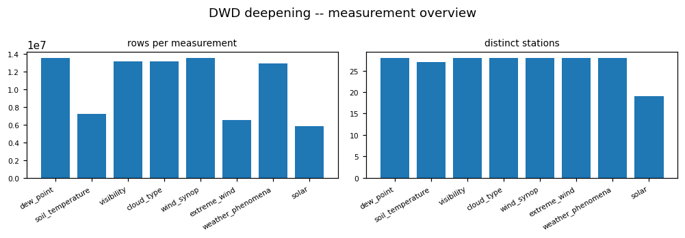

### Figure -- DWD deepening -- QN quality-flag distribution

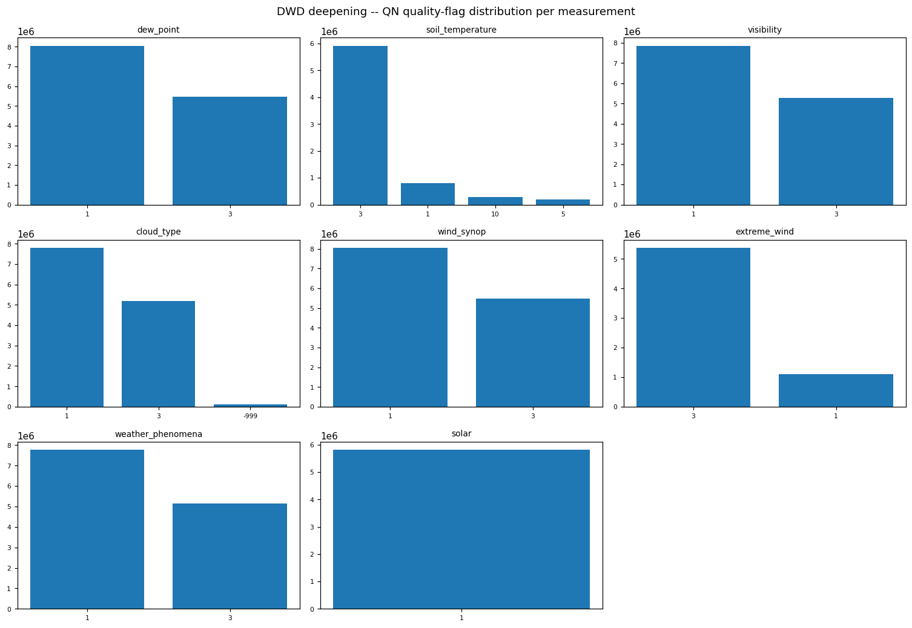

### Figure -- DWD deepening -- hourly coverage % per station

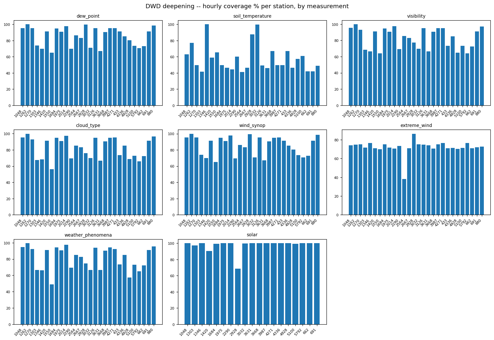

<!-- END dwd:05_deepening -->
