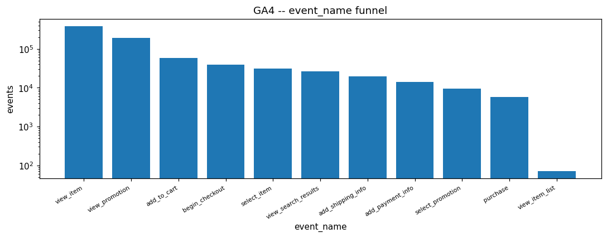
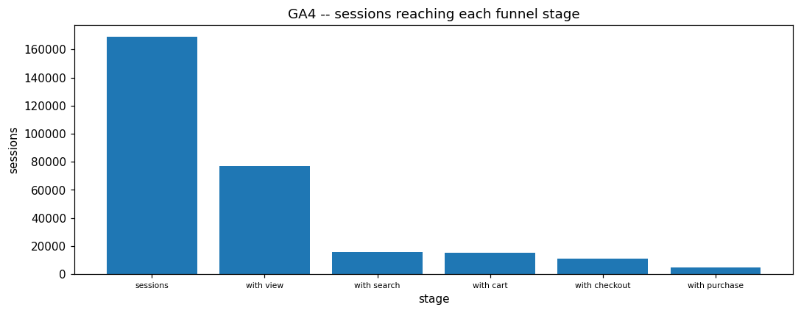
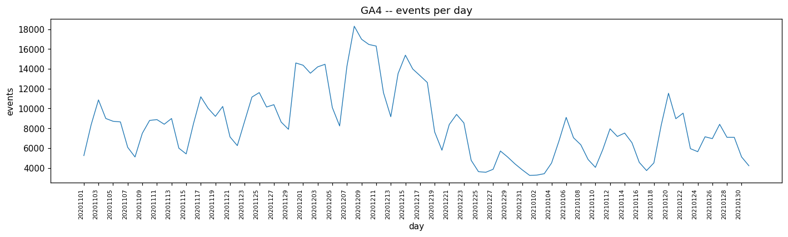
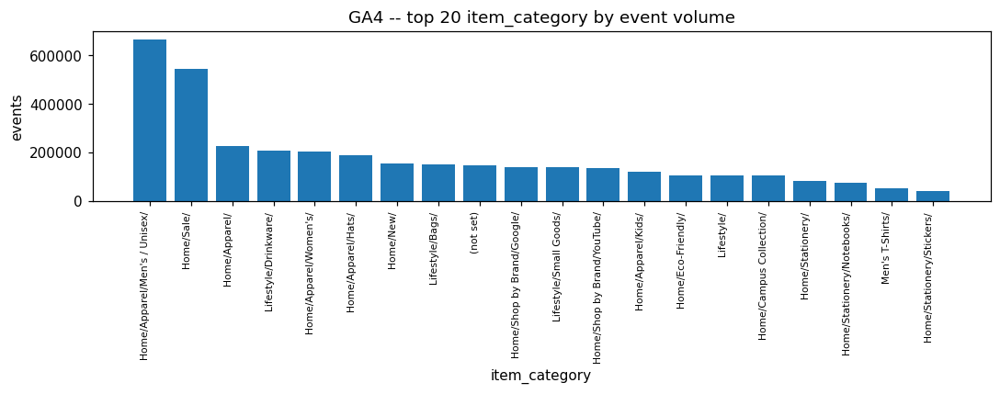
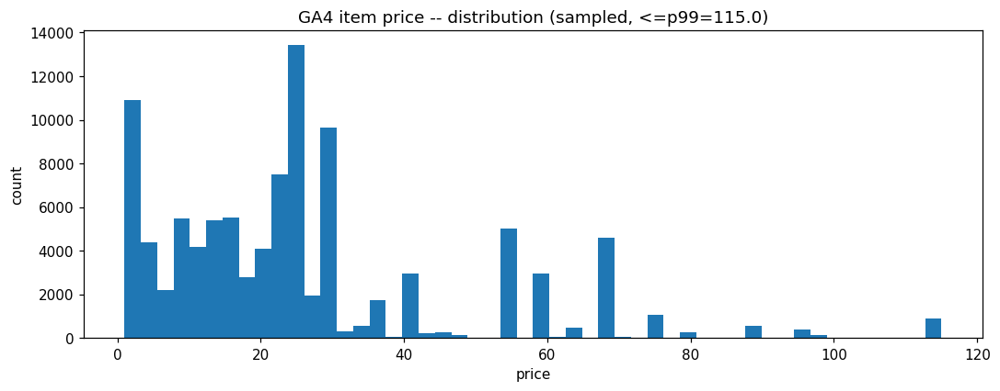

# GA4 EDA PROFILE

_Auto-generated by the EDA notebooks (`databricks/eda/ga4/`). One `## ` section per notebook; re-running a notebook replaces its own section, other sections are preserved._

<!-- BEGIN ga4:01_events -->
## GA4 commerce events (ga4_events)

### Profile

| column | missing rate | approx_distinct |
|---|---|---|
| event_date | 0.0000 | 91 |
| event_timestamp | 0.0000 | 685728 |
| event_name | 0.0000 | 11 |
| user_pseudo_id | 0.0000 | 132506 |
| geo_country | 0.0000 | 108 |

Nested field population: event_params=1.0000, ecommerce=0.9620, items=0.6573.
Rows: 779485.

### Data Quality

Candidate key ['event_date', 'event_timestamp', 'user_pseudo_id', 'event_name']: distinct/row ratio {'event_date': 0.000118, 'event_timestamp': 0.930589, 'user_pseudo_id': 0.170638, 'event_name': 1.4e-05} -- rows sharing the full key combination: 0.
Duplicate key groups: 0 (identical=0, conflicting=0).

ecommerce field population (of rows with a populated ecommerce struct, isNotNull -- includes the sentinel):
{'transaction_id': 0.9953082511032545, 'purchase_revenue': 0.006990945911523591, 'unique_items': 0.6832856112143201, 'total_item_quantity': 0.1253609165847589}
transaction_id real (non-sentinel) population: 4786 of 749827 (0.0064); 741523 rows carry '(not set)' instead of a real value.

items field population (of exploded item entries, isNotNull -- includes the sentinel):
{'item_id': 1.0, 'item_name': 1.0, 'item_category': 1.0, 'price': 0.9627243309366535, 'quantity': 0.03773891891294719, 'item_revenue': 0.0039056105206175056}
real (non-sentinel) population for item_id/item_name/item_category: {'item_id': 0.9671981443893287, 'item_name': 0.9627245820205829, 'item_category': 0.9586073077475462}
item entries from promotion events (view_promotion/select_promotion): 143197 of 3982732 (0.0360).

### Categorical / Domain Validation

event_name vs the staged allowlist: unexpected=none, unused=none.
event_params keys vs the staged allowlist: unapproved=none.

### Coverage & Sampling Bias

779485 events over 20201101..20210131. Funnel: [('view_item', 386068), ('view_promotion', 190104), ('add_to_cart', 58543), ('begin_checkout', 38757), ('select_item', 31007), ('view_search_results', 26172), ('add_shipping_info', 19722), ('add_payment_info', 13899), ('select_promotion', 9450), ('purchase', 5692), ('view_item_list', 71)] -- purchases are ~0.73% of retained events.
This table is already the staged, filtered subset -- browsing/engagement events (page_view, user_engagement, scroll, session_start, first_visit, click) were excluded before Bronze; this profile evidences the retained events only, not the raw GA4 export.

### Entities / Keys

Approx distinct: user_pseudo_id=132506, item_id (product)≈1338, item_id (promotion)≈2.

Concentration:
- user_pseudo_id: approx_distinct=132506, top10=0.0040, top50=0.0152, max_one_entity=393
- item_id (product events only): approx_distinct=1338, top10=0.1540, top50=0.4806, max_one_entity=78806
- item_id (promotion events only): approx_distinct=2, top10=1.0000, top50=1.0000, max_one_entity=125379

### Distributions

purchase_revenue distribution: {'min': 1.0, 'max': 1530.0, 'avg': 69.08908813429989, 'p50_95_99': [48.0, 186.0, 363.0]}.
item quantity / item_revenue (p50/90/99): {'qty_p50_90_99': [1, 2, 12], 'rev_p50_90_99': [16.0, 48.0, 110.0]}.
Top item_category: [("Home/Apparel/Men's / Unisex/", 666832), ('Home/Sale/', 543276), ('Home/Apparel/', 225866), ('Lifestyle/Drinkware/', 207665), ("Home/Apparel/Women's/", 202874), ('Home/Apparel/Hats/', 190073), ('Home/New/', 154949), ('Lifestyle/Bags/', 150352), ('(not set)', 148459), ('Home/Shop by Brand/Google/', 140726)].

### Relationships

Session funnel (grain: user_pseudo_id, ga_session_id): [('sessions', 168963), ('with view', 77020), ('with search', 15719), ('with cart', 15188), ('with checkout', 11106), ('with purchase', 4848)].
cart->purchase session rate = 0.1875.

### Geography

`geo_country`: 109 values; the largest holds 0.4473 of the events, the five largest 0.6633; events with an unset country 5729; countries with at least one purchase event 101.
Largest countries (events, users, events per user, purchase events, purchases per 1000 item views, purchase revenue):
- United States: 348636, 58221, 6.0, 2481, 14.19, 160573.0
- India: 69922, 12728, 5.5, 530, 15.55, 34986.0
- Canada: 59509, 9734, 6.1, 466, 15.99, 32799.0
- United Kingdom: 23882, 3675, 6.5, 177, 15.04, 11458.0
- Spain: 15118, 2348, 6.4, 131, 17.84, 7681.0
- France: 15028, 2913, 5.2, 119, 16.25, 6650.0
- China: 14062, 2328, 6.0, 101, 14.3, 6623.0
- Taiwan: 12828, 2348, 5.5, 87, 13.61, 4238.0
- Germany: 12415, 2295, 5.4, 87, 14.33, 5288.0
- Italy: 11277, 1909, 5.9, 60, 10.24, 4967.0
- Singapore: 10519, 1737, 6.1, 72, 13.4, 3824.0
- Japan: 10237, 1931, 5.3, 86, 17.2, 5752.0
- Netherlands: 9254, 1494, 6.2, 70, 14.93, 3991.0
- South Korea: 9048, 1686, 5.4, 57, 13.43, 3543.0
- Turkey: 8181, 1336, 6.1, 76, 18.31, 5345.0

### Temporal Patterns

Mean events per calendar day by weekday (0 = Monday): {0: 8580, 1: 10344, 2: 10247, 3: 9205, 4: 9077, 5: 6501, 6: 5578}.
Purchase events by weekday: {0: 874, 1: 991, 2: 982, 3: 829, 4: 981, 5: 604, 6: 431}.
Events per ISO week: [('2020-W44', 5247), ('2020-W45', 56781), ('2020-W46', 53998), ('2020-W47', 62480), ('2020-W48', 68537), ('2020-W49', 89514), ('2020-W50', 103070), ('2020-W51', 82261), ('2020-W52', 42164), ('2020-W53', 28980), ('2021-W01', 42609), ('2021-W02', 43352), ('2021-W03', 54452), ('2021-W04', 46040)].
Busiest days by events (day, events): [('20201208', 18300), ('20201209', 16986), ('20201210', 16458), ('20201211', 16298), ('20201215', 15379), ('20201130', 14593), ('20201204', 14459), ('20201201', 14364)].
Busiest days by purchase events (day, purchases): [('20201211', 160), ('20201209', 150), ('20201124', 147), ('20201210', 143), ('20201216', 143), ('20201123', 141), ('20201130', 141), ('20201215', 139)].
Events by hour of day, UTC (hour, events): [(0, 32144), (1, 31473), (2, 32098), (3, 33781), (4, 32369), (5, 33815), (6, 32963), (7, 32419), (8, 32204), (9, 32438), (10, 32846), (11, 31222), (12, 31499), (13, 33170), (14, 31499), (15, 30427), (16, 32695), (17, 33126), (18, 32188), (19, 34041), (20, 32631), (21, 32328), (22, 33245), (23, 32864)].
Purchase events by hour of day, UTC (hour, purchases): [(0, 234), (1, 225), (2, 236), (3, 230), (4, 232), (5, 285), (6, 256), (7, 228), (8, 245), (9, 224), (10, 223), (11, 201), (12, 225), (13, 232), (14, 227), (15, 220), (16, 275), (17, 240), (18, 232), (19, 242), (20, 232), (21, 237), (22, 290), (23, 221)].
Highest purchase-revenue days (day, revenue): [('20201130', 11990.0), ('20201216', 11509.0), ('20201209', 10863.0), ('20201210', 10756.0), ('20201211', 10400.0), ('20201124', 10345.0), ('20201215', 9738.0), ('20201120', 8792.0)].

### Purchases and Revenue

Purchase events 5692: 4786 carry a real transaction id, 4451 distinct transactions (335 repeated ids); 5242 carry a revenue value (5242 above zero), total 362165.0.
Purchase revenue against the sum of item revenue of the same event: 4520 of 5242 events with both agree within 1%; mean items per purchase event 2.812478031634446.
Item categories: 80 distinct values; top-level groups (group, entries, distinct items, median price, item revenue): [{'group': 'Home', 'entries': 2907185, 'items': 706, 'median_price': 24.0, 'revenue': None}, {'group': 'Lifestyle', 'entries': 614569, 'items': 226, 'median_price': 15.0, 'revenue': 13423.0}, {'group': "Men's T-Shirts", 'entries': 53519, 'items': 56, 'median_price': 25.0, 'revenue': None}, {'group': 'Apparel', 'entries': 35148, 'items': 456, 'median_price': 25.0, 'revenue': 171727.0}, {'group': 'Sale', 'entries': 34713, 'items': 168, 'median_price': 14.0, 'revenue': None}, {'group': "Men's ", 'entries': 22230, 'items': 48, 'median_price': 32.0, 'revenue': None}, {'group': 'Drinkware', 'entries': 13702, 'items': 49, 'median_price': 17.0, 'revenue': 15807.0}, {'group': 'Campus Collection', 'entries': 13238, 'items': 195, 'median_price': 8.0, 'revenue': 20061.0}, {'group': 'New', 'entries': 11932, 'items': 99, 'median_price': 12.0, 'revenue': 25813.0}, {'group': 'Google', 'entries': 11763, 'items': 316, 'median_price': 18.0, 'revenue': 3115.0}, {'group': 'Bags', 'entries': 11169, 'items': 58, 'median_price': 28.0, 'revenue': 23860.0}, {'group': "Women's", 'entries': 10565, 'items': 45, 'median_price': 38.0, 'revenue': None}].
Category paths use '/' as a separator, and some labels contain '/' themselves, so the first segment is a group label, not a strict hierarchy level.

### EDA Findings

- Staging allowlists held cleanly in Bronze (event_name, event_params keys), but GA4's own '(not set)' sentinel is not a null and passes through as-is (deliberate -- raw fidelity at Bronze, cleaning is Silver's job): item_category real population 95.9% vs 100.0% isNotNull; transaction_id real population 0.6% vs 99.5% isNotNull.
- item_id is overloaded: 143197 of 3982732 item entries (3.6%) come from promotion events (view_promotion/select_promotion) and carry a campaign identifier, not a product id -- combined item_id concentration figures would conflate the two.

### ML-Readiness Evidence

- **Grain / grain drift:** One row per event; modelling grain for conversion is (user_pseudo_id, ga_session_id), matched against the session-funnel evidence above.
- **Join multiplication (1:N / M:N expansion):** Single Bronze table -- no join here. items is 1:N per event (multiple line items per event), already exploded for profiling, not for Silver grain.
- **Target contamination:** Target: purchase conversion at session grain (4848 of 168963 sessions). The purchase event itself, and any session flag computed over the whole session, must be excluded from features predicting it.
- **Temporal / post-event leakage:** has_cart/has_checkout/has_purchase are computed over the WHOLE session regardless of order -- recompute from events strictly before the prediction point for a mid-session model.
- **Proxy leakage:** add_to_cart is a near-perfect proxy for an imminent purchase within the session.
- **Split / entity leakage:** Split by user_pseudo_id (132506 users), not by row or session.
- **Historical-reference (point-in-time) leakage:** item_category/item_name are read at event time from GA4's own export -- no external catalog join in this Bronze table to misalign.
- **Survivorship / coverage bias:** Only events on days 20201101..20210131 appear -- this is a fixed historical sample, not a live feed; nothing outside that window is observable.
- **Missingness leakage:** ecommerce/items populated only on 96.2%/65.7% of rows -- an 'is-transaction-event' flag is largely redundant with event_name itself.
- **Duplicate-event leakage:** Candidate-key duplicate groups: 0 (identical=0, conflicting=0) -- resolve before counting events or splitting.
- **Target / feature temporal misalignment:** event_timestamp is microsecond-precision -- ordering within a session is well-defined, unlike REES46's second-precision timestamps.
- **Unit / sign / circular-feature leakage:** purchase_revenue is transaction-level, item_revenue is line-item-level -- do not sum item_revenue and compare to purchase_revenue without checking they use the same currency convention.
- **Data-generation-process leakage:** This is Google's own public sample export, not a live property -- traffic patterns reflect the sample's own collection process, not a real production funnel.
- **Class / label instability:** Funnel is skewed ([('view_item', 386068), ('view_promotion', 190104), ('add_to_cart', 58543), ('begin_checkout', 38757), ('select_item', 31007), ('view_search_results', 26172), ('add_shipping_info', 19722), ('add_payment_info', 13899), ('select_promotion', 9450), ('purchase', 5692), ('view_item_list', 71)]) -- purchase is ~0.73% of retained events; do not evaluate a conversion classifier with plain accuracy.
- **Label availability lag:** A purchase is logged at the event; no payment/fulfillment lag is represented in this sample.
- **Source / version / regime change:** Single fixed 92-day window -- no cross-period regime comparison is possible from this table alone.
- **Sample-vs-full divergence:** The price figure is a 20%-sampled, p99-clipped subset of exploded item entries; use the full-table field-population/funnel aggregates above for any threshold decision.

### Observations by Area

- **Domain understanding:** retail web-shop events (item views, promotions, search, cart, checkout, purchase) for one store, with user, session, item and transaction fields; events by type: [('view_item', 386068), ('view_promotion', 190104), ('add_to_cart', 58543), ('begin_checkout', 38757), ('select_item', 31007), ('view_search_results', 26172), ('add_shipping_info', 19722), ('add_payment_info', 13899), ('select_promotion', 9450), ('purchase', 5692), ('view_item_list', 71)]; top-level item groups: [('Home', 2907185), ('Lifestyle', 614569), ("Men's T-Shirts", 53519), ('Apparel', 35148), ('Sale', 34713)]
- **Structure and engineering:** one Bronze table with nested arrays (event_params, items) and a struct (ecommerce); already filtered to a retained event set; GA4's '(not set)' string is kept as a value: transaction id real in 4786 of 5692 purchase events; scalar key duplicates: 0
- **Temporal:** 20201101 .. 20210131 (92 days); weekday means {0: 8580, 1: 10344, 2: 10247, 3: 9205, 4: 9077, 5: 6501, 6: 5578}; busiest days [('20201208', 18300), ('20201209', 16986), ('20201210', 16458)]; purchase hours [(0, 234), (1, 225), (2, 236), (3, 230), (4, 232), (5, 285)] ...
- **Spatial:** country only: 109 values, top 5 hold 0.6633; purchases in 101 countries
- **Data quality:** repeated transaction ids among purchase events: 335; item id/name/category real population: {'item_id': 0.9671981443893287, 'item_name': 0.9627245820205829, 'item_category': 0.9586073077475462}; item entries from promotion events: 143197 of 3982732
- **Statistical patterns:** user concentration: {'approx_distinct': 132506, 'top10_share': 0.0039923795839560735, 'top50_share': 0.01517283847668653, 'max_rows_one_entity': 393}; price / revenue / quantity percentiles: {'qty_p50_90_99': [1, 2, 12], 'rev_p50_90_99': [16.0, 48.0, 110.0]}
- **Relationships:** session funnel: [('sessions', 168963), ('with view', 77020), ('with search', 15719), ('with cart', 15188), ('with checkout', 11106), ('with purchase', 4848)]; purchase revenue vs item revenue agreement: 4520 of 5242
- **Analytics use:** funnel, product, category, country and time analysis of shop behaviour and revenue
- **ML use:** session-level conversion is a natural label (purchase in session); the sample window is one holiday season
- **AI / knowledge use:** item names and category paths are a small product taxonomy (80 categories); search terms exist as an event parameter

### Silver Implications

- Grain = one row per event; if the candidate key is not unique, add a synthetic row id at Silver.
- Session grain is (user_pseudo_id, ga_session_id), not user_pseudo_id alone.
- ecommerce/items are sparse (populated only on transaction-relevant events) -- keep as nullable structs, not flattened columns with a default.
- Normalise GA4's '(not set)'/'(none)' sentinel to null on item_id/item_name/item_category/ecommerce.transaction_id at Silver -- Bronze intentionally keeps it raw.
- Model item_id from promotion events (view_promotion/select_promotion) separately from product item_id -- they are different entity types sharing one field.

### Figure -- GA4 event_name funnel

### Figure -- GA4 sessions reaching each funnel stage

### Figure -- GA4 events per day

### Figure -- GA4 top item_category by event volume

### Figure -- GA4 item price distribution (sampled)

<!-- END ga4:01_events -->
