# HONDA_IOT EDA PROFILE

_Auto-generated by the EDA notebooks (`databricks/eda/honda_iot/`). One `## ` section per notebook; re-running a notebook replaces its own section, other sections are preserved._

<!-- BEGIN honda_iot:01_energy -->
## Energy tables (electricity / heating / cooling, each P and W)

### Profile

| table | rows | cols | frequencies | constant cols |
|---|---|---|---|---|
| electricity_p | 3417959 | 5 | {'15min': 210336, '1h': 52584, '1min': 3155039} | - |
| electricity_w | 3417957 | 5 | {'15min': 210335, '1h': 52583, '1min': 3155039} | - |
| heating_p | 3417959 | 5 | {'15min': 210336, '1h': 52584, '1min': 3155039} | - |
| heating_w | 3417947 | 5 | {'15min': 210335, '1h': 52583, '1min': 3155029} | - |
| cooling_p | 3417960 | 4 | {'15min': 210336, '1h': 52584, '1min': 3155040} | - |
| cooling_w | 3417895 | 4 | {'15min': 210332, '1h': 52583, '1min': 3154980} | - |

Value columns per table: {'electricity_p': ['total', 'PV', 'CHP'], 'electricity_w': ['total', 'PV', 'CHP'], 'heating_p': ['total', 'CHP_heat', 'CHP_elec'], 'heating_w': ['total', 'CHP_heat', 'CHP_elec'], 'cooling_p': ['total', 'cool_elec'], 'cooling_w': ['total', 'cool_elec']}

### Data Quality

| table | dup key groups | identical | conflicting |
|---|---|---|---|
| electricity_p | 0 | 0 | 0 |
| electricity_w | 0 | 0 | 0 |
| heating_p | 0 | 0 | 0 |
| heating_w | 0 | 0 | 0 |
| cooling_p | 0 | 0 | 0 |
| cooling_w | 0 | 0 | 0 |

5-sigma outlier rows per value column: {'electricity_p': {'total': 159, 'PV': 13, 'CHP': 0}, 'electricity_w': {'total': 0, 'PV': 0, 'CHP': 0}, 'heating_p': {'total': 680, 'CHP_heat': 0, 'CHP_elec': 0}, 'heating_w': {'total': 0, 'CHP_heat': 0, 'CHP_elec': 0}, 'cooling_p': {'total': 7384, 'cool_elec': 8430}, 'cooling_w': {'total': 0, 'cool_elec': 0}}

### Temporal

Per (table, frequency): observed, coverage %, on-step %, longest gap (steps), missing steps:
- electricity_p / 1min: observed=3155039, coverage=100.0%, on-step=100.0%, longest gap=0, missing steps=0
- electricity_p / 15min: observed=210336, coverage=100.0%, on-step=100.0%, longest gap=0, missing steps=0
- electricity_p / 1h: observed=52584, coverage=100.0%, on-step=100.0%, longest gap=0, missing steps=0
- electricity_w / 1min: observed=3155039, coverage=100.0%, on-step=100.0%, longest gap=0, missing steps=0
- electricity_w / 15min: observed=210335, coverage=100.0%, on-step=100.0%, longest gap=0, missing steps=0
- electricity_w / 1h: observed=52583, coverage=100.0%, on-step=100.0%, longest gap=0, missing steps=0
- heating_p / 1min: observed=3155039, coverage=100.0%, on-step=100.0%, longest gap=0, missing steps=0
- heating_p / 15min: observed=210336, coverage=100.0%, on-step=100.0%, longest gap=0, missing steps=0
- heating_p / 1h: observed=52584, coverage=100.0%, on-step=100.0%, longest gap=0, missing steps=0
- heating_w / 1min: observed=3155029, coverage=100.0%, on-step=100.0%, longest gap=0, missing steps=0
- heating_w / 15min: observed=210335, coverage=100.0%, on-step=100.0%, longest gap=0, missing steps=0
- heating_w / 1h: observed=52583, coverage=100.0%, on-step=100.0%, longest gap=0, missing steps=0
- cooling_p / 1min: observed=3155040, coverage=100.0%, on-step=100.0%, longest gap=0, missing steps=0
- cooling_p / 15min: observed=210336, coverage=100.0%, on-step=100.0%, longest gap=0, missing steps=0
- cooling_p / 1h: observed=52584, coverage=100.0%, on-step=100.0%, longest gap=0, missing steps=0
- cooling_w / 1min: observed=3154980, coverage=100.0%, on-step=100.0%, longest gap=0, missing steps=0
- cooling_w / 15min: observed=210332, coverage=100.0%, on-step=100.0%, longest gap=0, missing steps=0
- cooling_w / 1h: observed=52583, coverage=100.0%, on-step=100.0%, longest gap=0, missing steps=0

### Distributions

- electricity_p.`total`: min/max=-663729.1614583333/788591.3170904393, p01/25/50/75/99=[-213188.529094282, 83881.0984375, 181623.10266927083, 247678.3535156249, 506519.43307291664], mean=169774.77319271534, sd=131559.439786418, zero rows=0, negative rows=251753, non-numeric=0
- electricity_p.`PV`: min/max=-719598.0706801552/228.05301725539397, p01/25/50/75/99=[-499682.3493229167, -66527.77305261993, -266.9166666666667, -1.4465944111346736, 15.8449964022168], mean=-62396.62979326242, sd=117531.4405097732, zero rows=902, negative rows=2123878, non-numeric=0
- electricity_p.`CHP`: min/max=-282561.8727453294/27705.3, p01/25/50/75/99=[-187453.06, -155485.04, 78.76, 89.20373668260895, 2781.95], mean=-64429.805489074475, sd=80113.57633145139, zero rows=2269, negative rows=1424716, non-numeric=0
- electricity_w.`total`: min/max=-104.47653333339258/8918860.985849153, p01/25/50/75/99=[83708.36135455813, 3006442.362074039, 5496957.509299152, 7220579.611307486, 8872242.862938901], mean=5083922.119569838, sd=2516610.5823399858, zero rows=3, negative rows=225, non-numeric=0
- electricity_w.`PV`: min/max=-2464379.466175354/0.0, p01/25/50/75/99=[-2459880.5741615626, -1794876.7656312117, -1077214.8796239134, -303141.63940450473, -11260.38751372549], mean=-1046180.7596938224, sd=795057.1209760648, zero rows=3, negative rows=2569379, non-numeric=0
- electricity_w.`CHP`: min/max=-3390184.498498443/0.0, p01/25/50/75/99=[-3303318.7484984426, -2563919.043311906, -1687631.9333119064, -883556.88, -59629.63458566446], mean=-1695281.213488044, sd=974507.2024406932, zero rows=3, negative rows=3417892, non-numeric=0
- heating_p.`total`: min/max=-7.275957614183426e-12/2193300.0, p01/25/50/75/99=[0.0, 52700.0, 229000.0, 374400.0, 791200.0], mean=245946.51335597687, sd=203773.33277197226, zero rows=567358, negative rows=11, non-numeric=0
- heating_p.`CHP_heat`: min/max=-4.547473508864641e-13/459285.1413232855, p01/25/50/75/99=[0.0, 0.0, 0.0, 254920.0, 306020.0], mean=106099.21360351957, sd=128533.5486758921, zero rows=1837745, negative rows=10, non-numeric=0
- heating_p.`CHP_elec`: min/max=-282561.8727453294/27705.3, p01/25/50/75/99=[-187471.78, -155463.25, 78.76, 89.2057994758886, 2781.95], mean=-64429.80548907447, sd=80113.57633145142, zero rows=2269, negative rows=1424716, non-numeric=0
- heating_w.`total`: min/max=0.0/12975100.000000002, p01/25/50/75/99=[217100.0, 3352600.0, 6518200.0, 10341300.0, 12770300.0], mean=6690127.6042457605, sd=3900559.891992281, zero rows=20, negative rows=0, non-numeric=0
- heating_w.`CHP_heat`: min/max=0.0/5583000.0, p01/25/50/75/99=[93695.0, 1421930.0, 2713100.0, 4205950.0, 5441889.999999999], mean=2765359.1359086484, sd=1613442.8019178223, zero rows=9, negative rows=0, non-numeric=0
- heating_w.`CHP_elec`: min/max=-3390184.498498443/0.0, p01/25/50/75/99=[-3302859.058498442, -2563918.5683119064, -1687801.4733119064, -883556.58, -59570.21843300591], mean=-1695255.4217999058, sd=974522.2229910549, zero rows=55, negative rows=3417892, non-numeric=0
- cooling_p.`total`: min/max=-1.8189894035458565e-12/3717000.0, p01/25/50/75/99=[0.0, 6300.0, 23000.0, 63500.0, 229000.0], mean=43053.630578824115, sd=54535.66851196102, zero rows=167258, negative rows=70, non-numeric=0
- cooling_p.`cool_elec`: min/max=0.0/332024.7807491248, p01/25/50/75/99=[896.91, 1197.19, 1257.04, 36032.46000000001, 119132.82], mean=19460.582344276118, sd=27250.084640577727, zero rows=3, negative rows=0, non-numeric=0
- cooling_w.`total`: min/max=0.0/2270133.4562972225, p01/25/50/75/99=[11200.0, 572826.1653328948, 1155833.4562972223, 1715433.4562972223, 2264233.4562972225], mean=1154458.3248297796, sd=664635.5387939217, zero rows=3960, negative rows=0, non-numeric=0
- cooling_w.`cool_elec`: min/max=0.0/1024963.8347382598, p01/25/50/75/99=[2159.8442336544176, 256704.41709388536, 515952.0359825874, 767483.2900872543, 1022387.8447382596], mean=516459.98544157285, sd=302073.95176798734, zero rows=3, negative rows=0, non-numeric=0

### Relationships

P<->W value relationship per metric (matched rows on (frequency, datetime_utc) + per-column Pearson corr):
- electricity: {'matched': 3417956, 'corr_total': -0.3205019774045346, 'corr_PV': 0.12364898401544824, 'corr_CHP': -0.0010890810054510877}
- heating: {'matched': 3417946, 'corr_total': -0.0609501173806899, 'corr_CHP_heat': 0.012587110363189692, 'corr_CHP_elec': -0.0011254584876038121}
- cooling: {'matched': 3417895, 'corr_total': -0.0272440113236412, 'corr_cool_elec': -0.014216150000299979}

P/W schema parity: {'electricity': True, 'heating': True, 'cooling': True}

### ML-Readiness Evidence

- Candidate target signals: the stuck-sensor flags and 5-sigma outlier counts computed above ({'electricity_p': {'total': 159, 'PV': 13, 'CHP': 0}, 'electricity_w': {'total': 0, 'PV': 0, 'CHP': 0}, 'heating_p': {'total': 680, 'CHP_heat': 0, 'CHP_elec': 0}, 'heating_w': {'total': 0, 'CHP_heat': 0, 'CHP_elec': 0}, 'cooling_p': {'total': 7384, 'cool_elec': 8430}, 'cooling_w': {'total': 0, 'cool_elec': 0}}) are natural labels for a sensor-anomaly-detection use case; the value columns themselves (electricity/heating/cooling P and W) are candidate forecasting targets keyed by (frequency, datetime_utc).
- Leakage: P and W tables per metric are schema-identical and highly correlated (Pearson corr in `pw_rel` = {'electricity': {'matched': 3417956, 'corr_total': -0.3205019774045346, 'corr_PV': 0.12364898401544824, 'corr_CHP': -0.0010890810054510877}, 'heating': {'matched': 3417946, 'corr_total': -0.0609501173806899, 'corr_CHP_heat': 0.012587110363189692, 'corr_CHP_elec': -0.0011254584876038121}, 'cooling': {'matched': 3417895, 'corr_total': -0.0272440113236412, 'corr_cool_elec': -0.014216150000299979}}) -- verify whether P and W are independent physical measurements or one is a unit-derived transform of the other before using both as separate features; if derived, using one to predict the other is circular, not genuine signal.
- Grain and entity-grouped split: key = ['frequency', 'datetime_utc'] per table, no separate device/sensor id -- split by contiguous date range, not by row, and never mix `frequency` values within one split since 1min/15min/1h are different physical resolutions of the same underlying signal.
- Join cardinality: P<->W join per metric is 1:1 on (frequency, datetime_utc) confirmed by matched-row counts and schema parity above -- safe to join without fan-out risk.
- Imbalance: stuck-run and 5-sigma-outlier flags are rare-event labels by construction ({'electricity_p': {'total': 159, 'PV': 13, 'CHP': 0}, 'electricity_w': {'total': 0, 'PV': 0, 'CHP': 0}, 'heating_p': {'total': 680, 'CHP_heat': 0, 'CHP_elec': 0}, 'heating_w': {'total': 0, 'CHP_heat': 0, 'CHP_elec': 0}, 'cooling_p': {'total': 7384, 'cool_elec': 8430}, 'cooling_w': {'total': 0, 'cool_elec': 0}}) -- an anomaly-detection model trained on these will face severe class imbalance; do not evaluate with plain accuracy.
- Sample-vs-full divergence: the value-distribution figure uses `value_pdf` (10% sample capped at 150k rows), the hourly time-series figure uses only the first 2000 chronological points per table, and the P-vs-W scatter uses a 10% sample capped at 20k rows -- none of these are representative of the full series; use the full-table `value_stats`/`outliers`/`continuity` aggregates for any feature-quality or threshold decision.

### EDA Findings

- dup composition: {'electricity_p': {'dup_groups': 0, 'identical': 0, 'conflicting': 0}, 'electricity_w': {'dup_groups': 0, 'identical': 0, 'conflicting': 0}, 'heating_p': {'dup_groups': 0, 'identical': 0, 'conflicting': 0}, 'heating_w': {'dup_groups': 0, 'identical': 0, 'conflicting': 0}, 'cooling_p': {'dup_groups': 0, 'identical': 0, 'conflicting': 0}, 'cooling_w': {'dup_groups': 0, 'identical': 0, 'conflicting': 0}}
- coverage % / on-step % per table/frequency: {'electricity_p': [('1min', 100.0, 100.0), ('15min', 100.0, 100.0), ('1h', 100.0, 100.0)], 'electricity_w': [('1min', 100.0, 100.0), ('15min', 100.0, 100.0), ('1h', 100.0, 100.0)], 'heating_p': [('1min', 100.0, 100.0), ('15min', 100.0, 100.0), ('1h', 100.0, 100.0)], 'heating_w': [('1min', 100.0, 100.0), ('15min', 100.0, 100.0), ('1h', 100.0, 100.0)], 'cooling_p': [('1min', 100.0, 100.0), ('15min', 100.0, 100.0), ('1h', 100.0, 100.0)], 'cooling_w': [('1min', 100.0, 100.0), ('15min', 100.0, 100.0), ('1h', 100.0, 100.0)]}
- 5-sigma outliers: {'electricity_p': {'total': 159, 'PV': 13, 'CHP': 0}, 'electricity_w': {'total': 0, 'PV': 0, 'CHP': 0}, 'heating_p': {'total': 680, 'CHP_heat': 0, 'CHP_elec': 0}, 'heating_w': {'total': 0, 'CHP_heat': 0, 'CHP_elec': 0}, 'cooling_p': {'total': 7384, 'cool_elec': 8430}, 'cooling_w': {'total': 0, 'cool_elec': 0}}
- P<->W relationship: {'electricity': {'matched': 3417956, 'corr_total': -0.3205019774045346, 'corr_PV': 0.12364898401544824, 'corr_CHP': -0.0010890810054510877}, 'heating': {'matched': 3417946, 'corr_total': -0.0609501173806899, 'corr_CHP_heat': 0.012587110363189692, 'corr_CHP_elec': -0.0011254584876038121}, 'cooling': {'matched': 3417895, 'corr_total': -0.0272440113236412, 'corr_cool_elec': -0.014216150000299979}}

### Silver Implications

- Type conversion: datetime_utc -> timestamp; value columns -> double.
- `frequency` (1min / 15min / 1h) is a real physical resolution -> keep it in the grain; do not blend frequencies.
- Identical (frequency, datetime_utc) repeats can be de-duplicated.
- Series are not dense (coverage % / gaps above) -> observed points only; resampling is a downstream choice.
- Stuck-sensor runs and 5-sigma spikes -> data-quality flag, keep raw.
- P and W tables of a metric are schema-identical, join 1:1 on (frequency, datetime_utc), and are highly correlated (corr above) -> may be modelled as one fact per metric (a Silver modelling choice).

### Figure -- Honda energy -- rows per frequency, by table

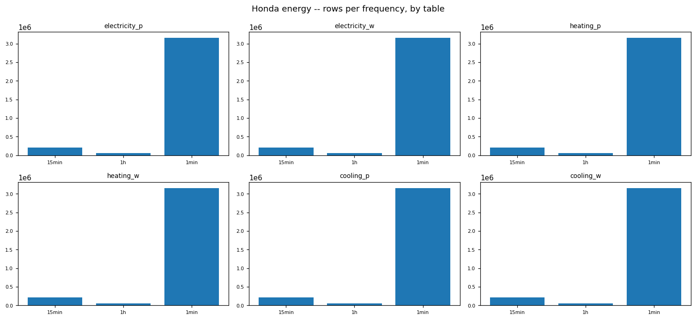

### Figure -- Honda energy -- coverage % by frequency

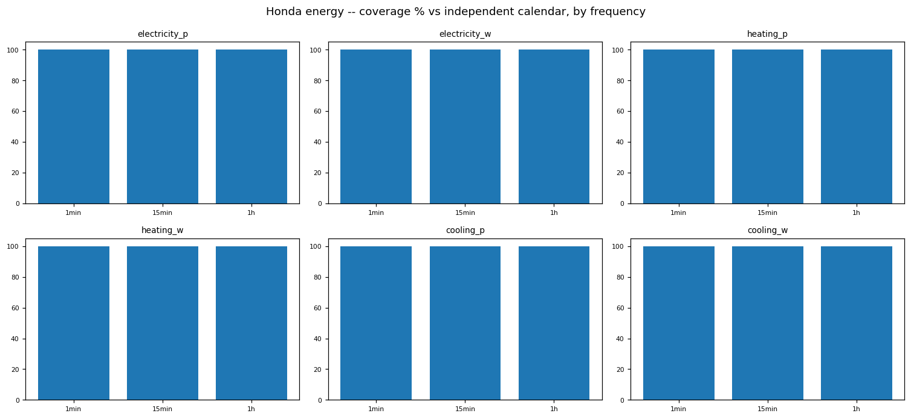

### Figure -- Honda energy -- duplicate (frequency, datetime_utc) groups

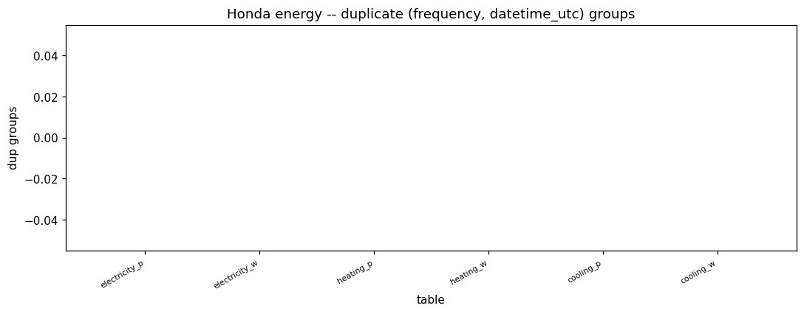

### Figure -- Honda energy -- longest gap (missing steps) per table x frequency

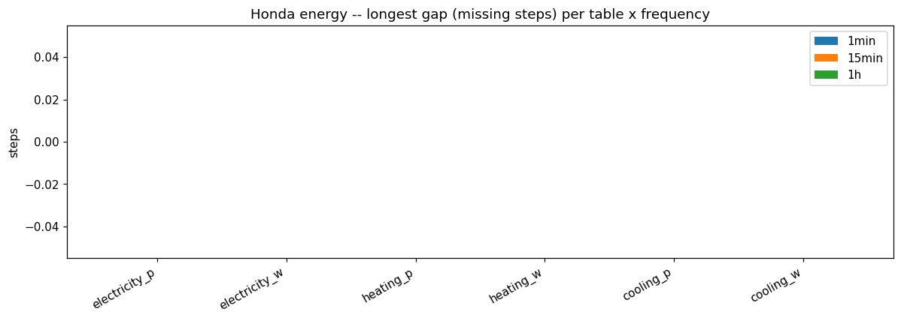

### Figure -- Honda energy -- value distribution per table.column

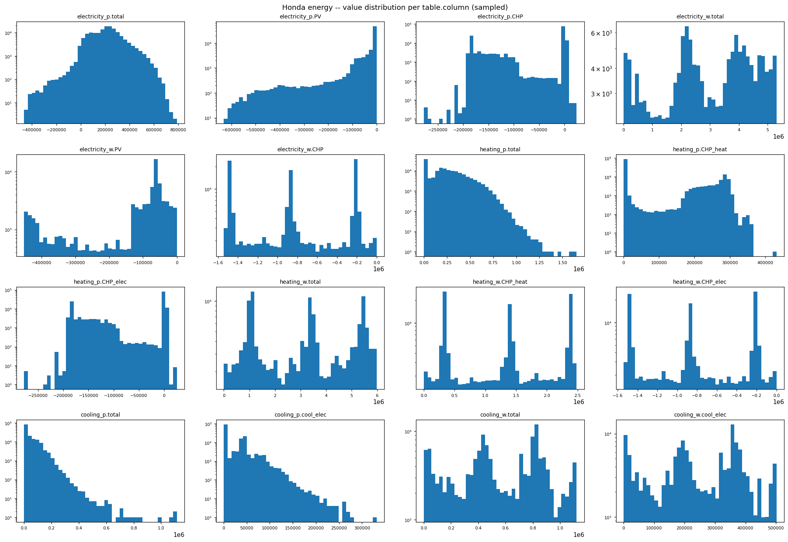

### Figure -- Honda energy -- first 2000 hourly points, by table

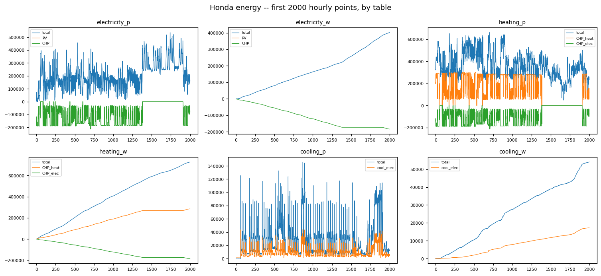

### Figure -- Honda energy -- P vs W per metric

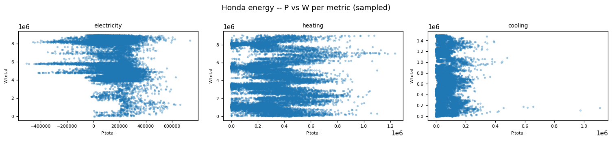

<!-- END honda_iot:01_energy -->

<!-- BEGIN honda_iot:02_weather -->
## Weather table (honda_iot_weather)

### Profile

| column | missing | rate | approx_distinct |
|---|---|---|---|
| frequency | 0 | 0.0000 | 3 |
| datetime_utc | 0 | 0.0000 | 3148228 |
| WeatherStation_Weather_Ta | 81743 | 0.0239 | 1562020 |
| WeatherStation_Weather_Igm | 81762 | 0.0239 | 1812296 |

Rows: 3419507. Constant columns: none.

### Data Quality

Duplicate (frequency, datetime_utc) key composition: {'dup_groups': 0, 'identical': 0, 'conflicting': 0}.
(frequency, datetime_utc) is unique in Bronze.

### Temporal

| frequency | rows | coverage % | on-step % | longest gap (steps) |
|---|---|---|---|---|
| 15min | 210432 | 100.0 | 100.0 | 0 |
| 1h | 52608 | 100.0 | 100.0 | 0 |
| 1min | 3156467 | 100.0 | 100.0 | 0 |

Top interval sizes (frequency, delta_s, count): [('1min', 60, 3156466), ('15min', 900, 210431), ('1h', 3600, 52607), ('1h', None, 1), ('1min', None, 1), ('15min', None, 1)]

### Distributions

| column | min | p01 | p50 | p99 | max | mean | sd | zero | non_numeric |
|---|---|---|---|---|---|---|---|---|---|
| WeatherStation_Weather_Ta | -11.6211330890655 | -3.1046586036682 | 11.800457827249776 | 30.87661711374917 | 39.89799912770584 | 12.404201602171133 | 7.975117807441465 | 0 | 0 |
| WeatherStation_Weather_Igm | 0.0 | 0.0 | 2.8015878200531 | 845.739322916668 | 1140.98239746091 | 133.52659979304494 | 220.24460323755744 | 1455479 | 0 |

Out-of-plausible-range counts (PLAUSIBLE={'Ta': (-40.0, 50.0), 'Igm': (0.0, 1500.0)}): {'WeatherStation_Weather_Ta': 0, 'WeatherStation_Weather_Igm': 0}

Stuck runs (>=12 identical consecutive values, 1h partition): {'WeatherStation_Weather_Ta': 70, 'WeatherStation_Weather_Igm': 1710}

### EDA Findings

- Sensor stuck-runs detected (1h): {'WeatherStation_Weather_Ta': 70, 'WeatherStation_Weather_Igm': 1710}.

### ML-Readiness Evidence

- Candidate target signals: Ta (air temperature) and Igm (global irradiance) are candidate forecasting targets keyed by (frequency, datetime_utc); the stuck-run flags ({'WeatherStation_Weather_Ta': 70, 'WeatherStation_Weather_Igm': 1710}) are a candidate anomaly-detection label.
- Leakage: this table is the weather side of the energy<->weather join analysed in 03_honda_relationships_and_findings.py -- using same-timestamp weather to predict same-timestamp energy is legitimate, but using a later weather reading (or a diurnal profile averaged over the FULL history) to predict an earlier energy reading would leak future information; any diurnal/seasonal feature must be computed only from data available before the prediction point.
- Grain and entity-grouped split: key = (frequency, datetime_utc), single weather source (no station id) -- split by contiguous date range, not by row, and never mix `frequency` values within one split.
- Join cardinality: this notebook does not assess the energy<->weather join cardinality -- see 03_honda_relationships_and_findings.py for the confirmed match rate; do not assume a 1:1 join without checking that notebook's yield numbers first.
- Imbalance: stuck-run flags ({'WeatherStation_Weather_Ta': 70, 'WeatherStation_Weather_Igm': 1710}) are a rare-event label by construction -- a sensor-anomaly model trained on them will face severe class imbalance.
- Sample-vs-full divergence: the value-distribution figure uses `value_pdf` (10% sample capped at 150k rows) and the hourly-window figure uses only the first 3000 chronological points -- the diurnal-profile figure (`hourly`) IS a full-table groupBy average, not sampled, so it is safe to use as-is; use the full-table `S` aggregate stats, not `value_pdf`, for any threshold decision.

### Figure -- Honda weather -- frequency overview

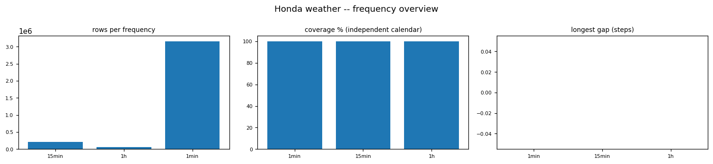

### Figure -- Honda weather -- value distribution per column

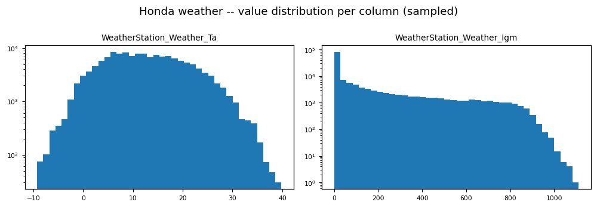

### Figure -- Honda weather -- first 3000 hourly points per column

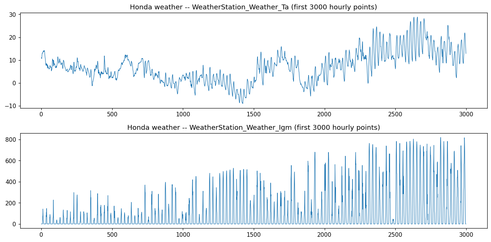

### Figure -- Honda weather -- mean value by hour of day

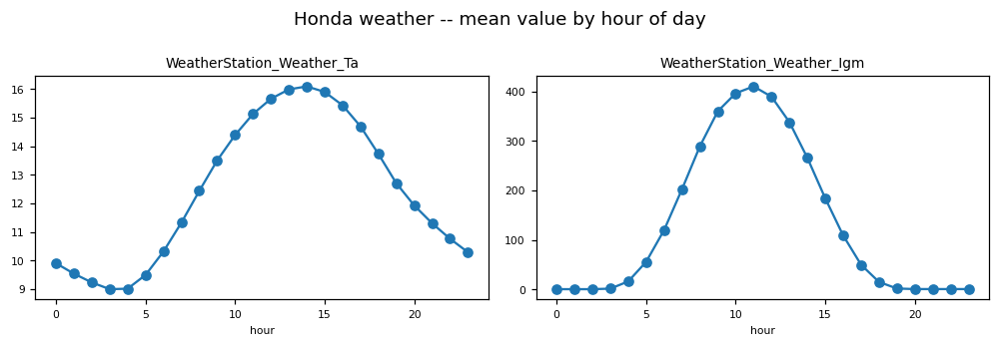

<!-- END honda_iot:02_weather -->

<!-- BEGIN honda_iot:03_relationships_and_findings -->
## Cross-table relationships (7 Honda IoT tables)

### Entities / Keys

| table | rows | distinct keys present | missing vs union | key unique |
|---|---|---|---|---|
| honda_iot_electricity_p | 3417959 | 3417959 | 1549 | True |
| honda_iot_electricity_w | 3417957 | 3417957 | 1551 | True |
| honda_iot_heating_p | 3417959 | 3417959 | 1549 | True |
| honda_iot_heating_w | 3417947 | 3417947 | 1561 | True |
| honda_iot_cooling_p | 3417960 | 3417960 | 1548 | True |
| honda_iot_cooling_w | 3417895 | 3417895 | 1613 | True |
| honda_iot_weather | 3419507 | 3419507 | 1 | True |

Union of (frequency, datetime_utc) keys: 3419508. Keys shared by all 7 tables: 3417894 (100.0%).

### Relationships

Energy<->weather match rate on (frequency, datetime_utc):

| energy table | energy keys | matched to weather | % |
|---|---|---|---|
| honda_iot_electricity_p | 3417959 | 3417959 | 100.0 |
| honda_iot_electricity_w | 3417957 | 3417956 | 100.0 |
| honda_iot_heating_p | 3417959 | 3417959 | 100.0 |
| honda_iot_heating_w | 3417947 | 3417946 | 100.0 |
| honda_iot_cooling_p | 3417960 | 3417959 | 100.0 |
| honda_iot_cooling_w | 3417895 | 3417894 | 100.0 |

Pairwise shared-key counts:

| pair | shared keys |
|---|---|
| electricity_p + electricity_w | 3417956 |
| electricity_p + heating_p | 3417959 |
| electricity_p + heating_w | 3417946 |
| electricity_p + cooling_p | 3417959 |
| electricity_p + cooling_w | 3417894 |
| electricity_p + weather | 3417959 |
| electricity_w + heating_p | 3417956 |
| electricity_w + heating_w | 3417947 |
| electricity_w + cooling_p | 3417957 |
| electricity_w + cooling_w | 3417895 |
| electricity_w + weather | 3417956 |
| heating_p + heating_w | 3417946 |
| heating_p + cooling_p | 3417959 |
| heating_p + cooling_w | 3417894 |
| heating_p + weather | 3417959 |
| heating_w + cooling_p | 3417947 |
| heating_w + cooling_w | 3417895 |
| heating_w + weather | 3417946 |
| cooling_p + cooling_w | 3417895 |
| cooling_p + weather | 3417959 |
| cooling_w + weather | 3417894 |

### EDA Findings

- 1614 keys are missing from at least one table (per-table gaps: {'electricity_p': 1549, 'electricity_w': 1551, 'heating_p': 1549, 'heating_w': 1561, 'cooling_p': 1548, 'cooling_w': 1613, 'weather': 1}).

(frequency, datetime_utc) is unique in every Honda table: True.
3417894 of 3419508 keys (100.0%) are present in all 7 tables.
Energy<->weather match rate: {'electricity_p': 100.0, 'electricity_w': 100.0, 'heating_p': 100.0, 'heating_w': 100.0, 'cooling_p': 100.0, 'cooling_w': 100.0}.
A shared 1:1 key exists. A wide 'all Honda metrics at (frequency, datetime_utc)' table is feasible on the intersection but drops the non-overlapping tail; the natural Silver grain is one fact per dataset (or per metric joining P+W), with the wide table left to Gold.

### ML-Readiness Evidence

- No candidate ML target lives across these 7 tables directly -- this notebook is a joinability audit; see 01_energy_eda.py and 02_weather_eda.py for per-table target candidates.
- Join cardinality: (frequency, datetime_utc) is unique in every table (True), so all pairwise and 7-way joins are 1:1 on the shared key -- no cartesian-explosion risk from fan-out, but the join is NOT complete: only 3417894 of 3419508 keys (100.0%) are present in all 7 tables, so an inner 7-way join drops the rest.
- Energy<->weather join yield (the join a combined energy+weather model would use): {'electricity_p': 100.0, 'electricity_w': 100.0, 'heating_p': 100.0, 'heating_w': 100.0, 'cooling_p': 100.0, 'cooling_w': 100.0} -- any energy table with <100% match will silently lose rows on an inner join; use an outer join and an explicit missing-weather flag instead.
- Grain and entity-grouped split: shared key = (frequency, datetime_utc) across all 7 tables -- any model combining them must split by contiguous date range, not by row, so a timestamp's energy and weather readings stay together on the same side of a split.
- Leakage: because energy and weather share the same timestamp grid, a same-timestamp weather feature is legitimate for predicting same-timestamp energy, but a model must not be fed a later timestamp's energy or weather value when predicting an earlier one.
- Imbalance: not applicable at this cross-table level -- see per-table stuck-run/outlier imbalance notes in 01_energy_eda.py and 02_weather_eda.py.
- Sample-vs-full divergence: not applicable -- every statistic here (key presence, pairwise overlap, join yield) is computed from a full Spark aggregation over the tagged-union presence matrix, no `.sample()`/`.limit()` subset feeds any reported number.

### Silver Implications

- Silver grain: one fact table per dataset keyed on (frequency, datetime_utc); join P+W per metric where a combined metric fact is needed.

### Figure -- Honda pairwise (frequency, datetime_utc) overlap

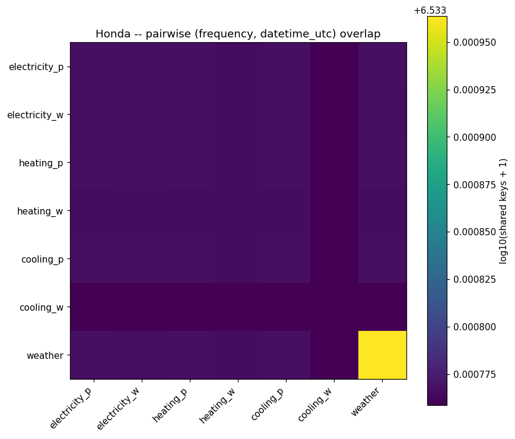

### Figure -- Honda -- keys missing from each table vs the union

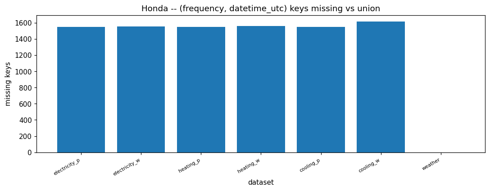

### Figure -- Honda -- energy <-> weather join yield

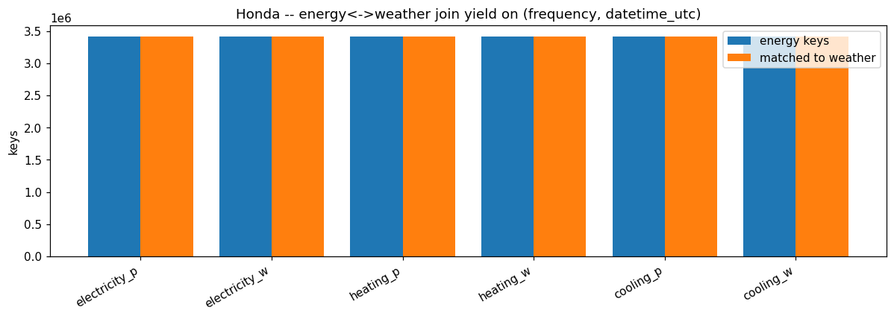

<!-- END honda_iot:03_relationships_and_findings -->
