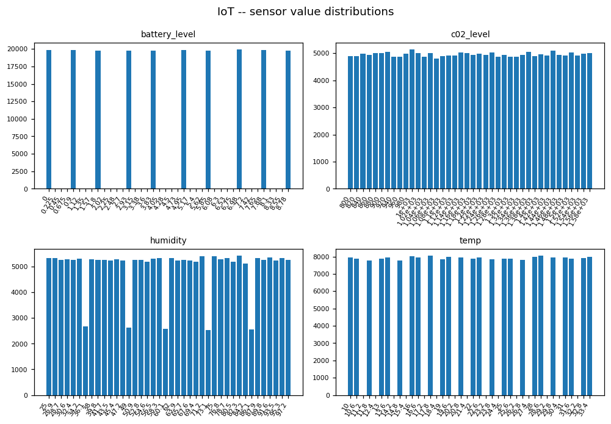
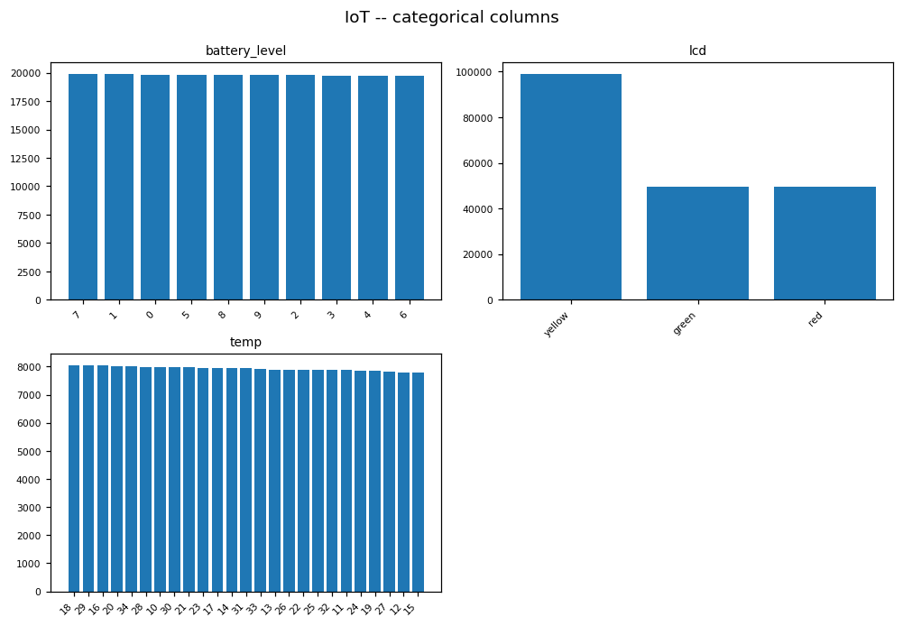

# IOT EDA PROFILE

_Auto-generated by the EDA notebooks (`databricks/eda/iot/`). One `## ` section per notebook; re-running a notebook replaces its own section, other sections are preserved._

<!-- BEGIN iot:01_iot_devices -->
## IoT device telemetry (Samples: iot)

### Profile

| frame | source files | rows | cols | constant columns | nested columns |
|---|---|---|---|---|---|
| json | 1 | 198164 | 15 | scale | - |

### Provenance / Source Evidence

The dataset is read in place from the Databricks Samples Volume; there is no Bronze table and no ECRMAP acquisition step.
Files under `/Volumes/samples/databricks/datasets/iot`: 1 ({'json': 1}).
- No README / licence file in the directory: provenance, generator and licence are not documented here (LIMITATION).

### Structural Integrity

- schema: `struct<battery_level:bigint,c02_level:bigint,cca2:string,cca3:string,cn:string,device_id:bigint,device_name:string,humidity:bigint,ip:string,latitude:double,lcd:string,longitude:double,scale:string,temp:bigint,timestamp:bigint,__file:string>`
- corrupt-record column present: False; nested columns: none.
- column roles resolved by name: {'device': 'device_id', 'device_name': 'device_name', 'ip': 'ip', 'cca2': 'cca2', 'cca3': 'cca3', 'country': 'cn', 'lat': 'latitude', 'lon': 'longitude', 'scale': 'scale', 'lcd': 'lcd', 'ts': 'timestamp'}.

### Data Quality

Full-row exact duplicates: 0.
Missingness (rate per column): battery_level=0.0000, c02_level=0.0000, cca2=0.0000, cca3=0.0000, cn=0.0091, device_id=0.0000, device_name=0.0000, humidity=0.0000, ip=0.0000, latitude=0.0000, lcd=0.0000, longitude=0.0000, scale=0.0000, temp=0.0000, timestamp=0.0000
Duplicates on (`device_id`, `timestamp`): 0 duplicated keys out of 198164 (0 identical, 0 conflicting).

### Entities / Keys

Key candidates (column: distinct / ratio-to-rows / unique):
- `device_id`: 198164 / 1.0 / unique=True
- `device_name`: 198164 / 1.0 / unique=True
- `ip`: 198164 / 1.0 / unique=True
- `device_id` runs 1..198164: contiguous with no gaps, so it is a sequence number, not an external device identity.
- readings per device: 198164 devices; min 1, p50 1, p99 1, max 1.

### Unit & Semantic Validation

- `battery_level`: numeric yield 100.0%, range 0.0..9.0, mean 4.5, sd 2.873, zero 19851, negative 0; below-bound None, above-bound None.
- `c02_level`: numeric yield 100.0%, range 800.0..1599.0, mean 1200, sd 231.1, zero 0, negative 0; below-bound None, above-bound None.
- `device_id`: numeric yield 100.0%, range 1.0..198164.0, mean 9.908e+04, sd 5.721e+04, zero 0, negative 0.
- `humidity`: numeric yield 100.0%, range 25.0..99.0, mean 61.99, sd 21.67, zero 0, negative 0; below-bound 0, above-bound 0.
- `latitude`: numeric yield 100.0%, range -51.75..72.0, mean 36.52, sd 17.91, zero 368, negative 10496.
- `longitude`: numeric yield 100.0%, range -175.0..178.42, mean -0.646, sd 88.73, zero 360, negative 92879.
- `temp`: numeric yield 100.0%, range 10.0..34.0, mean 22.01, sd 7.21, zero 0, negative 0; below-bound 0, above-bound 0.
- `timestamp`: numeric yield 100.0%, range 1458444054093.0..1458444061098.0, mean 1.458e+12, sd 1708, zero 0, negative 0.
- `scale` (temperature unit label) is constant: `Celsius` on every row, so the unit label carries no information beyond that one value.
- `ip`: IPv4-format 198164/198164, private-range 0.

### Categorical / Domain Validation

- `battery_level`: 10 values shown; - 7: 19915 - 1: 19876 - 0: 19851 - 5: 19843 - 8: 19822 - 9: 19800 - 2: 19774 - 3: 19766 - ... (2 more)
- `lcd`: 3 values shown; - yellow: 99051 - green: 49699 - red: 49414
- `temp`: 25 values shown; - 18: 8049 - 29: 8044 - 16: 8031 - 20: 8006 - 34: 7998 - 28: 7983 - 10: 7969 - 30: 7967 - ... (17 more)
- `cca3` -> `cca2`: 205 groups, 0 map to more than one value.
- `cca3` -> `cn`: 205 groups, 1 map to more than one value.
- `cca2` -> `cn`: 205 groups, 1 map to more than one value.

### Geography

- coordinates present 198164, missing 0, at 0/0 360, outside the global box 0. (A lat/lon-swap test is not meaningful against a global box, so it is not reported.)
- per `cca3` group (205 groups): median latitude span 0.8 deg, median longitude span 1.1 deg; largest 71.3 / 273.0 deg.
- groups spanning more than 60 degrees of latitude (group, rows, span): [('USA', 70405, 71.3)]. Coordinates drawn independently of the country label would give large spans in every group; small spans in nearly all groups mean the coordinates follow the label.
- country name missing on 1810 rows across 1 country codes; 1 of those codes have a name on other rows.
- devices with more than one reading: 0; of those, None report more than one coordinate.

### Temporal Semantics

- `timestamp`: numeric epoch in milliseconds; range 2016-03-20 03:20:54 .. 2016-03-20 03:21:01 (UTC); 1 distinct days, 8 distinct instants.

### Temporal Consistency

Devices have (at most) one reading each in this file, so there is no within-device series and temporal consistency (gaps, ordering, autocorrelation) is not applicable.

### Value Consistency

Pairwise Pearson correlation between sensor columns:
- battery_level vs c02_level: -0.001
- battery_level vs humidity: 0.002
- battery_level vs temp: -0.003
- c02_level vs humidity: 0.003
- c02_level vs temp: 0.003
- humidity vs temp: -0.001
- mirror / duplicate column pairs: none
Distribution shape (skewness / excess kurtosis vs the value expected for a uniform spread over the same range / count CV):
- `battery_level`: skew -0.0007773, kurtosis -1.226 (uniform: -1.2242), count CV 0.003 over 10 distinct values
- `c02_level`: skew 0.0006993, kurtosis -1.202 (uniform: -1.2), count CV 0.014 over 40 bins
- `humidity`: skew -0.000384, kurtosis -1.202 (uniform: -1.2004), count CV 0.019 over 75 distinct values
- `temp`: skew -0.001037, kurtosis -1.203 (uniform: -1.2038), count CV 0.01 over 25 distinct values
- `lcd` = green (49699 rows): battery_level 0..9 (mean 4.506); c02_level 800..1000 (mean 900.1); humidity 25..99 (mean 61.87); temp 10..34 (mean 21.98)
- `lcd` = red (49414 rows): battery_level 0..9 (mean 4.503); c02_level 1401..1599 (mean 1500); humidity 25..99 (mean 62.08); temp 10..34 (mean 22.02)
- `lcd` = yellow (99051 rows): battery_level 0..9 (mean 4.495); c02_level 1001..1400 (mean 1200); humidity 25..99 (mean 62.01); temp 10..34 (mean 22.03)
If the ranges of one sensor column do not overlap between `lcd` values, the label is derived from that column; overlapping ranges mean the label is not a function of the sensors.

### Regime / Version Evidence

Indicators that values are generated rather than measured (each is evidence, not proof): a low count coefficient of variation and an excess kurtosis at the uniform value mean a near-uniform spread; correlations near zero between physically related sensors; zero autocorrelation; coordinates unrelated to the country label; a constant or near-constant timestamp.
- count CV per sensor column (basis): {'battery_level': (0.003, '10 distinct values'), 'c02_level': (0.014, '40 bins'), 'humidity': (0.019, '75 distinct values'), 'temp': (0.01, '25 distinct values')}
- excess kurtosis observed vs uniform: {'battery_level': (-1.226, -1.2242), 'c02_level': (-1.202, -1.2), 'humidity': (-1.202, -1.2004), 'temp': (-1.203, -1.2038)}
- sensor correlations: {'battery_level~c02_level': -0.001, 'battery_level~humidity': 0.002, 'battery_level~temp': -0.003, 'c02_level~humidity': 0.003, 'c02_level~temp': 0.003, 'humidity~temp': -0.001}
- per-country coordinate spread: {'countries': 205, 'lat_span_median': 0.7699999999999996, 'lon_span_median': 1.1400000000000006, 'lat_span_max': 71.28, 'lon_span_max': 273.02, 'wide_lat': [('USA', 70405, 71.3)]}
- timestamp: 2016-03-20 03:20:54 .. 2016-03-20 03:21:01 across 198164 rows

### Coverage & Sampling Bias

Coverage of the file cannot be checked against an external reference: the README (if any) is the only statement of origin.
- devices: 198164; countries: 205.

### Distributions

- `battery_level` quantiles (p1/p25/p50/p75/p99): 0, 2, 4, 7, 9
- `c02_level` quantiles (p1/p25/p50/p75/p99): 808, 1000, 1199, 1399, 1591
- `humidity` quantiles (p1/p25/p50/p75/p99): 25, 43, 62, 81, 99
- `temp` quantiles (p1/p25/p50/p75/p99): 10, 16, 22, 28, 34
- `battery_level`: - 7: 19915 - 1: 19876 - 0: 19851 - 5: 19843 - 8: 19822 - 9: 19800 - 2: 19774 - 3: 19766 - 4: 19764 - 6: 19753
- `lcd`: - yellow: 99051 - green: 49699 - red: 49414
- `temp`: - 18: 8049 - 29: 8044 - 16: 8031 - 20: 8006 - 34: 7998 - 28: 7983 - 10: 7969 - 30: 7967 - 21: 7966 - 23: 7963 - ... (15 more)

### EDA Findings

- rows=198164, cols=15, constant=['scale'], dups=0, devices=198164

### ML-Readiness Evidence

- **Grain / grain drift:** One row per device reading; rows=198164; readings per device={'devices': 198164, 'min': 1, 'p50': 1, 'p99': 1, 'max': 1}. If devices have one reading each, the grain is a device snapshot, not a time series.
- **Join multiplication (1:N / M:N expansion):** The device identifier is the only join candidate; fan-out to another table depends on the readings-per-device finding.
- **Target contamination:** No target is defined by the source; humidity or temperature as a target leaves the other sensor columns as features whose independence is tested in Value Consistency.
- **Temporal / post-event leakage:** Timestamp evidence: {'column': 'timestamp', 'n': 198164, 'unit': 'milliseconds', 'min_ts': '2016-03-20 03:20:54', 'max_ts': '2016-03-20 03:21:01', 'distinct_days': 1, 'distinct_ts': 8, 'div': 1000.0, 'kind': 'epoch'}. A near-constant timestamp means there is no time ordering to leak from or to respect.
- **Proxy leakage:** Device name / id / IP / country code are near-identifiers; a model given them memorises the device.
- **Split / entity leakage:** Split by device; if each device has one reading, a random row split is already entity-disjoint.
- **Historical-reference (point-in-time) leakage:** Not applicable -- no reference table or validity windows.
- **Survivorship / coverage bias:** Coverage is whatever the file contains; devices={'devices': 198164, 'min': 1, 'p50': 1, 'p99': 1, 'max': 1}, countries=205.
- **Missingness leakage:** Missingness per column is in Data Quality; check that it is not correlated with device attributes before using is-missing features.
- **Duplicate-event leakage:** Duplicates: {'full_row': 0, 'device_ts': {'distinct_keys': 198164, 'dup_groups': 0, 'identical': 0, 'conflicting': 0}}.
- **Target / feature temporal misalignment:** Sensor columns share one timestamp per row; no lag structure is represented.
- **Unit / sign / circular-feature leakage:** Temperature unit is given by a label column (values: Celsius); mirror pairs: none.
- **Data-generation-process leakage:** See Regime / Version Evidence: indicators of generated data (near-uniform values, near-zero correlations, coordinates unrelated to the country label) mean patterns learned here describe the generator, not devices.
- **Class / label instability:** No target label; categorical columns (colour / scale) are static attributes.
- **Label availability lag:** Not applicable -- no delayed label.
- **Source / version / regime change:** Single static file; no version indicator.
- **Sample-vs-full divergence:** Every statistic is a full Spark aggregation over the file read; whether the file is a sample of a larger set is not stated in the data.

### Silver Implications

- Read from the Samples Volume; no Bronze table exists for this dataset.
- Timestamp needs an explicit unit rule (epoch unit inferred above); sensor columns need typed casts with a quarantine for failures.
- The colour label `lcd` and the constant unit label need an explicit decision (keep as attribute vs derive) once the Value Consistency evidence is read.
- Whether a device identifier is a stable entity key depends on the readings-per-device finding above.
- Provenance and real/synthetic status are unresolved in the data itself; label the table accordingly.

### Figure -- IoT -- sensor value distributions

### Figure -- IoT -- categorical columns

<!-- END iot:01_iot_devices -->
