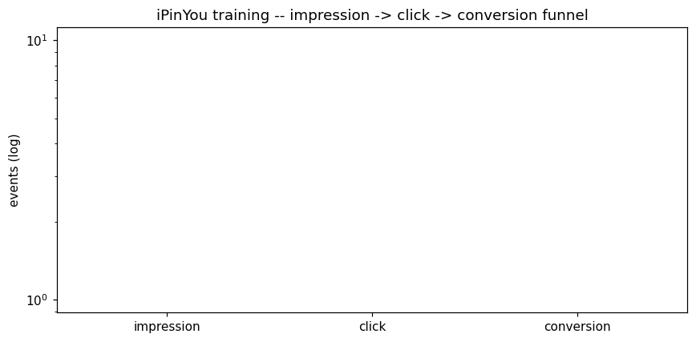
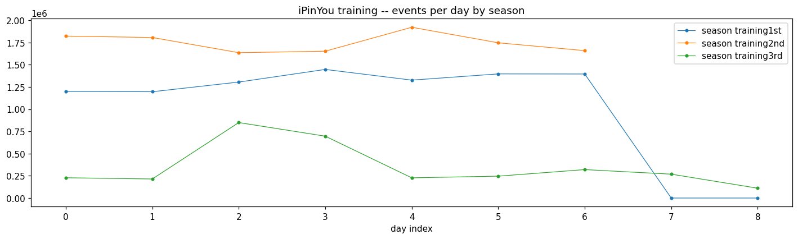
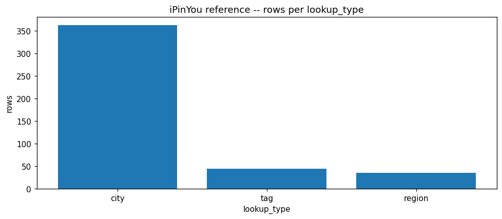
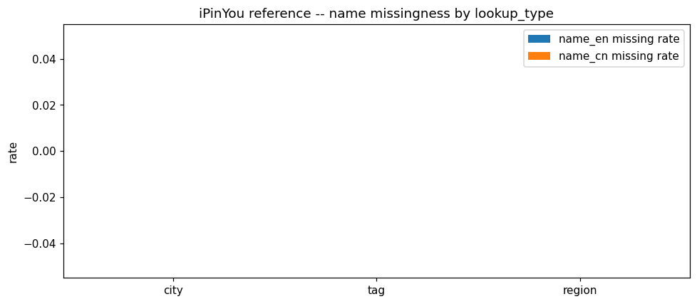
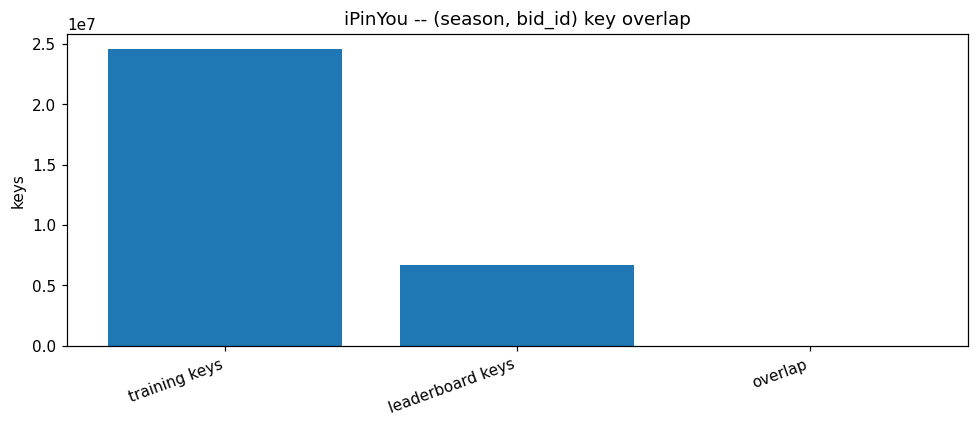
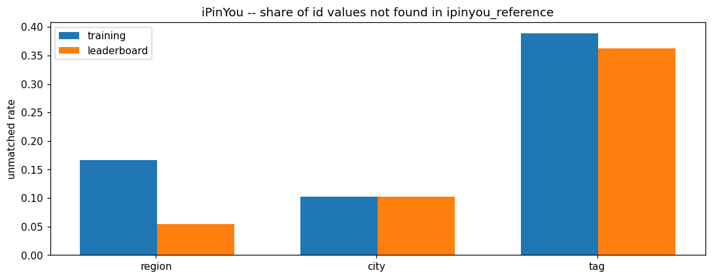

# IPINYOU EDA PROFILE

_Auto-generated by the Phase 3 EDA notebooks (`databricks/eda/ipinyou/`). One `## ` section per notebook; re-running a notebook replaces its own section, other sections are preserved._

<!-- BEGIN ipinyou:01_training_leaderboard -->
## Training & leaderboard tables (ipinyou_training, ipinyou_leaderboard)

### Profile

**training** -- rows: 24679401, columns: ['season', 'event_type', 'bid_id', 'timestamp', 'log_type', 'ipinyou_id', 'user_agent', 'ip', 'region', 'city', 'ad_exchange', 'domain', 'url', 'anonymous_url_id', 'ad_slot_id', 'ad_slot_width', 'ad_slot_height', 'ad_slot_visibility', 'ad_slot_format', 'ad_slot_floor_price', 'creative_id', 'bidding_price', 'paying_price', 'keypage_url', 'advertiser_id', 'user_tags']
- constant columns: none
- columns >5% missing: {'domain': 0.0685, 'anonymous_url_id': 1.0, 'keypage_url': 0.1281, 'advertiser_id': 0.3756, 'user_tags': 0.504}

**leaderboard** -- rows: 6695102, columns: ['season', 'bid_id', 'timestamp', 'log_type', 'ipinyou_id', 'user_agent', 'ip', 'region', 'city', 'ad_exchange', 'domain', 'url', 'anonymous_url_id', 'ad_slot_id', 'ad_slot_width', 'ad_slot_height', 'ad_slot_visibility', 'ad_slot_format', 'ad_slot_floor_price', 'creative_id', 'bidding_price', 'paying_price', 'keypage_url', 'advertiser_id', 'user_tags', 'related_clicks_count', 'has_conversion']
- constant columns: ['log_type', 'anonymous_url_id']
- columns >5% missing: {'domain': 0.0684, 'anonymous_url_id': 1.0, 'keypage_url': 0.2359, 'advertiser_id': 0.3875, 'user_tags': 0.5555}

### Data Quality

**training** duplicate key: distinct=24615633, unique=False, dup groups=59483, identical=179, conflicting=59304.
- price consistency: paying>bidding=191091, floor>paying=116370, floor>bidding=0.

**leaderboard** duplicate key: distinct=6685884, unique=False, dup groups=8314, identical=308, conflicting=8006.
- price consistency: paying>bidding=71451, floor>paying=30445, floor>bidding=0.

### Temporal

- training season training1st: 9 distinct days, 20130311..20130321
- training season training2nd: 7 distinct days, 20130606..20130612
- training season training3rd: 9 distinct days, 20131019..20131027
- leaderboard season testing1st: 3 distinct days, 20130318..20130320
- leaderboard season testing2nd: 3 distinct days, 20130613..20130615
- leaderboard season testing3rd: 7 distinct days, 20131022..20131028

### Entities / Keys

**training** approx distinct: {'bid_id': 25077148, 'ipinyou_id': 20198496, 'advertiser_id': 12, 'creative_id': 176, 'region': 42, 'city': 373, 'ad_exchange': 14, 'domain': 65913}
**leaderboard** approx distinct: {'bid_id': 6338121, 'ipinyou_id': 5971643, 'advertiser_id': 10, 'creative_id': 151, 'region': 37, 'city': 373, 'ad_exchange': 10, 'domain': 44660}

Concentration (top-N share of rows):
- training.ipinyou_id: approx_distinct=20198496, top10=0.0000, top50=0.0001, max_one_entity=139
- training.advertiser_id: approx_distinct=12, top10=1.0000, top50=1.0000, max_one_entity=9270419
- leaderboard.ipinyou_id: approx_distinct=5971643, top10=0.0000, top50=0.0001, max_one_entity=34
- leaderboard.advertiser_id: approx_distinct=10, top10=1.0000, top50=1.0000, max_one_entity=2594386

### Distributions

Per-table price stats (min / max / avg / p50-95-99):
- training.bidding_price: 227.0 / 11908.0 / 282.80496825732945 / [300.0, 300.0, 300.0]
- training.paying_price: 0.0 / 300.0 / 78.52425417456445 / [63.0, 215.0, 272.0]
- training.ad_slot_floor_price: 0.0 / 300.0 / 22.055826688148013 / [5.0, 80.0, 162.0]
- leaderboard.bidding_price: 227.0 / 12987.0 / 284.7030353985698 / [300.0, 300.0, 300.0]
- leaderboard.paying_price: 0.0 / 300.0 / 84.70531457175709 / [70.0, 236.0, 281.0]
- leaderboard.ad_slot_floor_price: 0.0 / 299.0 / 21.413705185328794 / [5.0, 70.0, 162.0]

### Relationships

Training funnel: impression=0, click=0, conversion=0.
Leaderboard labels: {'has_conversion': [('0', 6694772), ('1', 330)], 'related_clicks_count': [('0', 6690160), ('1', 4690), ('12', 1), ('2', 189), ('3', 35), ('4', 9), ('5', 7), ('6', 5), ('7', 3), ('8', 1), (None, 2)]}.
Per-season comparison (rows / advertisers / users / funnel): see season_cmp cell.
- training season training1st: rows=9270416, advertisers=1, users=6819956
- training season training2nd: rows=12247559, advertisers=7, users=10393322
- training season training3rd: rows=3161426, advertisers=4, users=2695865
- leaderboard season testing1st: rows=2594386, advertisers=1, users=2090105
- leaderboard season testing2nd: rows=2521630, advertisers=5, users=2376014
- leaderboard season testing3rd: rows=1579086, advertisers=4, users=1463950

### EDA Findings

- Constant columns per table: {'leaderboard': ['log_type', 'anonymous_url_id']}.
- training: 59304 candidate-key groups have conflicting rows.
- training: price ordering violations (paying>bidding=191091, floor>paying=116370).
- leaderboard: 8006 candidate-key groups have conflicting rows.
- leaderboard: price ordering violations (paying>bidding=71451, floor>paying=30445).

### Silver Implications

- Drop constant columns {'leaderboard': ['log_type', 'anonymous_url_id']}.
- training: de-duplicate the candidate key with a deterministic rule.
- leaderboard: de-duplicate the candidate key with a deterministic rule.
- Parse timestamp (YYYYMMDDHHMMSSmmm) into a proper event timestamp in Silver.
- Silver grain: one row per RTB event; keep season as a partition/attribute.
- Add price-ordering validity flags (floor<=paying<=bidding).

### Figure -- iPinYou training impression -> click -> conversion funnel

### Figure -- iPinYou training -- events per day by season

<!-- END ipinyou:01_training_leaderboard -->

<!-- BEGIN ipinyou:02_reference -->
## Reference lookup table (ipinyou_reference)

### Profile

| column | missing | rate | approx_distinct |
|---|---|---|---|
| lookup_type | 0 | 0.0000 | 3 |
| lookup_id | 0 | 0.0000 | 444 |
| name_en | 0 | 0.0000 | 430 |
| name_cn | 0 | 0.0000 | 469 |

Rows: 441. Merged lookup discriminated by `lookup_type`. Constant columns: none. Extra columns beyond (lookup_type, lookup_id, name_en, name_cn): none.

### Data Quality

Full-row duplicates: 0.

Per lookup_type -- lookup_id uniqueness and contiguity:

| lookup_type | n | min id | max id | duplicate ids | gaps in range |
|---|---|---|---|---|---|
| city | 362 | 0 | 392 | 0 | 31 |
| tag | 44 | 10006 | 16751 | 0 | 6702 |
| region | 35 | 0 | 395 | 0 | 361 |

### Entities / Keys

Rows per lookup_type:

| lookup_type | rows |
|---|---|
| city | 362 |
| tag | 44 |
| region | 35 |

### Coverage

Name completeness per lookup_type:

| lookup_type | name_en missing | name_cn missing | rows |
|---|---|---|---|
| city | 0 | 0 | 362 |
| tag | 0 | 0 | 44 |
| region | 0 | 0 | 35 |

Rows with both names present: 441 / 441.

### EDA Findings

- lookup_id ranges are non-contiguous (gaps) for: {'city': 31, 'tag': 6702, 'region': 361}.

### Silver Implications

- Split the merged lookup into one dimension per lookup_type (city, region, user_profile_tag) keyed on lookup_id.

### Figure -- iPinYou reference -- rows per lookup_type

### Figure -- iPinYou reference -- name missingness by lookup_type

<!-- END ipinyou:02_reference -->

<!-- BEGIN ipinyou:03_relationships_and_findings -->
## Cross-table relationships (training, leaderboard, reference)

### Entities / Keys

Schema delta: training-only columns = ['event_type']; leaderboard-only columns = ['has_conversion', 'related_clicks_count']; shared columns = 25.
Seasons: {'training': ['training1st', 'training2nd', 'training3rd'], 'leaderboard': ['testing1st', 'testing2nd', 'testing3rd']}.
Reference id sets: {'region': 35, 'city': 362, 'tag': 44}.

### Relationships

(season, bid_id) keys: training=24596221, leaderboard=6685884, inner overlap=0.
Advertiser overlap: training=12, leaderboard=10, shared=9.

Referential integrity vs ipinyou_reference (distinct id values):

| fact | dim | used | unmatched |
|---|---|---|---|
| training | region | 42 | 7 |
| training | city | 372 | 38 |
| training | tag | 72 | 28 |
| leaderboard | region | 37 | 2 |
| leaderboard | city | 372 | 38 |
| leaderboard | tag | 69 | 25 |

Row-level FK match rate:

- training: rows=24679401, region_match_rate=1.0, city_match_rate=0.8062
- leaderboard: rows=6695102, region_match_rate=1.0, city_match_rate=0.7993

### EDA Findings

- training and leaderboard (season, bid_id) keys do not overlap at all.
- training.region: 7 id values are absent from ipinyou_reference.
- training.city: 38 id values are absent from ipinyou_reference.
- training.tag: 28 id values are absent from ipinyou_reference.
- leaderboard.region: 2 id values are absent from ipinyou_reference.
- leaderboard.city: 38 id values are absent from ipinyou_reference.
- leaderboard.tag: 25 id values are absent from ipinyou_reference.
- training: not all rows resolve to a reference region/city (region 1.0, city 0.8062).
- leaderboard: not all rows resolve to a reference region/city (region 1.0, city 0.7993).

Training and leaderboard share 20+ columns and the same event grain but carry different label columns (event_type vs has_conversion / related_clicks_count) and have near-zero (season, bid_id) key overlap -> model as two separate facts sharing conformed dimensions, not a union.

### Silver Implications

- Load training and leaderboard as separate fact tables sharing conformed dimensions.
- Build region/city/tag dimensions from ipinyou_reference; keep an 'unknown' member.
- Left-join facts to dimensions and route unmatched ids to the 'unknown' member rather than dropping rows.

### Figure -- iPinYou -- (season, bid_id) key overlap

### Figure -- iPinYou -- share of id values not found in ipinyou_reference

<!-- END ipinyou:03_relationships_and_findings -->
