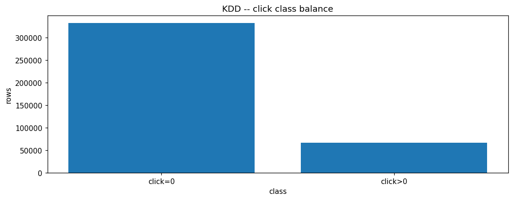
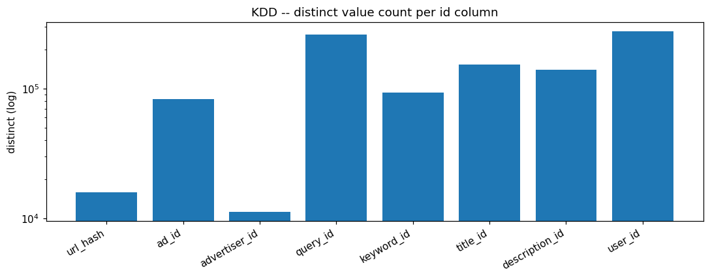

# KDDCUP2012 EDA PROFILE

_Auto-generated by the Phase 3 EDA notebooks (`databricks/eda/kddcup2012/`). One `## ` section per notebook; re-running a notebook replaces its own section, other sections are preserved._

<!-- BEGIN kddcup2012:01_click_prediction -->
## KDD Cup 2012 click prediction (kddcup2012_click_prediction)

### Profile

| column | missing | rate | approx_distinct |
|---|---|---|---|
| click | 0 | 0.0000 | 2 |
| impression | 0 | 0.0000 | 316 |
| url_hash | 0 | 0.0000 | 15870 |
| ad_id | 0 | 0.0000 | 82684 |
| advertiser_id | 0 | 0.0000 | 11225 |
| depth | 0 | 0.0000 | 3 |
| position | 0 | 0.0000 | 3 |
| query_id | 0 | 0.0000 | 260169 |
| keyword_id | 0 | 0.0000 | 92808 |
| title_id | 0 | 0.0000 | 153596 |
| description_id | 0 | 0.0000 | 139384 |
| user_id | 0 | 0.0000 | 276321 |

Rows: 399482. Columns: ['click', 'impression', 'url_hash', 'ad_id', 'advertiser_id', 'depth', 'position', 'query_id', 'keyword_id', 'title_id', 'description_id', 'user_id']. Constant columns: none. No timestamp column exists in this dataset.

### Data Quality

Exact full-row duplicates: 2075.
Invalid click>impression rows: 0.
Invalid position>depth rows: 0.
Context keys (all cols except click/impression) with >1 row: 2062, of which conflicting click labels: 0.

id value 0 = 'unknown' sentinel, row counts:

| column | zero rows | rate |
|---|---|---|
| query_id | 5547 | 0.0139 |
| keyword_id | 5539 | 0.0139 |
| title_id | 3978 | 0.0100 |
| description_id | 3978 | 0.0100 |
| user_id | 96956 | 0.2427 |

### Entities / Keys

Approx distinct per id column:

| column | approx_distinct |
|---|---|
| url_hash | 15870 |
| ad_id | 82684 |
| advertiser_id | 11225 |
| query_id | 260169 |
| keyword_id | 92808 |
| title_id | 153596 |
| description_id | 139384 |
| user_id | 276321 |

Concentration (share of all rows held by the top entities):

| entity | approx_distinct | top-10 share | top-50 share |
|---|---|---|---|
| ad_id | 82684 | 0.0466 | 0.1157 |
| advertiser_id | 11225 | 0.2693 | 0.4310 |
| query_id | 260169 | 0.0563 | 0.0939 |
| user_id | 276321 | 0.2431 | 0.2440 |

### Relationships

Entity relationship cardinalities (from approx_count_distinct of child per parent) are printed in the 'Entity relationships' cell; advertiser->ad and query->keyword/ad are 1:N, ad->advertiser is effectively 1:1.

### Distributions

Overall CTR (sum click / sum impression): 0.08935478199718706.
Class balance: positive rows (click>0) = 67089 (16.7940%), negative = 332393 (83.2060%); neg:pos imbalance = 5.0:1.

click marginal: [('0', 332393), ('1', 67089)]
impression marginal: [('1', 338348), ('10', 403), ('100', 4), ('1009', 1), ('101', 2), ('1010', 1), ('102', 2), ('1020', 1), ('103', 6), ('1031', 1), ('1038', 1), ('104', 4), ('105', 6), ('107', 4), ('108', 1), ('109', 3), ('11', 318), ('110', 7), ('111', 3), ('112', 3), ('113', 1), ('1135', 1), ('114', 5), ('115', 4), ('1159', 1), ('116', 4), ('1166', 1), ('117', 2), ('118', 2), ('11820', 1), ('119', 6), ('12', 276), ('120', 2), ('122', 1), ('123', 3), ('1233', 1), ('124', 2), ('125', 1), ('126', 3), ('127', 6), ('128', 1), ('129', 2), ('13', 215), ('130', 6), ('131', 5), ('132', 2), ('133', 1), ('134', 2), ('135', 3), ('136', 3), ('137', 2), ('138', 2), ('139', 2), ('14', 198), ('140', 1), ('1400', 1), ('143', 1), ('144', 2), ('145', 1), ('146', 4), ('147', 1), ('148', 2), ('1489', 1), ('149', 1), ('15', 176), ('150', 3), ('1504', 1), ('153', 1), ('154', 4), ('155', 1), ('156', 1), ('1562', 1), ('159', 2), ('16', 118), ('160', 3), ('161', 2), ('163', 1), ('165', 2), ('1653', 1), ('166', 1), ('167', 2), ('168', 1), ('169', 1), ('17', 144), ('170', 1), ('1702', 1), ('171', 2), ('172', 3), ('174', 2), ('175', 1), ('176', 1), ('177', 1), ('1798', 1), ('18', 120), ('180', 2), ('181', 1), ('1816', 1), ('182', 2), ('183', 2), ('184', 2), ('185', 1), ('188', 1), ('19', 117), ('190', 1), ('191', 2), ('193', 2), ('194', 2), ('195', 1), ('197', 1), ('2', 36322), ('20', 108), ('204', 2), ('205', 1), ('206', 2), ('207', 1), ('208', 1), ('209', 2), ('21', 79), ('2140', 1), ('215', 1), ('216', 3), ('217', 2), ('218', 2), ('22', 79), ('220', 1), ('221', 2), ('222', 2), ('223', 1), ('224', 2), ('225', 1), ('226', 3), ('227', 2), ('228', 3), ('23', 73), ('230', 1), ('231', 1), ('232', 1), ('234', 2), ('235', 1), ('238', 1), ('24', 61), ('240', 1), ('241', 1), ('242', 3), ('243', 1), ('244', 1), ('2474', 1), ('249', 1), ('25', 63), ('252', 2), ('26', 69), ('263', 1), ('266', 1), ('268', 2), ('27', 50), ('271', 1), ('272', 1), ('2720', 1), ('274', 1), ('278', 2), ('279', 1), ('28', 68), ('285', 1), ('2853', 1), ('286', 1), ('287', 1), ('29', 47), ('293', 1), ('294', 1), ('2974', 1), ('299', 1), ('3', 10163), ('30', 45), ('307', 1), ('309', 1), ('31', 45), ('310', 1), ('313', 1), ('315', 1), ('32', 37), ('322', 2), ('325', 1), ('326', 1), ('329', 1), ('33', 27), ('330', 2), ('331', 1), ('332', 2), ('335', 1), ('338', 1), ('339', 1), ('34', 31), ('340', 1), ('343', 1), ('344', 1), ('345', 1), ('347', 1), ('3494', 1), ('35', 32), ('350', 1), ('354', 1), ('356', 1), ('357', 1), ('36', 26), ('361', 3), ('37', 22), ('38', 20), ('384', 1), ('387', 1), ('389', 1), ('39', 24), ('4', 4427), ('40', 25), ('404', 1), ('405', 1), ('41', 24), ('412', 1), ('419', 1), ('42', 16), ('4218', 1), ('422', 1), ('423', 1), ('429', 1), ('43', 22), ('430', 1), ('434', 1), ('438', 1), ('44', 23), ('440', 1), ('4484', 1), ('45', 14), ('450', 1), ('4538', 1), ('458', 1), ('46', 13), ('460', 1), ('47', 18), ('474', 1), ('477', 1), ('48', 18), ('480', 1), ('482', 1), ('487', 1), ('49', 14), ('490', 1), ('497', 1), ('5', 2385), ('50', 11), ('501', 1), ('51', 16), ('52', 12), ('53', 17), ('54', 21), ('5467', 1), ('549', 1), ('55', 8), ('555', 1), ('56', 18), ('5674', 1), ('568', 1), ('57', 16), ('579', 1), ('58', 12), ('584', 1), ('59', 10), ('6', 1592), ('60', 10), ('600', 1), ('602', 1), ('61', 12), ('62', 13), ('625', 1), ('63', 12), ('635', 1), ('64', 11), ('65', 12), ('656', 1), ('657', 1), ('66', 11), ('67', 3), ('673', 1), ('679', 1), ('68', 7), ('689', 1), ('69', 7), ('699', 1), ('7', 983), ('70', 7), ('71', 9), ('72', 4), ('726', 1), ('73', 2), ('74', 8), ('747', 1), ('75', 3), ('76', 6), ('77', 9), ('777', 1), ('78', 4), ('79', 5), ('8', 712), ('80', 6), ('805', 1), ('81', 11), ('82', 10), ('83', 2), ('84', 7), ('85', 7), ('86', 5), ('862', 1), ('87', 7), ('877', 1), ('88', 4), ('89', 10), ('894', 1), ('9', 515), ('90', 3), ('91', 3), ('92', 2), ('93', 3), ('94', 3), ('95', 2), ('96', 3), ('97', 1), ('9705', 1), ('98', 7), ('99', 4)]
depth marginal: [('1', 111753), ('2', 194337), ('3', 93392)]
position marginal: [('1', 244910), ('2', 124182), ('3', 30390)]
CTR by depth: [('1', 0.1765), ('2', 0.1866), ('3', 0.119)]
CTR by position: [('1', 0.2028), ('2', 0.1238), ('3', 0.0676)]

### EDA Findings

- 2075 exact duplicate rows.
- Material 'unknown' (id=0) rates: {'query_id': 0.0139, 'keyword_id': 0.0139, 'user_id': 0.2427}.
- Strong class imbalance (5.0:1 negative:positive).
- CTR declines with position and varies with depth (position/depth are useful features).

### Silver Implications

- Apply distinct on load to remove exact duplicate rows.
- Treat id value 0 as NULL/unknown for query_id, keyword_id, title_id, description_id, user_id.
- Silver grain: one row per ad impression event (context + click + impression).

### Figure -- KDD -- click class balance

### Figure -- KDD -- share of rows with id value 0 (unknown)

### Figure -- KDD -- CTR by depth

### Figure -- KDD -- CTR by position

### Figure -- KDD -- distinct value count per id column

<!-- END kddcup2012:01_click_prediction -->
