# MASTR EDA PROFILE

_Auto-generated by the EDA notebooks (`databricks/eda/mastr/`). One `## ` section per notebook; re-running a notebook replaces its own section, other sections are preserved._

<!-- BEGIN mastr:01_generation_units -->
## Generation units (einheiten_wind ... einheiten_geothermie_gsgk)

### Profile

| table | rows | cols | constant columns |
|---|---|---|---|
| einheiten_wind | 45627 | 75 | - |
| einheiten_biomasse | 24542 | 58 | EinheitSystemstatus, NichtVorhandenInMigriertenEinheiten, Energietraeger, NetzreserveZugeordnet, KapazitaetsreserveZugeordnet |
| einheiten_wasser | 8835 | 60 | EinheitSystemstatus, NichtVorhandenInMigriertenEinheiten, Energietraeger, NetzreserveZugeordnet, KapazitaetsreserveZugeordnet, InbetriebnahmedatumAmAktuellenStandort |
| einheiten_verbrennung | 94050 | 71 | EinheitSystemstatus, NichtVorhandenInMigriertenEinheiten |
| einheiten_kernkraft | 6 | 45 | LokationMaStRNummer, NetzbetreiberpruefungStatus, AnlagenbetreiberMastrNummer, Land, EinheitSystemstatus, EinheitBetriebsstatus, NichtVorhandenInMigriertenEinheiten, AltAnlagenbetreiberMastrNummer, DatumDesBetreiberwechsels, DatumRegistrierungDesBetreiberwechsels, Weic_nv, Kraftwerksnummer_nv, Energietraeger, Einspeisungsart, Technologie, FernsteuerbarkeitNb, AnschlussAnHoechstOderHochSpannung, GenMastrNummer |
| einheiten_geothermie_gsgk | 344 | 50 | Land, EinheitSystemstatus, NichtVorhandenInMigriertenEinheiten, Kraftwerksnummer_nv, NetzreserveZugeordnet, KapazitaetsreserveZugeordnet, DatumBeginnVoruebergehendeStilllegung |

### Data Quality

Full-row exact duplicates per table:
- einheiten_wind: 1
- einheiten_biomasse: 91
- einheiten_wasser: 0
- einheiten_verbrennung: 7
- einheiten_kernkraft: 0
- einheiten_geothermie_gsgk: 4

### Entities / Keys

MastrNummer-suffixed key column cardinality (column, approx_distinct, ratio-to-rows):
- einheiten_wind: [('EinheitMastrNummer', 43071, 0.944), ('LokationMaStRNummer', 11414, 0.2502), ('AnlagenbetreiberMastrNummer', 12841, 0.2814), ('GenMastrNummer', 19398, 0.4251), ('EegMaStRNummer', 41267, 0.9044), ('AltAnlagenbetreiberMastrNummer', 2201, 0.0482)]
- einheiten_biomasse: [('EinheitMastrNummer', 25158, 1.0251), ('LokationMaStRNummer', 16321, 0.665), ('AnlagenbetreiberMastrNummer', 10935, 0.4456), ('GenMastrNummer', 11283, 0.4597), ('EegMaStRNummer', 15301, 0.6235), ('KwkMaStRNummer', 12823, 0.5225), ('AltAnlagenbetreiberMastrNummer', 1268, 0.0517)]
- einheiten_wasser: [('EinheitMastrNummer', 8521, 0.9645), ('LokationMaStRNummer', 7564, 0.8561), ('AnlagenbetreiberMastrNummer', 5676, 0.6424), ('EegMaStRNummer', 7541, 0.8535), ('AltAnlagenbetreiberMastrNummer', 571, 0.0646), ('GenMastrNummer', 1089, 0.1233)]
- einheiten_verbrennung: [('EinheitMastrNummer', 95922, 1.0199), ('LokationMaStRNummer', 80346, 0.8543), ('AnlagenbetreiberMastrNummer', 54303, 0.5774), ('KwkMaStRNummer', 52192, 0.5549), ('GenMastrNummer', 2597, 0.0276), ('AltAnlagenbetreiberMastrNummer', 2970, 0.0316)]
- einheiten_kernkraft: [('EinheitMastrNummer', 6, 1.0), ('LokationMaStRNummer', 1, 0.1667), ('AnlagenbetreiberMastrNummer', 1, 0.1667), ('AltAnlagenbetreiberMastrNummer', 1, 0.1667), ('GenMastrNummer', 1, 0.1667)]
- einheiten_geothermie_gsgk: [('EinheitMastrNummer', 335, 0.9738), ('LokationMaStRNummer', 210, 0.6105), ('AnlagenbetreiberMastrNummer', 145, 0.4215), ('KwkMaStRNummer', 83, 0.2413), ('GenMastrNummer', 97, 0.282), ('EegMaStRNummer', 130, 0.3779), ('AltAnlagenbetreiberMastrNummer', 5, 0.0145)]

### Distributions

- einheiten_wind.`NetzbetreiberpruefungStatus`: - 2954: 32390
- 2955: 11067
- None: 1224
- 0: 850
- 77.000: 30
- 62.000: 15
- 52.000: 9
- 150.000: 7
- 120.000: 6
- 82.000: 6
- 175.000: 5
- 126.000: 2
- 80.000: 2
- 1: 2
- 162.000: 2
- ... (10 more)
- einheiten_wind.`Hausnummer_nv`: - 0: 38220
- None: 4688
- 1: 1887
- 2497: 821
- 691: 2
- EEG985772706407: 1
- EEG993025136109: 1
- EEG952307848994: 1
- EnVentus Vestas V-162 6.2: 1
- WEA 03: 1
- EEG955497892563: 1
- Windpark Schwanebeck GmbH ＆ Co. 9. Betriebs KG: 1
- EEG923887502026: 1
- EEG987323322401: 1
- einheiten_wind.`EinheitBetriebsstatus`: - 35: 30539
- 31: 7868
- None: 3409
- 38: 2845
- 888: 821
- 37: 76
- ABR932107894063: 20
- ABR993625089973: 7
- ABR956373721786: 4
- 1: 4
- ABR913534812233: 2
- WP Sundern-Allendorf: 2
- 688: 2
- NF Neuenfeld: 2
- SGE966890714598: 1
- ... (25 more)
- einheiten_wind.`FernsteuerbarkeitNb`: - 1: 29547
- None: 14841
- 0: 1235
- 125.000: 1
- 126.000: 1
- 2000.000: 1
- 163.000: 1
- einheiten_wind.`FernsteuerbarkeitDv`: - 1: 36042
- None: 7505
- 0: 2079
- 112.000: 1
- einheiten_wind.`Einspeisungsart`: - 688: 38470
- None: 4247
- 689: 2410
- 1: 437
- 0: 63
- einheiten_wind.`WindAnLandOderAufSee`: - 888: 39419
- None: 3803
- 889: 1909
- 1: 267
- 0: 228
- WR Stetten: 1
- einheiten_wind.`Technologie`: - 691: 40844
- None: 4064
- 692: 481
- 0: 205
- 1: 28
- 3102: 3
- 1660: 1
- 2025-09-12: 1
- einheiten_wind.`Rotorblattenteisungssystem`: - 0: 28886
- None: 12986
- 1: 3752
- 80.000: 1
- EEG969039569837: 1
- EEG992916306843: 1
- einheiten_wind.`AuflageAbschaltungLeistungsbegrenzung`: - 1: 23049
- 0: 16182
- None: 6347
- 0.0347000: 6
- 0.1632000: 6
- 0.5000000: 5
- 0.1816200: 5
- 0.0260000: 4
- 0.0510710: 4
- 0.0572560: 3
- 0.0500000: 3
- 2.7585720: 2
- 0.1899000: 2
- 0.2085500: 2
- 0.2420000: 2
- ... (5 more)
- einheiten_wind.`AuflagenAbschaltungSchallimmissionsschutzNachts`: - None: 27061
- 1: 10104
- 0: 8412
- 3187: 37
- 3200: 4
- 3194: 2
- 3247: 2
- 3246: 2
- 0.2100000: 1
- 0.2308000: 1
- 3245: 1
- einheiten_wind.`AuflagenAbschaltungSchallimmissionsschutzTagsueber`: - None: 27287
- 0: 16775
- 1: 1515
- 3220: 48
- 3187: 2
- einheiten_wind.`AuflagenAbschaltungSchattenwurf`: - None: 26997
- 1: 14692
- 0: 3750
- 2027-03-31: 13
- 2027-10-01: 13
- 2027-02-05: 12
- 2026-12-31: 12
- 2027-07-01: 9
- 2028-07-01: 8
- 2028-08-15: 7
- 2027-11-15: 7
- 2026-08-01: 7
- 2028-05-01: 7
- 2028-03-15: 7
- 2029-04-15: 6
- ... (35 more)
- einheiten_wind.`AuflagenAbschaltungTierschutz`: - None: 27138
- 1: 13572
- 0: 4913
- 2029-01-15: 2
- 2022-06-01: 1
- 2027-02-15: 1
- einheiten_wind.`Buergerenergie`: - None: 36302
- 0: 9052
- 1: 209
- 2025-09-23: 10
- 2024-09-30: 9
- 2024-01-29: 3
- 2023-05-10: 2
- 2026-02-13: 2
- 2024-09-09: 2
- 2025-05-05: 2
- 2023-12-13: 2
- 2023-02-21: 1
- 2021-10-28: 1
- 2021-11-09: 1
- 2022-03-24: 1
- ... (28 more)
- einheiten_wind.`AnschlussAnHoechstOderHochSpannung`: - None: 36410
- 0: 5936
- 1: 3278
- EEG967875784902: 1
- 2020-10-01: 1
- 2022-02-08: 1
- einheiten_wind.`UeberwiegendeNutzungsartDerFlaecheVorErrichtung`: - None: 43748
- 3187: 1365
- 3188: 205
- 3247: 149
- 3246: 111
- 3194: 24
- 3200: 10
- 3245: 8
- 3202: 3
- 3191: 2
- 3206: 2
- einheiten_wind.`VorherigerNutzungsartenbereichDerFlaeche`: - None: 43748
- 3220: 1874
- 3221: 5
- einheiten_wind.`Weic`: - None: 44251
- 11W0-0000-0731-A: 83
- 11WD2OGTI000264J: 80
- 11WD2OBA1000349Z: 80
- 11WD8BALT3W----6: 80
- 11WD2OBUT0002657: 79
- 11WD2OBR1000278R: 78
- 11WD2OAMK000342L: 78
- 11W0-0000-0026-Y: 70
- 11WD2OWVM000355S: 67
- 11W0-0000-0095-9: 66
- 11W0-0000-0152-T: 59
- 11W0-0000-0130-6: 56
- 11WD2OGW1000346F: 55
- 11W0-0000-0029-P: 54
- ... (25 more)
- einheiten_wind.`WeicDisplayName`: - None: 44420
- OWP_GLOBAL_TECH_: 80
- OWP-BU: 79
- BALTICERZ: 79
- OWP-BO1: 78
- OBR1: 78
- AMRWE_KW: 77
- WIK_PROD: 70
- VEJA MATE: 67
- MERKUR: 66
- AWE: 58
- BKR02: 56
- GOW1: 55
- N1_PU: 53
- BALTICEAGLE: 50
- ... (24 more)
- einheiten_wind.`Seelage`: - None: 43718
- 640: 1580
- 639: 329
- einheiten_wind.`GebietNachDemFlaechenentwicklungsplanNordsee`: - None: 44047
- 1547: 284
- 1548: 278
- 1549: 246
- 1550: 233
- 1551: 178
- 1553: 167
- 1546: 83
- 1552: 63
- 2963: 48
- einheiten_wind.`GebietNachDemFlaechenentwicklungsplanOstsee`: - None: 45298
- 1540: 151
- 1542: 101
- 1541: 50
- 1543: 27
- einheiten_wind.`DatumWiederaufnahmeBetrieb`: - None: 45605
- 2025-12-30: 2
- 2020-06-17: 1
- 2022-12-01: 1
- 2024-03-12: 1
- 2024-02-22: 1
- 2023-09-13: 1
- 2024-02-06: 1
- 2022-12-21: 1
- 2024-04-26: 1
- 2025-08-28: 1
- 2021-07-01: 1
- 2024-12-05: 1
- 2025-11-13: 1
- 2024-01-01: 1
- ... (7 more)
- einheiten_wind.`Einsatzverantwortlicher`: - None: 45468
- 9979739000006: 106
- 4041404000032: 51
- 9911844000000: 2
- einheiten_biomasse.`NetzbetreiberpruefungStatus`: - 2954: 21381
- 2955: 2953
- None: 192
- 2023-02-21: 3
- 2023-08-02: 2
- 98": 1
- 2026-04-27: 1
- 2021-07-01: 1
- 2021-09-28: 1
-  98/7: 1
-  11/11": 1
-  126/1: 1
- 2021-12-20: 1
- 2023-03-27: 1
- 2023-07-24: 1
- ... (1 more)
- einheiten_biomasse.`Land`: - 84: 24334
- None: 202
- 0: 6
- einheiten_biomasse.`Bundesland`: - 1403: 7400
- 1408: 4756
- 1402: 2815
- 1409: 2696
- 1411: 1573
- 1407: 834
- 1400: 812
- 1405: 778
- 1414: 726
- 1413: 702
- 1410: 545
- 1415: 528
- None: 208
- 1401: 53
- 1406: 52
- ... (2 more)
- einheiten_biomasse.`StrasseNichtGefunden`: - 0: 21945
- 1: 1328
- None: 1269
- einheiten_biomasse.`Hausnummer_nv`: - 0: 22052
- None: 1269
- 1: 1221
- einheiten_biomasse.`HausnummerNichtGefunden`: - 0: 21011
- 1: 2262
- None: 1269
- einheiten_biomasse.`EinheitBetriebsstatus`: - 35: 21667
- 38: 1827
- 31: 490
- 37: 350
- None: 208
- einheiten_biomasse.`Weic_nv`: - 0: 12853
- 1: 11481
- None: 208
- einheiten_biomasse.`Kraftwerksnummer_nv`: - 0: 24325
- None: 208
- 1: 9
- einheiten_biomasse.`FernsteuerbarkeitNb`: - 1: 19461
- 0: 3122
- None: 1959
- einheiten_biomasse.`FernsteuerbarkeitDv`: - 1: 16750
- None: 4345
- 0: 3447
- einheiten_biomasse.`Einspeisungsart`: - 688: 16976
- 689: 7224
- None: 342
- einheiten_biomasse.`Hauptbrennstoff`: - 2445: 19739
- 2446: 1435
- 2448: 1103
- 2442: 625
- 2421: 491
- 2447: 244
- None: 212
- 3032: 106
- 2436: 104
- 2424: 97
- 2415: 93
- 2425: 92
- 2419: 65
- 2437: 35
- 3034: 33
- ... (6 more)
- einheiten_biomasse.`Biomasseart`: - 721: 22627
- 720: 939
- 719: 768
- None: 208
- einheiten_biomasse.`Technologie`: - 542: 23148
- 546: 292
- 840: 264
- None: 210
- 835: 139
- 545: 135
- 836: 121
- 838: 96
- 833: 43
- 544: 38
- 834: 21
- 839: 16
- 543: 15
- 837: 4
- einheiten_biomasse.`AnschlussAnHoechstOderHochSpannung`: - None: 23802
- 0: 686
- 1: 54
- einheiten_biomasse.`Weic`: - None: 24477
- 11W0-0000-0185-8: 39
- 11W0-0000-0404-S: 3
- 11W0-0000-0280-I: 2
- 11W0-0000-0119-O: 2
- 11W0-0000-0012-D: 2
- 11W0-0000-0085-D: 1
- 11W0-0000-0199-T: 1
- 11W0-0000-0198-W: 1
- 11WD7ELLE7X-T4-B: 1
- 11WD2EMDE000269D: 1
- 11W0-0000-0128-N: 1
- 11W0-0000-0380-D: 1
- 11W0-0000-0879-2: 1
- 11WD8MALC5R--P-X: 1
- ... (8 more)
- einheiten_biomasse.`WeicDisplayName`: - None: 24475
- GENO_BEP_KLARSEE: 39
- A9512789019216: 4
- COFA_BHKW: 3
- MVB: 2
- EGGER_BRI: 2
- Mercer: 2
- E_6KW+3Y: 1
- GSH: 1
- Turbine1: 1
- EWM4: 1
- ENERGIEANLAGE_3: 1
- B01: 1
- BMHKW_PIESTERITS: 1
- DTS1: 1
- ... (7 more)
- einheiten_biomasse.`Kraftwerksnummer`: - None: 24506
- BNA0156a: 2
- BNA0027: 2
- BNA0223b: 1
- BNA0012a: 1
- BNA0097: 1
- BNA0636: 1
- BNA0242: 1
- BNA0500: 1
- BNA0399: 1
- BNA0106: 1
- BNA0692: 1
- BNA0062: 1
- BNA0244: 1
- BNA0408: 1
- ... (20 more)
- einheiten_biomasse.`InbetriebnahmedatumAmAktuellenStandort`: - None: 24526
- 2005-12-22T00:00:00: 2
- 2025-10-07T00:00:00: 1
- 2025-12-30T00:00:00: 1
- 2026-01-26T00:00:00: 1
- 2026-01-20T00:00:00: 1
- 2025-12-09T00:00:00: 1
- 2026-07-13T00:00:00: 1
- 2005-11-24T00:00:00: 1
- 2014-07-03T00:00:00: 1
- 2026-01-01T00:00:00: 1
- 2025-01-01T00:00:00: 1
- 2025-12-15T00:00:00: 1
- 2010-12-03T00:00:00: 1
- 2026-07-21T00:00:00: 1
- ... (1 more)
- einheiten_biomasse.`Einsatzverantwortlicher`: - None: 24511
- 9911568000005: 3
- 9979393000004: 2
- 9979212000002: 2
- 9911818000002: 2
- 9979261000003: 2
- 9979190000009: 1
- 9979343000004: 1
- 9907466000007: 1
- 9911883000003: 1
- 9979197000002: 1
- 9979427000003: 1
- 9900012345678: 1
- 9979618000002: 1
- 9911957000004: 1
- ... (11 more)
- einheiten_wasser.`NetzbetreiberpruefungStatus`: - 2954: 7843
- 2955: 971
- 0: 12
- None: 9
- einheiten_wasser.`Land`: - 84: 8784
- None: 19
- 206: 15
- 231: 15
- 52.804052: 1
- ABR970542182628: 1
- einheiten_wasser.`Bundesland`: - 1403: 4299
- 1402: 1971
- 1409: 535
- 1405: 511
- 1413: 457
- 1408: 283
- 1410: 275
- 1415: 248
- 1414: 82
- None: 50
- 1400: 40
- 1412: 32
- 1411: 25
- 1407: 23
- 1404: 2
- ... (2 more)
- einheiten_wasser.`EinheitBetriebsstatus`: - 35: 8594
- 38: 140
- 37: 51
- 31: 29
- None: 21
- einheiten_wasser.`Weic_nv`: - 0: 7760
- 1: 1054
- None: 21
- einheiten_wasser.`Kraftwerksnummer_nv`: - 0: 8807
- None: 21
- 1: 7
- einheiten_wasser.`FernsteuerbarkeitNb`: - 0: 5726
- 1: 2924
- None: 185
- einheiten_wasser.`Einspeisungsart`: - 689: 4542
- 688: 4217
- None: 76
- einheiten_wasser.`ArtDerWasserkraftanlage`: - 890: 7923
- 894: 372
- 891: 309
- 895: 164
- 896: 43
- None: 22
- 897: 2
- einheiten_wasser.`MinderungStromerzeugung`: - 1: 4856
- 0: 3744
- None: 235
- einheiten_wasser.`ArtDesZuflusses`: - 724: 4818
- 726: 2717
- None: 1163
- 725: 137
- einheiten_wasser.`StrasseNichtGefunden`: - 0: 4289
- None: 4021
- 1: 525
- einheiten_wasser.`Hausnummer_nv`: - 0: 4312
- None: 4021
- 1: 502
- einheiten_wasser.`HausnummerNichtGefunden`: - 0: 4023
- None: 4021
- 1: 791
- einheiten_wasser.`FernsteuerbarkeitDv`: - None: 6049
- 0: 1516
- 1: 1270
- einheiten_wasser.`BestandteilGrenzkraftwerk`: - None: 6943
- 0: 1819
- 1: 73
- einheiten_wasser.`AnschlussAnHoechstOderHochSpannung`: - None: 8126
- 0: 416
- 1: 293
- einheiten_wasser.`Kraftwerksnummer`: - None: 8749
- BNA0583: 10
- BNA0540: 8
- BNA0042: 6
- BNA0364: 5
- BNA0173: 5
- BNA0494: 5
- BNA0529: 4
- BNA0784: 4
- BNA0835: 4
- BNA0854: 3
- BNA0045: 3
- BNA0259: 3
- BNA0839: 3
- BNA0859: 3
- ... (14 more)
- einheiten_wasser.`DatumWiederaufnahmeBetrieb`: - None: 8822
- 2023-04-14: 2
- 2020-12-03: 2
- 2024-11-04: 2
- 2013-03-01: 1
- 2003-11-07: 1
- 2021-08-26: 1
- 2012-03-07: 1
- 2009-12-15: 1
- 2021-07-01: 1
- 2026-07-22: 1
- einheiten_wasser.`NettonennleistungDeutschland`: - None: 8787
- 10442.000: 10
- 4500.000: 6
- 2166.000: 5
- 22900.000: 4
- 27000.000: 4
- 27940.000: 3
- 9200.000: 2
- 28150.000: 2
- 19000.000: 1
- 38850.000: 1
- 24000.000: 1
- 150.000: 1
- 260.000: 1
- 1050.000: 1
- ... (6 more)
- einheiten_wasser.`GeplantesInbetriebnahmedatum`: - None: 8806
- 2029-09-24: 3
- 2024-01-01: 2
- 2025-12-31: 1
- 2024-10-03: 1
- 2022-09-01: 1
- 2027-04-01: 1
- 2022-12-01: 1
- 2026-12-31: 1
- 2027-07-16: 1
- 2027-09-30: 1
- 2024-09-30: 1
- 2027-10-31: 1
- 2023-11-15: 1
- 2022-11-21: 1
- ... (12 more)
- einheiten_wasser.`Einsatzverantwortlicher`: - None: 8734
- 9904257000006: 32
- 4041404000032: 24
- 9911866000004: 11
- 4260016050109: 10
- 9900012345678: 5
- 4260016050079: 4
- 9904880000001: 4
- 4260016050055: 3
- 9978522000009: 3
- 9978071000005: 2
- 4041407000008: 1
- 9911844000000: 1
- 9483119943070: 1
- einheiten_wasser.`WeicDisplayName`: - None: 8738
- BNA0950: 13
- KW-WYHL: 11
- D4_KW_LFB_M1-10: 10
- D4_KW_RHF_M1-4: 4
- BNA0324: 4
- BNA0912: 4
- BNA1013: 4
- D4_SAEK_ANT_ENBW: 3
- WALCHENSEE_2: 2
- BNA0921: 2
- WALCHENSEE_1: 2
- BNA0695: 2
- WALCHENSEE_4: 2
- WALCHENSEE_3: 2
- ... (31 more)
- einheiten_verbrennung.`NetzbetreiberpruefungStatus`: - 2954: 77829
- 2955: 16198
- None: 22
-  1081": 1
- einheiten_verbrennung.`Land`: - 84: 94026
- None: 23
- 231: 1
- einheiten_verbrennung.`Bundesland`: - 1409: 17480
- 1402: 17442
- 1403: 15591
- 1408: 11123
- 1405: 7780
- 1410: 4463
- 1413: 4236
- 1411: 3595
- 1414: 2234
- 1401: 2209
- 1400: 2106
- 1415: 2072
- 1406: 1314
- 1407: 1143
- 1412: 700
- ... (2 more)
- einheiten_verbrennung.`EinheitBetriebsstatus`: - 35: 80936
- 38: 11657
- 37: 754
- 31: 680
- None: 23
- einheiten_verbrennung.`Weic_nv`: - 0: 87159
- 1: 6859
- None: 23
-  OT Sprotta-Siedlung": 1
-  Göppinger-Str. 9: 1
- 5""": 1
-  neu": 1
-  Ilmenau": 1
- alt": 1
-  Meppen": 1
-  Battaune": 1
-  31707 Heeßen""": 1
- einheiten_verbrennung.`Kraftwerksnummer_nv`: - 0: 93939
- 1: 87
- None: 23
-  Schorndorf": 1
- einheiten_verbrennung.`Energietraeger`: - 2410: 77693
- 2409: 11437
- 2411: 4009
- 2413: 481
- 2412: 175
- 2407: 101
- 2408: 82
- 3030: 39
- None: 23
- 0: 9
- 2496: 1
- einheiten_verbrennung.`FernsteuerbarkeitNb`: - 0: 74669
- 1: 9822
- None: 9550
- 5.380: 2
- 1.000: 2
- 5.100: 1
- 4.700: 1
- 5.300: 1
- 5.500: 1
- 6.000: 1
- einheiten_verbrennung.`Einspeisungsart`: - 689: 80419
- 688: 12704
- None: 918
- 0: 8
- 4.700: 1
- einheiten_verbrennung.`Hauptbrennstoff`: - 2473: 40859
- 542: 32505
- 543: 6656
- 2467: 3552
- None: 1795
- 544: 1631
- 2477: 1607
- 836: 1100
- 840: 1086
- 2466: 988
- 835: 375
- 2478: 316
- 2469: 263
- 2472: 173
- 545: 171
- ... (28 more)
- einheiten_verbrennung.`Technologie`: - 542: 36524
- None: 31836
- 0: 11704
- 543: 6696
- 544: 2852
- 836: 1485
- 840: 965
- 835: 536
- 1: 513
- 545: 267
- 838: 195
- 834: 142
- 837: 129
- 833: 128
- 839: 51
- ... (5 more)
- einheiten_verbrennung.`StrasseNichtGefunden`: - None: 69053
- 0: 24091
- 1: 905
- 542: 1
- einheiten_verbrennung.`BestandteilGrenzkraftwerk`: - None: 83089
- 0: 6137
- 2473: 1462
- 2469: 906
- 2466: 474
- 2472: 350
- 2477: 270
- 2445: 260
- 2467: 226
- 2446: 179
- 2448: 177
- 3035: 110
- 2437: 60
- 2442: 50
- 2425: 33
- ... (31 more)
- einheiten_verbrennung.`Notstromaggregat`: - None: 90948
- 0: 2525
- 1: 577
- einheiten_verbrennung.`WeitererHauptbrennstoff`: - None: 88924
- 2473: 2300
- 2469: 743
- 0: 566
- 2467: 280
- 1: 226
- 2466: 177
- 2477: 167
- 2448: 113
- 2445: 80
- 2442: 75
- 2472: 68
- 2446: 61
- 2414: 40
- 2421: 22
- ... (25 more)
- einheiten_verbrennung.`AusschliesslicheVerwendungImKombibetrieb`: - None: 93623
- 0: 344
- 1: 83
- einheiten_verbrennung.`InbetriebnahmedatumAmAktuellenStandort`: - None: 94006
- 2026-01-21T00:00:00: 2
- 2025-01-02: 2
- 2026-01-29: 2
- 2023-06-12: 2
- 2025-05-01: 1
- 2024-05-01: 1
- 2020-07-16: 1
- 2021-10-14: 1
- 2025-01-22: 1
- 2001-12-19T00:00:00: 1
- 2021-09-30: 1
- 2024-05-10: 1
- 2022-10-05: 1
- 2014-10-24: 1
- ... (26 more)
- einheiten_verbrennung.`SicherheitsbereitschaftAbDatum`: - None: 94043
- 2018-10-01: 3
- 2019-10-01: 2
- 2017-10-01: 2
- einheiten_verbrennung.`DatumKapazitaetsreserve`: - None: 94022
- 2020-10-01T00:00:00: 9
- 2016-06-17T00:00:00: 1
- 2025-08-01T00:00:00: 1
- 2026-01-29T00:00:00: 1
- 2025-12-19T00:00:00: 1
- 2025-06-26T00:00:00: 1
- 2025-10-23T00:00:00: 1
- 2025-08-07T00:00:00: 1
- 2023-09-04T00:00:00: 1
- 2021-09-07T00:00:00: 1
- 2025-06-23T00:00:00: 1
- 2026-03-05T00:00:00: 1
- 2026-03-17T00:00:00: 1
- 2025-06-11T00:00:00: 1
- ... (6 more)
- einheiten_kernkraft.`EinheitMastrNummer`: - SEE927528071629: 1
- SEE944567587799: 1
- SEE930752846949: 1
- SEE943690268513: 1
- SEE951462745445: 1
- SEE985577062814: 1
- einheiten_kernkraft.`DatumLetzteAktualisierung`: - 2022-01-11T08:43:55.9466911: 1
- 2023-04-28T04:15:24.9523204: 1
- 2022-04-05T15:55:51.4288364: 1
- 2023-07-14T07:25:22.7068328: 1
- 2022-05-11T11:26:34.4855024: 1
- 2023-04-20T14:45:36.9594176: 1
- einheiten_kernkraft.`NetzbetreiberpruefungDatum`: - 2022-01-11: 1
- 2023-04-28: 1
- 2022-04-05: 1
- 2023-07-14: 1
- 2022-05-11: 1
- 2023-04-20: 1
- einheiten_kernkraft.`Bundesland`: - 1408: 2
- 1403: 2
- 1411: 1
- 1402: 1
- einheiten_kernkraft.`Landkreis`: - Günzburg: 1
- Emsland: 1
- Hameln-Pyrmont: 1
- Landshut: 1
- Steinburg: 1
- Heilbronn: 1
- einheiten_kernkraft.`Gemeinde`: - Gundremmingen: 1
- Lingen (Ems): 1
- Emmerthal: 1
- Essenbach: 1
- Brokdorf: 1
- Neckarwestheim: 1
- einheiten_kernkraft.`Gemeindeschluessel`: - 09774136: 1
- 03454032: 1
- 03252005: 1
- 09274128: 1
- 01061018: 1
- 08125066: 1
- einheiten_kernkraft.`Postleitzahl`: - 89355: 1
- 49811: 1
- 31860: 1
- 84051: 1
- 25576: 1
- 74382: 1
- einheiten_kernkraft.`Strasse`: - Dr.-August-Weckesser-Straße: 1
- Am Hilgenberg: 1
- Kraftwerksgelände: 1
- Dammstraße: 1
- Osterende: 1
- Im Steinbruch: 1
- einheiten_kernkraft.`StrasseNichtGefunden`: - 0: 5
- 1: 1
- einheiten_kernkraft.`Hausnummer_nv`: - 1: 4
- 0: 2
- einheiten_kernkraft.`HausnummerNichtGefunden`: - 0: 5
- 1: 1
- einheiten_kernkraft.`Ort`: - Gundremmingen: 1
- Lingen: 1
- Emmerthal: 1
- Essenbach: 1
- Brokdorf: 1
- Neckarwestheim: 1
- einheiten_kernkraft.`Laengengrad`: - 10.404743: 1
- 7.324140: 1
- 9.413333: 1
- 12.293150: 1
- 9.344720: 1
- 9.176408: 1
- einheiten_kernkraft.`Breitengrad`: - 48.513566: 1
- 52.472897: 1
- 52.035200: 1
- 48.605600: 1
- 53.850830: 1
- 49.040019: 1
- einheiten_kernkraft.`Registrierungsdatum`: - 2020-06-25: 5
- 2020-06-24: 1
- einheiten_kernkraft.`Inbetriebnahmedatum`: - 1984-11-02: 1
- 1988-06-20: 1
- 1984-09-05: 1
- 1988-01-22: 1
- 1986-10-14: 1
- 1989-04-15: 1
- einheiten_kernkraft.`DatumEndgueltigeStilllegung`: - 2021-12-31: 3
- 2023-04-15: 3
- einheiten_kernkraft.`NameStromerzeugungseinheit`: - Gundremmingen C: 1
- Emsland A: 1
- Grohnde: 1
- Isar 2: 1
- Brokdorf: 1
- GKN II: 1
- einheiten_kernkraft.`Bruttoleistung`: - 1344000.000: 1
- 1406000.000: 1
- 1430000.000: 1
- 1485000.000: 1
- 1480000.000: 1
- 1400000.000: 1
- einheiten_kernkraft.`Nettonennleistung`: - 1410000.000: 2
- 1360000.000: 1
- 1336000.000: 1
- 1288000.000: 1
- 1310000.000: 1
- einheiten_kernkraft.`NameKraftwerk`: - Kernkraftwerk Gundremmingen: 1
- Kernkraftwerk Emsland: 1
- Grohnde: 1
- Isar 2: 1
- Brokdorf: 1
- Gemeinschaftskernkraftwerk Neckarwestheim II: 1
- einheiten_kernkraft.`NameKraftwerksblock`: - C: 1
- KKE: 1
- KWG: 1
- KKI 2: 1
- KBR: 1
- GKN II: 1
- einheiten_kernkraft.`Hausnummer`: - None: 4
- 1: 1
- 2: 1
- einheiten_kernkraft.`Weic`: - None: 3
- 11WD7KRBG1KD7-CC: 1
- 11WD7KKE-1K-BLAZ: 1
- 11WD4GKNK1N-GESZ: 1
- einheiten_kernkraft.`WeicDisplayName`: - None: 3
- GUND_C_RWE: 1
- KKE_A: 1
- D4_GKN2_S: 1
- einheiten_kernkraft.`Kraftwerksnummer`: - None: 4
- BNA0382: 1
- BNA0607: 1
- einheiten_geothermie_gsgk.`NetzbetreiberpruefungStatus`: - 2954: 275
- 2955: 61
- None: 8
- einheiten_geothermie_gsgk.`Bundesland`: - 1409: 130
- 1402: 49
- 1403: 43
- 1412: 29
- 1405: 21
- 1408: 18
- 1410: 14
- None: 8
- 1411: 8
- 1414: 8
- 1400: 4
- 1401: 3
- 1413: 3
- 1407: 3
- 1406: 2
- ... (1 more)
- einheiten_geothermie_gsgk.`EinheitBetriebsstatus`: - 35: 239
- 38: 91
- None: 8
- 31: 6
- einheiten_geothermie_gsgk.`Weic_nv`: - 0: 194
- 1: 142
- None: 8
- einheiten_geothermie_gsgk.`Energietraeger`: - 2406: 169
- 2405: 73
- 2957: 53
- 2403: 21
- 2958: 18
- None: 8
- 2404: 2
- einheiten_geothermie_gsgk.`FernsteuerbarkeitNb`: - 1: 171
- 0: 126
- None: 47
- einheiten_geothermie_gsgk.`Einspeisungsart`: - 688: 170
- 689: 165
- None: 9
- einheiten_geothermie_gsgk.`Technologie`: - 542: 208
- 840: 52
- 546: 19
- None: 14
- 545: 10
- 835: 8
- 834: 7
- 838: 6
- 836: 5
- 833: 5
- 544: 4
- 543: 2
- 1538: 2
- 837: 1
- 839: 1
- einheiten_geothermie_gsgk.`Gemarkung`: - None: 302
- Erdlehen: 6
- Quierschied: 5
- Kirchhellen: 4
- Bottrop: 4
- Herringen: 4
- Rossenray: 3
- Mettingen: 2
- Niedersalbach: 2
- Lerche: 2
- Klarenthal: 1
- Niederaden: 1
- Hamborn: 1
- Kamen: 1
- Litzlwalchen: 1
- ... (5 more)
- einheiten_geothermie_gsgk.`FlurFlurstuecknummern`: - None: 302
- 711: 6
- Flur 3, Flurstück 1131: 4
- Fl 45, FlSt 34
: 3
- Flur 15, Flurstück 1/292: 3
- Fl 167, FlSt 39
: 3
- Flur: 15 Flurstück: 1/292: 2
- Flur 4, Flurstück 735, 769, 770: 2
- Flur 2, Flurstück 162, 163, 201, 208: 2
- Flur 13, Flurstück 4/95: 1
- Flur1: 5759: 1
- Flur 6, Flurstück 93/2 und 96/2: 1
- Fl 4/3 Fl St 51/96: 1
- 703, 704: 1
- 305: 1
- ... (11 more)
- einheiten_geothermie_gsgk.`StrasseNichtGefunden`: - 0: 265
- None: 62
- 1: 17
- einheiten_geothermie_gsgk.`Hausnummer_nv`: - 0: 234
- None: 62
- 1: 48
- einheiten_geothermie_gsgk.`HausnummerNichtGefunden`: - 0: 226
- None: 62
- 1: 56
- einheiten_geothermie_gsgk.`FernsteuerbarkeitDv`: - 1: 128
- None: 111
- 0: 105
- einheiten_geothermie_gsgk.`Adresszusatz`: - None: 323
- Kläranlage: 6
- Abfallwirtschaftszentrum Euskirchen: 1
- Am Prinzenstein 1: 1
- Kläranlage Stein: 1
- Bauteil J: 1
- Heidelberger Straße Nr. 199    an der Bundesstraße 3: 1
- Flur und Flurstück: 8 92: 1
- S : 1
- Fernthal: 1
- Industriepark Hoechst: 1
- Kläranlage Untere Hardt: 1
- Deponie Bocholt: 1
- Herne-Teutoburgia: 1
- bei Hausnummer: 1
- ... (2 more)
- einheiten_geothermie_gsgk.`AnschlussAnHoechstOderHochSpannung`: - None: 250
- 0: 69
- 1: 25
- einheiten_geothermie_gsgk.`AltAnlagenbetreiberMastrNummer`: - None: 337
- ABR908736090923: 2
- ABR907844152608: 2
- ABR979923477483: 1
- ABR941514775483: 1
- ABR976473127189: 1
- einheiten_geothermie_gsgk.`DatumDesBetreiberwechsels`: - None: 337
- 2026-07-01: 2
- 2022-08-16: 2
- 2022-01-01: 1
- 2025-11-01: 1
- 2024-06-01: 1
- einheiten_geothermie_gsgk.`DatumRegistrierungDesBetreiberwechsels`: - None: 337
- 2026-07-28: 2
- 2025-07-23: 2
- 2023-12-04: 1
- 2025-12-08: 1
- 2024-11-11: 1
- einheiten_geothermie_gsgk.`GeplantesInbetriebnahmedatum`: - None: 338
- 2025-11-24: 1
- 2029-01-02: 1
- 2021-10-29: 1
- 2027-01-01: 1
- 2025-03-15: 1
- 2026-01-30: 1

### EDA Findings

- einheiten_wind: rows=45627, cols=75, constant=[], duplicates=1, key candidates=[('EinheitMastrNummer', 43071, 0.944), ('LokationMaStRNummer', 11414, 0.2502), ('AnlagenbetreiberMastrNummer', 12841, 0.2814), ('GenMastrNummer', 19398, 0.4251), ('EegMaStRNummer', 41267, 0.9044), ('AltAnlagenbetreiberMastrNummer', 2201, 0.0482)]
- einheiten_biomasse: rows=24542, cols=58, constant=['EinheitSystemstatus', 'NichtVorhandenInMigriertenEinheiten', 'Energietraeger', 'NetzreserveZugeordnet', 'KapazitaetsreserveZugeordnet'], duplicates=91, key candidates=[('EinheitMastrNummer', 25158, 1.0251), ('LokationMaStRNummer', 16321, 0.665), ('AnlagenbetreiberMastrNummer', 10935, 0.4456), ('GenMastrNummer', 11283, 0.4597), ('EegMaStRNummer', 15301, 0.6235), ('KwkMaStRNummer', 12823, 0.5225), ('AltAnlagenbetreiberMastrNummer', 1268, 0.0517)]
- einheiten_wasser: rows=8835, cols=60, constant=['EinheitSystemstatus', 'NichtVorhandenInMigriertenEinheiten', 'Energietraeger', 'NetzreserveZugeordnet', 'KapazitaetsreserveZugeordnet', 'InbetriebnahmedatumAmAktuellenStandort'], duplicates=0, key candidates=[('EinheitMastrNummer', 8521, 0.9645), ('LokationMaStRNummer', 7564, 0.8561), ('AnlagenbetreiberMastrNummer', 5676, 0.6424), ('EegMaStRNummer', 7541, 0.8535), ('AltAnlagenbetreiberMastrNummer', 571, 0.0646), ('GenMastrNummer', 1089, 0.1233)]
- einheiten_verbrennung: rows=94050, cols=71, constant=['EinheitSystemstatus', 'NichtVorhandenInMigriertenEinheiten'], duplicates=7, key candidates=[('EinheitMastrNummer', 95922, 1.0199), ('LokationMaStRNummer', 80346, 0.8543), ('AnlagenbetreiberMastrNummer', 54303, 0.5774), ('KwkMaStRNummer', 52192, 0.5549), ('GenMastrNummer', 2597, 0.0276), ('AltAnlagenbetreiberMastrNummer', 2970, 0.0316)]
- einheiten_kernkraft: rows=6, cols=45, constant=['LokationMaStRNummer', 'NetzbetreiberpruefungStatus', 'AnlagenbetreiberMastrNummer', 'Land', 'EinheitSystemstatus', 'EinheitBetriebsstatus', 'NichtVorhandenInMigriertenEinheiten', 'AltAnlagenbetreiberMastrNummer', 'DatumDesBetreiberwechsels', 'DatumRegistrierungDesBetreiberwechsels', 'Weic_nv', 'Kraftwerksnummer_nv', 'Energietraeger', 'Einspeisungsart', 'Technologie', 'FernsteuerbarkeitNb', 'AnschlussAnHoechstOderHochSpannung', 'GenMastrNummer'], duplicates=0, key candidates=[('EinheitMastrNummer', 6, 1.0), ('LokationMaStRNummer', 1, 0.1667), ('AnlagenbetreiberMastrNummer', 1, 0.1667), ('AltAnlagenbetreiberMastrNummer', 1, 0.1667), ('GenMastrNummer', 1, 0.1667)]
- einheiten_geothermie_gsgk: rows=344, cols=50, constant=['Land', 'EinheitSystemstatus', 'NichtVorhandenInMigriertenEinheiten', 'Kraftwerksnummer_nv', 'NetzreserveZugeordnet', 'KapazitaetsreserveZugeordnet', 'DatumBeginnVoruebergehendeStilllegung'], duplicates=4, key candidates=[('EinheitMastrNummer', 335, 0.9738), ('LokationMaStRNummer', 210, 0.6105), ('AnlagenbetreiberMastrNummer', 145, 0.4215), ('KwkMaStRNummer', 83, 0.2413), ('GenMastrNummer', 97, 0.282), ('EegMaStRNummer', 130, 0.3779), ('AltAnlagenbetreiberMastrNummer', 5, 0.0145)]

### ML-Readiness Evidence

- No candidate ML target lives in these master-data tables directly -- each row describes a generation unit's static/slowly-changing attributes; a decommission/status-change target would come from the change-history tables (04_change_history_eda.py), not from here.
- Grain and entity-grouped split: the near-unique `*MastrNummer` column per table (ratio close to 1.0 in key_report above) is the entity id -- split any model using generation-unit attributes by MastrNummer, not by row, since a unit's attributes are static within this table and a row-level split provides no independence benefit while masking leakage from duplicate rows.
- Join cardinality: whether the same physical unit ever appears in more than one carrier table (a carrier-type change) is NOT assessed in this notebook -- see 06_mastr_relationships_and_findings.py for the confirmed cross-table key overlap before assuming these 6 tables are mutually exclusive partitions of one unit population.
- Leakage: not applicable in this notebook's scope -- these are current-state attribute tables with no temporal ordering to leak across; see 04_change_history_eda.py for time-ordered leakage risks.
- Imbalance: the low-cardinality categorical columns profiled above (Distributions) may be skewed toward one dominant category per table -- check the specific column's distribution before using it as a stratification or target variable.
- Sample-vs-full divergence: not applicable -- every statistic here (profile, key cardinality, duplicate counts, categorical distributions) is computed from a full Spark aggregation or `.distinct().count()`, no `.sample()`/`.limit()` subset feeds any reported number.
- Exact full-row duplicates exist in at least one table (see Data Quality) -- de-duplicate before treating MastrNummer as a unique entity key for a split.

### Silver Implications

- Each table's near-unique `*MastrNummer` column (ratio close to 1.0 above) is the natural Bronze->Silver grain key.
- Constant columns above carry no information and can be dropped at Silver.
- Exact duplicate rows exist in at least one table -> de-duplicate on load.
- Generation-unit tables are one physical unit per row; a unit can appear in more than one energy-carrier table only if it changed carrier type -> reconcile at Gold, not assumed absent.

### Figure -- MaStR generation units -- overview

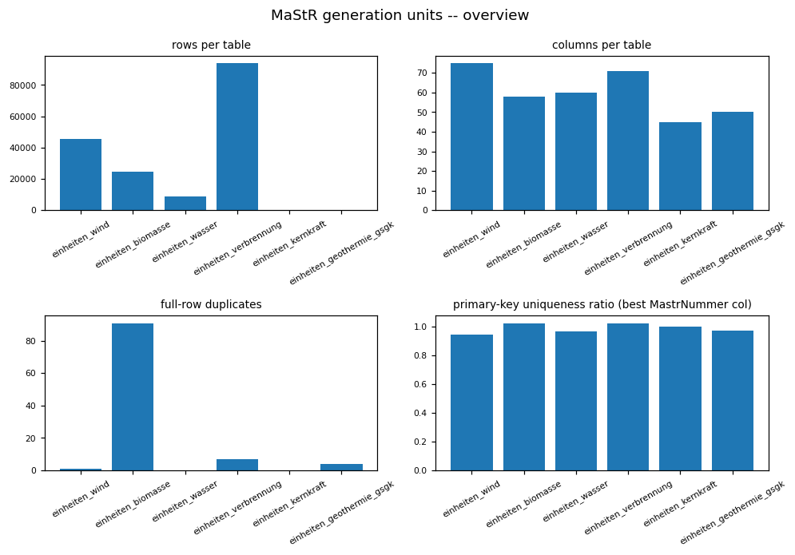

### Figure -- MaStR generation units -- first categorical column per table

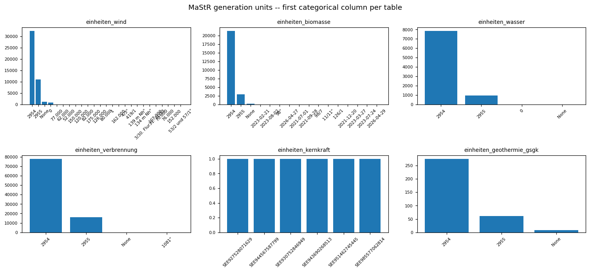

<!-- END mastr:01_generation_units -->

<!-- BEGIN mastr:02_eeg_support_and_authorisation -->
## EEG support & authorisation (anlagen_eeg_* / anlagen_kwk / einheiten_genehmigung / ertuechtigungen)

### Profile

| table | rows | cols | constant columns |
|---|---|---|---|
| anlagen_eeg_wind | 43457 | 22 | - |
| anlagen_eeg_biomasse | 15644 | 23 | - |
| anlagen_eeg_wasser | 7485 | 11 | - |
| anlagen_eeg_geothermie_gsgk | 132 | 10 | - |
| anlagen_kwk | 92514 | 10 | - |
| einheiten_genehmigung | 37722 | 14 | - |
| ertuechtigungen | 1681 | 7 | - |

### Data Quality

Full-row exact duplicates per table:
- anlagen_eeg_wind: 0
- anlagen_eeg_biomasse: 0
- anlagen_eeg_wasser: 0
- anlagen_eeg_geothermie_gsgk: 0
- anlagen_kwk: 0
- einheiten_genehmigung: 0
- ertuechtigungen: 0

### Entities / Keys

MastrNummer-suffixed key column cardinality (column, approx_distinct, ratio-to-rows) -- these tables carry both an own MastrNummer and a foreign-key MastrNummer back to the generation-unit table (see 01_generation_units_eda.py):
- anlagen_eeg_wind: [('EegMaStRNummer', 43649, 1.0044)]
- anlagen_eeg_biomasse: [('EegMaStRNummer', 15301, 0.9781)]
- anlagen_eeg_wasser: [('EegMaStRNummer', 7541, 1.0075)]
- anlagen_eeg_geothermie_gsgk: [('EegMaStRNummer', 132, 1.0)]
- anlagen_kwk: [('KwkMastrNummer', 101622, 1.0984)]
- einheiten_genehmigung: [('GenMastrNummer', 35642, 0.9449)]
- ertuechtigungen: [('EegMastrNummer', 1467, 0.8727)]

### Distributions

- anlagen_eeg_wind.`AnlagenkennzifferAnlagenregister_nv`: - 0: 42133
- 1: 1324
- anlagen_eeg_wind.`PilotAnlage`: - None: 36982
- 0: 6361
- 1: 114
- anlagen_eeg_wind.`VerhaeltnisErtragsschaetzungReferenzertrag_nv`: - 0: 37960
- 1: 5497
- anlagen_eeg_wind.`VerhaeltnisReferenzertragErtrag5Jahre_nv`: - 0: 31137
- 1: 12320
- anlagen_eeg_wind.`VerhaeltnisReferenzertragErtrag10Jahre_nv`: - 0: 40422
- 1: 3035
- anlagen_eeg_wind.`VerhaeltnisReferenzertragErtrag15Jahre_nv`: - 0: 40433
- 1: 3024
- anlagen_eeg_wind.`AusschreibungZuschlag`: - 0: 32990
- 1: 6713
- None: 3754
- anlagen_eeg_wind.`AnlageBetriebsstatus`: - 35: 32162
- 31: 8191
- 38: 3017
- 37: 87
- anlagen_eeg_wind.`PrototypAnlage`: - 0: 25418
- None: 17829
- 1: 210
- anlagen_eeg_wind.`VerhaeltnisReferenzertragErtrag15Jahre`: - None: 43418
- 95.000: 6
- 60.000: 4
- 76.400: 2
- 35.000: 2
- 69.600: 1
- 79.500: 1
- 76.500: 1
- 64.300: 1
- 55.000: 1
- 50.170: 1
- 78.400: 1
- 80.800: 1
- 10.000: 1
- 61.800: 1
- ... (15 more)
- anlagen_eeg_biomasse.`AnlagenkennzifferAnlagenregister_nv`: - 0: 14970
- 1: 674
- anlagen_eeg_biomasse.`AusschliesslicheVerwendungBiomasse`: - 1: 13376
- None: 1854
- 0: 414
- anlagen_eeg_biomasse.`AusschreibungZuschlag`: - 0: 11200
- 1: 2561
- None: 1883
- anlagen_eeg_biomasse.`BiogasInanspruchnahmeFlexiPraemie`: - None: 5743
- 0: 5275
- 1: 4626
- anlagen_eeg_biomasse.`BiogasLeistungserhoehung`: - None: 11409
- 1: 2701
- 0: 1534
- anlagen_eeg_biomasse.`BiogasGaserzeugungskapazitaet_nv`: - 0: 12558
- 1: 3086
- anlagen_eeg_biomasse.`BiomethanErstmaligerEinsatz_nv`: - 0: 15593
- 1: 51
- anlagen_eeg_biomasse.`AnlageBetriebsstatus`: - 35: 14268
- 38: 960
- 31: 222
- 37: 194
- anlagen_eeg_wasser.`AnlagenkennzifferAnlagenregister_nv`: - 0: 7298
- 1: 187
- anlagen_eeg_wasser.`AnlageBetriebsstatus`: - 35: 7329
- 38: 111
- 37: 41
- 31: 4
- anlagen_eeg_geothermie_gsgk.`AnlagenkennzifferAnlagenregister_nv`: - 0: 125
- 1: 7
- anlagen_eeg_geothermie_gsgk.`AnlageBetriebsstatus`: - 35: 93
- 38: 39
- anlagen_eeg_geothermie_gsgk.`AnlagenkennzifferAnlagenregister`: - None: 128
- A9839820169878: 1
- A1278920159316: 1
- A2867647081865: 1
- 310001436: 1
- einheiten_genehmigung.`Art`: - 846: 24270
- 41: 6653
- 845: 3952
- 40: 1385
- 2555: 742
- 848: 507
- 39: 196
- 2556: 17
- einheiten_genehmigung.`Frist_nv`: - 0: 25438
- 1: 12277
- None: 6
- 2018-01-31: 1
- einheiten_genehmigung.`WasserrechtAblaufdatum_nv`: - 0: 37400
- 1: 322
- ertuechtigungen.`Ertuechtigungsart`: - None: 767
- 798: 266
- 792: 245
- 795: 111
- 794: 102
- 796: 79
- 793: 57
- 1534: 48
- 797: 6
- ertuechtigungen.`ErtuechtigungIstZulassungspflichtig`: - None: 779
- 0: 712
- 1: 190

### EDA Findings

- anlagen_eeg_wind: rows=43457, cols=22, constant=[], duplicates=0, key candidates=[('EegMaStRNummer', 43649, 1.0044)]
- anlagen_eeg_biomasse: rows=15644, cols=23, constant=[], duplicates=0, key candidates=[('EegMaStRNummer', 15301, 0.9781)]
- anlagen_eeg_wasser: rows=7485, cols=11, constant=[], duplicates=0, key candidates=[('EegMaStRNummer', 7541, 1.0075)]
- anlagen_eeg_geothermie_gsgk: rows=132, cols=10, constant=[], duplicates=0, key candidates=[('EegMaStRNummer', 132, 1.0)]
- anlagen_kwk: rows=92514, cols=10, constant=[], duplicates=0, key candidates=[('KwkMastrNummer', 101622, 1.0984)]
- einheiten_genehmigung: rows=37722, cols=14, constant=[], duplicates=0, key candidates=[('GenMastrNummer', 35642, 0.9449)]
- ertuechtigungen: rows=1681, cols=7, constant=[], duplicates=0, key candidates=[('EegMastrNummer', 1467, 0.8727)]

### ML-Readiness Evidence

- Candidate target signals: `einheiten_genehmigung` (authorisation outcome) and `ertuechtigungen` (repowering/upgrade events) are plausible classification/event targets keyed by their own MastrNummer; EEG tariff-level columns in `anlagen_eeg_*` are candidate regression targets for a support-scheme use case.
- Leakage: EEG tariff/support-level attributes may be assigned AS A CONSEQUENCE of an authorisation or scheme decision -- using them as a feature to predict the approval outcome itself (or vice versa) risks circularity; verify which attribute is upstream of which before pairing them as feature/target.
- Grain and entity-grouped split: each table's own near-unique `*MastrNummer` is the entity id, with a separate lower-cardinality `*MastrNummer` foreign key back to the generation unit (see Entities / Keys) -- split by the generation-unit MastrNummer when a unit could contribute >1 row across these tables, not by row.
- Join cardinality: whether EEG-support/authorisation records are 1:1 or 1:N against a generation unit is NOT confirmed in this notebook (noted as a Silver-implication caveat above) -- see 06_mastr_relationships_and_findings.py's foreign-key coverage numbers before assuming a simple 1:1 join; a 1:N case joined as 1:1 is a cartesian-explosion risk for any unit-level feature table.
- Imbalance: the low-cardinality categorical columns profiled above (Distributions) may be skewed toward one dominant category per table -- check before using as a stratification or target variable, especially for an approval/rejection outcome target.
- Sample-vs-full divergence: not applicable -- every statistic here is computed from a full Spark aggregation or `.distinct().count()`, no `.sample()`/`.limit()` subset feeds any reported number.

### Silver Implications

- Each table's near-unique `*MastrNummer` column is the natural Bronze->Silver grain key; a lower-cardinality `*MastrNummer` foreign-key column is the join back to its generation unit.
- Constant columns above carry no information and can be dropped at Silver.
- EEG-support and KWK-bonus records are 1:1 or 1:N against a generation unit depending on scheme changes over time -> verify cardinality against 01 before assuming a simple join.

### Figure -- MaStR EEG support & authorisation -- overview

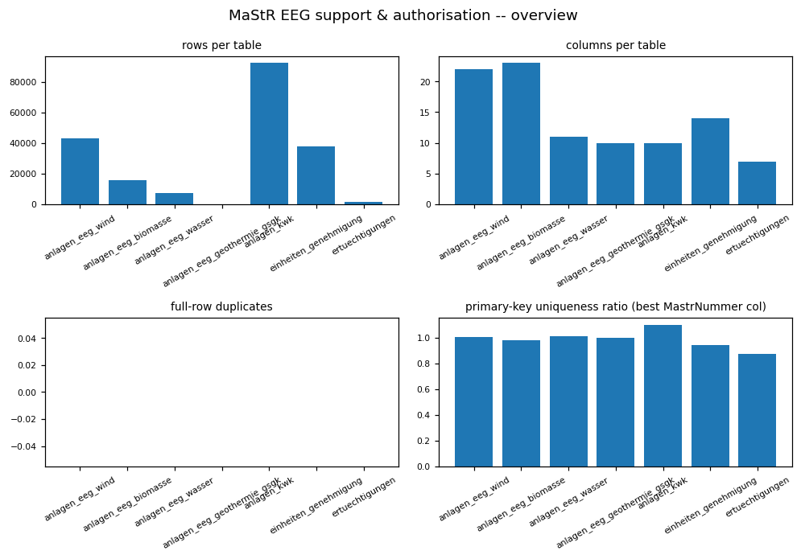

### Figure -- MaStR EEG support & authorisation -- first categorical column per table

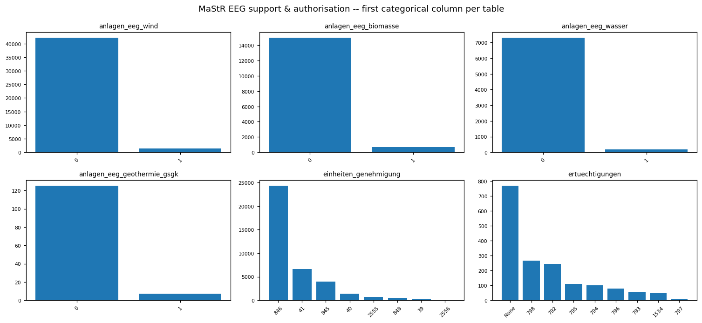

<!-- END mastr:02_eeg_support_and_authorisation -->

<!-- BEGIN mastr:03_market_actors_and_network -->
## Market actors & network (marktakteure* / netzanschlusspunkte / netze / lokationen / bilanzierungsgebiete)

### Profile

| table | rows | cols | constant columns |
|---|---|---|---|
| marktakteure | 5616357 | 61 | - |
| marktakteure_und_rollen | 19503 | 9 | - |
| netzanschlusspunkte | 5867232 | 18 | - |
| netze | 1740 | 9 | Marktgebiet |
| lokationen | 6776404 | 6 | - |
| bilanzierungsgebiete | 1118 | 4 | - |

### Data Quality

Full-row exact duplicates per table:
- marktakteure: 0
- marktakteure_und_rollen: 1062
- netzanschlusspunkte: 0
- netze: 0
- lokationen: 1
- bilanzierungsgebiete: 0

### Entities / Keys

MastrNummer-suffixed key column cardinality (column, approx_distinct, ratio-to-rows):
- marktakteure: [('MastrNummer', 5588441, 0.995)]
- marktakteure_und_rollen: [('MarktakteurMastrNummer', 15007, 0.7695), ('MastrNummer', 16460, 0.844)]
- netzanschlusspunkte: [('NetzanschlusspunktMastrNummer', 5477875, 0.9336), ('LokationMaStRNummer', 5122635, 0.8731), ('NetzMaStRNummer', 50028, 0.0085), ('NetzbetreiberMaStRNummer', 531276, 0.0905)]
- netze: [('MastrNummer', 1767, 1.0155)]
- lokationen: [('MastrNummer', 6578991, 0.9709)]
- bilanzierungsgebiete: []

### Relationships

lokationen references related Einheiten/Netzanschlusspunkte as delimited MaStR-Nummer-list columns, not a normalised join table:
- link-array columns: ['VerknuepfteEinheitenMaStRNummern', 'NetzanschlusspunkteMaStRNummern']
- rows with a non-empty value per column: {'VerknuepfteEinheitenMaStRNummern': 6628898, 'NetzanschlusspunkteMaStRNummern': 5348968}

### Distributions

- marktakteure.`Personenart`: - 518: 5325454
- 517: 290903
- marktakteure.`MarktakteurNachname`: - None: 5616235
- 0: 73
- 1: 40
- 908982: 1
- 28118759: 1
- 134223: 1
- 28118732: 1
- 28310536: 1
- DK810440: 1
- 30245938: 1
- 31234220: 1
- Barczus: 1
- marktakteure.`MarktakteurAnrede`: - None: 5616278
- 1: 38
- 0: 18
- 3251: 3
- Companies House: 2
- A0022677U.DE: 1
- A00264708.DE: 1
- A0026663Z.DE: 1
- 45750558: 1
- A0002037E.DE: 1
- 84126825: 1
- 081536488: 1
- CHE-222.698.875: 1
- SĄD REJONOWY POZNAŃ - NOWE MIASTO I WILDA W POZNANIU, VIII WYDZIAŁ GOSPODARCZY KRS: 1
- 38381954: 1
- ... (8 more)
- marktakteure_und_rollen.`Marktrolle`: - Stromlieferant, Direktvermarkter, Stromgroßhändler: 4442
- None: 3798
- Dienstleister: 2901
- Bilanzkreisverantwortlicher: 1977
- Sonstige Marktrolle: 1769
- Anschlussnetzbetreiber: 1692
- Messstellenbetreiber: 1688
- Transportkunde: 1048
- Behörde: 112
- energiewirtschaftliche Institution: 22
- Fernleitungsnetzbetreiber (Gas): 15
- energiewirtschaftlicher Verband: 5
- Bilanzkoordinator: 5
- Übertragungsnetzbetreiber: 5
- Börse: 4
- ... (16 more)
- marktakteure_und_rollen.`BundesnetzagenturBetriebsnummer_nv`: - None: 10691
- 0: 4758
- 1: 4054
- marktakteure_und_rollen.`Marktpartneridentifikationsnummer_nv`: - 0: 11877
- None: 3814
- 1: 3812
- netze.`Sparte`: - 20: 958
- 21: 782
- netze.`KundenAngeschlossen`: - 0: 1547
- 1: 139
- None: 54
- netze.`GeschlossenesVerteilnetz`: - 0: 1658
- 1: 62
- None: 20
- bilanzierungsgebiete.`RegelzoneNetzanschlusspunkt`: - 1001564: 468
- 1000010: 294
- 1000001: 198
- 1001572: 158

### EDA Findings

- marktakteure: rows=5616357, cols=61, constant=[], duplicates=0, key candidates=[('MastrNummer', 5588441, 0.995)]
- marktakteure_und_rollen: rows=19503, cols=9, constant=[], duplicates=1062, key candidates=[('MarktakteurMastrNummer', 15007, 0.7695), ('MastrNummer', 16460, 0.844)]
- netzanschlusspunkte: rows=5867232, cols=18, constant=[], duplicates=0, key candidates=[('NetzanschlusspunktMastrNummer', 5477875, 0.9336), ('LokationMaStRNummer', 5122635, 0.8731), ('NetzMaStRNummer', 50028, 0.0085), ('NetzbetreiberMaStRNummer', 531276, 0.0905)]
- netze: rows=1740, cols=9, constant=['Marktgebiet'], duplicates=0, key candidates=[('MastrNummer', 1767, 1.0155)]
- lokationen: rows=6776404, cols=6, constant=[], duplicates=1, key candidates=[('MastrNummer', 6578991, 0.9709)]
- bilanzierungsgebiete: rows=1118, cols=4, constant=[], duplicates=0, key candidates=[]

### ML-Readiness Evidence

- No direct ML target candidate stands out in these tables -- marktakteure/netze/lokationen are master-data/dimension tables; marktakteure_und_rollen's role assignment could support a role-classification use case if paired with actor attributes.
- Join cardinality / cartesian-explosion risk: `lokationen`'s link-array columns (['VerknuepfteEinheitenMaStRNummern', 'NetzanschlusspunkteMaStRNummern']) each encode a MANY:MANY relationship (one lokation can reference multiple Einheiten/Netzanschlusspunkte MastrNummern, and vice versa) inside a single delimited string -- exploding these into a bridge table without deduplication is a cartesian-explosion risk for any downstream join; verify the exploded bridge table's row count against the pre-explosion row count before using it as a feature source.
- Leakage: because lokationen's link arrays define a relationship between entities, using the linked entities' attributes to predict the existence of that same link (a link-prediction use case) is circular unless the model is genuinely predicting NEW links, not reconstructing known ones.
- Grain and entity-grouped split: each table's own near-unique `*MastrNummer` is the entity id -- split by MastrNummer, not by row, for any model using these attributes.
- Imbalance: the low-cardinality categorical columns profiled above (Distributions) may be skewed toward one dominant category per table -- check before using as a stratification or target variable.
- Sample-vs-full divergence: not applicable -- every statistic here is computed from a full Spark aggregation or `.distinct().count()`, no `.sample()`/`.limit()` subset feeds any reported number.
- Exact full-row duplicates exist in at least one table (see Data Quality) -- de-duplicate before treating MastrNummer as a unique entity key for a split.

### Silver Implications

- Each table's near-unique `*MastrNummer` column is the natural Bronze->Silver grain key.
- Constant columns above carry no information and can be dropped at Silver.
- Exact duplicate rows exist in at least one table -> de-duplicate on load.
- lokationen's delimited MaStR-Nummer link columns must be split/exploded into a proper bridge table at Silver before any join to Einheiten or Netzanschlusspunkte.
- marktakteure and marktakteure_und_rollen are a candidate 1:N role-assignment split -- confirm on the shared MastrNummer key before merging.

### Figure -- MaStR market actors & network -- overview

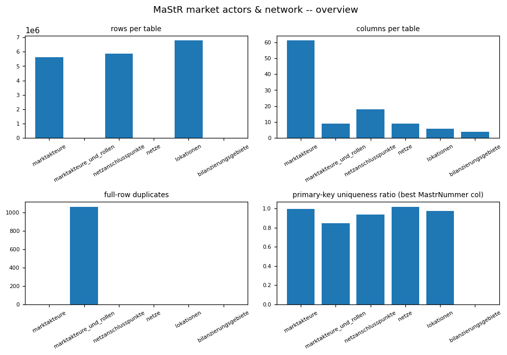

### Figure -- MaStR lokationen -- rows with a non-empty MastrNummer link array

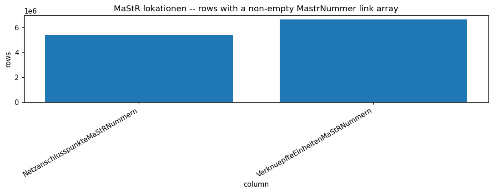

### Figure -- MaStR market actors & network -- first categorical column per table

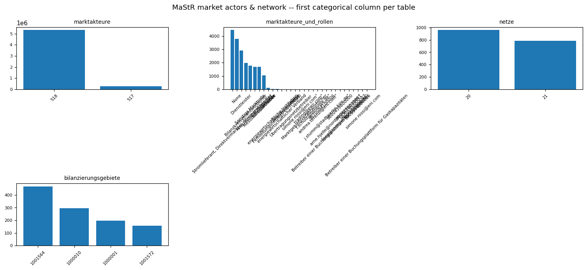

<!-- END mastr:03_market_actors_and_network -->

<!-- BEGIN mastr:04_change_history -->
## Change history (geloeschte_deaktivierte_* / einheiten_aenderung_netzbetreiberzuordnungen)

### Profile

| table | rows | cols | constant columns |
|---|---|---|---|
| geloeschte_deaktivierte_einheiten | 244295 | 5 | - |
| geloeschte_deaktivierte_marktakteure | 285315 | 3 | - |
| einheiten_aenderung_netzbetreiberzuordnungen | 226405 | 8 | - |

### Data Quality

Full-row exact duplicates per table:
- geloeschte_deaktivierte_einheiten: 0
- geloeschte_deaktivierte_marktakteure: 0
- einheiten_aenderung_netzbetreiberzuordnungen: 0

### Entities / Keys

MastrNummer-suffixed key column cardinality (column, approx_distinct, ratio-to-rows):
- geloeschte_deaktivierte_einheiten: [('EinheitMastrNummer', 267082, 1.0933)]
- geloeschte_deaktivierte_marktakteure: [('MarktakteurMastrNummer', 260967, 0.9147)]
- einheiten_aenderung_netzbetreiberzuordnungen: [('EinheitMastrNummer', 213896, 0.9447), ('LokationMastrNummer', 168050, 0.7423), ('NetzanschlusspunktMastrNummer', 44781, 0.1978)]

### Temporal

Rows per year, by detected date-like column:
- geloeschte_deaktivierte_einheiten.`DatumLetzteAktualisierung`: [(2019, 243), (2020, 1902), (2021, 4137), (2022, 9908), (2023, 14988), (2024, 14520), (2025, 28403), (2026, 170194)]
- geloeschte_deaktivierte_marktakteure.`DatumLetzteAktualisierung`: [(2018, 5), (2019, 319), (2020, 1290), (2021, 15604), (2022, 4706), (2023, 6983), (2024, 6277), (2025, 6641), (2026, 243490)]
- einheiten_aenderung_netzbetreiberzuordnungen.`RegistrierungsdatumNetzbetreiberzuordnungsaenderung`: [(2024, 50000), (3085, 4251), (3086, 172154)]
- einheiten_aenderung_netzbetreiberzuordnungen.`Netzbetreiberzuordnungsaenderungsdatum`: [(2023, 17493), (2024, 99481), (2025, 43174), (2026, 66257)]

### EDA Findings

- geloeschte_deaktivierte_einheiten: rows=244295, cols=5, constant=[], duplicates=0, key candidates=[('EinheitMastrNummer', 267082, 1.0933)], date-like columns=['DatumLetzteAktualisierung']
- geloeschte_deaktivierte_marktakteure: rows=285315, cols=3, constant=[], duplicates=0, key candidates=[('MarktakteurMastrNummer', 260967, 0.9147)], date-like columns=['DatumLetzteAktualisierung']
- einheiten_aenderung_netzbetreiberzuordnungen: rows=226405, cols=8, constant=[], duplicates=0, key candidates=[('EinheitMastrNummer', 213896, 0.9447), ('LokationMastrNummer', 168050, 0.7423), ('NetzanschlusspunktMastrNummer', 44781, 0.1978)], date-like columns=['RegistrierungsdatumNetzbetreiberzuordnungsaenderung', 'Netzbetreiberzuordnungsaenderungsdatum']

### ML-Readiness Evidence

- Candidate target signals: `geloeschte_deaktivierte_einheiten`/`geloeschte_deaktivierte_marktakteure` are literal decommission/deactivation-event labels for a unit- or actor-level survival/churn use case; `einheiten_aenderung_netzbetreiberzuordnungen` is an operator-reassignment event label.
- Leakage: these are append-only change-event logs -- a decommission-prediction model may only use change events with a date/timestamp strictly before the prediction cutoff; using any row from AFTER the cutoff (including the deactivation event itself) to build a feature for predicting that same event is definitional leakage.
- Grain and entity-grouped split: grain is one change EVENT per row, keyed by the referenced unit/actor's MastrNummer, not one row per entity -- split by that MastrNummer so an entity's full change history stays on one side of a split; a unit can have multiple change rows over time (see key_report ratios below 1.0 where present).
- Join cardinality: joining these change-event tables to the current-state generation-unit tables (01_generation_units_eda.py) is 1:N per unit if a unit has multiple historical change events -- confirm the exact foreign-key coverage in 06_mastr_relationships_and_findings.py before joining as if 1:1; treating a 1:N join as 1:1 either loses history or silently duplicates the unit's static attributes per event.
- Imbalance: deletion/deactivation/reassignment events are almost certainly rare relative to the full generation-unit or market-actor population -- a decommission or reassignment classifier built against the full current-state population as the negative class will face severe class imbalance.
- Sample-vs-full divergence: not applicable -- every statistic here (profile, key cardinality, duplicate counts, rows-per-year) is computed from a full Spark aggregation, no `.sample()`/`.limit()` subset feeds any reported number.

### Silver Implications

- These are append-only change-event logs, not current-state entities -> model as a Silver change/event fact, never overwritten by the current-state generation-unit/market-actor tables.
- einheiten_aenderung_netzbetreiberzuordnungen records network-operator reassignment events; join to the generation-unit MastrNummer to build a time-varying operator-assignment history, not a static attribute.

### Figure -- MaStR change history -- overview

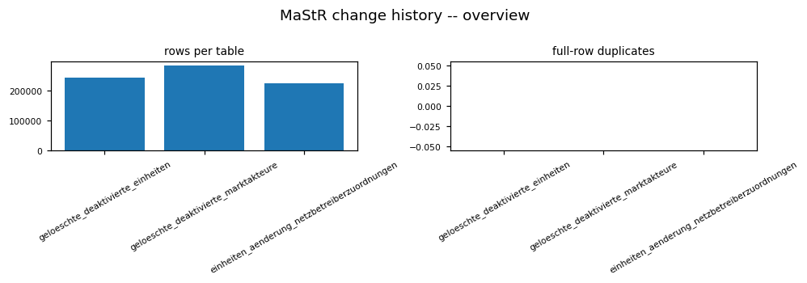

### Figure -- MaStR change history -- rows per year (first date-like column per table)

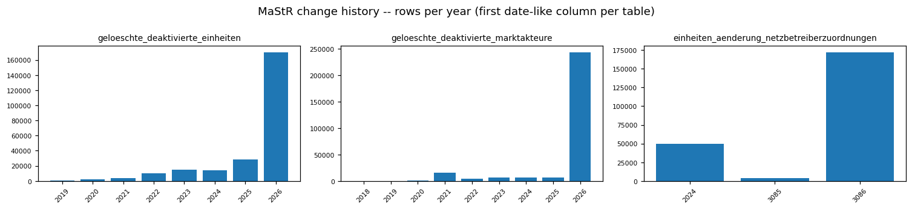

<!-- END mastr:04_change_history -->

<!-- BEGIN mastr:05_reference_catalogs -->
## Reference catalogs (einheitentypen / katalog* / lokationstypen / marktfunktionen / marktrollen)

### Profile

| table | rows | cols | full-row dups | constant columns |
|---|---|---|---|---|
| einheitentypen | 13 | 2 | 0 | - |
| katalogkategorien | 123 | 2 | 0 | - |
| katalogwerte | 1737 | 3 | 0 | - |
| lokationstypen | 4 | 2 | 0 | - |
| marktfunktionen | 10 | 2 | 0 | - |
| marktrollen | 25 | 2 | 0 | - |

### Data Quality

Full-row exact duplicates per table: {'einheitentypen': 0, 'katalogkategorien': 0, 'katalogwerte': 0, 'lokationstypen': 0, 'marktfunktionen': 0, 'marktrollen': 0}

### Domain Findings

katalogkategorien key column: `Id`, katalogwerte FK-like column: `KatalogKategorieId`
katalogkategorien ids with no referencing katalogwerte row: ['43', '54', '60', '64', '75']
katalogwerte FK values with no matching katalogkategorien row: []

### EDA Findings

- einheitentypen: 0 full-row duplicate(s)
- katalogkategorien: 0 full-row duplicate(s)
- katalogwerte: 0 full-row duplicate(s)
- lokationstypen: 0 full-row duplicate(s)
- marktfunktionen: 0 full-row duplicate(s)
- marktrollen: 0 full-row duplicate(s)

### ML-Readiness Evidence

- No candidate ML target lives in these six static reference/catalog tables -- they are pure code lookups, not observations of an outcome.
- Join cardinality: katalogkategorien <-> katalogwerte is confirmed as a code-lookup join on `Id` <-> `KatalogKategorieId`; 5 category codes have no referencing katalogwerte row and 0 katalogwerte FK values reference an unknown category -- either gap means an inner join to enrich a categorical feature with its catalog label will silently drop rows on one side.
- Grain and entity-grouped split: not applicable -- these are code dimensions with no observation-level grain to split; any model using them joins in a static label, it does not train directly on these tables.
- Leakage: not applicable -- static reference data carries no temporal ordering to leak across.
- Imbalance: not applicable -- these are code enumerations, not a class-balance concern.
- Sample-vs-full divergence: not applicable -- all six tables are fully collected (no sampling) since they are small.

### Silver Implications

- All six tables are static lookups -> model as Silver reference dimensions, SCD type 1 (overwrite on reload) unless a future MaStR release adds a validity-period column.
- einheitentypen / lokationstypen / marktfunktionen / marktrollen are the candidate code lookups for the categorical columns profiled in 01-04; reconcile the categorical value sets found there against these tables' codes before finalising Silver contracts.

### Figure -- MaStR reference catalogs -- rows per table

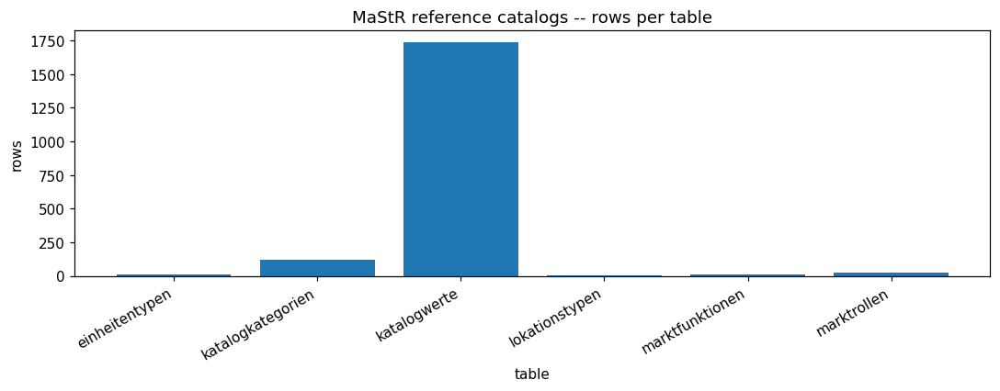

<!-- END mastr:05_reference_catalogs -->

<!-- BEGIN mastr:06_relationships_and_findings -->
## Cross-table relationships & verdict

### Entities / Keys

Own-entity key column per table: {'einheiten_wind': 'GenMastrNummer', 'einheiten_biomasse': 'GenMastrNummer', 'einheiten_wasser': 'EegMaStRNummer', 'einheiten_verbrennung': 'KwkMaStRNummer', 'einheiten_kernkraft': 'GenMastrNummer', 'einheiten_geothermie_gsgk': 'KwkMaStRNummer', 'anlagen_eeg_wind': 'EegMaStRNummer', 'anlagen_eeg_biomasse': 'EegMaStRNummer', 'anlagen_eeg_wasser': 'EegMaStRNummer', 'anlagen_eeg_geothermie_gsgk': 'EegMaStRNummer', 'anlagen_kwk': 'KwkMastrNummer', 'einheiten_genehmigung': 'GenMastrNummer', 'ertuechtigungen': 'EegMastrNummer', 'marktakteure': 'MastrNummer', 'marktakteure_und_rollen': 'MastrNummer', 'netzanschlusspunkte': 'NetzMaStRNummer', 'netze': 'MastrNummer', 'lokationen': 'MastrNummer', 'bilanzierungsgebiete': None, 'geloeschte_deaktivierte_einheiten': 'EinheitMastrNummer', 'geloeschte_deaktivierte_marktakteure': 'MarktakteurMastrNummer', 'einheiten_aenderung_netzbetreiberzuordnungen': 'EinheitMastrNummer', 'einheitentypen': None, 'katalogkategorien': None, 'katalogwerte': None, 'lokationstypen': None, 'marktfunktionen': None, 'marktrollen': None}
Distinct own-key count per table: {'einheiten_wind': 20173, 'einheiten_biomasse': 10810, 'einheiten_wasser': 7486, 'einheiten_verbrennung': 49757, 'einheiten_kernkraft': 2, 'einheiten_geothermie_gsgk': 82, 'anlagen_eeg_wind': 43457, 'anlagen_eeg_biomasse': 15644, 'anlagen_eeg_wasser': 7485, 'anlagen_eeg_geothermie_gsgk': 132, 'anlagen_kwk': 92514, 'einheiten_genehmigung': 37722, 'ertuechtigungen': 1468, 'marktakteure': 5616357, 'marktakteure_und_rollen': 15727, 'netzanschlusspunkte': 52851, 'netze': 1740, 'lokationen': 6776396, 'bilanzierungsgebiete': 0, 'geloeschte_deaktivierte_einheiten': 244295, 'geloeschte_deaktivierte_marktakteure': 285315, 'einheiten_aenderung_netzbetreiberzuordnungen': 222056, 'einheitentypen': 0, 'katalogkategorien': 0, 'katalogwerte': 0, 'lokationstypen': 0, 'marktfunktionen': 0, 'marktrollen': 0}
Union of generation-unit MastrNummer keys: 88305

### Relationships

EEG-support / genehmigung foreign-key coverage vs the generation-unit key union (fk_col, distinct_fk_values, orphans_vs_generation_units):
- anlagen_eeg_wind: {'fk_col': None}
- anlagen_eeg_biomasse: {'fk_col': None}
- anlagen_eeg_wasser: {'fk_col': None}
- anlagen_eeg_geothermie_gsgk: {'fk_col': None}
- anlagen_kwk: {'fk_col': None}
- einheiten_genehmigung: {'fk_col': None}
- ertuechtigungen: {'fk_col': None}

marktakteure_und_rollen join column: `MarktakteurMastrNummer`
- marktakteure keys with no role row: 5603470
- role rows referencing an unknown marktakteure key: 2357

Change-history foreign keys vs generation-unit key union (fk_col, distinct_fk_values, not_in_generation_units):
- geloeschte_deaktivierte_einheiten: {'fk_col': 'EinheitMastrNummer', 'distinct_fk_values': 244295, 'not_in_generation_units': 244295}
- geloeschte_deaktivierte_marktakteure: {'fk_col': 'MarktakteurMastrNummer', 'distinct_fk_values': 285315, 'not_in_generation_units': 285315}
- einheiten_aenderung_netzbetreiberzuordnungen: {'fk_col': 'EinheitMastrNummer', 'distinct_fk_values': 222056, 'not_in_generation_units': 222056}

### EDA Findings

- Any EEG-support/change-history foreign key orphaned against generation units: True.
- marktakteure keys missing a role row: 5603470; role rows with an unknown marktakteure key: 2357.
- Verdict: each table's own-entity MastrNummer is a safe Silver grain key; cross-table joins must be validated against the live foreign-key coverage above per release, since MaStR's German field names do not guarantee a byte-identical key match without this check.

### ML-Readiness Evidence

- No candidate ML target lives across these 28 tables directly -- this notebook is a joinability audit; see 01-04 for per-table target candidates (decommission events, authorisation outcomes, repowering events).
- Join cardinality / cartesian-explosion risk: EEG-support and change-history foreign keys are checked against the generation-unit key union (88305 distinct keys) -- any orphan found (True) means a left join must be used (not inner) or fact rows silently disappear; a foreign key with MULTIPLE matching rows in a target table (not checked by set-membership alone) would additionally risk fan-out -- verify row-level join cardinality, not just key-set overlap, before joining at scale.
- marktakteure <-> marktakteure_und_rollen is not a clean gap-free 1:1/1:N: 5603470 marktakteure keys have no role row and 2357 role rows reference an unknown marktakteure key -- treating this as a simple child table without handling both gaps risks silently dropping actors from a role-based feature.
- Grain and entity-grouped split: each table's own-entity `*MastrNummer` (own_key above) is the correct split unit for any cross-table model -- always split by the GENERATION-UNIT or MARKET-ACTOR MastrNummer at the root of a join chain, not by row in any individual table, so that one entity's rows across multiple joined tables stay together.
- Leakage: change-history foreign-key coverage (checked here against the generation-unit key union) confirms WHICH units have historical change events, but not WHEN -- combining this notebook's cross-table joins with a temporal target (e.g. decommission prediction) still requires the date-based leakage guard described in 04_change_history_eda.py; a clean key match here does not imply a temporally safe feature.
- Imbalance: not applicable at this join-audit level -- see 01-04 for per-table imbalance notes on rare categorical/event columns.
- Sample-vs-full divergence: not applicable -- every statistic here (key sets, foreign-key coverage, row counts) is computed from a full Spark distinct/count or a fully collected key set, no `.sample()`/`.limit()` subset feeds any reported number.

### Silver Implications

- Silver join key: own-entity `*MastrNummer` per table, joined to another table's own key via the matching foreign-key `*MastrNummer` column (verified above, not assumed from naming).
- Orphaned foreign keys exist -> a left join must not silently drop the fact row; flag the orphan instead.
- marktakteure <-> marktakteure_und_rollen is not a clean 1:1/1:N without gaps -> reconcile before treating roles as a simple child table.

### Figure -- MaStR rows per Bronze table (all 28)

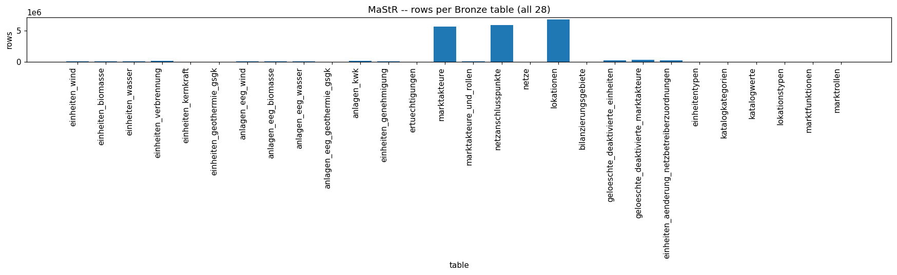

### Figure -- MaStR EEG-support/genehmigung foreign keys not found in generation units

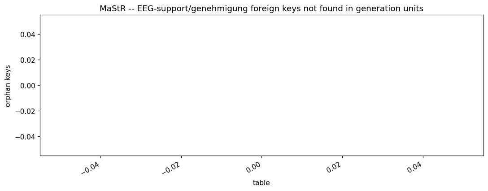

<!-- END mastr:06_relationships_and_findings -->
