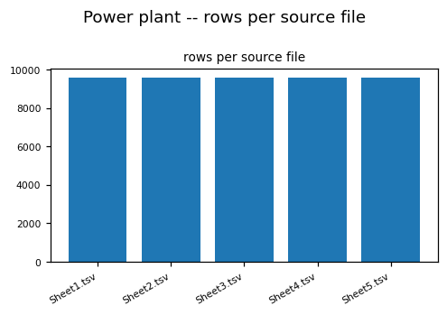
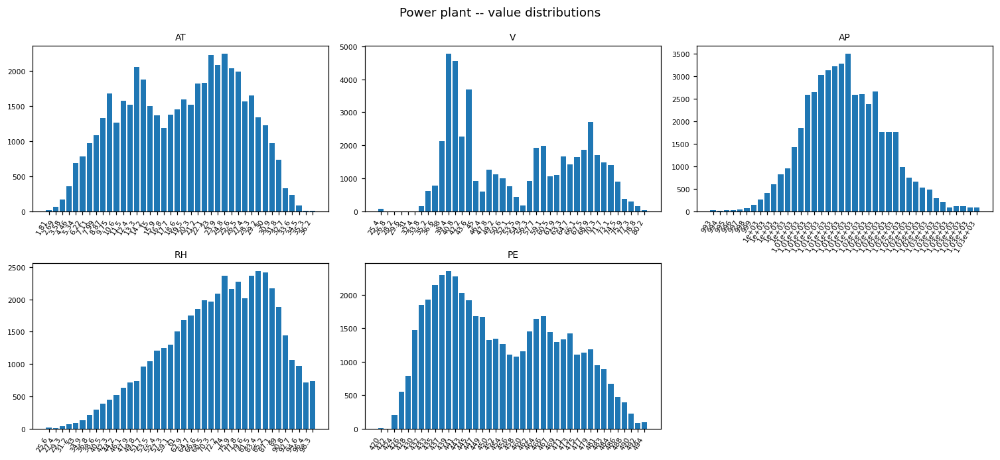

# POWER_PLANT_CCPP EDA PROFILE

_Auto-generated by the EDA notebooks (`databricks/eda/power_plant_ccpp/`). One `## ` section per notebook; re-running a notebook replaces its own section, other sections are preserved._

<!-- BEGIN power_plant_ccpp:01_power_plant_ccpp -->
## Combined-cycle power plant sensor readings (Samples: power-plant)

### Profile

| frame | separator | source files | rows | cols | constant columns |
|---|---|---|---|---|---|
| delimited_1 | tab | 5 | 47840 | 5 | - |

### Provenance / Source Evidence

The dataset is read in place from the Databricks Samples Volume; there is no Bronze table and no ECRMAP acquisition step.
Files under `/Volumes/samples/databricks/datasets/power-plant`: 6 ({'support': 1, 'delimited': 5}).
README-type file `README.md` (first lines):
  > =========================================
  > Combined Cycle Power Plant Data Set
  > =========================================
  > Power Plant Sensor Readings Data Set
  > ## Source
  > http://archive.ics.uci.edu/ml/datasets/Combined+Cycle+Power+Plant
  > ##Summary
  > The example data is provided by UCI at UCI Machine Learning Repository Combined Cycle Power Plant Data Set
  > You can read the background on the UCI page, but in summary we have collected a number of readings from sensors at a Gas Fired Power Plant (also called a Peaker
  > ## Usage License
  > If you publish material based on databases obtained from this repository, then, in your acknowledgements, please note the assistance you received by using this repository. This will help others to obtain the same data sets and replicate your experiments. We suggest the following reference format for referring to this repository:
  > Pınar Tüfekci, Prediction of full load electrical power output of a base load operated combined cycle power plant using machine learning methods, International 
  > Heysem Kaya, Pınar Tüfekci , Sadık Fikret Gürgen: Local and Global Learning Methods for Predicting Power of a Combined Gas & Steam Turbine, Proceedings of the I

### Structural Integrity

- delimited_1: 5 columns; unnamed=none; digit-named=none; expected columns present=['AT', 'V', 'AP', 'RH', 'PE'] -> header applied.
Expected columns come from the dataset's public description (AT, V, AP, RH, PE); this section confirms or refutes them against the files.

### Data Quality

Full-row exact duplicates per frame and duplicates across source files:
- delimited_1: full-row duplicates 38313; distinct rows 9527; rows present in more than one file 9527; surplus duplicate rows 38313.
- delimited_1: per file (file, distinct rows, repeated rows within the file): [('Sheet1.tsv', 9527, 41), ('Sheet2.tsv', 9527, 41), ('Sheet3.tsv', 9527, 41), ('Sheet4.tsv', 9527, 41), ('Sheet5.tsv', 9527, 41)]; number of distinct rows by how many files contain them (files, rows): [(5, 9527)].
- delimited_1: 9527 of 9527 distinct rows appear in all 5 files -> the files hold the same set of rows.
Missingness (rate per column):
- delimited_1: AT=0.0000, V=0.0000, AP=0.0000, RH=0.0000, PE=0.0000

### Entities / Keys

No entity or record identifier column is expected in a sensor-reading table; each row is one hourly operating observation. Approx distinct per column:
- delimited_1: AT=2765, V=639, AP=2485, RH=4575, PE=4866; rows=47840 -> no column is unique per row, so there is no natural key.

### Unit & Semantic Validation

- delimited_1.`AT`: numeric yield 100.0%, range 1.81..37.11, mean 19.65, sd 7.452, zero 0, negative 0; expected ambient temperature (degC) bounds -20.0..50.0: below 0, above 0.
- delimited_1.`V`: numeric yield 100.0%, range 25.36..81.56, mean 54.31, sd 12.71, zero 0, negative 0; expected exhaust vacuum (cm Hg) bounds 20.0..90.0: below 0, above 0.
- delimited_1.`AP`: numeric yield 100.0%, range 992.89..1033.3, mean 1013, sd 5.939, zero 0, negative 0; expected ambient pressure (mbar) bounds 900.0..1100.0: below 0, above 0.
- delimited_1.`RH`: numeric yield 100.0%, range 25.56..100.16, mean 73.31, sd 14.6, zero 0, negative 0; expected relative humidity (%) bounds 0.0..100.0: below 0, above 275.
- delimited_1.`PE`: numeric yield 100.0%, range 420.26..495.76, mean 454.4, sd 17.07, zero 0, negative 0; expected net hourly electrical output (MW) bounds 400.0..520.0: below 0, above 0.
- delimited_1.`RH` rows beyond the expected bounds per file (file, above, below, max): [('Sheet1.tsv', 55, 0, 100.16), ('Sheet2.tsv', 55, 0, 100.16), ('Sheet3.tsv', 55, 0, 100.16), ('Sheet4.tsv', 55, 0, 100.16), ('Sheet5.tsv', 55, 0, 100.16)].

### Categorical / Domain Validation

No categorical column is expected. Columns with 2..60 approx distinct values:
- delimited_1: none

### Temporal Semantics

- delimited_1: no date / time / timestamp column -- rows are observations without a time axis, so hourly ordering, gaps and seasonality cannot be assessed.

### Temporal Consistency

No time axis exists, so temporal consistency (ordering, gaps, duplicates per timestamp) is not applicable; row order in the files carries no meaning that can be verified here.

### Relationship Cardinality

Relationship between source files:
- delimited_1: 5 file(s); rows per file [('Sheet1.tsv', 9568), ('Sheet2.tsv', 9568), ('Sheet3.tsv', 9568), ('Sheet4.tsv', 9568), ('Sheet5.tsv', 9568)]; rows appearing in more than one file: 9527.
If the files are independent partitions the counts above sum to the frame total and no row repeats across files; a non-zero cross-file count means the files overlap.

### Value Consistency

Pairwise Pearson correlation (all numeric columns):
- delimited_1: AT vs PE: -0.948
- delimited_1: V vs PE: -0.870
- delimited_1: AT vs V: 0.844
- delimited_1: AT vs RH: -0.543
- delimited_1: AP vs PE: 0.518
- delimited_1: AT vs AP: -0.508
- delimited_1: V vs AP: -0.414
- delimited_1: RH vs PE: 0.390
- delimited_1: V vs RH: -0.312
- delimited_1: AP vs RH: 0.100
- delimited_1: mirror / duplicate column pairs: none

### Regime / Version Evidence

Per-file column means (a large shift between files indicates that the files are different sub-populations or fold-shuffles rather than one homogeneous set):
- delimited_1 / Sheet1.tsv: AT=19.651, V=54.306, AP=1013.259, RH=73.309, PE=454.365
- delimited_1 / Sheet2.tsv: AT=19.651, V=54.306, AP=1013.259, RH=73.309, PE=454.365
- delimited_1 / Sheet3.tsv: AT=19.651, V=54.306, AP=1013.259, RH=73.309, PE=454.365
- delimited_1 / Sheet4.tsv: AT=19.651, V=54.306, AP=1013.259, RH=73.309, PE=454.365
- delimited_1 / Sheet5.tsv: AT=19.651, V=54.306, AP=1013.259, RH=73.309, PE=454.365

### Coverage & Sampling Bias

Coverage cannot be established from the files alone: the operating period, the plant identity and the sampling rule are not recorded in the data. Any statement about them rests on the README excerpt in the provenance section.
One plant, one operating regime is implied; there is no site, unit or load-mode column, so a model trained here cannot be checked for transfer to other plants.

### Distributions

- delimited_1.`AT` quantiles (p1/p25/p50/p75/p99): 5.18, 13.5, 20.32, 25.71, 32.92
- delimited_1.`V` quantiles (p1/p25/p50/p75/p99): 35.79, 41.7, 52.08, 66.51, 77.24
- delimited_1.`AP` quantiles (p1/p25/p50/p75/p99): 1001, 1009, 1013, 1017, 1028
- delimited_1.`RH` quantiles (p1/p25/p50/p75/p99): 38.35, 63.29, 74.94, 84.79, 99.1
- delimited_1.`PE` quantiles (p1/p25/p50/p75/p99): 427.1, 439.7, 451.5, 468.4, 489.4

### EDA Findings

- delimited_1: rows=47840, cols=5, constant=[], dups=38313, cross-file duplicates=9527, distinct rows=9527, columns beyond expected bounds=['RH']

### ML-Readiness Evidence

- **Grain / grain drift:** One row per operating observation; frames={'delimited_1': 47840}. No identifier or timestamp, so the grain cannot be verified beyond row count.
- **Join multiplication (1:N / M:N expansion):** No join key exists; joining this table to any other source would have to be a contextual (weather-regime) join, not a keyed one.
- **Target contamination:** The output column (net electrical output) is the natural target; the other sensor columns are physically upstream of it, so they are legitimate features, not contaminated ones.
- **Temporal / post-event leakage:** No time axis -- temporal leakage cannot arise from ordering, but a random split also cannot be shown to respect time.
- **Proxy leakage:** No identifier columns; humidity and temperature are correlated (see the correlation section) so one can proxy the other.
- **Split / entity leakage:** Files may be shuffled folds of one series; overlap across files: {'delimited_1': 9527}. Split by file only if files are shown to be disjoint.
- **Historical-reference (point-in-time) leakage:** Not applicable -- no reference table or validity window.
- **Survivorship / coverage bias:** Single plant, undocumented operating window; no coverage statement is verifiable from the data.
- **Missingness leakage:** Missingness per column is reported in Data Quality; near-zero missingness means an is-missing feature carries no signal.
- **Duplicate-event leakage:** Full-row duplicates {'delimited_1': 38313} and cross-file duplicates above: duplicated rows placed on both sides of a split inflate scores.
- **Target / feature temporal misalignment:** Features and target are one simultaneous reading; no lag structure is represented.
- **Unit / sign / circular-feature leakage:** Units are not in the data (only in the README); mirror pairs found: {'delimited_1': []}. Strongly correlated sensors are near-collinear.
- **Data-generation-process leakage:** The dataset is a curated public research extract; the sampling and any shuffling are undocumented in the files.
- **Class / label instability:** Regression target -- no classes.
- **Label availability lag:** Not applicable -- the output is measured at the same instant as the inputs.
- **Source / version / regime change:** Single static extract; no version or regime indicator, and no evidence in the data of a change in operating regime.
- **Sample-vs-full divergence:** Every statistic is a full Spark aggregation over the files read; whether the files themselves are a sample of a longer record is not stated in the data.

### Silver Implications

- Read from the Samples Volume; no Bronze table exists for this dataset.
- All columns arrive as strings when read as delimited text -- numeric casts need an explicit rule; quarantine values that fail.
- No natural key: a Silver key would have to be derived (file + row position) and flagged derived, or the table kept keyless.
- No time axis: any hourly / time-series treatment is unsupported by this data.
- Rows repeat across files -> decide the de-duplication rule before use; the per-file identity result in Data Quality shows whether the files are copies of one row set.
- Values beyond the expected physical bounds exist (see Unit & Semantic Validation) -> decide whether to keep, cap or quarantine them.

### Figure -- Power plant -- rows per source file

### Figure -- Power plant -- value distributions

<!-- END power_plant_ccpp:01_power_plant_ccpp -->
