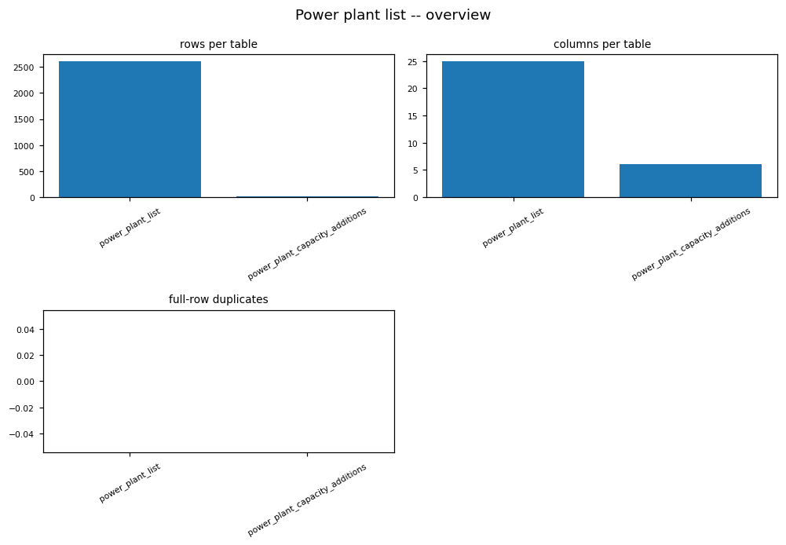
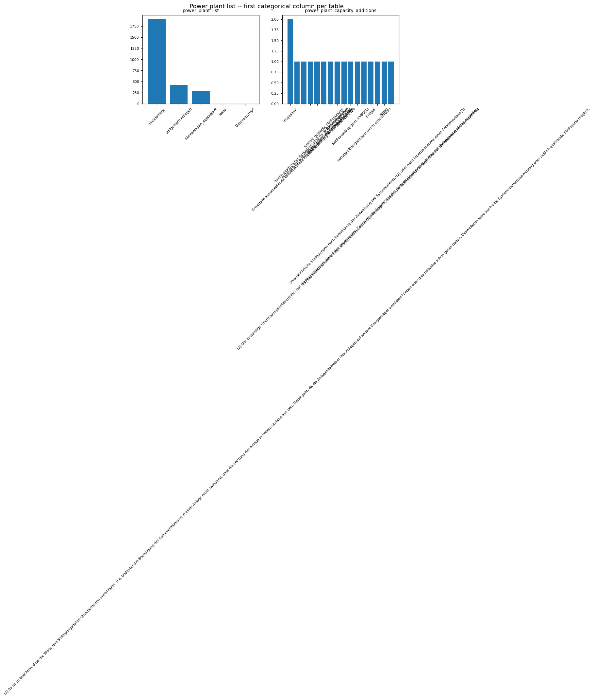

# POWER_PLANT_LIST EDA PROFILE

_Auto-generated by the EDA notebooks (`databricks/eda/power_plant_list/`). One `## ` section per notebook; re-running a notebook replaces its own section, other sections are preserved._

<!-- BEGIN power_plant_list:01_power_plant_list -->
## Power plant list (power_plant_list, power_plant_capacity_additions)

### Profile

| table | rows | cols | constant columns |
|---|---|---|---|
| power_plant_list | 2616 | 25 | - |
| power_plant_capacity_additions | 17 | 6 | - |

### Data Quality

Full-row exact duplicates per table:
- power_plant_list: 0
- power_plant_capacity_additions: 0

### Entities / Keys

Plant/block-identifier-like key column cardinality (column, approx_distinct, ratio-to-rows):
- power_plant_list: []
- power_plant_capacity_additions: []

### Distributions

- power_plant_list.`Unnamed:_0`: - Einzelanlage: 1903
- stillgelegte Anlagen: 420
- Kleinanlagen_aggregiert: 290
- None: 2
- Datensatztyp*: 1
- power_plant_list.`Unnamed:_8`: - Bayern: 471
- NordrheinWestfalen: 458
- BadenWuerttemberg: 289
- Niedersachsen: 200
- Hessen: 157
- RheinlandPfalz: 149
- Sachsen: 146
- SachsenAnhalt: 117
- Brandenburg: 103
- SchleswigHolstein: 102
- Thueringen: 102
- Berlin: 71
- None: 64
- Saarland: 51
- MecklenburgVorpommern: 49
- ... (5 more)
- power_plant_list.`Unnamed:_9`: - Deutschland: 2551
- Oesterreich: 34
- Schweiz: 17
- Luxemburg: 11
- Land: 1
- None: 1
- Daenemark: 1
- power_plant_list.`Unnamed:_11`: - None: 2349
- 2024: 52
- 2022: 25
- 2021: 22
- 2012: 21
- 2018: 20
- 2025: 18
- 2017: 14
- 2016: 14
- 2026: 14
- 2013: 11
- 2023: 11
- 2019: 11
- 2015: 11
- 2014: 10
- ... (3 more)
- power_plant_list.`Unnamed:_12`: - InBetrieb: 2017
- endgültig stillgelegt ohne § 13b EnWG oder KVBG: 261
- endgültig stillgelegt nach § 13b EnWG: 116
- vorläufig Stillgelegt: 116
- endgültig stillgelegt nach KVBG: 43
- Netzreserve aufgrund § 13b EnWG: 25
- Kapazitätsreserve aufgrund von § 13e EnWG: 16
- besonderes netztechnisches Betriebsmittel: 14
- Netzreserve aufgrund von KVBG: 5
- Kraftwerksstatus: 1
- None: 1
- zeitl. gestreckte Stilllegung aufgrund § 50 KVBG: 1
- power_plant_list.`Unnamed:_13`: - Erdgas: 937
- Wasser: 379
- Batteriespeicher: 159
- Biomasse: 158
- Mineraloelprodukte: 155
- Steinkohle: 141
- Waerme: 134
- Abfall: 132
- Pumpspeicher: 109
- Braunkohle: 91
- Sonstige Energietraeger (nicht erneuerbar): 81
- SolareStrahlungsenergie: 51
- Wind (onshore): 43
- Grubengas: 16
- Wasserstoff: 11
- ... (5 more)
- power_plant_list.`Unnamed:_14`: - None: 1292
- ErdgasErdoelgas: 836
- AbfallHausmuellSiedlungsabfaelle: 101
- Dampf: 96
- Steinkohlen: 88
- HeizoelLeicht: 47
- Rohbraunkohlen: 46
- Dieselkraftstoff: 23
- AndereMineraloelprodukte: 21
- HochofengasKonvertergas: 20
- Industrieabfall: 10
- Raffineriegas: 8
- SonstigeHergestellteGase: 6
- HeizoelSchwer: 5
- Wirbelschichtkohle: 5
- ... (5 more)
- power_plant_list.`Unnamed:_15`: - Ja: 1276
- Nein: 893
- None: 446
- Waermeauskopplung_KWK: 1
- power_plant_list.`Unnamed:_16`: - Nein: 1975
- Ja: 639
- None: 1
- Erneuerbarer_Energietraeger: 1
- power_plant_list.`Unnamed:_19`: - None: 565
- Verbrennungsmotor: 371
- Laufwasseranlage: 301
- KondensationsmaschinemitEntnahme: 299
- GasturbinenmitAbhitzekessel: 208
- GegendruckmaschinemitEntnahme: 176
- GegendruckmaschineohneEntnahme: 135
- GasturbinenmitnachgeschalteterDampfturbine: 126
- Batterie: 125
- Pumpspeicher: 102
- GasturbinenohneAbhitzekessel: 62
- KondensationsmaschineohneEntnahme: 55
- Speicherwasseranlage: 42
- Sonstige: 37
- Dampfmotor: 5
- ... (4 more)
- power_plant_list.`Unnamed:_20`: - TeileinspeisungEigenverbrauch: 1014
- Volleinspeisung: 1001
- None: 600
- Volleinspeisung_Teileinspeisung: 1
- power_plant_list.`Unnamed:_21`: - Mittelspannung: 752
- Hochspannung: 731
- None: 684
- Hoechstspannung: 190
- UmspannungZurMittelspannung: 184
- Niederspannung: 40
- Mittelspannung, Mittelspannung: 7
- UmspannungZurHochspannung: 7
- UmspannungZurNiederspannung: 5
- Hochspannung, Hochspannung: 3
- Mittelspannung, Mittelspannung, Mittelspannung: 2
- Hochspannung, Hoechstspannung: 2
- Mittelspannung, Niederspannung: 2
- Mittelspannung, Mittelspannung, Niederspannung: 2
- Hoechstspannung, Hoechstspannung, Mittelspannung, Mittelspannung: 1
- ... (4 more)
- power_plant_list.`Unnamed:_23`: - Nein: 2533
- Ja: 80
- None: 2
- Bestandteil_Grenzkraftwerk: 1
- power_plant_list.`Unnamed:_24`: - None: 2561
- 10,442: 10
- 100: 9
- 4,5: 6
- 2,166: 5
- 22,9: 4
- 27: 4
- 27,94: 3
- 28,15: 2
- 9,2: 2
- Grenzkraftwerk_Nettonennleistung_MW: 1
- 39,186: 1
- 24: 1
- 198: 1
- 1,72: 1
- ... (5 more)
- power_plant_list.`**_Anlagen_die_zum_31_12_stillgelegt_wurden_werden_hier_in_dem_darauffolgenden_Jahr_als_endgültig_stillgelegt_ausgewertet`: min=None, max=None, mean=None, parsed_rows=0
- power_plant_list.`Unnamed:_2`: min=None, max=None, mean=None, parsed_rows=0
- power_plant_list.`Unnamed:_3`: min=None, max=None, mean=None, parsed_rows=0
- power_plant_list.`Unnamed:_4`: min=1099.0, max=99885.0, mean=50749.90751985054, parsed_rows=2141
- power_plant_list.`Unnamed:_5`: min=None, max=None, mean=None, parsed_rows=0
- power_plant_list.`Unnamed:_6`: min=None, max=None, mean=None, parsed_rows=0
- power_plant_list.`Unnamed:_7`: min=0.0, max=3691.0, mean=47.461313012895666, parsed_rows=1706
- power_plant_list.`Unnamed:_10`: min=1901.0, max=2026.0, mean=1991.4529520295202, parsed_rows=2168
- power_plant_list.`Unnamed:_17`: min=0.0, max=33196.83, mean=140.92821889824026, parsed_rows=2614
- power_plant_list.`Unnamed:_18`: min=0.0, max=29776.3, mean=132.09032785003825, parsed_rows=2614
- power_plant_list.`Unnamed:_22`: min=None, max=None, mean=None, parsed_rows=0
- power_plant_capacity_additions.`energietraeger`: - Insgesamt: 2
- (1) Es ist zu beachten, dass die Werte und Stilllegungsdaten Unsicherheiten unterliegen. U.a. bedeutet die Beendigung der Kohleverfeuerung in einer Anlage nicht zwingend, dass die Leistung der Anlage in vollem Umfang aus dem Markt geht, da die Anlagenbetreiber ihre Anlagen auf andere Energieträger umrüsten können oder dies teilweise schon getan haben. Desweiteren wäre auch eine Systemrelevanzausweisung oder zeitlich gestreckte Stilllegung möglich.: 1
- Erwartete ausscheidende konventionelle Kraftwerksleistung in MW 2026 bis 2029: 1
-    davon gesetzlicher Reduktionspfad für Braunkohleanlagen: 1
- Anzeigen zur endgültigen Stilllegung gem. § 13b EnWG: 1
- weitere geplante Stilllegungen: 1
- davon aus 1. Ausschreibungsrunde: 1
- Batteriespeicher: 1
- Pumpspeicher: 1
- Kohleausstieg gem. KVBG(1): 1
- [2] Der zuständige Übertragungsnetzbetreiber hat die Möglichkeit vor Ablauf des genehmigten Zeitraums der Ausweisung der Systemrelevanz einen Antrag auf Verlängerung dieser zu stellen: 1
- sonstige Energieträger (nicht erneuerbar): 1
- Erdgas: 1
- voraussichtliche Stilllegungen nach Beendigung der Ausweisung der Systemrelevanz(2) oder nach Inbetriebnahme eines Ersatzneubaus(3): 1
- Abfall: 1
- ... (1 more)
- power_plant_capacity_additions.`2026`: - None: 8
- 8.0: 1
- 3089.9000000000005: 1
- 1216.5: 1
- 1889.9: 1
- 247.8: 1
- 11.7: 1
- 990.3: 1
- 190.0: 1
- 1464.3: 1
- power_plant_capacity_additions.`2027`: - None: 8
- 33.7: 1
- 2030.4: 1
- 821.0: 1
- 12.8: 1
- 501.8: 1
- 25.5: 1
- 1880.4: 1
- 78.0: 1
- 1322.8: 1
- power_plant_capacity_additions.`2028`: - None: 11
- 515.0: 2
- 89.0: 1
- 2523.0: 1
- 51.9: 1
- 2663.9: 1
- power_plant_capacity_additions.`2029`: - None: 12
- 334.0: 1
- 30.8: 1
- 2214.0: 1
- 0.0: 1
- 2578.8: 1
- power_plant_capacity_additions.`2026_2029_total`: - None: 4
- 4737.0: 2
- 0.0: 2
- 1172.6: 1
- 41.7: 1
- 5635.3: 1
- 37.2: 1
- 2120.2000000000003: 1
- 268.0: 1
- 3385.7: 1
- 1902.7: 1
- 8029.8: 1

### EDA Findings

- power_plant_list: rows=2616, cols=25, constant=[], duplicates=0, id-like key candidates=[]
- power_plant_capacity_additions: rows=17, cols=6, constant=[], duplicates=0, id-like key candidates=[]

### ML-Readiness Evidence

- Candidate target signals: `power_plant_capacity_additions` is a capacity-change event log -- a natural target for a capacity-growth/plant-retirement-prediction use case; fuel-type/state/status categorical columns in `power_plant_list` (Distributions) are candidate classification targets.
- Leakage: capacity-addition rows are change EVENTS -- using an addition dated after a prediction cutoff to build a feature for that same cutoff's prediction is leakage, matching the append-only-log caveat found in MaStR's change-history tables; only additions strictly before the prediction point may be used as features.
- Grain and entity-grouped split: the plant/block-identifier-like column(s) in `id_key_report` above are the entity id -- split by that identifier, not by row, since a plant can have multiple capacity-addition events over time.
- Join cardinality: power_plant_list <-> power_plant_capacity_additions is NOT confirmed 1:1 or 1:N in this notebook -- a plant with multiple addition events would make this 1:N, and joining as if 1:1 either loses history or duplicates the plant's static attributes per event; verify the join cardinality before combining the two tables as features.
- Imbalance: the low-cardinality categorical columns profiled above (Distributions) may be skewed toward one dominant category -- check before using fuel type/state/status as a stratification or target variable.
- Sample-vs-full divergence: not applicable -- every statistic here is computed from a full Spark aggregation or `.distinct().count()`, no `.sample()`/`.limit()` subset feeds any reported number; note separately that the numeric-looking value columns were parsed heuristically (comma-as-decimal) -- an unparsed value becomes NULL, not a wrong number, but any regression target built from these columns should check `_parsed` counts against total rows first.

### Silver Implications

- Constant columns above carry no information and can be dropped at Silver.
- power_plant_capacity_additions records capacity change events against a plant/block identifier -> model as a Silver change fact joined to power_plant_list, not merged into current-state plant attributes.
- Numeric-looking value columns above were parsed heuristically (comma-as-decimal handled); confirm actual units and decimal convention against the source layout before Silver casting.

### Figure -- Power plant list -- overview

### Figure -- Power plant list -- first categorical column per table

<!-- END power_plant_list:01_power_plant_list -->
