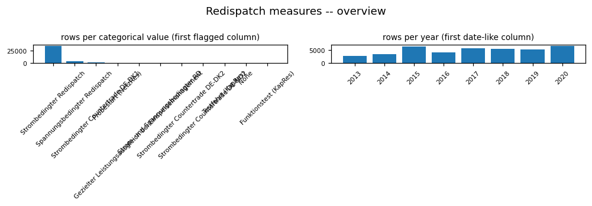

# REDISPATCH EDA PROFILE

_Auto-generated by the EDA notebooks (`databricks/eda/redispatch/`). One `## ` section per notebook; re-running a notebook replaces its own section, other sections are preserved._

<!-- BEGIN redispatch:01_redispatch -->
## Redispatch measures (redispatch_measures)

### Profile

| column | missing | rate | approx_distinct |
|---|---|---|---|
| coverage_regime | 0 | 0.0000 | 1 |
| BEGINN_DATUM | 0 | 0.0000 | 2566 |
| BEGINN_UHRZEIT | 0 | 0.0000 | 98 |
| ZEITZONE_VON | 0 | 0.0000 | 1 |
| ENDE_DATUM | 0 | 0.0000 | 2602 |
| ENDE_UHRZEIT | 0 | 0.0000 | 99 |
| ZEITZONE_BIS | 0 | 0.0000 | 1 |
| GRUND_DER_MASSNAHME | 27 | 0.0007 | 10 |
| RICHTUNG | 0 | 0.0000 | 2 |
| MITTLERE_LEISTUNG_MW | 0 | 0.0000 | 5707 |
| MAXIMALE_LEISTUNG_MW | 0 | 0.0000 | 1374 |
| GESAMTE_ARBEIT_MWH | 0 | 0.0000 | 7977 |
| ANWEISENDER_UENB | 0 | 0.0000 | 5 |
| ANFORDERNDER_UENB | 19 | 0.0005 | 33 |
| BETROFFENE_ANLAGE | 71 | 0.0018 | 726 |
| PRIMAERENERGIEART | 73 | 0.0018 | 3 |

Rows: 40118. Constant columns: ['coverage_regime', 'ZEITZONE_VON', 'ZEITZONE_BIS'].

### Data Quality

Exact full-row duplicates: 568.

### Temporal

Rows per year, by detected date-like column:
- `BEGINN_DATUM`: [(2013, 2688), (2014, 3461), (2015, 6462), (2016, 4058), (2017, 5810), (2018, 5526), (2019, 5321), (2020, 6792)]
- `BEGINN_UHRZEIT`: []
- `ZEITZONE_VON`: []
- `ENDE_DATUM`: [(2013, 2687), (2014, 3457), (2015, 6465), (2016, 4056), (2017, 5813), (2018, 5523), (2019, 5323), (2020, 6794)]
- `ENDE_UHRZEIT`: []
- `ZEITZONE_BIS`: []
- `ANWEISENDER_UENB`: []

### Distributions

- `GRUND_DER_MASSNAHME`: - Strombedingter Redispatch: 34618
- Spannungsbedingter Redispatch: 3726
- Strombedingter Countertrade DE-DK1: 1078
- Probestart (NetzRes): 262
- Gezielter Leistungsausgleich bei Einspeisemanagement: 131
- Strom- und Spannungsbedingter RD: 84
- Strombedingter Countertrade DE-DK2: 77
- Strombedingter Countertrade DE-NO2: 74
- Testfahrt (KapRes): 31
- None: 27
- Funktionstest (KapRes): 10
- `RICHTUNG`: - Wirkleistungseinspeisung erhöhen: 21884
- Wirkleistungseinspeisung reduzieren: 18234
- `ANWEISENDER_UENB`: - TenneT DE: 17148
- TransnetBW: 9926
- 50Hertz: 6949
- Amprion: 6093
- PSE: 2
- `ANFORDERNDER_UENB`: - TenneT DE: 17967
- 50Hertz & Amprion & TenneT DE & TransnetBW: 6196
- 50Hertz & TenneT DE: 4905
- 50Hertz: 1993
- TenneT DE & Amprion: 1931
- Amprion: 1762
- 50Hertz & PSE: 1427
- TransnetBW: 1262
- TenneT DE & APG: 936
- Amprion & TransnetBW: 460
- APG: 408
- swissgrid: 178
- Ausland: 152
- PSE: 120
- TenneT DE & TransnetBW: 79
- ... (18 more)
- `PRIMAERENERGIEART`: - Konventionell: 31335
- Sonstiges: 8684
- None: 73
- Erneuerbar: 26
- `MITTLERE_LEISTUNG_MW`: min=0.0, max=4338.0, mean=228.59076898150457, sd=244.582514178272, parsed_rows=40118 of 40118
- `MAXIMALE_LEISTUNG_MW`: min=0.0, max=4478.0, mean=290.02086594546086, sd=317.00707588719615, parsed_rows=40118 of 40118
- `GESAMTE_ARBEIT_MWH`: min=0.0, max=55914.0, mean=1675.341968941622, sd=3017.225926617537, parsed_rows=40118 of 40118
- `BETROFFENE_ANLAGE`: min=None, max=None, mean=None, sd=None, parsed_rows=0 of 40118

### EDA Findings

- Constant columns: ['coverage_regime', 'ZEITZONE_VON', 'ZEITZONE_BIS'].
- 568 exact duplicate rows.
- Numeric-looking columns with unparsed values (non-numeric text present): {'BETROFFENE_ANLAGE': 40118}.

### ML-Readiness Evidence

- Candidate target signals: a redispatch `reason`/cause categorical column (if present among ['GRUND_DER_MASSNAHME', 'RICHTUNG', 'ANWEISENDER_UENB', 'ANFORDERNDER_UENB', 'PRIMAERENERGIEART']) is a plausible classification target; the numeric-looking measure-volume/duration columns (['MITTLERE_LEISTUNG_MW', 'MAXIMALE_LEISTUNG_MW', 'GESAMTE_ARBEIT_MWH', 'BETROFFENE_ANLAGE']) are candidate regression targets for a redispatch-volume-forecasting use case.
- Leakage: the detected date-like columns (['BEGINN_DATUM', 'BEGINN_UHRZEIT', 'ZEITZONE_VON', 'ENDE_DATUM', 'ENDE_UHRZEIT', 'ZEITZONE_BIS', 'ANWEISENDER_UENB']) likely include both a measure start and end time -- using the END time, the realised duration, or the realised volume to predict WHETHER/WHEN a redispatch event starts is leakage; a forecasting model may only use information available at or before the measure's start time.
- Grain and entity-grouped split: grain is one row per redispatch event/measure, with no explicit entity id in this table beyond a grid-operator/plant identifier -- split by that identifier (once confirmed against power_plant_list/MaStR) or by contiguous date range, not by row, since events from the same operator/plant are temporally correlated.
- Join cardinality: the join to power_plant_list / MaStR generation units via a plant/unit identifier column is NOT confirmed in this notebook (flagged as an open item in Silver Implications) -- verify 1:1 vs 1:N before using plant attributes as joined features, since a plant with multiple redispatch events joined 1:N against a single plant-attribute row is expected and safe, but the reverse (multiple plant rows matching one event) would be a cartesian-explosion risk.
- Imbalance: redispatch `reason`/cause and grid-operator categorical columns (Distributions) are likely dominated by one or two common causes -- check the actual distribution before using reason as a classification target, since a naive model could win by always predicting the majority cause.
- Sample-vs-full divergence: not applicable -- every statistic here is computed from a full Spark aggregation or `.distinct().count()`, no `.sample()`/`.limit()` subset feeds any reported number.
- 568 exact full-row duplicates exist (see Data Quality) -- de-duplicate before counting redispatch events as independent observations.

### Silver Implications

- Drop constant columns ['coverage_regime', 'ZEITZONE_VON', 'ZEITZONE_BIS'] from Silver.
- Apply distinct on load to drop exact duplicate rows.
- Cast numeric-looking columns to double with an explicit decimal-separator rule; quarantine values that fail to parse.
- redispatch_measures is one row per redispatch event/measure -> Silver grain is the event itself; join to power_plant_list / MaStR generation units via whichever plant/unit identifier column is present, confirmed against those sources' key columns.

### Figure -- Redispatch measures -- overview

<!-- END redispatch:01_redispatch -->
