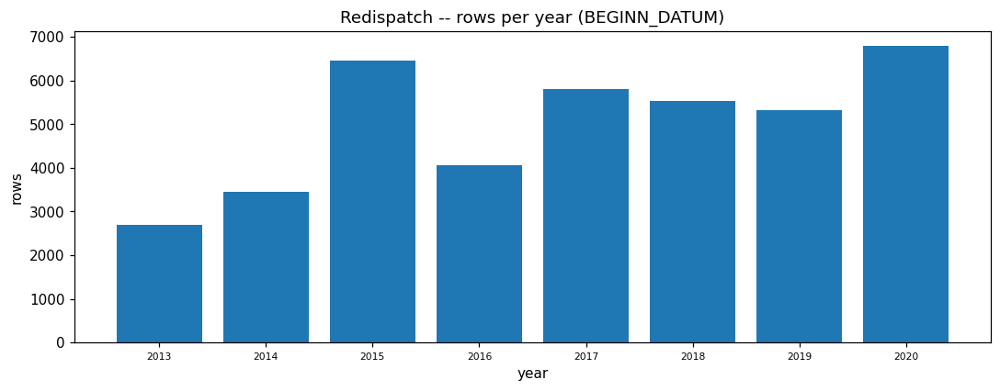

# REDISPATCH EDA PROFILE

_Auto-generated by the EDA notebooks (`databricks/eda/redispatch/`). One `## ` section per notebook; re-running a notebook replaces its own section, other sections are preserved._

<!-- BEGIN redispatch:01_redispatch -->
## Redispatch measures (redispatch_measures)

### Profile

| column | missing | rate | approx_distinct |
|---|---|---|---|
| coverage_regime | 0 | 0.0000 | 1 |
| BEGINN_DATUM | 0 | 0.0000 | 2566 |
| BEGINN_UHRZEIT | 0 | 0.0000 | 98 |
| ZEITZONE_VON | 0 | 0.0000 | 1 |
| ENDE_DATUM | 0 | 0.0000 | 2602 |
| ENDE_UHRZEIT | 0 | 0.0000 | 99 |
| ZEITZONE_BIS | 0 | 0.0000 | 1 |
| GRUND_DER_MASSNAHME | 27 | 0.0007 | 10 |
| RICHTUNG | 0 | 0.0000 | 2 |
| MITTLERE_LEISTUNG_MW | 0 | 0.0000 | 5707 |
| MAXIMALE_LEISTUNG_MW | 0 | 0.0000 | 1374 |
| GESAMTE_ARBEIT_MWH | 0 | 0.0000 | 7977 |
| ANWEISENDER_UENB | 0 | 0.0000 | 5 |
| ANFORDERNDER_UENB | 19 | 0.0005 | 33 |
| BETROFFENE_ANLAGE | 71 | 0.0018 | 726 |
| PRIMAERENERGIEART | 73 | 0.0018 | 3 |

Rows: 40118. Constant columns (exact): ['ZEITZONE_BIS', 'ZEITZONE_VON', 'coverage_regime'].

### Data Quality

Exact full-row duplicates: 568.
Rows where the end time precedes the start time: 109.

### Unit & Semantic Validation

Power/energy columns (unit in the name: MW instantaneous, MWH energy):
- `BEGINN_UHRZEIT`: parses as a number only 0.0% of the time -> this is a TEXT column (e.g. an affected-plant name / operator code), NOT a numeric column with unparsed values.
- `BETROFFENE_ANLAGE`: parses as a number only 0.0% of the time -> this is a TEXT column (e.g. an affected-plant name / operator code), NOT a numeric column with unparsed values.
- `ENDE_UHRZEIT`: parses as a number only 0.0% of the time -> this is a TEXT column (e.g. an affected-plant name / operator code), NOT a numeric column with unparsed values.
- `GESAMTE_ARBEIT_MWH`: numeric (parse yield 100.0%), range 0.0..55914.0, negative 0, zero 153 -- confirm the decimal separator (German comma) on the Silver cast.
- `MAXIMALE_LEISTUNG_MW`: numeric (parse yield 100.0%), range 0.0..4478.0, negative 0, zero 146 -- confirm the decimal separator (German comma) on the Silver cast.
- `MITTLERE_LEISTUNG_MW`: numeric (parse yield 100.0%), range 0.0..4338.0, negative 0, zero 144 -- confirm the decimal separator (German comma) on the Silver cast.

### Categorical / Domain Validation

`RICHTUNG` vs the known direction set: unexpected=none, unused=['Einspeisung erhoehen', 'Einspeisung reduzieren', 'Wirkleistungseinspeisung erhoehen'].
The known-direction list is best-effort (BNetzA wording varies with umlaut encoding / regime) -- an 'unexpected' value here is more likely a label-encoding difference than a bad value; inspect before treating it as a finding.

### Value Consistency

Value-consistency checks across the power / energy columns:
- MITTLERE_LEISTUNG_MW <= MAXIMALE_LEISTUNG_MW: 7/40118 violations (0.0174%).
- MITTLERE_LEISTUNG_MW >= 0: 0 violations.
- `work_mwh = implied_mwh` (implied = mean power x duration): 0/0 rows exceed 5% relative residual (None%); residual p01/p50/p99 None.

### Temporal Semantics

Measure start / end date columns (multi-format parse):
- `BEGINN_DATUM`: parse yield 100.0% of 40118, range 2013-04-02 00:00:00..2020-12-31 00:00:00, before 2010=0, future-dated=0, formats={'dd.MM.yyyy': 40118}.
- `ENDE_DATUM`: parse yield 100.0% of 40118, range 2013-04-02 00:00:00..2020-12-31 00:00:00, before 2010=0, future-dated=0, formats={'dd.MM.yyyy': 40118}.
- `ENDE_DATUM` < `BEGINN_DATUM` in 109 rows -> a validity-window check is needed at Silver.
Source timezone is Europe/Berlin wall-clock; start/end date and time are separate columns (BEGINN_DATUM + BEGINN_UHRZEIT) -- combine and convert to UTC on a documented rule before any join to an hourly grid.

### Regime / Version Evidence

Rows split on the measure start date at 2021-10-01 -- the NABEG / Redispatch 2.0 boundary. Per-column null-rate and category vocabulary each side.

- pre=40118, post=0, undated=0; columns flipping populated/empty: none.

Category vocabulary per regime (distinct value counts):
- pre (40118 rows): GRUND_DER_MASSNAHME=10, RICHTUNG=2, ANWEISENDER_UENB=5, ANFORDERNDER_UENB=33, PRIMAERENERGIEART=3
This is the measurable form of the Redispatch 2.0 regime change -- if columns flip or vocabularies differ, do not pool pre- and post-2021 rows without a regime indicator.

### Referential Integrity

There is NO shared key between redispatch_measures and power_plant_list / MaStR -- BETROFFENE_ANLAGE is a free-text plant name. A name-based reconciliation is a Silver task with its own match-rate and ambiguity to measure; this notebook only establishes that no join key exists in Bronze.

### Coverage & Sampling Bias

Observed rows per year: [(2013, 2688), (2014, 3461), (2015, 6462), (2016, 4058), (2017, 5810), (2018, 5526), (2019, 5321), (2020, 6792)].
Redispatch reporting moved to the 'NABEG 2.0 / Redispatch 2.0' regime in Oct 2021; if the observed window ends before then, this Bronze table is the OLD-regime extract and does not cover current redispatch -- a hard boundary for any model that assumes continuity.
`ANWEISENDER_UENB` has 5 distinct values -- grid-operator combinations; a few dominate (see Distributions), so a per-entity model faces a long tail.
`ANFORDERNDER_UENB` has 33 distinct values -- grid-operator combinations; a few dominate (see Distributions), so a per-entity model faces a long tail.

### Distributions

- `GRUND_DER_MASSNAHME`: - Strombedingter Redispatch: 34618
- Spannungsbedingter Redispatch: 3726
- Strombedingter Countertrade DE-DK1: 1078
- Probestart (NetzRes): 262
- Gezielter Leistungsausgleich bei Einspeisemanagement: 131
- Strom- und Spannungsbedingter RD: 84
- Strombedingter Countertrade DE-DK2: 77
- Strombedingter Countertrade DE-NO2: 74
- Testfahrt (KapRes): 31
- None: 27
- Funktionstest (KapRes): 10
- `RICHTUNG`: - Wirkleistungseinspeisung erhöhen: 21884
- Wirkleistungseinspeisung reduzieren: 18234
- `ANWEISENDER_UENB`: - TenneT DE: 17148
- TransnetBW: 9926
- 50Hertz: 6949
- Amprion: 6093
- PSE: 2
- `ANFORDERNDER_UENB`: - TenneT DE: 17967
- 50Hertz & Amprion & TenneT DE & TransnetBW: 6196
- 50Hertz & TenneT DE: 4905
- 50Hertz: 1993
- TenneT DE & Amprion: 1931
- Amprion: 1762
- 50Hertz & PSE: 1427
- TransnetBW: 1262
- TenneT DE & APG: 936
- Amprion & TransnetBW: 460
- APG: 408
- swissgrid: 178
- Ausland: 152
- PSE: 120
- TenneT DE & TransnetBW: 79
- ... (18 more)
- `PRIMAERENERGIEART`: - Konventionell: 31335
- Sonstiges: 8684
- None: 73
- Erneuerbar: 26
- `GESAMTE_ARBEIT_MWH`: min=0.0, max=55914.0, mean=1675.341968941622, sd=3017.225926617537, parsed 40118 of 40118 non-null.
- `MAXIMALE_LEISTUNG_MW`: min=0.0, max=4478.0, mean=290.02086594546086, sd=317.00707588719615, parsed 40118 of 40118 non-null.
- `MITTLERE_LEISTUNG_MW`: min=0.0, max=4338.0, mean=228.59076898150457, sd=244.582514178272, parsed 40118 of 40118 non-null.

### EDA Findings

- Constant columns: ['ZEITZONE_BIS', 'ZEITZONE_VON', 'coverage_regime'].
- 568 exact duplicate rows.
- Columns that are TEXT despite a numeric-looking name/shape: ['BEGINN_UHRZEIT', 'BETROFFENE_ANLAGE', 'ENDE_UHRZEIT'] (reported here so they are not mistaken for broken numeric columns).
- 109 rows have end time before start time.
- Coverage window: 2013..2020 (no rows after 2020).

### ML-Readiness Evidence

- **Grain / grain drift:** One row per redispatch measure. No entity id in Bronze -- the affected plant is a name string. A per-plant or per-operator model must first resolve that name (Silver).
- **Join multiplication (1:N / M:N expansion):** A future join to plant attributes on a resolved plant id is 1:N (many measures per plant) -- safe if aggregated to the measure, a cartesian risk if a plant name matches several plant-list rows.
- **Target contamination:** Candidate targets: the reason categorical, or the MW/MWH volume/duration. The realised end time, realised duration and realised energy MUST NOT be features for predicting whether/when a measure starts -- they are known only after the measure.
- **Temporal / post-event leakage:** Only information available at or before the measure's START time may be a feature; the ENDE_* columns and GESAMTE_ARBEIT_MWH are post-event.
- **Proxy leakage:** ANWEISENDER_UENB / ANFORDERNDER_UENB encode which TSO acted -- for some use cases that is a near-label (the reason a measure exists), not an independent feature.
- **Split / entity leakage:** Split by the affected plant / requesting TSO (once resolved) or by contiguous date range -- measures for the same plant in the same congestion event are highly correlated.
- **Historical-reference (point-in-time) leakage:** If plant attributes are joined in, use the plant's state AS OF the measure date, not its current state (a plant may have been decommissioned or repowered since).
- **Survivorship / coverage bias:** Coverage window 2013..2020. This is the pre-Redispatch-2.0 regime; a model trained on it does not describe current redispatch practice.
- **Missingness leakage:** GRUND_DER_MASSNAHME / PRIMAERENERGIEART / ANFORDERNDER_UENB have some missing values -- whether a field is filled can correlate with the measure type; check before an 'is-missing' feature.
- **Duplicate-event leakage:** 568 exact duplicate rows -- de-duplicate before counting measures as independent observations or splitting.
- **Target / feature temporal misalignment:** Start date/time and end date/time are separate columns -- a target defined on the start instant paired with features cut at the end instant (or vice versa) misaligns them.
- **Unit / sign / circular-feature leakage:** MITTLERE_LEISTUNG_MW <= MAXIMALE_LEISTUNG_MW and GESAMTE_ARBEIT_MWH ~ mean power x duration -- these three are near-collinear; using all as independent features is double-counting.
- **Data-generation-process leakage:** coverage_regime and ZEITZONE_* describe how the extract was produced, not the physical measure -- constant here, safe to drop, but a mixed-regime future extract would make coverage_regime a process feature.
- **Class / label instability:** GRUND_DER_MASSNAHME categories and the RICHTUNG labels are BNetzA reporting codes that changed with the Redispatch 2.0 regime -- a class defined by a raw label is only stable within one regime.
- **Label availability lag:** Redispatch measures are reported to BNetzA with a lag (weeks to months); a real-time model cannot assume the measure record exists at the measure time.
- **Source / version / regime change:** PRIMARY concern: the Oct-2021 Redispatch 2.0 switch changed reporting scope, thresholds and the actor model. Regime / Version Evidence above measures the null-rate and category-vocabulary shift across the 2021-10-01 cut -- do not pool pre- and post-2021 data without a regime indicator.
- **Sample-vs-full divergence:** Every statistic here is a full Spark aggregation or `.distinct().count()` -- no sampling.

### Silver Implications

- Drop constant columns ['ZEITZONE_BIS', 'ZEITZONE_VON', 'coverage_regime'] from Silver.
- Apply distinct on load to drop exact duplicate rows.
- Cast the MW / MWH columns to double with an explicit German-comma decimal rule; quarantine values that fail.
- Keep BETROFFENE_ANLAGE / *_UENB as text; reconcile the affected-plant name to a power_plant_list / MaStR unit id at Silver (fuzzy match -- there is no shared key).
- Silver grain: one row per redispatch measure/event; combine BEGINN_DATUM+UHRZEIT and ENDE_DATUM+UHRZEIT into UTC start/end timestamps and validate start <= end.

### Figure -- Redispatch measures -- overview

### Figure -- Redispatch -- rows per year (BEGINN_DATUM)

<!-- END redispatch:01_redispatch -->
