# REES46 EDA PROFILE

_Auto-generated by the EDA notebooks (`databricks/eda/rees46/`). One `## ` section per notebook; re-running a notebook replaces its own section, other sections are preserved._

<!-- BEGIN rees46:01_events -->
## REES46 ecommerce events (rees46_events)

### Profile

| column | missing rate | approx_distinct |
|---|---|---|
| event_time | 0.0000 | 5591832 |
| event_type | 0.0000 | 3 |
| product_id | 0.0000 | 208495 |
| category_id | 0.0000 | 671 |
| category_code | 0.3221 | 128 |
| brand | 0.1395 | 4452 |
| price | 0.0000 | 81087 |
| user_id | 0.0000 | 5291243 |
| user_session | 0.0000 | 22303598 |

Rows: 109950743. Constant columns: none. Cardinality is approximate (approx_count_distinct).

### Data Quality

Duplicate key ['user_session', 'product_id', 'event_type', 'event_time']: groups=75658, identical=75646, conflicting=12.
Zero/negative-price purchases: price<=0 in purchases = 0; negative price rows = 0.

Price / category / brand completeness by event_type:

| event_type | rows | price missing | price<=0 | category_code missing | brand missing |
|---|---|---|---|---|---|
| purchase | 1659788 | 0 | 0 | 407643 | 131667 |
| cart | 3955446 | 0 | 4558 | 932219 | 277337 |
| view | 104335509 | 0 | 252203 | 34073918 | 14932154 |

### Temporal

Day range: 2019-10-01 .. 2019-11-30.
Rows per month: [('2019-10', 42448764), ('2019-11', 67501979)].
Events by hour of day: [(0, 755539), (1, 1402424), (2, 2745296), (3, 3949563), (4, 4982552), (5, 5569872), (6, 5823993), (7, 5920460), (8, 6079148), (9, 6005441), (10, 5924965), (11, 5776755), (12, 5726176), (13, 6263336), (14, 7013663), (15, 7431991), (16, 7565811), (17, 7149551), (18, 5391767), (19, 3716881), (20, 2175813), (21, 1263940), (22, 753640), (23, 562166)].
Events by weekday: [('Fri', 18814507), ('Mon', 12739141), ('Sat', 18859791), ('Sun', 17351486), ('Thu', 14582640), ('Tue', 13890118), ('Wed', 13713060)].

### Entities / Keys

Approx distinct: user_id=5291243, product_id=208495, user_session=22303598, category_id=671, brand=4452.

Concentration:
- user_id: approx_distinct=5291243, top10=0.0009, top50=0.0021, max_one_entity=22929
- product_id: approx_distinct=208495, top10=0.0622, top50=0.1444, max_one_entity=1136760

Products with >1 category_id: 22; with >1 brand: 277.
category_id -> >1 category_code: 0; category_code -> >1 category_id: 58.
Multi-user sessions: 937.

### Distributions

| event_type | price min | max | avg | p50/95/99 |
|---|---|---|---|---|
| purchase | 0.77 | 2574.07 | 304.3475388242502 | [174.02, 1007.97, 1628.07] |
| cart | 0.0 | 2574.07 | 300.24630626479006 | [174.73, 1003.37, 1616.36] |
| view | 0.0 | 2574.07 | 291.1060965565274 | [163.97, 1003.85, 1706.0] |

Overall p99 price: 1706.0.
Top brands: [(None, 15341158), ('samsung', 13172020), ('apple', 10381933), ('xiaomi', 7721825), ('huawei', 2521331), ('lucente', 1840936), ('lg', 1659394), ('bosch', 1532149), ('oppo', 1294585), ('sony', 1255101)].
Top category_code: [(None, 35413780), ('electronics.smartphone', 27882231), ('electronics.clocks', 3397999), ('electronics.video.tv', 3321796), ('computers.notebook', 3318177), ('electronics.audio.headphone', 2917065), ('apparel.shoes', 2650791), ('appliances.environment.vacuum', 2329728), ('appliances.kitchen.refrigerators', 2314917), ('appliances.kitchen.washer', 2273270)].
Events per session (p50/90/99): [2, 11, 35], max 4128.
Purchases per user (p50/90/99): [0, 1, 5], max 640.

### Relationships

Event funnel: [('view', 104335509), ('cart', 3955446), ('purchase', 1659788)].
Sessions: 23016651; with view=23005603, with cart=2316433, with purchase=1402758; full view->cart->purchase path=937336.
view->cart session rate = 0.1004.
cart->purchase session rate = 0.4059.
Buyers: 697470; repeat buyers: 295325; multi-session users: 3057138; (user, product) rebought: 202354.
In-session sequence violations: purchase with no prior cart = 539567 of 1659788; cart with no prior view = 29848 of 3955446.
Same-timestamp burst sessions (>20 events on one event_time): 102. >1000-event sessions: 8.

### EDA Findings

- 12 duplicate ['user_session', 'product_id', 'event_type', 'event_time'] groups have conflicting non-key values.
- Columns with >10% missing: {'category_code': 0.322, 'brand': 0.14}.
- Funnel not strictly ordered in-session: 539567 purchases without a prior cart, 29848 carts without a prior view.
- Product attributes drift: 22 products with >1 category_id, 277 with >1 brand.
- category_id <-> category_code is not a clean 1:1 mapping (0 / 58 conflicts).
- 937 sessions span more than one user_id.
- 102 sessions show same-timestamp event bursts (likely bot/instrumentation).

### Silver Implications

- De-duplicate ['user_session', 'product_id', 'event_type', 'event_time'] with a deterministic rule; conflicting rows need explicit handling.
- Parse event_time to a timestamp; Silver grain = one row per event.
- category_code/brand are sparsely populated; keep as nullable dimensions with an 'unknown' member.
- Build the product/category dimension as SCD or last-seen; do not assume stable product attributes.
- Session grain must be (user_id, user_session), not user_session alone.

### Figure -- REES46 event_type funnel

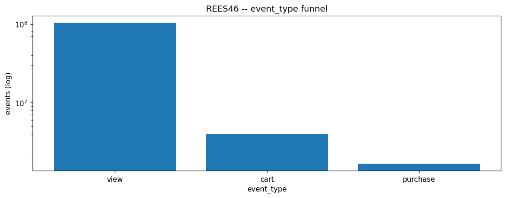

### Figure -- REES46 sessions reaching each funnel stage

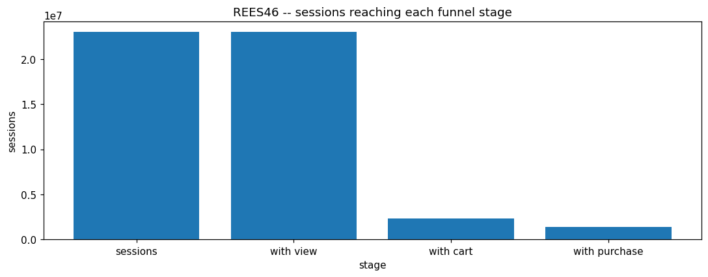

### Figure -- REES46 events by hour of day

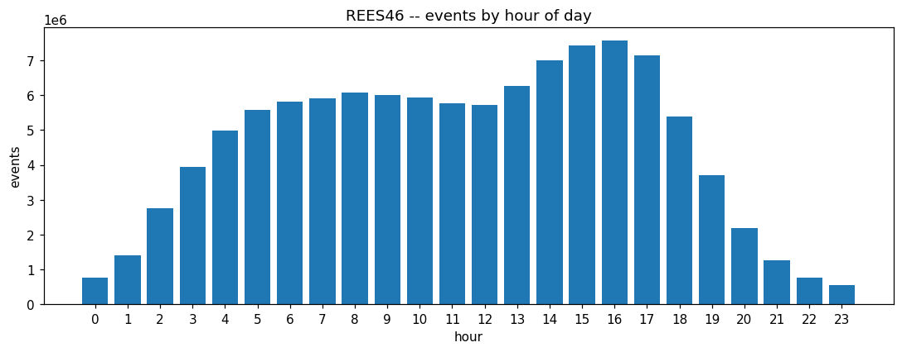

### Figure -- REES46 events by weekday

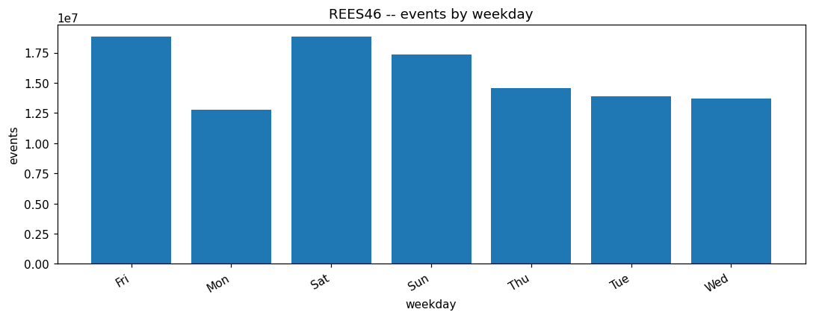

### Figure -- REES46 missing rate per column

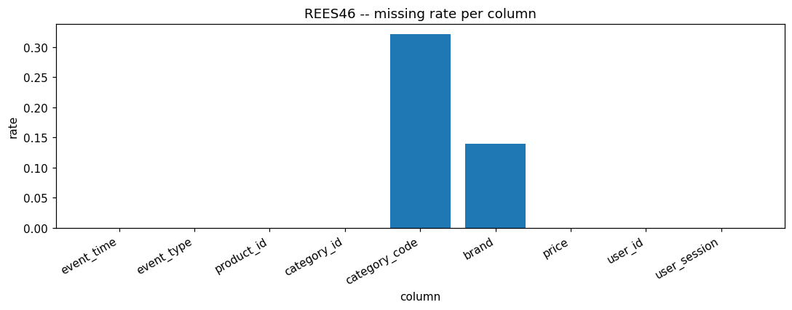

### Figure -- REES46 events per day

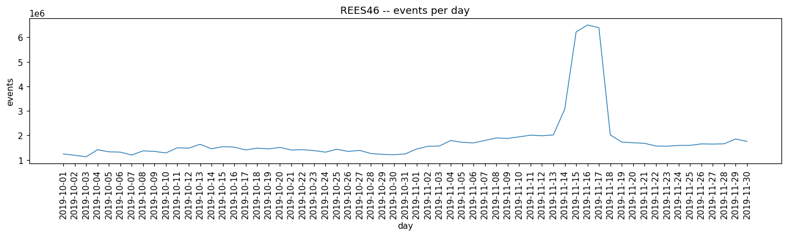

### Figure -- REES46 events per day by type

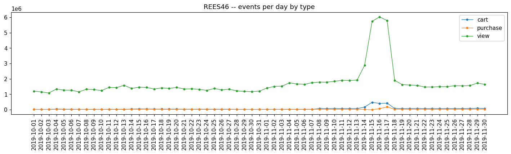

### Figure -- REES46 price distribution (sampled, clipped to p99)

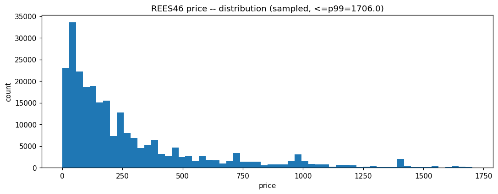

### Figure -- REES46 price distribution -- view (sampled)

### Figure -- REES46 price distribution -- cart (sampled)

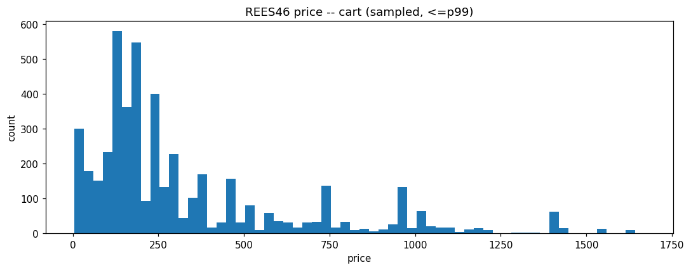

### Figure -- REES46 price distribution -- purchase (sampled)

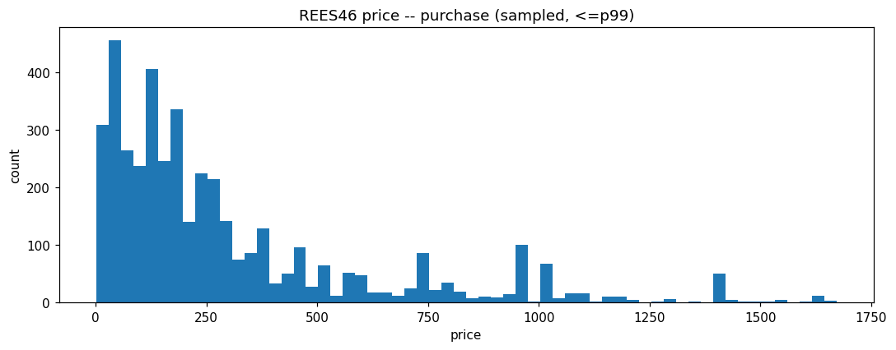

### Figure -- REES46 top brands by event volume

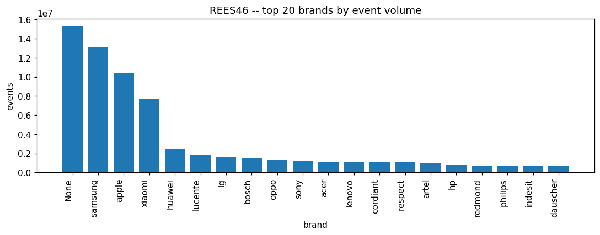

### Figure -- REES46 top 20 category_code by event volume

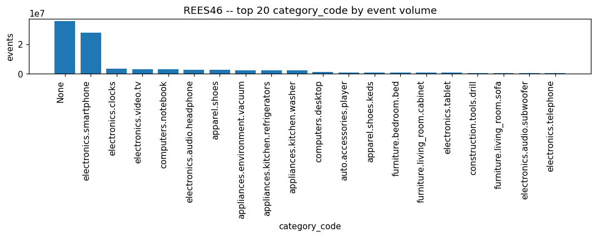

### Figure -- REES46 events per session distribution

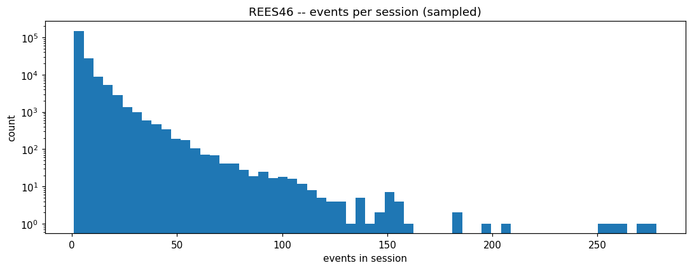

### Figure -- REES46 products with unstable category / brand

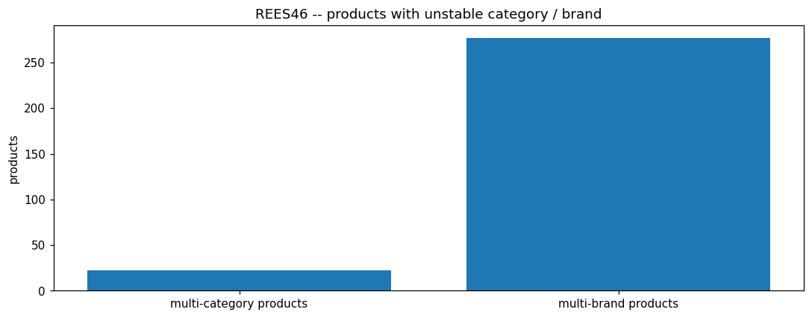

<!-- END rees46:01_events -->
