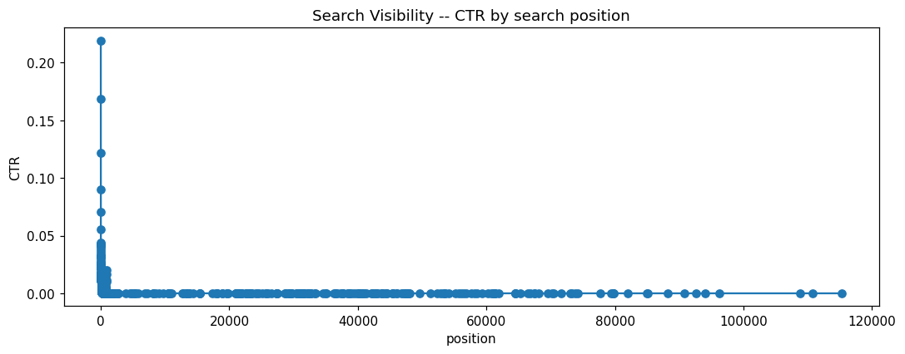
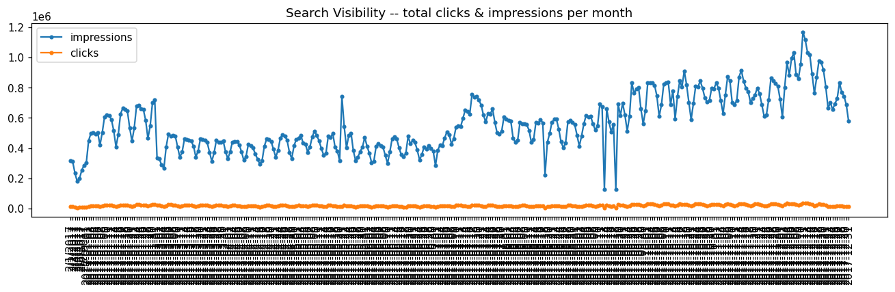
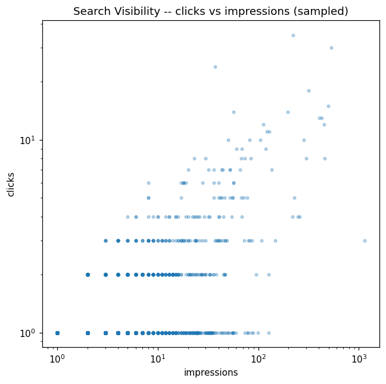
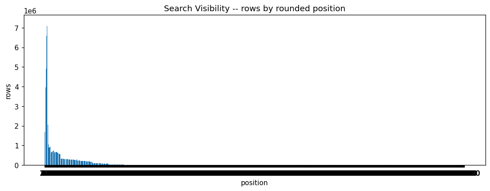
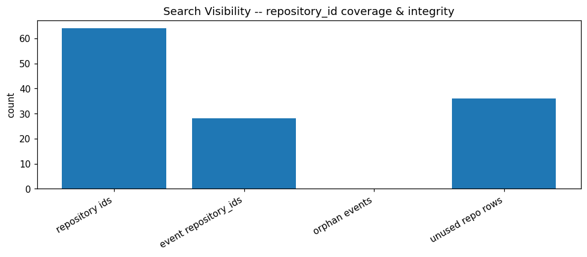
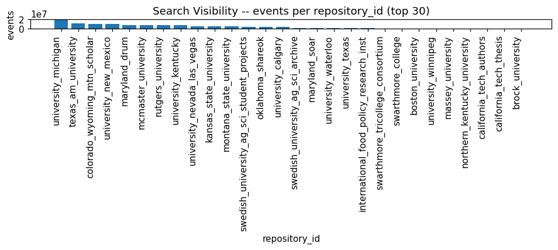

# SEARCH_VISIBILITY EDA PROFILE

_Auto-generated by the Phase 3 EDA notebooks (`databricks/eda/search_visibility/`). One `## ` section per notebook; re-running a notebook replaces its own section, other sections are preserved._

<!-- BEGIN search_visibility:01_events -->
## Search visibility events (search_visibility_events)

### Profile

| column | missing | rate | approx_distinct |
|---|---|---|---|
| citableContent | 0 | 0.0000 | 2 |
| clickThrough | 0 | 0.0000 | 5329 |
| clicks | 0 | 0.0000 | 145 |
| country | 0 | 0.0000 | 236 |
| date | 0 | 0.0000 | 361 |
| device | 0 | 0.0000 | 3 |
| impressions | 0 | 0.0000 | 1440 |
| index | 0 | 0.0000 | 28 |
| position | 0 | 0.0000 | 125682 |
| url | 0 | 0.0000 | 1475244 |
| repository_id | 0 | 0.0000 | 29 |

Rows: 111863691. Constant columns: none. `date` field granularity: daily/other (distinct day-of-month values: [1, 2, 3, 4, 5, 6, 7, 8, 9, 10, 11, 12, 13, 14, 15, 16, 17, 18, 19, 20, 21, 22, 23, 24, 25, 26, 27, 28, 29, 30, 31]).

### Data Quality

Candidate key ['repository_id', 'url', 'date', 'country', 'device']: distinct=98942513, unique=False, dup groups=9635135, fully identical=9165617, conflicting metrics=469515.
clicks > impressions rows: 0.
clickThrough vs clicks/impressions delta (p5/50/95): [0.0, 0.0, 0.0].

Negative-value counts: {}

### Temporal

Months present (11): ['2017-01', '2017-03', '2017-04', '2017-05', '2017-06', '2017-07', '2017-08', '2017-09', '2017-10', '2017-11', '2017-12'].
Missing months within span: ['2017-02'].
Rows per monthly archive: [('2/1/2017', 175441), ('2/2/2017', 179400), ('2/3/2017', 142703), ('2/4/2017', 113164), ('2/5/2017', 122018), ('2/6/2017', 148613), ('2/7/2017', 167236), ('2017-01-01', 206104), ('2017-01-02', 304120), ('2017-01-03', 313716), ('2017-01-04', 317514), ('2017-01-05', 302536), ('2017-01-06', 316786), ('2017-01-07', 278490), ('2017-01-08', 321052), ('2017-01-09', 364676), ('2017-01-10', 370616), ('2017-01-11', 363410), ('2017-01-12', 352084), ('2017-01-13', 319688), ('2017-01-14', 269198), ('2017-01-15', 309088), ('2017-01-16', 377024), ('2017-01-17', 391748), ('2017-01-18', 387056), ('2017-01-19', 371612), ('2017-01-20', 334252), ('2017-01-21', 291470), ('2017-01-22', 330840), ('2017-01-23', 399530), ('2017-01-24', 399358), ('2017-01-25', 388066), ('2017-01-26', 385452), ('2017-01-27', 344996), ('2017-01-28', 294832), ('2017-01-29', 326764), ('2017-01-30', 401208), ('2017-01-31', 404594), ('2017-03-01', 177502), ('2017-03-02', 174858), ('2017-03-03', 165869), ('2017-03-04', 155270), ('2017-03-05', 239961), ('2017-03-06', 277710), ('2017-03-07', 271437), ('2017-03-08', 274626), ('2017-03-09', 276764), ('2017-03-10', 243529), ('2017-03-11', 212766), ('2017-03-12', 227748), ('2017-03-13', 265938), ('2017-03-14', 264709), ('2017-03-15', 258136), ('2017-03-16', 249461), ('2017-03-17', 227657), ('2017-03-18', 200974), ('2017-03-19', 216876), ('2017-03-20', 254464), ('2017-03-21', 259337), ('2017-03-22', 258565), ('2017-03-23', 252580), ('2017-03-24', 222771), ('2017-03-25', 192394), ('2017-03-26', 218181), ('2017-03-27', 262116), ('2017-03-28', 251130), ('2017-03-29', 249287), ('2017-03-30', 246371), ('2017-03-31', 223924), ('2017-04-01', 208954), ('2017-04-02', 223630), ('2017-04-03', 255023), ('2017-04-04', 256600), ('2017-04-05', 255048), ('2017-04-06', 243348), ('2017-04-07', 232082), ('2017-04-08', 206890), ('2017-04-09', 205941), ('2017-04-10', 240741), ('2017-04-11', 239512), ('2017-04-12', 234995), ('2017-04-13', 218318), ('2017-04-14', 205985), ('2017-04-15', 188119), ('2017-04-16', 189523), ('2017-04-17', 232721), ('2017-04-18', 264950), ('2017-04-19', 267347), ('2017-04-20', 260630), ('2017-04-21', 242966), ('2017-04-22', 214561), ('2017-04-23', 232362), ('2017-04-24', 261254), ('2017-04-25', 273820), ('2017-04-26', 275545), ('2017-04-27', 263556), ('2017-04-28', 224524), ('2017-04-29', 209248), ('2017-04-30', 258751), ('2017-05-01', 269683), ('2017-05-02', 269599), ('2017-05-03', 281457), ('2017-05-04', 241902), ('2017-05-05', 247844), ('2017-05-06', 232550), ('2017-05-07', 236783), ('2017-05-08', 265495), ('2017-05-09', 294793), ('2017-05-10', 276816), ('2017-05-11', 256250), ('2017-05-12', 237372), ('2017-05-13', 218810), ('2017-05-14', 224340), ('2017-05-15', 280096), ('2017-05-16', 268568), ('2017-05-17', 286048), ('2017-05-18', 239195), ('2017-05-19', 236390), ('2017-05-20', 203437), ('2017-05-21', 228411), ('2017-05-22', 266621), ('2017-05-23', 238776), ('2017-05-24', 294743), ('2017-05-25', 300713), ('2017-05-26', 237949), ('2017-05-27', 202488), ('2017-05-28', 214911), ('2017-05-29', 235057), ('2017-05-30', 245493), ('2017-05-31', 295624), ('2017-06-01', 255082), ('2017-06-02', 228961), ('2017-06-03', 196140), ('2017-06-04', 194745), ('2017-06-05', 247187), ('2017-06-06', 261612), ('2017-06-07', 252346), ('2017-06-08', 245643), ('2017-06-09', 216090), ('2017-06-10', 188755), ('2017-06-11', 228123), ('2017-06-12', 274417), ('2017-06-13', 282089), ('2017-06-14', 271420), ('2017-06-15', 244071), ('2017-06-16', 225074), ('2017-06-17', 218994), ('2017-06-18', 223453), ('2017-06-19', 291541), ('2017-06-20', 259260), ('2017-06-21', 275237), ('2017-06-22', 270278), ('2017-06-23', 247482), ('2017-06-24', 206833), ('2017-06-25', 222401), ('2017-06-26', 246664), ('2017-06-27', 241013), ('2017-06-28', 254028), ('2017-06-29', 247300), ('2017-06-30', 240701), ('2017-07-01', 186114), ('2017-07-02', 247907), ('2017-07-03', 272211), ('2017-07-04', 272891), ('2017-07-05', 295235), ('2017-07-06', 314803), ('2017-07-07', 307196), ('2017-07-08', 272996), ('2017-07-09', 292177), ('2017-07-10', 317598), ('2017-07-11', 336544), ('2017-07-12', 335196), ('2017-07-13', 374140), ('2017-07-14', 397604), ('2017-07-15', 387476), ('2017-07-16', 396461), ('2017-07-17', 464474), ('2017-07-18', 457716), ('2017-07-19', 453429), ('2017-07-20', 443244), ('2017-07-21', 435558), ('2017-07-22', 397915), ('2017-07-23', 366875), ('2017-07-24', 395026), ('2017-07-25', 390065), ('2017-07-26', 421445), ('2017-07-27', 358853), ('2017-07-28', 319662), ('2017-07-29', 329692), ('2017-07-30', 324960), ('2017-07-31', 382626), ('2017-08-01', 371425), ('2017-08-02', 364018), ('2017-08-03', 365165), ('2017-08-04', 305998), ('2017-08-05', 294378), ('2017-08-06', 299922), ('2017-08-07', 349422), ('2017-08-08', 346613), ('2017-08-09', 345071), ('2017-08-10', 346120), ('2017-08-11', 330707), ('2017-08-12', 289781), ('2017-08-13', 291720), ('2017-08-14', 353564), ('2017-08-15', 345877), ('2017-08-16', 361137), ('2017-08-17', 340036), ('2017-08-18', 143765), ('2017-08-19', 280966), ('2017-08-20', 313082), ('2017-08-21', 344983), ('2017-08-22', 360525), ('2017-08-23', 348448), ('2017-08-24', 325072), ('2017-08-25', 282192), ('2017-08-26', 271024), ('2017-08-27', 276238), ('2017-08-28', 341574), ('2017-08-29', 346562), ('2017-08-30', 334665), ('2017-08-31', 335959), ('2017-09-01', 300795), ('2017-09-02', 270012), ('2017-09-03', 301784), ('2017-09-04', 342313), ('2017-09-05', 357703), ('2017-09-06', 345539), ('2017-09-07', 357951), ('2017-09-08', 338820), ('2017-09-09', 334858), ('2017-09-10', 334366), ('2017-09-11', 393261), ('2017-09-12', 386135), ('2017-09-13', 69800), ('2017-09-14', 378882), ('2017-09-15', 347198), ('2017-09-16', 335714), ('2017-09-17', 339569), ('2017-09-18', 72257), ('2017-09-19', 404066), ('2017-09-20', 355172), ('2017-09-21', 404612), ('2017-09-22', 377675), ('2017-09-23', 320574), ('2017-09-24', 358458), ('2017-09-25', 433945), ('2017-09-26', 426049), ('2017-09-27', 436576), ('2017-09-28', 446289), ('2017-09-29', 387573), ('2017-09-30', 351178), ('2017-10-01', 372353), ('2017-10-02', 455345), ('2017-10-03', 450233), ('2017-10-04', 457188), ('2017-10-05', 446328), ('2017-10-06', 435430), ('2017-10-07', 380206), ('2017-10-08', 393491), ('2017-10-09', 446717), ('2017-10-10', 450460), ('2017-10-11', 447624), ('2017-10-12', 385912), ('2017-10-13', 424051), ('2017-10-14', 357277), ('2017-10-15', 398955), ('2017-10-16', 447693), ('2017-10-17', 433098), ('2017-10-18', 444736), ('2017-10-19', 436465), ('2017-10-20', 407791), ('2017-10-21', 354967), ('2017-10-22', 396186), ('2017-10-23', 432941), ('2017-10-24', 430600), ('2017-10-25', 438570), ('2017-10-26', 421440), ('2017-10-27', 391748), ('2017-10-28', 358580), ('2017-10-29', 366365), ('2017-10-30', 425608), ('2017-10-31', 422343), ('2017-11-01', 423488), ('2017-11-02', 423417), ('2017-11-03', 396983), ('2017-11-04', 368435), ('2017-11-05', 410290), ('2017-11-06', 457417), ('2017-11-09', 441436), ('2017-11-10', 407593), ('2017-11-11', 395688), ('2017-11-12', 401045), ('2017-11-13', 440958), ('2017-11-14', 444207), ('2017-11-15', 437945), ('2017-11-16', 414103), ('2017-11-17', 406111), ('2017-11-18', 379724), ('2017-11-19', 396706), ('2017-11-20', 400327), ('2017-11-21', 437992), ('2017-11-22', 437058), ('2017-11-23', 411241), ('2017-11-24', 373865), ('2017-11-25', 379648), ('2017-11-26', 418339), ('2017-11-27', 465602), ('2017-11-28', 448843), ('2017-11-29', 439265), ('2017-11-30', 433905), ('2017-12-01', 403175), ('2017-12-02', 362091), ('2017-12-03', 441429), ('2017-12-04', 493472), ('2017-12-05', 456899), ('2017-12-06', 517093), ('2017-12-07', 537531), ('2017-12-08', 493207), ('2017-12-09', 448943), ('2017-12-10', 506719), ('2017-12-11', 593888), ('2017-12-12', 576382), ('2017-12-13', 554679), ('2017-12-14', 553845), ('2017-12-15', 505207), ('2017-12-16', 477584), ('2017-12-17', 523728), ('2017-12-18', 559631), ('2017-12-19', 562809), ('2017-12-20', 538008), ('2017-12-21', 488908), ('2017-12-22', 426059), ('2017-12-23', 451573), ('2017-12-24', 420728), ('2017-12-25', 438460), ('2017-12-26', 452743), ('2017-12-27', 499275), ('2017-12-28', 452833), ('2017-12-29', 412877), ('2017-12-30', 430211), ('2017-12-31', 386686)].

### Entities / Keys

Per-repository coverage (urls / dates / countries):

| repository_id | urls | dates | countries |
|---|---|---|---|
| boston_university | 22666 | 14 | 217 |
| brock_university | 492 | 1 | 93 |
| california_tech_authors | 3796 | 23 | 168 |
| california_tech_thesis | 765 | 23 | 121 |
| colorado_wyoming_mtn_scholar | 125250 | 340 | 236 |
| international_food_policy_research_inst | 16135 | 28 | 230 |
| kansas_state_university | 89759 | 246 | 230 |
| maryland_drum | 73914 | 340 | 236 |
| maryland_soar | 13128 | 340 | 230 |
| massey_university | 3735 | 35 | 213 |
| mcmaster_university | 51917 | 340 | 233 |
| montana_state_university | 46380 | 340 | 234 |
| northern_kentucky_university | 1712 | 62 | 190 |
| oklahoma_shareok | 68371 | 178 | 231 |
| rutgers_university | 73973 | 334 | 231 |
| swarthmore_college | 6460 | 154 | 220 |
| swarthmore_tricollege_consortium | 12068 | 127 | 228 |
| swedish_university_ag_sci_archive | 26411 | 98 | 230 |
| swedish_university_ag_sci_student_projects | 29479 | 96 | 230 |
| texas_am_university | 173721 | 333 | 231 |
| university_calgary | 56664 | 331 | 230 |
| university_kentucky | 51928 | 177 | 236 |
| university_michigan | 255860 | 339 | 236 |
| university_nevada_las_vegas | 35086 | 237 | 234 |
| university_new_mexico | 187735 | 342 | 234 |
| university_texas | 69408 | 21 | 226 |
| university_waterloo | 25236 | 26 | 226 |
| university_winnipeg | 3367 | 260 | 214 |

url approx distinct: 1475244; repository_id approx distinct: 29.

### Coverage

- country: [('usa', 25490035), ('ind', 8448034), ('gbr', 4887781), ('can', 4324688), ('bra', 3435637), ('phl', 2855378), ('deu', 2224973), ('swe', 2215745), ('fra', 2215465), ('aus', 2146084), ('chn', 2108383), ('rus', 1831178), ('kor', 1784040), ('pak', 1783380), ('idn', 1771097), ('ita', 1756684), ('jpn', 1614881), ('esp', 1551850), ('mys', 1530609), ('tur', 1247024), ('vnm', 1222985), ('nld', 1209492), ('pol', 1109487), ('tha', 1108969), ('mex', 1101511), ('twn', 1029311), ('zaf', 1015062), ('rou', 983858), ('egy', 974481), ('arg', 895385)]
- device: [('DESKTOP', 86777116), ('MOBILE', 21824327), ('TABLET', 3262248)]
- citableContent: [('Yes', 87502982), ('No', 24360709)]

### Distributions

| metric | min | max | avg |
|---|---|---|---|
| clicks | 0.0 | 165.0 | 0.06068590209489869 |
| impressions | 1.0 | 260271.0 | 1.7117934719318353 |
| clickThrough | 0.0 | 1.0 | 0.03266490600586148 |
| position | 1.0 | 115321.0 | 45.2833208843311 |
| index | None | None | None |

position percentiles (10/25/50/75/90/99): [4.5, 7.0, 16.0, 62.5, 127.5, 276.0].
clicks percentiles (50/90/99): [0.0, 0.0, 1.0].
impressions percentiles (50/90/99): [1.0, 3.0, 11.0].
CTR by rounded position: [(1.0, 0.2192), (2.0, 0.1683), (3.0, 0.1217), (4.0, 0.0902), (5.0, 0.0703), (6.0, 0.0551), (7.0, 0.0427), (8.0, 0.0328), (9.0, 0.026), (10.0, 0.0243), (11.0, 0.0408), (12.0, 0.0433), (13.0, 0.0436), (14.0, 0.0418), (15.0, 0.0393), (16.0, 0.0375), (17.0, 0.0353), (18.0, 0.0334), (19.0, 0.032), (20.0, 0.0326), (21.0, 0.0314), (22.0, 0.0301), (23.0, 0.0283), (24.0, 0.0269), (25.0, 0.0252), (26.0, 0.0241), (27.0, 0.023), (28.0, 0.0219), (29.0, 0.0213), (30.0, 0.0217), (31.0, 0.0189), (32.0, 0.018), (33.0, 0.0172), (34.0, 0.0165), (35.0, 0.0162), (36.0, 0.0152), (37.0, 0.0148), (38.0, 0.0143), (39.0, 0.0142), (40.0, 0.015), (41.0, 0.013), (42.0, 0.0124), (43.0, 0.0123), (44.0, 0.0117), (45.0, 0.0116), (46.0, 0.0116), (47.0, 0.0118), (48.0, 0.0115), (49.0, 0.0113), (50.0, 0.0121), (51.0, 0.013), (52.0, 0.0128), (53.0, 0.0127), (54.0, 0.0123), (55.0, 0.0117), (56.0, 0.0111), (57.0, 0.011), (58.0, 0.0111), (59.0, 0.011), (60.0, 0.0114), (61.0, 0.0101), (62.0, 0.0095), (63.0, 0.0091), (64.0, 0.009), (65.0, 0.0089), (66.0, 0.0088), (67.0, 0.0084), (68.0, 0.0081), (69.0, 0.0082), (70.0, 0.0087), (71.0, 0.0078), (72.0, 0.0073), (73.0, 0.0072), (74.0, 0.0072), (75.0, 0.0069), (76.0, 0.0064), (77.0, 0.0064), (78.0, 0.0061), (79.0, 0.0062), (80.0, 0.0065), (81.0, 0.0058), (82.0, 0.0057), (83.0, 0.0053), (84.0, 0.0052), (85.0, 0.0051), (86.0, 0.0049), (87.0, 0.0048), (88.0, 0.0047), (89.0, 0.0048), (90.0, 0.0052), (91.0, 0.0048), (92.0, 0.0049), (93.0, 0.0047), (94.0, 0.0044), (95.0, 0.0043), (96.0, 0.0044), (97.0, 0.0043), (98.0, 0.004), (99.0, 0.0042), (100.0, 0.0048), (101.0, 0.0031), (102.0, 0.0036), (103.0, 0.0035), (104.0, 0.0033), (105.0, 0.0032), (106.0, 0.0033), (107.0, 0.003), (108.0, 0.003), (109.0, 0.0033), (110.0, 0.0033), (111.0, 0.0027), (112.0, 0.0028), (113.0, 0.0025), (114.0, 0.0025), (115.0, 0.0026), (116.0, 0.0024), (117.0, 0.0025), (118.0, 0.0023), (119.0, 0.0025), (120.0, 0.0027), (121.0, 0.0023), (122.0, 0.0021), (123.0, 0.0021), (124.0, 0.002), (125.0, 0.002), (126.0, 0.0017), (127.0, 0.0018), (128.0, 0.0018), (129.0, 0.0019), (130.0, 0.0022), (131.0, 0.0019), (132.0, 0.0019), (133.0, 0.0015), (134.0, 0.0017), (135.0, 0.0017), (136.0, 0.0016), (137.0, 0.0016), (138.0, 0.0017), (139.0, 0.0017), (140.0, 0.0017), (141.0, 0.0015), (142.0, 0.0015), (143.0, 0.0015), (144.0, 0.0016), (145.0, 0.0014), (146.0, 0.0013), (147.0, 0.0014), (148.0, 0.0014), (149.0, 0.0013), (150.0, 0.0014), (151.0, 0.0016), (152.0, 0.002), (153.0, 0.0016), (154.0, 0.0016), (155.0, 0.0015), (156.0, 0.0015), (157.0, 0.0016), (158.0, 0.0016), (159.0, 0.0016), (160.0, 0.0017), (161.0, 0.0015), (162.0, 0.0015), (163.0, 0.0015), (164.0, 0.0014), (165.0, 0.0013), (166.0, 0.0012), (167.0, 0.0015), (168.0, 0.0013), (169.0, 0.0013), (170.0, 0.0014), (171.0, 0.0013), (172.0, 0.0015), (173.0, 0.0014), (174.0, 0.0011), (175.0, 0.0013), (176.0, 0.0012), (177.0, 0.0011), (178.0, 0.0012), (179.0, 0.0014), (180.0, 0.0013), (181.0, 0.001), (182.0, 0.0011), (183.0, 0.0011), (184.0, 0.0009), (185.0, 0.0011), (186.0, 0.0011), (187.0, 0.001), (188.0, 0.0009), (189.0, 0.001), (190.0, 0.001), (191.0, 0.0009), (192.0, 0.001), (193.0, 0.0009), (194.0, 0.001), (195.0, 0.001), (196.0, 0.0008), (197.0, 0.001), (198.0, 0.0009), (199.0, 0.0009), (200.0, 0.0012), (201.0, 0.0014), (202.0, 0.0017), (203.0, 0.0014), (204.0, 0.0011), (205.0, 0.0013), (206.0, 0.0015), (207.0, 0.0015), (208.0, 0.0013), (209.0, 0.0013), (210.0, 0.0015), (211.0, 0.0012), (212.0, 0.001), (213.0, 0.0015), (214.0, 0.0011), (215.0, 0.0012), (216.0, 0.0014), (217.0, 0.0012), (218.0, 0.0012), (219.0, 0.0011), (220.0, 0.0014), (221.0, 0.0011), (222.0, 0.0014), (223.0, 0.0009), (224.0, 0.0007), (225.0, 0.001), (226.0, 0.001), (227.0, 0.0012), (228.0, 0.0011), (229.0, 0.0015), (230.0, 0.0013), (231.0, 0.001), (232.0, 0.001), (233.0, 0.0009), (234.0, 0.0008), (235.0, 0.0013), (236.0, 0.001), (237.0, 0.0011), (238.0, 0.0012), (239.0, 0.001), (240.0, 0.0014), (241.0, 0.0009), (242.0, 0.0012), (243.0, 0.001), (244.0, 0.0009), (245.0, 0.0015), (246.0, 0.001), (247.0, 0.001), (248.0, 0.0008), (249.0, 0.0011), (250.0, 0.0011), (251.0, 0.0009), (252.0, 0.0013), (253.0, 0.0014), (254.0, 0.0011), (255.0, 0.0013), (256.0, 0.0008), (257.0, 0.0016), (258.0, 0.0017), (259.0, 0.0011), (260.0, 0.0011), (261.0, 0.0008), (262.0, 0.0008), (263.0, 0.0016), (264.0, 0.0012), (265.0, 0.0012), (266.0, 0.001), (267.0, 0.0012), (268.0, 0.0013), (269.0, 0.0013), (270.0, 0.0007), (271.0, 0.0008), (272.0, 0.0007), (273.0, 0.0013), (274.0, 0.0007), (275.0, 0.0008), (276.0, 0.0013), (277.0, 0.0007), (278.0, 0.0008), (279.0, 0.0011), (280.0, 0.0011), (281.0, 0.001), (282.0, 0.0009), (283.0, 0.0007), (284.0, 0.0012), (285.0, 0.0007), (286.0, 0.0008), (287.0, 0.0007), (288.0, 0.001), (289.0, 0.0006), (290.0, 0.0012), (291.0, 0.0007), (292.0, 0.0009), (293.0, 0.0003), (294.0, 0.0005), (295.0, 0.0006), (296.0, 0.0009), (297.0, 0.0006), (298.0, 0.0009), (299.0, 0.0015), (300.0, 0.0007), (301.0, 0.0009), (302.0, 0.0006), (303.0, 0.0009), (304.0, 0.0006), (305.0, 0.0006), (306.0, 0.0008), (307.0, 0.0006), (308.0, 0.0007), (309.0, 0.0011), (310.0, 0.0007), (311.0, 0.0002), (312.0, 0.0009), (313.0, 0.0006), (314.0, 0.0), (315.0, 0.0009), (316.0, 0.0003), (317.0, 0.001), (318.0, 0.0006), (319.0, 0.0008), (320.0, 0.0006), (321.0, 0.0009), (322.0, 0.0008), (323.0, 0.0005), (324.0, 0.0006), (325.0, 0.0004), (326.0, 0.0007), (327.0, 0.0006), (328.0, 0.001), (329.0, 0.0008), (330.0, 0.0004), (331.0, 0.0008), (332.0, 0.0004), (333.0, 0.0005), (334.0, 0.0008), (335.0, 0.0006), (336.0, 0.0), (337.0, 0.0006), (338.0, 0.0008), (339.0, 0.0005), (340.0, 0.0011), (341.0, 0.0005), (342.0, 0.001), (343.0, 0.0006), (344.0, 0.0009), (345.0, 0.0002), (346.0, 0.0008), (347.0, 0.0005), (348.0, 0.0006), (349.0, 0.0013), (350.0, 0.0011), (351.0, 0.0003), (352.0, 0.001), (353.0, 0.0014), (354.0, 0.0009), (355.0, 0.0008), (356.0, 0.0008), (357.0, 0.0007), (358.0, 0.0), (359.0, 0.0007), (360.0, 0.0007), (361.0, 0.0007), (362.0, 0.0), (363.0, 0.0005), (364.0, 0.0004), (365.0, 0.0008), (366.0, 0.0008), (367.0, 0.0002), (368.0, 0.0013), (369.0, 0.0009), (370.0, 0.0008), (371.0, 0.0002), (372.0, 0.0006), (373.0, 0.0004), (374.0, 0.0002), (375.0, 0.0008), (376.0, 0.0004), (377.0, 0.001), (378.0, 0.0008), (379.0, 0.0008), (380.0, 0.0011), (381.0, 0.0009), (382.0, 0.0004), (383.0, 0.0007), (384.0, 0.0), (385.0, 0.0007), (386.0, 0.0004), (387.0, 0.0014), (388.0, 0.0005), (389.0, 0.0005), (390.0, 0.0009), (391.0, 0.0005), (392.0, 0.0002), (393.0, 0.0009), (394.0, 0.0007), (395.0, 0.0013), (396.0, 0.0005), (397.0, 0.0014), (398.0, 0.0018), (399.0, 0.0023), (400.0, 0.0022), (401.0, 0.0004), (402.0, 0.002), (403.0, 0.0012), (404.0, 0.0012), (405.0, 0.0004), (406.0, 0.0012), (407.0, 0.0017), (408.0, 0.0013), (409.0, 0.0004), (410.0, 0.0021), (411.0, 0.0009), (412.0, 0.0008), (413.0, 0.0), (414.0, 0.0014), (415.0, 0.0013), (416.0, 0.0005), (417.0, 0.0009), (418.0, 0.0014), (419.0, 0.001), (420.0, 0.0), (421.0, 0.0), (422.0, 0.0), (423.0, 0.0005), (424.0, 0.0), (425.0, 0.001), (426.0, 0.0), (427.0, 0.001), (428.0, 0.0005), (429.0, 0.002), (430.0, 0.0016), (431.0, 0.0016), (432.0, 0.0005), (433.0, 0.0), (434.0, 0.0005), (435.0, 0.0012), (436.0, 0.0), (437.0, 0.0011), (438.0, 0.0005), (439.0, 0.0006), (440.0, 0.0005), (441.0, 0.0012), (442.0, 0.0017), (443.0, 0.0006), (444.0, 0.0012), (445.0, 0.0012), (446.0, 0.0006), (447.0, 0.0013), (448.0, 0.0006), (449.0, 0.0012), (450.0, 0.0012), (451.0, 0.0015), (452.0, 0.0008), (453.0, 0.0008), (454.0, 0.0008), (455.0, 0.0016), (456.0, 0.0031), (457.0, 0.0024), (458.0, 0.0024), (459.0, 0.0016), (460.0, 0.0017), (461.0, 0.0026), (462.0, 0.0008), (463.0, 0.0017), (464.0, 0.0008), (465.0, 0.0008), (466.0, 0.0009), (467.0, 0.0035), (468.0, 0.0025), (469.0, 0.0), (470.0, 0.0018), (471.0, 0.0009), (472.0, 0.001), (473.0, 0.0009), (474.0, 0.001), (475.0, 0.001), (476.0, 0.0029), (477.0, 0.0), (478.0, 0.0029), (479.0, 0.0009), (480.0, 0.0), (481.0, 0.0019), (482.0, 0.001), (483.0, 0.0029), (484.0, 0.0), (485.0, 0.0), (486.0, 0.001), (487.0, 0.001), (488.0, 0.001), (489.0, 0.001), (490.0, 0.0), (491.0, 0.0011), (492.0, 0.0), (493.0, 0.0011), (494.0, 0.0012), (495.0, 0.0), (496.0, 0.0), (497.0, 0.0), (498.0, 0.0023), (499.0, 0.0), (500.0, 0.0022), (501.0, 0.0023), (502.0, 0.0012), (503.0, 0.0), (504.0, 0.0), (505.0, 0.0), (506.0, 0.0), (507.0, 0.0), (508.0, 0.0), (509.0, 0.001), (510.0, 0.0), (511.0, 0.0), (512.0, 0.0), (513.0, 0.0012), (514.0, 0.0), (515.0, 0.0), (516.0, 0.0), (517.0, 0.0), (518.0, 0.0012), (519.0, 0.0012), (520.0, 0.0), (521.0, 0.0), (522.0, 0.0013), (523.0, 0.0012), (524.0, 0.0), (525.0, 0.0), (526.0, 0.0), (527.0, 0.0), (528.0, 0.0), (529.0, 0.0014), (530.0, 0.0), (531.0, 0.0013), (532.0, 0.0), (533.0, 0.0), (534.0, 0.0), (535.0, 0.0014), (536.0, 0.0015), (537.0, 0.0), (538.0, 0.0), (539.0, 0.0013), (540.0, 0.003), (541.0, 0.0), (542.0, 0.0016), (543.0, 0.0), (544.0, 0.0), (545.0, 0.0), (546.0, 0.0), (547.0, 0.0), (548.0, 0.0), (549.0, 0.0), (550.0, 0.0016), (551.0, 0.0), (552.0, 0.0), (553.0, 0.0), (554.0, 0.0016), (555.0, 0.0), (556.0, 0.0), (557.0, 0.0), (558.0, 0.0), (559.0, 0.0), (560.0, 0.0), (561.0, 0.0), (562.0, 0.0), (563.0, 0.0019), (564.0, 0.0019), (565.0, 0.0), (566.0, 0.0), (567.0, 0.0018), (568.0, 0.0), (569.0, 0.0), (570.0, 0.0), (571.0, 0.0), (572.0, 0.002), (573.0, 0.0), (574.0, 0.0), (575.0, 0.0), (576.0, 0.0), (577.0, 0.0022), (578.0, 0.0019), (579.0, 0.0), (580.0, 0.002), (581.0, 0.0018), (582.0, 0.0), (583.0, 0.0), (584.0, 0.0), (585.0, 0.0021), (586.0, 0.0), (587.0, 0.0), (588.0, 0.0), (589.0, 0.0), (590.0, 0.0), (591.0, 0.0), (592.0, 0.0), (593.0, 0.0), (594.0, 0.0), (595.0, 0.0), (596.0, 0.0), (597.0, 0.0), (598.0, 0.0), (599.0, 0.0), (600.0, 0.0022), (601.0, 0.0), (602.0, 0.0), (603.0, 0.0022), (604.0, 0.0), (605.0, 0.0), (606.0, 0.0), (607.0, 0.0021), (608.0, 0.0), (609.0, 0.0019), (610.0, 0.0), (611.0, 0.002), (612.0, 0.0021), (613.0, 0.0), (614.0, 0.0), (615.0, 0.0), (616.0, 0.0021), (617.0, 0.0), (618.0, 0.0), (619.0, 0.0022), (620.0, 0.0), (621.0, 0.0), (622.0, 0.0), (623.0, 0.0022), (624.0, 0.0), (625.0, 0.0), (626.0, 0.0), (627.0, 0.0021), (628.0, 0.0), (629.0, 0.0), (630.0, 0.0), (631.0, 0.0), (632.0, 0.0), (633.0, 0.0024), (634.0, 0.0), (635.0, 0.0), (636.0, 0.0), (637.0, 0.0), (638.0, 0.0), (639.0, 0.0), (640.0, 0.0), (641.0, 0.0025), (642.0, 0.0), (643.0, 0.0), (644.0, 0.0), (645.0, 0.0), (646.0, 0.0), (647.0, 0.0024), (648.0, 0.0), (649.0, 0.0), (650.0, 0.0), (651.0, 0.0), (652.0, 0.0), (653.0, 0.0), (654.0, 0.0), (655.0, 0.0), (656.0, 0.0), (657.0, 0.0), (658.0, 0.0), (659.0, 0.0), (660.0, 0.0), (661.0, 0.0), (662.0, 0.0), (663.0, 0.0), (664.0, 0.0), (665.0, 0.0), (666.0, 0.0027), (667.0, 0.0), (668.0, 0.0032), (669.0, 0.0), (670.0, 0.0), (671.0, 0.0), (672.0, 0.0029), (673.0, 0.0), (674.0, 0.0), (675.0, 0.0), (676.0, 0.0), (677.0, 0.0), (678.0, 0.0), (679.0, 0.0), (680.0, 0.0026), (681.0, 0.0053), (682.0, 0.0), (683.0, 0.0), (684.0, 0.0), (685.0, 0.0), (686.0, 0.0), (687.0, 0.0), (688.0, 0.0), (689.0, 0.0), (690.0, 0.0), (691.0, 0.0), (692.0, 0.0), (693.0, 0.0), (694.0, 0.0), (695.0, 0.0), (696.0, 0.0), (697.0, 0.0), (698.0, 0.0), (699.0, 0.0), (700.0, 0.0), (701.0, 0.0), (702.0, 0.0), (703.0, 0.0), (704.0, 0.0), (705.0, 0.0), (706.0, 0.0), (707.0, 0.0), (708.0, 0.0), (709.0, 0.0), (710.0, 0.0), (711.0, 0.0), (712.0, 0.0), (713.0, 0.0), (714.0, 0.0), (715.0, 0.0), (716.0, 0.0), (717.0, 0.0), (718.0, 0.0), (719.0, 0.0), (720.0, 0.0), (721.0, 0.0), (722.0, 0.0), (723.0, 0.0), (724.0, 0.0031), (725.0, 0.0), (726.0, 0.0), (727.0, 0.0), (728.0, 0.0), (729.0, 0.0), (730.0, 0.0), (731.0, 0.0), (732.0, 0.0), (733.0, 0.0), (734.0, 0.0), (735.0, 0.0), (736.0, 0.0), (737.0, 0.0), (738.0, 0.0), (739.0, 0.0034), (740.0, 0.0), (741.0, 0.0), (742.0, 0.0), (743.0, 0.0), (744.0, 0.0), (745.0, 0.0), (746.0, 0.0039), (747.0, 0.0), (748.0, 0.0), (749.0, 0.0), (750.0, 0.0), (751.0, 0.0), (752.0, 0.0), (753.0, 0.0), (754.0, 0.0), (755.0, 0.0), (756.0, 0.0), (757.0, 0.0), (758.0, 0.0), (759.0, 0.0), (760.0, 0.0), (761.0, 0.0), (762.0, 0.0), (763.0, 0.0), (764.0, 0.0), (765.0, 0.0), (766.0, 0.0), (767.0, 0.0), (768.0, 0.0), (769.0, 0.0), (770.0, 0.0), (771.0, 0.0), (772.0, 0.0), (773.0, 0.0), (774.0, 0.0), (775.0, 0.0), (776.0, 0.0), (777.0, 0.0), (778.0, 0.0), (779.0, 0.0), (780.0, 0.0), (781.0, 0.0), (782.0, 0.0), (783.0, 0.0), (784.0, 0.0), (785.0, 0.0), (786.0, 0.0), (787.0, 0.0045), (788.0, 0.0), (789.0, 0.0), (790.0, 0.0), (791.0, 0.0), (792.0, 0.0), (793.0, 0.0), (794.0, 0.0), (795.0, 0.0), (796.0, 0.0), (797.0, 0.0), (798.0, 0.0), (799.0, 0.0), (800.0, 0.0), (801.0, 0.0), (802.0, 0.0), (803.0, 0.0), (804.0, 0.0), (805.0, 0.0), (806.0, 0.0), (807.0, 0.0), (808.0, 0.0052), (809.0, 0.0), (810.0, 0.0), (811.0, 0.0), (812.0, 0.0), (813.0, 0.0), (814.0, 0.0), (815.0, 0.0), (816.0, 0.0), (817.0, 0.0), (818.0, 0.0), (819.0, 0.0), (820.0, 0.0), (821.0, 0.0), (822.0, 0.0), (823.0, 0.0068), (824.0, 0.0), (825.0, 0.0), (826.0, 0.0), (827.0, 0.0), (828.0, 0.0), (829.0, 0.0), (830.0, 0.0), (831.0, 0.0), (832.0, 0.0), (833.0, 0.0), (834.0, 0.0), (835.0, 0.0), (836.0, 0.0), (837.0, 0.0), (838.0, 0.0), (839.0, 0.0), (840.0, 0.0), (841.0, 0.0), (842.0, 0.0), (843.0, 0.0), (844.0, 0.0), (845.0, 0.0), (846.0, 0.0), (847.0, 0.0), (848.0, 0.0), (849.0, 0.0), (850.0, 0.0), (851.0, 0.0), (852.0, 0.0), (853.0, 0.0), (854.0, 0.0), (855.0, 0.0), (856.0, 0.0), (857.0, 0.0), (858.0, 0.0), (859.0, 0.0), (860.0, 0.0), (861.0, 0.0), (862.0, 0.0), (863.0, 0.0), (864.0, 0.0), (865.0, 0.0), (866.0, 0.0), (867.0, 0.0), (868.0, 0.0), (869.0, 0.0098), (870.0, 0.0), (871.0, 0.0), (872.0, 0.0), (873.0, 0.0), (874.0, 0.0), (875.0, 0.0), (876.0, 0.0), (877.0, 0.0), (878.0, 0.0), (879.0, 0.0), (880.0, 0.0), (881.0, 0.0), (882.0, 0.0), (883.0, 0.0), (884.0, 0.0), (885.0, 0.0), (886.0, 0.0), (887.0, 0.0), (888.0, 0.0114), (889.0, 0.0), (890.0, 0.0), (891.0, 0.0), (892.0, 0.0), (893.0, 0.0), (894.0, 0.0), (895.0, 0.0), (896.0, 0.0), (897.0, 0.0), (898.0, 0.0), (899.0, 0.0), (900.0, 0.0), (901.0, 0.0), (902.0, 0.0), (903.0, 0.0), (904.0, 0.0), (905.0, 0.0), (906.0, 0.0), (907.0, 0.0), (908.0, 0.0), (909.0, 0.0), (910.0, 0.0), (911.0, 0.0), (912.0, 0.0), (913.0, 0.0), (914.0, 0.0), (915.0, 0.0), (916.0, 0.0), (917.0, 0.0), (918.0, 0.0), (919.0, 0.0), (920.0, 0.0), (921.0, 0.0), (922.0, 0.0), (923.0, 0.0), (924.0, 0.0), (925.0, 0.0), (926.0, 0.0164), (927.0, 0.0), (928.0, 0.0), (929.0, 0.0), (930.0, 0.0), (931.0, 0.0), (932.0, 0.0), (933.0, 0.0), (934.0, 0.0), (935.0, 0.0), (936.0, 0.0), (937.0, 0.0), (938.0, 0.0), (939.0, 0.0), (940.0, 0.0), (941.0, 0.0), (942.0, 0.0), (943.0, 0.0), (944.0, 0.0), (945.0, 0.0), (946.0, 0.0), (947.0, 0.0), (948.0, 0.0), (949.0, 0.0204), (950.0, 0.0), (951.0, 0.0), (952.0, 0.0), (953.0, 0.0), (954.0, 0.0), (955.0, 0.0), (956.0, 0.0), (957.0, 0.0), (958.0, 0.0), (959.0, 0.0), (960.0, 0.0), (961.0, 0.0), (962.0, 0.0), (963.0, 0.0), (964.0, 0.0), (965.0, 0.0), (966.0, 0.0), (967.0, 0.0), (968.0, 0.0), (969.0, 0.0), (970.0, 0.0), (971.0, 0.0), (972.0, 0.0), (973.0, 0.0), (974.0, 0.0), (975.0, 0.0), (976.0, 0.0), (977.0, 0.0), (978.0, 0.0), (979.0, 0.0), (980.0, 0.0), (981.0, 0.0), (982.0, 0.0), (983.0, 0.0), (984.0, 0.0), (985.0, 0.0), (986.0, 0.0), (987.0, 0.0), (988.0, 0.0), (989.0, 0.0), (990.0, 0.0), (991.0, 0.0), (992.0, 0.0), (993.0, 0.0), (994.0, 0.0), (995.0, 0.0), (996.0, 0.0), (997.0, 0.0), (998.0, 0.0), (999.0, 0.0), (1000.0, 0.0), (1002.0, 0.0), (1003.0, 0.0), (1004.0, 0.0), (1005.0, 0.0), (1008.0, 0.0), (1009.0, 0.0), (1010.0, 0.0), (1014.0, 0.0), (1015.0, 0.0), (1016.0, 0.0), (1017.0, 0.0), (1018.0, 0.0), (1019.0, 0.0), (1020.0, 0.0), (1022.0, 0.0), (1023.0, 0.0), (1024.0, 0.0), (1025.0, 0.0), (1027.0, 0.0), (1028.0, 0.0), (1030.0, 0.0), (1031.0, 0.0), (1032.0, 0.0), (1036.0, 0.0), (1038.0, 0.0), (1041.0, 0.0), (1042.0, 0.0), (1043.0, 0.0), (1047.0, 0.0), (1048.0, 0.0), (1049.0, 0.0), (1051.0, 0.0), (1052.0, 0.0), (1054.0, 0.0), (1055.0, 0.0), (1056.0, 0.0), (1058.0, 0.0), (1061.0, 0.0), (1063.0, 0.0), (1066.0, 0.0), (1068.0, 0.0), (1069.0, 0.0), (1071.0, 0.0), (1077.0, 0.0), (1078.0, 0.0), (1080.0, 0.0), (1081.0, 0.0), (1090.0, 0.0), (1091.0, 0.0), (1093.0, 0.0), (1095.0, 0.0), (1096.0, 0.0), (1099.0, 0.0), (1103.0, 0.0), (1106.0, 0.0), (1107.0, 0.0), (1112.0, 0.0), (1113.0, 0.0), (1114.0, 0.0), (1115.0, 0.0), (1116.0, 0.0), (1117.0, 0.0), (1120.0, 0.0), (1122.0, 0.0), (1123.0, 0.0), (1129.0, 0.0), (1131.0, 0.0), (1133.0, 0.0), (1134.0, 0.0), (1135.0, 0.0), (1139.0, 0.0), (1144.0, 0.0), (1147.0, 0.0), (1153.0, 0.0), (1155.0, 0.0), (1159.0, 0.0), (1161.0, 0.0), (1172.0, 0.0), (1174.0, 0.0), (1179.0, 0.0), (1180.0, 0.0), (1192.0, 0.0), (1197.0, 0.0), (1226.0, 0.0), (1231.0, 0.0), (1258.0, 0.0), (1267.0, 0.0), (1268.0, 0.0), (1291.0, 0.0), (1351.0, 0.0), (1361.0, 0.0), (1368.0, 0.0), (1370.0, 0.0), (1391.0, 0.0), (1395.0, 0.0), (1415.0, 0.0), (1489.0, 0.0), (1498.0, 0.0), (1508.0, 0.0), (1532.0, 0.0), (1605.0, 0.0), (1638.0, 0.0), (1642.0, 0.0), (1735.0, 0.0), (2034.0, 0.0), (2084.0, 0.0), (2207.0, 0.0), (2531.0, 0.0), (2537.0, 0.0), (2735.0, 0.0), (2764.0, 0.0), (3825.0, 0.0), (4544.0, 0.0), (4748.0, 0.0), (4990.0, 0.0), (5332.0, 0.0), (5408.0, 0.0), (5800.0, 0.0), (6814.0, 0.0), (7264.0, 0.0), (8099.0, 0.0), (8156.0, 0.0), (8564.0, 0.0), (9121.0, 0.0), (9755.0, 0.0), (10443.0, 0.0), (10532.0, 0.0), (10617.0, 0.0), (10726.0, 0.0), (10967.0, 0.0), (12724.0, 0.0), (12805.0, 0.0), (13243.0, 0.0), (13287.0, 0.0), (13493.0, 0.0), (13660.0, 0.0), (13805.0, 0.0), (14347.0, 0.0), (15370.0, 0.0), (15374.0, 0.0), (15449.0, 0.0), (17408.0, 0.0), (17847.0, 0.0), (18101.0, 0.0), (18130.0, 0.0), (18934.0, 0.0), (18951.0, 0.0), (19601.0, 0.0), (19733.0, 0.0), (19823.0, 0.0), (20957.0, 0.0), (20968.0, 0.0), (21105.0, 0.0), (21244.0, 0.0), (21480.0, 0.0), (21648.0, 0.0), (21738.0, 0.0), (21940.0, 0.0), (22001.0, 0.0), (22501.0, 0.0), (22610.0, 0.0), (22705.0, 0.0), (23029.0, 0.0), (23232.0, 0.0), (23248.0, 0.0), (23339.0, 0.0), (23347.0, 0.0), (23620.0, 0.0), (24130.0, 0.0), (24343.0, 0.0), (24639.0, 0.0), (25156.0, 0.0), (25682.0, 0.0), (25756.0, 0.0), (26083.0, 0.0), (26531.0, 0.0), (27278.0, 0.0), (27382.0, 0.0), (27393.0, 0.0), (27468.0, 0.0), (28587.0, 0.0), (28699.0, 0.0), (29009.0, 0.0), (29335.0, 0.0), (29358.0, 0.0), (29428.0, 0.0), (29435.0, 0.0), (29533.0, 0.0), (29706.0, 0.0), (29744.0, 0.0), (30434.0, 0.0), (30473.0, 0.0), (30784.0, 0.0), (30972.0, 0.0), (31031.0, 0.0), (31079.0, 0.0), (31106.0, 0.0), (31427.0, 0.0), (31429.0, 0.0), (31658.0, 0.0), (31689.0, 0.0), (32099.0, 0.0), (32189.0, 0.0), (32409.0, 0.0), (32580.0, 0.0), (32708.0, 0.0), (33319.0, 0.0), (33451.0, 0.0), (34596.0, 0.0), (34938.0, 0.0), (35101.0, 0.0), (36248.0, 0.0), (36469.0, 0.0), (36555.0, 0.0), (36731.0, 0.0), (37310.0, 0.0), (37582.0, 0.0), (37626.0, 0.0), (37629.0, 0.0), (38388.0, 0.0), (38601.0, 0.0), (38666.0, 0.0), (38677.0, 0.0), (39055.0, 0.0), (39553.0, 0.0), (39834.0, 0.0), (40132.0, 0.0), (40168.0, 0.0), (40389.0, 0.0), (40705.0, 0.0), (40738.0, 0.0), (41051.0, 0.0), (41305.0, 0.0), (42141.0, 0.0), (42246.0, 0.0), (42432.0, 0.0), (42732.0, 0.0), (42863.0, 0.0), (43155.0, 0.0), (43596.0, 0.0), (43752.0, 0.0), (43778.0, 0.0), (44168.0, 0.0), (44409.0, 0.0), (44516.0, 0.0), (45387.0, 0.0), (45401.0, 0.0), (45462.0, 0.0), (45994.0, 0.0), (46083.0, 0.0), (46761.0, 0.0), (47063.0, 0.0), (47207.0, 0.0), (47351.0, 0.0), (47501.0, 0.0), (47719.0, 0.0), (47907.0, 0.0), (48037.0, 0.0), (49602.0, 0.0), (51304.0, 0.0), (52324.0, 0.0), (52843.0, 0.0), (53194.0, 0.0), (53503.0, 0.0), (53623.0, 0.0), (54172.0, 0.0), (55151.0, 0.0), (55726.0, 0.0), (56135.0, 0.0), (56526.0, 0.0), (56887.0, 0.0), (57627.0, 0.0), (58144.0, 0.0), (58505.0, 0.0), (59328.0, 0.0), (60209.0, 0.0), (60716.0, 0.0), (60968.0, 0.0), (61205.0, 0.0), (61207.0, 0.0), (61404.0, 0.0), (61900.0, 0.0), (64445.0, 0.0), (64462.0, 0.0), (64543.0, 0.0), (65301.0, 0.0), (66497.0, 0.0), (66853.0, 0.0), (67453.0, 0.0), (67519.0, 0.0), (68101.0, 0.0), (69564.0, 0.0), (70140.0, 0.0), (70450.0, 0.0), (71565.0, 0.0), (72996.0, 0.0), (73367.0, 0.0), (73794.0, 0.0), (74266.0, 0.0), (77702.0, 0.0), (79444.0, 0.0), (79631.0, 0.0), (79739.0, 0.0), (79776.0, 0.0), (82001.0, 0.0), (84953.0, 0.0), (85045.0, 0.0), (88206.0, 0.0), (90789.0, 0.0), (92615.0, 0.0), (94006.0, 0.0), (96240.0, 0.0), (108810.0, 0.0), (110793.0, 0.0), (115321.0, 0.0)].

### EDA Findings

- `date` is a daily/other archive marker, not a daily timestamp.
- 1 months missing within the covered span: ['2017-02'].
- 469515 candidate-key groups have conflicting metric values.
- CTR decreases monotonically with search position (expected ranking behaviour).

### Silver Implications

- Model `date` as a monthly period; Silver grain = one row per ['repository_id', 'url', 'date', 'country', 'device'].
- Conflicting-metric key groups need a deterministic resolution rule before Silver.

### Figure -- Search Visibility CTR by search position

### Figure -- Search Visibility total clicks & impressions per month

### Figure -- Search Visibility clicks vs impressions (sampled)

### Figure -- Search Visibility rows by rounded position

<!-- END search_visibility:01_events -->

<!-- BEGIN search_visibility:02_relationships_and_findings -->
## events <-> repository relationship (search_visibility)

### Entities / Keys

Repository table: rows=64, columns=['repository_id', 'country', 'ir_platform', 'name'], key=`repository_id`, key_unique=True, distinct ids=64.
Events table: rows=111863691, approx distinct repository_id=29, overall distinct dates=342.

### Relationships

events <-> repository cardinality on repository_id: 1:N (one repository -> many events).
Row-level match of events against the repository id set: 111863691 / 111863691 (100.00%) matched, 0 unmatched.
Orphan event repository_ids (not in repository table): 0 (e.g. []).
Unused repository ids (never referenced by events): 36 (e.g. ['arizona_state_keep', 'arizona_state_prism', 'atmire', 'australian_catholic_university', 'california_digital_library', 'carroll_college', 'chinese_university_hong_kong_digital_projects', 'chinese_university_hong_kong_digital_repository', 'cornell_university', 'illinois_institute_technology', 'indiana_university_purdue_university_indianapolis', 'iowa_state_university', 'northeastern_university', 'russian_state_vocational_pedagogical_university', 'sam_houston_state_university', 'smithsonian_research', 'southeast_asian_fisheries_dev_ctr', 'tacc_designsafe', 'universidad_peruana_ciencias', 'university_arizona']).
Repositories not present in every date/month: 27 of 28.

### EDA Findings

- 36 repository rows are never referenced by any event.
- 27 repositories have partial date/month coverage.

### Silver Implications

- Join events to repository on repository_id (1:N (one repository -> many events)); repository key is unique.
- Unused repository rows are acceptable as a dimension; no action required.

### Figure -- Search Visibility -- repository_id coverage & integrity

### Figure -- Search Visibility -- events per repository_id (top 30)

<!-- END search_visibility:02_relationships_and_findings -->
