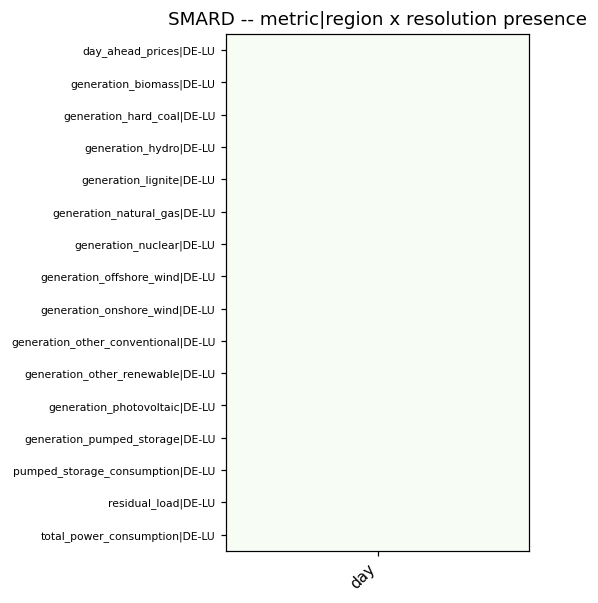
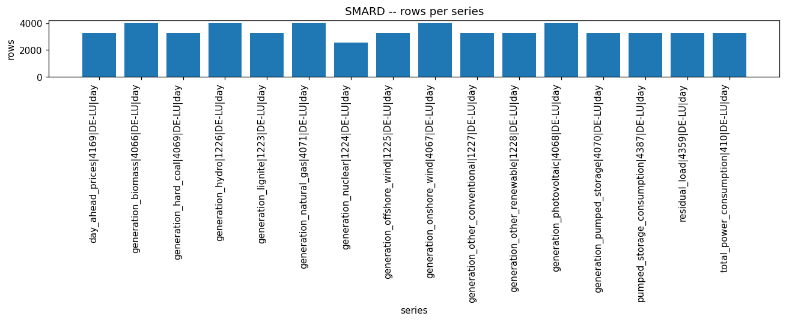
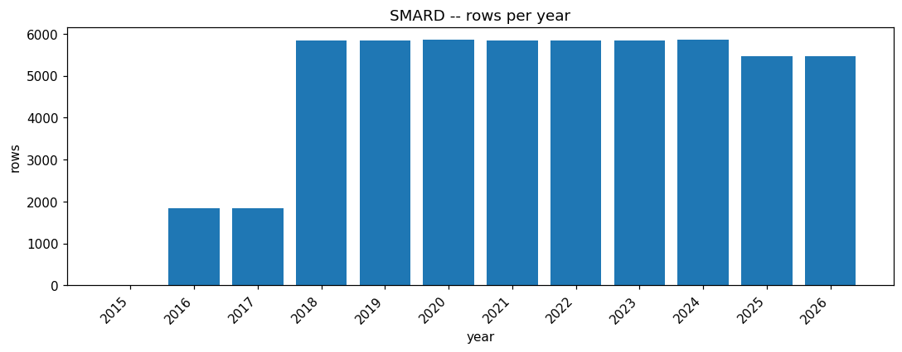
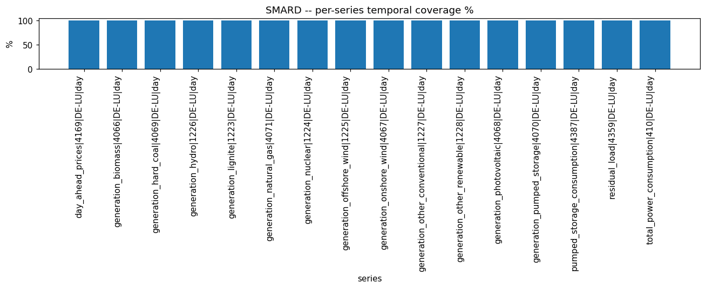
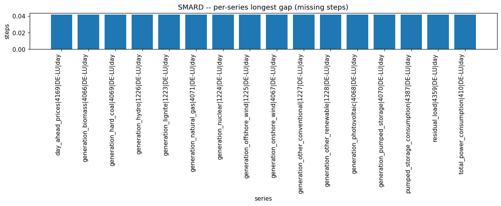

# SMARD EDA PROFILE

_Auto-generated by the Phase 3 EDA notebooks (`databricks/eda/smard/`). One `## ` section per notebook; re-running a notebook replaces its own section, other sections are preserved._

<!-- BEGIN smard:01_smard -->
## SMARD energy time series (smard_energy_timeseries)

### Profile

| column | missing | rate | approx_distinct |
|---|---|---|---|
| metric | 0 | 0.0000 | 16 |
| filter_id | 0 | 0.0000 | 16 |
| region | 0 | 0.0000 | 1 |
| resolution | 0 | 0.0000 | 1 |
| timestamp_utc | 0 | 0.0000 | 3839 |
| value | 7225 | 0.1301 | 44929 |

Rows: 55517. Long format, series key = ['metric', 'filter_id', 'region', 'resolution']. Constant columns: ['region', 'resolution']. Distinct series: 16.

### Data Quality

Exact full-row duplicates: 0.
(series, timestamp_utc) duplicate groups: 0, of which conflicting (differing value): 0.

### Temporal

Per-series continuity (fixed-step resolutions only):

| series | resolution | observed | expected | coverage % | longest gap | missing steps |
|---|---|---|---|---|---|---|
| day_ahead_prices|4169|DE-LU|day | day | 3287 | 3287 | 100.0 | 0.04166666666666674 | 0.37500000000000067 |
| generation_biomass|4066|DE-LU|day | day | 4018 | 4018 | 100.0 | 0.04166666666666674 | 0.45833333333333415 |
| generation_hard_coal|4069|DE-LU|day | day | 3287 | 3287 | 100.0 | 0.04166666666666674 | 0.37500000000000067 |
| generation_hydro|1226|DE-LU|day | day | 4018 | 4018 | 100.0 | 0.04166666666666674 | 0.45833333333333415 |
| generation_lignite|1223|DE-LU|day | day | 3287 | 3287 | 100.0 | 0.04166666666666674 | 0.37500000000000067 |
| generation_natural_gas|4071|DE-LU|day | day | 4018 | 4018 | 100.0 | 0.04166666666666674 | 0.45833333333333415 |
| generation_nuclear|1224|DE-LU|day | day | 2557 | 2557 | 100.0 | 0.04166666666666674 | 0.2916666666666672 |
| generation_offshore_wind|1225|DE-LU|day | day | 3287 | 3287 | 100.0 | 0.04166666666666674 | 0.37500000000000067 |
| generation_onshore_wind|4067|DE-LU|day | day | 4018 | 4018 | 100.0 | 0.04166666666666674 | 0.45833333333333415 |
| generation_other_conventional|1227|DE-LU|day | day | 3287 | 3287 | 100.0 | 0.04166666666666674 | 0.37500000000000067 |
| generation_other_renewable|1228|DE-LU|day | day | 3287 | 3287 | 100.0 | 0.04166666666666674 | 0.37500000000000067 |
| generation_photovoltaic|4068|DE-LU|day | day | 4018 | 4018 | 100.0 | 0.04166666666666674 | 0.45833333333333415 |
| generation_pumped_storage|4070|DE-LU|day | day | 3287 | 3287 | 100.0 | 0.04166666666666674 | 0.37500000000000067 |
| pumped_storage_consumption|4387|DE-LU|day | day | 3287 | 3287 | 100.0 | 0.04166666666666674 | 0.37500000000000067 |
| residual_load|4359|DE-LU|day | day | 3287 | 3287 | 100.0 | 0.04166666666666674 | 0.37500000000000067 |
| total_power_consumption|410|DE-LU|day | day | 3287 | 3287 | 100.0 | 0.04166666666666674 | 0.37500000000000067 |

Rows per year: [(2015, 5), (2016, 1830), (2017, 1836), (2018, 5840), (2019, 5840), (2020, 5856), (2021, 5840), (2022, 5840), (2023, 5840), (2024, 5855), (2025, 5475), (2026, 5460)].

### Entities / Keys

Distinct series (metric|filter_id|region|resolution): 16.
Metrics (16): ['day_ahead_prices', 'generation_biomass', 'generation_hard_coal', 'generation_hydro', 'generation_lignite', 'generation_natural_gas', 'generation_nuclear', 'generation_offshore_wind', 'generation_onshore_wind', 'generation_other_conventional', 'generation_other_renewable', 'generation_photovoltaic', 'generation_pumped_storage', 'pumped_storage_consumption', 'residual_load', 'total_power_consumption']
Regions (1): ['DE-LU']
Resolutions (1): ['day']

### Coverage

metric x region x resolution: 16 present, 0 absent of 16 possible.

Regions per metric: {'day_ahead_prices': ['DE-LU'], 'generation_biomass': ['DE-LU'], 'generation_hard_coal': ['DE-LU'], 'generation_hydro': ['DE-LU'], 'generation_lignite': ['DE-LU'], 'generation_natural_gas': ['DE-LU'], 'generation_nuclear': ['DE-LU'], 'generation_offshore_wind': ['DE-LU'], 'generation_onshore_wind': ['DE-LU'], 'generation_other_conventional': ['DE-LU'], 'generation_other_renewable': ['DE-LU'], 'generation_photovoltaic': ['DE-LU'], 'generation_pumped_storage': ['DE-LU'], 'pumped_storage_consumption': ['DE-LU'], 'residual_load': ['DE-LU'], 'total_power_consumption': ['DE-LU']}

Resolutions per metric: {'day_ahead_prices': ['day'], 'generation_biomass': ['day'], 'generation_hard_coal': ['day'], 'generation_hydro': ['day'], 'generation_lignite': ['day'], 'generation_natural_gas': ['day'], 'generation_nuclear': ['day'], 'generation_offshore_wind': ['day'], 'generation_onshore_wind': ['day'], 'generation_other_conventional': ['day'], 'generation_other_renewable': ['day'], 'generation_photovoltaic': ['day'], 'generation_pumped_storage': ['day'], 'pumped_storage_consumption': ['day'], 'residual_load': ['day'], 'total_power_consumption': ['day']}

Absent combos (first 30): []

### Distributions

| metric | min | max | mean | sd | p01/25/50/75/99 | zero | negative | 5-sigma outliers |
|---|---|---|---|---|---|---|---|---|
| day_ahead_prices | -53.87 | 699.44 | 93.9616707189998 | 82.48747400194547 | [2.68, 42.28, 75.35, 111.78, 424.62] | 0 | 20 | 13 |
| generation_biomass | 155.5 | 119197.0 | 85046.63343572232 | 40439.379068831615 | [190.75, 93884.5, 102033.0, 107941.0, 117016.96] | 0 | 0 | 0 |
| generation_hard_coal | 5127.0 | 393590.65 | 115435.58042057705 | 77402.34695607226 | [14671.5, 54794.5, 94085.57, 155645.75, 346481.25] | 0 | 0 | 0 |
| generation_hydro | 7.5 | 65880.75 | 33841.66758895531 | 17851.35075732078 | [33.5, 29416.1, 37248.5, 46001.0, 61490.25] | 0 | 0 | 0 |
| generation_lignite | 49067.0 | 413439.75 | 234521.7180535283 | 83385.02700965478 | [78428.5, 166135.16, 241080.96, 298915.5, 388163.75] | 0 | 0 | 0 |
| generation_natural_gas | 217.75 | 420468.5 | 127428.7975028441 | 89595.40503754697 | [341.0, 70073.75, 121416.25, 185300.0, 366457.5] | 0 | 0 | 0 |
| generation_nuclear | 0.0 | 228116.75 | 131371.0652593734 | 71724.04918735966 | [0.0, 89711.5, 156550.0, 188552.75, 226510.47] | 289 | 0 | 0 |
| generation_offshore_wind | 179.0 | 190655.5 | 69236.67668404587 | 40544.397515626 | [2941.25, 33922.95, 66906.5, 102212.98, 156696.75] | 0 | 0 | 0 |
| generation_onshore_wind | 17.5 | 1064138.0 | 235448.5519340162 | 218149.7339950511 | [78.0, 69798.5, 179166.0, 351412.0, 888920.75] | 0 | 0 | 0 |
| generation_other_conventional | 19712.0 | 56661.25 | 38923.13182608695 | 6367.015315064459 | [24401.75, 34619.0, 38564.0, 43690.25, 52550.28] | 0 | 0 | 0 |
| generation_other_renewable | 1625.5 | 5636.5 | 3461.4009767118614 | 928.8398693043777 | [2041.62, 2695.0, 3237.25, 4201.0, 5440.25] | 0 | 0 | 0 |
| generation_photovoltaic | 3.25 | 528207.22 | 128452.95156427758 | 118444.28097266503 | [27.5, 22533.25, 101115.25, 214722.0, 449901.53] | 0 | 0 | 0 |
| generation_pumped_storage | 4308.61 | 61197.75 | 26815.361153979844 | 8141.585786270067 | [8644.5, 21204.0, 27131.5, 32381.25, 45357.5] | 0 | 0 | 0 |
| pumped_storage_consumption | 2950.91 | 70895.25 | 33900.80323948554 | 10692.768012982346 | [11426.5, 26573.75, 33201.0, 40656.75, 63772.75] | 0 | 0 | 0 |
| residual_load | 26994.41 | 1585773.0 | 814369.8773783026 | 269597.67709105375 | [214685.6, 627462.94, 816061.5, 1008215.25, 1403658.5] | 0 | 0 | 0 |
| total_power_consumption | 875102.5 | 1698425.5 | 1328156.3295688455 | 163944.87397172497 | [983227.5, 1226325.0, 1329836.5, 1446052.5, 1651302.0] | 0 | 0 | 0 |

### EDA Findings

- Constant columns: ['region', 'resolution'].
- Negative values present per metric: {'day_ahead_prices': 20}.
- 5-sigma value outliers per metric: {'day_ahead_prices': 13}.

### Silver Implications

- Drop constant columns ['region', 'resolution'] from Silver.
- Silver grain: one row per (metric, filter_id, region, resolution, timestamp_utc).

### Figure -- SMARD metric|region x resolution presence

### Figure -- SMARD rows per series

### Figure -- SMARD rows per year

### Figure -- SMARD per-series temporal coverage %

### Figure -- SMARD per-series longest gap (missing steps)

<!-- END smard:01_smard -->
