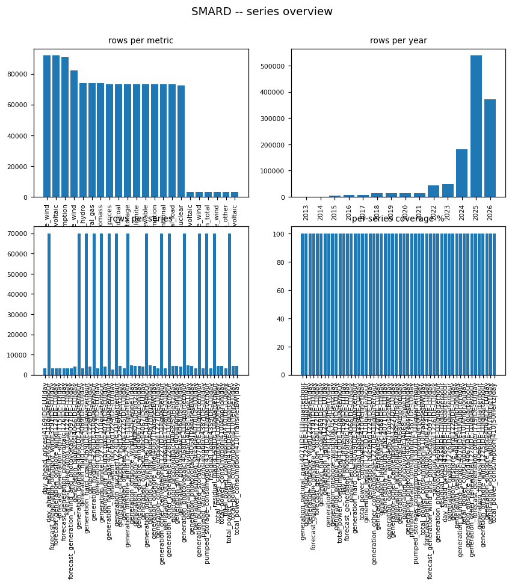
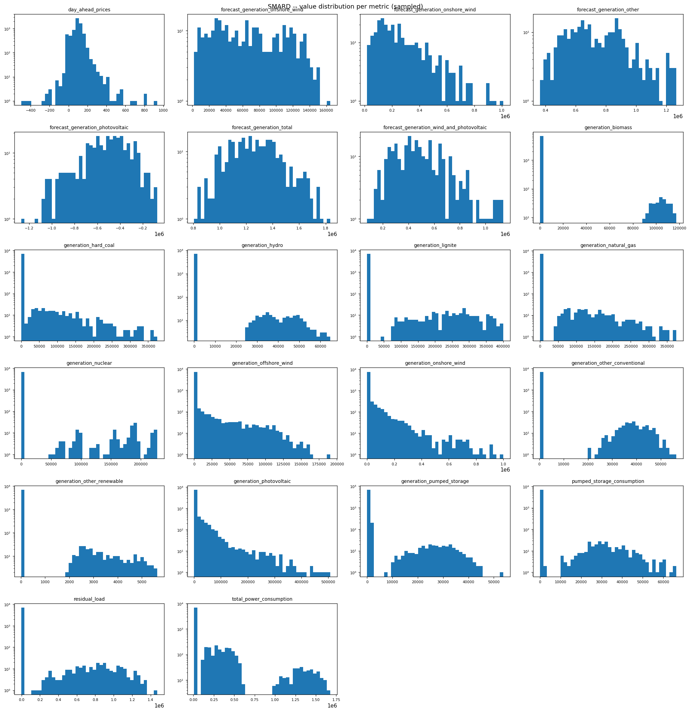
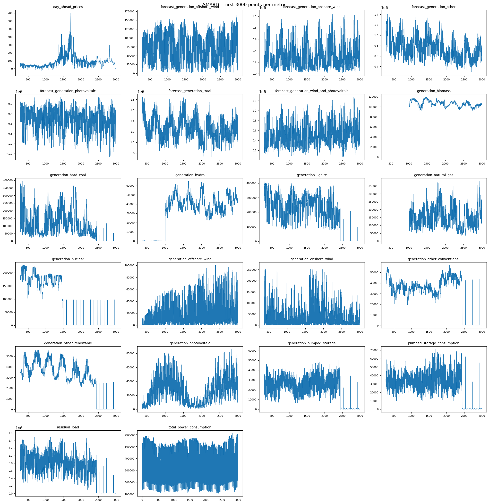

# SMARD EDA PROFILE

_Auto-generated by the EDA notebooks (`databricks/eda/smard/`). One `## ` section per notebook; re-running a notebook replaces its own section, other sections are preserved._

<!-- BEGIN smard:01_smard -->
## SMARD energy time series (smard_energy_timeseries)

### Profile

| column | missing | rate | approx_distinct |
|---|---|---|---|
| metric | 0 | 0.0000 | 22 |
| filter_id | 0 | 0.0000 | 22 |
| region | 0 | 0.0000 | 4 |
| resolution | 0 | 0.0000 | 2 |
| timestamp_utc | 0 | 0.0000 | 141291 |
| value | 15983 | 0.0127 | 411788 |

Rows: 1255904. Long format, series key = ['metric', 'filter_id', 'region', 'resolution']. Constant columns: none. Distinct series: 52.

### Data Quality

Exact full-row duplicates: 0.
(series, timestamp_utc) duplicate groups: 0, of which conflicting (differing value): 0.

### Temporal

Per-series continuity (fixed-step resolutions only):

| series | resolution | observed | expected | coverage % | longest gap | missing steps |
|---|---|---|---|---|---|---|
| generation_natural_gas|4071|DE-LU|quarterhour | quarterhour | 69888 | 69888 | 100.0 | None | 0 |
| generation_nuclear|1224|DE-LU|quarterhour | quarterhour | 69888 | 69888 | 100.0 | None | 0 |
| generation_offshore_wind|1225|TenneT|day | day | 4748 | 4748 | 100.0 | None | 0 |
| forecast_generation_offshore_wind|3791|DE-LU|day | day | 3287 | 3287 | 100.0 | None | 0 |
| forecast_generation_total|122|DE-LU|day | day | 3287 | 3287 | 100.0 | None | 0 |
| generation_hard_coal|4069|DE-LU|day | day | 3287 | 3287 | 100.0 | None | 0 |
| generation_lignite|1223|DE-LU|day | day | 3287 | 3287 | 100.0 | None | 0 |
| generation_offshore_wind|1225|50Hertz|day | day | 4383 | 4383 | 100.0 | None | 0 |
| generation_onshore_wind|4067|50Hertz|day | day | 4383 | 4383 | 100.0 | None | 0 |
| generation_pumped_storage|4070|DE-LU|day | day | 3287 | 3287 | 100.0 | None | 0 |
| total_power_consumption|410|DE-LU|quarterhour | quarterhour | 69888 | 69888 | 100.0 | None | 0 |
| day_ahead_prices|4169|DE-LU|day | day | 3287 | 3287 | 100.0 | None | 0 |
| forecast_generation_photovoltaic|126|DE-LU|day | day | 3287 | 3287 | 100.0 | None | 0 |
| generation_biomass|4066|DE-LU|day | day | 4018 | 4018 | 100.0 | None | 0 |
| generation_hard_coal|4069|DE-LU|quarterhour | quarterhour | 69888 | 69888 | 100.0 | None | 0 |
| residual_load|4359|DE-LU|day | day | 3287 | 3287 | 100.0 | None | 0 |
| total_power_consumption|410|TenneT|day | day | 4383 | 4383 | 100.0 | None | 0 |
| generation_lignite|1223|DE-LU|quarterhour | quarterhour | 69888 | 69888 | 100.0 | None | 0 |
| generation_nuclear|1224|DE-LU|day | day | 2557 | 2557 | 100.0 | None | 0 |
| generation_other_conventional|1227|DE-LU|quarterhour | quarterhour | 69888 | 69888 | 100.0 | None | 0 |
| generation_other_renewable|1228|DE-LU|day | day | 3287 | 3287 | 100.0 | None | 0 |
| generation_photovoltaic|4068|DE-LU|day | day | 4018 | 4018 | 100.0 | None | 0 |
| generation_natural_gas|4071|DE-LU|day | day | 4018 | 4018 | 100.0 | None | 0 |
| generation_onshore_wind|4067|TransnetBW|day | day | 4383 | 4383 | 100.0 | None | 0 |
| generation_other_conventional|1227|DE-LU|day | day | 3287 | 3287 | 100.0 | None | 0 |
| generation_photovoltaic|4068|50Hertz|day | day | 4383 | 4383 | 100.0 | None | 0 |
| generation_photovoltaic|4068|Amprion|day | day | 4383 | 4383 | 100.0 | None | 0 |
| generation_photovoltaic|4068|TenneT|day | day | 4748 | 4748 | 100.0 | None | 0 |
| generation_photovoltaic|4068|TransnetBW|day | day | 4383 | 4383 | 100.0 | None | 0 |
| pumped_storage_consumption|4387|DE-LU|day | day | 3287 | 3287 | 100.0 | None | 0 |
| pumped_storage_consumption|4387|DE-LU|quarterhour | quarterhour | 69888 | 69888 | 100.0 | None | 0 |
| total_power_consumption|410|DE-LU|day | day | 3287 | 3287 | 100.0 | None | 0 |
| total_power_consumption|410|TransnetBW|day | day | 4383 | 4383 | 100.0 | None | 0 |
| forecast_generation_onshore_wind|123|DE-LU|day | day | 3287 | 3287 | 100.0 | None | 0 |
| forecast_generation_wind_and_photovoltaic|5097|DE-LU|day | day | 3287 | 3287 | 100.0 | None | 0 |
| generation_hydro|1226|DE-LU|day | day | 4018 | 4018 | 100.0 | None | 0 |
| generation_photovoltaic|4068|DE-LU|quarterhour | quarterhour | 69888 | 69888 | 100.0 | None | 0 |
| residual_load|4359|DE-LU|quarterhour | quarterhour | 69888 | 69888 | 100.0 | None | 0 |
| day_ahead_prices|4169|DE-LU|quarterhour | quarterhour | 69888 | 69888 | 100.0 | None | 0 |
| generation_hydro|1226|DE-LU|quarterhour | quarterhour | 69888 | 69888 | 100.0 | None | 0 |
| generation_offshore_wind|1225|DE-LU|day | day | 3287 | 3287 | 100.0 | None | 0 |
| generation_onshore_wind|4067|Amprion|day | day | 4383 | 4383 | 100.0 | None | 0 |
| generation_pumped_storage|4070|DE-LU|quarterhour | quarterhour | 69888 | 69888 | 100.0 | None | 0 |
| total_power_consumption|410|Amprion|day | day | 4383 | 4383 | 100.0 | None | 0 |
| generation_onshore_wind|4067|DE-LU|quarterhour | quarterhour | 69888 | 69888 | 100.0 | None | 0 |
| generation_other_renewable|1228|DE-LU|quarterhour | quarterhour | 69888 | 69888 | 100.0 | None | 0 |
| forecast_generation_other|715|DE-LU|day | day | 3287 | 3287 | 100.0 | None | 0 |
| generation_biomass|4066|DE-LU|quarterhour | quarterhour | 69888 | 69888 | 100.0 | None | 0 |
| generation_offshore_wind|1225|DE-LU|quarterhour | quarterhour | 69888 | 69888 | 100.0 | None | 0 |
| generation_onshore_wind|4067|DE-LU|day | day | 4018 | 4018 | 100.0 | None | 0 |
| generation_onshore_wind|4067|TenneT|day | day | 4748 | 4748 | 100.0 | None | 0 |
| total_power_consumption|410|50Hertz|day | day | 4383 | 4383 | 100.0 | None | 0 |

Rows per year: [(2013, 3), (2014, 1106), (2015, 5115), (2016, 6954), (2017, 6952), (2018, 13140), (2019, 13140), (2020, 13176), (2021, 13140), (2022, 44632), (2023, 48180), (2024, 180811), (2025, 538375), (2026, 371180)].

### Entities / Keys

Distinct series (metric|filter_id|region|resolution): 52.
Metrics (22): ['day_ahead_prices', 'forecast_generation_offshore_wind', 'forecast_generation_onshore_wind', 'forecast_generation_other', 'forecast_generation_photovoltaic', 'forecast_generation_total', 'forecast_generation_wind_and_photovoltaic', 'generation_biomass', 'generation_hard_coal', 'generation_hydro', 'generation_lignite', 'generation_natural_gas', 'generation_nuclear', 'generation_offshore_wind', 'generation_onshore_wind', 'generation_other_conventional', 'generation_other_renewable', 'generation_photovoltaic', 'generation_pumped_storage', 'pumped_storage_consumption', 'residual_load', 'total_power_consumption']
Regions (5): ['50Hertz', 'Amprion', 'DE-LU', 'TenneT', 'TransnetBW']
Resolutions (2): ['day', 'quarterhour']

### Coverage

metric x region x resolution: 52 present, 168 absent of 220 possible.

Regions per metric: {'day_ahead_prices': ['DE-LU'], 'forecast_generation_offshore_wind': ['DE-LU'], 'forecast_generation_onshore_wind': ['DE-LU'], 'forecast_generation_other': ['DE-LU'], 'forecast_generation_photovoltaic': ['DE-LU'], 'forecast_generation_total': ['DE-LU'], 'forecast_generation_wind_and_photovoltaic': ['DE-LU'], 'generation_biomass': ['DE-LU'], 'generation_hard_coal': ['DE-LU'], 'generation_hydro': ['DE-LU'], 'generation_lignite': ['DE-LU'], 'generation_natural_gas': ['DE-LU'], 'generation_nuclear': ['DE-LU'], 'generation_offshore_wind': ['50Hertz', 'DE-LU', 'TenneT'], 'generation_onshore_wind': ['50Hertz', 'Amprion', 'DE-LU', 'TenneT', 'TransnetBW'], 'generation_other_conventional': ['DE-LU'], 'generation_other_renewable': ['DE-LU'], 'generation_photovoltaic': ['50Hertz', 'Amprion', 'DE-LU', 'TenneT', 'TransnetBW'], 'generation_pumped_storage': ['DE-LU'], 'pumped_storage_consumption': ['DE-LU'], 'residual_load': ['DE-LU'], 'total_power_consumption': ['50Hertz', 'Amprion', 'DE-LU', 'TenneT', 'TransnetBW']}

Resolutions per metric: {'day_ahead_prices': ['day', 'quarterhour'], 'forecast_generation_offshore_wind': ['day'], 'forecast_generation_onshore_wind': ['day'], 'forecast_generation_other': ['day'], 'forecast_generation_photovoltaic': ['day'], 'forecast_generation_total': ['day'], 'forecast_generation_wind_and_photovoltaic': ['day'], 'generation_biomass': ['day', 'quarterhour'], 'generation_hard_coal': ['day', 'quarterhour'], 'generation_hydro': ['day', 'quarterhour'], 'generation_lignite': ['day', 'quarterhour'], 'generation_natural_gas': ['day', 'quarterhour'], 'generation_nuclear': ['day', 'quarterhour'], 'generation_offshore_wind': ['day', 'quarterhour'], 'generation_onshore_wind': ['day', 'quarterhour'], 'generation_other_conventional': ['day', 'quarterhour'], 'generation_other_renewable': ['day', 'quarterhour'], 'generation_photovoltaic': ['day', 'quarterhour'], 'generation_pumped_storage': ['day', 'quarterhour'], 'pumped_storage_consumption': ['day', 'quarterhour'], 'residual_load': ['day', 'quarterhour'], 'total_power_consumption': ['day', 'quarterhour']}

Absent combos (first 30): [('day_ahead_prices', '50Hertz', 'day'), ('day_ahead_prices', '50Hertz', 'quarterhour'), ('day_ahead_prices', 'Amprion', 'day'), ('day_ahead_prices', 'Amprion', 'quarterhour'), ('day_ahead_prices', 'TenneT', 'day'), ('day_ahead_prices', 'TenneT', 'quarterhour'), ('day_ahead_prices', 'TransnetBW', 'day'), ('day_ahead_prices', 'TransnetBW', 'quarterhour'), ('forecast_generation_offshore_wind', '50Hertz', 'day'), ('forecast_generation_offshore_wind', '50Hertz', 'quarterhour'), ('forecast_generation_offshore_wind', 'Amprion', 'day'), ('forecast_generation_offshore_wind', 'Amprion', 'quarterhour'), ('forecast_generation_offshore_wind', 'DE-LU', 'quarterhour'), ('forecast_generation_offshore_wind', 'TenneT', 'day'), ('forecast_generation_offshore_wind', 'TenneT', 'quarterhour'), ('forecast_generation_offshore_wind', 'TransnetBW', 'day'), ('forecast_generation_offshore_wind', 'TransnetBW', 'quarterhour'), ('forecast_generation_onshore_wind', '50Hertz', 'day'), ('forecast_generation_onshore_wind', '50Hertz', 'quarterhour'), ('forecast_generation_onshore_wind', 'Amprion', 'day'), ('forecast_generation_onshore_wind', 'Amprion', 'quarterhour'), ('forecast_generation_onshore_wind', 'DE-LU', 'quarterhour'), ('forecast_generation_onshore_wind', 'TenneT', 'day'), ('forecast_generation_onshore_wind', 'TenneT', 'quarterhour'), ('forecast_generation_onshore_wind', 'TransnetBW', 'day'), ('forecast_generation_onshore_wind', 'TransnetBW', 'quarterhour'), ('forecast_generation_other', '50Hertz', 'day'), ('forecast_generation_other', '50Hertz', 'quarterhour'), ('forecast_generation_other', 'Amprion', 'day'), ('forecast_generation_other', 'Amprion', 'quarterhour')]

### Distributions

| metric | min | max | mean | sd | p01/25/50/75/99 | zero | negative | 5-sigma outliers |
|---|---|---|---|---|---|---|---|---|
| forecast_generation_onshore_wind | 12953.75 | 1055276.75 | 285885.5310390061 | 207238.6940015311 | [32706.36, 123456.75, 227245.0, 396927.25, 897516.75] | 0 | 0 | 0 |
| generation_biomass | 155.5 | 119197.0 | 5083.13140287375 | 20079.185599647688 | [759.26, 953.85, 1023.1, 1106.25, 109023.25] | 0 | 0 | 1213 |
| forecast_generation_wind_and_photovoltaic | 66771.0 | 1271057.75 | 512813.2246116677 | 220908.39325244326 | [119186.75, 349734.82, 476269.5, 650712.5, 1096947.25] | 0 | 0 | 0 |
| generation_photovoltaic | 0.0 | 528207.22 | 13365.948535537102 | 37968.85916628803 | [0.02, 3.46, 1375.8, 8486.5, 213495.5] | 61 | 0 | 996 |
| forecast_generation_offshore_wind | 1070.75 | 170186.35 | 69032.14643769419 | 40565.80794396563 | [4070.0, 32819.25, 66179.0, 103350.0, 148207.0] | 0 | 0 | 0 |
| forecast_generation_other | 160906.24 | 1425941.75 | 760539.8455286578 | 215047.08915176248 | [387840.81, 596182.3, 735314.25, 901626.25, 1294364.5] | 0 | 0 | 0 |
| forecast_generation_photovoltaic | -1271057.75 | -66771.0 | -512813.2246116677 | 220908.39325244326 | [-1096947.25, -650712.5, -476269.5, -349734.82, -119186.75] | 0 | 2897 | 0 |
| forecast_generation_total | 726680.0 | 1843656.0 | 1269543.6214061908 | 197317.77562405824 | [868887.0, 1127015.0, 1251303.85, 1398436.45, 1753903.0] | 0 | 0 | 0 |
| generation_other_conventional | 274.25 | 56661.25 | 1963.4699426325733 | 7646.50199482407 | [311.5, 386.28, 431.64, 470.25, 43672.25] | 0 | 0 | 1183 |
| generation_onshore_wind | 0.0 | 1064138.0 | 23942.603555255275 | 72314.97255757113 | [173.0, 1502.75, 3308.25, 7009.75, 357436.75] | 16 | 0 | 789 |
| day_ahead_prices | -499.99 | 936.28 | 95.24919176216567 | 60.377359488211454 | [-15.91, 70.15, 97.41, 123.4, 271.0] | 728 | 4372 | 271 |
| generation_other_renewable | 12.37 | 5636.5 | 163.68512028770033 | 695.872517121124 | [18.09, 24.37, 27.21, 29.9, 4182.75] | 0 | 0 | 1074 |
| generation_offshore_wind | 0.0 | 190655.5 | 6224.042261143032 | 19754.188483559763 | [12.5, 336.0, 835.62, 1446.75, 108744.75] | 65 | 0 | 979 |
| generation_pumped_storage | 0.0 | 61197.75 | 1344.412119295631 | 5454.973524550005 | [0.0, 14.25, 79.75, 519.5, 32343.5] | 760 | 0 | 1220 |
| total_power_consumption | 8175.0 | 1698425.5 | 116811.64054424345 | 261917.50587326477 | [9158.62, 12063.35, 14405.0, 17834.25, 1410718.5] | 0 | 0 | 804 |
| generation_natural_gas | 217.75 | 420468.5 | 7763.700691661528 | 33339.90671604869 | [357.91, 864.25, 1469.5, 2464.5, 197422.75] | 0 | 0 | 1020 |
| generation_hard_coal | 32.75 | 393590.65 | 5420.643189715782 | 27183.491879447876 | [59.5, 440.0, 866.5, 1326.5, 154802.25] | 0 | 0 | 868 |
| generation_hydro | 7.5 | 65880.75 | 2018.2657257755332 | 8166.727948309742 | [243.63, 341.96, 393.8, 467.5, 47695.0] | 0 | 0 | 1224 |
| generation_nuclear | 0.0 | 228116.75 | 4092.9639429805493 | 24399.073687563978 | [0.0, 0.0, 672.75, 988.5, 181652.0] | 28087 | 0 | 1147 |
| generation_lignite | 338.11 | 413439.75 | 11201.134608548096 | 48377.38301568751 | [537.03, 1369.5, 2044.0, 2655.75, 298597.5] | 0 | 0 | 1320 |
| pumped_storage_consumption | 0.0 | 70895.25 | 1702.9007108606395 | 6918.531608779133 | [0.24, 5.39, 119.75, 791.5, 40627.5] | 345 | 0 | 1104 |
| residual_load | -4019.13 | 1585773.0 | 39485.599687620575 | 166559.58181237316 | [-1364.7, 4907.38, 7968.5, 10493.22, 1005193.5] | 0 | 2777 | 1212 |

### EDA Findings

- Negative values present per metric: {'forecast_generation_photovoltaic': 2897, 'day_ahead_prices': 4372, 'residual_load': 2777}.
- 5-sigma value outliers per metric: {'generation_biomass': 1213, 'generation_photovoltaic': 996, 'generation_other_conventional': 1183, 'generation_onshore_wind': 789, 'day_ahead_prices': 271, 'generation_other_renewable': 1074, 'generation_offshore_wind': 979, 'generation_pumped_storage': 1220, 'total_power_consumption': 804, 'generation_natural_gas': 1020, 'generation_hard_coal': 868, 'generation_hydro': 1224, 'generation_nuclear': 1147, 'generation_lignite': 1320, 'pumped_storage_consumption': 1104, 'residual_load': 1212}.
- 168 metric x region x resolution combinations carry no data.

### ML-Readiness Evidence

- Candidate target signals: any `metric` representing an actual outcome (e.g. realised generation/consumption/price) is a plausible forecasting target keyed by (metric, region, resolution, timestamp_utc); metrics present are ['day_ahead_prices', 'forecast_generation_offshore_wind', 'forecast_generation_onshore_wind', 'forecast_generation_other', 'forecast_generation_photovoltaic', 'forecast_generation_total', 'forecast_generation_wind_and_photovoltaic', 'generation_biomass', 'generation_hard_coal', 'generation_hydro', 'generation_lignite', 'generation_natural_gas', 'generation_nuclear', 'generation_offshore_wind', 'generation_onshore_wind', 'generation_other_conventional', 'generation_other_renewable', 'generation_photovoltaic', 'generation_pumped_storage', 'pumped_storage_consumption', 'residual_load', 'total_power_consumption'].
- Leakage: if any metric pair represents a forecast vs. an actual for the same underlying quantity, the forecast series must not be used as a feature to predict the actual at a timestamp on or after its own publication time, and vice versa -- verify metric semantics before pairing them as feature/target.
- Grain and entity-grouped split: series key = ['metric', 'filter_id', 'region', 'resolution'] -- split by series (metric, filter_id, region, resolution), not by row or by shuffled timestamp, since a series' own points are temporally correlated and a row-level split would leak adjacent timestamps across train/test.
- Join cardinality: this notebook does not join SMARD data to another Bronze table -- cross-source join cardinality (e.g. to weather or grid-operator data) is unassessed here and must be verified before using SMARD as a joined feature source.
- Imbalance: not applicable -- `value` is continuous, not a categorical target; metric/region/resolution cardinality is reported under Coverage, not as a class-balance concern.
- Sample-vs-full divergence: the value-distribution figure draws from `value_pdf`, a 10% sample capped at 200k rows, and the time-series figure (`ts_pdf`) shows only each metric's first 3000 chronological points -- neither is representative of the full series' later history; use the full-table `by_metric` aggregates (min/max/mean/sd/percentiles) for any feature-quality decision.

### Silver Implications

- Silver grain: one row per (metric, filter_id, region, resolution, timestamp_utc).

### Figure -- SMARD metric|region x resolution presence

### Figure -- SMARD series overview

### Figure -- SMARD value distribution per metric (sampled)

### Figure -- SMARD first 3000 points per metric

<!-- END smard:01_smard -->
