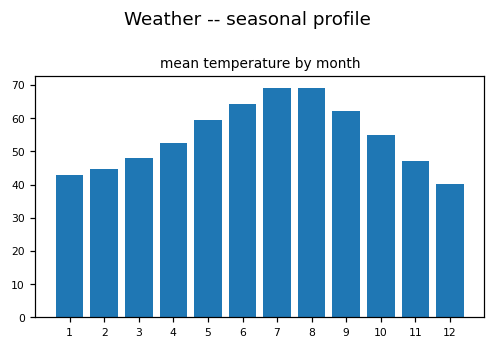
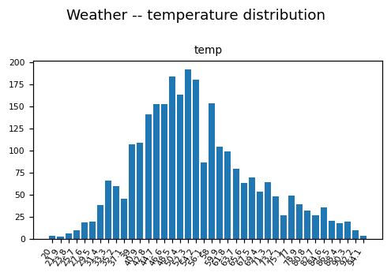
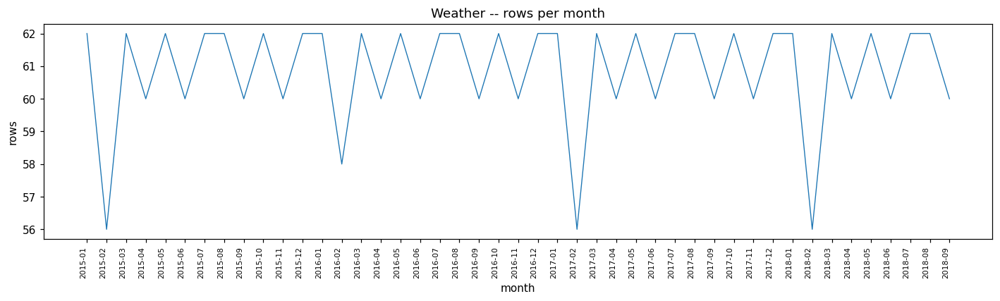

# WEATHER_SEATTLE EDA PROFILE

_Auto-generated by the EDA notebooks (`databricks/eda/weather_seattle/`). One `## ` section per notebook; re-running a notebook replaces its own section, other sections are preserved._

<!-- BEGIN weather_seattle:01_weather_seattle -->
## Daily temperature history (Samples: weather)

### Profile

| frame | separator | source files | rows | cols | constant columns |
|---|---|---|---|---|---|
| delimited_1 | comma | 2 | 2738 | 2 | - |

### Provenance / Source Evidence

The dataset is read in place from the Databricks Samples Volume; there is no Bronze table and no ECRMAP acquisition step.
Files under `/Volumes/samples/databricks/datasets/weather`: 3 ({'support': 1, 'other': 2, 'delimited': 2}).
README-type file `README.weather_history.md` (first lines):
  > ==========================================
  > Seattle Temperature Recordings Data Set
  > ==========================================
  > This data set was obtained from https://w2.weather.gov/climate/index.php?wfo=sew.  The source of the data is:
  > National Weather Service
  > The National Weather Service data is not subject to copyright protection.
  > =========================================
  > Data Set Information
  > =========================================
  > This is a history weather recordings data set which contains all the high and low temperatures in Seattle, WA occurring between 01/01/2015 and 09/30/2018.
  > Attribute Information:
  > date: The date of the temperature recording.
  > temp: The daily maximum or minimum temperature in Fahrenheit.

### Structural Integrity

- delimited_1: 2 columns; unnamed=none; date column=date; temperature columns=['temp'] -> header applied.

### Data Quality

Full-row exact duplicates and missingness per frame:
- delimited_1: full-row duplicates 0.
  missingness: date=0.0000, temp=0.0000

### Entities / Keys

The grain is one temperature observation per date (a daily series); there is no station, city or location column to identify the observing site.
- delimited_1: approx distinct per column: date=1369, temp=80; rows per date (rows-per-date -> number of dates): [(2, 1369)].

### Unit & Semantic Validation

- delimited_1.`temp`: numeric yield 100.0%, range 20.0..96.0, mean 55.08, sd 13.87; outside (-40.0, 130.0) (Fahrenheit assumption): below 0, above 0.
The unit is not in the data. The README (if any) states it; a range consistent with Fahrenheit is a plausibility check, not proof.
- delimited_1: with two rows per date, per-date high-low range mean 15.47, min 2.0, max 35.0, dates where both rows are equal 0. The two source files name the roles (see the per-file comparison).
- delimited_1 / `high_temps`: 1369 rows, 1369 distinct dates, temperature range 33..96, mean 62.82.
- delimited_1 / `low_temps`: 1369 rows, 1369 distinct dates, temperature range 20..69, mean 47.35.
- delimited_1: `high_temps` minus `low_temps` on the 1369 dates present in both: mean 15.47, min 2, max 35; `high_temps` below `low_temps` on 0 dates, equal on 0. File names carry the only high/low label; if the names say high and low, a below-count above zero is an inversion.

### Categorical / Domain Validation

No categorical column is expected. Columns with 2..60 approx distinct values:
- delimited_1: none

### Temporal Semantics

- delimited_1: `date`: parsed 2738/2738 non-empty values (100.0%); formats matched: {'yyyy-MM-dd': 2738}.
- delimited_1: observed range 2015-01-01 00:00:00 .. 2018-09-30 00:00:00; rows before 1900-01-01: 0; future-dated (> now+2d): 0.
- delimited_1: granularity: date-only (no time-of-day component); source timezone: unspecified.
- delimited_1: 2015-01-01 .. 2018-09-30; 1369 distinct days vs 1369 expected; 0 missing days (first: []).
- delimited_1 / `high_temps`: 2015-01-01 .. 2018-09-30; 1369 distinct dates.
- delimited_1 / `low_temps`: 2015-01-01 .. 2018-09-30; 1369 distinct dates.
- delimited_1: dates in both files 1369; only in `high_temps` 0; only in `low_temps` 0.

### Temporal Consistency

- delimited_1: day-to-day changes over 25.0 degrees: 0 of 1368; largest 16.5; lag-1 autocorrelation of the pooled daily mean (rows sharing a date averaged across files) 0.9476; values more than 4 sd from the pooled mean: 0.
- delimited_1 / `high_temps`: day-to-day changes over 25.0 degrees: 1 of 1368; largest 26; lag-1 autocorrelation 0.9198.
- delimited_1 / `low_temps`: day-to-day changes over 25.0 degrees: 0 of 1368; largest 18; lag-1 autocorrelation 0.928.

### Relationship Cardinality

Single-entity daily series: there is no second table and no key to relate to. The only relationship is date -> rows (see rows per date above).

### Regime / Version Evidence

Seasonal profile by calendar month; the pooled line averages every row of the frame (both files together), so per-file lines are the ones to read:
- delimited_1 (pooled): m1=42.9, m2=44.7, m3=48.1, m4=52.5, m5=59.5, m6=64.2, m7=69.0, m8=69.1, m9=62.2, m10=55.1, m11=47.1, m12=40.3
- delimited_1 / `high_temps`: m1=48.2, m2=50.2, m3=55.0, m4=60.4, m5=68.7, m6=74.0, m7=79.9, m8=79.8, m9=70.6, m10=61.7, m11=52.3, m12=44.8
- delimited_1 / `low_temps`: m1=37.6, m2=39.2, m3=41.2, m4=44.6, m5=50.2, m6=54.4, m7=58.1, m8=58.5, m9=53.8, m10=48.4, m11=42.0, m12=35.8
A physically plausible temperate-climate series shows a single summer maximum and winter minimum; a flat or multi-peaked profile would indicate a different meaning for the value column.

### Climatology and Extremes

- delimited_1 / `high_temps` mean by year (year, mean, rows): [(2015, 63.37, 365), (2016, 62.55, 366), (2017, 60.91, 365), (2018, 64.99, 273)].
- delimited_1 / `low_temps` mean by year (year, mean, rows): [(2015, 47.9, 365), (2016, 47.61, 366), (2017, 45.7, 365), (2018, 48.47, 273)].
- delimited_1 / `high_temps` highest [('2017-06-25', 96.0), ('2015-07-19', 95.0), ('2016-08-19', 95.0)], lowest [('2016-12-17', 33.0), ('2017-01-03', 33.0), ('2016-12-16', 34.0)].
- delimited_1 / `low_temps` highest [('2016-08-19', 69.0), ('2017-08-02', 69.0), ('2017-08-03', 68.0)], lowest [('2017-01-06', 20.0), ('2017-01-03', 21.0), ('2017-01-05', 21.0)].
- delimited_1 days more than 3 sd from their own month's mean, per file: {'high_temps': 3, 'low_temps': 5}.
- delimited_1 correlation of the two files' values on the same date: 0.8928; mean difference by month (month, degrees): [(1, 10.5), (2, 11.0), (3, 13.8), (4, 15.8), (5, 18.4), (6, 19.6), (7, 21.8), (8, 21.3), (9, 16.9), (10, 13.3), (11, 10.3), (12, 9.0)].

### Coverage & Sampling Bias

One site, one short window; the data does not carry the site name, the station identifier, or the observation time of day. Coverage statements rest on the README.
- delimited_1: 45 calendar months present (2015-01 .. 2018-09); rows per month min 56, max 62.

### Distributions

- delimited_1.`temp` quantiles (p1/p25/p50/p75/p99): 29, 45, 53, 63, 91

### EDA Findings

- delimited_1: rows=2738, cols=2, dups=0, missing days=0, rows per date=[(2, 1369)]

### ML-Readiness Evidence

- **Grain / grain drift:** One row per temperature observation; rows per date: {'delimited_1': [(2, 1369)]}. If two rows share a date the grain is (date, unlabelled high/low), not (date).
- **Join multiplication (1:N / M:N expansion):** Joining to any daily source on date fans out by the rows-per-date count above; aggregate to one row per date first.
- **Target contamination:** Temperature is the natural target; the columns found are {'delimited_1': ['date', 'temp']}, so other features would have to be supplied from elsewhere.
- **Temporal / post-event leakage:** Daily series -- the lag-1 autocorrelation is in Temporal Consistency; where it is high, a random split leaks neighbouring days, so split by contiguous date range.
- **Proxy leakage:** The calendar month is a proxy for temperature to the extent the seasonal profile above shows a clear cycle.
- **Split / entity leakage:** Single entity; split by time only.
- **Historical-reference (point-in-time) leakage:** Not applicable -- no reference table.
- **Survivorship / coverage bias:** One site and a short window; months present: {'delimited_1': 45}. Statements about other places or years cannot be drawn.
- **Missingness leakage:** Missing calendar days: {'delimited_1': 0} -- gaps are structural, not random, if they cluster.
- **Duplicate-event leakage:** Full-row duplicates: {'delimited_1': 0}; a repeated (date, value) row is not evidence of two observations.
- **Target / feature temporal misalignment:** The observation time of day is not recorded, so alignment with any sub-daily source is not possible without an assumption.
- **Unit / sign / circular-feature leakage:** Unit is not in the data; treat as Fahrenheit only if the README says so. Two unlabelled rows per date must not be treated as both the target.
- **Data-generation-process leakage:** Values are stated in the README to come from a national weather service record; the extraction rule (which observation) is not in the data.
- **Class / label instability:** Regression target -- no classes.
- **Label availability lag:** Not applicable -- observations are historical.
- **Source / version / regime change:** Single static extract; no version indicator; station moves or instrument changes are not recorded.
- **Sample-vs-full divergence:** Every statistic is a full Spark aggregation over the files read; the extract's own selection rule is undocumented in the data.

### Observations by Area

- **Domain understanding:** README-type files: ['README.weather_history.md']; describes daily high and low temperatures for one US city, Fahrenheit, from a national weather service; files found: {'delimited_1': ['high_temps', 'low_temps']}; high-below-low dates: {'delimited_1': 0}; yearly means: {'delimited_1': {'high_temps': [(2015, 63.37, 365), (2016, 62.55, 366), (2017, 60.91, 365), (2018, 64.99, 273)], 'low_temps': [(2015, 47.9, 365), (2016, 47.61, 366), (2017, 45.7, 365), (2018, 48.47, 273)]}}
- **Structure and engineering:** 3 files ({'support': 1, 'other': 2, 'delimited': 2}); the data files carry no extension and are read as delimited text with a header; schema: {'delimited_1': ['date', 'temp']}; no station, city or role column: the file name is the only carrier of the high / low role
- **Temporal:** {'delimited_1': ('2015-01-01', '2018-09-30', 1369, 0)} (first, last, distinct days, missing days); lag-1 autocorrelation per file: {'delimited_1': {'high_temps': 0.92, 'low_temps': 0.928}}
- **Spatial:** no coordinate or station column; the location comes only from the README text
- **Data quality:** full-row duplicates {'delimited_1': 0}; missing values {'delimited_1': 0}; days more than 3 sd from their month's mean: {'delimited_1': {'high_temps': 3, 'low_temps': 5}}
- **Statistical patterns:** seasonal cycle per file (coldest month, warmest month): {'delimited_1': {'high_temps': (12, 7), 'low_temps': (12, 8)}}; quantiles: {'delimited_1': {'temp': {0.01: 29.0, 0.25: 45.0, 0.5: 53.0, 0.75: 63.0, 0.99: 91.0}}}
- **Relationships:** high vs low on the same date: {'delimited_1': 0.893}; mean high-low difference by month: {'delimited_1': [(1, 10.5), (2, 11.0), (3, 13.8), (4, 15.8), (5, 18.4), (6, 19.6), (7, 21.8), (8, 21.3), (9, 16.9), (10, 13.3), (11, 10.3), (12, 9.0)]}
- **Analytics use:** one measure (temperature) on one date dimension with a two-valued role given by the file name; no other dimension is available
- **ML use:** a single-series regression target; strong day-to-day persistence: {'delimited_1': {'high_temps': 0.92, 'low_temps': 0.928}}; no covariates in the source
- **AI / knowledge use:** the only descriptive text is the README (source, period, attribute definitions); no text or label columns

### Silver Implications

- Read from the Samples Volume; no Bronze table exists for this dataset.
- Date needs an explicit format rule (formats matched are listed under Temporal Semantics); temperature needs a typed cast with a stated unit.
- The data has no station or location column: any location label must be supplied and flagged as derived from the README, not from the data.
- Two rows per date and no role column: the only high/low label is the source file name, so `__file` must be carried into Silver to keep the role.

### Figure -- Weather -- seasonal profile

### Figure -- Weather -- temperature distribution

### Figure -- Weather -- rows per month

<!-- END weather_seattle:01_weather_seattle -->
