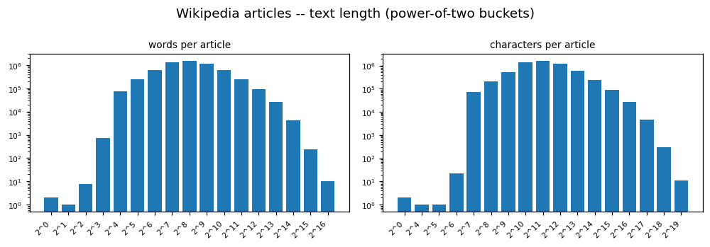
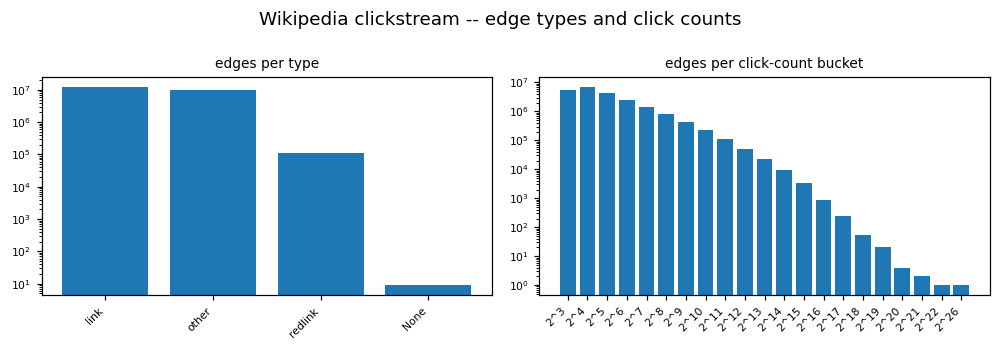

# WIKIPEDIA EDA PROFILE

_Auto-generated by the EDA notebooks (`databricks/eda/wikipedia/`). One `## ` section per notebook; re-running a notebook replaces its own section, other sections are preserved._

<!-- BEGIN wikipedia:01_wikipedia_articles -->
## Wikipedia article text (Samples: wikipedia-datasets)

### Profile

| frame | source files | rows | cols | constant columns | nested columns |
|---|---|---|---|---|---|
| parquet | 1098 | 5823210 | 7 | - | - |

### Provenance / Source Evidence

The dataset is read in place from the Databricks Samples Volume; there is no Bronze table and no ECRMAP acquisition step.
Files under `/Volumes/samples/databricks/datasets/wikipedia-datasets/data-001/en_wikipedia/articles-only-parquet`: 1101, 11336299529 bytes ({'other': 3, 'parquet': 1098}).
- No README / licence file in the directory: provenance and licence are not documented here (LIMITATION).

### Structural Integrity

- schema: `struct<title:string,id:int,revisionId:int,revisionTimestamp:timestamp,revisionUsername:string,revisionUsernameId:int,text:string,__file:string>`
- corrupt-record column present: False; nested columns: none.
- column roles resolved: {'id': 'id', 'title': 'title', 'text': 'text', 'revision': 'revisionId', 'timestamp': 'revisionTimestamp'}.

### Data Quality

Missingness (rate per column): title=0.0000, id=0.0000, revisionId=0.0000, revisionTimestamp=0.0000, revisionUsername=0.0000, revisionUsernameId=0.0000, text=0.0000
Duplicate texts: 1223219 groups holding 2447302 of 5823210 rows.
Duplicate id keys: 1394642 of 4428568 keys repeat, holding 2789284 rows (most rows per key 2); keys whose rows differ in: {'revision': 176968, 'title': 2220, 'text': 170931}.
Duplicate title keys: 1392656 of 4430553 keys repeat, holding 2785313 rows (most rows per key 3); keys whose rows differ in: {'id': 242, 'revision': 174969, 'text': 169442}.
Character issues: replacement character in 1054 rows, control characters in 0 rows, non-ASCII in 4011399 rows (share of characters 0.00318).
Markup (rows containing the pattern): {'newline': 0, 'inline_heading': 5451801, 'wiki_link': 5820760, 'template_brace': 5796597, 'html_tag': 4575843, 'url': 4543199, 'redirect': 4}.

### Entities / Keys

Key candidates (column: distinct / ratio-to-rows / unique):
- `id`: 4428568 / 0.760503 / unique=False
- `title`: 4430553 / 0.760844 / unique=False
- title forms: 0 empty, 0 with underscore, 0 with edge space, 30684 with colon, 5 disambiguation, 104648 list titles, 1951 digits only, 0 starting lowercase; after trimming, lower-casing and replacing underscores: 1395726 colliding groups over 2792740 rows.

### Text Structure

- articles 5823210; empty 2; under 200 characters 30016; total words 4103398363; longest article 801798 characters.
- words per article, quantiles p1/p25/p50/p75/p95/p99: [28, 171, 345, 727, 2415, 6094].
- characters per article, same quantiles: [236, 1568, 2875, 5878, 19212, 49639].
- articles above 190 words (proxy for one chunk): 4152147.
- sections (pieces between inline heading markers) in a 2% row sample of 115936 articles: 569719; articles with at least one marker 108487; sections per article p50/p95 [4, 13], max 450.
- words per section quantiles p1/p25/p50/p75/p95/p99: [1, 22, 76, 174, 480, 989]; longest 36441.
- sections above 190 words (proxy for a 256-token limit): 128257 of 569719. Words are a proxy; the token count belongs to the build that chunks the text.
- after stripping references, templates, links, tags, URLs and quote marks by regular expressions (2% row sample of 115936 articles): 53297310 of 82382333 words kept (0.647); cleaned words per article quantiles p1/p25/p50/p75/p95/p99 [16, 68, 186, 468, 1686, 4392]; under 50 cleaned words 20679; above 190 words 57296.

### Temporal Semantics

- `revisionTimestamp` (timestamp): 2006-02-21 21:00:39 .. 2015-10-03 22:38:11; nulls 0.
- rows per year (year, rows): [(2006, 521), (2007, 1474), (2008, 4231), (2009, 11510), (2010, 21531), (2011, 46745), (2012, 150311), (2013, 679394), (2014, 1225896), (2015, 3681597)].
- busiest months (month, rows): [('2015-08', 709670), ('2015-09', 707697), ('2015-07', 441745), ('2015-06', 408966), ('2015-05', 387032), ('2015-04', 306468), ('2015-03', 240819), ('2015-02', 201105), ('2013-03', 200170), ('2015-01', 197074), ('2014-12', 172941), ('2014-11', 153947)].

### Domain-Term Coverage

- text, rows matching domain terms (2% row sample of 115936 articles): {'energy': 1030, 'weather': 4023, 'commerce': 2558, 'aviation': 5239, 'mobility': 3758}.
- titles, rows matching domain terms (all 5823210 articles): {'energy': 1516, 'weather': 2880, 'commerce': 836, 'aviation': 18708, 'mobility': 28598}.
- term lists used: {'energy': ('electricity', 'power plant', 'wind power', 'solar power', 'renewable energy', 'electric grid'), 'weather': ('weather', 'climate', 'meteorology', 'precipitation', 'storm'), 'commerce': ('retail', 'e-commerce', 'online shopping', 'advertising', 'consumer'), 'aviation': ('airline', 'airport', 'aviation', 'aircraft', 'flight'), 'mobility': ('electric vehicle', 'charging station', 'public transport', 'railway')}. A proxy for relevance, not a selection rule.

### Distributions

- words per article (bucket, articles): - 2^0: 2 - 2^1: 1 - 2^2: 8 - 2^3: 742 - 2^4: 75351 - 2^5: 239288 - 2^6: 607912 - 2^7: 1322614 - 2^8: 1489833 - 2^9: 1115629 - 2^10: 600159 - 2^11: 248007 - 2^12: 92568 - 2^13: 26595 - 2^14: 4257 - 2^15: 234 - 2^16: 10
- characters per article (bucket, articles): - 2^0: 2 - 2^4: 1 - 2^5: 1 - 2^6: 23 - 2^7: 73293 - 2^8: 202948 - 2^9: 504530 - 2^10: 1354352 - 2^11: 1554475 - 2^12: 1162864 - 2^13: 601239 - 2^14: 244875 - 2^15: 91769 - 2^16: 27733 - 2^17: 4793 - 2^18: 301 - 2^19: 11

### EDA Findings

- rows=5823210, cols=7, constant=[], unique keys={'id': False, 'title': False}

### Observations by Area

- **Domain understanding:** one row per article with columns ['title', 'id', 'revisionId', 'revisionTimestamp', 'revisionUsername', 'revisionUsernameId', 'text']; text column `text`, title column `title`, id column `id`; domain terms in titles: {'energy': 1516, 'weather': 2880, 'commerce': 836, 'aviation': 18708, 'mobility': 28598}
- **Structure and engineering:** 1101 file(s), 11336299529 bytes, read as parquet; nested columns: none; constant columns: none; markup in rows: {'newline': 0, 'inline_heading': 5451801, 'wiki_link': 5820760, 'template_brace': 5796597, 'html_tag': 4575843, 'url': 4543199, 'redirect': 4}
- **Temporal:** `revisionTimestamp` range 2006-02-21 21:00:39 .. 2015-10-03 22:38:11
- **Spatial:** no supporting evidence in the data read here.
- **Data quality:** duplicate text groups 1223219; empty articles 2; under 200 characters 30016; replacement-character rows 1054; control-character rows 0; title collisions after normalising: 1395726 groups
- **Statistical patterns:** words per article p50 345, p99 6094; share of sections above the chunk proxy: 0.22512326252064616
- **Relationships:** id unique: False; title unique: False; repeated ids 1394642, repeated titles 1392656
- **Analytics use:** measures: article length; dimension: title forms (30684 with colon)
- **ML use:** no supporting evidence in the data read here.
- **AI / knowledge use:** free text in `text` with 4103398363 words; sections per article p50/p95 [4, 13]; no category or link column in the article frame

### Corpus Implications

- Chunk fit: the sections and the cleaned-length block (see Text Structure) indicate how often a 256-token limit would split or fail a piece of text; the exact count needs the model tokenizer.
- Cleaning: the markup counts, the kept-word share after stripping and the character issues show how much text needs cleaning before it can become a knowledge unit.
- Exclusion candidates: empty articles, very short articles, redirects, list titles, disambiguation titles, duplicate texts and repeated keys, with the counts above.
- Selection: the domain-term counts are a proxy only; the articles carry no category column unless listed in the structure block.
- Freshness: the revision timestamps above are the only date evidence in the copy; the upstream source is not read here.

### Figure -- Wikipedia articles -- text length (power-of-two buckets)

<!-- END wikipedia:01_wikipedia_articles -->

<!-- BEGIN wikipedia:02_wikipedia_clickstream -->
## Wikipedia clickstream (Samples: wikipedia-datasets)

### Profile

| frame | source files | edges | cols | constant columns | nested columns |
|---|---|---|---|---|---|
| json | 1 | 22509897 | 6 | - | - |

### Provenance / Source Evidence

The dataset is read in place from the Databricks Samples Volume; there is no Bronze table and no ECRMAP acquisition step.
Files under `/Volumes/samples/databricks/datasets/wikipedia-datasets/data-001/clickstream/raw-uncompressed-json`: 1, 2815233011 bytes ({'json': 1}).
First raw lines:
  > {"curr_id":"3632887","n":"121","prev_title":"other-google","curr_title":"!!","type":"other"}
  > {"curr_id":"3632887","n":"93","prev_title":"other-wikipedia","curr_title":"!!","type":"other"}
  > {"curr_id":"3632887","n":"46","prev_title":"other-empty","curr_title":"!!","type":"other"}
- No README / licence file in the directory: provenance and licence are not documented here (LIMITATION).

### Structural Integrity

- schema: `struct<curr_id:string,curr_title:string,n:string,prev_id:string,prev_title:string,type:string,__file:string>`
- corrupt-record column present: False; nested columns: none.
- column roles resolved: {'prev_id': 'prev_id', 'curr_id': 'curr_id', 'prev_title': 'prev_title', 'curr_title': 'curr_title', 'count': 'n', 'type': 'type'}.

### Data Quality

Missingness (rate per column): curr_id=0.0051, curr_title=0.0000, n=0.0000, prev_id=0.3544, prev_title=0.0000, type=0.0000
Duplicates on ['prev_title', 'curr_title', 'type']: 14 duplicated keys out of 22509883 (0 identical, 14 conflicting).
Self-loops (rows where both ends are equal): {'prev_id==curr_id': 37486, 'prev_title==curr_title': 37490}.
- type `link`: {'t': 'link', 'edges': 12366769, 'prev_id_missing': 0, 'curr_id_missing': 0}
- type `other`: {'t': 'other', 'edges': 10029239, 'prev_id_missing': 7976429, 'curr_id_missing': 0}
- type `redlink`: {'t': 'redlink', 'edges': 113880, 'prev_id_missing': 0, 'curr_id_missing': 113880}
- type `None`: {'t': None, 'edges': 9, 'prev_id_missing': 2, 'curr_id_missing': 1}

### Entities / Keys

- `curr_id` -> `curr_title`: 3073610 ids, 1 map to more than one title.
- `prev_id` -> `prev_title`: 1441513 ids, 1 map to more than one title.
- distinct current titles: 3181383; 1 empty, 2793932 with underscore, 26318 with colon, 28010 disambiguation, 70672 list titles; 4692 groups collide after trimming, lower-casing and replacing underscores.

### Edge Structure

- type `link`: 12366769 edges, 9.85e+08 clicks.
- type `other`: 10029239 edges, 2.295e+09 clicks.
- type `redlink`: 113880 edges, 3.509e+06 clicks.
- type `None`: 9 edges, 363 clicks.
- `n`: numeric yield 100.0%, range 10.0..111855861.0, mean 145.8, zero 0, negative 0.
- `n` quantiles p1/p25/p50/p75/p99: ['10', '15', '26', '62', '1779'].
- in-degree by current title (link edges): 2046152 titles; edges per title p50/p90/p99 [2, 12, 64], max 3981; clicks per title p50/p90/p99 [71.0, 877.0, 7099.0], max 843235.0; the top 1% of titles hold 0.3371 of the clicks.
  top titles (title, clicks, edges): [('Deaths_in_2015', 843235.0, 35), ('Fifty_Shades_of_Grey_(film)', 560081.0, 79), ('87th_Academy_Awards', 442508.0, 277), ('Birdman_(film)', 412150.0, 163), ('Islamic_State_of_Iraq_and_the_Levant', 398371.0, 510), ('Dakota_Johnson', 376379.0, 45), ('Fifty_Shades_Darker', 318767.0, 8), ('Jamie_Dornan', 298281.0, 51), ('Fifty_Shades_Freed', 296862.0, 7), ('Jane_Wilde_Hawking', 267953.0, 18)]
- out-degree by previous title (link edges): 1383299 titles; edges per title p50/p90/p99 [3, 21, 91], max 1340; clicks per title p50/p90/p99 [74.0, 1097.0, 10802.0], max 1939796.0; the top 1% of titles hold 0.424 of the clicks.
  top titles (title, clicks, edges): [('Main_Page', 1939796.0, 95), ('87th_Academy_Awards', 1657681.0, 516), ('Fifty_Shades_of_Grey_(film)', 1338492.0, 177), ('Fifty_Shades_of_Grey', 1132281.0, 122), ('2015_in_film', 1022382.0, 1178), ('Deaths_in_2015', 936162.0, 771), ('The_Walking_Dead_(TV_series)', 842315.0, 242), ('Better_Call_Saul', 798072.0, 101), ('Chris_Kyle', 788700.0, 103), ('Birdman_(film)', 752277.0, 162)]

### Distributions

- edges per click-count bucket (bucket, edges): - 2^3: 5625065 - 2^4: 7065101 - 2^5: 4250271 - 2^6: 2500987 - 2^7: 1434962 - 2^8: 791507 - 2^9: 422035 - 2^10: 220093 - 2^11: 110080 - 2^12: 52207 - 2^13: 23397 - 2^14: 9693 - 2^15: 3281 - 2^16: 885 - 2^17: 252 - 2^18: 53 - 2^19: 20 - 2^20: 4 - 2^21: 2 - 2^22: 1 - 2^26: 1

### EDA Findings

- edges=22509897, cols=6, constant=[], types=['link', 'other', 'redlink', None]

### Observations by Area

- **Domain understanding:** one row per directed edge between a previous and a current page with a click count and a type; columns ['curr_id', 'curr_title', 'n', 'prev_id', 'prev_title', 'type']; edge types: [('link', 12366769), ('other', 10029239), ('redlink', 113880), (None, 9)]
- **Structure and engineering:** 1 file(s), 2815233011 bytes, read as json; nested columns: none; constant columns: none
- **Temporal:** no time column in the edge frame
- **Spatial:** no supporting evidence in the data read here.
- **Data quality:** duplicate edge keys 14; self-loops {'prev_id==curr_id': 37486, 'prev_title==curr_title': 37490}; id-to-title inconsistencies: [('curr_id', 1), ('prev_id', 1)]
- **Statistical patterns:** click-count quantiles ['10', '15', '26', '62', '1779']; click concentration in the top 1% of current titles: 0.3371
- **Relationships:** graph: 2046152 titles with inbound link edges, 1383299 with outbound
- **Analytics use:** measure: click count; dimensions: edge type, previous and current title (type values 4)
- **ML use:** no supporting evidence in the data read here.
- **AI / knowledge use:** a weighted link graph of 22509897 edges; link edges only: filter `type == link`

### Corpus Implications

- Graph: the link edges give the page-to-page relation a Knowledge Graph would use; the title form and the id-to-title consistency above decide how nodes are keyed.
- Non-link edges: the other types are external or empty referrers and are not page-to-page relations; their counts are above.
- Weight: click counts are a measured weight; the concentration figures show how skewed they are.
- Date: the copy carries no time column; the file name is the only date evidence (read in the provenance block).

### Figure -- Wikipedia clickstream -- edge types and click counts

<!-- END wikipedia:02_wikipedia_clickstream -->

<!-- BEGIN wikipedia:03_wikipedia_relationships_and_findings -->
## Cross-table relationships (articles and clickstream)

### Key Overlap

- article titles against current titles of link edges: 4426196 article keys, 2044911 edge keys, 1661167 in both; 0.3753 of the article keys appear in the edges, 0.8123 of the edge keys have an article.
- article titles against previous titles of link edges: 4426196 article keys, 1381244 edge keys, 1089499 in both; 0.2461 of the article keys appear in the edges, 0.7888 of the edge keys have an article.
- article ids against current ids of link edges (exact match): 4428568 article keys, 2046153 edge keys, 1676085 in both; 0.3785 of the article keys appear in the edges, 0.8191 of the edge keys have an article.

### Click Coverage

- clicks landing on a known article (link edges): 9654479 of 12366769 edges (0.7807), 7.536e+08 of 9.85e+08 clicks (0.7651).
- clicks leaving from a known article (link edges): 9423141 of 12366769 edges (0.762), 7.612e+08 of 9.85e+08 clicks (0.7728).
- most clicked destinations (title, clicks, article exists): [('Deaths_in_2015', 843235.0, True), ('Fifty_Shades_of_Grey_(film)', 560081.0, True), ('87th_Academy_Awards', 442508.0, True), ('Birdman_(film)', 412150.0, True), ('Islamic_State_of_Iraq_and_the_Levant', 398371.0, True), ('Dakota_Johnson', 376379.0, True), ('Fifty_Shades_Darker', 318767.0, False), ('Jamie_Dornan', 298281.0, True), ('Fifty_Shades_Freed', 296862.0, True), ('Jane_Wilde_Hawking', 267953.0, True), ('List_of_Arrow_episodes', 256477.0, True), ('The_Walking_Dead_(season_5)', 235416.0, True), ('United_States', 233613.0, True), ('Chris_Kyle', 218006.0, True), ('Eddie_Redmayne', 197607.0, True), ('Melanie_Griffith', 194927.0, True), ('Don_Johnson', 194642.0, True), ('Avengers:_Age_of_Ultron', 192029.0, True), ('UFC_Fight_Night:_Bigfoot_vs._Mir', 190628.0, True), ('Amelia_Warner', 188988.0, False)]

### Domain-Term Clicks

- link clicks on titles matching domain terms (of 9.85e+08 clicks): {'energy': '2.748e+04', 'weather': '1.909e+04', 'commerce': '2.464e+04', 'aviation': '9.474e+04', 'mobility': '4353'}.
- term lists used: {'energy': ('electricity', 'power plant', 'wind power', 'solar power', 'renewable energy', 'electric grid'), 'weather': ('weather', 'climate', 'meteorology', 'precipitation', 'storm'), 'commerce': ('retail', 'e-commerce', 'online shopping', 'advertising', 'consumer'), 'aviation': ('airline', 'airport', 'aviation', 'aircraft', 'flight'), 'mobility': ('electric vehicle', 'charging station', 'public transport', 'railway')}. A proxy, not a selection rule.

### EDA Findings

- article titles in the link edges: 0.3753; link clicks landing on a known article: 0.7651

### Observations by Area

- **Domain understanding:** the article frame holds page text; the clickstream holds weighted page-to-page edges between the same pages
- **Structure and engineering:** keys: article {'id': 'id', 'title': 'title'}; clickstream {'prev_title': 'prev_title', 'curr_title': 'curr_title', 'curr_id': 'curr_id', 'count': 'n', 'type': 'type'}
- **Temporal:** the two frames carry no common time column; the snapshots may differ in date
- **Spatial:** no supporting evidence in the data read here.
- **Data quality:** edge titles without an article: 383744 of 2044911 distinct current titles
- **Statistical patterns:** click weight on known articles: 0.7651 (landing), 0.7728 (leaving)
- **Relationships:** title overlap shares: article keys in edges 0.3753, edge keys with an article 0.8123; id overlap: {'a_distinct': 4428568, 'b_distinct': 2046153, 'both': 1676085, 'a_share_in_b': 0.3785, 'b_share_in_a': 0.8191}
- **Analytics use:** link clicks on domain-term titles: {'energy': '2.748e+04', 'weather': '1.909e+04', 'commerce': '2.464e+04', 'aviation': '9.474e+04', 'mobility': '4353'}
- **ML use:** no supporting evidence in the data read here.
- **AI / knowledge use:** articles and link edges join on the normalised title; the overlap shares above decide how much of the graph attaches to article text

### Corpus Implications

- Join key: the overlap block shows whether the title or the id joins the two frames and how much falls out.
- Graph without text: edge titles that have no article cannot carry text; their share is in the coverage block.
- Text without graph: article keys that appear in no link edge have no neighbours.
- Selection: the domain-term clicks are the only relevance signal in the clickstream; they match on the title text only.

<!-- END wikipedia:03_wikipedia_relationships_and_findings -->
